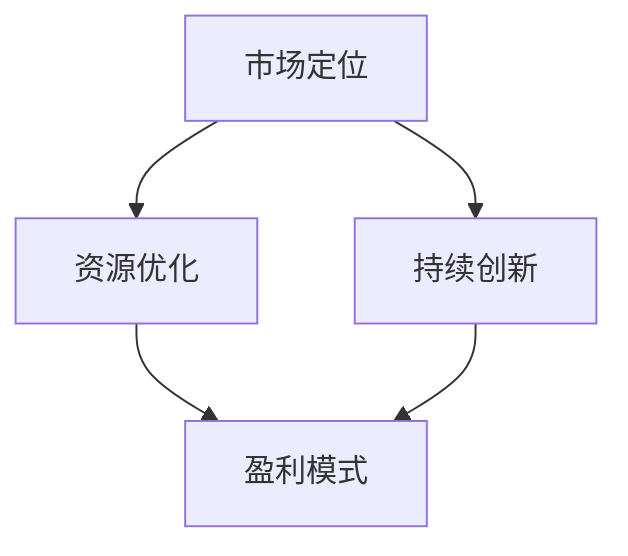

                 

### 一人创业公司如何实现快速盈利

> **关键词：** 单人创业、快速盈利、策略、市场分析、持续创新

> **摘要：** 本文将深入探讨一人创业公司如何通过精准市场定位、高效资源利用、持续创新等策略，实现快速盈利。通过详细的分析和实际案例，旨在为创业者提供实用的指导。

创业的道路充满挑战和不确定性，但也是实现自我价值和财富增长的重要途径。对于许多创业者来说，如何在竞争激烈的市场中迅速立足并实现盈利，是成功的关键。本文将围绕这一核心问题，从多个角度提供策略和建议。

### 1. 背景介绍

#### 1.1 目的和范围

本文旨在为那些希望以一人之力创立公司的创业者提供实用的指导。我们将探讨一系列关键策略，包括市场定位、资源优化、持续创新等，帮助创业者更快实现盈利。

#### 1.2 预期读者

预期读者包括：

- 有志于创业的个人
- 创业初期的创业者
- 对创业管理感兴趣的专业人士

#### 1.3 文档结构概述

本文结构如下：

1. **背景介绍**：介绍文章的目的、读者群体和文档结构。
2. **核心概念与联系**：阐述关键概念，并提供流程图。
3. **核心算法原理 & 具体操作步骤**：详细讲解实现快速盈利的算法原理和步骤。
4. **数学模型和公式 & 详细讲解 & 举例说明**：运用数学模型和公式，说明核心概念。
5. **项目实战：代码实际案例和详细解释说明**：提供实际代码案例，分析其实现过程。
6. **实际应用场景**：讨论不同场景下的应用策略。
7. **工具和资源推荐**：推荐学习资源、开发工具和框架。
8. **总结：未来发展趋势与挑战**：预测行业趋势和面临的挑战。
9. **附录：常见问题与解答**：解答读者可能遇到的问题。
10. **扩展阅读 & 参考资料**：提供更多深入学习的资源。

#### 1.4 术语表

以下是一些本文中会涉及的关键术语：

- **市场定位**：确定产品或服务在市场中的位置，满足特定用户群体的需求。
- **资源优化**：有效利用有限的资源，提高效率。
- **持续创新**：不断改进产品或服务，以适应市场变化。

#### 1.4.1 核心术语定义

- **市场定位**：在市场中为产品或服务找到一个独特且具有吸引力的位置，满足特定用户群体的需求。
- **资源优化**：在有限的资源下，通过合理分配和高效利用，实现最大化的价值。
- **持续创新**：持续地对产品或服务进行改进，以保持竞争力。

#### 1.4.2 相关概念解释

- **市场分析**：研究市场需求、竞争对手、用户行为等，以指导决策。
- **商业模式**：公司通过提供产品或服务获取利润的方式。
- **用户体验**：用户在使用产品或服务时的感受和体验。

#### 1.4.3 缩略词列表

- **SaaS**：软件即服务（Software as a Service）
- **IaaS**：基础设施即服务（Infrastructure as a Service）
- **PaaS**：平台即服务（Platform as a Service）
- **AI**：人工智能（Artificial Intelligence）

### 2. 核心概念与联系

在探讨如何实现快速盈利之前，我们需要了解一些核心概念及其相互之间的联系。以下是关键概念及其关系的Mermaid流程图：



#### 2.1 市场定位

市场定位是创业成功的关键一步。通过深入了解市场需求和用户行为，创业者可以为产品或服务找到一个独特的市场位置。市场定位的目的是确保产品或服务能够满足特定用户群体的需求，从而获得竞争优势。

#### 2.2 资源优化

资源优化是提高效率、降低成本的重要手段。创业者需要合理利用有限的资源，包括时间、资金和人力。通过优化资源配置，企业可以最大化其价值，提高盈利能力。

#### 2.3 持续创新

持续创新是保持竞争力的关键。随着市场环境和用户需求的变化，创业者需要不断改进产品或服务。这不仅可以吸引新客户，还能提高现有客户的满意度，从而实现长期盈利。

#### 2.4 盈利模式

盈利模式是企业通过提供产品或服务获取利润的方式。有效的盈利模式能够确保企业的可持续发展和盈利能力。不同的商业模式适用于不同的市场环境和业务场景。

### 3. 核心算法原理 & 具体操作步骤

在了解了核心概念后，接下来我们将探讨如何将这些概念转化为实际操作步骤，以实现快速盈利。

#### 3.1 市场定位

**算法原理：** 市场定位的关键在于对市场需求和用户行为的深入了解。以下是市场定位的伪代码：

```python
def market_positioning():
    # 收集市场数据
    data = collect_market_data()
    
    # 分析用户需求
    user Needs = analyze_user_needs(data)
    
    # 确定市场定位
    position = determine_market_position(user_Needs)
    
    return position
```

**具体操作步骤：**

1. **收集市场数据**：通过市场调研、竞品分析等方式，收集关于市场需求、用户行为和竞争环境的数据。
2. **分析用户需求**：对收集的数据进行分析，了解用户的具体需求和偏好。
3. **确定市场定位**：根据用户需求和市场环境，为产品或服务确定一个独特的市场位置。

#### 3.2 资源优化

**算法原理：** 资源优化涉及对时间、资金和人力等资源的合理分配和利用。以下是资源优化的伪代码：

```python
def resource_optimization():
    # 评估现有资源
    resources = evaluate_resources()
    
    # 确定资源优先级
    priority = determine_resource_priority(resources)
    
    # 调配资源
    allocated_resources = allocate_resources(priority)
    
    return allocated_resources
```

**具体操作步骤：**

1. **评估现有资源**：评估企业当前可用的资源，包括时间、资金和人力等。
2. **确定资源优先级**：根据业务目标和市场需求，确定资源的优先级。
3. **调配资源**：根据资源优先级，合理调配资源，确保资源得到最大化的利用。

#### 3.3 持续创新

**算法原理：** 持续创新涉及对产品或服务的不断改进，以适应市场变化。以下是持续创新的伪代码：

```python
def continuous_innovation():
    # 监测市场变化
    market_changes = monitor_market_changes()
    
    # 分析市场变化
    analyzed_changes = analyze_market_changes(market_changes)
    
    # 确定创新方向
    innovation_direction = determine_innovation_direction(analyzed_changes)
    
    # 实施创新
    implemented_innovation = implement_innovation(innovation_direction)
    
    return implemented_innovation
```

**具体操作步骤：**

1. **监测市场变化**：持续关注市场动态，了解市场变化。
2. **分析市场变化**：对市场变化进行分析，确定其对产品或服务的影响。
3. **确定创新方向**：根据市场变化，确定产品或服务的改进方向。
4. **实施创新**：根据创新方向，实施具体的改进措施。

### 4. 数学模型和公式 & 详细讲解 & 举例说明

在实现快速盈利的过程中，数学模型和公式可以帮助我们更好地理解市场定位、资源优化和持续创新之间的关系。以下是相关的数学模型和公式及其应用。

#### 4.1 市场份额计算

**公式：** 市场份额（Market Share）=（企业销售额 / 市场总销售额）× 100%

**详细讲解：** 市场份额是衡量企业市场地位的重要指标。通过计算市场份额，企业可以了解自己在市场中的占比，从而制定相应的营销策略。

**举例说明：** 假设某企业在竞争激烈的市场中占据了20%的市场份额，这意味着每五个购买者中就有一个选择该企业的产品。

#### 4.2 资本回报率（ROI）计算

**公式：** 资本回报率（ROI）=（投资回报 - 投资成本）/ 投资成本 × 100%

**详细讲解：** 资本回报率是衡量投资收益的重要指标。通过计算ROI，企业可以评估不同投资方案的经济效益。

**举例说明：** 假设某创业者投资10万元启动公司，经过一年的运营，实现了15万元的盈利。那么该投资的ROI为150%。

#### 4.3 用户留存率计算

**公式：** 用户留存率 =（月末留存用户数 / 月初活跃用户数）× 100%

**详细讲解：** 用户留存率是衡量产品或服务用户黏性的重要指标。通过计算用户留存率，企业可以了解用户的使用习惯和满意度。

**举例说明：** 假设某产品在一个月内有1000个活跃用户，月末仍有800个用户活跃。那么该产品的用户留存率为80%。

### 5. 项目实战：代码实际案例和详细解释说明

为了更好地理解如何将上述概念和算法应用于实际项目中，我们将通过一个简单的项目案例来展示如何实现快速盈利。

#### 5.1 开发环境搭建

在本案例中，我们将使用Python作为主要编程语言，搭建一个基于SaaS的在线任务管理平台。以下是开发环境的搭建步骤：

1. **安装Python**：在官方网站下载并安装Python。
2. **安装相关库**：使用pip安装必需的库，如Flask（用于构建Web应用）、SQLite（用于数据库存储）等。

#### 5.2 源代码详细实现和代码解读

以下是任务管理平台的源代码及详细解读：

```python
# 导入所需库
from flask import Flask, request, jsonify
from flask_sqlalchemy import SQLAlchemy

# 初始化Flask应用
app = Flask(__name__)

# 配置数据库
app.config['SQLALCHEMY_DATABASE_URI'] = 'sqlite:///tasks.db'
db = SQLAlchemy(app)

# 定义任务模型
class Task(db.Model):
    id = db.Column(db.Integer, primary_key=True)
    title = db.Column(db.String(100), nullable=False)
    description = db.Column(db.Text, nullable=True)
    status = db.Column(db.String(50), nullable=False, default='pending')

# 创建数据库和表
db.create_all()

# 添加任务
@app.route('/tasks', methods=['POST'])
def add_task():
    data = request.get_json()
    new_task = Task(title=data['title'], description=data['description'])
    db.session.add(new_task)
    db.session.commit()
    return jsonify({'message': 'Task added successfully'})

# 获取所有任务
@app.route('/tasks', methods=['GET'])
def get_tasks():
    tasks = Task.query.all()
    return jsonify([{'id': task.id, 'title': task.title, 'description': task.description, 'status': task.status} for task in tasks])

# 修改任务状态
@app.route('/tasks/<int:task_id>', methods=['PUT'])
def update_task(task_id):
    task = Task.query.get_or_404(task_id)
    data = request.get_json()
    task.status = data['status']
    db.session.commit()
    return jsonify({'message': 'Task updated successfully'})

# 删除任务
@app.route('/tasks/<int:task_id>', methods=['DELETE'])
def delete_task(task_id):
    task = Task.query.get_or_404(task_id)
    db.session.delete(task)
    db.session.commit()
    return jsonify({'message': 'Task deleted successfully'})

# 运行应用
if __name__ == '__main__':
    app.run(debug=True)
```

#### 5.3 代码解读与分析

以上代码实现了一个简单的在线任务管理平台，包括添加任务、获取所有任务、修改任务状态和删除任务等基本功能。

1. **初始化Flask应用**：首先，我们初始化Flask应用并配置数据库。
2. **定义任务模型**：使用Flask-SQLAlchemy创建任务模型，包括任务ID、标题、描述和状态等字段。
3. **创建数据库和表**：使用`db.create_all()`创建数据库和任务表。
4. **添加任务**：使用`POST`请求添加任务，将任务数据存储到数据库。
5. **获取所有任务**：使用`GET`请求获取所有任务，返回任务列表。
6. **修改任务状态**：使用`PUT`请求修改任务状态，更新数据库记录。
7. **删除任务**：使用`DELETE`请求删除任务，从数据库中移除记录。
8. **运行应用**：最后，使用`app.run(debug=True)`启动应用，在调试模式下运行。

#### 5.4 实现快速盈利的思考

通过以上代码案例，我们可以看到如何利用Flask和数据库技术构建一个简单的SaaS平台。然而，要实现快速盈利，还需要考虑以下几个方面：

1. **市场定位**：明确目标用户群体，提供具有吸引力的功能和服务，以满足市场需求。
2. **资源优化**：合理利用时间、资金和人力等资源，确保高效运营。
3. **持续创新**：持续改进产品功能和服务质量，提高用户满意度和留存率。
4. **盈利模式**：探索多元化的盈利模式，如订阅收费、增值服务、广告收入等。

### 6. 实际应用场景

在实际应用中，一人创业公司可以通过多种方式实现快速盈利。以下是一些常见的应用场景：

1. **在线教育平台**：随着在线教育市场的兴起，创业者可以开发一个针对特定领域的在线教育平台，提供课程、直播、互动等功能，通过课程收费或会员订阅等方式实现盈利。
2. **电子商务**：利用社交媒体平台，创业者可以开展电子商务业务，销售特色商品，通过平台佣金、广告收入等方式实现盈利。
3. **软件开发**：创业者可以专注于软件开发，为客户提供定制化的解决方案，通过项目收费或订阅服务等方式实现盈利。
4. **内容创作**：在短视频、博客等领域，创业者可以创作高质量的内容，通过广告、会员订阅等方式实现盈利。

### 7. 工具和资源推荐

为了帮助创业者更好地实现快速盈利，我们推荐以下工具和资源：

#### 7.1 学习资源推荐

- **书籍推荐**：
  - 《精益创业》（The Lean Startup）：介绍了如何通过迭代和验证快速找到市场机会。
  - 《创业维艰》（Startup Life）：分享了创业过程中的挑战和经验。
- **在线课程**：
  - Coursera的《创业管理》：提供系统的创业知识和技能。
  - Udemy的《如何创业》：介绍创业的基本流程和策略。
- **技术博客和网站**：
  - Hacker Noon：分享创业经验和技术文章。
  - Medium：涵盖创业、技术和商业领域的优秀内容。

#### 7.2 开发工具框架推荐

- **IDE和编辑器**：
  - Visual Studio Code：功能强大且轻量级的代码编辑器。
  - PyCharm：适用于Python开发的集成开发环境。
- **调试和性能分析工具**：
  - Postman：API调试和测试工具。
  - New Relic：性能监控和故障排除工具。
- **相关框架和库**：
  - Flask：Python Web开发框架。
  - React：用于构建用户界面的JavaScript库。

#### 7.3 相关论文著作推荐

- **经典论文**：
  - "The Lean Startup" by Eric Ries。
  - "Crossing the Chasm" by Geoffrey A. Moore。
- **最新研究成果**：
  - "Deep Learning for Natural Language Processing" by Yoav Goldberg。
  - "A Theoretically Grounded Approach to Online Advertising" by Jennifer Wortman Vaughan。
- **应用案例分析**：
  - "The Startup Playbook" by Spotify。
  - "The Growth Hacker's Guide to the Universe" by Dave Gerhardt。

### 8. 总结：未来发展趋势与挑战

在未来，一人创业公司实现快速盈利的趋势将呈现以下几个特点：

1. **技术创新**：随着人工智能、大数据等技术的快速发展，创业者可以利用这些先进技术提升产品竞争力。
2. **市场细分**：市场细分将越来越精细化，创业者可以通过精准定位找到特定的市场机会。
3. **多元化盈利模式**：创业者将探索更多元化的盈利模式，如订阅服务、平台佣金、广告收入等。

然而，快速盈利也面临以下挑战：

1. **竞争加剧**：随着市场参与者增多，竞争将变得更加激烈。
2. **资源限制**：一人创业公司通常资源有限，需要高效利用时间、资金和人力等资源。
3. **用户留存**：保持用户留存和提高用户满意度是持续盈利的关键。

### 9. 附录：常见问题与解答

以下是一些读者可能遇到的问题及其解答：

**Q1：如何快速找到市场需求？**

A1：通过市场调研、竞品分析、用户访谈等方式，深入了解市场需求和用户行为，从而找到潜在的市场机会。

**Q2：如何优化资源配置？**

A2：制定明确的业务目标，根据目标合理分配资源，优先处理关键任务，避免资源浪费。

**Q3：如何确保持续创新？**

A3：建立创新文化，鼓励团队成员提出创意，定期评估产品或服务的改进方向，持续优化。

**Q4：如何提高用户满意度？**

A4：关注用户反馈，不断改进产品功能和服务质量，提高用户体验，增强用户忠诚度。

### 10. 扩展阅读 & 参考资料

为了进一步深入了解一人创业公司如何实现快速盈利，以下是相关扩展阅读和参考资料：

- 《精益创业》（The Lean Startup）- Eric Ries
- 《创业维艰》（Startup Life）- Jerry Colonna
- 《创业启示录》（Founders at Work）- Jessica Livingston
- "The Lean Startup" - Eric Ries
- "Crossing the Chasm" - Geoffrey A. Moore
- "Deep Learning for Natural Language Processing" - Yoav Goldberg
- "A Theoretically Grounded Approach to Online Advertising" - Jennifer Wortman Vaughan
- "The Startup Playbook" - Spotify
- "The Growth Hacker's Guide to the Universe" - Dave Gerhardt

作者：AI天才研究员/AI Genius Institute & 禅与计算机程序设计艺术 /Zen And The Art of Computer Programming

通过以上详细的分析和案例，我们希望读者能够更好地理解一人创业公司如何实现快速盈利的各个关键步骤和策略。在创业的道路上，持续学习和实践是取得成功的关键。祝每一位创业者都能实现自己的梦想，收获丰硕的成果！

