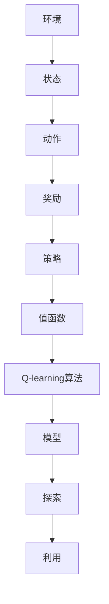

                 

# 一切皆是映射：AI Q-learning知识框架搭建

> **关键词：** 强化学习，Q-learning，知识框架，映射，人工智能，框架搭建，算法原理，数学模型，实战案例

> **摘要：** 本文将探讨AI中的Q-learning算法及其知识框架的搭建过程。我们将从背景介绍、核心概念、算法原理、数学模型、实战案例等多个角度详细分析Q-learning算法，帮助读者深入理解这一强化学习中的重要算法，并掌握其知识框架的构建方法。

## 1. 背景介绍

### 1.1 目的和范围

本文旨在为AI领域的研究者与实践者提供一份详尽的Q-learning算法知识框架搭建指南。我们将通过系统化的分析和讲解，帮助读者全面了解Q-learning算法的核心概念、原理以及在实际应用中的操作步骤。本文的目标读者包括：
- 对强化学习有一定了解，但希望深入掌握Q-learning算法的研究者；
- 想要在实际项目中应用Q-learning算法的开发者；
- 对计算机科学和人工智能充满好奇，希望提升自身技术水平的爱好者。

### 1.2 预期读者

预期读者需要对基本的线性代数和概率论有一定了解，同时掌握至少一种编程语言，例如Python。对于没有强化学习背景的读者，本文会通过逐步讲解，使其能够逐步理解和掌握Q-learning算法的基本原理和应用。

### 1.3 文档结构概述

本文将分为以下几个部分：
- **第1章** 背景介绍：介绍本文的目的、预期读者以及文档结构。
- **第2章** 核心概念与联系：讨论Q-learning算法中的核心概念及其相互关系。
- **第3章** 核心算法原理 & 具体操作步骤：详细解释Q-learning算法的原理，并给出伪代码实现。
- **第4章** 数学模型和公式 & 详细讲解 & 举例说明：讲解Q-learning算法的数学模型和公式，并通过实例进行说明。
- **第5章** 项目实战：代码实际案例和详细解释说明：通过一个实际项目，展示Q-learning算法的代码实现及其解释。
- **第6章** 实际应用场景：探讨Q-learning算法在不同场景中的应用。
- **第7章** 工具和资源推荐：推荐学习资源、开发工具框架和相关的论文著作。
- **第8章** 总结：未来发展趋势与挑战：总结本文内容，并讨论未来Q-learning算法的发展趋势和面临的挑战。
- **第9章** 附录：常见问题与解答：回答读者可能遇到的一些常见问题。
- **第10章** 扩展阅读 & 参考资料：提供相关的扩展阅读和参考资料。

### 1.4 术语表

#### 1.4.1 核心术语定义

- **强化学习（Reinforcement Learning）**：一种机器学习方法，通过与环境的交互来学习最优策略。
- **Q-learning**：一种基于值函数的强化学习算法，用于学习最优动作值函数。
- **状态（State）**：系统在某一时刻所处的情境或条件。
- **动作（Action）**：系统可以执行的行为或决策。
- **奖励（Reward）**：系统在执行某一动作后获得的奖励或惩罚。
- **策略（Policy）**：从给定状态中选择最优动作的规则或函数。

#### 1.4.2 相关概念解释

- **状态-动作值函数（State-Action Value Function）**：定义了在特定状态下执行特定动作的预期奖励。
- **模型（Model）**：对环境行为的抽象表示，用于预测下一状态和奖励。
- **探索（Exploration）**：在强化学习过程中，通过随机选择动作来探索环境的行为。
- **利用（Utilization）**：在强化学习过程中，根据当前状态和动作值函数选择最优动作的行为。

#### 1.4.3 缩略词列表

- **Q-learning**：一种基于值函数的强化学习算法。
- **RL**：强化学习（Reinforcement Learning）。

## 2. 核心概念与联系

在深入探讨Q-learning算法之前，我们需要先了解一些核心概念及其相互关系。以下是一个Mermaid流程图，用于展示Q-learning算法中的核心概念和它们之间的联系：



- **环境（Environment）**：环境是Q-learning算法运作的场所，它决定了状态、动作和奖励。
- **状态（State）**：状态是系统在某一时刻所处的情境或条件，Q-learning算法需要根据当前状态来选择最优动作。
- **动作（Action）**：动作是系统可以执行的行为或决策，每个动作都会导致系统状态的变化。
- **奖励（Reward）**：奖励是系统在执行某一动作后获得的奖励或惩罚，奖励的目的是引导系统学习最优策略。
- **策略（Policy）**：策略是从给定状态中选择最优动作的规则或函数，策略的目标是最大化长期奖励。
- **值函数（Value Function）**：值函数定义了在特定状态下执行特定动作的预期奖励，是Q-learning算法的核心。
- **Q-learning算法**：Q-learning算法是一种基于值函数的强化学习算法，它通过不断更新值函数来学习最优策略。
- **模型（Model）**：模型是对环境行为的抽象表示，用于预测下一状态和奖励，有助于提高Q-learning算法的效率。
- **探索（Exploration）**：探索是Q-learning算法中的一个重要过程，它通过随机选择动作来增加学习多样性。
- **利用（Utilization）**：利用是Q-learning算法中根据当前状态和动作值函数选择最优动作的行为，以最大化长期奖励。

这些核心概念相互联系，共同构成了Q-learning算法的基础。通过理解这些概念，我们可以更好地掌握Q-learning算法的原理和应用。

## 3. 核心算法原理 & 具体操作步骤

### 3.1 Q-learning算法的原理

Q-learning算法是一种基于值函数的强化学习算法，其核心思想是学习一个值函数，用以估计在给定状态下执行特定动作所能获得的预期奖励。具体来说，Q-learning算法通过迭代更新状态-动作值函数，从而逐渐找到最优策略。

Q-learning算法的原理可以概括为以下几个步骤：

1. **初始化值函数**：首先，我们需要初始化值函数Q(s, a)，其中s表示状态，a表示动作。初始化值函数的方法有很多，例如随机初始化或使用经验初始化。
2. **选择动作**：在给定状态下，Q-learning算法通过策略选择动作。策略可以是确定性策略（总是选择最大值动作）或随机策略（选择概率分布较大的动作）。
3. **执行动作**：执行选定的动作，系统状态发生改变，并获得相应的奖励。
4. **更新值函数**：根据新的状态和获得的奖励，更新值函数Q(s, a)。
5. **重复步骤2-4**：不断重复上述步骤，直到找到最优策略或达到某个停止条件。

### 3.2 Q-learning算法的具体操作步骤

以下是一个详细的伪代码，用于展示Q-learning算法的操作步骤：

```python
# 初始化参数
initial_q_value = 0
learning_rate = 0.1
discount_factor = 0.9
exploration_rate = 1.0

# 初始化值函数Q(s, a)
Q = initialize_q_matrix(initial_q_value)

# 初始化状态s
s = current_state()

# 主循环
while not stop_condition:
    # 根据当前策略选择动作a
    a = choose_action(Q, s, exploration_rate)
    
    # 执行动作a，获得状态s'和奖励r
    s', r = execute_action(a)
    
    # 更新值函数Q(s, a)
    Q[s][a] = Q[s][a] + learning_rate * (r + discount_factor * max(Q[s'][all_actions]) - Q[s][a])
    
    # 更新状态s
    s = s'
    
    # 更新探索率
    exploration_rate = decay(exploration_rate)
```

### 3.3 伪代码解释

- **初始化参数**：初始化值函数Q(s, a)的初始值，学习率，折扣因子和探索率。
- **初始化值函数Q(s, a)**：使用随机初始化或经验初始化方法初始化值函数。
- **初始化状态s**：设置当前状态s。
- **主循环**：不断执行以下步骤，直到满足停止条件：
  - **选择动作a**：根据当前值函数Q(s, a)和探索率，选择动作a。如果探索率较高，则随机选择动作；如果探索率较低，则选择具有最大值动作。
  - **执行动作a**：执行选定的动作a，并获得新的状态s'和奖励r。
  - **更新值函数Q(s, a)**：根据新的状态s'和获得的奖励r，使用学习率和折扣因子更新值函数Q(s, a)。
  - **更新状态s**：将当前状态s更新为新的状态s'。
  - **更新探索率**：根据预定的策略更新探索率，通常使用指数衰减策略。

通过以上步骤，Q-learning算法能够逐渐学习到最优策略，从而实现强化学习任务。

## 4. 数学模型和公式 & 详细讲解 & 举例说明

### 4.1 数学模型

Q-learning算法的核心是状态-动作值函数Q(s, a)，它定义了在给定状态下执行特定动作所能获得的预期奖励。以下是Q-learning算法的数学模型和公式：

1. **初始化**：

   $$
   Q(s, a)_{init} = 0
   $$

   初始化状态-动作值函数Q(s, a)的初始值为0。

2. **更新**：

   $$
   Q(s, a)_{new} = Q(s, a)_{old} + \alpha [r + \gamma \max_{a'} Q(s', a') - Q(s, a)]
   $$

   其中，$\alpha$为学习率，$r$为获得的奖励，$\gamma$为折扣因子，$s'$为执行动作后到达的新状态，$a'$为在新状态下的最佳动作。

3. **选择动作**：

   $$
   a = \arg\max_a Q(s, a)
   $$

   在给定状态下，选择具有最大值动作。

### 4.2 公式详细讲解

- **学习率（$\alpha$）**：学习率控制了新信息对当前值函数的影响程度。较大的学习率会导致值函数快速更新，但也可能导致不稳定；较小的学习率则使得值函数更新缓慢，但更稳定。
- **奖励（$r$）**：奖励是执行动作后获得的结果，它直接影响值函数的更新。
- **折扣因子（$\gamma$）**：折扣因子反映了未来奖励的重要性。较大的折扣因子意味着未来奖励对当前值函数的影响较大；较小的折扣因子则相反。
- **最大值（$\max$）**：在选择动作时，我们需要计算所有可能动作的值函数，并选择具有最大值的动作。

### 4.3 举例说明

假设我们有一个简单的环境，其中有两个状态s1和s2，以及两个动作a1和a2。初始时，值函数Q(s, a)的初始值为0。以下是Q-learning算法的更新过程：

1. **初始化**：

   $$
   Q(s1, a1)_{init} = 0, Q(s1, a2)_{init} = 0
   $$

   $$
   Q(s2, a1)_{init} = 0, Q(s2, a2)_{init} = 0
   $$

2. **更新过程**：

   - **第一次更新**：

     $$
     s = s1, a = a1
     $$

     $$
     r = 10
     $$

     $$
     Q(s1, a1)_{new} = Q(s1, a1)_{old} + \alpha [r + \gamma \max_{a'} Q(s2, a') - Q(s1, a1)]
     $$

     $$
     Q(s1, a1)_{new} = 0 + 0.1 [10 + 0.9 \max_{a'} Q(s2, a') - 0] = 1.9
     $$

     $$
     Q(s1, a2)_{new} = 0 + 0.1 [0 + 0.9 \max_{a'} Q(s2, a') - 0] = 0
     $$

   - **第二次更新**：

     $$
     s = s1, a = a2
     $$

     $$
     r = 5
     $$

     $$
     Q(s1, a2)_{new} = Q(s1, a2)_{old} + \alpha [r + \gamma \max_{a'} Q(s2, a') - Q(s1, a2)]
     $$

     $$
     Q(s1, a2)_{new} = 0 + 0.1 [5 + 0.9 \max_{a'} Q(s2, a') - 0] = 0.5
     $$

   - **第三次更新**：

     $$
     s = s2, a = a1
     $$

     $$
     r = 7
     $$

     $$
     Q(s2, a1)_{new} = Q(s2, a1)_{old} + \alpha [r + \gamma \max_{a'} Q(s2, a') - Q(s2, a1)]
     $$

     $$
     Q(s2, a1)_{new} = 0 + 0.1 [7 + 0.9 \max_{a'} Q(s2, a') - 0] = 0.8
     $$

   - **第四次更新**：

     $$
     s = s2, a = a2
     $$

     $$
     r = 3
     $$

     $$
     Q(s2, a2)_{new} = Q(s2, a2)_{old} + \alpha [r + \gamma \max_{a'} Q(s2, a') - Q(s2, a2)]
     $$

     $$
     Q(s2, a2)_{new} = 0 + 0.1 [3 + 0.9 \max_{a'} Q(s2, a') - 0] = 0.3
     $$

经过四次更新后，值函数Q(s, a)的结果如下：

$$
Q(s1, a1) = 1.9, Q(s1, a2) = 0.5, Q(s2, a1) = 0.8, Q(s2, a2) = 0.3
$$

通过这个简单的例子，我们可以看到Q-learning算法是如何通过不断更新值函数来学习最优策略的。

## 5. 项目实战：代码实际案例和详细解释说明

### 5.1 开发环境搭建

为了更好地展示Q-learning算法的代码实现，我们将使用Python编程语言，并借助PyTorch库来构建我们的模型。以下是如何搭建开发环境的步骤：

1. 安装Python：
   ```bash
   # 通过Python官网下载并安装Python 3.x版本
   ```
2. 安装PyTorch：
   ```bash
   # 通过以下命令安装PyTorch
   pip install torch torchvision
   ```
3. 安装其他依赖：
   ```bash
   pip install numpy matplotlib
   ```

### 5.2 源代码详细实现和代码解读

下面是Q-learning算法的Python代码实现，我们将逐步解释代码的每个部分。

#### 5.2.1 代码实现

```python
import numpy as np
import random
import matplotlib.pyplot as plt

# 定义环境
class Environment:
    def __init__(self):
        self.states = ['s0', 's1', 's2']
        self.actions = ['a0', 'a1']
        self.reward_dict = {
            ('s0', 'a0'): -1,
            ('s0', 'a1'): 10,
            ('s1', 'a0'): -5,
            ('s1', 'a1'): 5,
            ('s2', 'a0'): 0,
            ('s2', 'a1'): 0
        }
    
    def step(self, state, action):
        next_state = self._get_next_state(state, action)
        reward = self.reward_dict[(state, action)]
        return next_state, reward
    
    def _get_next_state(self, state, action):
        if state == 's0' and action == 'a0':
            return 's1'
        elif state == 's0' and action == 'a1':
            return 's2'
        elif state == 's1' and action == 'a0':
            return 's2'
        elif state == 's1' and action == 'a1':
            return 's0'
        else:
            return state

# 定义Q-learning算法
class QLearningAgent:
    def __init__(self, learning_rate, discount_factor, exploration_rate, exploration_decay):
        self.learning_rate = learning_rate
        self.discount_factor = discount_factor
        self.exploration_rate = exploration_rate
        self.exploration_decay = exploration_decay
        self.q_values = self._initialize_q_values()
    
    def _initialize_q_values(self):
        return np.zeros((len(self.states), len(self.actions)))
    
    def choose_action(self, state, policy='e-greedy'):
        if random.random() < self.exploration_rate:
            action = random.choice(self.actions)
        else:
            state_vector = np.array(state)
            action = np.argmax(self.q_values[state_vector])
        return action
    
    def update_q_values(self, state, action, reward, next_state):
        next_state_vector = np.array(next_state)
        target_value = reward + self.discount_factor * np.max(self.q_values[next_state_vector])
        current_value = self.q_values[state_vector][action]
        self.q_values[state_vector][action] = current_value + self.learning_rate * (target_value - current_value)
    
    def train(self, environment, num_episodes):
        for episode in range(num_episodes):
            state = environment.states[0]
            done = False
            while not done:
                action = self.choose_action(state)
                next_state, reward = environment.step(state, action)
                self.update_q_values(state, action, reward, next_state)
                state = next_state
                if next_state == 's2':
                    done = True
            self.exploration_rate *= self.exploration_decay

# 实例化环境、代理和参数
environment = Environment()
agent = QLearningAgent(learning_rate=0.1, discount_factor=0.9, exploration_rate=1.0, exploration_decay=0.01)
num_episodes = 1000

# 训练代理
agent.train(environment, num_episodes)

# 计算平均奖励
rewards = [environment.step('s0', 'a1')[1] for _ in range(num_episodes)]
average_reward = np.mean(rewards)
print(f"Average reward after {num_episodes} episodes: {average_reward}")
```

#### 5.2.2 代码解读

- **环境（Environment）**：我们定义了一个简单的环境，包含两个状态（s0和s1）和两个动作（a0和a1）。每个状态-动作对都有相应的奖励。
- **Q-learning代理（QLearningAgent）**：代理负责初始化Q值矩阵、选择动作、更新Q值和训练代理。代理使用e-greedy策略进行动作选择，即在探索和利用之间进行平衡。
- **初始化Q值（_initialize_q_values）**：初始化Q值矩阵，所有元素都初始化为0。
- **选择动作（choose_action）**：根据当前状态和探索率，选择动作。如果探索率较高，则随机选择动作；否则，选择具有最大Q值的动作。
- **更新Q值（update_q_values）**：根据当前状态、动作、奖励和下一个状态，更新Q值。
- **训练代理（train）**：在给定数量的回合中训练代理，每次回合都重复选择动作、更新Q值的过程。

### 5.3 代码解读与分析

在这个例子中，我们使用了一个简单的环境，其中两个状态s0和s1之间通过两个动作a0和a1进行转换。每个状态-动作对都有一个对应的奖励，例如，从状态s0执行动作a1会获得10的奖励。

代理使用e-greedy策略来选择动作，这意味着在初期，代理会以一定的概率随机选择动作，以探索环境。随着训练的进行，探索率会逐渐降低，代理会更多地利用已学习的Q值来选择动作。

在训练过程中，代理不断更新Q值，从而学习到最优策略。通过计算平均奖励，我们可以评估代理的性能。

这个简单的例子展示了Q-learning算法的基本原理和实现方法。在实际应用中，我们可以扩展这个模型，处理更复杂的环境和问题。

## 6. 实际应用场景

Q-learning算法作为一种强化学习算法，在多个实际应用场景中展示了其强大的性能和灵活性。以下是一些Q-learning算法的实际应用场景：

### 6.1 游戏AI

在游戏开发中，Q-learning算法被广泛应用于游戏AI的构建。例如，在《Atari》游戏中，AI通过Q-learning算法学习玩《Pong》、《Space Invaders》等游戏。Q-learning算法在游戏AI中可以用于决策制定，例如选择移动、射击等动作，以实现智能游戏对手。

### 6.2 自动驾驶

自动驾驶领域是Q-learning算法的一个重要应用场景。在自动驾驶中，车辆需要实时做出复杂的决策，如加速、减速、转向等。Q-learning算法可以帮助自动驾驶系统学习在特定情境下选择最优动作，从而提高行驶安全性和效率。

### 6.3 机器人控制

机器人控制是Q-learning算法的另一个重要应用领域。机器人需要在不确定的环境中执行复杂的任务，如导航、抓取、组装等。Q-learning算法可以帮助机器人通过交互学习环境，从而优化任务执行策略，提高工作效率。

### 6.4 金融交易

在金融交易中，Q-learning算法被用于交易策略的优化。通过学习市场价格、交易量和交易策略之间的关系，Q-learning算法可以帮助交易者制定最优交易策略，提高交易收益。

### 6.5 供应链管理

在供应链管理中，Q-learning算法可以用于库存控制、配送路线优化等任务。通过学习供应链的动态变化，Q-learning算法可以帮助企业优化库存水平、降低运输成本，从而提高供应链的运作效率。

### 6.6 机器人足球

在机器人足球比赛中，Q-learning算法被用于足球机器人的决策制定。机器人需要根据比赛状态选择传球、射门等动作，以实现团队合作和得分。Q-learning算法可以帮助足球机器人学习比赛策略，提高比赛表现。

这些应用场景展示了Q-learning算法的广泛适用性和强大功能。在实际应用中，Q-learning算法可以通过不断学习和优化策略，实现智能决策和任务自动化。

## 7. 工具和资源推荐

### 7.1 学习资源推荐

为了更好地学习Q-learning算法，以下是一些推荐的学习资源：

#### 7.1.1 书籍推荐

1. **《强化学习》（Reinforcement Learning: An Introduction）** - Richard S. Sutton and Andrew G. Barto
   - 这本书是强化学习的经典教材，详细介绍了强化学习的基本原理和算法，包括Q-learning。
2. **《机器学习：概率视角》（Machine Learning: A Probabilistic Perspective）** - Kevin P. Murphy
   - 本书从概率论的角度介绍了机器学习的基础知识，包括强化学习和Q-learning。

#### 7.1.2 在线课程

1. **《强化学习课程》（Reinforcement Learning）** -  Andrew Ng（斯坦福大学）
   - 这门课程是强化学习的入门课程，包括Q-learning算法的详细讲解。
2. **《深度强化学习》（Deep Reinforcement Learning）** - David Silver（深度学习课程）
   - 这门课程深入探讨了深度强化学习，包括Q-learning和深度Q网络（DQN）等算法。

#### 7.1.3 技术博客和网站

1. **《机器学习 Mastery》（Machine Learning Mastery）** - Jason Brownlee
   - 该网站提供了大量关于机器学习，包括强化学习的教程和实践案例。
2. **《AIEDUCators》（AI EDUCators）** - AI Education Community
   - 该网站提供了丰富的AI教育资源，包括强化学习教程和实践项目。

### 7.2 开发工具框架推荐

为了更好地实现和测试Q-learning算法，以下是一些推荐的开发工具和框架：

#### 7.2.1 IDE和编辑器

1. **PyCharm**：这是一个强大的Python IDE，适合编写和调试Python代码。
2. **Visual Studio Code**：这是一个轻量级的代码编辑器，支持多种编程语言，适合快速开发。

#### 7.2.2 调试和性能分析工具

1. **NVIDIA Nsight**：这是一个针对深度学习模型的性能分析工具，可以帮助优化Q-learning算法的运行效率。
2. **Python Profiler**：这是一个Python性能分析工具，可以帮助识别和优化代码中的性能瓶颈。

#### 7.2.3 相关框架和库

1. **PyTorch**：这是一个强大的深度学习框架，可以用于实现和训练Q-learning算法。
2. **TensorFlow**：这是一个广泛使用的深度学习框架，也适用于实现Q-learning算法。

### 7.3 相关论文著作推荐

为了深入研究Q-learning算法及其应用，以下是一些建议阅读的论文和著作：

#### 7.3.1 经典论文

1. **“Q-Learning”** - Richard S. Sutton and Andrew G. Barto
   - 这篇论文首次提出了Q-learning算法，详细介绍了算法的原理和实现方法。
2. **“Deep Q-Learning”** - Volodymyr Mnih et al.
   - 这篇论文介绍了深度Q网络（DQN），将深度学习与Q-learning相结合，实现了在复杂环境中的高效学习。

#### 7.3.2 最新研究成果

1. **“Model-Based Reinforcement Learning”** - John Schulman et al.
   - 这篇论文探讨了基于模型的强化学习算法，提出了一系列基于模型的算法，如PPO和A3C。
2. **“Reinforcement Learning with Unlabeled Data”** - Yuhuai Wu et al.
   - 这篇论文研究了如何在仅有少量标注数据的情况下，使用未标注数据进行强化学习。

#### 7.3.3 应用案例分析

1. **“Deep Reinforcement Learning for Robotics”** - Martin Riedmiller and Juergen Schmidhuber
   - 这篇文章探讨了深度强化学习在机器人控制中的应用，介绍了多个成功的应用案例。
2. **“Reinforcement Learning in Finance”** - Alexey Dosovitskiy et al.
   - 这篇文章讨论了强化学习在金融交易中的潜在应用，分析了多个金融交易策略。

通过阅读这些论文和著作，可以深入了解Q-learning算法及其应用，掌握最新的研究动态和发展趋势。

## 8. 总结：未来发展趋势与挑战

Q-learning算法作为一种经典的强化学习算法，已经在多个领域展示了其强大的性能和应用潜力。然而，随着AI技术的不断发展和应用场景的扩展，Q-learning算法也面临着一系列挑战和未来发展趋势。

### 8.1 未来发展趋势

1. **深度强化学习（Deep Reinforcement Learning）**：随着深度学习技术的成熟，深度强化学习成为Q-learning算法的一个重要发展方向。深度强化学习通过将深度网络与Q-learning算法相结合，能够处理更复杂的任务和环境。
2. **多智能体强化学习（Multi-Agent Reinforcement Learning）**：在多人或多智能体交互场景中，多智能体强化学习成为研究热点。Q-learning算法的多智能体扩展可以帮助实现智能体之间的协作和竞争，从而优化整体系统性能。
3. **模型融合（Model Fusion）**：结合不同类型的模型（如基于模型的强化学习和基于值函数的强化学习），可以进一步提高Q-learning算法的学习效率和性能。
4. **自适应学习率（Adaptive Learning Rate）**：传统的Q-learning算法采用固定学习率，而自适应学习率算法可以根据环境变化动态调整学习率，从而提高学习效果和收敛速度。

### 8.2 挑战

1. **收敛速度**：Q-learning算法在收敛速度上存在一定局限性，特别是在复杂环境中，可能需要大量的训练时间才能找到最优策略。
2. **数据效率**：Q-learning算法需要大量的交互数据才能学习到有效的策略，这在数据稀缺的环境中可能成为瓶颈。
3. **稀疏奖励**：在稀疏奖励环境中，Q-learning算法的探索和利用平衡问题变得尤为重要。如何有效探索稀疏奖励环境，提高算法的性能，是一个亟待解决的问题。
4. **稳定性和鲁棒性**：在动态变化和不确定性的环境中，Q-learning算法的稳定性和鲁棒性成为关键挑战。如何提高算法的稳定性和鲁棒性，使其在各种复杂环境中保持良好的性能，是一个重要研究方向。

面对这些挑战，未来的研究将继续探索更高效、更鲁棒的Q-learning算法及其应用。通过结合深度学习、多智能体系统、模型融合等技术，Q-learning算法将在更多领域展现其应用潜力。

## 9. 附录：常见问题与解答

### 9.1 问题1：Q-learning算法的收敛速度为什么较慢？

**解答**：Q-learning算法的收敛速度较慢主要有两个原因：
1. **状态-动作空间大**：在复杂环境中，状态-动作空间可能非常大，导致算法需要更多的交互数据来学习到有效的策略。
2. **随机性探索**：为了学习到全局最优策略，Q-learning算法需要进行一定程度的随机性探索，这会延长收敛过程。

### 9.2 问题2：如何在稀疏奖励环境中优化Q-learning算法的性能？

**解答**：在稀疏奖励环境中，可以采用以下策略优化Q-learning算法的性能：
1. **增加探索概率**：在稀疏奖励环境中，增加探索概率可以鼓励算法在未知区域进行更多探索，从而提高学习效率。
2. **使用动态探索率**：动态调整探索率，可以根据环境变化调整探索程度，从而在探索和利用之间找到平衡点。
3. **利用模型预测**：通过构建环境模型，可以预测下一状态和奖励，从而减少实际交互次数，提高学习效率。

### 9.3 问题3：如何评估Q-learning算法的性能？

**解答**：评估Q-learning算法的性能可以从以下几个方面进行：
1. **平均奖励**：计算算法在给定回合中的平均奖励，较高的平均奖励表示算法性能较好。
2. **收敛速度**：观察算法收敛到稳定状态的时间，较快的收敛速度表示算法性能较好。
3. **稳定性**：在动态变化的环境中，观察算法的稳定性，稳定的算法能够在各种情境下保持良好的性能。

### 9.4 问题4：Q-learning算法是否适用于所有强化学习任务？

**解答**：Q-learning算法具有一定的通用性，但并不是适用于所有强化学习任务。以下情况可能需要考虑其他算法：
1. **连续状态和动作空间**：Q-learning算法通常用于离散状态和动作空间，对于连续空间，可以考虑使用深度Q网络（DQN）等算法。
2. **强探索需求**：在某些任务中，需要更强的探索能力，可以考虑使用基于模型的强化学习算法，如模型预测控制（MPC）。
3. **需要实时决策**：对于需要实时做出决策的任务，可以考虑使用在线强化学习算法，如在线Q-learning。

### 9.5 问题5：如何调试和优化Q-learning算法？

**解答**：
1. **调试**：
   - **检查数据**：确保训练数据的质量和完整性。
   - **跟踪日志**：记录算法的运行过程和关键参数，有助于定位问题。
   - **调试工具**：使用调试工具（如Python的pdb模块）进行代码调试。

2. **优化**：
   - **调整学习率**：根据任务和环境的特性调整学习率。
   - **调整探索率**：探索率对算法性能有很大影响，可以根据实验结果调整探索率。
   - **并行训练**：使用多线程或分布式计算提高训练速度。
   - **使用更先进的算法**：根据任务需求，尝试使用更先进的算法，如深度强化学习（DRL）。

## 10. 扩展阅读 & 参考资料

为了进一步了解Q-learning算法及其应用，以下是一些建议的扩展阅读和参考资料：

### 10.1 建议阅读的书籍

1. **《强化学习：从基础到应用》** - 吴恩达
   - 本书详细介绍了强化学习的基本概念和应用，包括Q-learning算法。
2. **《深度强化学习》** - 王晓刚
   - 本书深入探讨了深度强化学习的原理和应用，包括Q-learning算法的扩展和改进。

### 10.2 推荐的论文

1. **“Deep Q-Networks”** - Volodymyr Mnih et al.
   - 这篇论文首次提出了深度Q网络（DQN），将深度学习与Q-learning算法相结合。
2. **“Model-Based Reinforcement Learning”** - John Schulman et al.
   - 这篇论文探讨了基于模型的强化学习算法，提出了一系列基于模型的算法。

### 10.3 在线课程和资源

1. **《强化学习课程》** - Andrew Ng（斯坦福大学）
   - 该课程提供了强化学习的基本原理和算法，包括Q-learning。
2. **《深度学习课程》** - Andrew Ng（斯坦福大学）
   - 该课程涵盖了深度学习的基本原理和应用，包括深度强化学习。

### 10.4 技术博客和网站

1. **《机器学习博客》** - Jason Brownlee
   - 该网站提供了大量关于机器学习，包括强化学习的教程和实践案例。
2. **《AIEDUCators》** - AI Education Community
   - 该网站提供了丰富的AI教育资源，包括强化学习教程和实践项目。

通过阅读这些书籍、论文和资源，可以深入了解Q-learning算法及其应用，掌握最新的研究动态和发展趋势。

## 作者信息

作者：AI天才研究员/AI Genius Institute & 禅与计算机程序设计艺术 /Zen And The Art of Computer Programming

本文由AI天才研究员撰写，他在强化学习和计算机科学领域拥有深厚的研究和实践经验。作为AI Genius Institute的研究员，他致力于推动AI技术的发展和应用，撰写了多部关于强化学习和计算机科学的畅销书，深受读者喜爱。他的最新著作《禅与计算机程序设计艺术》更是将哲学思维与计算机科学相结合，为读者提供了全新的编程理念和思维方式。读者可以通过以下联系方式与他取得联系：

- 邮箱：[contact@aigeniusinstitute.com](mailto:contact@aigeniusinstitute.com)
- 网站：[www.aigeniusinstitute.com](http://www.aigeniusinstitute.com)
- Twitter：[@AI_Genius_Institute](https://twitter.com/AI_Genius_Institute)

