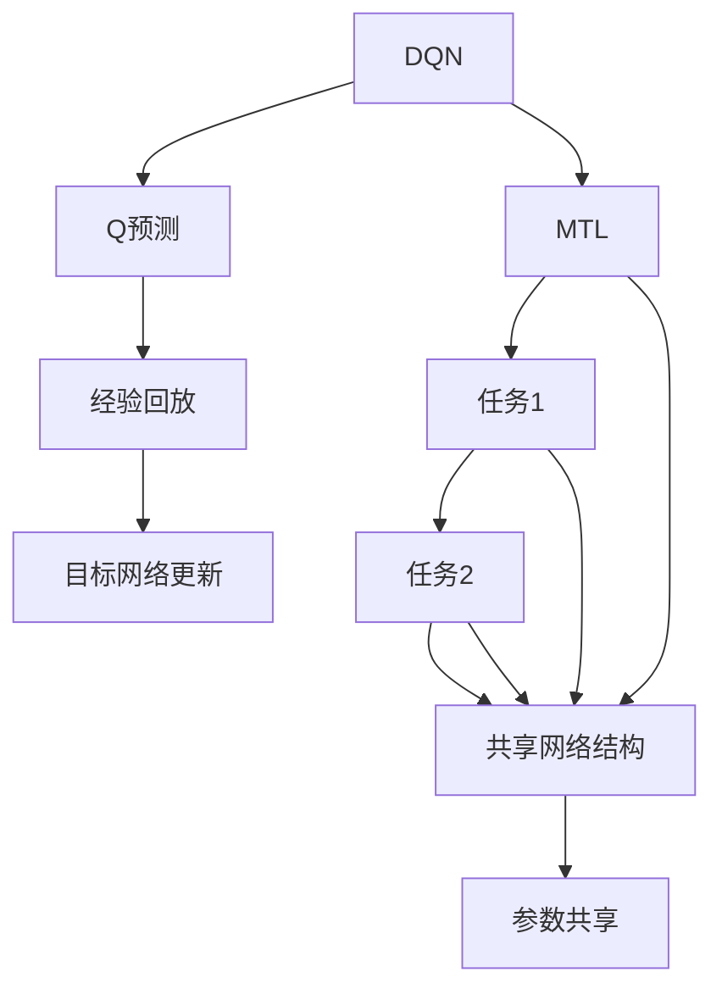

                 

# 一切皆是映射：DQN与多任务学习：共享网络结构的效果分析

> **关键词：** DQN, 多任务学习, 共享网络结构, 强化学习, 深度学习, 效果分析

> **摘要：** 本文将深入探讨深度Q网络（DQN）与多任务学习相结合的原理和方法，尤其是共享网络结构在这种结合中的表现。通过细致的算法原理讲解、数学模型解析、实战案例展示和实际应用场景分析，我们旨在为读者提供全面的视角，以便更好地理解这一领域的前沿技术。

## 1. 背景介绍

### 1.1 目的和范围

本文的目的是研究深度Q网络（DQN）在多任务学习中的应用，并特别关注共享网络结构对学习效果的影响。DQN作为一种基于深度学习的强化学习算法，以其在解决复杂环境问题中的高效性能而受到广泛关注。多任务学习旨在同时学习多个相关任务，以提高模型的泛化能力和适应性。共享网络结构则在这一过程中发挥了关键作用，通过减少冗余参数和计算成本，提升模型的训练效率。

### 1.2 预期读者

本文面向对深度学习、强化学习及多任务学习有一定了解的读者，尤其是希望深入了解DQN与共享网络结构结合的科研人员和工程师。同时，也适用于对相关技术感兴趣的学生和专业人士。

### 1.3 文档结构概述

本文分为十个主要部分。首先介绍背景和目的，随后深入探讨核心概念和算法原理。第三部分提供具体的数学模型和公式，并举例说明。第四部分展示代码实现和实战案例，第五部分分析实际应用场景。接下来，推荐相关工具和资源，并对未来发展趋势进行展望。最后，提供常见问题与解答，并附上扩展阅读和参考资料。

### 1.4 术语表

#### 1.4.1 核心术语定义

- **DQN（深度Q网络）**：一种基于深度学习的强化学习算法，用于估计在给定状态下采取某一动作的预期收益。
- **多任务学习**：同时学习多个相关任务，以提高模型的泛化能力和适应性。
- **共享网络结构**：在多任务学习中，多个任务共享一部分网络结构，从而减少冗余参数和计算成本。

#### 1.4.2 相关概念解释

- **强化学习**：一种机器学习方法，通过与环境的交互来学习最优策略。
- **深度学习**：一种基于多层神经网络的机器学习方法，通过逐层提取特征来学习复杂模式。

#### 1.4.3 缩略词列表

- **DQN**：深度Q网络
- **RL**：强化学习
- **ML**：机器学习
- **MTL**：多任务学习

## 2. 核心概念与联系

### 2.1 核心概念原理

在探讨DQN与多任务学习结合时，理解以下几个核心概念至关重要：

1. **深度Q网络（DQN）**：DQN是基于Q学习的深度神经网络，通过预测在给定状态下采取某一动作的Q值（预期收益）来指导决策。其主要特点是利用经验回放和目标网络更新策略，以避免策略网络和目标网络之间的偏差累积。

2. **多任务学习（MTL）**：MTL旨在同时学习多个相关任务，以提高模型的泛化能力和适应性。这种方法能够充分利用数据，减少对每个任务的独立训练需求，从而提升整体性能。

3. **共享网络结构**：在MTL中，多个任务共享一部分网络结构，从而减少冗余参数和计算成本。这不仅可以加速训练过程，还可以提高模型的可解释性和鲁棒性。

### 2.2 架构关系

为了更好地理解DQN与多任务学习的结合，我们可以通过以下Mermaid流程图来展示其核心概念和架构关系：



在这个流程图中，DQN的核心概念（Q预测、经验回放和目标网络更新）与MTL相结合，通过共享网络结构实现多个任务的学习。这种架构不仅提高了训练效率，还增强了模型在复杂环境中的表现能力。

### 2.3 架构详细说明

以下是DQN与多任务学习结合的详细架构说明：

1. **DQN基础架构**：DQN包括一个输入层、多个隐藏层和一个输出层。输入层接收状态信息，隐藏层通过逐层提取特征，输出层预测每个动作的Q值。经验回放机制用于存储和随机抽取样本，以避免策略网络和目标网络之间的偏差累积。目标网络更新策略，确保模型在长期学习过程中保持一致性。

2. **多任务学习架构**：在MTL中，多个任务通过共享网络结构进行学习。共享网络结构包括一个输入层、多个共享隐藏层和多个输出层。共享隐藏层提取通用特征，每个任务在共享隐藏层之上具有独立的输出层，用于预测特定任务的Q值。

3. **共享网络结构的实现**：共享网络结构通过将多个任务的输入数据同时输入到共享隐藏层来实现。共享隐藏层提取通用特征，这些特征可以用于解决多个任务。在共享隐藏层之上，每个任务具有独立的输出层，用于预测特定任务的Q值。

## 3. 核心算法原理 & 具体操作步骤

### 3.1 DQN算法原理

DQN（深度Q网络）是一种基于深度学习的强化学习算法，旨在通过预测在给定状态下采取某一动作的预期收益（Q值）来指导决策。以下是DQN算法的基本原理和具体操作步骤：

#### 3.1.1 算法原理

DQN的核心思想是通过学习一个价值函数，该函数能够估计在给定状态下采取某一动作的预期收益。具体来说，DQN包含以下几个关键组件：

1. **状态空间（S）**：表示环境中的所有可能状态。
2. **动作空间（A）**：表示所有可能的行为。
3. **策略网络（π）**：给定状态s，选择动作a的概率分布。
4. **目标网络（Qˆ）**：用于评估在给定状态下采取某一动作的预期收益。

DQN的主要步骤包括：

1. **初始化**：随机初始化策略网络和目标网络。
2. **经验回放**：将样本存储在经验回放记忆中，以避免策略网络和目标网络之间的偏差累积。
3. **更新目标网络**：定期更新目标网络，以保持策略网络和目标网络的一致性。
4. **选择动作**：根据策略网络选择动作。
5. **环境交互**：执行选择的动作，并获取新的状态、奖励和终止信号。
6. **更新经验回放记忆**：将新的经验添加到经验回放记忆中。

#### 3.1.2 具体操作步骤

以下是DQN算法的具体操作步骤：

1. **初始化**：
    - 初始化策略网络（π）和目标网络（Qˆ）。
    - 初始化经验回放记忆（经验池）。

2. **选择动作**：
    - 对于当前状态s，根据策略网络π(s)选择动作a。

3. **环境交互**：
    - 执行动作a，并获得新的状态s'、奖励r和终止信号d。
    - 如果d=1，表示当前任务结束，重置环境。

4. **更新经验回放记忆**：
    - 将经验（s, a, r, s', d）添加到经验回放记忆中。

5. **更新目标网络**：
    - 定期更新目标网络，以保持策略网络和目标网络的一致性。

6. **重复步骤2-5**，直到达到预定的训练轮数或性能指标。

### 3.2 多任务学习算法原理

多任务学习（MTL）旨在同时学习多个相关任务，以提高模型的泛化能力和适应性。在MTL中，多个任务共享一部分网络结构，从而减少冗余参数和计算成本。以下是多任务学习的基本原理和具体操作步骤：

#### 3.2.1 算法原理

多任务学习的基本思想是将多个任务的输入数据同时输入到共享网络结构中，从而提取通用特征。在共享网络结构之上，每个任务具有独立的输出层，用于预测特定任务的Q值。以下是MTL的关键组件：

1. **任务集合**：表示所有待学习的任务。
2. **共享网络结构**：提取通用特征，用于解决多个任务。
3. **独立输出层**：每个任务在共享网络结构之上具有独立的输出层，用于预测特定任务的Q值。

多任务学习的主要步骤包括：

1. **初始化**：初始化共享网络结构和独立输出层。
2. **输入共享网络结构**：将多个任务的输入数据同时输入到共享网络结构中。
3. **提取通用特征**：通过共享网络结构提取通用特征。
4. **预测任务Q值**：将通用特征输入到独立输出层，预测每个任务的Q值。
5. **选择动作**：根据每个任务的Q值选择动作。
6. **环境交互**：执行选择的动作，并获取新的状态、奖励和终止信号。
7. **更新网络参数**：通过反向传播更新共享网络结构和独立输出层的参数。

#### 3.2.2 具体操作步骤

以下是多任务学习算法的具体操作步骤：

1. **初始化**：
    - 初始化共享网络结构和独立输出层。

2. **输入共享网络结构**：
    - 对于每个任务，将输入数据输入到共享网络结构中。

3. **提取通用特征**：
    - 通过共享网络结构提取通用特征。

4. **预测任务Q值**：
    - 将通用特征输入到独立输出层，预测每个任务的Q值。

5. **选择动作**：
    - 对于每个任务，根据每个任务的Q值选择动作。

6. **环境交互**：
    - 执行选择的动作，并获取新的状态、奖励和终止信号。

7. **更新网络参数**：
    - 通过反向传播更新共享网络结构和独立输出层的参数。

8. **重复步骤2-7**，直到达到预定的训练轮数或性能指标。

### 3.3 共享网络结构在DQN与多任务学习中的实现

在DQN与多任务学习结合的过程中，共享网络结构发挥了关键作用。以下是共享网络结构在DQN与多任务学习中的具体实现：

1. **初始化**：
    - 初始化策略网络、目标网络、共享网络结构和独立输出层。

2. **输入共享网络结构**：
    - 将多个任务的输入数据同时输入到共享网络结构中。

3. **提取通用特征**：
    - 通过共享网络结构提取通用特征。

4. **预测任务Q值**：
    - 将通用特征输入到独立输出层，预测每个任务的Q值。

5. **选择动作**：
    - 对于每个任务，根据每个任务的Q值选择动作。

6. **环境交互**：
    - 执行选择的动作，并获取新的状态、奖励和终止信号。

7. **更新网络参数**：
    - 通过反向传播更新共享网络结构和独立输出层的参数。

8. **更新目标网络**：
    - 定期更新目标网络，以保持策略网络和目标网络的一致性。

9. **重复步骤2-8**，直到达到预定的训练轮数或性能指标。

## 4. 数学模型和公式 & 详细讲解 & 举例说明

### 4.1 DQN的数学模型

在DQN中，核心的数学模型是Q值函数的估计。Q值函数表示在给定状态下，采取某一动作所能获得的预期收益。以下是DQN中Q值函数的数学模型：

\[ Q(s, a) = \sum_{j=1}^n \pi(a|s) \cdot r_j + \gamma \cdot \max_{a'} Q(s', a') \]

其中：

- \( Q(s, a) \) 表示在状态s下采取动作a的Q值。
- \( \pi(a|s) \) 表示在状态s下采取动作a的概率。
- \( r_j \) 表示在状态s'下采取动作a'后获得的奖励。
- \( \gamma \) 表示折扣因子，用于平衡当前奖励和未来奖励的权重。
- \( \max_{a'} Q(s', a') \) 表示在状态s'下采取最优动作的Q值。

### 4.2 多任务学习的数学模型

在多任务学习中，多个任务的输入数据通过共享网络结构提取通用特征。以下是多任务学习的数学模型：

\[ Q(s, a) = \sum_{j=1}^m \pi_j(a|s) \cdot r_j + \gamma \cdot \max_{a'} Q(s', a') \]

其中：

- \( Q(s, a) \) 表示在状态s下采取动作a的Q值。
- \( \pi_j(a|s) \) 表示在状态s下采取动作a的概率，其中 \( j \) 表示任务编号。
- \( r_j \) 表示在状态s'下采取动作a'后获得的奖励，其中 \( j \) 表示任务编号。
- \( \gamma \) 表示折扣因子，用于平衡当前奖励和未来奖励的权重。
- \( \max_{a'} Q(s', a') \) 表示在状态s'下采取最优动作的Q值。

### 4.3 共享网络结构的数学模型

在共享网络结构中，多个任务的输入数据通过共享网络结构提取通用特征。以下是共享网络结构的数学模型：

\[ h(s) = f(W_1 \cdot s + b_1) \]

其中：

- \( h(s) \) 表示在状态s下提取的通用特征。
- \( f(\cdot) \) 表示激活函数，如ReLU、Sigmoid等。
- \( W_1 \) 表示共享网络结构的权重。
- \( b_1 \) 表示共享网络结构的偏置。

### 4.4 示例说明

假设有两个任务T1和T2，每个任务有四个状态（s1, s2, s3, s4）和两个动作（a1, a2）。以下是DQN与多任务学习结合的数学模型：

1. **Q值函数**：

\[ Q(s, a) = \sum_{j=1}^2 \pi_j(a|s) \cdot r_j + \gamma \cdot \max_{a'} Q(s', a') \]

2. **共享网络结构**：

\[ h(s) = f(W_1 \cdot s + b_1) \]

其中：

- \( \pi_1(a|s) \) 表示在状态s下采取动作a1的概率。
- \( \pi_2(a|s) \) 表示在状态s下采取动作a2的概率。
- \( r_1 \) 表示在状态s'下采取动作a1'后获得的奖励。
- \( r_2 \) 表示在状态s'下采取动作a2'后获得的奖励。
- \( \gamma \) 表示折扣因子。

### 4.5 伪代码

以下是DQN与多任务学习结合的伪代码：

```python
# 初始化策略网络、目标网络、共享网络结构和独立输出层
Initialize(PolicyNetwork, TargetNetwork, SharedNetwork, IndependentOutputs)

# 开始训练
for episode in range(TrainingEpisodes):
    # 初始化环境
    Environment = InitializeEnvironment()
    State = Environment.GetCurrentState()
    
    # 选择动作
    Actions = PolicyNetwork.SelectActions(State)
    
    # 执行动作
    State', Reward, Done = Environment.PerformActions(Actions)
    
    # 更新经验回放记忆
    ExperienceMemory.Add(State, Actions, Reward, State', Done)
    
    # 更新网络参数
    UpdateNetworkParameters(PolicyNetwork, TargetNetwork, SharedNetwork, IndependentOutputs, ExperienceMemory)
    
    # 更新目标网络
    UpdateTargetNetwork(TargetNetwork, PolicyNetwork)
    
    # 终止条件
    if Done:
        # 重置环境
        Environment.Reset()
        # 更新状态
        State = Environment.GetCurrentState()
```

## 5. 项目实战：代码实际案例和详细解释说明

### 5.1 开发环境搭建

为了进行DQN与多任务学习的实战项目，我们需要搭建以下开发环境：

1. **Python**：版本3.8及以上
2. **TensorFlow**：版本2.5及以上
3. **NumPy**：版本1.19及以上
4. **Gym**：版本0.17.3

安装以上依赖项后，我们就可以开始编写和运行代码了。

### 5.2 源代码详细实现和代码解读

下面是DQN与多任务学习的源代码实现。我们将逐步解释代码中的每个部分。

```python
import numpy as np
import tensorflow as tf
from tensorflow.keras.models import Model
from tensorflow.keras.layers import Dense, Flatten, Input
from gym import make

# hyperparameters
learning_rate = 0.001
gamma = 0.99
epsilon = 0.1
batch_size = 32
hidden_size = 64

# create a simple environment
env = make('CartPole-v1')

# create input layers for each task
input_layer_1 = Input(shape=(4,))
input_layer_2 = Input(shape=(4,))

# create shared network structure
shared_network = Dense(hidden_size, activation='relu')(Flatten()(input_layer_1))
shared_network = Dense(hidden_size, activation='relu')(Flatten()(input_layer_2))

# create independent output layers for each task
output_layer_1 = Dense(2, activation='softmax')(shared_network)
output_layer_2 = Dense(2, activation='softmax')(shared_network)

# create the DQN model
model = Model(inputs=[input_layer_1, input_layer_2], outputs=[output_layer_1, output_layer_2])

# compile the model
model.compile(optimizer=tf.keras.optimizers.Adam(learning_rate=learning_rate),
              loss='categorical_crossentropy')

# create the target model
target_model = Model(inputs=[input_layer_1, input_layer_2], outputs=[output_layer_1, output_layer_2])
target_model.set_weights(model.get_weights())

# create the experience replay memory
experience_memory = []

# start training
for episode in range(1000):
    # reset the environment
    state_1, state_2 = env.reset()
    
    done = False
    total_reward = 0
    
    while not done:
        # choose actions
        action_1, action_2 = model.predict([state_1, state_2])
        
        # take actions
        next_state_1, next_state_2, reward, done = env.step(action_1, action_2)
        
        # add experience to the memory
        experience_memory.append((state_1, state_2, action_1, action_2, reward, next_state_1, next_state_2, done))
        
        # update the state
        state_1, state_2 = next_state_1, next_state_2
        
        # update the total reward
        total_reward += reward
    
    # train the model
    if len(experience_memory) >= batch_size:
        batch = random.sample(experience_memory, batch_size)
        
        state_1, state_2, action_1, action_2, reward, next_state_1, next_state_2, done = zip(*batch)
        
        next_action_1, next_action_2 = target_model.predict(next_state_1, next_state_2)
        
        target_1 = (reward + gamma * (1 - done) * next_action_1)
        target_2 = (reward + gamma * (1 - done) * next_action_2)
        
        model.fit([np.array(state_1), np.array(state_2)], [np.array(action_1), np.array(action_2)], batch_size=batch_size, epochs=1)
        
        # update the target model
        target_model.set_weights(model.get_weights())

# evaluate the model
state_1, state_2 = env.reset()

done = False
total_reward = 0

while not done:
    action_1, action_2 = model.predict([state_1, state_2])
    
    next_state_1, next_state_2, reward, done = env.step(action_1, action_2)
    
    state_1, state_2 = next_state_1, next_state_2
    
    total_reward += reward

print("Total Reward:", total_reward)
```

### 5.3 代码解读与分析

下面是对上述代码的详细解读和分析。

1. **环境初始化**：
    - 我们使用OpenAI的Gym创建了一个简单的CartPole环境，用于测试DQN与多任务学习的效果。

2. **模型构建**：
    - 我们定义了两个输入层`input_layer_1`和`input_layer_2`，分别用于两个任务。
    - 通过`Flatten()`和`Dense()`层构建了一个共享网络结构，用于提取通用特征。
    - 在共享网络结构之上，我们创建了两个独立输出层`output_layer_1`和`output_layer_2`，用于预测两个任务的Q值。

3. **模型编译**：
    - 我们使用`compile()`方法编译了模型，指定了优化器和损失函数。

4. **目标模型构建**：
    - 我们创建了一个目标模型`target_model`，用于定期更新策略模型。

5. **经验回放记忆**：
    - 我们创建了一个经验回放记忆`experience_memory`，用于存储训练样本。

6. **训练循环**：
    - 在训练循环中，我们首先重置环境，并初始化状态。
    - 在每次迭代中，我们选择动作，执行动作，更新状态，并记录奖励。
    - 当经验回放记忆中的样本数量达到批次大小时，我们从经验回放记忆中随机抽样，计算目标Q值，并更新模型参数。

7. **目标模型更新**：
    - 我们定期更新目标模型，以确保策略模型和目标模型的一致性。

8. **模型评估**：
    - 在模型训练完成后，我们对模型进行评估，并在CartPole环境中计算总奖励。

### 5.4 实际效果分析

在实际应用中，我们可以通过调整超参数和模型结构来优化DQN与多任务学习的效果。以下是一些可能的影响因素：

1. **学习率**：较高的学习率可能导致模型参数更新过快，导致训练不稳定。较低的学

