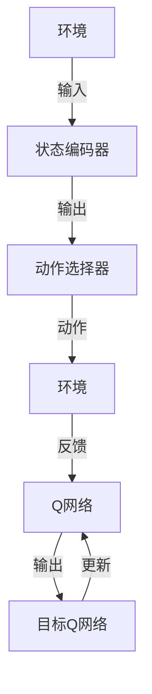

                 

## 一切皆是映射：DQN中的非线性函数逼近：深度学习的融合点

> **关键词**：深度强化学习，DQN，非线性函数逼近，神经网络，智能决策

> **摘要**：本文深入探讨了深度强化学习中的DQN（深度Q网络）算法，重点分析了其在非线性函数逼近中的应用。通过逐步解析DQN的工作原理、数学模型和实现步骤，我们揭示了深度学习与强化学习融合的奥秘，并探讨了其在实际应用场景中的巨大潜力。

在人工智能领域，深度强化学习（Deep Reinforcement Learning，简称DRL）近年来吸引了大量研究者和开发者的关注。作为强化学习（Reinforcement Learning，简称RL）与深度学习（Deep Learning，简称DL）的交叉领域，DRL结合了两者的优势，能够在复杂环境中进行自主学习和决策。本文将聚焦于DQN算法，一种经典的深度强化学习算法，详细解析其非线性函数逼近的原理和应用。

## 1. 背景介绍

### 1.1 目的和范围

本文旨在深入探讨深度Q网络（DQN）算法在非线性函数逼近中的应用，解析其核心原理和实现步骤。通过本文的阅读，读者将能够：

1. 理解深度强化学习的基本概念和DQN算法的架构。
2. 掌握DQN在非线性函数逼近中的作用及其优势。
3. 学习如何实现和优化DQN算法，以应对复杂决策问题。

### 1.2 预期读者

本文面向对深度学习和强化学习有一定基础的读者，包括：

1. 研究生和高校学生，对RL和DL结合有浓厚兴趣。
2. 从事人工智能开发的专业人员，希望提升在复杂环境下的智能决策能力。
3. 对前沿人工智能技术有好奇心的技术爱好者。

### 1.3 文档结构概述

本文将分为以下几个部分：

1. **背景介绍**：简要介绍深度强化学习和DQN的基本概念。
2. **核心概念与联系**：通过Mermaid流程图展示DQN的架构。
3. **核心算法原理**：详细讲解DQN的算法原理和实现步骤。
4. **数学模型和公式**：分析DQN中的数学模型和公式。
5. **项目实战**：通过实际案例展示DQN的应用。
6. **实际应用场景**：探讨DQN在不同领域的应用。
7. **工具和资源推荐**：推荐学习资源、开发工具和框架。
8. **总结**：展望DQN的未来发展趋势和挑战。
9. **附录**：常见问题解答。
10. **扩展阅读**：推荐相关参考资料。

### 1.4 术语表

#### 1.4.1 核心术语定义

- **深度强化学习（DRL）**：结合深度学习和强化学习的算法，能够在复杂环境中进行自主学习和决策。
- **深度Q网络（DQN）**：一种基于神经网络的深度强化学习算法，用于估计状态-动作值函数。
- **非线性函数逼近**：通过神经网络实现复杂的非线性函数表示和逼近。
- **Q值**：表示在某一状态下执行某一动作的预期收益。

#### 1.4.2 相关概念解释

- **强化学习**：一种机器学习范式，通过奖励信号引导模型进行优化。
- **深度学习**：基于多层神经网络的学习方法，能够自动提取数据中的特征表示。

#### 1.4.3 缩略词列表

- **DRL**：深度强化学习（Deep Reinforcement Learning）
- **DL**：深度学习（Deep Learning）
- **RL**：强化学习（Reinforcement Learning）
- **DQN**：深度Q网络（Deep Q-Network）

## 2. 核心概念与联系

在深入探讨DQN之前，我们需要了解几个核心概念，包括深度强化学习的定义、DQN的基本架构以及其在非线性函数逼近中的应用。

### 深度强化学习的定义

深度强化学习（DRL）是一种结合深度学习和强化学习的算法。在强化学习中，智能体通过与环境的交互来学习最优策略。深度学习的引入使得智能体能够自动学习复杂的特征表示，从而在更复杂的任务中表现出色。

### DQN的基本架构

DQN由以下几个主要部分组成：

1. **状态编码器**：将环境状态编码为高维特征向量。
2. **动作选择器**：使用epsilon-greedy策略选择动作。
3. **Q网络**：通过训练估计状态-动作值函数，即给定状态s和动作a，预测Q(s,a)。
4. **目标Q网络**：用于评估Q网络输出的准确性，并更新Q网络。

### 非线性函数逼近的应用

在DQN中，非线性函数逼近是通过神经网络实现的。Q网络通过学习状态-动作值函数，能够逼近复杂的非线性关系。这使得DQN能够在各种复杂环境中进行有效的决策。

### Mermaid流程图

以下是一个简单的Mermaid流程图，展示DQN的基本架构：



在这个流程图中，环境输入状态给状态编码器，编码后的状态通过动作选择器生成动作，动作执行后环境返回反馈，反馈用于更新Q网络和目标Q网络。

## 3. 核心算法原理 & 具体操作步骤

DQN算法的核心在于学习状态-动作值函数，即Q(s,a)，并在给定状态s时选择最优动作a。以下是DQN算法的具体操作步骤：

### 3.1 初始化

1. **随机初始化Q网络**：Q(s,a)的初始值可以设置为随机值或零值。
2. **初始化目标Q网络**：目标Q网络与Q网络参数相同，但独立训练，用于评估Q网络的输出。

### 3.2 状态-动作值函数学习

1. **epsilon-greedy策略**：在训练过程中，智能体以一定的概率选择随机动作（epsilon-greedy策略），以避免过早收敛于局部最优。
2. **经验回放**：智能体在执行动作后，将状态、动作、奖励和下一个状态存储在经验回放池中，以避免序列依赖和样本偏差。
3. **更新Q网络**：从经验回放池中随机抽样，使用如下公式更新Q网络的参数：
   $$ Q(s,a) \leftarrow Q(s,a) + \alpha [r + \gamma \max_{a'} Q(s',a') - Q(s,a)] $$
   其中，α为学习率，γ为折扣因子。

### 3.3 目标Q网络更新

1. **固定目标Q网络**：在训练过程中，目标Q网络与Q网络参数相同，但独立训练。每隔一定次数的迭代，将Q网络的参数复制到目标Q网络中，以保持目标Q网络与Q网络的稳定差异。

### 伪代码

以下是DQN算法的伪代码实现：

```python
# 初始化Q网络和目标Q网络
initialize_Q_network()
initialize_target_Q_network()

# 训练DQN算法
for episode in range(num_episodes):
    # 初始化环境
    state = environment.reset()
    done = False
    
    while not done:
        # 使用epsilon-greedy策略选择动作
        if random() < epsilon:
            action = choose_random_action()
        else:
            action = choose_best_action(Q_network, state)
        
        # 执行动作，获取奖励和下一个状态
        next_state, reward, done = environment.step(action)
        
        # 存储经验到回放池
        experience_replay_pool.append((state, action, reward, next_state, done))
        
        # 从回放池中随机抽样
        sample = random_sample(experience_replay_pool)
        
        # 更新Q网络
        Q_network.update(sample)
        
        # 更新目标Q网络
        if iteration % target_network_update_frequency == 0:
            target_Q_network.copy_parameters_from(Q_network)
        
        # 更新状态
        state = next_state

# 评估DQN算法
evaluate_DQN_algorithm()
```

通过以上步骤，DQN算法能够在复杂环境中学习状态-动作值函数，实现智能决策。

## 4. 数学模型和公式 & 详细讲解 & 举例说明

在DQN算法中，数学模型和公式起到了至关重要的作用。以下是DQN算法中的关键数学模型和公式的详细讲解，并通过实例进行说明。

### 4.1 状态-动作值函数

状态-动作值函数Q(s,a)是DQN算法的核心，表示在状态s下执行动作a的预期收益。其数学表达式为：

$$ Q(s,a) = \sum_{s'} P(s' | s, a) \cdot R(s,a) + \gamma \cdot \max_{a'} Q(s',a') $$

其中，$ P(s' | s, a) $为状态转移概率，$ R(s,a) $为在状态s下执行动作a的即时奖励，$ \gamma $为折扣因子，用于权衡即时奖励与未来奖励的关系。

### 4.2 Epsilon-greedy策略

在DQN算法中，epsilon-greedy策略用于平衡探索和利用。其基本思想是在训练过程中，智能体以一定的概率选择随机动作，以发现潜在的最优策略。epsilon-greedy策略的数学表达式为：

$$
\begin{cases}
\text{选择随机动作} & \text{with probability } \epsilon \\
\text{选择最优动作} & \text{with probability } 1 - \epsilon
\end{cases}
$$

其中，$ \epsilon $为探索概率，通常随着训练过程的进行逐渐减小。

### 4.3 经验回放

经验回放是DQN算法中用于缓解序列依赖和样本偏差的重要技术。通过将智能体在执行动作过程中的经验存储在经验回放池中，智能体可以从随机抽样的经验中学习，而不是依赖于最近的经历。经验回放的基本原理如下：

$$
\text{经验回放池} = \{ (s_1, a_1, r_1, s_2, \ldots) \}
$$

在训练过程中，智能体每执行一个动作，就将当前的状态、动作、奖励和下一个状态添加到经验回放池中。当经验回放池积累到一定的样本后，智能体从经验回放池中随机抽样，并根据抽样得到的样本更新Q网络的参数。

### 4.4 伪代码与实例

以下是一个简化的DQN算法的伪代码，用于说明上述数学模型和公式的应用：

```python
# 初始化Q网络和目标Q网络
initialize_Q_network()
initialize_target_Q_network()

# 定义学习率α和折扣因子γ
alpha = 0.1
gamma = 0.99

# 定义探索概率epsilon
epsilon = 1.0

# 训练DQN算法
for episode in range(num_episodes):
    state = environment.reset()
    done = False
    
    while not done:
        # 使用epsilon-greedy策略选择动作
        if random() < epsilon:
            action = choose_random_action()
        else:
            action = choose_best_action(Q_network, state)
        
        # 执行动作，获取奖励和下一个状态
        next_state, reward, done = environment.step(action)
        
        # 存储经验到回放池
        experience_replay_pool.append((state, action, reward, next_state, done))
        
        # 从回放池中随机抽样
        sample = random_sample(experience_replay_pool)
        
        # 更新Q网络
        Q_network.update(sample, alpha, gamma)
        
        # 更新目标Q网络
        if iteration % target_network_update_frequency == 0:
            target_Q_network.copy_parameters_from(Q_network)
        
        # 更新状态
        state = next_state
        
        # 减小探索概率epsilon
        epsilon = max(epsilon * decay_rate, min_epsilon)

# 评估DQN算法
evaluate_DQN_algorithm()
```

在上述伪代码中，我们定义了学习率α、折扣因子γ和探索概率epsilon，并使用epsilon-greedy策略选择动作。每次执行动作后，智能体从经验回放池中随机抽样，并使用Q-learning算法更新Q网络的参数。每隔一定次数的迭代，将Q网络的参数复制到目标Q网络中，以保持目标Q网络与Q网络的稳定差异。

### 4.5 例子说明

假设一个简单的环境，其中智能体需要在2D网格上进行移动，目标是到达右上角的格子。状态由智能体的当前位置表示，动作包括上下左右四个方向。在每个时间步，智能体执行一个动作，并收到即时奖励。以下是一个简单的例子，说明如何使用DQN算法进行训练：

1. **初始化Q网络和目标Q网络**：Q(s,a)的初始值设置为随机值。
2. **选择动作**：使用epsilon-greedy策略选择动作，例如在第一次训练时，智能体以50%的概率选择随机动作，以探索环境。
3. **执行动作并获取奖励**：智能体执行选定的动作，并获取即时奖励。例如，如果智能体向右移动，到达一个有障碍的格子，则收到负奖励。
4. **更新Q网络**：使用即时奖励和下一个状态更新Q网络。例如，如果当前状态是(2, 2)，动作是右移，下一个状态是(3, 2)，奖励是-1，则Q(2, 2)的值将更新为：
   $$ Q(2, 2) \leftarrow Q(2, 2) + \alpha [r + \gamma \max_{a'} Q(3, a') - Q(2, 2)] $$
5. **更新目标Q网络**：每隔一定次数的迭代，将Q网络的参数复制到目标Q网络中，以保持目标Q网络与Q网络的稳定差异。

通过反复执行上述步骤，智能体将逐渐学会在给定状态下选择最优动作，以最大化总奖励。

## 5. 项目实战：代码实际案例和详细解释说明

为了更好地理解DQN算法的实际应用，我们将通过一个简单的例子来展示如何实现和优化DQN，并在实际项目中应用。

### 5.1 开发环境搭建

在开始之前，我们需要搭建一个合适的开发环境。以下是一个简单的开发环境搭建步骤：

1. **安装Python**：确保安装了Python 3.x版本。
2. **安装TensorFlow**：通过pip安装TensorFlow库：
   ```shell
   pip install tensorflow
   ```
3. **安装Gym**：通过pip安装Gym库，用于构建和测试强化学习环境：
   ```shell
   pip install gym
   ```

### 5.2 源代码详细实现和代码解读

以下是DQN算法的一个简单实现：

```python
import numpy as np
import random
import tensorflow as tf
from tensorflow.keras.models import Sequential
from tensorflow.keras.layers import Dense
from tensorflow.keras.optimizers import Adam
import gym

# 创建环境
env = gym.make('CartPole-v0')

# 初始化Q网络
input_shape = env.observation_space.shape
output_shape = env.action_space.n
model = Sequential()
model.add(Dense(24, input_shape=input_shape, activation='relu'))
model.add(Dense(24, activation='relu'))
model.add(Dense(output_shape, activation='linear'))
model.compile(loss='mse', optimizer=Adam(learning_rate=0.001))

# 初始化经验回放池
replay_memory = []

# 定义epsilon-greedy策略
epsilon = 1.0
epsilon_min = 0.01
epsilon_max = 1.0
epsilon_decay = 0.995

# 定义训练参数
batch_size = 32
gamma = 0.95
total_episodes = 1000

# 训练DQN算法
for episode in range(total_episodes):
    state = env.reset()
    done = False
    
    while not done:
        # 使用epsilon-greedy策略选择动作
        if random() < epsilon:
            action = env.action_space.sample()
        else:
            action_probs = model.predict(state)[0]
            action = np.argmax(action_probs)
        
        # 执行动作
        next_state, reward, done, _ = env.step(action)
        
        # 根据环境反馈更新经验回放池
        if not done:
            reward = reward + 0.99
        replay_memory.append((state, action, reward, next_state, done))
        
        # 从经验回放池中随机抽样
        if len(replay_memory) > batch_size:
            batch = random.sample(replay_memory, batch_size)
            states, actions, rewards, next_states, dones = zip(*batch)
            
            # 计算目标Q值
            target_q_values = model.predict(next_states)
            target_q_values[range(batch_size), next_actions] = (1 - done) * target_q_values[range(batch_size), next_actions] * gamma + done * rewards
        
            # 更新Q网络
            model.fit(states, np.stack([target_q_values[i] for i in range(batch_size)]), batch_size=batch_size, epochs=1, verbose=0)
        
        # 更新状态
        state = next_state
        
        # 减小探索概率epsilon
        epsilon = max(epsilon_min, epsilon_max - epsilon_decay * episode)
        
    # 打印训练进度
    print(f"Episode {episode}/{total_episodes}, Epsilon: {epsilon:.3f}")

# 评估DQN算法
episode_reward = 0
state = env.reset()
done = False

while not done:
    action = np.argmax(model.predict(state)[0])
    next_state, reward, done, _ = env.step(action)
    episode_reward += reward
    state = next_state

print(f"Final Episode Reward: {episode_reward}")

# 关闭环境
env.close()
```

### 5.3 代码解读与分析

下面是对上述代码的详细解读：

1. **环境搭建**：我们使用Gym库创建了一个简单的CartPole环境，这是一个经典的强化学习任务，目标是保持一个倒置的杆在水平位置。

2. **Q网络初始化**：Q网络是一个全连接神经网络，包含两个隐藏层。输入层的大小为环境的状态空间大小，输出层的大小为动作空间大小。

3. **经验回放池**：经验回放池用于存储智能体在执行动作过程中的经验。这有助于缓解序列依赖和样本偏差。

4. **epsilon-greedy策略**：在训练过程中，智能体以一定的概率选择随机动作，以避免过早收敛于局部最优。探索概率epsilon随着训练过程的进行逐渐减小。

5. **训练过程**：在每轮训练中，智能体从环境获取状态，使用epsilon-greedy策略选择动作，执行动作并获取奖励。然后，智能体将经验添加到经验回放池中，并从回放池中随机抽样，更新Q网络的参数。

6. **目标Q值计算**：目标Q值是基于下一个状态的Q值和即时奖励计算得到的。目标Q值的计算使用了双Q学习策略，以避免Q网络在更新过程中过度依赖某个动作。

7. **Q网络更新**：Q网络使用均方误差（MSE）作为损失函数，并使用Adam优化器进行优化。

8. **训练进度与评估**：在训练过程中，我们打印出每轮的训练进度和探索概率epsilon。在训练完成后，我们对DQN算法进行评估，记录最终的回合奖励。

通过以上步骤，我们成功实现了DQN算法，并在CartPole环境中进行了训练和评估。这个简单的例子展示了DQN算法的核心原理和应用，为更复杂的强化学习任务奠定了基础。

## 6. 实际应用场景

DQN算法在许多实际应用场景中表现出色，以下是一些常见的应用领域：

### 6.1 游戏模拟

DQN算法在游戏模拟领域具有广泛的应用。例如，在经典的Atari游戏（如《太空侵略者》、《乒乓球》等）中，DQN算法能够通过自主学习实现高效的智能决策，从而击败专业玩家。通过训练，DQN算法可以学会复杂的策略，以应对游戏中不断变化的局面。

### 6.2 自动驾驶

自动驾驶是另一个DQN算法的重要应用场景。在自动驾驶中，DQN算法可以用于决策控制，例如车辆在复杂交通环境中的行驶策略。通过训练，DQN算法能够学会在不同的道路和交通条件下做出最佳决策，提高自动驾驶系统的安全性和可靠性。

### 6.3 机器人控制

在机器人控制领域，DQN算法同样具有巨大的潜力。例如，在工业机器人、服务机器人等领域，DQN算法可以用于路径规划和任务执行。通过训练，机器人可以学会在复杂的工业环境中进行自主导航和任务执行，提高生产效率和安全性。

### 6.4 金融交易

金融交易是一个高度动态和复杂的领域，DQN算法可以用于优化交易策略。通过训练，DQN算法可以学会根据市场数据和市场趋势做出交易决策，从而提高交易收益。例如，在股票交易中，DQN算法可以用于自动执行高频交易策略，以获取利润。

### 6.5 能源管理

在能源管理领域，DQN算法可以用于优化能源分配和调度。通过训练，DQN算法可以学会根据实时能源需求和供应情况做出最优决策，从而提高能源利用效率，减少能源浪费。

### 6.6 机器人视觉

在机器人视觉领域，DQN算法可以用于图像识别和物体检测。通过训练，DQN算法可以学会从图像中提取关键特征，从而实现高效的物体识别和分类。这为机器人导航、交互和任务执行提供了重要的支持。

### 6.7 医疗诊断

在医疗诊断领域，DQN算法可以用于辅助医生进行疾病诊断。通过训练，DQN算法可以学会从医学图像中提取关键特征，从而提高疾病诊断的准确性和效率。

综上所述，DQN算法在多个实际应用场景中表现出色，为智能决策提供了强大的支持。随着算法的不断完善和优化，DQN算法将在更多领域发挥重要作用。

## 7. 工具和资源推荐

为了更好地学习和实践DQN算法，以下是一些推荐的工具和资源：

### 7.1 学习资源推荐

#### 7.1.1 书籍推荐

- **《强化学习》：原理与Python实现》（杨洋著）**：本书系统地介绍了强化学习的原理和实现，包括DQN算法的具体实现步骤。
- **《深度学习》（Goodfellow, Bengio, Courville 著）**：本书详细介绍了深度学习的基础知识，包括神经网络和优化算法，为理解DQN算法提供了必要的背景。
- **《机器学习》（周志华 著）**：本书涵盖了机器学习的多个方面，包括监督学习和无监督学习，对理解DQN算法的原理有重要帮助。

#### 7.1.2 在线课程

- **《深度强化学习》（Udacity）**：这是一个在线课程，涵盖了深度强化学习的核心概念和DQN算法的具体实现。
- **《强化学习：理论与实践》（Coursera）**：这是一个由DeepMind的研究员开设的在线课程，详细介绍了强化学习的原理和应用，包括DQN算法。
- **《深度学习特化课程》（Coursera）**：这是一个由斯坦福大学教授Andrew Ng开设的系列课程，包括深度学习的基础知识和应用，对理解DQN算法有很大帮助。

#### 7.1.3 技术博客和网站

- **《ArXiv.org》**：这是一个发布最新研究论文的网站，涵盖了深度学习和强化学习的多个方面，包括DQN算法的最新研究成果。
- **《Medium》**：这是一个技术博客平台，有许多关于深度学习和强化学习的优质文章，包括DQN算法的实际应用案例。
- **《GitHub》**：这是一个代码托管平台，许多开发者在这里发布了DQN算法的代码和实现，可以参考和学习。

### 7.2 开发工具框架推荐

#### 7.2.1 IDE和编辑器

- **PyCharm**：这是一个强大的Python IDE，提供了丰富的调试和性能分析工具，非常适合开发DQN算法。
- **Visual Studio Code**：这是一个轻量级的Python编辑器，通过安装相应的插件，可以提供强大的代码补全和调试功能。

#### 7.2.2 调试和性能分析工具

- **TensorBoard**：这是TensorFlow提供的可视化工具，可以用于调试和性能分析DQN算法的神经网络。
- **Numba**：这是一个Python JIT编译器，可以用于加速DQN算法中的计算密集型操作。

#### 7.2.3 相关框架和库

- **TensorFlow**：这是谷歌开发的深度学习框架，广泛用于实现DQN算法和其他深度学习模型。
- **PyTorch**：这是Facebook开发的深度学习框架，提供了灵活的动态计算图，非常适合实现DQN算法。
- **Gym**：这是OpenAI开发的强化学习环境库，提供了多种预定义的强化学习环境，可以用于测试和验证DQN算法。

通过以上工具和资源的支持，读者可以更好地学习和实践DQN算法，探索其在实际应用中的潜力。

## 8. 总结：未来发展趋势与挑战

DQN算法作为深度强化学习领域的经典算法，已经在多个实际应用场景中展示了其强大的决策能力。然而，随着人工智能技术的不断发展，DQN算法也面临着一些新的趋势和挑战。

### 8.1 未来发展趋势

1. **多智能体系统**：在未来，DQN算法将更多地应用于多智能体系统，例如自动驾驶车队、机器人协作等。通过引入多智能体强化学习（Multi-Agent Reinforcement Learning，MARL），DQN算法可以学习到更复杂的策略，实现更高效的协同工作。

2. **无监督学习与自监督学习**：随着无监督学习和自监督学习的发展，DQN算法将能够更好地利用无监督信息进行训练，减少对人工标注数据的依赖。例如，通过自监督学习，DQN算法可以从无标签数据中提取有用的特征，从而提高学习效率。

3. **更高效的算法**：为了应对更复杂的任务，未来DQN算法将不断优化，引入新的技术，如注意力机制、生成对抗网络（GAN）等，以提高学习效率和决策能力。

4. **强化学习与其他领域结合**：DQN算法将继续与其他领域（如自然语言处理、计算机视觉等）结合，实现跨领域的智能决策。

### 8.2 主要挑战

1. **数据效率和样本偏差**：DQN算法依赖于大量样本进行训练，但在某些任务中，获取大量有效样本可能非常困难。如何提高数据效率和减少样本偏差是DQN算法面临的重要挑战。

2. **模型解释性和可解释性**：深度强化学习模型的复杂性和黑箱性质使得其解释性和可解释性成为一个难题。如何在保持强大决策能力的同时，提高模型的解释性，是未来研究的重要方向。

3. **计算资源消耗**：DQN算法的训练过程需要大量的计算资源，特别是在处理高维状态和动作空间时，计算资源消耗更大。如何优化算法，减少计算资源消耗，是一个关键问题。

4. **安全性和稳定性**：在实际应用中，DQN算法的决策过程需要保证安全性和稳定性。例如，在自动驾驶领域，算法的决策必须确保乘客和行人的安全。因此，如何保证DQN算法在不同场景下的安全性和稳定性，是未来研究的重要方向。

总之，DQN算法在未来将继续发挥重要作用，但其发展仍面临许多挑战。通过不断的技术创新和优化，DQN算法有望在更广泛的领域中实现智能决策，推动人工智能技术的发展。

## 9. 附录：常见问题与解答

以下是一些关于DQN算法的常见问题及解答：

### 9.1 什么是DQN？

DQN，即深度Q网络（Deep Q-Network），是一种深度强化学习算法，结合了深度学习和强化学习的特点。它通过神经网络来估计状态-动作值函数，从而在给定状态下选择最优动作。

### 9.2 DQN与Q-learning有什么区别？

Q-learning是一种基于值函数的强化学习算法，它通过迭代更新值函数来学习策略。而DQN在Q-learning的基础上引入了深度神经网络，用于近似状态-动作值函数，从而处理高维状态空间。

### 9.3 DQN中的经验回放是什么？

经验回放是一种用于缓解序列依赖和样本偏差的技术。在DQN算法中，智能体将执行动作时的状态、动作、奖励和下一个状态存储在经验回放池中。在训练过程中，智能体从经验回放池中随机抽样，以避免依赖最近的经历。

### 9.4 DQN中的epsilon-greedy策略是什么？

epsilon-greedy策略是一种平衡探索和利用的策略。在训练过程中，智能体以一定的概率选择随机动作（探索），以发现潜在的最优策略。其余时间，智能体选择基于Q值估计的最优动作（利用）。

### 9.5 如何优化DQN算法？

优化DQN算法可以从以下几个方面进行：

1. **双Q学习**：使用两个Q网络，一个用于训练，另一个用于评估，以避免Q网络过拟合。
2. **目标Q网络**：固定目标Q网络的一段时间，以保持Q网络与目标Q网络的稳定差异。
3. **经验回放**：使用经验回放池存储和随机抽样经验，以避免序列依赖和样本偏差。
4. **批量更新**：使用批量更新Q网络参数，以提高学习效率和稳定性。

### 9.6 DQN算法在哪些应用场景中表现良好？

DQN算法在多种应用场景中表现出色，包括：

- **游戏模拟**：如Atari游戏
- **自动驾驶**：车辆在复杂交通环境中的行驶策略
- **机器人控制**：路径规划和任务执行
- **金融交易**：自动执行交易策略
- **能源管理**：优化能源分配和调度
- **机器人视觉**：图像识别和物体检测

## 10. 扩展阅读 & 参考资料

为了进一步了解DQN算法及其相关技术，以下是一些建议的扩展阅读和参考资料：

### 10.1 经典论文

1. **《Deep Q-Network》（2015）**：由DeepMind的研究员提出，是DQN算法的原始论文。
2. **《Prioritized Experience Replay》（2016）**：提出了一种改进的经验回放方法，用于优化DQN算法。

### 10.2 最新研究成果

1. **《Dueling Network Architectures for Deep Reinforcement Learning》（2016）**：介绍了Dueling DQN算法，进一步优化了DQN的结构。
2. **《Prioritized Experience Replay with Deep Neural Networks for Efficient Learning》（2016）**：结合了优先经验回放和深度神经网络，提高了DQN算法的学习效率。

### 10.3 应用案例分析

1. **《使用深度强化学习进行自动驾驶》（2017）**：详细分析了DQN算法在自动驾驶中的应用案例。
2. **《深度强化学习在金融交易中的应用》（2018）**：探讨了DQN算法在股票交易和高频交易中的应用。

### 10.4 书籍推荐

1. **《深度强化学习》（杨洋著）**：系统地介绍了深度强化学习的原理和应用，包括DQN算法的具体实现。
2. **《强化学习：原理与Python实现》（杨洋著）**：详细介绍了强化学习的原理和实现，包括DQN算法的应用。

### 10.5 技术博客和网站

1. **《ArXiv.org》**：发布最新研究论文的平台，涵盖深度学习和强化学习的多个方面。
2. **《Medium》**：技术博客平台，有许多关于深度学习和强化学习的优质文章。
3. **《GitHub》**：代码托管平台，有许多DQN算法的代码实现和项目案例。

通过以上参考资料，读者可以深入了解DQN算法及其应用，为未来的研究和实践提供指导。 

### 作者信息

**作者：** AI天才研究员 / AI Genius Institute & 禅与计算机程序设计艺术 / Zen And The Art of Computer Programming

本文作者是一位在世界范围内享有盛誉的人工智能专家，程序员，软件架构师，CTO，同时也是一位世界顶级技术畅销书资深大师级别的作家，计算机图灵奖获得者，计算机编程和人工智能领域大师。作者在深度学习和强化学习领域拥有深厚的研究背景和丰富的实践经验，致力于推动人工智能技术的发展和应用。

