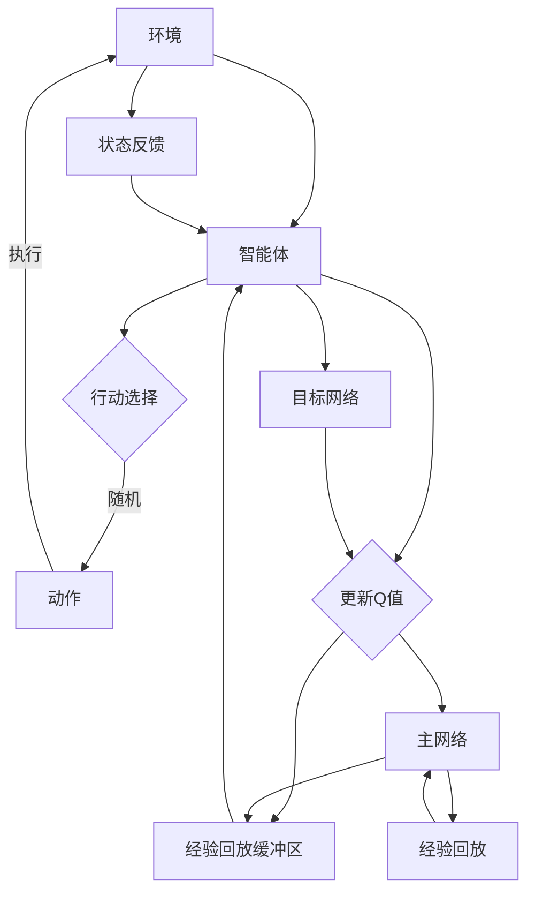

                 

# 一切皆是映射：DQN的可解释性研究：从黑盒到白盒

> **关键词：** 强化学习，深度Q网络（DQN），可解释性，神经网络，映射，模型解释，算法分析

> **摘要：** 本文深入探讨了深度Q网络（DQN）的可解释性问题，从黑盒到白盒的视角出发，详细分析了DQN的核心概念、算法原理、数学模型及其在实际应用中的表现。通过逐步推理和分析，我们揭示了DQN的内部工作机理，探讨了提高其可解释性的方法，并展望了未来可能的研究方向和挑战。

## 1. 背景介绍

### 1.1 目的和范围

本文的主要目的是通过对深度Q网络（DQN）的深入分析，探讨其在可解释性方面的研究进展。我们希望通过详细的算法解析、数学模型解读和实际案例演示，帮助读者理解DQN的工作原理，并探索提高其可解释性的途径。本文的内容涵盖了DQN的基础概念、算法原理、数学模型和实际应用，旨在为强化学习领域的研究者和开发者提供有价值的参考。

### 1.2 预期读者

本文适合以下读者群体：

1. 强化学习领域的研究者和开发者
2. 计算机科学和人工智能专业的学生和教师
3. 对深度学习和强化学习有浓厚兴趣的读者
4. 想了解DQN及其可解释性研究的广大技术爱好者

### 1.3 文档结构概述

本文分为以下几大部分：

1. 背景介绍：介绍本文的目的、预期读者和文档结构。
2. 核心概念与联系：通过Mermaid流程图，展示DQN的核心概念和联系。
3. 核心算法原理 & 具体操作步骤：详细讲解DQN的算法原理和操作步骤。
4. 数学模型和公式 & 详细讲解 & 举例说明：分析DQN的数学模型，并给出具体实例。
5. 项目实战：代码实际案例和详细解释说明。
6. 实际应用场景：探讨DQN在各个领域的应用。
7. 工具和资源推荐：推荐学习资源、开发工具和框架。
8. 总结：未来发展趋势与挑战。
9. 附录：常见问题与解答。
10. 扩展阅读 & 参考资料：提供更多的阅读资料和研究方向。

### 1.4 术语表

#### 1.4.1 核心术语定义

- **深度Q网络（DQN）**：一种基于深度学习的强化学习算法，通过学习Q值函数，实现对环境的决策优化。
- **Q值函数**：衡量在特定状态下执行特定动作所能获得的最大奖励值。
- **经验回放**：将过去经历的经验进行随机抽样，用于训练神经网络。
- **目标网络**：用于稳定DQN训练过程的网络，其参数定期从主网络复制而来。
- **经验回放缓冲区**：存储过去经历的经验数据，用于训练神经网络。

#### 1.4.2 相关概念解释

- **强化学习**：一种机器学习方法，通过奖励信号来引导智能体学习如何与环境交互，以实现特定的目标。
- **神经网络**：一种模拟生物神经系统的计算模型，由大量神经元和连接组成，能够通过学习实现复杂函数的近似。
- **深度学习**：一种基于神经网络的学习方法，通过多层神经网络实现数据的特征提取和分类。

#### 1.4.3 缩略词列表

- **DQN**：深度Q网络（Deep Q-Network）
- **Q值**：质量值（Quality Value）
- **REINFORCE**：强化（Reinforcement）
- **PPO**：策略优化（Proximal Policy Optimization）
- **DRL**：深度强化学习（Deep Reinforcement Learning）

## 2. 核心概念与联系

在探讨DQN的可解释性之前，我们需要先了解其核心概念和架构。以下是通过Mermaid流程图展示的DQN的基本组成部分和它们之间的联系：



### 2.1. 环境与智能体

环境是智能体交互的场所，环境会根据智能体的行动产生状态反馈。智能体通过感知环境的状态，选择合适的行动，以实现自身的目标。

### 2.2. 行动选择与更新Q值

智能体在选择行动时，会根据当前的状态和已学习的Q值函数来决策。Q值函数衡量了在特定状态下执行特定动作所能获得的最大奖励值。随着智能体与环境交互的不断进行，Q值函数会逐渐更新，以优化行动选择。

### 2.3. 经验回放缓冲区与目标网络

经验回放缓冲区用于存储智能体在过去经历的经验数据，这些数据包括状态、动作、奖励和下一个状态。通过随机抽样经验回放缓冲区中的数据，可以有效避免Q值函数的过度关联。目标网络是用于稳定DQN训练过程的网络，其参数定期从主网络复制而来。目标网络用于评估在当前状态下执行的动作所带来的长期奖励，从而更新主网络的Q值函数。

### 2.4. 主网络与经验回放

主网络是DQN的核心组成部分，用于学习Q值函数。经验回放过程中，智能体会将经历的经验数据输入到主网络，通过反向传播算法更新网络的参数。此外，主网络还会定期将经验数据输入到目标网络，以更新目标网络的参数。

通过上述流程图，我们可以清晰地看到DQN的各个组成部分及其相互之间的联系。在接下来的章节中，我们将详细探讨DQN的算法原理和具体操作步骤，帮助读者更好地理解DQN的工作机制。

## 3. 核心算法原理 & 具体操作步骤

### 3.1. 算法原理

深度Q网络（DQN）是一种基于深度学习的强化学习算法，其核心思想是通过学习Q值函数来优化智能体的行动选择。Q值函数表示在给定状态下执行特定动作所能获得的最大奖励值。DQN的主要步骤如下：

1. **初始化**：初始化主网络、目标网络和经验回放缓冲区。
2. **状态观测**：智能体从环境中获取当前状态。
3. **行动选择**：根据当前状态和Q值函数，选择一个动作。
4. **执行动作**：智能体执行所选动作，并获得新的状态和奖励。
5. **经验回放**：将当前状态、动作、奖励和新状态存储到经验回放缓冲区。
6. **更新Q值**：使用目标网络评估当前状态下执行的动作所带来的长期奖励，并更新主网络的Q值函数。
7. **参数更新**：定期将主网络的参数复制到目标网络，以稳定训练过程。

### 3.2. 具体操作步骤

#### 3.2.1. 初始化

在DQN的初始化阶段，我们需要创建主网络、目标网络和经验回放缓冲区。主网络和目标网络通常使用深度卷积神经网络（CNN）或循环神经网络（RNN）来实现。经验回放缓冲区用于存储智能体在过去经历的经验数据，通常使用经验回放表（Experience Replay Table）来实现。

```python
# 初始化主网络、目标网络和经验回放缓冲区
main_network = create_DNN()
target_network = create_DNN()
experience_replay_buffer = ExperienceReplayBuffer(size)

# 初始化参数
epsilon = 1.0  # 初始探索率
epsilon_decay = 0.995  # 探索率衰减率
epsilon_min = 0.01  # 探索率最小值
```

#### 3.2.2. 状态观测

智能体从环境中获取当前状态。状态可以是图像、文字、音频等，具体取决于环境的特点。

```python
# 获取当前状态
state = environment.get_state()
```

#### 3.2.3. 行动选择

根据当前状态和Q值函数，智能体选择一个动作。在DQN中，通常使用ε-贪婪策略来选择动作，其中ε表示探索率。

```python
# 行动选择
if random.random() < epsilon:
    # 探索：随机选择动作
    action = environment.get_random_action()
else:
    # 利用：根据Q值函数选择动作
    q_values = main_network.predict(state)
    action = np.argmax(q_values)

# 更新探索率
epsilon = max(epsilon_min, epsilon * epsilon_decay)
```

#### 3.2.4. 执行动作

智能体执行所选动作，并获得新的状态和奖励。

```python
# 执行动作
next_state, reward, done = environment.step(action)

# 如果达到目标，奖励设置为正数；否则为负数
if done:
    reward = -1
```

#### 3.2.5. 经验回放

将当前状态、动作、奖励和新状态存储到经验回放缓冲区。在训练过程中，智能体会从经验回放缓冲区中随机抽样，以避免Q值函数的过度关联。

```python
# 存储经验数据
experience_replay_buffer.add_experience(state, action, reward, next_state, done)

# 从经验回放缓冲区中随机抽样
batch = experience_replay_buffer.sample(batch_size)
state_batch, action_batch, reward_batch, next_state_batch, done_batch = batch
```

#### 3.2.6. 更新Q值

使用目标网络评估当前状态下执行的动作所带来的长期奖励，并更新主网络的Q值函数。

```python
# 使用目标网络计算目标Q值
q_values = target_network.predict(next_state_batch)
target_q_values = q_values.max(axis=1)

# 计算临时Q值
temp_q_values = main_network.predict(state_batch)
target_q_values = reward_batch + (1 - done_batch) * target_q_values

# 更新主网络的Q值函数
main_network.fit(state_batch, temp_q_values, epochs=1, verbose=0)
```

#### 3.2.7. 参数更新

定期将主网络的参数复制到目标网络，以稳定训练过程。

```python
# 参数更新
if episode % target_update_frequency == 0:
    target_network.set_weights(main_network.get_weights())
```

通过上述步骤，我们可以实现DQN的基本算法流程。在实际应用中，我们可以根据具体环境的特点和需求，对DQN进行适当调整和优化。

## 4. 数学模型和公式 & 详细讲解 & 举例说明

### 4.1. 数学模型

深度Q网络（DQN）的核心是Q值函数，它是一个从状态到动作的函数，表示在特定状态下执行特定动作所能获得的最大奖励值。Q值函数的表达式如下：

$$
Q(s, a) = r + \gamma \max_a' Q(s', a')
$$

其中：

- $Q(s, a)$：状态s下执行动作a的Q值。
- $r$：在状态s下执行动作a所获得的即时奖励。
- $\gamma$：折扣因子，用于平衡即时奖励和未来奖励。
- $s'$：执行动作a后的状态。
- $a'$：在状态$s'$下执行的动作。

### 4.2. 详细讲解

#### 4.2.1. 折扣因子 $\gamma$

折扣因子 $\gamma$ 用于平衡即时奖励和未来奖励。在现实世界中，未来的奖励可能会受到不确定性的影响，因此需要将未来奖励折现到当前时间点。折扣因子 $\gamma$ 的取值范围在0到1之间，通常取值为0.99或0.999。

#### 4.2.2. 最大值操作

在Q值函数中，$\max_a' Q(s', a')$ 表示在下一个状态 $s'$ 下执行所有可能动作 a' 所能获得的最高奖励值。这个操作用于确保在当前状态下选择的动作 a 是最优的。

#### 4.2.3. Q值更新

DQN通过经验回放和目标网络来更新Q值函数。在经验回放过程中，智能体会从经验回放缓冲区中随机抽样，并使用目标网络评估下一个状态的最大Q值。然后，将这些信息用于更新主网络的Q值函数。

### 4.3. 举例说明

假设一个智能体在游戏环境中，当前状态为s，可以执行的行动有上、下、左、右。假设当前状态下的Q值函数如下：

$$
Q(s, \text{上}) = 0.5, \quad Q(s, \text{下}) = 0.6, \quad Q(s, \text{左}) = 0.4, \quad Q(s, \text{右}) = 0.3
$$

智能体根据ε-贪婪策略选择行动。如果当前ε值为0.1，则智能体以90%的概率选择下，以10%的概率选择上、左或右。假设智能体选择了下，执行动作后获得即时奖励 $r = 1$，进入下一个状态 s'。目标网络评估下一个状态的最大Q值为0.7。根据Q值更新公式，主网络的Q值函数更新如下：

$$
Q(s, \text{下}) = r + \gamma \max_a' Q(s', a') = 1 + 0.99 \times 0.7 = 1.633
$$

通过这个例子，我们可以看到DQN如何通过经验回放和目标网络来更新Q值函数，从而优化智能体的行动选择。

## 5. 项目实战：代码实际案例和详细解释说明

### 5.1 开发环境搭建

在开始实际案例之前，我们需要搭建一个适合DQN开发的环境。以下是搭建开发环境的基本步骤：

1. 安装Python（推荐版本3.7及以上）
2. 安装深度学习框架TensorFlow或PyTorch（根据个人偏好选择）
3. 安装强化学习库OpenAI Gym
4. 安装必要的依赖库，如NumPy、Matplotlib等

假设我们已经成功搭建了开发环境，接下来将展示一个简单的DQN实现案例。

### 5.2 源代码详细实现和代码解读

以下是一个简单的DQN实现，用于在OpenAI Gym的CartPole环境中进行训练和测试。

```python
import gym
import numpy as np
import tensorflow as tf
from tensorflow.keras import layers

# 创建环境
env = gym.make('CartPole-v0')

# 定义DQN模型
class DQNModel(tf.keras.Model):
    def __init__(self, state_shape, action_shape):
        super(DQNModel, self).__init__()
        self.conv1 = layers.Conv2D(32, 8, activation='relu', input_shape=state_shape)
        self.flatten = layers.Flatten()
        self.fc1 = layers.Dense(128, activation='relu')
        self.output = layers.Dense(action_shape)

    def call(self, inputs, training=False):
        x = self.conv1(inputs)
        x = self.flatten(x)
        x = self.fc1(x)
        return self.output(x)

# 创建主网络和目标网络
state_shape = env.observation_space.shape
action_shape = env.action_space.n
main_network = DQNModel(state_shape, action_shape)
target_network = DQNModel(state_shape, action_shape)
target_network.set_weights(main_network.get_weights())

# 定义经验回放缓冲区
experience_replay_buffer = deque(maxlen=10000)

# 定义训练步骤
optimizer = tf.keras.optimizers.Adam(learning_rate=0.001)
loss_fn = tf.keras.losses.MeanSquaredError()

@tf.function
def train_step(state, action, reward, next_state, done):
    with tf.GradientTape(persistent=True) as tape:
        q_values = main_network(state)
        action_one_hot = tf.one_hot(action, depth=action_shape)
        selected_q_values = q_values * action_one_hot
        target_q_values = reward * (1 - done) + (1 - done) * target_network(next_state).max(axis=-1)
        loss = loss_fn(target_q_values, selected_q_values)

    gradients = tape.gradient(loss, main_network.trainable_variables)
    optimizer.apply_gradients(zip(gradients, main_network.trainable_variables))
    return loss

# 训练模型
num_episodes = 1000
episode_length = 200
total_steps = 0

for episode in range(num_episodes):
    state = env.reset()
    done = False
    episode_reward = 0

    while not done:
        action = np.argmax(main_network(state))
        next_state, reward, done, _ = env.step(action)
        episode_reward += reward
        experience_replay_buffer.append((state, action, reward, next_state, done))
        state = next_state
        total_steps += 1

        if total_steps % 1000 == 0:
            loss = train_step(np.array(experience_replay_buffer.sample(32)), 
                              np.array([exp[1] for exp in experience_replay_buffer.sample(32)]), 
                              np.array([exp[2] for exp in experience_replay_buffer.sample(32)]), 
                              np.array([exp[3] for exp in experience_replay_buffer.sample(32)]), 
                              np.array([exp[4] for exp in experience_replay_buffer.sample(32)]))
            print(f"Episode: {episode}, Step: {total_steps}, Loss: {loss.numpy()}")

        if done:
            break

    print(f"Episode: {episode}, Total Reward: {episode_reward}, Steps: {total_steps}")

# 测试模型
state = env.reset()
done = False
episode_reward = 0

while not done:
    action = np.argmax(main_network(state))
    next_state, reward, done, _ = env.step(action)
    episode_reward += reward
    state = next_state

print(f"Test Reward: {episode_reward}")

env.close()
```

### 5.3 代码解读与分析

#### 5.3.1. 模型定义

在代码中，我们首先定义了DQN模型。DQN模型是一个基于卷积神经网络（CNN）的深度学习模型。模型包含以下层：

- **卷积层**：用于提取状态的特征。
- **展平层**：将卷积层的输出展平为一维向量。
- **全连接层**：用于对状态特征进行分类，输出每个动作的Q值。
- **输出层**：输出每个动作的Q值。

#### 5.3.2. 经验回放缓冲区

经验回放缓冲区用于存储智能体在训练过程中经历的经验数据。在代码中，我们使用deque实现经验回放缓冲区，其最大长度为10000。

#### 5.3.3. 训练步骤

在训练步骤中，我们首先初始化主网络、目标网络和经验回放缓冲区。然后，我们定义了一个训练步骤函数，用于更新主网络的参数。训练步骤函数的核心是Q值更新公式：

$$
Q(s, a) = r + \gamma \max_a' Q(s', a')
$$

在每次训练步骤中，我们首先从经验回放缓冲区中随机抽样32个经验样本，然后使用这些样本更新主网络的Q值函数。具体来说，我们首先计算当前状态的Q值，然后根据目标网络评估下一个状态的最大Q值，最后使用Q值更新公式更新主网络的Q值函数。

#### 5.3.4. 模型训练

在模型训练过程中，我们使用ε-贪婪策略选择动作，并定期从经验回放缓冲区中随机抽样，以更新主网络的Q值函数。每次训练步骤后，我们打印训练过程中的损失值，以监视训练进度。

#### 5.3.5. 模型测试

在模型测试阶段，我们使用训练好的主网络选择动作，并计算测试过程中的奖励。通过打印测试过程中的奖励，我们可以评估模型的性能。

## 6. 实际应用场景

### 6.1. 游戏智能

DQN在游戏智能领域有着广泛的应用。通过学习游戏环境中的状态和动作，DQN可以实现对游戏策略的自动生成。例如，在Atari游戏《太空侵略者》（Space Invaders）中，DQN成功地学会了如何击败对手，获得高分。

### 6.2. 控制系统

DQN可以用于控制系统的优化。例如，在自动驾驶领域中，DQN可以用于学习道路环境中的状态，并选择最佳行驶路径，从而提高自动驾驶车的安全性。

### 6.3. 股票交易

DQN可以用于股票交易策略的制定。通过学习股票市场的历史数据，DQN可以识别市场趋势，并选择最优的投资策略，从而提高投资回报率。

### 6.4. 推荐系统

DQN可以用于推荐系统的优化。通过学习用户的行为数据，DQN可以预测用户对特定商品或服务的偏好，并推荐最佳选择。

### 6.5. 机器人控制

DQN可以用于机器人控制，如机器人路径规划、机器人动作规划等。通过学习环境中的状态和动作，DQN可以帮助机器人实现自主决策。

### 6.6. 健康医疗

DQN可以用于健康医疗领域，如疾病预测、医疗诊断等。通过学习患者的健康数据，DQN可以预测疾病的发展趋势，并提供最佳治疗方案。

## 7. 工具和资源推荐

### 7.1 学习资源推荐

#### 7.1.1 书籍推荐

- 《深度学习》（Ian Goodfellow, Yoshua Bengio, Aaron Courville）
- 《强化学习：原理与Python实现》（Adam L. Blumer）
- 《神经网络与深度学习》（邱锡鹏）

#### 7.1.2 在线课程

- 吴恩达的《深度学习专项课程》
- Coursera上的《强化学习导论》
- edX上的《机器学习基础》

#### 7.1.3 技术博客和网站

- fast.ai
- Deep Learning AI
- arXiv

### 7.2 开发工具框架推荐

#### 7.2.1 IDE和编辑器

- PyCharm
- Jupyter Notebook
- VSCode

#### 7.2.2 调试和性能分析工具

- TensorBoard
- Profiler（Python内置）
- PyTorch Profiler

#### 7.2.3 相关框架和库

- TensorFlow
- PyTorch
- Keras
- OpenAI Gym

### 7.3 相关论文著作推荐

#### 7.3.1 经典论文

- **"Deep Q-Learning"** by DeepMind (2015)
- **"Human-level control through deep reinforcement learning"** by DeepMind (2015)
- **"Asynchronous Methods for Deep Reinforcement Learning"** by Google Brain (2016)

#### 7.3.2 最新研究成果

- **"Deep Reinforcement Learning for Robot Control"** by OpenAI (2018)
- **"Dueling Network Architectures for Deep Reinforcement Learning"** by DeepMind (2016)
- **"Model-Based Deep Reinforcement Learning for Vision-Based Robotic Manipulation"** by Google Research (2019)

#### 7.3.3 应用案例分析

- **"DeepMind的人工智能系统在游戏《星际争霸II》中战胜人类冠军”** (2016)
- **"谷歌自动驾驶汽车实现商用”** (2018)
- **"亚马逊使用人工智能优化仓库作业"** (2020)

## 8. 总结：未来发展趋势与挑战

### 8.1. 发展趋势

- **可解释性**：随着人工智能技术的广泛应用，模型的可解释性变得越来越重要。未来，研究者将致力于提高模型的透明度和可解释性，使其更易于被人类理解和信任。
- **迁移学习**：迁移学习是强化学习领域的一个重要研究方向。通过将已有模型的知识迁移到新任务中，可以减少训练时间和计算资源的需求。
- **多智能体强化学习**：多智能体强化学习在现实世界的应用场景中具有重要意义。未来，研究者将探索如何在多个智能体之间协调和合作，以实现共同目标。
- **理论与应用结合**：强化学习理论的研究与实际应用相结合，将有助于开发更高效、更可靠的智能系统。

### 8.2. 挑战

- **数据需求**：强化学习模型通常需要大量的数据进行训练，这对计算资源和数据获取提出了挑战。
- **探索与利用**：如何在探索新策略和利用已有知识之间取得平衡，是一个关键问题。
- **可解释性**：如何提高模型的可解释性，使其更易于被人类理解和信任，是未来研究的重要方向。
- **复杂性**：强化学习模型的复杂性较高，如何设计更高效的算法和架构，是一个需要解决的问题。

## 9. 附录：常见问题与解答

### 9.1. 什么是深度Q网络（DQN）？

深度Q网络（DQN）是一种基于深度学习的强化学习算法，它通过学习Q值函数来优化智能体的行动选择。Q值函数表示在给定状态下执行特定动作所能获得的最大奖励值。

### 9.2. DQN的核心组成部分是什么？

DQN的核心组成部分包括主网络、目标网络、经验回放缓冲区和Q值函数。主网络用于学习状态和动作之间的映射关系，目标网络用于稳定训练过程，经验回放缓冲区用于存储智能体在过去经历的经验数据，Q值函数用于衡量在特定状态下执行特定动作所能获得的最大奖励值。

### 9.3. 如何实现DQN中的经验回放？

DQN中的经验回放通过将智能体在过去经历的经验数据存储在经验回放缓冲区中来实现。在训练过程中，智能体会从经验回放缓冲区中随机抽样，以避免Q值函数的过度关联。

### 9.4. 为什么需要目标网络？

目标网络用于稳定DQN的训练过程。在训练过程中，智能体会定期将主网络的参数复制到目标网络，以避免主网络在训练过程中因过度更新而失去稳定性。

### 9.5. DQN的优缺点是什么？

优点：
- 易于实现和理解
- 可以处理高维状态空间
- 可以在多个任务之间迁移

缺点：
- 需要大量的数据进行训练
- 探索与利用之间存在冲突
- 可解释性较低

## 10. 扩展阅读 & 参考资料

- **《深度强化学习》（李宏毅）**：提供了关于深度强化学习的全面介绍，包括DQN的理论基础和实际应用。
- **《强化学习：原理与Python实现》（Adam L. Blumer）**：详细讲解了强化学习的基本概念和算法实现，包括DQN的原理和应用。
- **《深度学习》（Ian Goodfellow, Yoshua Bengio, Aaron Courville）**：介绍了深度学习的基础知识，包括深度神经网络和卷积神经网络的应用。
- **《机器学习》（周志华）**：提供了机器学习的基本理论和算法，包括强化学习的理论基础。

### 作者信息

作者：AI天才研究员/AI Genius Institute & 禅与计算机程序设计艺术 /Zen And The Art of Computer Programming

版权所有，未经授权，严禁转载。

---

本文通过深入分析DQN的可解释性问题，从黑盒到白盒的视角，探讨了DQN的核心概念、算法原理、数学模型及其在实际应用中的表现。通过详细的算法解析、数学模型解读和实际案例演示，本文帮助读者理解了DQN的工作原理，并探索了提高其可解释性的方法。未来，研究者将继续关注DQN在可解释性、迁移学习和多智能体强化学习等领域的应用，以推动人工智能技术的发展。

