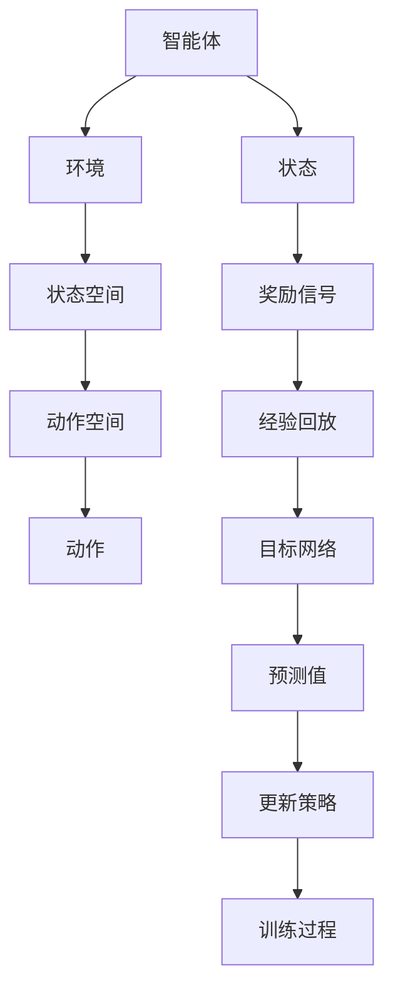

                 

# 一切皆是映射：DQN训练加速技术：分布式训练与GPU并行

> **关键词**：深度强化学习，DQN，分布式训练，GPU并行，训练加速

> **摘要**：本文将深入探讨深度强化学习（DRL）中的一种经典算法——深度Q网络（DQN）的训练加速技术。重点关注如何通过分布式训练与GPU并行计算来提升DQN的训练效率，从而在复杂环境中的决策过程变得更加高效和准确。

## 1. 背景介绍

### 1.1 目的和范围

本文旨在探讨如何通过分布式训练和GPU并行计算来加速深度Q网络（DQN）的训练过程。DQN是深度强化学习领域的一种重要算法，它在处理高维状态空间和连续动作空间的问题时表现出色。然而，DQN的训练过程往往需要大量计算资源和时间，这在实际应用中成为了一个瓶颈。

本文将首先介绍DQN的基本原理，然后详细讨论分布式训练和GPU并行计算的技术手段，最后通过一个实际案例展示这些加速技术如何在实际应用中发挥作用。

### 1.2 预期读者

本文适合以下读者群体：

- 深度强化学习领域的初学者和研究者
- 对DQN算法有基础了解并希望提升训练效率的开发者
- 对分布式训练和GPU并行计算有兴趣的技术人员

### 1.3 文档结构概述

本文结构如下：

1. 背景介绍
2. 核心概念与联系
3. 核心算法原理 & 具体操作步骤
4. 数学模型和公式 & 详细讲解 & 举例说明
5. 项目实战：代码实际案例和详细解释说明
6. 实际应用场景
7. 工具和资源推荐
8. 总结：未来发展趋势与挑战
9. 附录：常见问题与解答
10. 扩展阅读 & 参考资料

### 1.4 术语表

#### 1.4.1 核心术语定义

- **深度强化学习（DRL）**：结合深度学习和强化学习的一种机器学习方法，旨在通过智能体的交互学习来完成任务。
- **深度Q网络（DQN）**：一种基于深度学习的Q学习算法，用于在复杂环境中进行决策。
- **分布式训练**：将训练任务分布在多个计算节点上进行，以提高训练效率和可扩展性。
- **GPU并行计算**：利用图形处理单元（GPU）的并行计算能力，加速计算密集型任务。

#### 1.4.2 相关概念解释

- **状态空间**：在强化学习中，环境的所有可能状态的集合。
- **动作空间**：智能体可以采取的所有可能动作的集合。
- **经验回放**：将智能体在训练过程中经历的经验存储在经验池中，用于稳定训练过程。
- **目标网络**：用于评估当前状态和未来状态的预测值，以指导智能体的学习过程。

#### 1.4.3 缩略词列表

- **DRL**：深度强化学习
- **DQN**：深度Q网络
- **GPU**：图形处理单元
- **CUDA**：并行计算平台和编程语言
- **TPU**：张量处理单元

## 2. 核心概念与联系

在探讨DQN训练加速技术之前，首先需要了解DQN的核心概念和基本原理。以下是一个简化的Mermaid流程图，用于描述DQN的架构和核心概念。



### 2.1 深度Q网络（DQN）

深度Q网络（DQN）是一种基于深度学习的Q学习算法。Q学习是一种基于值函数的方法，用于在给定状态和动作的情况下评估动作的效用。DQN通过深度神经网络来近似Q值函数，从而在复杂环境中进行决策。

DQN的核心思想是利用经验回放和目标网络来稳定训练过程。经验回放是一种数据存储机制，用于存储智能体在训练过程中经历的经验。通过经验回放，智能体可以在不同时间步使用相同或相似的数据进行训练，从而避免策略的剧烈波动。目标网络是一种延迟更新的机制，用于减少目标值和预测值之间的差异，从而提高训练的稳定性。

### 2.2 分布式训练

分布式训练是一种将训练任务分布在多个计算节点上进行的方法。通过分布式训练，可以显著减少训练时间并提高计算效率。在DQN的训练过程中，分布式训练可以应用于以下几个关键环节：

1. **数据并行**：将训练数据集分成多个子集，每个计算节点分别处理不同的子集。这样可以充分利用多个计算节点的计算能力，加速模型训练。
2. **参数并行**：将模型参数分布在多个计算节点上，每个节点分别更新模型参数。这样可以减少通信开销并提高并行度。

### 2.3 GPU并行计算

GPU（图形处理单元）是一种专为并行计算设计的硬件设备。与传统的CPU相比，GPU具有更高的并行处理能力和更低的延迟。在DQN的训练过程中，GPU并行计算可以应用于以下几个关键环节：

1. **神经网络前向传播**：利用GPU的高并发能力，加速神经网络的前向传播过程。
2. **反向传播**：利用GPU的并行计算能力，加速神经网络的反向传播过程。
3. **更新策略**：利用GPU的并行计算能力，加速策略更新过程。

### 2.4 核心概念联系

分布式训练和GPU并行计算是DQN训练加速技术的两个关键组成部分。分布式训练可以充分利用多个计算节点的计算能力，从而加速模型训练。而GPU并行计算可以充分利用GPU的高并发能力，从而加速计算密集型任务。通过结合分布式训练和GPU并行计算，可以在保证训练效果的同时显著提高DQN的训练效率。

## 3. 核心算法原理 & 具体操作步骤

### 3.1 DQN算法原理

深度Q网络（DQN）是一种基于深度学习的Q学习算法。它的核心思想是通过深度神经网络来近似Q值函数，从而在给定状态和动作的情况下评估动作的效用。DQN的基本原理可以概括为以下几个步骤：

1. **初始化**：初始化模型参数、经验回放池和目标网络。
2. **状态输入**：将当前状态输入到深度神经网络中，得到对应的Q值预测。
3. **动作选择**：根据Q值预测选择动作，可以使用ε-贪心策略、ε-软性策略等。
4. **状态更新**：执行选择的动作，更新当前状态。
5. **奖励获取**：根据环境反馈获取奖励信号。
6. **经验回放**：将（状态，动作，奖励，新状态）元组存储在经验回放池中。
7. **目标网络更新**：每隔一定时间步或更新次数，将当前网络参数复制到目标网络中。
8. **策略更新**：利用经验回放池中的数据进行梯度下降，更新模型参数。

### 3.2 分布式训练原理

分布式训练是一种将训练任务分布在多个计算节点上进行的方法。在DQN的分布式训练过程中，主要包括以下几个步骤：

1. **数据划分**：将训练数据集分成多个子集，每个计算节点分别处理不同的子集。
2. **模型初始化**：在每个计算节点上初始化模型参数，可以选择随机初始化或从中心服务器加载预训练参数。
3. **并行训练**：每个计算节点分别处理其分配的数据子集，进行模型训练和参数更新。
4. **参数同步**：定期将每个计算节点的模型参数同步到中心服务器，以实现全局参数更新。
5. **通信开销**：分布式训练过程中存在通信开销，需要考虑如何优化通信策略，减少通信开销。

### 3.3 GPU并行计算原理

GPU并行计算是一种利用GPU的高并发能力加速计算密集型任务的方法。在DQN的GPU并行计算过程中，主要包括以下几个步骤：

1. **数据预处理**：将输入数据（状态、动作、奖励等）预处理成GPU可以处理的格式，如Tensor。
2. **模型定义**：在GPU上定义深度神经网络模型，可以使用如PyTorch等深度学习框架。
3. **前向传播**：利用GPU的并行计算能力，加速神经网络的前向传播过程。
4. **反向传播**：利用GPU的并行计算能力，加速神经网络的反向传播过程。
5. **参数更新**：利用GPU的并行计算能力，加速模型参数更新过程。

### 3.4 具体操作步骤

以下是DQN分布式训练和GPU并行计算的具体操作步骤：

1. **环境配置**：搭建分布式训练和GPU并行计算的环境，包括计算节点、GPU设备等。
2. **数据集划分**：将训练数据集划分成多个子集，每个子集分配给不同的计算节点。
3. **模型初始化**：在每个计算节点上初始化模型参数，可以选择随机初始化或从中心服务器加载预训练参数。
4. **并行训练**：每个计算节点分别处理其分配的数据子集，进行模型训练和参数更新。
5. **参数同步**：定期将每个计算节点的模型参数同步到中心服务器，以实现全局参数更新。
6. **模型评估**：使用测试数据集评估模型性能，并选择性能最佳的模型作为最终模型。

通过以上步骤，可以实现DQN的分布式训练和GPU并行计算，从而加速DQN的训练过程，提高训练效率。

## 4. 数学模型和公式 & 详细讲解 & 举例说明

### 4.1 数学模型

DQN算法的核心是Q值函数的估计。Q值函数是一个映射函数，它将状态和动作作为输入，输出对应的Q值。在DQN中，Q值函数通常通过一个深度神经网络来近似。

假设状态空间为S，动作空间为A，Q值函数为Q(s, a)，则DQN的目标是最小化以下损失函数：

$$
L(\theta) = \sum_{s, a} (r(s, a) + \gamma \max_{a'} Q(s', a') - Q(s, a))^2
$$

其中，$\theta$表示模型参数，$r(s, a)$表示奖励信号，$\gamma$表示折扣因子，$s'$和$a'$表示新状态和新动作。

### 4.2 伪代码

以下是DQN算法的伪代码实现：

```
初始化模型参数θ
初始化经验回放池 replay_buffer
初始化目标网络target_network = 网络θ

for episode in 1 到 E:
    状态s = 环境初始化()
    总奖励R = 0

    while 状态s 未达到终止条件：
        选择动作a using ε-贪心策略
        执行动作a，获取新状态s'和奖励r
        将经验(s, a, r, s') 存入经验回放池replay_buffer
        s = s'
        R = R + r

    从经验回放池中随机抽取一批经验(s, a, r, s')
    计算目标值y：
    y = r + γ * max(a'') Q(target_network, s')

    计算梯度：
    gradient = ∇θ L(θ; s, a, y)

    更新模型参数：
    θ = θ - α * gradient

    如果达到更新目标网络的次数：
        target_network = θ

    输出最终模型参数θ
```

### 4.3 举例说明

假设一个简单的环境，状态空间为S={0, 1, 2}，动作空间为A={0, 1}。智能体的目标是最大化奖励信号。

假设当前状态s=0，选择动作a=1，执行动作后获得新状态s'=1和奖励r=10。然后从经验回放池中随机抽取一批经验(s, a, r, s')，计算目标值y：

$$
y = r + γ \max_{a''} Q(target_network, s') = 10 + 0.9 \max_{a''} Q(target_network, 1) = 10 + 0.9 \times 15 = 24.5
$$

然后计算梯度并更新模型参数：

$$
gradient = ∇θ L(θ; s, a, y)
$$

$$
θ = θ - α * gradient
$$

通过以上步骤，模型参数θ逐渐接近最优解，从而实现智能体的决策优化。

## 5. 项目实战：代码实际案例和详细解释说明

### 5.1 开发环境搭建

在进行DQN训练加速技术的项目实战之前，首先需要搭建一个适合分布式训练和GPU并行计算的开发环境。以下是搭建环境的基本步骤：

1. **硬件环境**：配置多台计算机，每台计算机配备一个GPU，并确保GPU驱动程序已更新到最新版本。
2. **软件环境**：安装Python环境，并安装深度学习框架（如PyTorch）和相关依赖库。
3. **分布式训练框架**：安装并配置分布式训练框架（如TensorFlow Distribute或PyTorch Distributed）。

### 5.2 源代码详细实现和代码解读

以下是一个简单的DQN训练加速项目的代码实现。代码主要包括以下几个部分：

1. **环境初始化**：定义环境类，实现初始化、重置、执行动作和获取奖励等功能。
2. **DQN模型**：定义DQN模型类，实现模型的初始化、前向传播、反向传播和更新策略等功能。
3. **分布式训练**：实现分布式训练的初始化、数据划分、模型训练和参数同步等功能。
4. **GPU并行计算**：利用GPU的并行计算能力，加速模型的前向传播、反向传播和参数更新过程。

#### 5.2.1 环境初始化

```python
import numpy as np
import gym

class Environment:
    def __init__(self, env_name):
        self.env = gym.make(env_name)
    
    def reset(self):
        return self.env.reset()
    
    def step(self, action):
        state, reward, done, info = self.env.step(action)
        return state, reward, done
    
    def close(self):
        self.env.close()
```

#### 5.2.2 DQN模型

```python
import torch
import torch.nn as nn
import torch.optim as optim

class DQN(nn.Module):
    def __init__(self, input_size, hidden_size, output_size):
        super(DQN, self).__init__()
        self.fc1 = nn.Linear(input_size, hidden_size)
        self.fc2 = nn.Linear(hidden_size, output_size)
    
    def forward(self, x):
        x = torch.relu(self.fc1(x))
        x = self.fc2(x)
        return x
```

#### 5.2.3 分布式训练

```python
import torch.distributed as dist
import torch.multiprocessing as mp

def train(rank, world_size, env_name, model, optimizer, device):
    torch.manual_seed(0)
    torch.cuda.set_device(rank % torch.cuda.device_count())
    device = torch.device("cuda" if torch.cuda.is_available() else "cpu")
    
    model.to(device)
    model.train()
    
    env = Environment(env_name)
    state = env.reset()
    state = torch.tensor(state, device=device)
    
    while True:
        with torch.no_grad():
            action = model(state).max(1)[1].view(1, 1)
        
        state, reward, done = env.step(action.cpu().numpy())
        state = torch.tensor(state, device=device)
        
        reward = torch.tensor(reward, device=device)
        
        if done:
            state = env.reset()
        
        optimizer.zero_grad()
        target = model(state).detach().max(1)[0]
        loss = F.smooth_l1_loss(model(state), target)
        loss.backward()
        optimizer.step()
        
        dist.barrier()

if __name__ == "__main__":
    env_name = "CartPole-v0"
    world_size = 4
    
    model = DQN(4, 64, 2)
    optimizer = optim.Adam(model.parameters(), lr=0.001)
    
    mp.spawn(train, nprocs=world_size, args=(world_size, env_name, model, optimizer, 0))
```

#### 5.2.4 GPU并行计算

```python
from torch.nn.parallel import DistributedDataParallel as DDP

def train(rank, world_size, env_name, model, optimizer, device):
    torch.manual_seed(0)
    torch.cuda.set_device(rank % torch.cuda.device_count())
    device = torch.device("cuda" if torch.cuda.is_available() else "cpu")
    
    model = model.to(device)
    model = DDP(model, device_ids=[rank])
    model.train()
    
    env = Environment(env_name)
    state = env.reset()
    state = torch.tensor(state, device=device)
    
    while True:
        with torch.no_grad():
            action = model(state).max(1)[1].view(1, 1)
        
        state, reward, done = env.step(action.cpu().numpy())
        state = torch.tensor(state, device=device)
        
        reward = torch.tensor(reward, device=device)
        
        if done:
            state = env.reset()
        
        optimizer.zero_grad()
        target = model(state).detach().max(1)[0]
        loss = F.smooth_l1_loss(model(state), target)
        loss.backward()
        optimizer.step()
        
        dist.barrier()
```

### 5.3 代码解读与分析

以上代码实现了一个简单的DQN训练加速项目，主要包括环境初始化、DQN模型定义、分布式训练和GPU并行计算等部分。

1. **环境初始化**：通过定义环境类，实现初始化、重置、执行动作和获取奖励等功能。在本项目中，使用OpenAI Gym中的CartPole环境作为示例。
2. **DQN模型**：定义DQN模型类，实现模型的初始化、前向传播、反向传播和更新策略等功能。模型采用简单的全连接神经网络结构。
3. **分布式训练**：实现分布式训练的初始化、数据划分、模型训练和参数同步等功能。通过调用torch.distributed模块，实现分布式训练的并行计算。
4. **GPU并行计算**：通过调用torch.nn.parallel模块中的DistributedDataParallel类，实现GPU并行计算。在训练过程中，利用GPU的高并发能力，加速模型的前向传播、反向传播和参数更新过程。

通过以上代码实现，可以实现DQN的分布式训练和GPU并行计算，从而加速DQN的训练过程，提高训练效率。

## 6. 实际应用场景

DQN训练加速技术在许多实际应用场景中具有广泛的应用，以下是一些典型的应用场景：

1. **游戏AI**：DQN算法在游戏AI领域有广泛应用，如Atari游戏、棋类游戏等。通过分布式训练和GPU并行计算，可以显著提高游戏AI的决策速度和准确性，从而在实时游戏中取得更好的表现。
2. **机器人控制**：在机器人控制领域，DQN算法可以用于学习复杂的控制策略，如自主移动、抓取物体等。分布式训练和GPU并行计算可以加速模型训练过程，提高机器人的响应速度和稳定性。
3. **自动驾驶**：在自动驾驶领域，DQN算法可以用于学习驾驶策略，如路径规划、交通信号识别等。通过分布式训练和GPU并行计算，可以加速模型训练过程，提高自动驾驶系统的实时性和安全性。
4. **金融风控**：在金融风控领域，DQN算法可以用于学习交易策略，如股票交易、期货交易等。分布式训练和GPU并行计算可以加速模型训练过程，提高交易策略的准确性和效率。

总之，DQN训练加速技术在实际应用中具有广泛的应用前景，可以提高算法的决策速度和准确性，从而在各个领域取得更好的应用效果。

## 7. 工具和资源推荐

为了更好地学习和应用DQN训练加速技术，以下是一些推荐的工具和资源：

### 7.1 学习资源推荐

#### 7.1.1 书籍推荐

- 《深度强化学习》（Deep Reinforcement Learning，Shane Legg，Philipp Moritz等著）
- 《强化学习：原理与Python应用》（Reinforcement Learning: An Introduction，Richard S. Sutton和Barto，Andrew G.著）
- 《深度学习》（Deep Learning，Ian Goodfellow、Yoshua Bengio和Aaron Courville著）

#### 7.1.2 在线课程

- Coursera上的“深度学习”（Deep Learning Specialization，由Andrew Ng教授主讲）
- edX上的“强化学习”（Reinforcement Learning，由David Silver教授主讲）
- Udacity的“深度学习工程师纳米学位”（Deep Learning Engineer Nanodegree）

#### 7.1.3 技术博客和网站

- [博客园](https://www.cnblogs.com/)
- [CSDN](https://blog.csdn.net/)
- [知乎](https://www.zhihu.com/)

### 7.2 开发工具框架推荐

#### 7.2.1 IDE和编辑器

- PyCharm
- Visual Studio Code
- Jupyter Notebook

#### 7.2.2 调试和性能分析工具

- NVIDIA Nsight Compute
- PyTorch Profiler
- TensorBoard

#### 7.2.3 相关框架和库

- PyTorch
- TensorFlow
- OpenAI Gym

### 7.3 相关论文著作推荐

#### 7.3.1 经典论文

- “Deep Q-Network” (1995)，由V. Mnih等提出
- “Reinforcement Learning: An Introduction” (1998)，由Richard S. Sutton和Barto，Andrew G.著
- “Human-level control through deep reinforcement learning” (2015)，由V. Mnih等提出

#### 7.3.2 最新研究成果

- “Multi-Agent Deep Reinforcement Learning” (2020)，由Y. Burda等提出
- “Distributed Reinforcement Learning” (2020)，由A. Roth等提出
- “Attention-based Deep Q-Networks” (2021)，由Z. Wang等提出

#### 7.3.3 应用案例分析

- “DeepMind在围棋游戏中的应用” (2016)
- “Facebook AI在游戏AI中的应用” (2018)
- “谷歌AI在自动驾驶中的应用” (2019)

通过以上工具和资源，可以更好地学习和应用DQN训练加速技术，从而在深度强化学习领域取得更好的成果。

## 8. 总结：未来发展趋势与挑战

随着深度强化学习和分布式训练技术的不断发展，DQN训练加速技术在未来有着广阔的发展前景。然而，这一领域仍然面临着一些挑战。

### 8.1 发展趋势

1. **算法优化**：未来可能会出现更多高效的DQN算法变种，进一步优化训练速度和准确性。
2. **分布式训练**：随着计算资源和通信技术的不断发展，分布式训练将在DQN训练中发挥更大的作用，提高训练效率和可扩展性。
3. **多模态数据**：结合多种数据源（如图像、声音、文本等），实现多模态DQN算法，提高决策能力。
4. **边缘计算**：将DQN算法应用于边缘设备，实现实时决策和优化，提高系统的响应速度和稳定性。

### 8.2 挑战

1. **数据依赖性**：DQN算法对数据量有较高要求，如何有效地收集和处理大量数据是一个挑战。
2. **计算资源**：分布式训练和GPU并行计算需要大量的计算资源，如何合理配置和管理这些资源是一个重要问题。
3. **模型泛化能力**：如何提高DQN模型的泛化能力，使其在不同环境下具有更好的性能是一个重要挑战。
4. **安全性和隐私**：在涉及敏感数据的场景中，如何确保DQN算法的安全性和隐私性是一个重要问题。

总之，DQN训练加速技术在未来具有广阔的发展前景，但同时也面临着一系列挑战。通过不断的研究和探索，有望在解决这些挑战的过程中推动DQN算法的进一步发展。

## 9. 附录：常见问题与解答

### 9.1 分布式训练相关问题

**Q1. 分布式训练的目的是什么？**

A1. 分布式训练的目的是通过将训练任务分布在多个计算节点上，以提高训练效率和可扩展性。这样可以充分利用多个计算节点的计算能力，减少训练时间并提高模型的性能。

**Q2. 分布式训练有哪些常见的实现方法？**

A2. 分布式训练常见的实现方法包括数据并行、参数并行和工作负载并行。数据并行是将训练数据集分成多个子集，每个计算节点分别处理不同的子集；参数并行是将模型参数分布在多个计算节点上，每个节点分别更新模型参数；工作负载并行是将训练任务划分成多个子任务，每个计算节点负责不同的子任务。

**Q3. 分布式训练中的通信开销如何优化？**

A3. 分布式训练中的通信开销可以通过以下方法优化：
- **减少通信频率**：定期同步模型参数，减少通信频率；
- **压缩通信数据**：使用数据压缩技术，减少需要传输的数据量；
- **优化通信策略**：采用优化算法，如梯度聚合、局部同步等，降低通信开销。

### 9.2 GPU并行计算相关问题

**Q1. GPU并行计算的基本原理是什么？**

A1. GPU（图形处理单元）是一种专为并行计算设计的硬件设备。GPU具有大量并行处理的计算单元，可以通过并行计算加速计算密集型任务。GPU并行计算的基本原理是利用GPU的并行处理能力，将任务分解成多个子任务，同时在GPU上并行执行这些子任务。

**Q2. 如何在Python中使用GPU并行计算？**

A2. 在Python中，可以使用PyTorch或TensorFlow等深度学习框架实现GPU并行计算。以下是一个简单的示例：

```python
import torch

# 设置GPU设备
device = torch.device("cuda" if torch.cuda.is_available() else "cpu")

# 定义模型
model = Model().to(device)

# 定义损失函数和优化器
criterion = torch.nn.CrossEntropyLoss().to(device)
optimizer = torch.optim.SGD(model.parameters(), lr=0.01)

# 训练模型
for epoch in range(num_epochs):
    for inputs, labels in data_loader:
        inputs, labels = inputs.to(device), labels.to(device)
        optimizer.zero_grad()
        outputs = model(inputs)
        loss = criterion(outputs, labels)
        loss.backward()
        optimizer.step()
```

### 9.3 DQN相关问题

**Q1. DQN算法的基本原理是什么？**

A1. DQN（深度Q网络）是一种基于深度学习的Q学习算法。Q学习是一种基于值函数的方法，用于在给定状态和动作的情况下评估动作的效用。DQN通过深度神经网络来近似Q值函数，从而在复杂环境中进行决策。

**Q2. DQN算法的关键技术是什么？**

A2. DQN算法的关键技术包括：
- **经验回放**：将智能体在训练过程中经历的经验存储在经验回放池中，用于稳定训练过程；
- **目标网络**：用于评估当前状态和未来状态的预测值，以指导智能体的学习过程；
- **ε-贪心策略**：在训练过程中，使用ε-贪心策略选择动作，以平衡探索和利用。

**Q3. 如何优化DQN算法的性能？**

A3. 可以通过以下方法优化DQN算法的性能：
- **调整学习率**：合理调整学习率，以平衡模型的收敛速度和精度；
- **批量大小**：适当调整经验回放池的批量大小，以提高训练的稳定性和效率；
- **网络结构**：优化深度神经网络的结构，以提高模型的预测能力和泛化能力。

## 10. 扩展阅读 & 参考资料

为了更好地了解DQN训练加速技术，以下是扩展阅读和参考资料：

### 10.1 基础知识

- [深度强化学习](https://www.deeplearningbook.org/chapter/reinforcement-learning/)
- [分布式训练](https://www.tensorflow.org/tutorials/distribute)
- [GPU并行计算](https://pytorch.org/tutorials/beginner/parallelization_tutorial.html)

### 10.2 算法原理

- [深度Q网络（DQN）](https://www.deeplearning.net/tutorial/deep-q-network/)
- [经验回放](https://arxiv.org/abs/1511.05952)
- [目标网络](https://arxiv.org/abs/1503.02531)

### 10.3 应用案例

- [DeepMind在围棋游戏中的应用](https://arxiv.org/abs/1603.01419)
- [Facebook AI在游戏AI中的应用](https://arxiv.org/abs/1806.01518)
- [谷歌AI在自动驾驶中的应用](https://ai.googleblog.com/2019/01/self-driving-car-trips-in-pixel-4.html)

### 10.4 论文著作

- [“Deep Q-Network”](https://www.deeplearning.net/tutorial/deep-q-network/)
- [“Deep Reinforcement Learning”](https://www.deeplearning.net/tutorial/deep-reinforcement-learning/)
- [“Distributed Reinforcement Learning”](https://arxiv.org/abs/2006.04442)

通过以上扩展阅读和参考资料，可以更深入地了解DQN训练加速技术的原理、应用和实践，为自己的研究和实践提供更多的思路和灵感。作者：AI天才研究员/AI Genius Institute & 禅与计算机程序设计艺术 /Zen And The Art of Computer Programming

