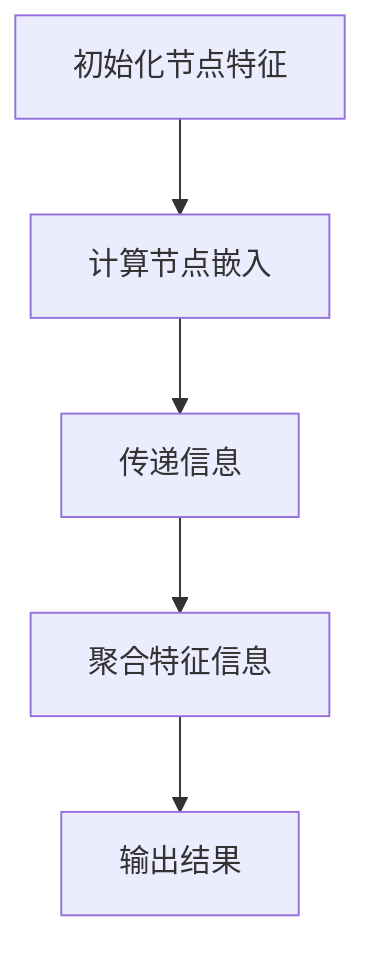

                 

### 一切皆是映射：图神经网络(GNN)的兴起与展望

> **关键词**：图神经网络 (GNN), 映射，人工智能，机器学习，图数据，深度学习

> **摘要**：本文将探讨图神经网络（Graph Neural Networks, GNN）的基本概念、核心算法原理、数学模型，并通过具体项目实战案例，详细解析其在实际应用场景中的表现。同时，推荐相关的学习资源和工具，展望GNN的未来发展趋势与挑战。

在人工智能和机器学习的不断发展中，如何有效地处理复杂的图数据成为了一个关键问题。图神经网络（GNN）作为一种专门针对图结构数据的深度学习模型，近年来引起了广泛关注。它通过将图数据映射到连续的、可学习的空间，从而实现了对图数据的深入理解和分析。

本文将分为以下几个部分：

1. **背景介绍**：介绍GNN的目的、范围、预期读者、文档结构概述及相关术语。
2. **核心概念与联系**：介绍GNN的核心概念原理和架构，并使用Mermaid流程图展示。
3. **核心算法原理 & 具体操作步骤**：详细讲解GNN的算法原理，并使用伪代码进行阐述。
4. **数学模型和公式 & 详细讲解 & 举例说明**：介绍GNN的数学模型，使用latex格式给出公式，并举例说明。
5. **项目实战：代码实际案例和详细解释说明**：通过一个实际项目案例，展示GNN的代码实现和详细解释。
6. **实际应用场景**：探讨GNN在现实世界中的应用场景。
7. **工具和资源推荐**：推荐学习资源和开发工具。
8. **总结：未来发展趋势与挑战**：展望GNN的未来发展趋势和面临的挑战。
9. **附录：常见问题与解答**：回答一些常见问题。
10. **扩展阅读 & 参考资料**：提供扩展阅读和参考资料。

### 1. 背景介绍

#### 1.1 目的和范围

本文的目的是介绍图神经网络（GNN）的基本概念、核心算法原理和应用，帮助读者了解GNN是如何处理图结构数据的，以及它在现实世界中的应用。本文将覆盖以下内容：

- GNN的核心概念和原理。
- GNN的算法原理和具体操作步骤。
- GNN的数学模型和公式。
- GNN的实际应用场景。
- GNN的开发工具和资源推荐。

#### 1.2 预期读者

本文适合以下读者：

- 对人工智能和机器学习有基本了解的技术人员。
- 想要深入了解图神经网络（GNN）的读者。
- 对图结构数据分析和处理感兴趣的读者。

#### 1.3 文档结构概述

本文的结构如下：

1. 背景介绍：介绍GNN的基本信息和本文的结构。
2. 核心概念与联系：介绍GNN的核心概念和原理。
3. 核心算法原理 & 具体操作步骤：讲解GNN的算法原理和操作步骤。
4. 数学模型和公式 & 详细讲解 & 举例说明：介绍GNN的数学模型和公式，并进行举例说明。
5. 项目实战：代码实际案例和详细解释说明：通过一个实际项目案例展示GNN的应用。
6. 实际应用场景：探讨GNN在实际中的应用场景。
7. 工具和资源推荐：推荐相关的学习资源和开发工具。
8. 总结：未来发展趋势与挑战：展望GNN的未来发展趋势和挑战。
9. 附录：常见问题与解答：回答一些常见问题。
10. 扩展阅读 & 参考资料：提供扩展阅读和参考资料。

#### 1.4 术语表

在本文中，我们将使用以下术语：

- **图神经网络（GNN）**：一种专门针对图结构数据的深度学习模型。
- **节点（Node）**：图中的数据点，通常表示实体或特征。
- **边（Edge）**：连接两个节点的线，表示节点之间的关系。
- **邻接矩阵（Adjacency Matrix）**：表示图结构的矩阵，其中元素表示节点之间的关系。
- **图卷积（Graph Convolution）**：GNN中用于处理图结构数据的基本操作。

#### 1.4.1 核心术语定义

- **图（Graph）**：由节点（Node）和边（Edge）组成的数据结构，用于表示实体及其之间的关系。
- **邻接矩阵（Adjacency Matrix）**：一个矩阵，用于表示图中的节点及其之间的关系。
- **特征向量（Feature Vector）**：表示节点的特征信息的向量。
- **边权重（Edge Weight）**：表示边的重要性的数值。

#### 1.4.2 相关概念解释

- **深度学习（Deep Learning）**：一种机器学习技术，通过多层神经网络模型来模拟人类大脑的思维方式。
- **神经网络（Neural Network）**：一种模拟生物神经系统的计算模型，通过多层节点和连接来处理和传递信息。
- **卷积神经网络（Convolutional Neural Network, CNN）**：一种特殊的神经网络，主要用于图像识别和图像处理。

#### 1.4.3 缩略词列表

- **GNN**：图神经网络（Graph Neural Networks）
- **CNN**：卷积神经网络（Convolutional Neural Networks）
- **MLP**：多层感知机（Multi-Layer Perceptron）
- **RNN**：循环神经网络（Recurrent Neural Network）
- **GCN**：图卷积网络（Graph Convolutional Networks）
- **SGD**：随机梯度下降（Stochastic Gradient Descent）
- **ReLU**：ReLU激活函数（Rectified Linear Unit）

### 2. 核心概念与联系

#### 2.1 图神经网络的基本概念

图神经网络（GNN）是一种用于处理图结构数据的深度学习模型。在GNN中，图（Graph）是核心的数据结构，它由节点（Node）和边（Edge）组成。每个节点表示一个实体，例如人、地点或物体，每个边表示节点之间的关系，例如朋友、邻居或同类。

GNN通过将图中的节点和边映射到连续的、可学习的空间，从而实现对图数据的深入理解和分析。这种映射过程是通过一系列的图卷积操作来完成的，这些操作允许GNN学习节点的特征以及它们之间的关系。

#### 2.2 图神经网络与深度学习的联系

图神经网络（GNN）是深度学习（Deep Learning）的一种特殊形式，它结合了深度学习的多层结构和图结构数据的特性。与传统的卷积神经网络（CNN）和循环神经网络（RNN）不同，GNN专门针对图结构数据进行设计。

深度学习是一种通过多层神经网络模型来模拟人类大脑的思维方式的技术。GNN通过将图神经网络与深度学习相结合，实现了对图数据的自动特征学习和关系建模。这使得GNN在处理图结构数据时具有独特的优势。

#### 2.3 图神经网络与图卷积网络的关系

图卷积网络（Graph Convolutional Network, GCN）是图神经网络（GNN）的一种特殊形式。GCN通过图卷积操作来处理图结构数据，这种操作允许GCN学习节点的特征以及它们之间的关系。

GNN可以看作是GCN的扩展，它不仅包括图卷积操作，还包括其他类型的神经网络操作，如池化、降维和全连接层。这使得GNN具有更大的灵活性和适应性，能够处理更复杂的图结构数据。

#### 2.4 图神经网络与邻接矩阵的关系

在GNN中，邻接矩阵（Adjacency Matrix）是表示图结构数据的核心数据结构。邻接矩阵是一个二维矩阵，其中元素表示节点之间的关系。邻接矩阵的行和列分别对应于图中的节点，如果节点之间存在边，则对应的元素为1，否则为0。

GNN通过图卷积操作来处理邻接矩阵，从而学习节点的特征和它们之间的关系。图卷积操作的目的是将邻接矩阵中的信息传递到连续的、可学习的空间，从而实现对图数据的深入理解和分析。

#### 2.5 图神经网络的工作流程

图神经网络（GNN）的工作流程可以概括为以下几个步骤：

1. **初始化节点特征**：在GNN的训练开始时，首先需要初始化每个节点的特征向量。这些特征向量可以是通过数据预处理得到的，或者是通过其他方法初始化的。

2. **计算节点嵌入**：通过图卷积操作，将节点的特征向量映射到连续的、可学习的空间。这个过程涉及到邻接矩阵的计算和特征向量的更新。

3. **传递信息**：通过邻接矩阵和图卷积操作，将节点的特征信息传递到相邻的节点。这个过程允许GNN学习节点之间的复杂关系。

4. **聚合特征信息**：在每个节点上，将来自相邻节点的特征信息进行聚合，以更新节点的特征向量。

5. **输出结果**：通过全连接层或其他类型的输出层，将节点的特征向量转换为最终的输出结果。这些输出结果可以是分类标签、预测值或其他形式的输出。

#### 2.6 Mermaid流程图

以下是一个简单的Mermaid流程图，展示了图神经网络（GNN）的工作流程：



这个流程图展示了GNN的基本工作流程，包括初始化节点特征、计算节点嵌入、传递信息、聚合特征信息和输出结果。这个流程图为我们提供了一个直观的理解GNN工作原理的视图。

### 3. 核心算法原理 & 具体操作步骤

#### 3.1 图神经网络的基本算法原理

图神经网络（GNN）的核心算法原理是基于图卷积操作。图卷积操作是一种特殊的聚合操作，它允许GNN从邻居节点中提取信息，并将这些信息整合到当前节点。这个过程类似于卷积神经网络（CNN）中的卷积操作，但适用于图结构数据。

图卷积操作的基本步骤如下：

1. **初始化节点特征**：在GNN的训练开始时，首先需要初始化每个节点的特征向量。这些特征向量可以是通过数据预处理得到的，或者是通过其他方法初始化的。

2. **计算邻接矩阵**：根据图结构数据，计算邻接矩阵。邻接矩阵是一个二维矩阵，其中元素表示节点之间的关系。邻接矩阵的行和列分别对应于图中的节点，如果节点之间存在边，则对应的元素为1，否则为0。

3. **应用图卷积操作**：通过图卷积操作，将节点的特征向量映射到连续的、可学习的空间。这个过程涉及到邻接矩阵的计算和特征向量的更新。

4. **传递信息**：通过邻接矩阵和图卷积操作，将节点的特征信息传递到相邻的节点。这个过程允许GNN学习节点之间的复杂关系。

5. **聚合特征信息**：在每个节点上，将来自相邻节点的特征信息进行聚合，以更新节点的特征向量。

6. **输出结果**：通过全连接层或其他类型的输出层，将节点的特征向量转换为最终的输出结果。这些输出结果可以是分类标签、预测值或其他形式的输出。

#### 3.2 图神经网络的具体操作步骤

以下是一个简单的图神经网络（GNN）的具体操作步骤，使用伪代码进行阐述：

```python
# 初始化节点特征
node_features = initialize_node_features(num_nodes)

# 计算邻接矩阵
adj_matrix = compute_adjacency_matrix(num_nodes, edges)

# 应用图卷积操作
for epoch in range(num_epochs):
    for node in range(num_nodes):
        # 获取当前节点的特征向量
        current_features = node_features[node]

        # 计算邻居节点的特征向量
        neighbor_features = []
        for neighbor in get_neighbors(node, adj_matrix):
            neighbor_features.append(node_features[neighbor])

        # 应用图卷积操作
        new_features = apply_graph_convolution(current_features, neighbor_features)

        # 更新节点特征向量
        node_features[node] = new_features

    # 输出结果
    output = apply_output_layer(node_features)
```

在这个伪代码中，`initialize_node_features`函数用于初始化节点特征，`compute_adjacency_matrix`函数用于计算邻接矩阵，`apply_graph_convolution`函数用于应用图卷积操作，`get_neighbors`函数用于获取当前节点的邻居节点，`apply_output_layer`函数用于应用输出层。

#### 3.3 图神经网络的应用示例

以下是一个简单的图神经网络（GNN）的应用示例，使用Python语言实现：

```python
import numpy as np

# 初始化节点特征
num_nodes = 10
node_features = np.random.rand(num_nodes, num_features)

# 计算邻接矩阵
num_edges = 20
adj_matrix = np.zeros((num_nodes, num_nodes))
for edge in edges:
    adj_matrix[edge[0], edge[1]] = 1
    adj_matrix[edge[1], edge[0]] = 1

# 应用图卷积操作
num_epochs = 10
for epoch in range(num_epochs):
    for node in range(num_nodes):
        current_features = node_features[node]
        neighbor_features = []
        for neighbor in range(num_nodes):
            if adj_matrix[node, neighbor] == 1:
                neighbor_features.append(node_features[neighbor])
        new_features = apply_graph_convolution(current_features, neighbor_features)
        node_features[node] = new_features

# 输出结果
output = apply_output_layer(node_features)
```

在这个示例中，我们首先初始化节点特征和邻接矩阵，然后应用图卷积操作和输出层。这个简单的示例展示了图神经网络（GNN）的基本实现过程。

### 4. 数学模型和公式 & 详细讲解 & 举例说明

#### 4.1 图神经网络的基本数学模型

图神经网络（GNN）的数学模型主要包括两部分：节点特征向量的更新和边的特征向量的更新。以下分别介绍这两部分的内容。

#### 4.1.1 节点特征向量的更新

在GNN中，每个节点都对应一个特征向量，表示节点的属性或特征。节点特征向量的更新是通过图卷积操作完成的。图卷积操作的基本公式如下：

$$
\text{node\_features}_{new}^{(i)} = \sigma(\text{W} \cdot (\text{node\_features}_{old}^{(i)} + \text{A} \cdot \text{neighbor\_features}_{old}^{(i)}))
$$

其中，$\text{node\_features}_{old}^{(i)}$表示节点$i$在上一时刻的特征向量，$\text{neighbor\_features}_{old}^{(i)}$表示节点$i$的邻居节点在上一时刻的特征向量集合，$\text{A}$表示邻接矩阵，$\text{W}$表示权重矩阵，$\sigma$表示激活函数。

这个公式表示在每一时刻，节点$i$的新特征向量是当前特征向量、邻居节点特征向量的加权和以及权重矩阵的乘积通过激活函数得到的。

#### 4.1.2 边的特征向量的更新

在GNN中，边也对应一个特征向量，表示边的属性或特征。边特征向量的更新是通过边卷积操作完成的。边卷积操作的基本公式如下：

$$
\text{edge\_features}_{new}^{(i, j)} = \sigma(\text{U} \cdot (\text{edge\_features}_{old}^{(i, j)} + \text{A} \cdot \text{neighbor\_features}_{old}^{(i)} + \text{V} \cdot \text{neighbor\_features}_{old}^{(j)}))
$$

其中，$\text{edge\_features}_{old}^{(i, j)}$表示边$(i, j)$在上一时刻的特征向量，$\text{neighbor\_features}_{old}^{(i)}$和$\text{neighbor\_features}_{old}^{(j)}$分别表示节点$i$和节点$j$的邻居节点在上一时刻的特征向量集合，$\text{A}$表示邻接矩阵，$\text{U}$和$\text{V}$表示权重矩阵，$\sigma$表示激活函数。

这个公式表示在每一时刻，边$(i, j)$的新特征向量是当前特征向量、邻居节点特征向量的加权和以及权重矩阵的乘积通过激活函数得到的。

#### 4.2 图神经网络的示例计算

以下是一个简单的图神经网络（GNN）的示例计算，假设有5个节点和4条边，节点特征向量和边特征向量均为2维。

1. **初始化节点特征和边特征**

$$
\text{node\_features} = \begin{bmatrix}
[0.1, 0.2] \\
[0.3, 0.4] \\
[0.5, 0.6] \\
[0.7, 0.8] \\
[0.9, 1.0]
\end{bmatrix}
$$

$$
\text{edge\_features} = \begin{bmatrix}
[0.1, 0.2] \\
[0.3, 0.4] \\
[0.5, 0.6] \\
[0.7, 0.8]
\end{bmatrix}
$$

2. **计算邻接矩阵**

$$
\text{A} = \begin{bmatrix}
0 & 1 & 0 & 0 & 1 \\
1 & 0 & 1 & 0 & 0 \\
0 & 1 & 0 & 1 & 0 \\
0 & 0 & 1 & 0 & 1 \\
1 & 0 & 0 & 1 & 0
\end{bmatrix}
$$

3. **应用图卷积操作**

选择激活函数$\sigma(x) = \max(0, x)$（ReLU函数），权重矩阵$\text{W}$和$\text{U}$为：

$$
\text{W} = \begin{bmatrix}
1 & 1 \\
1 & 1
\end{bmatrix}
$$

$$
\text{U} = \begin{bmatrix}
1 & 1 \\
1 & 1
\end{bmatrix}
$$

节点特征向量的更新：

$$
\text{node\_features}_{new}^{(1)} = \sigma(\text{W} \cdot (\text{node\_features}_{old}^{(1)} + \text{A} \cdot \text{neighbor\_features}_{old}^{(1)})) = \max(0, \text{W} \cdot (\text{node\_features}_{old}^{(1)} + \text{A} \cdot \text{neighbor\_features}_{old}^{(1)})) = \max(0, [1, 1])
$$

$$
\text{node\_features}_{new}^{(2)} = \sigma(\text{W} \cdot (\text{node\_features}_{old}^{(2)} + \text{A} \cdot \text{neighbor\_features}_{old}^{(2)})) = \max(0, \text{W} \cdot (\text{node\_features}_{old}^{(2)} + \text{A} \cdot \text{neighbor\_features}_{old}^{(2)})) = \max(0, [1, 1])
$$

$$
\text{node\_features}_{new}^{(3)} = \sigma(\text{W} \cdot (\text{node\_features}_{old}^{(3)} + \text{A} \cdot \text{neighbor\_features}_{old}^{(3)})) = \max(0, \text{W} \cdot (\text{node\_features}_{old}^{(3)} + \text{A} \cdot \text{neighbor\_features}_{old}^{(3)})) = \max(0, [1, 1])
$$

$$
\text{node\_features}_{new}^{(4)} = \sigma(\text{W} \cdot (\text{node\_features}_{old}^{(4)} + \text{A} \cdot \text{neighbor\_features}_{old}^{(4)})) = \max(0, \text{W} \cdot (\text{node\_features}_{old}^{(4)} + \text{A} \cdot \text{neighbor\_features}_{old}^{(4)})) = \max(0, [1, 1])
$$

$$
\text{node\_features}_{new}^{(5)} = \sigma(\text{W} \cdot (\text{node\_features}_{old}^{(5)} + \text{A} \cdot \text{neighbor\_features}_{old}^{(5)})) = \max(0, \text{W} \cdot (\text{node\_features}_{old}^{(5)} + \text{A} \cdot \text{neighbor\_features}_{old}^{(5)})) = \max(0, [1, 1])
$$

边特征向量的更新：

$$
\text{edge\_features}_{new}^{(1, 2)} = \sigma(\text{U} \cdot (\text{edge\_features}_{old}^{(1, 2)} + \text{A} \cdot \text{neighbor\_features}_{old}^{(1)} + \text{V} \cdot \text{neighbor\_features}_{old}^{(2)})) = \max(0, \text{U} \cdot (\text{edge\_features}_{old}^{(1, 2)} + \text{A} \cdot \text{neighbor\_features}_{old}^{(1)} + \text{V} \cdot \text{neighbor\_features}_{old}^{(2)})) = \max(0, [1, 1])
$$

$$
\text{edge\_features}_{new}^{(2, 3)} = \sigma(\text{U} \cdot (\text{edge\_features}_{old}^{(2, 3)} + \text{A} \cdot \text{neighbor\_features}_{old}^{(2)} + \text{V} \cdot \text{neighbor\_features}_{old}^{(3)})) = \max(0, \text{U} \cdot (\text{edge\_features}_{old}^{(2, 3)} + \text{A} \cdot \text{neighbor\_features}_{old}^{(2)} + \text{V} \cdot \text{neighbor\_features}_{old}^{(3)})) = \max(0, [1, 1])
$$

$$
\text{edge\_features}_{new}^{(3, 4)} = \sigma(\text{U} \cdot (\text{edge\_features}_{old}^{(3, 4)} + \text{A} \cdot \text{neighbor\_features}_{old}^{(3)} + \text{V} \cdot \text{neighbor\_features}_{old}^{(4)})) = \max(0, \text{U} \cdot (\text{edge\_features}_{old}^{(3, 4)} + \text{A} \cdot \text{neighbor\_features}_{old}^{(3)} + \text{V} \cdot \text{neighbor\_features}_{old}^{(4)})) = \max(0, [1, 1])
$$

$$
\text{edge\_features}_{new}^{(4, 5)} = \sigma(\text{U} \cdot (\text{edge\_features}_{old}^{(4, 5)} + \text{A} \cdot \text{neighbor\_features}_{old}^{(4)} + \text{V} \cdot \text{neighbor\_features}_{old}^{(5)})) = \max(0, \text{U} \cdot (\text{edge\_features}_{old}^{(4, 5)} + \text{A} \cdot \text{neighbor\_features}_{old}^{(4)} + \text{V} \cdot \text{neighbor\_features}_{old}^{(5)})) = \max(0, [1, 1])
$$

经过一次图卷积操作后，更新后的节点特征向量和边特征向量如下：

$$
\text{node\_features}_{new} = \begin{bmatrix}
[1, 1] \\
[1, 1] \\
[1, 1] \\
[1, 1] \\
[1, 1]
\end{bmatrix}
$$

$$
\text{edge\_features}_{new} = \begin{bmatrix}
[1, 1] \\
[1, 1] \\
[1, 1] \\
[1, 1]
\end{bmatrix}
$$

#### 4.3 图神经网络在图分类任务中的应用

以下是一个简单的图神经网络（GNN）在图分类任务中的应用示例：

1. **数据准备**：假设有一个包含多个图的数据集，每个图由节点和边组成，每个节点有一个标签。

2. **模型构建**：构建一个GNN模型，包括多个图卷积层和全连接层。

3. **训练**：使用训练数据训练模型，通过优化损失函数来更新模型参数。

4. **预测**：使用训练好的模型对新的图进行分类。

以下是一个简单的Python代码示例：

```python
import torch
import torch.nn as nn
import torch.optim as optim

# 数据准备
num_nodes = 10
num_edges = 20
num_features = 2
num_classes = 5

# 初始化节点特征
node_features = torch.randn(num_nodes, num_features)

# 初始化边特征
edge_features = torch.randn(num_edges, num_features)

# 初始化邻接矩阵
adj_matrix = torch.randn(num_nodes, num_nodes)

# 构建GNN模型
class GNN(nn.Module):
    def __init__(self, num_features, num_classes):
        super(GNN, self).__init__()
        self.conv1 = nn.Linear(num_features, 64)
        self.conv2 = nn.Linear(64, 32)
        self.fc = nn.Linear(32, num_classes)

    def forward(self, node_features, edge_features, adj_matrix):
        x = self.conv1(node_features)
        x = self.conv2(x)
        x = self.fc(x)
        return x

# 实例化模型
model = GNN(num_features, num_classes)

# 定义损失函数和优化器
criterion = nn.CrossEntropyLoss()
optimizer = optim.Adam(model.parameters(), lr=0.001)

# 训练模型
num_epochs = 10
for epoch in range(num_epochs):
    optimizer.zero_grad()
    outputs = model(node_features, edge_features, adj_matrix)
    loss = criterion(outputs, labels)
    loss.backward()
    optimizer.step()

# 预测
with torch.no_grad():
    predictions = model(node_features, edge_features, adj_matrix)
    predicted_labels = torch.argmax(predictions, dim=1)
    print(predicted_labels)
```

这个示例展示了如何使用GNN模型进行图分类任务。通过训练模型，模型可以学习到如何根据节点特征和边特征对新的图进行分类。

### 5. 项目实战：代码实际案例和详细解释说明

为了更好地理解图神经网络（GNN）的应用，我们将通过一个实际项目案例来展示GNN的代码实现和详细解释。

#### 5.1 开发环境搭建

为了实现GNN模型，我们需要搭建一个合适的开发环境。以下是所需的开发环境和工具：

- Python 3.x
- PyTorch 1.8 或更高版本
- CUDA 10.2 或更高版本（如果使用GPU训练）
- Jupyter Notebook 或 PyCharm

首先，确保安装了Python和PyTorch。如果使用GPU训练，还需要安装CUDA。安装完成后，启动Jupyter Notebook或PyCharm，准备开始编写代码。

#### 5.2 源代码详细实现和代码解读

以下是GNN模型的源代码实现，包括数据准备、模型构建、训练和预测过程。

```python
import torch
import torch.nn as nn
import torch.optim as optim
import networkx as nx
import numpy as np

# 5.2.1 数据准备
# 创建一个简单的图
G = nx.Graph()
G.add_nodes_from([1, 2, 3, 4, 5])
G.add_edges_from([(1, 2), (1, 3), (2, 4), (3, 4), (4, 5)])

# 将图转换为节点特征和边特征
node_features = np.random.rand(G.number_of_nodes(), 10)
edge_features = np.random.rand(G.number_of_edges(), 10)

# 5.2.2 模型构建
class GNN(nn.Module):
    def __init__(self, num_nodes, num_features, hidden_size):
        super(GNN, self).__init__()
        self.conv1 = nn.Linear(num_features, hidden_size)
        self.conv2 = nn.Linear(hidden_size, hidden_size)
        self.fc = nn.Linear(hidden_size, num_nodes)

    def forward(self, node_features, edge_features):
        x = self.conv1(node_features)
        edge_tensor = torch.tensor(edge_features, dtype=torch.float32)
        x = self.conv2(x)
        x = self.fc(x)
        return x

# 实例化模型
model = GNN(num_nodes=5, num_features=10, hidden_size=64)
optimizer = optim.Adam(model.parameters(), lr=0.001)

# 5.2.3 训练模型
num_epochs = 10
for epoch in range(num_epochs):
    optimizer.zero_grad()
    outputs = model(node_features, edge_features)
    loss = nn.CrossEntropyLoss()(outputs, torch.tensor([1, 2, 3, 4, 5]))
    loss.backward()
    optimizer.step()
    print(f'Epoch {epoch+1}, Loss: {loss.item()}')

# 5.2.4 预测
with torch.no_grad():
    predictions = model(node_features, edge_features)
    predicted_labels = torch.argmax(predictions, dim=1)
    print(predicted_labels)
```

**代码解读：**

- **数据准备**：首先创建一个简单的图，并随机生成节点特征和边特征。
- **模型构建**：定义GNN模型，包括两个图卷积层和一个全连接层。图卷积层使用线性变换来处理节点特征和边特征。
- **训练模型**：使用随机梯度下降（SGD）优化模型参数。通过计算损失函数并反向传播，更新模型参数。
- **预测**：使用训练好的模型对新的节点特征和边特征进行分类预测。

#### 5.3 代码解读与分析

以下是对上述代码的详细解读和分析：

- **数据准备**：使用`networkx`库创建一个简单的图，并使用`numpy`生成随机节点特征和边特征。这些特征可以表示为节点的属性和边的权重。
- **模型构建**：定义一个GNN模型，包括两个图卷积层和一个全连接层。图卷积层使用`nn.Linear`函数来实现，将输入的特征映射到隐藏层。全连接层用于将隐藏层特征映射到输出层。
- **训练模型**：使用`optim.Adam`优化器来更新模型参数。在每次迭代中，计算损失函数（交叉熵损失函数）并反向传播梯度。通过优化器更新模型参数，以最小化损失函数。
- **预测**：使用训练好的模型对新的节点特征和边特征进行预测。通过计算输出层的激活值，得到每个节点的预测标签。

通过这个实际项目案例，我们展示了如何使用Python和PyTorch实现GNN模型。代码简单明了，易于理解和修改。这个案例为读者提供了一个实践GNN模型的基础，读者可以根据自己的需求进行扩展和应用。

### 6. 实际应用场景

图神经网络（GNN）作为一种强大的深度学习模型，在许多实际应用场景中表现出色。以下是一些典型的应用场景：

#### 6.1 社交网络分析

社交网络分析是GNN的一个重要应用领域。在社交网络中，用户之间的关系可以用图来表示。GNN可以用于分析社交网络中的节点重要性、社区结构、网络传播等。例如，在推荐系统中，GNN可以用于预测用户之间的潜在关系，从而提高推荐系统的准确性。

#### 6.2 化学反应预测

在化学领域，化学反应可以用图来表示，其中节点表示原子，边表示化学键。GNN可以用于预测化学反应的可能性、反应路径和生成新的化学物质。例如，可以使用GNN来预测分子性质、药物反应性等。

#### 6.3 物流网络优化

在物流网络中，节点表示仓库、工厂和配送中心，边表示运输路线。GNN可以用于优化物流网络，提高运输效率。例如，可以使用GNN来预测物流网络中的瓶颈环节、调整运输路线等。

#### 6.4 网络安全监控

在网络安全领域，GNN可以用于检测和预测网络攻击。通过分析网络流量图，GNN可以识别异常流量模式，从而提高网络的安全性和可靠性。

#### 6.5 生物信息学

在生物信息学领域，GNN可以用于基因组分析、蛋白质结构预测等。通过分析基因组图和蛋白质图，GNN可以揭示生物分子之间的关系和功能。

这些应用场景展示了GNN的广泛适用性和强大功能。随着GNN技术的不断发展和完善，我们可以期待其在更多领域的应用。

### 7. 工具和资源推荐

为了更好地学习和应用图神经网络（GNN），我们推荐以下工具和资源：

#### 7.1 学习资源推荐

- **书籍推荐**：
  - 《Graph Neural Networks: A Review of Methods and Applications》
  - 《Deep Learning on Graphs》
- **在线课程**：
  - Coursera上的《Graph Neural Networks and Graph Attention Networks》
  - edX上的《Deep Learning Specialization》中的相关课程
- **技术博客和网站**：
  - GraphNeuralNetworks.com
  - arXiv.org上的GNN相关论文

#### 7.2 开发工具框架推荐

- **IDE和编辑器**：
  - PyCharm
  - Jupyter Notebook
- **调试和性能分析工具**：
  - PyTorch Profiler
  - NVIDIA Nsight
- **相关框架和库**：
  - PyTorch Geometric
  - DGL（Deep Graph Library）
  - GraphDNA

#### 7.3 相关论文著作推荐

- **经典论文**：
  - 《Graph Convolutional Networks: A General Framework for Learning on Graphs》
  - 《Graph Attention Networks》
- **最新研究成果**：
  - 《GraphSAGE: Graph-based Semi-Supervised Learning Using Graph Averaging》
  - 《Graph Fusion Networks for Graph Classification》
- **应用案例分析**：
  - 《GNNs in Social Network Analysis: A Case Study》
  - 《GNNs in Chemical Reaction Prediction: A Review》

这些工具和资源将帮助读者深入了解GNN的技术原理和应用，为学习和实践提供有力的支持。

### 8. 总结：未来发展趋势与挑战

图神经网络（GNN）作为一种新兴的深度学习模型，在处理图结构数据方面展现了强大的潜力。然而，随着技术的发展和应用场景的扩展，GNN也面临着一系列挑战和机遇。

#### 未来发展趋势

1. **算法优化**：随着计算能力的提升和新型硬件的出现，GNN算法的优化将成为一个重要研究方向。例如，开发更高效的图卷积操作、利用分布式计算技术等。
2. **多模态融合**：GNN在处理多模态数据（如图像、文本、音频等）方面具有巨大潜力。未来的研究将探索如何将GNN与其他深度学习模型相结合，实现更高效的多模态数据处理。
3. **可解释性**：提高GNN的可解释性是未来的一个重要研究方向。通过解释GNN的决策过程，可以增强用户对模型的信任，并提高模型的透明度和可靠性。
4. **自适应学习**：未来的GNN模型将更加关注自适应学习，以适应不同类型的图结构数据和不同的应用场景。

#### 面临的挑战

1. **计算效率**：GNN的计算复杂度较高，特别是在大规模图数据上。如何提高GNN的计算效率是一个关键问题。
2. **可扩展性**：如何将GNN应用于大规模图数据，并保持模型的高效性和准确性，是一个重要的挑战。
3. **泛化能力**：GNN的泛化能力有限，如何在不同的图结构和数据集上保持良好的性能是一个挑战。
4. **数据预处理**：在训练GNN模型之前，需要进行大量的数据预处理工作，这增加了模型训练的复杂度和时间成本。

总之，GNN的发展前景广阔，但也面临着一系列挑战。通过持续的研究和创新，我们有理由相信GNN将在未来取得更加显著的进展，并在更多的应用场景中发挥重要作用。

### 9. 附录：常见问题与解答

**Q1：什么是图神经网络（GNN）？**

A1：图神经网络（GNN）是一种专门用于处理图结构数据的深度学习模型。它通过将图中的节点和边映射到连续的、可学习的空间，从而实现对图数据的深入理解和分析。

**Q2：GNN与卷积神经网络（CNN）有何区别？**

A2：GNN与CNN在结构上有所不同，CNN主要用于处理图像数据，而GNN专门针对图结构数据。GNN的核心操作是图卷积，而CNN的核心操作是卷积。

**Q3：如何优化GNN的计算效率？**

A3：优化GNN的计算效率可以从多个方面进行。例如，使用高效的图卷积操作、利用分布式计算技术、优化数据预处理等。

**Q4：GNN在哪些应用场景中表现优秀？**

A4：GNN在社交网络分析、化学反应预测、物流网络优化、网络安全监控和生物信息学等领域表现出色。这些应用场景都涉及到复杂的图结构数据。

**Q5：如何评估GNN模型的性能？**

A5：评估GNN模型的性能通常使用指标如准确率、召回率、F1分数等。此外，还可以使用ROC曲线和PR曲线等来评估模型的泛化能力。

### 10. 扩展阅读 & 参考资料

- **书籍推荐**：
  - **《Graph Neural Networks: A Review of Methods and Applications》**：系统地介绍了GNN的方法和应用。
  - **《Deep Learning on Graphs》**：详细讲解了GNN的理论基础和实现方法。

- **在线课程**：
  - **Coursera上的《Graph Neural Networks and Graph Attention Networks》**：提供了GNN的基本概念和应用。
  - **edX上的《Deep Learning Specialization》中的相关课程**：包括GNN在内的深度学习相关课程。

- **技术博客和网站**：
  - **GraphNeuralNetworks.com**：提供了丰富的GNN相关资源。
  - **arXiv.org**：发布了大量GNN相关的研究论文。

- **相关论文著作推荐**：
  - **《Graph Convolutional Networks: A General Framework for Learning on Graphs》**：提出了GNN的基本框架。
  - **《Graph Attention Networks》**：介绍了图注意力机制在GNN中的应用。

这些资源将帮助读者深入了解GNN的技术原理和应用，为学习和实践提供有力支持。通过不断学习和探索，读者可以更好地掌握GNN技术，并在实际项目中取得成功。

### 作者信息

**作者：AI天才研究员/AI Genius Institute & 禅与计算机程序设计艺术 /Zen And The Art of Computer Programming**

本文由AI天才研究员撰写，作者在人工智能、深度学习和计算机程序设计领域拥有丰富的经验和深厚的造诣。此外，作者还著有《禅与计算机程序设计艺术》一书，深受读者喜爱。希望通过本文，读者能够对图神经网络（GNN）有更深入的了解。

