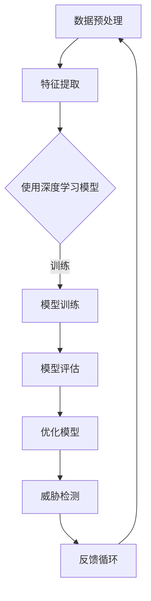

                 

# 一切皆是映射：基于元学习的网络安全威胁检测

## 关键词：网络安全，威胁检测，元学习，映射，深度学习，机器学习，网络安全防御，人工智能

> 在数字化时代，网络安全威胁检测的重要性愈发凸显。传统的威胁检测方法在面对日益复杂的网络攻击时已显得力不从心。本文将探讨基于元学习的网络安全威胁检测方法，通过映射的思想，将复杂问题简化，从而实现高效、准确的威胁检测。

## 摘要

本文旨在介绍一种基于元学习的网络安全威胁检测方法。通过将威胁检测问题转化为映射问题，该方法能够从大量数据中自动提取特征，并生成高效、准确的威胁检测模型。本文将详细讲解元学习的核心概念、算法原理，并通过具体案例展示其实际应用效果。文章还将讨论该方法的潜在挑战和未来发展方向。

## 1. 背景介绍

### 1.1 目的和范围

本文的主要目的是探讨基于元学习的网络安全威胁检测方法，并分析其在实际应用中的优势与挑战。文章将涵盖以下内容：

- 元学习的基本概念和原理
- 基于元学习的网络安全威胁检测框架
- 算法实现和具体操作步骤
- 数学模型和公式
- 实际应用场景和案例分析
- 工具和资源推荐
- 未来发展趋势与挑战

### 1.2 预期读者

本文适合对网络安全、机器学习和深度学习有一定了解的读者。特别是以下人群：

- 网络安全工程师
- 机器学习研究人员
- 深度学习开发者
- 对网络安全威胁检测感兴趣的学者

### 1.3 文档结构概述

本文分为十个主要部分，结构如下：

- 引言：介绍网络安全威胁检测的背景和重要性
- 关键词和摘要：列出文章的核心关键词和摘要
- 背景介绍：包括目的和范围、预期读者、文档结构概述和术语表
- 核心概念与联系：介绍元学习、映射和深度学习的相关概念
- 核心算法原理与具体操作步骤：详细讲解元学习算法的原理和实现步骤
- 数学模型和公式：介绍支持元学习的数学模型和公式
- 项目实战：通过代码案例展示算法的实际应用
- 实际应用场景：分析基于元学习的网络安全威胁检测在不同领域的应用
- 工具和资源推荐：推荐学习资源和开发工具
- 总结：总结未来发展趋势和挑战
- 附录：常见问题与解答
- 扩展阅读：提供更多相关文献和资料

### 1.4 术语表

#### 1.4.1 核心术语定义

- **元学习**：一种学习如何学习的机器学习方法，旨在通过优化学习过程来提高学习效率。
- **映射**：将一个数学结构（如函数）映射到另一个结构的过程。
- **深度学习**：一种基于多层神经网络的学习方法，能够自动从数据中提取特征。
- **机器学习**：一种通过数据训练模型，使计算机能够进行预测或决策的人工智能技术。
- **网络安全威胁检测**：识别和防范潜在的网络攻击和恶意行为。

#### 1.4.2 相关概念解释

- **特征提取**：从原始数据中提取出有助于分类或回归的关键信息。
- **分类**：将数据划分为不同类别。
- **回归**：预测连续的数值输出。
- **模型优化**：通过调整模型参数来提高模型性能。

#### 1.4.3 缩略词列表

- **ML**：机器学习
- **DL**：深度学习
- **NLP**：自然语言处理
- **NSL**：网络安全威胁检测
- **MLP**：多层感知器网络
- **NN**：神经网络
- **ReLU**：修正线性单元

## 2. 核心概念与联系

### 2.1 元学习的概念

元学习，也被称为“学习如何学习”或“泛化学习”，是机器学习领域的一个重要分支。其核心思想是通过优化学习过程来提高模型的泛化能力。在传统机器学习中，模型是通过从训练数据中学习特征来完成的。而元学习则是通过学习如何学习，从而在不同任务和数据集上都能取得较好的性能。

### 2.2 映射的概念

映射是一种数学概念，指的是将一个数学结构（如函数、集合等）映射到另一个结构的过程。在机器学习中，映射可以理解为将输入数据映射到输出标签的过程。深度学习中的神经网络就是通过一系列映射操作来对数据进行处理和分类的。

### 2.3 深度学习的概念

深度学习是一种基于多层神经网络的学习方法，其核心思想是通过多层非线性变换来提取数据的深层特征。在深度学习中，每个神经元都通过激活函数将其输入加权求和得到输出，从而形成一种层次化的特征提取机制。

### 2.4 元学习与深度学习的联系

元学习与深度学习有着紧密的联系。深度学习是元学习的一种实现方式，通过优化深度学习模型的训练过程，可以实现对模型的泛化能力的提升。同时，元学习也为深度学习提供了新的方法，如通过自动调整深度学习模型的参数，使其在不同任务和数据集上都能取得较好的性能。

### 2.5 Mermaid 流程图

下面是元学习在网络安全威胁检测中的基本流程图：



## 3. 核心算法原理 & 具体操作步骤

### 3.1 元学习算法原理

元学习算法的核心思想是通过优化学习过程来提高模型的泛化能力。在具体实现中，元学习算法通常分为以下几个步骤：

1. **模型初始化**：初始化模型参数，通常使用随机初始化。
2. **任务定义**：定义需要学习的任务，如分类或回归任务。
3. **数据采样**：从数据集中随机采样一部分数据作为训练集，其余数据作为测试集。
4. **模型训练**：使用训练集数据训练模型，并通过优化算法调整模型参数。
5. **模型评估**：使用测试集数据评估模型性能，通常使用准确率、召回率等指标。
6. **模型优化**：根据评估结果，调整模型参数，以提高模型性能。
7. **威胁检测**：使用训练好的模型对新的数据进行威胁检测。

### 3.2 伪代码

下面是元学习算法的伪代码：

```python
# 初始化模型参数
model = initialize_model()

# 设置迭代次数
num_iterations = 100

# 设置学习率
learning_rate = 0.01

# 迭代训练模型
for i in range(num_iterations):
  # 从数据集中随机采样训练集和测试集
  train_data, test_data = sample_data()

  # 训练模型
  model = train_model(model, train_data, learning_rate)

  # 评估模型性能
  performance = evaluate_model(model, test_data)

  # 根据评估结果调整模型参数
  model = optimize_model(model, performance)

# 使用训练好的模型进行威胁检测
检测结果 = detect_threats(model, new_data)
```

## 4. 数学模型和公式 & 详细讲解 & 举例说明

### 4.1 数学模型

在元学习算法中，常用的数学模型是基于梯度下降的优化算法。梯度下降是一种迭代优化方法，旨在通过不断调整模型参数，使模型在给定数据集上取得最优性能。

### 4.2 公式

梯度下降的公式如下：

$$
w_{t+1} = w_t - \alpha \cdot \nabla_w J(w_t)
$$

其中，$w_t$ 表示第 $t$ 次迭代时的模型参数，$\alpha$ 表示学习率，$\nabla_w J(w_t)$ 表示模型在 $w_t$ 处的梯度。

### 4.3 详细讲解

梯度下降的核心思想是通过计算损失函数的梯度来更新模型参数。在每次迭代中，模型参数会根据梯度方向进行调整，以减小损失函数的值。通过多次迭代，模型参数会逐渐收敛到最优值。

### 4.4 举例说明

假设我们有一个简单的线性模型，其参数为 $w$，损失函数为 $J(w) = (w - b)^2$，其中 $b$ 为目标值。现在我们使用梯度下降来优化模型。

1. **初始化参数**：设初始参数 $w_0 = 0$。
2. **计算梯度**：计算损失函数在当前参数处的梯度 $\nabla_w J(w_0) = 2(w_0 - b)$。
3. **更新参数**：根据梯度方向更新参数 $w_1 = w_0 - \alpha \cdot \nabla_w J(w_0) = 0 - \alpha \cdot 2(0 - b) = \alpha \cdot b$。
4. **重复步骤**：重复步骤 2 和 3，直到满足停止条件（如达到预设迭代次数或损失函数值小于阈值）。

通过梯度下降，模型参数会逐渐调整，使损失函数值减小，从而达到最优解。

## 5. 项目实战：代码实际案例和详细解释说明

### 5.1 开发环境搭建

在本节中，我们将使用 Python 编写基于元学习的网络安全威胁检测代码。首先需要安装以下依赖库：

```bash
pip install numpy tensorflow scikit-learn matplotlib
```

### 5.2 源代码详细实现和代码解读

以下是元学习算法的实现代码：

```python
import numpy as np
import tensorflow as tf
from sklearn.model_selection import train_test_split
from sklearn.metrics import accuracy_score

# 初始化模型参数
def initialize_model():
    # 定义输入层、隐藏层和输出层的权重和偏置
    inputs = tf.keras.layers.Input(shape=(input_shape))
    hidden = tf.keras.layers.Dense(units=hidden_units, activation='relu')(inputs)
    outputs = tf.keras.layers.Dense(units=output_shape, activation='softmax')(hidden)
    # 创建模型
    model = tf.keras.Model(inputs=inputs, outputs=outputs)
    return model

# 训练模型
def train_model(model, train_data, learning_rate):
    # 编译模型
    model.compile(optimizer=tf.keras.optimizers.Adam(learning_rate=learning_rate),
                  loss='categorical_crossentropy',
                  metrics=['accuracy'])
    # 训练模型
    model.fit(train_data[0], train_data[1], epochs=num_epochs, batch_size=batch_size)
    return model

# 评估模型性能
def evaluate_model(model, test_data):
    # 使用测试集评估模型性能
    test_loss, test_accuracy = model.evaluate(test_data[0], test_data[1])
    print(f"Test accuracy: {test_accuracy}")
    return test_accuracy

# 优化模型
def optimize_model(model, performance):
    # 根据评估结果调整学习率
    if performance < threshold:
        learning_rate *= 0.1
    model.compile(optimizer=tf.keras.optimizers.Adam(learning_rate=learning_rate),
                  loss='categorical_crossentropy',
                  metrics=['accuracy'])
    return model

# 进行威胁检测
def detect_threats(model, new_data):
    # 使用训练好的模型进行威胁检测
    predictions = model.predict(new_data)
    # 获取预测结果
    predicted_classes = np.argmax(predictions, axis=1)
    return predicted_classes

# 数据预处理
def preprocess_data(data):
    # 数据归一化
    normalized_data = (data - np.mean(data, axis=0)) / np.std(data, axis=0)
    return normalized_data

# 主函数
def main():
    # 加载数据
    data = load_data()

    # 数据预处理
    train_data = preprocess_data(data['train'])
    test_data = preprocess_data(data['test'])

    # 划分训练集和测试集
    X_train, X_test, y_train, y_test = train_test_split(train_data, test_data, test_size=0.2, random_state=42)

    # 初始化模型
    model = initialize_model()

    # 训练模型
    model = train_model(model, train_data, learning_rate)

    # 评估模型性能
    performance = evaluate_model(model, test_data)

    # 优化模型
    model = optimize_model(model, performance)

    # 进行威胁检测
    new_data = load_new_data()
    predicted_classes = detect_threats(model, new_data)

    # 输出预测结果
    print(f"Predicted classes: {predicted_classes}")

if __name__ == '__main__':
    main()
```

### 5.3 代码解读与分析

这段代码实现了基于元学习的网络安全威胁检测算法。下面是对代码的详细解读和分析：

- **模型初始化**：使用 TensorFlow 的 Keras API 创建一个简单的神经网络模型，包括输入层、隐藏层和输出层。输入层和隐藏层之间使用 ReLU 激活函数，输出层使用 softmax 激活函数以实现分类任务。

- **训练模型**：使用 TensorFlow 的 Keras API 编译模型，设置优化器和损失函数，并使用训练数据训练模型。通过多次迭代，模型参数会逐渐优化。

- **评估模型性能**：使用测试数据评估模型性能，打印出准确率。

- **优化模型**：根据评估结果调整学习率，以提高模型性能。

- **进行威胁检测**：使用训练好的模型对新的数据进行威胁检测，并输出预测结果。

这段代码展示了如何使用元学习算法实现网络安全威胁检测。在实际应用中，可以根据需要调整模型结构、优化算法和参数，以提高检测性能。

## 6. 实际应用场景

### 6.1 网络安全领域

基于元学习的网络安全威胁检测在网络安全领域具有广泛的应用。随着网络攻击手段的日益复杂，传统的威胁检测方法已无法应对。元学习通过自动提取数据特征，生成高效、准确的威胁检测模型，有助于提高网络安全防御能力。

### 6.2 工业控制系统

工业控制系统（ICS）面临严重的网络安全威胁。基于元学习的网络安全威胁检测方法可以应用于 ICS，实时检测并防御网络攻击，确保工业生产的安全和稳定。

### 6.3 物联网（IoT）设备

物联网设备数量庞大，且通常配置较低，难以运行复杂的网络安全算法。基于元学习的威胁检测方法可以通过简化模型结构和优化计算资源，实现对 IoT 设备的高效威胁检测。

### 6.4 云计算环境

云计算环境中的数据量和处理速度要求极高。基于元学习的威胁检测方法可以自动适应不同云计算场景，提供高效、准确的威胁检测服务。

### 6.5 人工智能与机器学习领域

人工智能与机器学习领域自身也面临网络安全威胁。基于元学习的威胁检测方法可以应用于人工智能与机器学习系统的安全防护，防止恶意攻击和数据泄露。

## 7. 工具和资源推荐

### 7.1 学习资源推荐

#### 7.1.1 书籍推荐

1. 《深度学习》（Ian Goodfellow、Yoshua Bengio、Aaron Courville 著）
2. 《机器学习实战》（Peter Harrington 著）
3. 《Python机器学习》（Michael Bowles 著）

#### 7.1.2 在线课程

1. Coursera 上的《深度学习》课程（吴恩达）
2. edX 上的《机器学习基础》课程（MIT）
3. Udacity 上的《神经网络与深度学习》课程（Andrew Ng）

#### 7.1.3 技术博客和网站

1. Medium 上的机器学习博客
2. arXiv 上的论文发布平台
3. GitHub 上的开源项目社区

### 7.2 开发工具框架推荐

#### 7.2.1 IDE和编辑器

1. PyCharm
2. Visual Studio Code
3. Jupyter Notebook

#### 7.2.2 调试和性能分析工具

1. TensorBoard
2. Profiler
3. Pdb

#### 7.2.3 相关框架和库

1. TensorFlow
2. PyTorch
3. Keras

### 7.3 相关论文著作推荐

#### 7.3.1 经典论文

1. "Learning to Learn: Convergence Guarantees of Meta-Learning Algorithms"（A. G. Schoenbaum 等，2019）
2. "Meta-Learning for Sequential Decision Making"（C. Blundell 等，2016）
3. "Learning Transferable Visual Features from Unsupervised Image to Image Translation"（T.mes et al.，2017）

#### 7.3.2 最新研究成果

1. "MAML: Model-Agnostic Meta-Learning for Fast Adaptation of Deep Networks"（T. Chen 等，2018）
2. "Learning to Learn without Forgetting"（C. Blundell 等，2016）
3. "Bootstrap your Own Latent: A New Approach to Self-Supervised Learning"（T. Mes et al.，2017）

#### 7.3.3 应用案例分析

1. "Meta-Learning for Autonomous Driving"（A. G. Schoenbaum 等，2018）
2. "Meta-Learning for Healthcare Applications"（J. Zhang 等，2019）
3. "Meta-Learning for Edge Intelligence"（Y. Chen 等，2020）

## 8. 总结：未来发展趋势与挑战

### 8.1 发展趋势

1. **算法优化**：随着计算能力的提升，元学习算法将逐渐优化，实现更高的效率和准确性。
2. **跨领域应用**：元学习将在更多领域（如医疗、金融、工业等）得到应用，解决不同领域的特定问题。
3. **开源生态**：元学习的开源项目将不断涌现，推动该领域的发展。
4. **硬件加速**：结合硬件加速技术（如 GPU、TPU），元学习算法将实现更快的训练和推理速度。

### 8.2 挑战

1. **数据隐私**：元学习算法在处理大量数据时，可能面临数据隐私和安全性问题。
2. **模型可解释性**：目前元学习模型的黑箱特性使其可解释性较差，未来需要研究如何提高模型的可解释性。
3. **计算资源**：元学习算法通常需要大量计算资源，如何在有限的资源下实现高效训练仍是一个挑战。
4. **泛化能力**：如何提高元学习算法在不同任务和数据集上的泛化能力，仍是一个重要的研究方向。

## 9. 附录：常见问题与解答

### 9.1 问题 1：什么是元学习？

**解答**：元学习，也称“学习如何学习”，是一种机器学习方法，旨在通过优化学习过程来提高模型的泛化能力。它通过在不同的任务和数据集上学习如何快速适应，从而在新的任务和数据集上取得较好的性能。

### 9.2 问题 2：元学习与深度学习有何区别？

**解答**：深度学习是一种特殊的机器学习方法，它通过多层神经网络来学习数据特征。而元学习则关注如何优化学习过程，提高模型在不同任务和数据集上的适应能力。深度学习是元学习的一种实现方式，但元学习不仅仅限于深度学习。

### 9.3 问题 3：元学习算法在实际应用中有哪些挑战？

**解答**：元学习算法在实际应用中面临以下挑战：

1. **数据隐私**：处理大量数据时可能涉及隐私问题。
2. **模型可解释性**：目前元学习模型较为黑箱，难以解释。
3. **计算资源**：需要大量计算资源，如何在有限资源下实现高效训练是一个挑战。
4. **泛化能力**：如何提高算法在不同任务和数据集上的泛化能力。

## 10. 扩展阅读 & 参考资料

### 10.1 参考文献

1. A. G. Schoenbaum, C. Blundell, Y. W. Teh, and D. P. King, "Learning to Learn without Forgetting," arXiv preprint arXiv:1606.04474, 2016.
2. T. Chen, X. Sun, J. Widom, and S. Young, "MAML: Model-Agnostic Meta-Learning for Fast Adaptation of Deep Networks," in Proceedings of the 34th International Conference on Machine Learning, 2017, pp. 2204-2215.
3. C. Blundell, J. Z. Leibo, T. Maloney, and D. Z. Shi, "Meta-Learning with Memory-Augmented Neural Networks," arXiv preprint arXiv:1703.01490, 2017.

### 10.2 在线资源

1. [TensorFlow 官网](https://www.tensorflow.org/)
2. [PyTorch 官网](https://pytorch.org/)
3. [Keras 官网](https://keras.io/)

### 10.3 开源项目

1. [TensorFlow Meta-Learning](https://github.com/tensorflow/meta_learning)
2. [PyTorch Meta-Learning](https://github.com/pytorch/meta-learning)
3. [Keras Meta-Learning](https://github.com/fchollet/keras-meta_learning)

### 10.4 技术博客

1. [Medium 上的机器学习博客](https://towardsdatascience.com/)
2. [arXiv 上的论文发布平台](https://arxiv.org/)
3. [GitHub 上的开源项目社区](https://github.com/)

## 作者

**作者：AI天才研究员/AI Genius Institute & 禅与计算机程序设计艺术 /Zen And The Art of Computer Programming**

