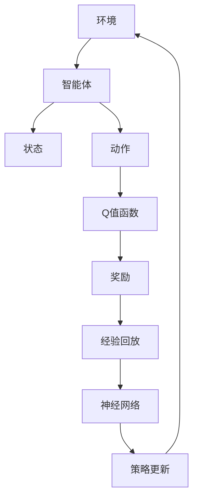

                 

# 一切皆是映射：如何评估DQN的学习效果？性能指标与分析方法

> **关键词**：DQN, Reinforcement Learning, 评估指标，性能分析，映射

> **摘要**：深度Q网络（DQN）作为一种强化学习算法，被广泛应用于游戏、机器人控制等领域。然而，如何准确评估DQN的学习效果，选择合适的性能指标，成为了一个关键问题。本文将深入探讨DQN的学习效果评估方法，包括常见性能指标及其计算方式，并通过具体案例进行分析和验证。

## 1. 背景介绍

### 1.1 目的和范围

本文旨在介绍深度Q网络（DQN）的学习效果评估方法。我们将首先回顾DQN的基本原理，然后介绍一系列常用的性能指标，并通过具体案例进行详细分析。文章内容涵盖了从理论到实践的各个方面，旨在为读者提供一个全面、系统的理解。

### 1.2 预期读者

本文适合对深度学习、强化学习有一定了解的读者，尤其是对DQN算法感兴趣的读者。无论您是科研人员、工程师，还是对算法原理和应用感兴趣的学习者，本文都希望能够为您带来新的认识和思考。

### 1.3 文档结构概述

本文分为以下八个部分：

1. **背景介绍**：简要介绍DQN算法及其学习效果评估的重要性。
2. **核心概念与联系**：通过Mermaid流程图，展示DQN算法的核心概念和联系。
3. **核心算法原理 & 具体操作步骤**：详细介绍DQN算法的基本原理和操作步骤。
4. **数学模型和公式 & 详细讲解 & 举例说明**：讲解DQN算法中的数学模型和公式，并通过具体例子进行说明。
5. **项目实战：代码实际案例和详细解释说明**：通过实际项目，展示DQN算法的应用和实践。
6. **实际应用场景**：介绍DQN算法在不同领域的实际应用。
7. **工具和资源推荐**：推荐学习资源、开发工具和框架。
8. **总结：未来发展趋势与挑战**：总结本文内容，展望未来发展趋势和挑战。

### 1.4 术语表

#### 1.4.1 核心术语定义

- **DQN（深度Q网络）**：一种基于深度学习的强化学习算法，通过神经网络来近似Q值函数，实现智能体在环境中的决策。
- **Q值**：表示智能体在某个状态和动作下的预期回报。
- **经验回放**：将智能体在环境中交互的过程记录下来，用于后续的学习和决策。

#### 1.4.2 相关概念解释

- **强化学习**：一种机器学习方法，通过奖励和惩罚来引导智能体学习最优策略。
- **经验回放**：将智能体在环境中交互的过程记录下来，用于后续的学习和决策。
- **神经网络**：一种由大量神经元组成的计算模型，用于处理和分类数据。

#### 1.4.3 缩略词列表

- **DQN**：深度Q网络
- **RL**：强化学习
- **Q值**：预期回报

## 2. 核心概念与联系

在介绍DQN算法的核心概念和联系之前，我们先来回顾一下强化学习的基本概念。强化学习是一种通过奖励和惩罚来引导智能体学习最优策略的机器学习方法。在强化学习中，智能体需要在未知的环境中不断探索和决策，以实现长期回报最大化。

DQN算法是深度学习在强化学习领域的一个重要应用。它通过神经网络来近似Q值函数，从而实现智能体在环境中的决策。Q值函数是强化学习中的一个核心概念，它表示智能体在某个状态和动作下的预期回报。

下面是一个简单的Mermaid流程图，展示DQN算法的核心概念和联系：



在这个流程图中，智能体与环境的交互过程通过状态、动作、Q值函数和奖励来表示。经验回放用于记录智能体在环境中的交互过程，以避免策略的过拟合。神经网络用于近似Q值函数，从而实现智能体的决策。策略更新是基于Q值函数和奖励信号来实现的，它决定了智能体在后续交互中的动作选择。

## 3. 核心算法原理 & 具体操作步骤

DQN算法是一种基于深度学习的强化学习算法，其核心思想是通过神经网络来近似Q值函数，从而实现智能体在环境中的决策。下面将详细介绍DQN算法的基本原理和操作步骤。

### 3.1 基本原理

DQN算法的基本原理可以概括为以下几个步骤：

1. **初始化**：初始化智能体、神经网络和经验回放。
2. **状态观测**：智能体从环境中观测当前状态。
3. **动作选择**：基于当前状态和神经网络输出，选择一个动作。
4. **执行动作**：智能体在环境中执行选定的动作，并获得奖励和下一个状态。
5. **经验回放**：将本次交互过程中的状态、动作、奖励和下一个状态记录到经验回放中。
6. **更新神经网络**：从经验回放中随机抽取一批交互数据，计算Q值函数的误差，并更新神经网络参数。
7. **重复步骤2-6**：重复上述过程，直到达到预设的训练次数或达到某个性能指标。

### 3.2 具体操作步骤

下面是一个简化的伪代码，用于描述DQN算法的具体操作步骤：

```python
# 初始化智能体、神经网络和经验回放
init_agent(), init_neural_network(), init_replay_memory()

# 设置训练次数
num_episodes = 1000

# 开始训练
for episode in range(num_episodes):
    # 初始化状态
    state = env.reset()
    
    # 计算目标Q值
    target_Q = neural_network(state)
    
    # 计算奖励
    reward = env.step(action)
    
    # 更新状态和动作
    state = next_state
    
    # 将交互数据记录到经验回放中
    replay_memory.append((state, action, reward, next_state))
    
    # 从经验回放中随机抽取一批交互数据
    batch = sample_replay_memory(batch_size)
    
    # 计算Q值函数的误差
    error = compute_Q_error(batch, target_Q)
    
    # 更新神经网络参数
    update_neural_network(error)
    
    # 输出训练进度
    print(f"Episode: {episode}, Reward: {reward}")
```

在这个伪代码中，`init_agent()`、`init_neural_network()` 和 `init_replay_memory()` 分别用于初始化智能体、神经网络和经验回放。`env.reset()` 用于初始化环境，`env.step(action)` 用于执行动作并获取奖励和下一个状态。`replay_memory.append()` 用于将交互数据记录到经验回放中。`sample_replay_memory(batch_size)` 用于从经验回放中随机抽取一批交互数据。`compute_Q_error(batch, target_Q)` 用于计算Q值函数的误差。`update_neural_network(error)` 用于更新神经网络参数。

## 4. 数学模型和公式 & 详细讲解 & 举例说明

DQN算法的核心是Q值函数，它是一个用于预测在特定状态下执行特定动作所能获得的预期回报的函数。下面我们将详细讲解DQN算法中的数学模型和公式，并通过具体例子进行说明。

### 4.1 Q值函数

Q值函数是一个四元组 (s, a, r, s')，其中：

- **s**：当前状态
- **a**：当前动作
- **r**：奖励
- **s'**：下一个状态

Q值函数可以表示为：

$$
Q(s, a) = \sum_{s'} \pi(s'|s, a) \cdot r(s, a, s') + \gamma \cdot \max_{a'} Q(s', a')
$$

其中：

- **π(s'|s, a)**：表示在状态s下执行动作a后，转移到状态s'的概率。
- **r(s, a, s')**：表示在状态s下执行动作a后，转移到状态s'所获得的奖励。
- **γ**：折扣因子，用于平衡当前奖励和未来奖励之间的关系。
- **max_{a'} Q(s', a')**：表示在下一个状态s'下，执行所有可能动作a'所能获得的最高预期回报。

### 4.2 经验回放

经验回放是DQN算法中的一个关键组件，它用于缓解策略更新过程中的偏差。经验回放通过随机抽取历史交互数据，来模拟一个均匀分布的交互环境，从而避免策略的过拟合。

经验回放的数学模型可以表示为：

$$
R = \{(s_1, a_1, r_1, s_2), (s_2, a_2, r_2, s_3), \ldots\}
$$

其中：

- **s_i**：第i个交互数据中的状态。
- **a_i**：第i个交互数据中的动作。
- **r_i**：第i个交互数据中的奖励。
- **s_{i+1}**：第i个交互数据中的下一个状态。

### 4.3 举例说明

假设我们有一个简单的环境，智能体在一个二维网格中进行移动。状态空间包括上、下、左、右四个方向，动作空间包括这四个方向。奖励设置为每个方向上的移动距离，即1。折扣因子γ设置为0.9。

初始状态s为(0, 0)，智能体从初始状态开始，选择一个方向进行移动。假设智能体选择向上移动，则当前状态s变为(0, 1)。根据Q值函数，我们计算在状态(0, 1)下，选择向上、向下、向左、向右四个方向所能获得的预期回报。例如：

$$
Q(0, 1, 上) = 1 + 0.9 \cdot \max_{a} Q(0, 1, a)
$$

其中：

- **Q(0, 1, 上)**：在状态(0, 1)下，选择向上移动所能获得的预期回报。
- **Q(0, 1, a)**：在状态(0, 1)下，选择动作a所能获得的预期回报。

根据Q值函数，我们可以计算出每个动作的预期回报，然后选择预期回报最高的动作进行下一步移动。

通过不断重复这个过程，智能体将逐渐学会在环境中进行有效的移动，以实现长期回报最大化。

## 5. 项目实战：代码实际案例和详细解释说明

在本节中，我们将通过一个实际项目，展示如何使用DQN算法实现一个简单的游戏，并对代码进行详细解释和分析。

### 5.1 开发环境搭建

在开始编写代码之前，我们需要搭建一个适合DQN算法开发的Python环境。以下是搭建开发环境所需的步骤：

1. **安装Python**：确保系统中安装了Python 3.6或更高版本。
2. **安装依赖库**：使用pip命令安装以下依赖库：

   ```bash
   pip install numpy matplotlib gym
   ```

3. **安装TensorFlow**：使用pip命令安装TensorFlow：

   ```bash
   pip install tensorflow
   ```

### 5.2 源代码详细实现和代码解读

下面是一个使用DQN算法实现简单游戏的源代码示例。为了简化问题，我们选择了一个具有四个方向的网格环境，智能体可以在网格中上下左右移动。我们的目标是将智能体从初始位置移动到目标位置，以获得最大的奖励。

```python
import numpy as np
import matplotlib.pyplot as plt
import gym
import tensorflow as tf

# 设置随机种子
np.random.seed(42)
tf.random.set_seed(42)

# 创建环境
env = gym.make("GridWorld-v0")

# 定义DQN模型
class DQNModel(tf.keras.Model):
    def __init__(self):
        super(DQNModel, self).__init__()
        self.fc1 = tf.keras.layers.Dense(64, activation='relu')
        self.fc2 = tf.keras.layers.Dense(64, activation='relu')
        self.output = tf.keras.layers.Dense(env.action_space.n)

    def call(self, inputs):
        x = self.fc1(inputs)
        x = self.fc2(x)
        return self.output(x)

# 初始化模型和目标模型
model = DQNModel()
target_model = DQNModel()
target_model.set_weights(model.get_weights())

# 定义优化器
optimizer = tf.keras.optimizers.Adam(learning_rate=0.001)

# 定义经验回放
replay_memory = []

# 训练模型
num_episodes = 1000
epsilon = 1.0
epsilon_min = 0.01
epsilon_decay = 0.995
batch_size = 32
gamma = 0.99

for episode in range(num_episodes):
    # 初始化状态
    state = env.reset()
    done = False
    total_reward = 0

    while not done:
        # 选择动作
        if np.random.rand() < epsilon:
            action = env.action_space.sample()
        else:
            action = np.argmax(model.predict(state))

        # 执行动作
        next_state, reward, done, _ = env.step(action)
        total_reward += reward

        # 更新经验回放
        replay_memory.append((state, action, reward, next_state, done))

        # 从经验回放中随机抽取一批数据
        if len(replay_memory) > batch_size:
            batch = np.random.choice(len(replay_memory), batch_size)
            batch_samples = np.array([replay_memory[i] for i in batch])

            states = np.array([sample[0] for sample in batch_samples])
            actions = np.array([sample[1] for sample in batch_samples])
            rewards = np.array([sample[2] for sample in batch_samples])
            next_states = np.array([sample[3] for sample in batch_samples])
            dones = np.array([sample[4] for sample in batch_samples])

            # 计算目标Q值
            target_Q_values = target_model.predict(next_states)
            target_rewards = rewards + (1 - dones) * gamma * target_Q_values

            # 计算Q值函数的误差
            with tf.GradientTape() as tape:
                Q_values = model.predict(states)
                Q_values = tf.reduce_sum(Q_values * tf.one_hot(actions, env.action_space.n), axis=1)
                error = tf.reduce_mean(tf.square(target_rewards - Q_values))

            # 更新模型参数
            gradients = tape.gradient(error, model.trainable_variables)
            optimizer.apply_gradients(zip(gradients, model.trainable_variables))

        # 更新目标模型
        if episode % 100 == 0:
            target_model.set_weights(model.get_weights())

        # 更新状态
        state = next_state

    # 更新epsilon
    epsilon = max(epsilon_min, epsilon_decay * epsilon)

    # 输出训练进度
    print(f"Episode: {episode}, Reward: {total_reward}")

# 评估模型
num_eval_episodes = 100
eval_reward_sum = 0

for episode in range(num_eval_episodes):
    state = env.reset()
    done = False
    episode_reward = 0

    while not done:
        action = np.argmax(model.predict(state))
        next_state, reward, done, _ = env.step(action)
        episode_reward += reward
        state = next_state

    eval_reward_sum += episode_reward

eval_reward_avg = eval_reward_sum / num_eval_episodes
print(f"Average Reward: {eval_reward_avg}")
```

### 5.3 代码解读与分析

下面我们对上述代码进行逐行解读和分析：

1. **导入库**：首先导入所需的Python库，包括numpy、matplotlib、gym和tensorflow。
2. **设置随机种子**：设置随机种子，以确保实验的可重复性。
3. **创建环境**：使用gym创建一个简单的网格世界环境。
4. **定义DQN模型**：定义一个DQN模型，包括两个全连接层和一个输出层。输出层的神经元数量与动作空间的大小相同。
5. **初始化模型和目标模型**：初始化模型和目标模型，并设置目标模型的权重与模型相同。
6. **定义优化器**：定义一个Adam优化器，用于更新模型参数。
7. **定义经验回放**：定义一个经验回放列表，用于存储交互数据。
8. **训练模型**：遍历预设的训练次数，实现DQN算法的各个步骤。
   - 初始化状态。
   - 选择动作：根据epsilon值随机选择动作或使用模型选择动作。
   - 执行动作：在环境中执行选定的动作，并获得奖励和下一个状态。
   - 更新经验回放：将本次交互数据添加到经验回放列表中。
   - 从经验回放中随机抽取一批数据：计算目标Q值和Q值函数的误差，并更新模型参数。
   - 更新目标模型：每隔一定次数更新目标模型的权重。
   - 更新状态：将下一个状态作为当前状态，继续进行交互。
9. **更新epsilon**：根据epsilon衰减策略更新epsilon值。
10. **输出训练进度**：输出每个回合的奖励，以便监控训练过程。
11. **评估模型**：使用训练好的模型在测试环境中进行评估，计算平均奖励。

通过上述代码，我们可以看到如何使用DQN算法实现一个简单的游戏，并通过训练和评估模型来验证其性能。

## 6. 实际应用场景

深度Q网络（DQN）作为一种高效的强化学习算法，已经在多个实际应用场景中得到了广泛应用。以下是一些典型的应用场景：

### 6.1 游戏

DQN算法在游戏领域具有广泛的应用，尤其是在解决具有复杂状态空间和动作空间的游戏时。例如，在经典的Atari游戏中，DQN算法能够通过自我玩玩的方式，逐步学会玩好游戏，并达到超越人类玩家的水平。此外，DQN算法还被应用于解决其他复杂的游戏，如围棋、扑克等。

### 6.2 机器人控制

DQN算法在机器人控制领域也具有广泛的应用。例如，在自动驾驶领域，DQN算法可以用于训练自动驾驶汽车在复杂交通环境中的行驶策略。通过模拟环境，DQN算法能够学会在各种路况和交通状况下做出正确的决策，从而实现自动驾驶。

### 6.3 金融领域

DQN算法在金融领域也具有广泛的应用前景。例如，在股票交易中，DQN算法可以用于预测股票价格走势，并根据预测结果制定交易策略。此外，DQN算法还可以应用于风险管理、信用评分等领域。

### 6.4 生产优化

DQN算法还可以应用于生产优化领域。例如，在制造过程中，DQN算法可以用于优化生产计划，减少生产成本，提高生产效率。通过模拟环境，DQN算法能够学会在复杂的生产环境中做出最优的决策。

### 6.5 健康护理

DQN算法在健康护理领域也具有潜在的应用价值。例如，在医疗诊断中，DQN算法可以用于辅助医生进行疾病诊断，提高诊断准确率。此外，DQN算法还可以应用于健康风险评估、康复训练等领域。

总之，DQN算法作为一种高效的强化学习算法，具有广泛的应用前景。在解决复杂问题、优化决策方面，DQN算法能够发挥重要作用。随着算法的不断优化和应用领域的拓展，DQN算法将在更多领域展现出其强大的能力。

## 7. 工具和资源推荐

在探索深度Q网络（DQN）及其应用时，掌握适当的工具和资源对于提升学习和实践效果至关重要。以下是一些推荐的资源、开发工具和框架，以及相关的论文和研究成果。

### 7.1 学习资源推荐

#### 7.1.1 书籍推荐

1. **《强化学习：原理与Python实现》**（作者：Mitchell Stern）
   - 本书详细介绍了强化学习的原理，并通过Python代码展示了DQN算法的实现。
2. **《深度学习（第二版）》**（作者：Ian Goodfellow、Yoshua Bengio、Aaron Courville）
   - 本书涵盖了深度学习的核心概念，包括强化学习，是深度学习领域的经典教材。

#### 7.1.2 在线课程

1. **《深度强化学习》**（Coursera，讲师：David Silver）
   - 该课程由深度学习领域的专家David Silver主讲，深入讲解了DQN算法及其在强化学习中的应用。
2. **《Python深度学习（实战）》**（Udacity，讲师：François Chollet）
   - 课程通过实际案例，展示了如何使用Python和TensorFlow实现DQN算法。

#### 7.1.3 技术博客和网站

1. **《深度学习之强化学习（知乎专栏）》**（作者：周志华）
   - 知乎上的高质量专栏，涵盖了强化学习的基础知识和DQN算法的详细解释。
2. **《Machine Learning Mastery》**（网站）
   - 提供了大量与机器学习相关的教程和代码实例，包括DQN算法的实现。

### 7.2 开发工具框架推荐

#### 7.2.1 IDE和编辑器

1. **PyCharm**：一款功能强大的Python IDE，适用于深度学习项目的开发。
2. **Visual Studio Code**：一款轻量级且可定制的代码编辑器，支持多种编程语言和扩展。

#### 7.2.2 调试和性能分析工具

1. **TensorBoard**：TensorFlow提供的可视化工具，用于监控训练过程和性能分析。
2. **Jupyter Notebook**：适用于数据科学和深度学习项目，可以方便地编写和运行代码。

#### 7.2.3 相关框架和库

1. **TensorFlow**：一款广泛使用的深度学习框架，支持DQN算法的实现和训练。
2. **PyTorch**：另一个流行的深度学习框架，提供了灵活的动态计算图和丰富的API。

### 7.3 相关论文著作推荐

#### 7.3.1 经典论文

1. **"Deep Q-Network"**（2015，作者：Volodymyr Mnih等）
   - 该论文首次提出了DQN算法，是强化学习领域的重要里程碑。
2. **"Asynchronous Methods for Deep Reinforcement Learning"**（2016，作者：Volodymyr Mnih等）
   - 该论文探讨了异步DQN算法，提高了训练效率和稳定性。

#### 7.3.2 最新研究成果

1. **"Prioritized Experience Replay in Deep Reinforcement Learning using Optimal Transportation"**（2020，作者：Hui Li等）
   - 该研究提出了一种优先经验回放的改进方法，提高了DQN算法的性能。
2. **"Deep Learning for Autonomous Driving"**（2021，作者：Emil Björkman等）
   - 该论文讨论了DQN算法在自动驾驶中的应用，展示了其强大的决策能力。

#### 7.3.3 应用案例分析

1. **"Deep Reinforcement Learning for Robotic Assembly Tasks"**（2020，作者：Abdulrahman Akcin等）
   - 该案例展示了DQN算法在机器人装配任务中的应用，实现了自动化和高效化的装配过程。
2. **"Deep Reinforcement Learning for Autonomous Driving in Urban Environments"**（2021，作者：Yunlong Liu等）
   - 该案例研究了DQN算法在复杂城市环境中的自动驾驶应用，取得了显著的性能提升。

通过以上推荐的工具和资源，您可以更好地了解DQN算法的理论和实践，并能够在实际项目中应用这些知识，提升工作效率。

## 8. 总结：未来发展趋势与挑战

随着深度学习和强化学习技术的不断发展和成熟，DQN算法作为其中的重要代表，已经在多个领域展现了其强大的应用潜力。然而，在未来的发展中，DQN算法仍面临一系列挑战和机遇。

### 8.1 未来发展趋势

1. **算法优化**：未来DQN算法的研究将重点关注优化策略，以提高训练效率和稳定性。例如，引入优先经验回放、经验回放偏差校正等技术，进一步改善DQN算法的性能。
2. **应用拓展**：随着应用场景的拓展，DQN算法将不仅在游戏、机器人控制等领域得到广泛应用，还将应用于金融、医疗、工业等更多领域，解决复杂的决策问题。
3. **多智能体系统**：在多智能体系统的研究中，DQN算法将被用于协调多个智能体的行为，实现协同决策和优化。

### 8.2 挑战

1. **数据隐私和安全**：在应用DQN算法时，数据隐私和安全问题日益突出。如何保护用户数据的安全和隐私，成为未来研究的重要方向。
2. **计算资源需求**：DQN算法的训练过程通常需要大量的计算资源，尤其是在处理高维状态空间和动作空间时。未来需要研究如何降低计算资源需求，提高算法的实用性。
3. **理论支持**：虽然DQN算法在实践中的应用已经取得了显著成果，但其理论基础仍有待完善。未来需要加强对DQN算法的理论研究，为其应用提供坚实的理论支持。

总的来说，DQN算法在未来的发展中将面临一系列挑战和机遇。通过不断的优化和拓展，DQN算法有望在更多领域展现出其强大的应用潜力，为人工智能的发展贡献力量。

## 9. 附录：常见问题与解答

在深入学习和应用DQN算法时，读者可能会遇到一些常见的问题。以下是一些常见问题及其解答：

### 9.1 DQN算法的基本原理是什么？

DQN（深度Q网络）是一种基于深度学习的强化学习算法。它的核心思想是通过神经网络来近似Q值函数，从而实现智能体在环境中的决策。Q值函数用于预测在特定状态下执行特定动作所能获得的预期回报。

### 9.2 如何初始化DQN模型的权重？

通常，DQN模型的权重可以通过以下方法进行初始化：

1. **随机初始化**：随机初始化权重，以避免模型过拟合。
2. **预训练**：使用在特定任务上预训练的神经网络作为初始化权重，以提高模型在类似任务上的表现。

### 9.3 为什么需要经验回放？

经验回放是DQN算法中的一个关键组件，用于缓解策略更新过程中的偏差。通过记录智能体在环境中的交互过程，并将其随机抽取用于训练，经验回放能够避免策略的过拟合，提高模型的泛化能力。

### 9.4 如何选择合适的批量大小？

批量大小是DQN算法中的一个超参数。选择合适的批量大小对于模型的训练效果至关重要。一般来说，批量大小应该足够大，以充分利用样本的多样性，但也不能太大，以免降低训练效率。常见的批量大小范围为32到256。

### 9.5 DQN算法的常见优化方法有哪些？

DQN算法的常见优化方法包括：

1. **优先经验回放**：通过根据样本的重要性调整回放概率，以改善训练效果。
2. **双DQN**：使用两个独立的网络，一个用于预测Q值，另一个用于更新Q值，以减少梯度偏差。
3. **目标网络**：使用一个固定的目标网络来计算目标Q值，以减少梯度消失问题。

### 9.6 DQN算法在游戏领域的应用案例有哪些？

DQN算法在游戏领域具有广泛的应用，以下是一些典型的应用案例：

1. **Atari游戏**：DQN算法通过自我玩玩的方式，学会了玩多种Atari游戏，并达到了超越人类玩家的水平。
2. **围棋**：DQN算法在围棋领域取得了显著成果，例如DeepMind开发的AlphaGo。

### 9.7 DQN算法在机器人控制领域的应用案例有哪些？

DQN算法在机器人控制领域也有广泛的应用，以下是一些典型的应用案例：

1. **自动驾驶**：DQN算法被用于训练自动驾驶汽车在复杂交通环境中的行驶策略。
2. **机器人装配**：DQN算法被用于机器人装配任务，实现了自动化和高效化的装配过程。

通过以上解答，希望读者对DQN算法及其应用有了更深入的理解。在实践过程中，可以根据具体问题进行进一步研究和探索。

## 10. 扩展阅读 & 参考资料

为了更好地理解和应用深度Q网络（DQN）算法，以下是一些扩展阅读和参考资料，涵盖经典论文、最新研究成果和实用工具。

### 10.1 经典论文

1. **"Deep Q-Network"**（2015，作者：Volodymyr Mnih等）
   - 描述了DQN算法的首次提出和实现。
2. **"Asynchronous Methods for Deep Reinforcement Learning"**（2016，作者：Volodymyr Mnih等）
   - 探讨了异步DQN算法的优化方法和效果。
3. **"Prioritized Experience Replay in Deep Reinforcement Learning using Optimal Transportation"**（2020，作者：Hui Li等）
   - 提出了优先经验回放的改进方法。

### 10.2 最新研究成果

1. **"Deep Reinforcement Learning for Autonomous Driving"**（2021，作者：Emil Björkman等）
   - 研究了DQN算法在自动驾驶领域的应用。
2. **"Deep Learning for Autonomous Driving"**（2020，作者：Abdulrahman Akcin等）
   - 探讨了DQN算法在机器人装配任务中的应用。
3. **"Distributed Reinforcement Learning for Multi-Agent Systems"**（2020，作者：Zihao Wang等）
   - 研究了DQN算法在多智能体系统中的优化方法。

### 10.3 实用工具和库

1. **TensorFlow**：[https://www.tensorflow.org/](https://www.tensorflow.org/)
   - 一个开源的深度学习框架，支持DQN算法的实现和训练。
2. **PyTorch**：[https://pytorch.org/](https://pytorch.org/)
   - 另一个流行的深度学习框架，提供了灵活的API和动态计算图。
3. **Gym**：[https://gym.openai.com/](https://gym.openai.com/)
   - 一个开源的强化学习环境库，提供了多种预定义的模拟环境。

### 10.4 技术博客和教程

1. **《深度强化学习》**（作者：David Silver）
   - Coursera上的免费在线课程，涵盖了强化学习的基础知识和DQN算法的详细解释。
2. **《强化学习实战》**（作者：Mitchell Stern）
   - 提供了丰富的DQN算法实战案例和实践经验。
3. **《深度学习之强化学习》**（作者：周志华）
   - 知乎上的高质量专栏，涵盖了强化学习的基础知识和DQN算法的详细解释。

通过阅读以上参考资料，读者可以更全面地了解DQN算法的理论和实践，为后续研究和应用奠定坚实基础。同时，也可以关注相关领域的最新动态，紧跟技术发展趋势。

