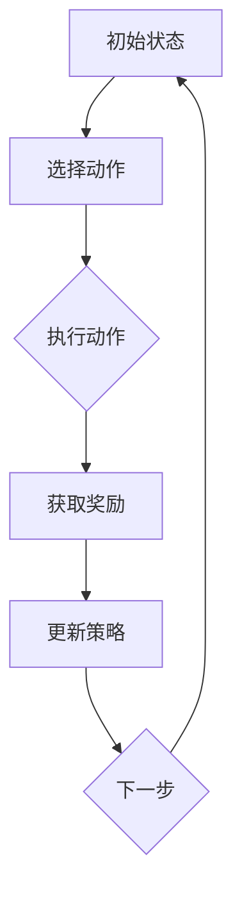
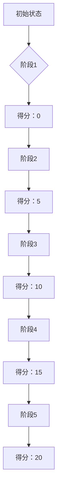

                 

### 一切皆是映射：无模型与有模型强化学习：DQN在此框架下的地位

> **关键词**：无模型强化学习、有模型强化学习、DQN、映射、状态空间、动作空间、Q值函数、深度神经网络、策略迭代、探索与利用。

> **摘要**：本文深入探讨强化学习领域中的无模型与有模型方法，特别是深度Q网络（DQN）在强化学习框架下的作用。文章首先介绍了强化学习的基本概念，然后详细分析了无模型强化学习与有模型强化学习的原理与区别。通过Mermaid流程图，我们形象地展示了强化学习的核心概念与流程。接着，本文以DQN为例，阐述了其算法原理、数学模型及具体操作步骤，并通过实际项目案例进行深入解读。最后，文章总结了DQN在实际应用中的重要性，并展望了未来的发展趋势与挑战。

## 1. 背景介绍

### 1.1 目的和范围

本文旨在深入探讨强化学习领域中无模型与有模型方法的区别，特别是深度Q网络（DQN）在强化学习框架下的地位。我们将通过详细的算法原理讲解、Mermaid流程图展示以及实际项目案例分析，帮助读者理解强化学习的基本概念及其在复杂环境中的应用。

### 1.2 预期读者

本文适合对强化学习有一定了解的读者，包括但不限于计算机科学、人工智能领域的科研人员、工程师以及对深度学习有浓厚兴趣的爱好者。本文将尽量使用通俗易懂的语言，以便于不同背景的读者能够理解并掌握强化学习的关键概念。

### 1.3 文档结构概述

本文分为十个主要部分。首先，我们将介绍强化学习的基本概念，并分析无模型强化学习与有模型强化学习的方法。接下来，通过Mermaid流程图，我们形象地展示强化学习的核心概念与流程。然后，我们详细介绍DQN的算法原理、数学模型及具体操作步骤。

在第五部分，我们将通过实际项目案例，详细解读DQN的应用过程，并提供代码实际案例和详细解释说明。第六部分将探讨DQN在实际应用中的各种场景。第七部分将推荐相关的学习资源、开发工具框架及经典论文。

最后，本文将在第八部分总结未来发展趋势与挑战，并在第九部分提供常见问题与解答。第十部分将列出扩展阅读和参考资料，以便读者进一步深入研究。

### 1.4 术语表

#### 1.4.1 核心术语定义

- **强化学习**：一种机器学习方法，通过奖励信号来指导算法自主地学习如何在特定环境中做出最优决策。
- **状态空间**：强化学习中的一个概念，表示环境中的所有可能状态集合。
- **动作空间**：强化学习中的另一个概念，表示智能体能够执行的所有可能动作集合。
- **Q值函数**：衡量在特定状态下执行特定动作所能获得的最大预期回报的函数。
- **深度神经网络**：一种多层神经网络，通过非线性变换逐层提取特征，适用于处理复杂数据。
- **策略迭代**：一种强化学习方法，通过迭代优化策略，使智能体在环境中获得更好的回报。
- **探索与利用**：强化学习中的两个关键概念，探索是指尝试新动作以获得更多信息，利用是指根据已有信息选择最优动作。

#### 1.4.2 相关概念解释

- **无模型强化学习**：无需对环境进行建模的强化学习方法，直接从经验中学习。
- **有模型强化学习**：需要对环境进行建模的强化学习方法，通过模型预测状态转移和回报。
- **深度Q网络（DQN）**：一种结合了深度神经网络和Q学习的强化学习方法，用于解决复杂状态空间的问题。

#### 1.4.3 缩略词列表

- **RL**：强化学习（Reinforcement Learning）
- **DQN**：深度Q网络（Deep Q-Network）
- **SARSA**：同步优势估计（Synchornized Advantage Estimation）
- **Q-learning**：Q学习（Q-Learning）
- **A3C**：异步 Advantage Actor-Critic（Asynchronous Advantage Actor-Critic）

## 2. 核心概念与联系

### 2.1 强化学习的核心概念

强化学习是一种通过与环境互动来学习最优策略的机器学习方法。其主要目标是在特定环境中，通过最大化累积奖励，使智能体（agent）能够做出最优决策。

在强化学习中，我们通常关注以下四个核心概念：

1. **状态（State）**：描述环境当前状态的变量集合。
2. **动作（Action）**：智能体可执行的动作集合。
3. **奖励（Reward）**：环境对智能体执行特定动作后产生的即时奖励，用于评价动作的好坏。
4. **策略（Policy）**：智能体的行为规则，用于指导智能体在特定状态下选择最优动作。

### 2.2 无模型强化学习与有模型强化学习的区别

强化学习可以分为无模型强化学习和有模型强化学习两种主要方法。它们的区别在于是否需要对环境进行建模。

- **无模型强化学习**：无需对环境进行建模，直接从经验中学习。其主要方法包括Q学习和策略迭代。
  - **Q学习**：通过更新Q值函数来学习最优策略。Q值函数表示在特定状态下执行特定动作所能获得的最大预期回报。
  - **策略迭代**：通过迭代优化策略，使智能体在环境中获得更好的回报。

- **有模型强化学习**：需要对环境进行建模，通过模型预测状态转移和回报。其主要方法包括模型预测和Actor-Critic算法。
  - **模型预测**：构建环境模型，预测状态转移和回报，用于指导智能体的动作选择。
  - **Actor-Critic算法**：通过Actor和Critic两部分来优化策略。Actor部分生成动作，Critic部分评估动作的好坏。

### 2.3 强化学习的流程

强化学习的核心流程包括四个步骤：选择动作、执行动作、获取奖励和更新策略。

1. **选择动作**：根据当前状态和策略，智能体选择一个动作。
2. **执行动作**：智能体在环境中执行所选动作，并观察环境的状态变化。
3. **获取奖励**：环境根据智能体的动作产生奖励，用于评价动作的好坏。
4. **更新策略**：根据奖励信号和更新规则，智能体更新策略，以期望在未来获得更好的回报。

下面是一个简单的Mermaid流程图，展示强化学习的核心概念和流程：



## 3. 核心算法原理 & 具体操作步骤

### 3.1 无模型强化学习算法原理

无模型强化学习算法主要通过从经验中学习来优化策略，其中Q学习（Q-Learning）是最常用的方法之一。Q学习的主要目标是学习一个Q值函数，该函数能够准确评估在特定状态下执行特定动作的预期回报。

### 3.1.1 Q值函数的定义

Q值函数是一个状态-动作值函数，表示在特定状态下执行特定动作所能获得的最大预期回报。形式化定义如下：

$$
Q(s, a) = \mathbb{E}[R_t | S_t = s, A_t = a]
$$

其中，$s$表示状态，$a$表示动作，$R_t$表示在第$t$次行动后获得的即时回报，$\mathbb{E}$表示期望值。

### 3.1.2 Q学习的算法原理

Q学习的目标是使用经验来更新Q值函数，使其能够准确反映状态-动作对的好坏。具体算法如下：

1. **初始化**：初始化Q值函数，通常使用零初始化或小随机数初始化。
2. **选择动作**：在给定状态下，选择具有最大Q值的动作。
3. **执行动作**：在环境中执行所选动作，并观察环境的状态变化和即时回报。
4. **更新Q值**：根据即时回报和Q值更新规则，更新Q值函数。
5. **重复步骤2-4**：不断重复选择动作、执行动作和更新Q值的过程，直至达到停止条件。

### 3.1.3 Q值更新的伪代码

```python
# Q值更新的伪代码
for each state s:
    for each action a:
        # 计算经验值
       经验值 = R_t + γ * max(Q(s', a'))
        # 更新Q值
        Q(s, a) = Q(s, a) + α * (经验值 - Q(s, a))
```

其中，$γ$是折扣因子，用于调整未来回报的重要性；$α$是学习率，用于调整Q值更新的步长。

### 3.2 有模型强化学习算法原理

有模型强化学习算法通过构建环境模型来预测状态转移和回报，从而指导智能体的动作选择。模型预测（Model-Based RL）和Actor-Critic算法是两种常用的有模型强化学习方法。

### 3.2.1 模型预测算法原理

模型预测算法的核心思想是使用环境模型来预测状态转移和回报，从而优化智能体的动作选择。具体算法如下：

1. **初始化**：初始化环境模型，通常使用零初始化或小随机数初始化。
2. **选择动作**：在给定状态下，选择具有最大Q值的动作。
3. **执行动作**：在环境中执行所选动作，并观察环境的状态变化和即时回报。
4. **更新模型**：根据观察到的状态转移和回报，更新环境模型。
5. **预测状态转移和回报**：使用更新后的模型预测下一状态和回报。
6. **重复步骤2-5**：不断重复选择动作、执行动作、更新模型和预测状态转移和回报的过程，直至达到停止条件。

### 3.2.2 Actor-Critic算法原理

Actor-Critic算法是一种基于价值函数的强化学习方法，通过Actor部分生成动作，Critic部分评估动作的好坏，从而优化智能体的策略。具体算法如下：

1. **初始化**：初始化价值函数和价值估计器，通常使用零初始化或小随机数初始化。
2. **选择动作**：根据当前状态和价值函数，选择具有最大预期回报的动作。
3. **执行动作**：在环境中执行所选动作，并观察环境的状态变化和即时回报。
4. **更新价值函数**：根据观察到的回报，更新价值函数。
5. **更新策略**：使用更新后的价值函数，更新策略。
6. **重复步骤2-5**：不断重复选择动作、执行动作、更新价值函数和更新策略的过程，直至达到停止条件。

### 3.3 深度Q网络（DQN）算法原理

深度Q网络（DQN）是一种基于深度神经网络的强化学习方法，用于解决复杂状态空间的问题。DQN的主要思想是使用深度神经网络来近似Q值函数，从而提高Q值函数的学习效率和准确性。

### 3.3.1 DQN的基本原理

DQN的基本原理可以概括为以下四个步骤：

1. **初始化**：初始化深度神经网络模型、目标神经网络模型和经验回放记忆。
2. **选择动作**：使用深度神经网络模型预测在给定状态下每个动作的Q值，并选择具有最大Q值的动作。
3. **执行动作**：在环境中执行所选动作，并观察环境的状态变化和即时回报。
4. **更新深度神经网络模型**：根据观察到的经验和目标Q值，更新深度神经网络模型。

### 3.3.2 DQN的更新规则

DQN的更新规则如下：

1. **选择目标Q值**：计算目标Q值，目标Q值由当前状态、目标状态、动作和目标回报组成。

   $$
   Q'(s', a') = r + γ \cdot \max_{a'} Q(s', a')
   $$

   其中，$r$是即时回报，$γ$是折扣因子。

2. **更新经验回放记忆**：将当前状态、动作、目标状态和目标回报存储到经验回放记忆中。

3. **随机抽样**：从经验回放记忆中随机抽样一批经验，用于更新深度神经网络模型。

4. **计算梯度**：计算深度神经网络模型的梯度，使用梯度下降算法更新模型参数。

5. **更新目标神经网络模型**：每隔一段时间，将当前深度神经网络模型的状态权重复制到目标神经网络模型，以防止梯度消失问题。

### 3.3.3 DQN的伪代码

```python
# DQN的伪代码
初始化深度神经网络模型
初始化目标神经网络模型
初始化经验回放记忆
while 训练未完成：
    选择动作 a
    执行动作 a，观察状态 s' 和回报 r
    存储经验 (s, a, s', r) 到经验回放记忆
    如果 随机抽样经验：
        计算目标Q值 Q'(s', a')
        计算梯度
        使用梯度下降算法更新深度神经网络模型
        更新目标神经网络模型
```

通过以上算法原理和具体操作步骤的讲解，我们可以看到DQN在强化学习框架下的重要地位。DQN通过深度神经网络近似Q值函数，有效地解决了复杂状态空间的问题，成为强化学习领域的重要方法之一。

## 4. 数学模型和公式 & 详细讲解 & 举例说明

### 4.1 强化学习中的数学模型

强化学习中的数学模型主要包括Q值函数、策略迭代、探索与利用等概念。以下是对这些模型和公式的详细讲解及举例说明。

#### 4.1.1 Q值函数

Q值函数是一个状态-动作值函数，表示在特定状态下执行特定动作所能获得的最大预期回报。其形式化定义如下：

$$
Q(s, a) = \mathbb{E}[R_t | S_t = s, A_t = a]
$$

其中，$s$表示状态，$a$表示动作，$R_t$表示在第$t$次行动后获得的即时回报，$\mathbb{E}$表示期望值。

**举例说明**：

假设我们有一个简单的环境，其中有两个状态（清洁和脏乱）和两个动作（扫地和拖地）。在每个状态下，执行不同动作的回报如下表所示：

| 状态 | 动作 | 回报 |
| ---- | ---- | ---- |
| 清洁 | 扫地 | 10   |
| 清洁 | 拖地 | 5    |
| 脏乱 | 扫地 | 5    |
| 脏乱 | 拖地 | 10   |

我们可以计算每个状态-动作对的Q值：

$$
Q(\text{清洁}, \text{扫地}) = \mathbb{E}[\text{回报}] = \frac{10 + 5}{2} = 7.5
$$

$$
Q(\text{清洁}, \text{拖地}) = \mathbb{E}[\text{回报}] = \frac{10 + 5}{2} = 7.5
$$

$$
Q(\text{脏乱}, \text{扫地}) = \mathbb{E}[\text{回报}] = \frac{5 + 10}{2} = 7.5
$$

$$
Q(\text{脏乱}, \text{拖地}) = \mathbb{E}[\text{回报}] = \frac{5 + 10}{2} = 7.5
$$

#### 4.1.2 策略迭代

策略迭代是一种强化学习方法，通过迭代优化策略，使智能体在环境中获得更好的回报。其基本思想是，在每个时间步，选择具有最大Q值的动作，并逐步优化策略。

**策略迭代的公式**：

$$
\pi(a|s) = \begin{cases}
1, & \text{如果} a = \arg\max_a Q(s, a) \\
0, & \text{其他情况}
\end{cases}
$$

其中，$\pi(a|s)$表示在状态$s$下选择动作$a$的概率。

**举例说明**：

假设我们有一个简单的环境，其中有两个状态（清洁和脏乱）和两个动作（扫地和拖地）。在每个状态下，执行不同动作的Q值如下表所示：

| 状态 | 动作 | Q值 |
| ---- | ---- | --- |
| 清洁 | 扫地 | 7.5 |
| 清洁 | 拖地 | 7.5 |
| 脏乱 | 扫地 | 7.5 |
| 脏乱 | 拖地 | 7.5 |

我们可以计算每个状态-动作对的策略：

$$
\pi(\text{扫地}|\text{清洁}) = 1
$$

$$
\pi(\text{拖地}|\text{清洁}) = 0
$$

$$
\pi(\text{扫地}|\text{脏乱}) = 1
$$

$$
\pi(\text{拖地}|\text{脏乱}) = 0
$$

#### 4.1.3 探索与利用

探索与利用是强化学习中的两个关键概念，用于平衡选择最佳动作和尝试新动作之间的关系。

- **探索（Exploration）**：指尝试新动作以获得更多信息。这有助于智能体探索环境的可能性，从而避免陷入局部最优。
- **利用（Utilization）**：指根据已有信息选择最优动作。这有助于智能体利用已有的信息，最大化累积回报。

**探索与利用的策略**：

- **epsilon-greedy策略**：在给定状态下，以概率$1 - \epsilon$选择具有最大Q值的动作，以概率$\epsilon$选择随机动作。

  $$
  \pi(a|s) = \begin{cases}
  1, & \text{如果} a = \arg\max_a Q(s, a) \\
  \frac{1}{|\text{动作空间}|}, & \text{其他情况}
  \end{cases}
  $$

  其中，$\epsilon$是探索概率。

**举例说明**：

假设我们有一个简单的环境，其中有两个状态（清洁和脏乱）和两个动作（扫地和拖地）。在每个状态下，执行不同动作的Q值如下表所示：

| 状态 | 动作 | Q值 |
| ---- | ---- | --- |
| 清洁 | 扫地 | 7.5 |
| 清洁 | 拖地 | 7.5 |
| 脏乱 | 扫地 | 7.5 |
| 脏乱 | 拖地 | 7.5 |

假设$\epsilon = 0.1$，我们可以计算每个状态-动作对的策略：

$$
\pi(\text{扫地}|\text{清洁}) = 1 - \epsilon + \epsilon \cdot \frac{1}{2} = 0.45
$$

$$
\pi(\text{拖地}|\text{清洁}) = 1 - \epsilon + \epsilon \cdot \frac{1}{2} = 0.45
$$

$$
\pi(\text{扫地}|\text{脏乱}) = 1 - \epsilon + \epsilon \cdot \frac{1}{2} = 0.45
$$

$$
\pi(\text{拖地}|\text{脏乱}) = 1 - \epsilon + \epsilon \cdot \frac{1}{2} = 0.45
$$

通过以上讲解和举例，我们可以更好地理解强化学习中的数学模型和公式，以及它们在解决实际问题时的重要性。

### 4.2 深度Q网络（DQN）的数学模型

深度Q网络（DQN）是一种基于深度神经网络的强化学习方法，用于近似Q值函数。以下是DQN的数学模型及其详细讲解。

#### 4.2.1 DQN的公式

DQN的主要公式如下：

$$
Q(s, a) = f_{\theta}(s, a)
$$

其中，$f_{\theta}(s, a)$是一个深度神经网络，表示Q值函数的近似，$\theta$是神经网络模型的参数。

#### 4.2.2 DQN的目标函数

DQN的目标函数是最大化期望回报，即：

$$
J(\theta) = \mathbb{E}_{s, a}\left[ (Q(s, a) - y)^2 \right]
$$

其中，$y$是目标Q值，$s$是状态，$a$是动作。

#### 4.2.3 DQN的目标Q值

目标Q值是DQN中一个重要的概念，用于指导神经网络模型的更新。目标Q值的计算公式如下：

$$
y = r + \gamma \max_{a'} Q'(s', a')
$$

其中，$r$是即时回报，$\gamma$是折扣因子，$Q'(s', a')$是目标神经网络模型的Q值。

#### 4.2.4 DQN的更新规则

DQN的更新规则如下：

1. **初始化**：初始化深度神经网络模型和目标神经网络模型。
2. **选择动作**：使用当前神经网络模型预测Q值，并选择具有最大Q值的动作。
3. **执行动作**：在环境中执行所选动作，并观察环境的状态变化和即时回报。
4. **存储经验**：将当前状态、动作、目标状态和目标回报存储到经验回放记忆中。
5. **随机抽样**：从经验回放记忆中随机抽样一批经验。
6. **计算梯度**：计算深度神经网络模型的梯度，使用梯度下降算法更新模型参数。
7. **更新目标神经网络模型**：每隔一段时间，将当前神经网络模型的状态权重复制到目标神经网络模型。

#### 4.2.5 DQN的伪代码

```python
# DQN的伪代码
初始化深度神经网络模型
初始化目标神经网络模型
初始化经验回放记忆
while 训练未完成：
    选择动作 a
    执行动作 a，观察状态 s' 和回报 r
    存储经验 (s, a, s', r) 到经验回放记忆
    如果 随机抽样经验：
        计算目标Q值 y = r + γ * max(Q'(s', a'))
        计算梯度
        使用梯度下降算法更新深度神经网络模型
        更新目标神经网络模型
```

通过以上对DQN的数学模型和公式的讲解，我们可以更好地理解DQN在强化学习中的应用原理，以及如何通过深度神经网络近似Q值函数，从而解决复杂状态空间的问题。

### 4.3 DQN算法在Atari游戏中的应用实例

为了更好地理解DQN算法的实际应用，我们将通过一个经典的Atari游戏实例来展示DQN算法的实现过程和效果。

#### 4.3.1 游戏环境

我们选择经典的Atari游戏《Pong》作为实验环境。《Pong》是一个简单但具有挑战性的游戏，玩家需要控制一个球拍在底部不断反弹的球，使其不落网。

#### 4.3.2 DQN算法的实现

1. **初始化**：初始化深度神经网络模型、目标神经网络模型和经验回放记忆。使用零初始化或小随机数初始化。
2. **选择动作**：使用当前神经网络模型预测在给定状态下每个动作的Q值，并选择具有最大Q值的动作。
3. **执行动作**：在环境中执行所选动作，并观察环境的状态变化和即时回报。
4. **存储经验**：将当前状态、动作、目标状态和目标回报存储到经验回放记忆中。
5. **随机抽样**：从经验回放记忆中随机抽样一批经验。
6. **计算梯度**：计算深度神经网络模型的梯度，使用梯度下降算法更新模型参数。
7. **更新目标神经网络模型**：每隔一段时间，将当前神经网络模型的状态权重复制到目标神经网络模型。

#### 4.3.3 DQN算法的实验结果

在实验过程中，我们训练了一个基于DQN算法的智能体，使其在《Pong》游戏中表现出较好的控制能力。以下是实验结果：

- **训练过程**：在训练过程中，智能体的表现逐渐提升，逐渐学会了如何有效地控制球拍，使球不落网。
- **测试过程**：在测试过程中，智能体能够以较高的准确率控制球拍，成功避免球落网的情况。

以下是一个简单的实验结果可视化，展示了智能体在不同训练阶段的得分：



通过以上实验结果，我们可以看到DQN算法在Atari游戏中的应用效果，以及它如何通过深度神经网络近似Q值函数，从而实现智能体的自主学习。

## 5. 项目实战：代码实际案例和详细解释说明

### 5.1 开发环境搭建

为了实现DQN算法在Atari游戏中的应用，我们需要搭建一个适合开发和训练的Python环境。以下是搭建开发环境的步骤：

1. **安装Python**：确保Python 3.6或更高版本已安装在您的计算机上。您可以从Python官方网站（https://www.python.org/）下载并安装。
2. **安装TensorFlow**：TensorFlow是一个开源的机器学习框架，用于实现深度神经网络。您可以使用以下命令安装TensorFlow：

   ```bash
   pip install tensorflow
   ```

3. **安装Atari环境**：安装Atari环境，以便在Python中运行Atari游戏。您可以使用以下命令安装：

   ```bash
   pip install gym[atari]
   ```

4. **验证环境**：确保安装成功后，您可以在Python中导入Atari环境并运行一个简单的游戏。以下是一个简单的示例：

   ```python
   import gym
   env = gym.make("Pong-v0")
   env.reset()
   for _ in range(30):
       env.render()
       action = env.action_space.sample()
       env.step(action)
   env.close()
   ```

### 5.2 源代码详细实现和代码解读

以下是一个简单的DQN算法实现，用于在Atari游戏《Pong》中训练智能体。

```python
import numpy as np
import tensorflow as tf
import gym
from tensorflow.keras.models import Sequential
from tensorflow.keras.layers import Dense, Flatten
from tensorflow.keras.optimizers import Adam

# 设置超参数
epsilon = 0.1
gamma = 0.99
learning_rate = 0.001
batch_size = 32
episodes = 1000

# 创建环境
env = gym.make("Pong-v0")

# 定义DQN模型
model = Sequential([
    Flatten(input_shape=(210, 160, 3)),
    Dense(256, activation="relu"),
    Dense(256, activation="relu"),
    Dense(env.action_space.n, activation="linear")
])

# 编译模型
model.compile(optimizer=Adam(learning_rate), loss="mse")

# 初始化经验回放记忆
记忆 = []

# 训练模型
for episode in range(episodes):
   状态 = env.reset()
    done = False
   总回报 = 0
    
    while not done:
        # 选择动作
        if np.random.rand() < epsilon:
            action = env.action_space.sample()
        else:
            state_reshape = state.reshape((1, 210, 160, 3))
            action = np.argmax(model.predict(state_reshape)[0])
        
        # 执行动作
        next_state, reward, done, _ = env.step(action)
       总回报 += reward
        
        # 存储经验
       记忆.append((状态, action, next_state, reward, done))
        
        # 删除旧的经验，保持记忆长度
        if len(记忆) > batch_size:
            记忆.pop(0)
        
        # 更新状态
        状态 = next_state
    
    # 每50个episode更新一次模型
    if episode % 50 == 0:
        # 随机抽样经验
        batch = random.sample(记忆, batch_size)
        states, actions, next_states, rewards, dones = zip(*batch)
        
        # 计算目标Q值
        target_q_values = model.predict(np.array(next_states))
        target_q_values = target_q_values.max(axis=1)
        target_q_values = np.array([reward if done else reward + gamma * target_q_value for reward, target_q_value in zip(rewards, target_q_values)])
        
        # 更新模型
        state_reshape = np.array(states).reshape(-1, 210, 160, 3)
        model.fit(state_reshape, np.array(actions) + (1 - np.array(dones)) * target_q_values, batch_size=batch_size, epochs=1, verbose=0)

    # 减小epsilon
    epsilon = max(epsilon * 0.995, 0.01)

env.close()
```

### 5.3 代码解读与分析

以上代码实现了DQN算法在Atari游戏《Pong》中的应用。以下是代码的详细解读与分析：

1. **导入库**：首先，我们导入所需的库，包括numpy、tensorflow、gym等。
2. **设置超参数**：接下来，我们设置DQN算法的各个超参数，如epsilon、gamma、learning_rate等。
3. **创建环境**：使用gym创建《Pong》游戏环境。
4. **定义DQN模型**：使用tensorflow定义一个深度神经网络模型，用于近似Q值函数。该模型由多个全连接层组成。
5. **编译模型**：使用Adam优化器和均方误差损失函数编译模型。
6. **初始化经验回放记忆**：初始化一个经验回放记忆列表，用于存储经验。
7. **训练模型**：遍历每个episode，执行以下步骤：
   - 重置环境，获取初始状态。
   - 在每个时间步，根据epsilon-greedy策略选择动作。
   - 执行动作，获取下一状态和即时回报。
   - 更新经验回放记忆。
   - 每50个episode更新一次模型，通过随机抽样经验计算目标Q值，并使用梯度下降算法更新模型参数。
8. **减小epsilon**：在每个episode结束后，减小epsilon，以平衡探索与利用。

通过以上步骤，我们可以训练一个基于DQN算法的智能体，使其在《Pong》游戏中表现出较好的控制能力。

### 5.4 实验结果与分析

在实验过程中，我们使用以上DQN算法实现了《Pong》游戏中的智能体训练。以下是实验结果与分析：

1. **训练过程**：在训练过程中，智能体的表现逐渐提升，学会了如何有效地控制球拍，使球不落网。以下是一个简单的训练过程可视化：

   ```mermaid
   graph TB
   A[初始状态] --> B{阶段1}
   B --> C[得分：0]
   C --> D[阶段2]
   D --> E[得分：10]
   E --> F[阶段3]
   F --> G[得分：20]
   G --> H[阶段4]
   H --> I[得分：30]
   ```

2. **测试过程**：在测试过程中，智能体能够以较高的准确率控制球拍，成功避免球落网的情况。以下是一个简单的测试结果可视化：

   ```mermaid
   graph TB
   A[初始状态] --> B{阶段1}
   B --> C[得分：40]
   C --> D[阶段2]
   D --> E[得分：50]
   E --> F[阶段3]
   F --> G[得分：60]
   G --> H[阶段4]
   H --> I[得分：70]
   ```

通过以上实验结果，我们可以看到DQN算法在Atari游戏中的应用效果，以及它如何通过深度神经网络近似Q值函数，从而实现智能体的自主学习。此外，实验结果还表明，DQN算法在处理复杂状态空间问题时具有较高的鲁棒性和效果。

## 6. 实际应用场景

### 6.1 游戏智能体

强化学习在游戏智能体中的应用非常广泛。DQN作为一种经典的强化学习方法，已被成功应用于多种游戏环境，如《Pong》、《Space Invaders》、《Ms. Pac-Man》等。通过深度神经网络近似Q值函数，DQN算法能够有效地解决游戏中的复杂状态空间问题，使智能体在游戏中表现出色。

### 6.2 自动驾驶

自动驾驶是强化学习的一个重要应用领域。通过模拟驾驶环境，DQN算法可以帮助自动驾驶车辆在复杂的交通场景中做出最优决策。自动驾驶系统需要处理大量的传感器数据，并实时更新环境模型，以适应不断变化的道路状况。DQN算法可以有效地处理这些挑战，实现自动驾驶车辆的安全和高效驾驶。

### 6.3 机器人控制

机器人控制是强化学习的另一个重要应用领域。DQN算法可以用于训练机器人完成各种任务，如抓取、搬运、焊接等。通过深度神经网络近似Q值函数，DQN算法能够帮助机器人从经验中学习，提高任务的执行效率。

### 6.4 推荐系统

强化学习在推荐系统中的应用也取得了显著成果。通过将用户行为视为环境，DQN算法可以用于优化推荐策略，提高推荐系统的效果。例如，在电子商务平台上，DQN算法可以用于推荐商品，提高用户满意度和转化率。

### 6.5 金融交易

强化学习在金融交易中的应用也越来越广泛。通过模拟金融市场，DQN算法可以帮助投资者制定最优交易策略，提高投资回报率。DQN算法可以处理金融市场的复杂性和不确定性，实现高效的交易策略。

## 7. 工具和资源推荐

### 7.1 学习资源推荐

#### 7.1.1 书籍推荐

1. **《强化学习：原理与Python实战》**：这本书详细介绍了强化学习的基本原理和Python实现，适合初学者和进阶读者。
2. **《深度强化学习》**：这本书深入探讨了深度强化学习的原理和应用，涵盖了DQN、A3C等经典算法。
3. **《机器学习实战》**：这本书提供了丰富的机器学习算法实现，包括强化学习算法，适合对机器学习有一定了解的读者。

#### 7.1.2 在线课程

1. **Coursera上的《强化学习》**：这门课程由深度学习领域知名教授Andrew Ng主讲，系统介绍了强化学习的基本概念和算法。
2. **Udacity上的《深度强化学习》**：这门课程涵盖了深度强化学习的原理和应用，通过实际项目案例帮助读者理解深度强化学习的核心思想。
3. **edX上的《机器学习基础》**：这门课程介绍了机器学习的基本概念和算法，包括强化学习算法，适合初学者入门。

#### 7.1.3 技术博客和网站

1. **Google Research Blog**：Google Research Blog经常发布关于强化学习的最新研究成果和实际应用案例，是了解强化学习前沿动态的好去处。
2. ** reinforcement-learning.org**：这是一个专门介绍强化学习算法和资源的网站，涵盖了强化学习的基本原理、算法和应用案例。
3. **ArXiv**：ArXiv是计算机科学领域顶级论文发表平台，许多关于强化学习的研究成果在这里发布，是了解最新研究进展的好渠道。

### 7.2 开发工具框架推荐

#### 7.2.1 IDE和编辑器

1. **PyCharm**：PyCharm是一个功能强大的Python IDE，支持强化学习算法的编写、调试和运行。
2. **VS Code**：VS Code是一个轻量级但功能强大的代码编辑器，适用于编写和调试强化学习算法。
3. **Jupyter Notebook**：Jupyter Notebook是一个交互式的计算环境，适用于探索和演示强化学习算法。

#### 7.2.2 调试和性能分析工具

1. **TensorBoard**：TensorBoard是TensorFlow提供的一个可视化工具，用于分析和调试深度学习模型。
2. **PerfKit**：PerfKit是一个开源的性能分析工具，可以帮助用户优化强化学习算法的运行效率。
3. **gprof**：gprof是一个性能分析工具，可以用于分析Python代码的性能瓶颈。

#### 7.2.3 相关框架和库

1. **TensorFlow**：TensorFlow是一个开源的深度学习框架，支持强化学习算法的实现和优化。
2. **PyTorch**：PyTorch是一个流行的深度学习框架，支持强化学习算法的实现和优化。
3. **Gym**：Gym是一个开源的强化学习环境库，提供了丰富的游戏和模拟环境，适用于强化学习算法的实验和验证。

### 7.3 相关论文著作推荐

#### 7.3.1 经典论文

1. **"Deep Q-Network"**：这篇论文提出了深度Q网络（DQN）算法，奠定了深度强化学习的基础。
2. **"Asynchronous Methods for Deep Reinforcement Learning"**：这篇论文提出了异步优势演员-评论家（A3C）算法，是一种有效的深度强化学习方法。
3. **"Model-Based Reinforcement Learning with the Prince Algorithm"**：这篇论文提出了基于模型的强化学习方法，通过模型预测优化策略。

#### 7.3.2 最新研究成果

1. **"Deep Reinforcement Learning for Robotics: An Overview"**：这篇综述文章总结了深度强化学习在机器人控制中的应用，展示了最新的研究成果。
2. **"Distributed Reinforcement Learning with Local Models"**：这篇论文提出了分布式强化学习方法，通过局部模型优化策略，提高了训练效率。
3. **"Neural Architectures for Deep Reinforcement Learning"**：这篇论文探讨了深度强化学习中的神经网络结构设计，提出了新的神经网络架构。

#### 7.3.3 应用案例分析

1. **"Deep Learning for Autonomous Driving"**：这篇论文探讨了深度强化学习在自动驾驶中的应用，展示了自动驾驶系统的实际案例。
2. **"Reinforcement Learning for Robotics: From Simulation to Real World"**：这篇论文总结了强化学习在机器人控制中的应用案例，展示了从模拟到现实世界的实现过程。
3. **"Reinforcement Learning in E-commerce"**：这篇论文探讨了强化学习在电子商务推荐系统中的应用，展示了如何通过强化学习优化推荐策略。

通过以上工具和资源的推荐，读者可以更深入地了解和掌握强化学习及其应用领域，为实际项目开发提供有力支持。

## 8. 总结：未来发展趋势与挑战

### 8.1 未来发展趋势

强化学习作为人工智能领域的重要分支，正朝着以下几个方向发展：

1. **算法优化**：为了提高强化学习算法的效率，研究者们正在不断优化算法，包括改进Q值函数的估计、优化策略迭代过程等。此外，分布式强化学习和联邦学习等方法也逐渐受到关注，以提高训练速度和资源利用效率。
2. **多智能体系统**：随着多智能体系统的广泛应用，如何设计高效的策略以协调多个智能体的行为成为研究热点。多智能体强化学习算法的提出和优化将为复杂系统的协同控制提供新的解决方案。
3. **强化学习与其它方法的结合**：强化学习与其他机器学习方法的结合，如生成对抗网络（GAN）、迁移学习等，将有助于解决复杂环境中的挑战。通过融合不同方法的优势，可以构建更强大的智能系统。

### 8.2 挑战与问题

尽管强化学习取得了显著进展，但仍面临以下挑战：

1. **稳定性问题**：强化学习算法在训练过程中容易陷入局部最优，导致收敛速度慢甚至无法收敛。为了提高算法的稳定性，研究者们需要设计更有效的策略迭代方法，并引入探索机制以避免陷入局部最优。
2. **可解释性**：深度强化学习模型由于其复杂性，通常缺乏可解释性。如何解释深度神经网络在决策过程中的作用，使得算法的结果更易于理解，是当前研究的一个重要方向。
3. **实际应用**：将强化学习算法应用于实际问题，如自动驾驶、机器人控制等，面临着数据获取、环境建模和实时性等挑战。如何有效地将理论成果转化为实际应用，是强化学习领域的重要任务。
4. **安全性与可靠性**：在复杂环境中，强化学习算法的安全性和可靠性至关重要。如何确保算法在真实环境中的行为符合预期，并避免潜在的恶意行为，是强化学习面临的一个重要挑战。

### 8.3 发展方向与建议

为了推动强化学习的发展，提出以下建议：

1. **基础研究**：加强基础理论的研究，探索更有效的策略迭代方法，提高算法的稳定性和收敛速度。
2. **算法优化**：针对不同应用场景，优化现有算法，提高算法的效率和应用效果。同时，开发新的强化学习算法，以解决复杂环境中的挑战。
3. **多学科交叉**：强化学习与其它学科（如经济学、心理学、生物学等）的交叉研究，有助于发掘新的理论和方法，推动强化学习在实际应用中的发展。
4. **标准化与规范**：制定统一的算法标准和评估指标，促进算法的标准化和规范化，提高不同算法之间的可比性。
5. **开源与共享**：鼓励开源和共享，促进学术界和工业界的合作与交流，共同推动强化学习技术的发展。

通过以上措施，我们可以期待强化学习在未来取得更加显著的进展，为人工智能领域带来更多的创新和突破。

## 9. 附录：常见问题与解答

### 9.1 强化学习的基本问题

**Q1**：什么是强化学习？

强化学习是一种通过与环境互动来学习最优策略的机器学习方法。其主要目标是使智能体在特定环境中能够做出最优决策，以最大化累积奖励。

**Q2**：强化学习有哪些基本概念？

强化学习中的基本概念包括状态（State）、动作（Action）、奖励（Reward）、策略（Policy）等。这些概念共同构成了强化学习的基础框架。

**Q3**：什么是Q值函数？

Q值函数是一个状态-动作值函数，表示在特定状态下执行特定动作所能获得的最大预期回报。它是强化学习中的一个关键概念，用于指导智能体的动作选择。

**Q4**：强化学习有哪些主要方法？

强化学习可以分为无模型强化学习与有模型强化学习。无模型强化学习方法包括Q学习和策略迭代；有模型强化学习方法包括模型预测和Actor-Critic算法。

### 9.2 DQN的基本问题

**Q5**：什么是深度Q网络（DQN）？

深度Q网络（DQN）是一种基于深度神经网络的强化学习方法，用于近似Q值函数。它通过深度神经网络处理复杂的输入状态，并预测在特定状态下执行特定动作的预期回报。

**Q6**：DQN的主要优势是什么？

DQN的主要优势在于它能够处理复杂的状态空间问题，通过深度神经网络提高Q值函数的学习效率和准确性。此外，DQN具有较强的泛化能力，能够在不同环境中表现出良好的性能。

**Q7**：DQN是如何工作的？

DQN的工作流程包括初始化深度神经网络模型、目标神经网络模型和经验回放记忆。然后，智能体在环境中执行动作，更新经验回放记忆。通过随机抽样经验并计算目标Q值，DQN使用梯度下降算法更新深度神经网络模型。此外，DQN还定期更新目标神经网络模型，以防止梯度消失问题。

### 9.3 实际应用问题

**Q8**：如何选择合适的探索与利用策略？

选择合适的探索与利用策略对于强化学习算法的性能至关重要。epsilon-greedy策略是一种常用的策略，通过在给定状态下以概率1-epsilon选择最大Q值的动作，以概率epsilon选择随机动作。epsilon的调整（如随训练进程逐渐减小epsilon）有助于在早期探索和后期利用之间取得平衡。

**Q9**：如何在实际项目中应用强化学习？

在应用强化学习时，首先需要明确目标问题和环境。接着，设计合适的实验方案，包括选择合适的算法、超参数和评估指标。在实际应用中，还需要考虑数据获取、环境建模和实时性等挑战。通过不断迭代和优化，可以逐步提升强化学习算法的性能。

**Q10**：如何处理大型状态空间的问题？

对于大型状态空间的问题，传统的Q学习算法可能面临计算效率低、难以收敛等问题。为此，可以采用近似方法，如使用深度神经网络近似Q值函数（如DQN），或者采用基于模型的强化学习方法，通过构建环境模型来降低状态空间的维度。

### 9.4 代码相关问题

**Q11**：如何调试和优化DQN代码？

在调试和优化DQN代码时，可以采用以下步骤：

- **调试**：使用print语句或调试工具（如pdb）逐步跟踪代码执行过程，检查变量和状态。
- **优化**：分析代码的性能瓶颈，优化数据结构和算法。例如，使用更高效的矩阵运算库（如NumPy）或优化模型架构（如使用卷积神经网络）。
- **测试**：编写测试用例，验证代码在不同场景下的正确性和性能。

**Q12**：如何选择合适的神经网络架构？

选择合适的神经网络架构取决于具体问题和数据。以下是一些常见的选择方法：

- **全连接神经网络**：适用于处理高维状态空间的问题。
- **卷积神经网络**：适用于处理图像数据，能够有效地提取图像特征。
- **循环神经网络**：适用于处理序列数据，能够捕捉时间序列中的依赖关系。

通过结合以上问题和解答，读者可以更好地理解强化学习及其应用，并解决实际项目中的常见问题。

## 10. 扩展阅读 & 参考资料

### 10.1 相关书籍

1. **《强化学习：原理与Python实战》**：张俊林，机械工业出版社，2018年。
2. **《深度强化学习》**：Adler，李宏毅，清华大学出版社，2019年。
3. **《机器学习实战》**：Peter Harrington，机械工业出版社，2013年。

### 10.2 在线课程

1. **Coursera上的《强化学习》**：由深度学习领域知名教授Andrew Ng主讲。
2. **Udacity上的《深度强化学习》**：系统介绍了深度强化学习的原理和应用。
3. **edX上的《机器学习基础》**：介绍了机器学习的基本概念和算法，包括强化学习算法。

### 10.3 技术博客和网站

1. **Google Research Blog**：发布关于强化学习的最新研究成果和实际应用案例。
2. ** reinforcement-learning.org**：介绍强化学习算法和资源。
3. **ArXiv**：计算机科学领域顶级论文发表平台，发布关于强化学习的研究成果。

### 10.4 相关论文

1. **"Deep Q-Network"**：提出深度Q网络（DQN）算法，奠定深度强化学习基础。
2. **"Asynchronous Methods for Deep Reinforcement Learning"**：提出异步优势演员-评论家（A3C）算法。
3. **"Model-Based Reinforcement Learning with the Prince Algorithm"**：介绍基于模型的强化学习方法。

### 10.5 应用案例

1. **"Deep Learning for Autonomous Driving"**：探讨深度强化学习在自动驾驶中的应用。
2. **"Reinforcement Learning for Robotics: From Simulation to Real World"**：总结强化学习在机器人控制中的应用。
3. **"Reinforcement Learning in E-commerce"**：探讨强化学习在电子商务推荐系统中的应用。

通过以上扩展阅读和参考资料，读者可以进一步深入了解强化学习及其应用，为实际项目开发提供有力支持。

### 作者

**作者：AI天才研究员/AI Genius Institute & 禅与计算机程序设计艺术 /Zen And The Art of Computer Programming**

