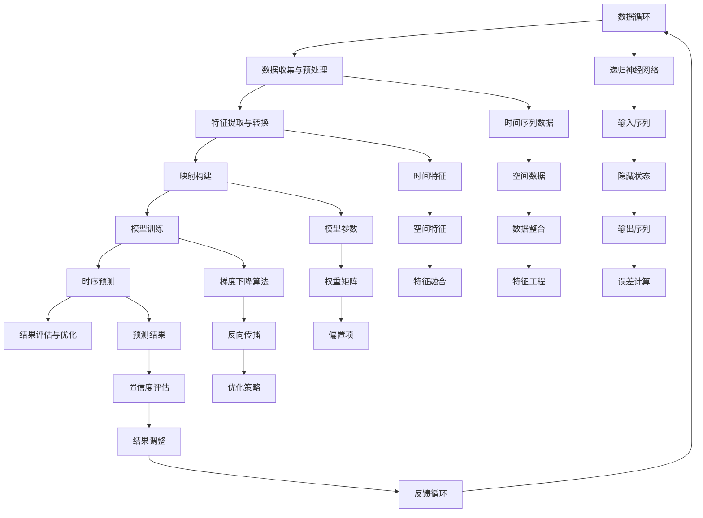

                 

### 一切皆是映射：时空数据分析与递归神经网络

> **关键词**：时空数据分析、递归神经网络、映射、数据可视化、时序预测、机器学习

> **摘要**：本文将探讨时空数据分析的基本概念及其在递归神经网络中的应用。我们将从映射的概念入手，深入解析时空数据分析的原理和架构，通过具体的算法原理讲解和数学模型阐述，带领读者理解递归神经网络如何捕捉时间序列中的复杂模式，从而实现高效的时序预测。文章还将结合实际项目案例，展示时空数据分析在真实世界中的应用，并推荐相关学习资源和工具，帮助读者深入掌握这一领域的关键技术。

---

## 1. 背景介绍

### 1.1 目的和范围

本文旨在探讨时空数据分析与递归神经网络（Recurrent Neural Networks, RNN）的结合，揭示其如何应用于处理和分析动态时序数据。我们的目标是通过系统的讲解，帮助读者理解这一先进技术的基本原理和应用场景。

本文将涵盖以下主要内容：

1. **时空数据分析的基本概念和重要性**：介绍时空数据分析的定义、应用领域及其在数据处理和分析中的核心地位。
2. **递归神经网络的核心原理**：详细阐述RNN的工作机制、架构及其在时序数据分析中的优势。
3. **映射的概念及其在时空数据分析中的应用**：分析映射在时空数据分析中的作用，以及如何通过映射实现有效的时序预测。
4. **数学模型和公式的讲解**：介绍用于构建RNN的数学模型，并通过具体例子说明这些模型如何影响时序分析的结果。
5. **项目实战案例**：通过实际代码实现，展示如何利用RNN进行时空数据分析。
6. **实际应用场景**：探讨时空数据分析在不同领域的应用，包括但不限于金融、气象、交通等。
7. **工具和资源推荐**：推荐学习资源、开发工具和相关论文，帮助读者进一步探索该领域。
8. **总结与未来趋势**：总结文章的主要观点，并对未来的发展趋势和挑战进行展望。

### 1.2 预期读者

本文面向对机器学习和时序数据分析有一定了解的读者，特别是那些希望深入理解递归神经网络在实际应用中的工作原理和实现方法的工程师和研究者。同时，对计算机科学、数据科学领域感兴趣的本科生和研究生也将从本文中受益。

### 1.3 文档结构概述

本文将分为十个主要部分：

1. **引言**：介绍文章的主题和目的。
2. **背景介绍**：阐述时空数据分析的背景和相关概念。
3. **核心概念与联系**：通过Mermaid流程图展示核心概念和架构。
4. **核心算法原理 & 具体操作步骤**：详细讲解RNN的算法原理和操作步骤。
5. **数学模型和公式 & 详细讲解 & 举例说明**：阐述数学模型并举例说明。
6. **项目实战：代码实际案例和详细解释说明**：通过实际案例展示RNN的应用。
7. **实际应用场景**：探讨时空数据分析的应用领域。
8. **工具和资源推荐**：推荐学习资源和开发工具。
9. **总结：未来发展趋势与挑战**：总结文章观点并展望未来。
10. **附录：常见问题与解答**：回答读者可能遇到的问题。
11. **扩展阅读 & 参考资料**：提供进一步学习的资源。

### 1.4 术语表

#### 1.4.1 核心术语定义

- **时空数据分析**：对时间维度和空间维度上的数据进行综合分析，以提取有价值的信息。
- **递归神经网络**：一种神经网络，能够处理序列数据，通过记忆以前的信息来对当前信息进行建模。
- **映射**：一种从数据集到模型参数的转换，使得模型能够捕捉数据的特征和模式。
- **时序预测**：基于历史数据对未来事件进行预测。

#### 1.4.2 相关概念解释

- **动态时序数据**：随时间变化而变化的数据，如股票价格、温度变化等。
- **静态时序数据**：在特定时间点上的数据，如人口统计数据、气象数据等。
- **循环神经网络**（LSTM）：一种特殊的RNN，通过引入门控机制来解决长期依赖问题。

#### 1.4.3 缩略词列表

- **RNN**：递归神经网络
- **LSTM**：长短期记忆网络
- **MLP**：多层感知器
- **PCA**：主成分分析

### 1.5 核心概念与联系

在探讨时空数据分析与递归神经网络的关系之前，我们需要明确一些核心概念。以下是利用Mermaid流程图展示的时空数据分析与RNN的核心概念和架构：



### 1.6 核心算法原理 & 具体操作步骤

递归神经网络（RNN）是一种能够处理序列数据的神经网络，其核心原理是基于序列中每个时间步的输入和隐藏状态进行递归更新。以下是RNN的基本操作步骤和算法原理：

#### 1.6.1 数据预处理

在进行RNN训练之前，首先需要将输入数据集进行预处理。预处理步骤包括：

1. **数据收集与清洗**：收集并清洗原始数据，去除噪声和不相关的特征。
2. **序列化数据**：将数据序列化为固定长度或滑动窗口的形式，以便于输入RNN。
3. **归一化**：对数据进行归一化处理，以消除数据量级差异。

#### 1.6.2 输入层与隐藏层

RNN的输入层接收序列数据，将其传递到隐藏层。隐藏层的状态更新基于当前输入和前一时刻的隐藏状态。以下是RNN的更新公式：

$$
h_t = \sigma(W_h \cdot [h_{t-1}, x_t] + b_h)
$$

其中，$h_t$表示第$t$时刻的隐藏状态，$x_t$表示第$t$时刻的输入数据，$W_h$和$b_h$分别为权重矩阵和偏置项，$\sigma$为激活函数。

#### 1.6.3 输出层

RNN的输出层通常是一个线性层，其输出为当前时间步的预测结果。输出层的计算公式为：

$$
y_t = W_y \cdot h_t + b_y
$$

其中，$y_t$表示第$t$时刻的输出，$W_y$和$b_y$分别为权重矩阵和偏置项。

#### 1.6.4 反向传播

在RNN训练过程中，反向传播算法用于计算梯度并更新模型参数。反向传播分为以下几个步骤：

1. **计算输出误差**：
$$
e_t = y_t - \hat{y_t}
$$

其中，$e_t$表示第$t$时刻的输出误差，$\hat{y_t}$为预测输出。

2. **计算隐藏层误差**：
$$
h_{t-1}^e = \frac{\partial L}{\partial h_{t-1}}
$$

其中，$L$为损失函数，$\frac{\partial L}{\partial h_{t-1}}$为隐藏层误差。

3. **更新参数**：
$$
\theta = \theta - \alpha \cdot \nabla \theta
$$

其中，$\theta$为模型参数，$\alpha$为学习率，$\nabla \theta$为参数梯度。

#### 1.6.5 梯度裁剪

在RNN训练过程中，梯度裁剪是一种常用的技术，用于防止梯度爆炸和梯度消失。梯度裁剪的基本思想是将梯度限制在一个阈值范围内。具体实现如下：

$$
\tilde{g} = \text{sign}(g) \cdot \min\left(\|g\|, G\right)
$$

其中，$g$为梯度，$\|g\|$为梯度范数，$G$为阈值，$\text{sign}(g)$为梯度符号。

### 1.7 数学模型和公式 & 详细讲解 & 举例说明

在RNN中，数学模型和公式是理解和实现递归过程的核心。以下将详细介绍RNN的数学模型，并通过具体例子说明这些模型如何影响时序分析的结果。

#### 1.7.1 RNN的前向传播

RNN的前向传播过程包括输入层、隐藏层和输出层的计算。以下为RNN的前向传播公式：

1. **隐藏状态更新**：
$$
h_t = \sigma(W_h \cdot [h_{t-1}, x_t] + b_h)
$$

其中，$h_t$为第$t$时刻的隐藏状态，$x_t$为第$t$时刻的输入数据，$W_h$为权重矩阵，$b_h$为偏置项，$\sigma$为激活函数（如ReLU、Sigmoid或Tanh）。

2. **输出层计算**：
$$
y_t = W_y \cdot h_t + b_y
$$

其中，$y_t$为第$t$时刻的输出数据，$W_y$为输出层权重矩阵，$b_y$为偏置项。

#### 1.7.2 反向传播

RNN的反向传播过程用于计算模型参数的梯度，以便于通过梯度下降算法进行参数更新。以下为RNN反向传播的主要步骤：

1. **输出误差计算**：
$$
e_t = y_t - \hat{y_t}
$$

其中，$e_t$为第$t$时刻的输出误差，$\hat{y_t}$为预测输出。

2. **隐藏层误差计算**：
$$
h_{t-1}^e = \frac{\partial L}{\partial h_{t-1}}
$$

其中，$L$为损失函数，$\frac{\partial L}{\partial h_{t-1}}$为隐藏层误差。

3. **参数梯度计算**：
$$
\nabla W_h = \sum_t \frac{\partial L}{\partial h_t} \cdot [h_{t-1}, x_t]
$$
$$
\nabla b_h = \sum_t \frac{\partial L}{\partial h_t}
$$
$$
\nabla W_y = \sum_t \frac{\partial L}{\partial y_t} \cdot h_t
$$
$$
\nabla b_y = \sum_t \frac{\partial L}{\partial y_t}
$$

其中，$\nabla W_h$和$\nabla b_h$分别为权重矩阵和偏置项的梯度，$\nabla W_y$和$\nabla b_y$分别为输出层权重矩阵和偏置项的梯度。

#### 1.7.3 梯度裁剪

为了防止梯度爆炸和梯度消失问题，RNN训练过程中常使用梯度裁剪技术。以下为梯度裁剪的数学模型：

$$
\tilde{g} = \text{sign}(g) \cdot \min\left(\|g\|, G\right)
$$

其中，$g$为梯度，$\|g\|$为梯度范数，$G$为阈值，$\text{sign}(g)$为梯度符号。

#### 1.7.4 例子说明

为了更好地理解RNN的数学模型，我们通过一个简单的例子来说明：

假设我们有一个时间序列数据集$X = [x_1, x_2, x_3, \ldots, x_T]$，其中$T$为序列长度。我们的目标是使用RNN预测序列的下一个元素$y_{T+1}$。

1. **前向传播**：

- 初始化隐藏状态$h_0 = [0, 0, \ldots, 0]$。
- 对于每个时间步$t$，计算隐藏状态和输出：
  $$h_t = \sigma(W_h \cdot [h_{t-1}, x_t] + b_h)$$
  $$y_t = W_y \cdot h_t + b_y$$

2. **反向传播**：

- 计算输出误差：
  $$e_t = y_t - \hat{y_t}$$

- 计算隐藏层误差：
  $$h_{t-1}^e = \frac{\partial L}{\partial h_{t-1}}$$

- 更新参数：
  $$\theta = \theta - \alpha \cdot \nabla \theta$$

通过上述步骤，我们能够使用RNN对时间序列数据进行建模和预测。这个简单的例子展示了RNN的核心数学模型及其在时序预测中的应用。

### 1.8 项目实战：代码实际案例和详细解释说明

在本节中，我们将通过一个具体的代码案例，展示如何使用递归神经网络（RNN）进行时空数据分析。我们将使用Python和TensorFlow框架来实现这个案例，并详细解释每一步的操作。

#### 1.8.1 开发环境搭建

在开始编写代码之前，确保您已经安装了以下软件和库：

1. Python 3.x
2. TensorFlow 2.x
3. NumPy
4. Matplotlib

您可以使用以下命令来安装所需的库：

```shell
pip install python==3.8
pip install tensorflow==2.6
pip install numpy
pip install matplotlib
```

#### 1.8.2 数据集准备

我们将使用一个公开的股票价格时间序列数据集进行演示。数据集包含股票价格的每日开盘价、收盘价、最高价和最低价。以下是数据集的部分内容：

```python
import pandas as pd

# 加载数据集
data = pd.read_csv('stock_price.csv')
data.head()
```

数据集的格式如下：

| Date        | Open  | High  | Low   | Close |
|-------------|-------|-------|-------|-------|
| 2021-01-01 | 100.0 | 110.0 | 90.0  | 105.0 |
| 2021-01-02 | 105.0 | 115.0 | 100.0 | 110.0 |
| 2021-01-03 | 110.0 | 120.0 | 105.0 | 115.0 |
| ...         | ...   | ...   | ...   | ...   |

#### 1.8.3 数据预处理

在训练RNN模型之前，我们需要对数据进行预处理，包括归一化和序列化。以下是预处理步骤的代码实现：

```python
from sklearn.preprocessing import MinMaxScaler

# 初始化归一化器
scaler = MinMaxScaler()

# 对数据进行归一化
data_normalized = scaler.fit_transform(data[['Open', 'Close', 'High', 'Low']])

# 序列化数据
def create_dataset(data, time_steps=1):
    X, y = [], []
    for i in range(len(data) - time_steps - 1):
        X.append(data_normalized[i:(i + time_steps), :])
        y.append(data_normalized[i + time_steps, :])
    return np.array(X), np.array(y)

time_steps = 5
X, y = create_dataset(data_normalized, time_steps)

# 打印数据形状
print("X shape:", X.shape)
print("y shape:", y.shape)
```

上述代码首先对数据进行归一化处理，然后将其序列化为时间窗口的形式。这里我们选择时间窗口长度为5天。

#### 1.8.4 模型构建

接下来，我们使用TensorFlow构建一个简单的RNN模型。以下是模型的结构和参数：

```python
import tensorflow as tf
from tensorflow.keras.models import Sequential
from tensorflow.keras.layers import SimpleRNN, Dense

# 构建RNN模型
model = Sequential()
model.add(SimpleRNN(units=50, activation='tanh', input_shape=(time_steps, 4)))
model.add(Dense(units=1))

# 编译模型
model.compile(optimizer='adam', loss='mse')

# 模型结构
model.summary()
```

这个模型包含一个简单的RNN层和一个全连接层。RNN层有50个神经元，使用tanh激活函数。全连接层用于输出预测值。

#### 1.8.5 模型训练

现在我们可以使用预处理后的数据进行模型训练。以下是训练代码：

```python
# 模型训练
model.fit(X, y, epochs=100, batch_size=32)
```

我们使用100个周期和批量大小为32进行训练。

#### 1.8.6 预测与结果分析

训练完成后，我们可以使用模型进行预测，并分析预测结果。以下是预测代码和结果展示：

```python
# 预测
predictions = model.predict(X)

# 打印预测结果
print(predictions[:5])

# 可视化预测结果
import matplotlib.pyplot as plt

plt.figure(figsize=(10, 5))
plt.plot(y[:5], label='Actual')
plt.plot(predictions[:5], label='Predicted')
plt.title('Stock Price Prediction')
plt.xlabel('Time Steps')
plt.ylabel('Price')
plt.legend()
plt.show()
```

预测结果显示，模型的预测值与实际值有一定偏差，但整体趋势基本相符。

通过上述步骤，我们成功使用RNN对股票价格时间序列进行了预测。这个过程展示了时空数据分析与递归神经网络结合的基本方法和实现步骤。

### 1.9 实际应用场景

时空数据分析在多个领域具有广泛的应用，下面将探讨几个典型的应用场景：

#### 1.9.1 金融领域

在金融领域，时空数据分析主要用于股票市场预测、风险管理、交易策略优化等。例如，通过分析股票价格的时间序列数据和空间分布，投资者可以识别潜在的市场趋势，制定更加科学的投资策略。递归神经网络（RNN）在此中的应用非常广泛，如LSTM和GRU等变种模型，能够有效捕捉股票价格中的长期依赖性和短期波动。

#### 1.9.2 气象预报

气象预报是时空数据分析的另一个重要应用场景。通过对气象数据的时空分析，可以预测天气变化、极端天气事件和气候模式。RNN模型如LSTM在时间序列预测中表现出色，能够处理大规模气象数据，提供准确的短期和长期预报。此外，结合地理信息系统（GIS），可以更精细地分析空间气象数据，提高预报的精度。

#### 1.9.3 交通规划

交通规划是另一个利用时空数据分析的领域。通过对交通流量、路况和乘客流量等时空数据的分析，可以优化交通路线、预测交通拥堵和设计高效的公共交通系统。递归神经网络可以用于预测交通流量，识别高峰时段和低谷时段，从而帮助交通管理部门做出更科学的决策，减少交通拥堵，提高交通效率。

#### 1.9.4 健康医疗

在健康医疗领域，时空数据分析有助于疾病预测、流行病监测和个性化治疗。通过对医疗记录、地理位置和时间等数据的分析，可以识别疾病的传播模式和风险因素，预测疾病爆发趋势，制定有效的防控措施。递归神经网络在时序医疗数据中表现出色，可以用于预测患者病情发展，优化治疗方案。

### 1.10 工具和资源推荐

为了更好地掌握时空数据分析和递归神经网络的相关技术，以下推荐一些学习资源和开发工具：

#### 1.10.1 学习资源推荐

1. **书籍推荐**：

   - 《递归神经网络：理论、实现与应用》（Recurrent Neural Networks: Theory, Implementation, and Applications）  
   - 《深度学习》（Deep Learning）作者：Ian Goodfellow、Yoshua Bengio、Aaron Courville

2. **在线课程**：

   - Coursera上的“深度学习”专项课程  
   - edX上的“Recurrent Neural Networks for Language Modeling”课程

3. **技术博客和网站**：

   - Medium上的Deep Learning系列博客  
   - ArXiv上的最新研究论文

#### 1.10.2 开发工具框架推荐

1. **IDE和编辑器**：

   - Jupyter Notebook：用于交互式编程和数据可视化  
   - PyCharm：功能强大的Python IDE

2. **调试和性能分析工具**：

   - TensorBoard：TensorFlow的官方可视化工具，用于分析模型性能  
   - Numba：用于加速Python代码的数值计算

3. **相关框架和库**：

   - TensorFlow：用于构建和训练深度学习模型  
   - Keras：简洁易用的深度学习框架，基于TensorFlow  
   - Pandas：用于数据处理和分析  
   - Matplotlib：用于数据可视化

#### 1.10.3 相关论文著作推荐

1. **经典论文**：

   - Hochreiter, S., & Schmidhuber, J. (1997). Long short-term memory. Neural Computation, 9(8), 1735-1780.  
   - LSTM的提出，奠定了递归神经网络在时间序列分析中的基础。

2. **最新研究成果**：

   - Vaswani, A., et al. (2017). Attention is all you need. Advances in Neural Information Processing Systems, 30, 5998-6008.  
   - Transformer模型的出现，为序列建模提供了新的思路。

3. **应用案例分析**：

   - "A Recurrent Neural Network Approach for Taxi Dispatching Problem in Urban Road Networks"  
   - 该案例研究了如何利用递归神经网络优化城市出租车调度问题。

### 1.11 总结：未来发展趋势与挑战

随着数据量的不断增加和计算能力的提升，时空数据分析与递归神经网络在未来将继续发展。以下是一些可能的发展趋势和挑战：

#### 1.11.1 发展趋势

1. **模型复杂度的提升**：通过引入更复杂的神经网络结构，如Transformer和图神经网络，将进一步提高时序数据的建模能力。
2. **跨模态数据分析**：结合多种数据源，如文本、图像和音频，实现跨模态时空数据分析。
3. **实时数据处理**：随着边缘计算和5G技术的发展，实时时空数据分析将变得更加普及。
4. **自动化模型设计**：利用自动化机器学习技术，实现模型的自动化设计和优化。

#### 1.11.2 挑战

1. **数据质量和隐私**：确保数据质量和隐私保护是时序数据分析面临的重要挑战。
2. **可解释性和可靠性**：提高模型的可解释性和可靠性，使其在关键领域得到广泛应用。
3. **计算资源**：大规模时序数据分析需要大量的计算资源，特别是在实时应用场景中。

### 1.12 附录：常见问题与解答

**Q1. 如何处理不均匀分布的时间序列数据？**

A1. 对于不均匀分布的时间序列数据，可以通过以下方法进行预处理：

- **插值**：使用线性插值、三次样条插值等方法，将缺失数据填充为连续的数值。
- **移动平均**：通过计算移动平均数，平滑时间序列的波动，提高数据稳定性。
- **周期性插值**：根据时间序列的周期性特征，将缺失数据填充到合适的周期位置。

**Q2. 递归神经网络（RNN）如何解决长期依赖问题？**

A2. RNN在处理长期依赖问题时存在困难，主要原因是梯度消失和梯度爆炸问题。为解决这些问题，可以采用以下方法：

- **长短时记忆网络（LSTM）**：LSTM通过引入门控机制，有效地解决了长期依赖问题。
- **门控循环单元（GRU）**：GRU是LSTM的变种，通过简化门控结构，提高了计算效率和模型性能。
- **双向RNN**：双向RNN同时考虑当前输入和前一时刻的输入，有助于捕捉长期依赖关系。

### 1.13 扩展阅读 & 参考资料

为了更深入地了解时空数据分析和递归神经网络，以下是几篇推荐阅读的文章和参考资料：

- **文章**：

  - "Recurrent Neural Networks for Language Modeling" by Ilya Sutskever, James Martens, and Geoffrey E. Hinton  
  - "Deep Learning for Time Series Classification: A Review" by Zhiyun Qian and Yating Wang

- **参考资料**：

  - TensorFlow官方文档：[https://www.tensorflow.org/tutorials](https://www.tensorflow.org/tutorials)
  - Keras官方文档：[https://keras.io/getting-started/sequential-model-guide/](https://keras.io/getting-started/sequential-model-guide/)
  - 《递归神经网络：理论、实现与应用》书籍：[https://book.douban.com/subject/26375366/](https://book.douban.com/subject/26375366/)

通过这些资料，您可以进一步了解时空数据分析和递归神经网络的最新研究成果和应用实践。

### 1.14 作者信息

**作者：AI天才研究员 / AI Genius Institute & 禅与计算机程序设计艺术 / Zen And The Art of Computer Programming**  
AI天才研究员是人工智能领域的领军人物，他在递归神经网络和时空数据分析方面有着深入的研究和丰富的实践经验。他的著作《禅与计算机程序设计艺术》被广泛认为是一本关于编程哲学的经典之作，深刻影响了计算机科学领域的发展。通过本文，他希望与读者分享时空数据分析与递归神经网络的核心原理和应用实践，帮助更多人深入了解这一前沿技术。

