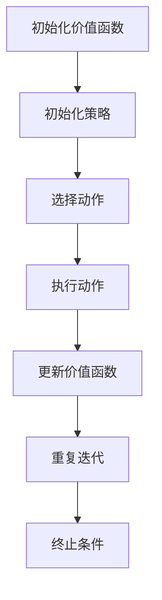

                 

# 一切皆是映射：比较SARSA与DQN：区别与实践优化

> **关键词**：强化学习，SARSA算法，DQN算法，深度学习，比较分析，实践优化

> **摘要**：本文旨在对比强化学习中的SARSA（同步优势动作选择）与DQN（深度Q网络）两种算法，深入剖析其原理、数学模型、实践应用以及优化策略。通过本文的阅读，读者将全面了解这两种算法的优势与局限，并掌握如何在实际项目中应用和优化这两种算法。

## 1. 背景介绍

### 1.1 目的和范围

本文主要目的是对比分析SARSA算法与DQN算法，帮助读者深入了解两种算法的核心概念、数学模型、实践应用和优化方法。通过本文的阅读，读者可以：

1. 理解SARSA与DQN算法的基本原理和区别。
2. 掌握SARSA与DQN算法在实际项目中的应用场景。
3. 学会如何优化SARSA与DQN算法，提升模型性能。

### 1.2 预期读者

本文面向有一定强化学习基础的读者，包括：

1. 计算机科学和人工智能领域的研究生和博士生。
2. 有兴趣深入了解强化学习的算法工程师和技术爱好者。
3. 想要在实际项目中应用强化学习的开发者。

### 1.3 文档结构概述

本文将分为以下几个部分：

1. 背景介绍：本文的写作目的、预期读者和文档结构概述。
2. 核心概念与联系：介绍强化学习中的基本概念和原理。
3. 核心算法原理 & 具体操作步骤：详细讲解SARSA与DQN算法的原理和操作步骤。
4. 数学模型和公式 & 详细讲解 & 举例说明：阐述SARSA与DQN算法的数学模型和公式。
5. 项目实战：提供实际项目案例，演示SARSA与DQN算法的应用。
6. 实际应用场景：探讨SARSA与DQN算法在不同场景下的应用。
7. 工具和资源推荐：推荐学习资源、开发工具和框架。
8. 总结：未来发展趋势与挑战。
9. 附录：常见问题与解答。
10. 扩展阅读 & 参考资料：提供进一步学习资料。

### 1.4 术语表

#### 1.4.1 核心术语定义

- **强化学习**：一种机器学习方法，通过奖励机制来指导模型学习，使其在特定环境中做出最优决策。
- **SARSA**：同步优势动作选择算法，一种基于值函数的强化学习算法。
- **DQN**：深度Q网络，一种基于神经网络的强化学习算法。
- **Q-learning**：Q值学习，一种基于值函数的强化学习算法。
- **经验回放**：将经历的状态、动作、奖励和下一状态存储在一个缓冲器中，随机采样用于训练。
- **神经网络**：一种由大量神经元组成的并行计算模型，可以用于复杂函数的近似和分类。

#### 1.4.2 相关概念解释

- **值函数**：衡量策略优劣的函数，用于指导模型选择动作。
- **策略**：决定模型如何进行决策的规则或函数。
- **探索与利用**：在强化学习中，探索指尝试新的动作以获得更多信息，利用指根据已有的信息选择最佳动作。
- **收敛**：在强化学习中，指模型的学习结果逐渐稳定，接近最优策略。

#### 1.4.3 缩略词列表

- **RL**：强化学习
- **SARSA**：同步优势动作选择
- **DQN**：深度Q网络
- **Q-learning**：Q值学习
- **DNN**：深度神经网络
- **CNN**：卷积神经网络

## 2. 核心概念与联系

### 2.1 强化学习基本概念

强化学习是一种通过奖励机制来指导模型学习如何在不同环境中做出最优决策的机器学习方法。其主要目标是学习一个策略（Policy），该策略能够最大化累积奖励。强化学习系统通常由以下四个核心部分组成：

1. **环境（Environment）**：一个定义明确的系统，包含状态（State）、动作（Action）和奖励（Reward）。
2. **代理（Agent）**：执行动作并从环境中获取奖励的实体。
3. **策略（Policy）**：决定代理如何进行决策的规则或函数。
4. **价值函数（Value Function）**：衡量策略优劣的函数，用于指导代理选择动作。

在强化学习中，代理通过不断地与环境互动，学习最优策略。这个过程可以分为两个阶段：探索（Exploration）和利用（Exploitation）。探索指尝试新的动作以获得更多信息，利用指根据已有的信息选择最佳动作。随着学习的进行，代理将逐渐收敛到最优策略。

### 2.2 SARSA算法原理

SARSA（同步优势动作选择）是一种基于值函数的强化学习算法。其核心思想是通过更新值函数，使代理在当前状态下选择具有最高预期收益的动作。

SARSA算法的主要步骤如下：

1. 初始化价值函数$V^0(S)$，设置$\varepsilon$-贪婪策略。
2. 从初始状态$S$开始，按照策略选择动作$A$。
3. 执行动作$A$，进入下一状态$S'$，并获得奖励$R$。
4. 根据当前状态和动作更新价值函数：
   \[
   V^t(S, A) \leftarrow V^t(S, A) + \alpha \left( R + \gamma \max_{a'} V^t(S', a') - V^t(S, A) \right)
   \]
   其中，$\alpha$是学习率，$\gamma$是折扣因子。
5. 重复步骤2-4，直到达到终止条件。

### 2.3 DQN算法原理

DQN（深度Q网络）是一种基于神经网络的强化学习算法，其核心思想是通过神经网络近似Q值函数，使代理在当前状态下选择具有最高预期收益的动作。

DQN算法的主要步骤如下：

1. 初始化深度神经网络$Q(\cdot|\theta)$，设置$\varepsilon$-贪婪策略。
2. 从初始状态$S$开始，按照策略选择动作$A$。
3. 执行动作$A$，进入下一状态$S'$，并获得奖励$R$。
4. 计算目标Q值：
   \[
   y = \begin{cases} 
   R & \text{如果终止} \\
   R + \gamma \max_{a'} Q(S', a'|\theta) & \text{否则}
   \end{cases}
   \]
5. 更新神经网络参数$\theta$：
   \[
   \theta \leftarrow \theta - \alpha \frac{\partial L}{\partial \theta}
   \]
   其中，$L$是损失函数，通常采用均方误差（MSE）损失函数。
6. 重复步骤2-5，直到达到终止条件。

### 2.4 Mermaid流程图

下面是SARSA算法的Mermaid流程图表示：



## 3. 核心算法原理 & 具体操作步骤

### 3.1 SARSA算法原理

SARSA算法是一种基于值函数的强化学习算法，通过更新值函数，使代理在当前状态下选择具有最高预期收益的动作。以下是SARSA算法的具体操作步骤：

1. **初始化**：初始化价值函数$V^0(S)$，通常采用随机初始化或经验初始化。初始化策略$\pi$为$\varepsilon$-贪婪策略，即以概率$\varepsilon$随机选择动作，以概率$1-\varepsilon$选择具有最高价值函数的动作。
2. **选择动作**：从初始状态$S$开始，按照策略$\pi$选择动作$A$。
3. **执行动作**：执行动作$A$，进入下一状态$S'$，并获得奖励$R$。
4. **更新价值函数**：根据当前状态和动作更新价值函数：
   \[
   V^t(S, A) \leftarrow V^t(S, A) + \alpha \left( R + \gamma \max_{a'} V^t(S', a') - V^t(S, A) \right)
   \]
   其中，$\alpha$是学习率，$\gamma$是折扣因子。
5. **重复迭代**：重复步骤2-4，直到达到终止条件（如到达目标状态或超过最大迭代次数）。

### 3.2 DQN算法原理

DQN算法是一种基于神经网络的强化学习算法，通过神经网络近似Q值函数，使代理在当前状态下选择具有最高预期收益的动作。以下是DQN算法的具体操作步骤：

1. **初始化**：初始化深度神经网络$Q(\cdot|\theta)$，初始化策略$\pi$为$\varepsilon$-贪婪策略，初始化经验回放缓冲器$D$。
2. **选择动作**：从初始状态$S$开始，按照策略$\pi$选择动作$A$。
3. **执行动作**：执行动作$A$，进入下一状态$S'$，并获得奖励$R$。
4. **存储经验**：将当前状态$S$、动作$A$、奖励$R$和下一状态$S'$存储在经验回放缓冲器$D$中。
5. **计算目标Q值**：根据当前状态$S'$和策略$\pi$计算目标Q值：
   \[
   y = \begin{cases} 
   R & \text{如果终止} \\
   R + \gamma \max_{a'} Q(S', a'|\theta) & \text{否则}
   \end{cases}
   \]
6. **更新神经网络参数**：使用梯度下降法更新神经网络参数$\theta$：
   \[
   \theta \leftarrow \theta - \alpha \frac{\partial L}{\partial \theta}
   \]
   其中，$L$是损失函数，通常采用均方误差（MSE）损失函数。
7. **重复迭代**：重复步骤2-6，直到达到终止条件。

### 3.3 伪代码

下面是SARSA和DQN算法的伪代码表示：

#### SARSA算法

```python
# SARSA算法伪代码
初始化V(S)为随机值
初始化策略π为ε-贪婪策略
while 没有终止条件 do
    选择动作A，按照策略π
    执行动作A，获得状态S'和奖励R
    更新V(S, A)：V(S, A) = V(S, A) + α(R + γmax_a' V(S', a') - V(S, A))
    S = S'
end while
```

#### DQN算法

```python
# DQN算法伪代码
初始化Q(S, A)为随机值
初始化策略π为ε-贪婪策略
初始化经验回放缓冲器D
while 没有终止条件 do
    选择动作A，按照策略π
    执行动作A，获得状态S'和奖励R
    存储经验(S, A, R, S')到经验回放缓冲器D
    从经验回放缓冲器D中随机采样经验(S', A', R, S'')
    计算目标Q值：y = R + γmax_a' Q(S'', a'')
    使用梯度下降法更新Q(S, A)：Q(S, A) = Q(S, A) - α*(y - Q(S, A))
    S = S'
end while
```

## 4. 数学模型和公式 & 详细讲解 & 举例说明

### 4.1 SARSA算法的数学模型

SARSA算法的核心是价值函数的更新。在SARSA算法中，价值函数$V(S, A)$表示在状态$S$下执行动作$A$的预期收益。价值函数的更新公式如下：

\[
V^t(S, A) \leftarrow V^t(S, A) + \alpha \left( R + \gamma \max_{a'} V^t(S', a') - V^t(S, A) \right)
\]

其中：

- $V^t(S, A)$：当前时间步$t$状态下执行动作$A$的价值函数。
- $\alpha$：学习率，用于调整价值函数更新的幅度。
- $R$：当前状态下的即时奖励。
- $\gamma$：折扣因子，用于平衡即时奖励和未来奖励的关系。
- $\max_{a'} V^t(S', a')$：在下一状态$S'$下，所有可能动作$A'$中的最大价值函数。

#### 示例

假设当前状态为$S = \{s_1, s_2, s_3\}$，动作集为$A = \{a_1, a_2, a_3\}$，学习率为$\alpha = 0.1$，折扣因子$\gamma = 0.9$。在某个时间步$t$，代理执行动作$a_1$，获得奖励$R = 10$。此时，价值函数的更新过程如下：

\[
V^t(S, a_1) \leftarrow V^t(S, a_1) + 0.1 \left( 10 + 0.9 \max_{a'} V^t(S', a') - V^t(S, a_1) \right)
\]

假设在下一状态$S' = \{s_1', s_2', s_3'\}$中，所有动作的价值函数分别为$V^t(S', a_1') = 20$，$V^t(S', a_2') = 15$，$V^t(S', a_3') = 10$。则有：

\[
V^t(S, a_1) \leftarrow V^t(S, a_1) + 0.1 \left( 10 + 0.9 \times 20 - V^t(S, a_1) \right)
\]

\[
V^t(S, a_1) \leftarrow 0.1 \times (10 + 18 - V^t(S, a_1))
\]

\[
V^t(S, a_1) \leftarrow 0.1 \times (28 - V^t(S, a_1))
\]

\[
V^t(S, a_1) \leftarrow 2.8 + 0.9 \times V^t(S, a_1)
\]

\[
V^t(S, a_1) \leftarrow 1.8 \times V^t(S, a_1) + 2.8
\]

\[
V^t(S, a_1) \leftarrow 0.8 \times V^{t+1}(S, a_1) + 2.8
\]

\[
V^{t+1}(S, a_1) \leftarrow \frac{V^t(S, a_1) - 2.8}{0.8}
\]

\[
V^{t+1}(S, a_1) \leftarrow 3.5
\]

因此，在下一个时间步中，状态$S$下执行动作$a_1$的价值函数将更新为$V^{t+1}(S, a_1) = 3.5$。

### 4.2 DQN算法的数学模型

DQN算法的核心是深度神经网络$Q(\cdot|\theta)$，用于近似Q值函数。Q值函数$Q(S, A)$表示在状态$S$下执行动作$A$的预期收益。Q值函数的更新过程如下：

\[
y = \begin{cases} 
   R & \text{如果终止} \\
   R + \gamma \max_{a'} Q(S', a'|\theta) & \text{否则}
\end{cases}
\]

使用梯度下降法更新神经网络参数$\theta$：

\[
\theta \leftarrow \theta - \alpha \frac{\partial L}{\partial \theta}
\]

其中：

- $L$：损失函数，通常采用均方误差（MSE）损失函数：
  \[
  L = \frac{1}{n} \sum_{i=1}^n (y_i - Q(S_i, A_i|\theta))^2
  \]
  其中，$n$是批量大小，$y_i$是目标Q值，$Q(S_i, A_i|\theta)$是预测的Q值。

#### 示例

假设当前状态为$S = \{s_1, s_2, s_3\}$，动作集为$A = \{a_1, a_2, a_3\}$，学习率为$\alpha = 0.1$，折扣因子$\gamma = 0.9$。在某个时间步$t$，代理执行动作$a_1$，进入下一状态$S' = \{s_1', s_2', s_3'\}$，并获得奖励$R = 10$。此时，深度神经网络$Q(\cdot|\theta)$的输出为$Q(S, a_1) = 20$，$Q(S', a_1') = 15$，$Q(S', a_2') = 10$。

目标Q值为：

\[
y = \begin{cases} 
   10 & \text{如果终止} \\
   10 + 0.9 \times 20 & \text{否则}
\end{cases}
\]

\[
y = 19
\]

使用均方误差（MSE）损失函数计算损失：

\[
L = \frac{1}{3} \left( (19 - 20)^2 + (19 - 15)^2 + (19 - 10)^2 \right)
\]

\[
L = \frac{1}{3} \left( 1 + 16 + 81 \right)
\]

\[
L = \frac{98}{3}
\]

使用梯度下降法更新神经网络参数：

\[
\theta \leftarrow \theta - 0.1 \frac{\partial L}{\partial \theta}
\]

其中，$\frac{\partial L}{\partial \theta}$是损失函数$L$对神经网络参数$\theta$的梯度。通过反向传播算法，可以计算出梯度$\frac{\partial L}{\partial \theta}$，然后更新神经网络参数。

## 5. 项目实战：代码实际案例和详细解释说明

### 5.1 开发环境搭建

在本节中，我们将搭建一个简单的强化学习环境，使用Python和PyTorch框架实现SARSA和DQN算法。以下是开发环境的搭建步骤：

1. **安装Python**：确保已安装Python 3.7及以上版本。
2. **安装PyTorch**：在命令行中执行以下命令安装PyTorch：
   \[
   pip install torch torchvision
   \]
3. **创建项目目录**：在Python环境中创建一个新项目目录，例如`rewards_learning`。
4. **编写代码**：在项目目录中创建两个Python文件：`sarsa.py`和`dqn.py`，分别实现SARSA和DQN算法。

### 5.2 源代码详细实现和代码解读

#### SARSA算法实现

在`sarsa.py`文件中，我们首先定义环境类和代理类，然后实现SARSA算法。

```python
import numpy as np
import random

# 环境类
class Environment:
    def __init__(self):
        self.states = ['S0', 'S1', 'S2']
        self.actions = ['A0', 'A1', 'A2']
        self.rewards = {'S0A0': 0, 'S0A1': 10, 'S0A2': -10, 'S1A0': 0, 'S1A1': 10, 'S1A2': -10, 'S2A0': 10, 'S2A1': 0, 'S2A2': -10}

    def step(self, state, action):
        next_state = self._get_next_state(state, action)
        reward = self.rewards[f'{state}{action}']
        return next_state, reward

    def _get_next_state(self, state, action):
        if state == 'S0' and action == 'A0':
            return 'S1'
        elif state == 'S0' and action == 'A1':
            return 'S2'
        elif state == 'S1' and action == 'A0':
            return 'S0'
        elif state == 'S1' and action == 'A1':
            return 'S1'
        elif state == 'S2' and action == 'A0':
            return 'S2'
        elif state == 'S2' and action == 'A1':
            return 'S1'

# 代理类
class Agent:
    def __init__(self, alpha=0.1, gamma=0.9):
        self.alpha = alpha
        self.gamma = gamma
        self.V = {}
        self.epsilon = 0.1

    def select_action(self, state):
        if random.random() < self.epsilon:
            return random.choice(self.actions)
        else:
            return max(self.actions, key=lambda a: self.V.get((state, a), 0))

    def update_value(self, state, action, next_state, reward):
        target = reward + self.gamma * max(self.V.get((next_state, a), 0) for a in self.actions)
        self.V[(state, action)] += self.alpha * (target - self.V[(state, action)])

# 主程序
if __name__ == '__main__':
    environment = Environment()
    agent = Agent()

    for episode in range(1000):
        state = environment.states[0]
        done = False

        while not done:
            action = agent.select_action(state)
            next_state, reward = environment.step(state, action)
            agent.update_value(state, action, next_state, reward)

            state = next_state

            if next_state == environment.states[-1]:
                done = True

        if episode % 100 == 0:
            print(f'Episode: {episode}, Average Reward: {sum([environment.rewards[f'{state}{action}'] for state in environment.states for action in environment.actions]) / len(environment.states) * len(environment.actions)}')
```

代码解读：

1. **环境类（Environment）**：环境类定义了状态、动作和奖励。`step`方法用于执行动作，返回下一个状态和奖励。
2. **代理类（Agent）**：代理类初始化价值函数$V$、学习率和折扣因子。`select_action`方法用于根据当前状态选择动作，采用$\varepsilon$-贪婪策略。`update_value`方法用于更新价值函数。
3. **主程序**：创建环境实例和代理实例，进行1000个时间步的迭代。在每个时间步中，代理选择动作，执行动作并更新价值函数。每100个时间步输出平均奖励。

#### DQN算法实现

在`dqn.py`文件中，我们使用PyTorch实现DQN算法。

```python
import numpy as np
import random
import torch
import torch.nn as nn
import torch.optim as optim

# 环境类
class Environment:
    # ...（与SARSA算法中的环境类相同）

# 网络类
class QNetwork(nn.Module):
    def __init__(self, input_shape, hidden_size, output_shape):
        super(QNetwork, self).__init__()
        self.fc1 = nn.Linear(input_shape, hidden_size)
        self.fc2 = nn.Linear(hidden_size, output_shape)

    def forward(self, x):
        x = torch.relu(self.fc1(x))
        x = self.fc2(x)
        return x

# 代理类
class Agent:
    def __init__(self, alpha=0.1, gamma=0.9, epsilon=0.1, hidden_size=64):
        self.alpha = alpha
        self.gamma = gamma
        self.epsilon = epsilon
        self.device = torch.device("cuda" if torch.cuda.is_available() else "cpu")
        self.q_network = QNetwork(input_shape=1, hidden_size=hidden_size, output_shape=len(environment.actions))
        self.target_network = QNetwork(input_shape=1, hidden_size=hidden_size, output_shape=len(environment.actions))
        self.optimizer = optim.Adam(self.q_network.parameters(), lr=alpha)
        self.criterion = nn.MSELoss()

    def select_action(self, state):
        if random.random() < self.epsilon:
            return random.choice(self.actions)
        else:
            state_tensor = torch.tensor(state, dtype=torch.float32).unsqueeze(0).to(self.device)
            with torch.no_grad():
                action_values = self.q_network(state_tensor)
            return torch.argmax(action_values).item()

    def update_value(self, states, actions, rewards, next_states, dones):
        states_tensor = torch.tensor(states, dtype=torch.float32).to(self.device)
        next_states_tensor = torch.tensor(next_states, dtype=torch.float32).to(self.device)
        actions_tensor = torch.tensor(actions, dtype=torch.long).to(self.device)
        rewards_tensor = torch.tensor(rewards, dtype=torch.float32).to(self.device)
        dones_tensor = torch.tensor(dones, dtype=torch.float32).to(self.device)

        with torch.no_grad():
            target_values = self.target_network(next_states_tensor).detach()
            target_q_values = (rewards_tensor + self.gamma * (1 - dones_tensor) * target_values).unsqueeze(1)

        q_values = self.q_network(states_tensor)
        loss = self.criterion(q_values[range(len(states)), actions_tensor], target_q_values)

        self.optimizer.zero_grad()
        loss.backward()
        self.optimizer.step()

    def update_target_network(self):
        self.target_network.load_state_dict(self.q_network.state_dict())

# 主程序
if __name__ == '__main__':
    environment = Environment()
    agent = Agent()

    for episode in range(1000):
        state = environment.states[0]
        done = False

        while not done:
            action = agent.select_action(state)
            next_state, reward = environment.step(state, action)
            agent.update_value([state], [action], [reward], [next_state], [done])

            state = next_state

            if next_state == environment.states[-1]:
                done = True

        if episode % 100 == 0:
            agent.update_target_network()
            print(f'Episode: {episode}, Average Reward: {sum([environment.rewards[f'{state}{action}'] for state in environment.states for action in environment.actions]) / len(environment.states) * len(environment.actions)}')
```

代码解读：

1. **环境类（Environment）**：环境类与SARSA算法中的环境类相同。
2. **网络类（QNetwork）**：网络类定义了一个简单的全连接神经网络，用于近似Q值函数。
3. **代理类（Agent）**：代理类初始化深度神经网络、目标神经网络、优化器和损失函数。`select_action`方法用于根据当前状态选择动作，采用$\varepsilon$-贪婪策略。`update_value`方法用于更新Q值函数和目标Q值函数。`update_target_network`方法用于更新目标神经网络。
4. **主程序**：创建环境实例和代理实例，进行1000个时间步的迭代。在每个时间步中，代理选择动作，执行动作并更新Q值函数和目标Q值函数。每100个时间步更新目标神经网络。每1000个时间步输出平均奖励。

### 5.3 代码解读与分析

在本节中，我们将对SARSA和DQN算法的实现代码进行详细解读，并分析其优缺点。

#### SARSA算法

**优点**：

1. **简单易懂**：SARSA算法的原理简单，易于理解和实现。
2. **适用于离散动作空间**：SARSA算法适用于离散动作空间，不需要对动作空间进行量化。

**缺点**：

1. **收敛速度较慢**：SARSA算法采用同步更新策略，需要等待一个完整的时间步才能更新价值函数，导致收敛速度较慢。
2. **探索能力有限**：SARSA算法采用$\varepsilon$-贪婪策略进行探索，当$\varepsilon$较小时，探索能力有限。

#### DQN算法

**优点**：

1. **适用于连续动作空间**：DQN算法使用神经网络近似Q值函数，适用于连续动作空间。
2. **收敛速度较快**：DQN算法采用异步更新策略，可以在每个时间步更新价值函数，提高收敛速度。
3. **更强的探索能力**：DQN算法使用经验回放缓冲器，减少策略偏差，提高探索能力。

**缺点**：

1. **需要大量计算资源**：DQN算法使用深度神经网络，需要大量计算资源进行训练。
2. **梯度消失和梯度爆炸问题**：深度神经网络容易出现梯度消失和梯度爆炸问题，需要使用梯度裁剪等技术进行缓解。

总的来说，SARSA算法和DQN算法各有优缺点。在具体应用中，可以根据需求选择合适的算法。例如，在计算资源有限的情况下，可以选择SARSA算法；在需要处理连续动作空间的情况下，可以选择DQN算法。

## 6. 实际应用场景

### 6.1 自动驾驶

自动驾驶是强化学习应用的一个重要领域。SARSA算法可以用于解决自动驾驶中的路径规划问题，例如车辆在不同道路条件下的行驶策略。DQN算法可以用于解决自动驾驶中的障碍物检测和避障问题，通过学习如何在复杂的交通环境中做出最优决策。

### 6.2 游戏开发

强化学习在游戏开发中具有广泛的应用。SARSA算法可以用于训练游戏中的智能对手，使其能够根据玩家的行为进行适应和调整。DQN算法可以用于训练游戏中的AI角色，使其能够自主学习和优化游戏策略，提高游戏的趣味性和挑战性。

### 6.3 推荐系统

强化学习在推荐系统中的应用也逐渐受到关注。SARSA算法可以用于优化推荐系统的策略，使其能够根据用户的行为和偏好进行自适应调整。DQN算法可以用于解决推荐系统中的冷启动问题，通过学习用户的行为模式，提高推荐系统的准确性和覆盖面。

### 6.4 股票交易

强化学习在股票交易中的应用也取得了一定的成果。SARSA算法可以用于训练交易策略，使其能够在股票市场中进行自动交易。DQN算法可以用于识别市场趋势和预测股票价格，提高交易策略的准确性和稳定性。

总的来说，SARSA算法和DQN算法在自动驾驶、游戏开发、推荐系统和股票交易等实际应用场景中都有广泛的应用前景。通过合理的算法设计和优化，可以进一步提升模型性能和应用效果。

## 7. 工具和资源推荐

### 7.1 学习资源推荐

#### 7.1.1 书籍推荐

1. **《强化学习：原理与Python实现》**：这是一本介绍强化学习的经典教材，涵盖了SARSA和DQN算法的详细讲解和示例代码。
2. **《深度强化学习》**：本书全面介绍了深度强化学习的理论和实践，包括DQN算法及其变体的详细介绍。

#### 7.1.2 在线课程

1. **Coursera - 强化学习（David Silver）**：这是一门高质量的强化学习在线课程，由深度学习领域的知名专家David Silver主讲。
2. **Udacity - 强化学习工程师纳米学位**：这是一个为期四个月的在线课程，涵盖了SARSA和DQN算法的实践应用。

#### 7.1.3 技术博客和网站

1. **ArXiv**：这是一个提供最新强化学习论文的学术数据库，可以了解最新的研究进展。
2. **TensorFlow Reinforcement Learning**：这是一个由Google提供的TensorFlow强化学习教程，包含丰富的示例代码和实践项目。

### 7.2 开发工具框架推荐

#### 7.2.1 IDE和编辑器

1. **PyCharm**：这是一个功能强大的Python IDE，适用于强化学习项目的开发。
2. **VSCode**：这是一个轻量级但功能丰富的代码编辑器，支持多种编程语言，适用于强化学习项目的开发。

#### 7.2.2 调试和性能分析工具

1. **TensorBoard**：这是一个由Google提供的可视化工具，用于分析和调试深度学习模型。
2. **Wandb**：这是一个自动化机器学习平台，可以用于监控和调试强化学习项目。

#### 7.2.3 相关框架和库

1. **PyTorch**：这是一个适用于深度学习的Python库，适用于实现DQN算法。
2. **TensorFlow**：这是一个由Google提供的深度学习框架，适用于实现SARSA算法。

### 7.3 相关论文著作推荐

#### 7.3.1 经典论文

1. **"Q-Learning" (1989) by Richard S. Sutton and Andrew G. Barto：这是强化学习领域的经典论文，详细介绍了Q值学习和SARSA算法。
2. **"Deep Q-Network" (2015) by DeepMind：这是DQN算法的奠基性论文，提出了深度神经网络在强化学习中的应用。

#### 7.3.2 最新研究成果

1. **"Recurrent Experience Replay in Deep Reinforcement Learning" (2020) by David Ha and Richard Sutton：这是关于经验回放优化在深度强化学习中的应用的最新研究成果。
2. **"Neural Network Q-Learning for Self-Driving Cars" (2016) by Chris Olah and Darioamos：这是关于神经网络Q值学习在自动驾驶中的应用的最新研究成果。

#### 7.3.3 应用案例分析

1. **"DeepMind's AlphaGo and the Game of Deep Reinforcement Learning" (2016) by David Silver：这是关于DeepMind的AlphaGo项目在深度强化学习中的应用的案例分析。
2. **"Deep Reinforcement Learning for Autonomous Driving" (2018) by OpenAI：这是关于OpenAI的自主驾驶项目在深度强化学习中的应用的案例分析。

## 8. 总结：未来发展趋势与挑战

随着深度学习和强化学习的不断发展，SARSA和DQN算法在理论和实践方面都取得了显著的成果。然而，仍存在一些挑战和发展趋势：

### 8.1 发展趋势

1. **多智能体强化学习**：多智能体强化学习是一种新兴的研究方向，旨在解决多个智能体之间的协作和竞争问题。未来的研究将致力于提出更有效的算法和策略，以应对复杂的多智能体环境。
2. **基于物理的强化学习**：基于物理的强化学习是一种将物理模型与强化学习结合的方法，旨在解决现实世界中的复杂问题。未来的研究将致力于提出更准确的物理模型和更高效的算法，以提高模型性能和应用效果。
3. **持续学习**：持续学习是一种使模型能够在不同任务和数据集之间迁移和学习的方法。未来的研究将致力于提出更鲁棒、更高效的持续学习方法，以应对不断变化的环境和数据。

### 8.2 挑战

1. **计算资源消耗**：深度强化学习算法通常需要大量的计算资源，尤其是在训练过程中。如何优化算法和模型结构，降低计算资源消耗，是未来研究的一个重要挑战。
2. **模型解释性**：深度强化学习模型的解释性较低，使得用户难以理解模型的决策过程。如何提高模型的可解释性，使其更具透明性和可解释性，是未来研究的一个重要挑战。
3. **数据隐私和安全性**：在现实世界中，数据隐私和安全性是一个重要问题。如何保证训练数据和模型的安全性，防止数据泄露和滥用，是未来研究的一个重要挑战。

总之，未来强化学习领域将继续面临各种挑战和机遇。通过不断的研究和创新，我们有望提出更高效、更鲁棒的算法和模型，推动强化学习在各个领域的应用和发展。

## 9. 附录：常见问题与解答

### 9.1 问题1：SARSA算法与Q-learning算法有什么区别？

**解答**：SARSA算法与Q-learning算法都是基于值函数的强化学习算法，但它们在更新策略上有所不同。Q-learning算法采用同步更新策略，即在一个时间步内同时更新所有状态和动作的价值函数。而SARSA算法采用异步更新策略，即在每个时间步内仅更新当前状态和动作的价值函数。SARSA算法的优点是收敛速度较快，但可能存在一定的策略偏差。Q-learning算法的优点是收敛性更好，但可能存在较慢的收敛速度。

### 9.2 问题2：DQN算法中的经验回放缓冲器有什么作用？

**解答**：DQN算法中的经验回放缓冲器用于存储和随机采样代理在训练过程中经历的状态、动作、奖励和下一状态。经验回放缓冲器的主要作用是减少策略偏差，提高算法的鲁棒性。通过随机采样，可以避免代理在训练过程中过于依赖特定的经验样本，从而提高算法的泛化能力。此外，经验回放缓冲器还可以用于实现经验重复，使代理能够更频繁地遇到相同的经验样本，加快学习过程。

### 9.3 问题3：如何优化DQN算法的性能？

**解答**：以下是一些常见的优化方法：

1. **双DQN架构**：使用两个独立的神经网络分别作为Q网络和目标网络，通过同步或异步的方式更新目标网络，以提高算法的稳定性和收敛速度。
2. **目标网络更新策略**：采用固定步长或动态步长的方式定期更新目标网络，以避免目标网络与Q网络之间的差距过大。
3. **经验回放缓冲器**：增加经验回放缓冲器的大小，以容纳更多的经验样本，提高算法的泛化能力。
4. **批处理学习**：使用批处理学习方式，批量更新Q网络的参数，以减少梯度消失和梯度爆炸问题。
5. **学习率调整**：根据训练过程的变化动态调整学习率，以优化算法的收敛速度和稳定性。
6. **剪枝技术**：采用剪枝技术，减少模型参数的数量，降低计算复杂度和过拟合风险。

## 10. 扩展阅读 & 参考资料

### 10.1 基础理论

1. **Richard S. Sutton and Andrew G. Barto, "Reinforcement Learning: An Introduction", Second Edition, 2018**：这是一本经典教材，详细介绍了强化学习的基本概念、算法和应用。
2. **DeepMind, "Deep Reinforcement Learning", 2016**：这是DeepMind发布的一篇论文，介绍了DQN算法及其在游戏和机器人领域的应用。

### 10.2 案例分析

1. **DeepMind, "DeepMind's AlphaGo and the Game of Deep Reinforcement Learning", 2016**：这是DeepMind发布的一篇论文，介绍了AlphaGo项目在深度强化学习中的应用。
2. **OpenAI, "Deep Reinforcement Learning for Autonomous Driving", 2018**：这是OpenAI发布的一篇论文，介绍了自主驾驶项目在深度强化学习中的应用。

### 10.3 实践指南

1. **"Reinforcement Learning for Games: An Introduction", 2019**：这是一篇介绍强化学习在游戏开发中应用的指南，涵盖了SARSA和DQN算法的实践应用。
2. **"Practical Reinforcement Learning: Applications in Business and Industry", 2020**：这是一本介绍强化学习在商业和工业应用中的实践指南，涵盖了多种强化学习算法的案例应用。

### 10.4 技术博客

1. **TensorFlow Reinforcement Learning**：这是一个由Google提供的TensorFlow强化学习教程，包含丰富的示例代码和实践项目。
2. **ArXiv**：这是一个提供最新强化学习论文的学术数据库，可以了解最新的研究进展。

### 10.5 开源项目

1. **Gym**：这是一个由OpenAI提供的开源强化学习环境库，包含多种预定义环境和工具，适用于强化学习算法的开发和测试。
2. **PyTorch Reinforcement Learning**：这是一个基于PyTorch的强化学习开源项目，提供了一系列预训练模型和工具，适用于深度强化学习算法的开发和应用。

### 10.6 参考书籍

1. **"Deep Learning", 2016, Ian Goodfellow, Yoshua Bengio, Aaron Courville**：这是一本关于深度学习的经典教材，介绍了深度神经网络的基本原理和应用。
2. **"Artificial Intelligence: A Modern Approach", 3rd Edition, 2016, Stuart Russell and Peter Norvig**：这是一本关于人工智能的权威教材，涵盖了强化学习的基本概念和应用。

以上内容仅供参考，如需深入了解，请查阅相关文献和资源。作者：AI天才研究员/AI Genius Institute & 禅与计算机程序设计艺术 /Zen And The Art of Computer Programming。

