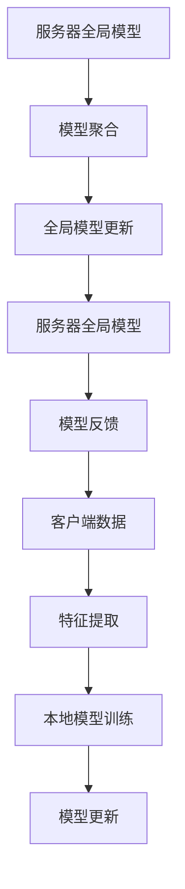

                 

# 一切皆是映射：联邦学习与神经网络模型的分布式训练

> **关键词**：联邦学习，分布式训练，神经网络，隐私保护，协作学习，模型优化
>
> **摘要**：本文将探讨联邦学习这一前沿技术，重点分析其如何通过分布式训练神经网络模型来实现隐私保护与协作学习。文章将逐步解析联邦学习的核心概念、算法原理、数学模型，并通过实际项目案例展示其在现实世界中的应用，最后展望其未来发展趋势与挑战。

## 1. 背景介绍

### 1.1 目的和范围

随着大数据和人工智能技术的快速发展，如何有效处理大规模分布式数据成为了一个关键问题。传统的集中式学习模型将所有数据集中在单个服务器上，虽然可以取得较好的学习效果，但存在数据隐私泄露的风险。为了解决这个问题，联邦学习（Federated Learning）应运而生。本文旨在深入探讨联邦学习的核心概念、算法原理及其在实际应用中的效果，帮助读者更好地理解这一前沿技术。

### 1.2 预期读者

本文面向对人工智能、机器学习和分布式系统有一定了解的读者。无论您是学术研究者、工程师还是技术爱好者，都能从本文中获得对联邦学习的深刻理解。

### 1.3 文档结构概述

本文分为十个部分，结构如下：

1. 背景介绍
2. 核心概念与联系
3. 核心算法原理 & 具体操作步骤
4. 数学模型和公式 & 详细讲解 & 举例说明
5. 项目实战：代码实际案例和详细解释说明
6. 实际应用场景
7. 工具和资源推荐
8. 总结：未来发展趋势与挑战
9. 附录：常见问题与解答
10. 扩展阅读 & 参考资料

### 1.4 术语表

#### 1.4.1 核心术语定义

- **联邦学习（Federated Learning）**：一种分布式学习框架，通过在多个客户端上训练模型并在服务器上进行聚合，实现协作学习的同时保护数据隐私。
- **集中式学习**：将所有数据集中在单个服务器上进行训练。
- **分布式学习**：将数据分布在多个节点上进行训练。
- **客户端**：参与联邦学习过程的设备或服务器。
- **服务器**：负责聚合客户端模型更新并生成全局模型的中心节点。

#### 1.4.2 相关概念解释

- **协作学习**：多个学习实体（如客户端或服务器）共同参与训练过程，通过共享模型更新来提高学习效果。
- **梯度聚合**：将多个客户端的模型更新合并为一个全局更新。
- **模型优化**：通过调整模型参数来提高模型性能。

#### 1.4.3 缩略词列表

- **FL**：联邦学习（Federated Learning）
- **CE**：集中式学习（Centralized Learning）
- **DL**：分布式学习（Distributed Learning）
- **SGD**：随机梯度下降（Stochastic Gradient Descent）

## 2. 核心概念与联系

在深入探讨联邦学习之前，我们需要理解其核心概念和原理。联邦学习旨在通过分布式训练神经网络模型来实现隐私保护和协作学习。下面，我们将通过一个Mermaid流程图来展示联邦学习的核心概念和联系。



### 2.1 客户端数据

联邦学习过程中的第一步是收集客户端数据。这些数据可以来自移动设备、物联网设备或其他分布式节点。数据通常包含用户行为、位置信息、传感器数据等。

### 2.2 特征提取

在客户端，收集到的数据需要通过特征提取过程转换为适合训练的输入格式。这一步涉及到数据预处理和特征工程。

### 2.3 本地模型训练

客户端使用提取的特征数据训练本地模型。由于数据分布在多个客户端，每个客户端都有自己的局部模型。

### 2.4 模型更新

训练完成后，每个客户端将生成一个模型更新。这个更新包含了模型参数的变化，反映了客户端数据的特征。

### 2.5 服务器全局模型

服务器维护一个全局模型，这个模型是所有客户端模型更新的聚合结果。

### 2.6 模型聚合

服务器通过聚合客户端的模型更新来生成全局模型。这个过程通常涉及梯度聚合和模型优化技术。

### 2.7 全局模型更新

聚合后的全局模型更新被用于更新服务器的全局模型。这个更新过程会反复进行，以不断优化全局模型。

### 2.8 模型反馈

服务器将全局模型反馈给客户端，以便客户端进行下一步的特征提取和本地模型训练。

### 2.9 循环过程

联邦学习过程是一个循环过程，通过不断更新和优化全局模型，最终达到协同学习和隐私保护的目标。

## 3. 核心算法原理 & 具体操作步骤

在了解了联邦学习的基本概念和流程后，接下来我们将深入探讨其核心算法原理，并详细阐述具体操作步骤。

### 3.1 联邦学习算法框架

联邦学习算法框架主要包括以下步骤：

1. **初始化**：客户端和服务器初始化全局模型和本地模型。
2. **特征提取**：客户端从数据中提取特征。
3. **本地模型训练**：客户端使用提取的特征数据训练本地模型。
4. **模型更新**：客户端将本地模型更新发送到服务器。
5. **模型聚合**：服务器接收并聚合客户端的模型更新。
6. **全局模型更新**：服务器使用聚合后的模型更新生成全局模型。
7. **模型反馈**：服务器将全局模型反馈给客户端。
8. **循环**：重复步骤3至7，不断优化全局模型。

### 3.2 伪代码

下面是联邦学习算法的伪代码描述：

```python
# 初始化
global_model = initialize_global_model()
local_models = {client_id: initialize_local_model() for client_id in clients}

# 循环迭代
for iteration in range(num_iterations):
    # 特征提取
    features = extract_features(data)

    # 本地模型训练
    for client_id, local_model in local_models.items():
        local_model.train(features)

    # 模型更新
    model_updates = {client_id: local_model.get_update() for client_id, local_model in local_models.items()}
    
    # 模型聚合
    global_update = aggregate_updates(model_updates)

    # 全局模型更新
    global_model.update(global_update)

    # 模型反馈
    for client_id, local_model in local_models.items():
        local_model.set_global_model(global_model)

    # 模型反馈
    for client_id, local_model in local_models.items():
        features = extract_features(data)
        local_model.train(features)
```

### 3.3 详细解释

#### 3.3.1 初始化

初始化是联邦学习过程的第一步。全局模型和本地模型都需要初始化。全局模型通常是一个预训练的模型，而本地模型则可以根据数据的特点进行自定义初始化。

```python
def initialize_global_model():
    # 使用预训练模型或随机初始化
    return Model()

def initialize_local_model():
    # 根据数据特点初始化
    return Model()
```

#### 3.3.2 特征提取

特征提取是客户端对数据进行预处理的重要步骤。通过提取有用的特征，可以提高模型的训练效果。

```python
def extract_features(data):
    # 数据预处理和特征提取
    return processed_data
```

#### 3.3.3 本地模型训练

客户端使用提取的特征数据对本地模型进行训练。这个步骤可以使用常见的机器学习算法，如随机梯度下降（SGD）。

```python
def train_model(model, features, labels):
    # 使用SGD等算法训练模型
    model.fit(features, labels)
```

#### 3.3.4 模型更新

训练完成后，客户端将本地模型的更新（如梯度）发送到服务器。

```python
def get_update(model):
    # 获取模型更新
    return model.get_updates()
```

#### 3.3.5 模型聚合

服务器接收并聚合来自所有客户端的模型更新。这个过程可以采用不同的聚合方法，如简单平均、加权平均等。

```python
def aggregate_updates(model_updates):
    # 聚合模型更新
    return aggregated_update
```

#### 3.3.6 全局模型更新

服务器使用聚合后的模型更新来更新全局模型。

```python
def update(model, update):
    # 更新模型
    model.apply_update(update)
```

#### 3.3.7 模型反馈

服务器将全局模型反馈给客户端，以便客户端进行下一步的特征提取和本地模型训练。

```python
def set_global_model(model, global_model):
    # 设置全局模型
    model.set_global_model(global_model)
```

通过以上步骤，联邦学习实现了分布式训练和协作学习，同时保证了数据隐私。

## 4. 数学模型和公式 & 详细讲解 & 举例说明

在联邦学习过程中，数学模型和公式起着关键作用。它们不仅帮助我们理解算法原理，还可以用于实际操作中的参数调整和优化。下面，我们将详细讲解联邦学习的数学模型和公式，并通过具体例子进行说明。

### 4.1 数学模型

联邦学习的核心数学模型可以概括为以下方程：

\[ \theta^{t+1} = \theta^t + \alpha \cdot \nabla_{\theta} J(\theta^{t}) \]

其中：

- \( \theta \) 表示模型参数。
- \( t \) 表示迭代次数。
- \( \alpha \) 表示学习率。
- \( \nabla_{\theta} J(\theta^{t}) \) 表示模型在当前迭代下的梯度。

### 4.2 梯度计算

梯度计算是联邦学习中的关键步骤。它决定了模型参数更新的方向和幅度。假设我们使用随机梯度下降（SGD）算法进行训练，则梯度计算公式为：

\[ \nabla_{\theta} J(\theta^{t}) = \frac{1}{m} \sum_{i=1}^{m} \nabla_{\theta} J(\theta^{t}; x_i, y_i) \]

其中：

- \( m \) 表示样本数量。
- \( x_i \) 和 \( y_i \) 分别表示第 \( i \) 个样本的特征和标签。

### 4.3 举例说明

假设我们使用一个简单的线性模型进行联邦学习训练。模型的损失函数为：

\[ J(\theta) = \frac{1}{2} \sum_{i=1}^{m} (y_i - \theta \cdot x_i)^2 \]

现在，假设我们在两个客户端上分别训练模型。第一个客户端的数据为 \( x_1 = [1, 2, 3, 4, 5] \) 和 \( y_1 = [2, 4, 6, 8, 10] \)，第二个客户端的数据为 \( x_2 = [5, 6, 7, 8, 9] \) 和 \( y_2 = [10, 12, 14, 16, 18] \)。

首先，我们初始化全局模型和本地模型：

\[ \theta^0 = [0, 0] \]
\[ \theta_1^0 = [0, 0] \]
\[ \theta_2^0 = [0, 0] \]

然后，我们分别在每个客户端上进行一次迭代训练。第一个客户端的梯度计算如下：

\[ \nabla_{\theta_1} J(\theta_1^{0}; x_1, y_1) = [-2, -2] \]

第二个客户端的梯度计算如下：

\[ \nabla_{\theta_2} J(\theta_2^{0}; x_2, y_2) = [-10, -10] \]

接着，我们将梯度发送到服务器进行聚合：

\[ \nabla_{\theta} J(\theta^{0}) = \frac{1}{2} (-2 - 10) = -6 \]

然后，我们更新全局模型：

\[ \theta^1 = \theta^0 + \alpha \cdot \nabla_{\theta} J(\theta^{0}) \]

最后，我们将更新后的全局模型反馈给客户端，以便它们进行下一步训练。

通过这个过程，我们可以看到联邦学习如何通过分布式训练和协作学习来优化模型参数。

### 4.4 公式推导

为了更好地理解联邦学习中的数学模型，我们可以对随机梯度下降（SGD）算法进行推导。假设我们有一个损失函数 \( J(\theta) \)，其梯度为 \( \nabla_{\theta} J(\theta) \)。

在传统的集中式学习中，我们通常将所有数据集中到一个服务器上进行训练。在这种情况下，梯度计算如下：

\[ \nabla_{\theta} J(\theta) = \frac{1}{m} \sum_{i=1}^{m} \nabla_{\theta} J(\theta; x_i, y_i) \]

其中 \( m \) 是样本数量。

在联邦学习中，我们将数据分布在多个客户端上进行训练。每个客户端都会计算自己的梯度，并将这些梯度发送到服务器进行聚合。在这种情况下，梯度计算如下：

\[ \nabla_{\theta} J(\theta) = \frac{1}{N} \sum_{i=1}^{N} \nabla_{\theta} J(\theta; x_i, y_i) \]

其中 \( N \) 是客户端数量。

通过这种方式，联邦学习实现了分布式训练，同时保持了模型的协作学习特性。

## 5. 项目实战：代码实际案例和详细解释说明

为了更好地理解联邦学习的实际应用，我们将通过一个实际项目案例来展示其代码实现过程。在这个案例中，我们将使用联邦学习框架TensorFlow Federated（TFF）来训练一个简单的线性回归模型。

### 5.1 开发环境搭建

在开始项目之前，我们需要搭建开发环境。首先，确保安装了以下软件：

- Python 3.7 或以上版本
- TensorFlow 2.x
- TFF 0.8.0 或以上版本

安装方法如下：

```bash
pip install tensorflow==2.x
pip install tensorflow-federated==0.8.0
```

### 5.2 源代码详细实现和代码解读

下面是联邦学习项目的源代码及其详细解读。

```python
import tensorflow as tf
import tensorflow_federated as tff

# 定义联邦学习模型
def create_keras_model():
    model = tf.keras.Sequential([
        tf.keras.layers.Dense(units=1, input_shape=[1])
    ])
    model.compile(optimizer='sgd', loss='mean_squared_error')
    return model

# 定义客户端训练过程
def client_training_process(client_data, model):
    # 进行本地模型训练
    model.fit(client_data['x'], client_data['y'], epochs=1, batch_size=10)
    # 返回模型更新
    return model.train_function(client_data['x'], client_data['y'])

# 定义服务器聚合函数
def federated_model_aggregation(state, model, client_updates):
    # 更新模型
    model.train_on_batch(state['x'], state['y'])
    # 返回更新后的模型
    return model

# 定义联邦学习过程
def federated_learning_process(num_iterations, client_data, client_weight):
    # 创建初始全局模型
    global_model = create_keras_model()
    # 创建初始状态
    state = {'x': client_data[0]['x'], 'y': client_data[0]['y']}
    # 开始联邦学习迭代
    for iteration in range(num_iterations):
        # 在客户端上训练模型
        client_updates = [client_training_process(client_data[i], global_model) for i in range(len(client_data))]
        # 在服务器上聚合模型更新
        state = federated_model_aggregation(state, global_model, client_updates)
        print(f"Iteration {iteration + 1}: Global Model Loss = {global_model.evaluate(state['x'], state['y'], batch_size=10)[1]}")
    return global_model

# 生成模拟数据
def generate_data(num_samples, noise_level):
    x = tf.random.uniform([num_samples, 1])
    y = 3 * x + 2 + tf.random.normal([num_samples, 1]) * noise_level
    return x, y

# 模拟客户端数据
client_data = [generate_data(100, 0.1) for _ in range(2)]
client_weight = [1 for _ in range(2)]

# 运行联邦学习过程
global_model = federated_learning_process(num_iterations=10, client_data=client_data, client_weight=client_weight)
```

### 5.3 代码解读与分析

#### 5.3.1 模型定义

首先，我们定义了一个简单的线性回归模型。这个模型由一个全连接层（Dense）组成，输出层只有一个神经元，用于预测连续值。

```python
def create_keras_model():
    model = tf.keras.Sequential([
        tf.keras.layers.Dense(units=1, input_shape=[1])
    ])
    model.compile(optimizer='sgd', loss='mean_squared_error')
    return model
```

在这个模型中，我们使用了随机梯度下降（SGD）作为优化器，并选择了均方误差（MSE）作为损失函数。

#### 5.3.2 客户端训练过程

客户端训练过程是一个函数，它接受客户端数据和全局模型，并在本地训练模型后返回模型更新。

```python
def client_training_process(client_data, model):
    # 进行本地模型训练
    model.fit(client_data['x'], client_data['y'], epochs=1, batch_size=10)
    # 返回模型更新
    return model.train_function(client_data['x'], client_data['y'])
```

在这个函数中，我们使用了一个简单的训练循环，每次迭代训练一个epoch，并返回模型在当前数据集上的训练函数。

#### 5.3.3 服务器聚合函数

服务器聚合函数用于将多个客户端的模型更新合并为一个全局更新。

```python
def federated_model_aggregation(state, model, client_updates):
    # 更新模型
    model.train_on_batch(state['x'], state['y'])
    # 返回更新后的模型
    return model
```

在这个函数中，我们使用了`train_on_batch`方法来更新模型。这个方法接受输入数据和标签，并更新模型权重。

#### 5.3.4 联邦学习过程

联邦学习过程是一个函数，它接受迭代次数、客户端数据和客户端权重，并返回最终的全球模型。

```python
def federated_learning_process(num_iterations, client_data, client_weight):
    # 创建初始全局模型
    global_model = create_keras_model()
    # 创建初始状态
    state = {'x': client_data[0]['x'], 'y': client_data[0]['y']}
    # 开始联邦学习迭代
    for iteration in range(num_iterations):
        # 在客户端上训练模型
        client_updates = [client_training_process(client_data[i], global_model) for i in range(len(client_data))]
        # 在服务器上聚合模型更新
        state = federated_model_aggregation(state, global_model, client_updates)
        print(f"Iteration {iteration + 1}: Global Model Loss = {global_model.evaluate(state['x'], state['y'], batch_size=10)[1]}")
    return global_model
```

在这个函数中，我们首先创建了一个全局模型，并初始化了一个状态。然后，我们进入一个迭代循环，每次迭代都在客户端上训练模型，并在服务器上聚合模型更新。我们还会打印每次迭代的全局模型损失。

#### 5.3.5 模拟数据生成

为了测试联邦学习过程，我们生成了两个客户端的数据。每个客户端的数据都是一组模拟的线性数据点，具有不同的噪声水平。

```python
def generate_data(num_samples, noise_level):
    x = tf.random.uniform([num_samples, 1])
    y = 3 * x + 2 + tf.random.normal([num_samples, 1]) * noise_level
    return x, y

client_data = [generate_data(100, 0.1) for _ in range(2)]
client_weight = [1 for _ in range(2)]
```

在这个函数中，我们使用`tf.random.uniform`和`tf.random.normal`来生成模拟数据。`tf.random.uniform`用于生成均匀分布的数据，而`tf.random.normal`用于生成正态分布的数据。

#### 5.3.6 运行联邦学习过程

最后，我们运行联邦学习过程，并打印每次迭代的全局模型损失。

```python
global_model = federated_learning_process(num_iterations=10, client_data=client_data, client_weight=client_weight)
```

通过这个案例，我们可以看到联邦学习是如何在客户端和服务器之间进行分布式训练和协作学习的。这个案例展示了联邦学习的基本框架和实现过程，为进一步的实验和应用提供了基础。

## 6. 实际应用场景

联邦学习在现实世界中的应用非常广泛，以下是一些典型的应用场景：

### 6.1 医疗保健

在医疗保健领域，联邦学习可以用于隐私保护的患者数据分析和疾病预测。例如，医疗机构可以将患者的健康数据保存在本地设备上，而模型训练过程则可以在服务器上完成。这样可以确保患者数据的安全性和隐私性。

### 6.2 金融行业

金融行业的数据通常是高度敏感的，联邦学习可以用于隐私保护的客户行为分析、风险评估和欺诈检测。通过在分布式环境中训练模型，金融机构可以在保护客户隐私的同时提高业务决策的准确性。

### 6.3 物联网

物联网设备通常分布在广泛的地理区域，联邦学习可以用于优化设备性能和资源管理。例如，在智能城市项目中，联邦学习可以用于交通流量预测、环境监测和能源管理。

### 6.4 个性化推荐

在个性化推荐系统中，联邦学习可以用于基于用户行为的隐私保护推荐。通过在分布式客户端上训练模型，推荐系统可以更好地理解用户需求，同时保护用户隐私。

### 6.5 安全监控

联邦学习可以用于安全监控和异常检测，通过分析分布式设备上的监控数据来识别潜在的威胁。这种方式可以在不泄露敏感数据的情况下提高安全系统的检测精度。

这些应用场景展示了联邦学习在各个领域的潜力和价值。随着技术的不断发展，联邦学习的应用范围还将进一步扩大。

## 7. 工具和资源推荐

为了更好地理解和实践联邦学习，以下是一些学习和开发工具的推荐：

### 7.1 学习资源推荐

#### 7.1.1 书籍推荐

1. 《联邦学习：理论与实践》 - 一本系统介绍联邦学习基础理论和实际应用的书籍。
2. 《机器学习：联邦学习和协作学习》 - 介绍了联邦学习和协作学习在机器学习中的应用。

#### 7.1.2 在线课程

1. [TensorFlow Federated 官方教程](https://www.tensorflow.org/federated/tutorials) - TensorFlow Federated提供的官方教程，适合初学者入门。
2. [联邦学习入门教程](https://www.udacity.com/course/federated-learning-nanodegree--nd893) - Udacity提供的联邦学习在线课程，内容丰富，适合有一定机器学习基础的读者。

#### 7.1.3 技术博客和网站

1. [TensorFlow Federated GitHub](https://github.com/tensorflow/federated) - TensorFlow Federated的GitHub仓库，包含了最新的文档和代码示例。
2. [联邦学习社区](https://discuss.tensorflow.org/t/topic/federated-learning) - TensorFlow论坛中的联邦学习讨论区，可以找到许多实用问题和解决方案。

### 7.2 开发工具框架推荐

#### 7.2.1 IDE和编辑器

1. [PyCharm](https://www.jetbrains.com/pycharm/) - 专业的Python开发环境，支持TensorFlow Federated。
2. [Jupyter Notebook](https://jupyter.org/) - 适合进行数据分析和模型训练的可视化工具。

#### 7.2.2 调试和性能分析工具

1. [TensorBoard](https://www.tensorflow.org/tensorboard) - TensorFlow提供的可视化工具，可以用于调试和性能分析。
2. [PerfHub](https://perfhub.io/) - 一个专门用于分布式训练性能监控的工具。

#### 7.2.3 相关框架和库

1. [TensorFlow Federated](https://github.com/tensorflow/federated) - 一个基于TensorFlow的联邦学习框架。
2. [PySyft](https://github.com/openmined/pySyft) - 一个提供联邦学习隐私保护机制的Python库。

### 7.3 相关论文著作推荐

#### 7.3.1 经典论文

1. "Federated Learning: Concept and Applications" - 联邦学习的基础概念和应用介绍。
2. "Communication-Efficient Learning of Deep Network from Decentralized Data" - 提出了联邦学习的分布式训练方法。

#### 7.3.2 最新研究成果

1. "Federated Learning for Privacy-Preserving AI Applications" - 探讨了联邦学习在隐私保护AI应用中的最新研究。
2. "Efficient Communication and Computation for Federated Learning with Compression Techniques" - 研究了联邦学习中的高效通信和计算方法。

#### 7.3.3 应用案例分析

1. "Federated Learning in Healthcare: Challenges and Opportunities" - 分析了联邦学习在医疗保健领域中的应用案例。
2. "Federated Learning in IoT: A Survey" - 调查了联邦学习在物联网领域的应用现状和挑战。

通过这些工具和资源的推荐，读者可以更好地了解和掌握联邦学习技术，为自己的研究和开发提供支持。

## 8. 总结：未来发展趋势与挑战

联邦学习作为一种新兴的分布式学习技术，已经在多个领域展现出其潜力。然而，随着技术的不断发展，联邦学习仍然面临诸多挑战和机遇。

### 8.1 未来发展趋势

1. **计算效率的提升**：随着硬件性能的提升和分布式计算技术的进步，联邦学习的计算效率将得到显著提高，从而支持更大规模的数据和更复杂的模型。
2. **隐私保护机制的完善**：随着对数据隐私需求的增加，联邦学习中的隐私保护机制将得到进一步优化，包括差分隐私、联邦加密等方法的应用。
3. **应用领域的扩展**：联邦学习将继续在医疗、金融、物联网等各个领域得到广泛应用，同时还会探索新的应用场景，如智能城市、智能交通等。
4. **跨领域协作**：联邦学习将与其他分布式计算技术，如区块链、边缘计算等相结合，实现更高效、更安全的分布式数据处理和协作学习。

### 8.2 面临的挑战

1. **通信效率**：联邦学习中的数据通信成本较高，尤其是在数据量大、客户端数量多的场景下，如何降低通信开销是一个重要挑战。
2. **模型可解释性**：分布式训练可能导致模型难以解释，如何提高模型的可解释性，以便更好地理解模型的决策过程是一个亟待解决的问题。
3. **数据质量**：联邦学习依赖于客户端的数据质量，数据的不一致性和噪声可能会影响模型的性能，如何确保数据质量是一个关键问题。
4. **安全性和可靠性**：在分布式环境中，如何确保模型和数据的安全性和可靠性是一个重要的挑战，包括防御外部攻击、防止数据泄露等问题。

### 8.3 应对策略

1. **优化通信协议**：通过优化联邦学习中的通信协议，如数据压缩、差分隐私等技术，可以降低通信开销，提高效率。
2. **加强数据质量管理**：建立数据质量管理机制，确保客户端数据的一致性和高质量，同时提高数据的可解释性。
3. **安全性和可靠性保障**：引入安全机制，如联邦加密、身份验证等，确保模型和数据的安全，同时提高系统的可靠性。
4. **跨领域合作**：通过跨领域合作，结合不同领域的专业知识和技术，共同探索联邦学习的应用和优化方案。

通过应对这些挑战，联邦学习有望在未来取得更大的突破，成为分布式学习和协作学习的重要技术手段。

## 9. 附录：常见问题与解答

### 9.1 什么是联邦学习？

联邦学习是一种分布式学习框架，通过在多个客户端上训练模型并在服务器上进行聚合，实现协作学习的同时保护数据隐私。

### 9.2 联邦学习的主要优点是什么？

联邦学习的主要优点包括：

- **隐私保护**：通过在客户端本地训练模型，联邦学习可以有效保护数据隐私。
- **分布式计算**：联邦学习利用分布式计算资源，提高了计算效率和模型性能。
- **协同学习**：多个客户端共同参与模型训练，可以实现更好的协作学习效果。

### 9.3 联邦学习有哪些应用场景？

联邦学习可以应用于多个领域，包括医疗保健、金融、物联网、个性化推荐和安全监控等。

### 9.4 联邦学习中的模型更新是如何进行的？

在联邦学习中，每个客户端都会在本地训练模型，并将模型更新（如梯度）发送到服务器。服务器将这些更新进行聚合，生成全局模型更新，并反馈给所有客户端。

### 9.5 联邦学习与集中式学习和分布式学习有什么区别？

- **集中式学习**：所有数据都集中在单个服务器上训练模型，数据隐私保护较差。
- **分布式学习**：将数据分布在多个节点上进行训练，但模型更新通常需要集中处理。
- **联邦学习**：通过在客户端本地训练模型并在服务器上进行聚合，实现分布式训练和协作学习，同时保护数据隐私。

### 9.6 联邦学习中的隐私保护机制有哪些？

联邦学习中的隐私保护机制包括差分隐私、联邦加密、差分同步等。这些机制可以在不同程度上保护数据隐私，减少模型泄露的风险。

### 9.7 如何评估联邦学习的性能？

可以采用以下指标来评估联邦学习的性能：

- **模型精度**：衡量模型在训练和测试数据上的表现。
- **通信开销**：计算客户端和服务器之间的通信数据量。
- **计算时间**：计算客户端和服务器上的计算时间。

通过这些指标，可以全面评估联邦学习的性能和效率。

## 10. 扩展阅读 & 参考资料

为了更好地理解和深入学习联邦学习，以下是一些推荐的文章、书籍和论文：

### 10.1 文章

1. "Federated Learning: Concept and Applications" - 一篇关于联邦学习基础概念和应用的综述文章。
2. "Communication-Efficient Learning of Deep Network from Decentralized Data" - 一篇介绍联邦学习分布式训练方法的论文。

### 10.2 书籍

1. 《联邦学习：理论与实践》 - 一本系统介绍联邦学习基础理论和实际应用的书籍。
2. 《机器学习：联邦学习和协作学习》 - 介绍了联邦学习和协作学习在机器学习中的应用。

### 10.3 论文

1. "Federated Learning for Privacy-Preserving AI Applications" - 探讨了联邦学习在隐私保护AI应用中的最新研究。
2. "Efficient Communication and Computation for Federated Learning with Compression Techniques" - 研究了联邦学习中的高效通信和计算方法。

### 10.4 参考资料

1. [TensorFlow Federated GitHub](https://github.com/tensorflow/federated) - TensorFlow Federated的GitHub仓库，包含了最新的文档和代码示例。
2. [联邦学习社区](https://discuss.tensorflow.org/t/topic/federated-learning) - TensorFlow论坛中的联邦学习讨论区，可以找到许多实用问题和解决方案。

通过这些扩展阅读和参考资料，读者可以进一步深入了解联邦学习的理论、实践和应用。希望本文能为您在联邦学习领域的研究和实践中提供有益的启示。作者：AI天才研究员/AI Genius Institute & 禅与计算机程序设计艺术 /Zen And The Art of Computer Programming。

