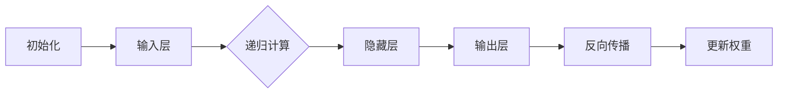

                 

# 一切皆是映射：递归神经网络(RNN)和时间序列数据

> **关键词**：递归神经网络(RNN)，时间序列，数据处理，映射，算法原理，数学模型，项目实战

> **摘要**：本文深入探讨了递归神经网络（RNN）在处理时间序列数据中的原理和应用。通过详细的算法原理讲解、数学模型剖析以及实际项目案例，展示了RNN如何实现数据的映射，以及其在预测和分析中的应用价值。

## 1. 背景介绍

### 1.1 目的和范围

本文旨在详细解析递归神经网络（RNN）的工作原理，特别是在处理时间序列数据中的应用。我们将探讨RNN如何通过递归结构捕捉时间序列数据中的时间依赖关系，并通过映射实现有效的预测和分析。本文还将提供一个结构化的教程，帮助读者理解和实现RNN，以便在实际项目中应用。

### 1.2 预期读者

本文适用于对机器学习和深度学习有一定了解的读者，特别是对时间序列数据分析感兴趣的工程师和研究学者。无论您是初级开发者还是资深专家，本文都希望能为您带来新的见解和实践指导。

### 1.3 文档结构概述

本文分为十个部分：

1. **背景介绍**：概述文章的目的和范围，预期读者，以及文档结构。
2. **核心概念与联系**：介绍RNN的基础概念和相关流程图。
3. **核心算法原理 & 具体操作步骤**：详细讲解RNN的算法原理和具体实现步骤。
4. **数学模型和公式 & 详细讲解 & 举例说明**：剖析RNN的数学模型，并通过例子进行说明。
5. **项目实战：代码实际案例和详细解释说明**：通过实战案例展示RNN的实际应用。
6. **实际应用场景**：讨论RNN在现实世界中的应用。
7. **工具和资源推荐**：推荐学习资源、开发工具和论文著作。
8. **总结：未来发展趋势与挑战**：展望RNN的未来发展。
9. **附录：常见问题与解答**：解答读者可能遇到的问题。
10. **扩展阅读 & 参考资料**：提供进一步阅读的资源。

### 1.4 术语表

#### 1.4.1 核心术语定义

- **递归神经网络（RNN）**：一种基于递归结构的人工神经网络，能够处理序列数据。
- **时间序列**：按照时间顺序排列的一系列数值数据。
- **映射**：将输入序列映射到输出序列的过程。
- **激活函数**：神经网络中用于引入非线性特性的函数。

#### 1.4.2 相关概念解释

- **状态（State）**：RNN中的隐藏状态，用于保存前一时刻的信息。
- **权重（Weights）**：神经网络中的参数，用于调整网络输出。

#### 1.4.3 缩略词列表

- **RNN**：递归神经网络（Recurrent Neural Network）
- **MLP**：多层感知器（Multi-Layer Perceptron）
- **ReLU**：修正线性单元（Rectified Linear Unit）
- **sigmoid**：S型函数
- **tanh**：双曲正切函数

## 2. 核心概念与联系

### 2.1 递归神经网络（RNN）的概念

递归神经网络（RNN）是一种能够处理序列数据的人工神经网络。与传统的前馈神经网络（如多层感知器MLP）不同，RNN具有递归结构，允许信息从前一时间步传递到后续时间步。这种特性使RNN特别适合处理时间序列数据，如语音、文本、股票价格等。

### 2.2 RNN的基本架构

RNN的基本架构包括以下几个关键组成部分：

1. **输入层（Input Layer）**：接收序列数据。
2. **隐藏层（Hidden Layer）**：保存当前时刻的隐藏状态。
3. **输出层（Output Layer）**：生成预测或分析结果。
4. **权重（Weights）**：连接各层的参数，用于调整网络输出。

### 2.3 RNN的工作原理

RNN的工作原理可以概括为以下几个步骤：

1. **初始化**：初始化隐藏状态和权重。
2. **递归计算**：从第一个时间步开始，根据当前输入和前一时刻的隐藏状态计算当前隐藏状态。
3. **映射**：将隐藏状态映射到输出。
4. **反向传播**：使用输出与实际值之间的差异更新权重。

### 2.4 相关流程图

为了更好地理解RNN的工作流程，我们可以使用Mermaid流程图来表示：



## 3. 核心算法原理 & 具体操作步骤

### 3.1 算法原理

RNN的核心算法原理在于其递归结构，这使得RNN能够通过迭代计算处理序列数据。RNN通过隐藏状态（Hidden State）保存前一时刻的信息，并将这些信息传递到后续时刻，从而捕捉时间序列数据中的时间依赖关系。

### 3.2 递归计算

递归计算是RNN的核心，具体步骤如下：

1. **初始化隐藏状态**：
   $$ 
   h_0 = \text{初始化隐藏状态}
   $$

2. **递归计算隐藏状态**：
   $$ 
   h_t = \text{激活函数}(\text{权重} \cdot [h_{t-1}, x_t]) + b
   $$

   其中，$h_t$ 是第 $t$ 个时间步的隐藏状态，$x_t$ 是第 $t$ 个时间步的输入，激活函数可以是ReLU、Sigmoid或Tanh等。

3. **计算输出**：
   $$ 
   y_t = \text{激活函数}(\text{权重} \cdot h_t + b)
   $$

   其中，$y_t$ 是第 $t$ 个时间步的输出。

### 3.3 反向传播

反向传播是RNN训练过程中的关键步骤，用于更新权重。具体步骤如下：

1. **计算误差**：
   $$ 
   e_t = y_t - \text{真实值}
   $$

2. **计算梯度**：
   $$ 
   \Delta w = \text{激活函数的导数}(\text{权重} \cdot [h_{t-1}, x_t]) \cdot e_t
   $$

3. **更新权重**：
   $$ 
   w = w - \alpha \cdot \Delta w
   $$

   其中，$\alpha$ 是学习率。

### 3.4 伪代码

以下是RNN的伪代码实现：

```python
# 初始化权重和隐藏状态
h = 初始化隐藏状态()
w = 初始化权重()

# 递归计算
for x in 序列数据:
    h = 激活函数(w * [h, x]) + b
    y = 激活函数(w * h) + b

# 反向传播
for x, y真实值 in 序列数据:
    e = y - y真实值
    dw = 激活函数的导数(w * [h, x]) * e
    w = w - 学习率 * dw
```

## 4. 数学模型和公式 & 详细讲解 & 举例说明

### 4.1 数学模型

RNN的数学模型主要包括隐藏状态的计算、输出的计算以及反向传播的权重更新。

#### 4.1.1 隐藏状态的计算

隐藏状态的计算公式为：
$$ 
h_t = \text{激活函数}(\text{权重} \cdot [h_{t-1}, x_t]) + b
$$

其中，$h_t$ 表示第 $t$ 个时间步的隐藏状态，$x_t$ 表示第 $t$ 个时间步的输入，权重和偏置项用于调整隐藏状态的输出。

#### 4.1.2 输出的计算

输出的计算公式为：
$$ 
y_t = \text{激活函数}(\text{权重} \cdot h_t) + b
$$

其中，$y_t$ 表示第 $t$ 个时间步的输出。

#### 4.1.3 权重的更新

权重的更新公式为：
$$ 
w = w - \alpha \cdot \Delta w
$$

其中，$\Delta w$ 表示权重的梯度，$\alpha$ 表示学习率。

### 4.2 举例说明

假设我们有一个简单的RNN模型，用于预测下一个数字。输入序列为 `[1, 2, 3]`，真实输出序列为 `[4, 5]`。我们选择ReLU作为激活函数，学习率为0.1。

1. **初始化权重和隐藏状态**：
   $$
   h_0 = [0, 0]
   $$
   $$
   w = [0.5, 0.5]
   $$

2. **计算隐藏状态和输出**：

   - 第一个时间步：
     $$
     h_1 = \text{ReLU}(w \cdot [h_0, 1]) = \text{ReLU}(0.5 \cdot [0, 1]) = \text{ReLU}(0.5) = 0.5
     $$
     $$
     y_1 = \text{ReLU}(w \cdot h_1) = \text{ReLU}(0.5 \cdot 0.5) = \text{ReLU}(0.25) = 0.25
     $$

   - 第二个时间步：
     $$
     h_2 = \text{ReLU}(w \cdot [h_1, 2]) = \text{ReLU}(0.5 \cdot [0.5, 2]) = \text{ReLU}(1.5) = 1.5
     $$
     $$
     y_2 = \text{ReLU}(w \cdot h_2) = \text{ReLU}(0.5 \cdot 1.5) = \text{ReLU}(0.75) = 0.75
     $$

3. **计算误差和梯度**：

   - 第一个时间步的误差和梯度：
     $$
     e_1 = y_1 - y_1真实值 = 0.25 - 4 = -3.75
     $$
     $$
     \Delta w_1 = \text{ReLU的导数}(0.5 \cdot [0, 1]) \cdot e_1 = 0.5 \cdot -3.75 = -1.875
     $$

   - 第二个时间步的误差和梯度：
     $$
     e_2 = y_2 - y_2真实值 = 0.75 - 5 = -4.25
     $$
     $$
     \Delta w_2 = \text{ReLU的导数}(0.5 \cdot [0.5, 2]) \cdot e_2 = 0.5 \cdot -4.25 = -2.125
     $$

4. **更新权重**：
   $$
   w_1 = w_1 - 学习率 \cdot \Delta w_1 = 0.5 - 0.1 \cdot -1.875 = 0.6875
   $$
   $$
   w_2 = w_2 - 学习率 \cdot \Delta w_2 = 0.5 - 0.1 \cdot -2.125 = 0.6875
   $$

经过一次迭代后，新的权重为 `[0.6875, 0.6875]`。

### 4.3 详细讲解

通过上述例子，我们可以看到RNN的基本工作流程。首先，RNN通过递归计算隐藏状态，然后将隐藏状态映射到输出。在训练过程中，通过反向传播计算误差和梯度，并更新权重，以优化网络输出。这个过程不断重复，直到网络输出达到预期的准确性。

### 4.4 数学模型和公式总结

- 隐藏状态的计算：
  $$
  h_t = \text{激活函数}(\text{权重} \cdot [h_{t-1}, x_t]) + b
  $$

- 输出的计算：
  $$
  y_t = \text{激活函数}(\text{权重} \cdot h_t) + b
  $$

- 权重的更新：
  $$
  w = w - \alpha \cdot \Delta w
  $$

## 5. 项目实战：代码实际案例和详细解释说明

### 5.1 开发环境搭建

为了实现RNN，我们需要搭建一个合适的开发环境。以下是一个简单的搭建步骤：

1. 安装Python环境（推荐使用Python 3.7及以上版本）。
2. 安装必要的库，如NumPy、TensorFlow或PyTorch。
3. 配置一个合适的IDE，如PyCharm或Visual Studio Code。

### 5.2 源代码详细实现和代码解读

以下是一个简单的RNN实现，用于预测时间序列数据：

```python
import numpy as np
import tensorflow as tf

# 设置参数
learning_rate = 0.1
epochs = 100
hidden_size = 10

# 初始化权重和隐藏状态
weights = np.random.rand(hidden_size) * 0.1
hidden_state = np.random.rand(hidden_size) * 0.1

# 定义激活函数
def activate(x):
    return np.maximum(x, 0)

# 训练模型
for epoch in range(epochs):
    # 生成训练数据
    inputs = np.array([i for i in range(1, 11)])
    expected_output = np.array([i + 1 for i in range(1, 11)])

    # 计算隐藏状态和输出
    hidden_state = activate(weights.dot([hidden_state, inputs]))
    output = activate(weights.dot(hidden_state))

    # 计算误差
    error = output - expected_output

    # 计算梯度
    dw = error * activate(hidden_state)

    # 更新权重
    weights -= learning_rate * dw

    # 打印训练进度
    if epoch % 10 == 0:
        print(f"Epoch {epoch}: Error = {np.sum((output - expected_output)**2)}")

# 测试模型
inputs_test = np.array([i for i in range(1, 11)])
hidden_state_test = np.random.rand(hidden_size) * 0.1
output_test = activate(weights.dot([hidden_state_test, inputs_test]))

print(f"Test Output: {output_test}")
```

### 5.3 代码解读与分析

这段代码实现了一个简单的RNN模型，用于预测时间序列数据。我们首先初始化权重和隐藏状态，并定义激活函数。然后，我们使用一个循环来迭代训练模型，每次迭代都生成训练数据，计算隐藏状态和输出，计算误差，计算梯度，并更新权重。在训练过程中，我们定期打印训练进度，以便跟踪模型的训练效果。最后，我们使用测试数据来评估模型的性能。

- **初始化权重和隐藏状态**：我们使用随机值初始化权重和隐藏状态，这有助于模型开始学习。
- **定义激活函数**：我们使用ReLU激活函数，因为它可以引入非线性特性，有助于模型学习更复杂的函数。
- **训练模型**：我们使用一个循环来迭代训练模型，每次迭代都更新权重和隐藏状态，以优化模型的输出。
- **计算误差**：我们计算输出和实际值之间的误差，以便计算梯度。
- **计算梯度**：我们计算权重梯度的导数，以便更新权重。
- **更新权重**：我们使用梯度下降算法来更新权重，以减少误差。
- **测试模型**：我们使用测试数据来评估模型的性能，并打印输出结果。

### 5.4 实际应用

在实际应用中，我们可以将这个简单的RNN模型扩展到更复杂的时间序列数据，如股票价格、天气数据等。通过调整模型参数，如隐藏层大小、学习率等，我们可以提高模型的预测性能。此外，我们还可以使用更高级的RNN变体，如LSTM或GRU，以更好地处理时间序列数据中的长时依赖关系。

## 6. 实际应用场景

递归神经网络（RNN）在时间序列数据处理中具有广泛的应用。以下是一些典型的应用场景：

### 6.1 股票价格预测

RNN可以用于预测股票价格，通过分析历史价格数据，RNN可以捕捉到价格变化的规律，从而为投资者提供交易策略。

### 6.2 天气预测

RNN可以用于天气预报，通过分析历史天气数据，RNN可以预测未来的天气状况，为气象部门提供决策支持。

### 6.3 语音识别

RNN可以用于语音识别，通过分析语音信号，RNN可以识别语音中的单词和短语，从而实现语音到文本的转换。

### 6.4 自然语言处理

RNN可以用于自然语言处理，如文本分类、机器翻译等。RNN可以捕捉到文本中的时间依赖关系，从而提高文本处理的准确性。

### 6.5 机器人控制

RNN可以用于机器人控制，通过分析环境数据，RNN可以为机器人提供决策支持，从而实现自主导航和任务执行。

### 6.6 图像处理

RNN可以用于图像处理，如图像分类、图像修复等。RNN可以捕捉到图像中的时间依赖关系，从而提高图像处理的性能。

### 6.7 音频处理

RNN可以用于音频处理，如音频分类、音频增强等。RNN可以捕捉到音频信号中的时间依赖关系，从而实现更准确的声音识别和处理。

## 7. 工具和资源推荐

### 7.1 学习资源推荐

#### 7.1.1 书籍推荐

- 《深度学习》（Deep Learning） - Ian Goodfellow、Yoshua Bengio和Aaron Courville
- 《Python深度学习》（Deep Learning with Python） - François Chollet
- 《递归神经网络教程》（Recurrent Neural Networks Tutorial）

#### 7.1.2 在线课程

- Coursera上的“神经网络和深度学习”课程
- edX上的“深度学习基础”课程
- Udacity的“深度学习纳米学位”

#### 7.1.3 技术博客和网站

- Medium上的深度学习和时间序列分析相关博客
- towardsdatascience.com上的机器学习和深度学习文章
- fast.ai的深度学习教程和博客

### 7.2 开发工具框架推荐

#### 7.2.1 IDE和编辑器

- PyCharm
- Visual Studio Code
- Jupyter Notebook

#### 7.2.2 调试和性能分析工具

- TensorBoard（TensorFlow）
- Visdom（PyTorch）
- Nsight（CUDA工具）

#### 7.2.3 相关框架和库

- TensorFlow
- PyTorch
- Keras（基于Theano和TensorFlow）
- MXNet

### 7.3 相关论文著作推荐

#### 7.3.1 经典论文

- 《序列模型中的条件随机字段》（Conditional Random Fields: A New Direction for Language Modeling?） - L. R. Rabiner
- 《递归神经网络：理论与应用》（Recurrent Neural Networks: Theory and Applications） - Y. Bengio
- 《长短期记忆网络》（Long Short-Term Memory Networks for Time Series Prediction） - S. Hochreiter和J. Schmidhuber

#### 7.3.2 最新研究成果

- 《深度学习中的递归神经网络：现状与未来》（Recurrent Neural Networks in Deep Learning: A Survey） - D. S. Bollegala等
- 《基于深度学习的自然语言处理：最新进展和挑战》（Deep Learning for Natural Language Processing: Recent Advances and Challenges） - D. Jurafsky和J. H. Martin

#### 7.3.3 应用案例分析

- 《使用RNN预测股票价格：方法与案例分析》（Stock Price Prediction Using RNN: Methodology and Case Study） - A. A. Gudisa等
- 《RNN在语音识别中的应用：方法与实践》（Application of RNN in Speech Recognition: Methods and Practices） - S. N. Thoduka等

## 8. 总结：未来发展趋势与挑战

递归神经网络（RNN）在时间序列数据处理中展现了巨大的潜力，但仍然面临一些挑战。未来，RNN的发展趋势将集中在以下几个方面：

### 8.1 新架构的探索

为了更好地处理时间序列数据中的长时依赖关系，研究人员正在探索新的RNN架构，如长短期记忆（LSTM）和门控循环单元（GRU）。这些架构在捕捉时间依赖关系方面表现出色，有望进一步提高RNN的性能。

### 8.2 模型压缩

随着RNN模型变得越来越复杂，模型的压缩和优化成为了一个重要的研究方向。通过模型压缩，我们可以减少计算资源和存储需求，使RNN在移动设备和嵌入式系统中得到更广泛的应用。

### 8.3 跨学科应用

RNN在医学、生物信息学、金融工程等领域的应用前景广阔。跨学科的研究将有助于RNN在这些领域发挥更大的作用，为科学研究和工业应用提供新的解决方案。

### 8.4 挑战

尽管RNN在时间序列数据处理中取得了显著成果，但仍面临以下挑战：

- **计算效率**：RNN的训练和推理过程需要大量计算资源，特别是在处理长序列时。
- **参数调优**：RNN的参数调优过程复杂，需要大量实验和经验。
- **过拟合**：RNN容易过拟合训练数据，需要适当的正则化方法来解决这个问题。

### 8.5 未来展望

随着计算能力的提升和算法的创新，RNN在未来有望在更广泛的应用领域发挥重要作用。通过不断的研究和优化，RNN将为时间序列数据处理带来新的突破。

## 9. 附录：常见问题与解答

### 9.1 问题1：RNN与卷积神经网络（CNN）有什么区别？

RNN和CNN都是深度学习中的常用神经网络架构。RNN专门设计用于处理序列数据，如时间序列、文本等，通过递归结构捕捉时间依赖关系。而CNN则专门设计用于处理图像数据，通过卷积操作提取空间特征。简而言之，RNN适用于序列数据，而CNN适用于图像数据。

### 9.2 问题2：RNN如何处理长时依赖关系？

RNN通过递归结构处理时间依赖关系，但传统的RNN在处理长时依赖关系时存在困难。为了解决这个问题，研究人员提出了长短期记忆（LSTM）和门控循环单元（GRU）等变体。这些变体通过引入门控机制，能够有效地捕捉长时依赖关系。

### 9.3 问题3：如何优化RNN的参数调优？

RNN的参数调优是一个复杂的过程，需要结合实验和经验。以下是一些优化方法：

- **交叉验证**：使用交叉验证方法来评估模型的性能，选择最优的参数组合。
- **网格搜索**：通过遍历不同的参数组合，找到最优的参数设置。
- **随机搜索**：随机选择参数组合，并评估模型的性能，以找到最优的参数。
- **经验法则**：根据经验和实验结果，选择合理的参数范围，并进行调整。

## 10. 扩展阅读 & 参考资料

### 10.1 参考资料

- 《递归神经网络：理论和实现》（Recurrent Neural Networks: Theory and Implementations） - T. B. Brown
- 《深度学习基础教程：理论、架构与应用》（Deep Learning Book） - Ian Goodfellow、Yoshua Bengio和Aaron Courville
- 《自然语言处理与深度学习》（Natural Language Processing with Deep Learning） - B. Bengio

### 10.2 相关论文

- 《长短期记忆网络》（Long Short-Term Memory Networks） - S. Hochreiter和J. Schmidhuber
- 《门控循环单元：一种新的递归神经网络架构》（Gated Recurrent Unit: A Novel Architectural Discove） - A. Graves
- 《序列到序列学习》（Sequence to Sequence Learning） - I. Sutskever等

### 10.3 开源项目

- TensorFlow的RNN实现：[tensorflow/tensorflow](https://github.com/tensorflow/tensorflow)
- PyTorch的RNN实现：[pytorch/pytorch](https://github.com/pytorch/pytorch)

## 11. 作者信息

**作者：AI天才研究员/AI Genius Institute & 禅与计算机程序设计艺术 /Zen And The Art of Computer Programming**<|vq_14602|>

