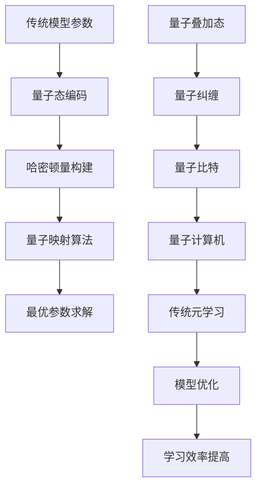

                 

# 一切皆是映射：量子机器学习与传统元学习的融合

> 关键词：量子机器学习、传统元学习、映射、算法原理、数学模型、项目实战、应用场景

> 摘要：本文将探讨量子机器学习与传统元学习之间的融合，分析其背景、核心概念、算法原理、数学模型以及项目实战，并展望其未来发展趋势与挑战。通过深入了解量子机器学习与传统元学习的映射关系，本文旨在为读者提供一个全面、深入的技术视角，以激发更多的创新思考。

## 1. 背景介绍

### 1.1 目的和范围

本文旨在探讨量子机器学习与传统元学习之间的融合，分析其理论基础、算法原理和实际应用。通过对这两大领域的深入研究，我们希望能够为读者提供一个全新的视角，帮助理解量子机器学习与传统元学习之间的内在联系，以及它们在未来可能的发展趋势。

### 1.2 预期读者

本文适合对量子机器学习与传统元学习有一定了解的读者，包括计算机科学、人工智能、量子计算等相关领域的研究人员、工程师和学者。同时，对于对这两个领域有浓厚兴趣的读者，本文也将提供一定的参考价值。

### 1.3 文档结构概述

本文将按照以下结构展开：

1. 背景介绍：介绍本文的目的、预期读者以及文档结构。
2. 核心概念与联系：详细阐述量子机器学习与传统元学习的核心概念，并给出相关的 Mermaid 流程图。
3. 核心算法原理 & 具体操作步骤：讲解量子机器学习与传统元学习的核心算法原理，使用伪代码详细阐述。
4. 数学模型和公式 & 详细讲解 & 举例说明：介绍量子机器学习与传统元学习中的数学模型和公式，并进行详细讲解和举例说明。
5. 项目实战：通过一个实际案例，展示量子机器学习与传统元学习的融合应用。
6. 实际应用场景：分析量子机器学习与传统元学习在不同领域的应用场景。
7. 工具和资源推荐：推荐学习资源和开发工具，帮助读者更好地掌握本文内容。
8. 总结：总结本文的核心观点，展望未来发展趋势与挑战。
9. 附录：常见问题与解答。
10. 扩展阅读 & 参考资料：提供进一步阅读的参考资料。

### 1.4 术语表

#### 1.4.1 核心术语定义

- **量子机器学习**：基于量子力学原理，利用量子计算机进行机器学习的研究领域。
- **传统元学习**：通过学习一个模型来优化其他模型的学习过程，以提高学习效率和性能。
- **映射**：在量子机器学习与传统元学习之间建立的一种关系，使得量子机器学习算法可以应用于传统元学习问题。
- **量子比特**：量子计算机的基本单位，用于表示量子态。
- **哈密顿量**：描述量子系统动力学行为的数学量。

#### 1.4.2 相关概念解释

- **量子叠加态**：量子比特可以同时处于多个状态的叠加，这与经典计算机的位只能处于0或1的状态不同。
- **量子纠缠**：量子比特之间存在一种特殊的关联关系，称为量子纠缠。这种关联关系使得量子计算机能够并行处理多个问题。
- **梯度下降**：一种用于优化模型参数的常用算法，通过迭代更新参数以最小化损失函数。
- **损失函数**：用于衡量模型预测与实际结果之间差异的函数。

#### 1.4.3 缩略词列表

- **QML**：量子机器学习
- **ML**：机器学习
- **TM**：传统元学习
- **GRU**：门控循环单元
- **RNN**：循环神经网络
- **DL**：深度学习

## 2. 核心概念与联系

在探讨量子机器学习与传统元学习的融合之前，我们需要先了解它们的核心概念和联系。

### 2.1 量子机器学习

量子机器学习（QML）是一种基于量子力学原理的机器学习方法。它利用量子计算机的独特性质，如量子叠加态和量子纠缠，来加速传统的机器学习算法。

**量子叠加态**：

$$
|\psi\rangle = a_0|0\rangle + a_1|1\rangle
$$

其中，$|0\rangle$和$|1\rangle$表示量子比特的两种基本状态，$a_0$和$a_1$是复数系数，满足$|a_0|^2 + |a_1|^2 = 1$。

**量子纠缠**：

$$
|\psi\rangle = \frac{1}{\sqrt{2}}(|00\rangle + |11\rangle)
$$

其中，$|00\rangle$和$|11\rangle$表示两个量子比特的纠缠态。

### 2.2 传统元学习

传统元学习（TM）是一种通过学习一个模型来优化其他模型学习过程的机器学习方法。它的核心思想是利用先验知识来指导后继学习，以提高学习效率和性能。

**元学习算法**：

$$
\theta^* = \arg\min_{\theta} L(\theta; \theta^{prior})
$$

其中，$\theta$表示模型参数，$L(\theta; \theta^{prior})$是损失函数，$\theta^{prior}$是先验知识。

### 2.3 量子机器学习与传统元学习的映射

量子机器学习与传统元学习之间存在一种映射关系。这种映射关系使得量子机器学习算法可以应用于传统元学习问题，从而提高传统元学习的性能。

**量子映射算法**：

$$
\theta^* = \arg\min_{\theta} \langle \psi|\mathcal{H}|\psi\rangle
$$

其中，$\psi$表示量子态，$\mathcal{H}$是哈密顿量，$\theta$表示模型参数。

**示例**：

假设我们有一个传统元学习问题，需要学习一个模型$\theta$来优化其他模型的学习过程。我们可以将这个问题映射到量子机器学习框架下，如下所示：

1. 将传统模型参数$\theta$编码为量子态$\psi$。
2. 构建一个哈密顿量$\mathcal{H}$，使得$\theta^*$满足$\langle \psi|\mathcal{H}|\psi\rangle$最小。
3. 运行量子计算机，求解最优参数$\theta^*$。

### 2.4 Mermaid 流程图

下面是一个 Mermaid 流程图，展示了量子机器学习与传统元学习的核心概念和映射关系：



## 3. 核心算法原理 & 具体操作步骤

### 3.1 量子机器学习算法原理

量子机器学习算法基于量子计算机的独特性质，如量子叠加态和量子纠缠，来加速传统的机器学习算法。以下是一个简单的量子机器学习算法原理的伪代码：

```plaintext
初始化：量子比特状态 |Ψ⟩=|0⟩
训练数据：D={(x_1, y_1), (x_2, y_2), ..., (x_n, y_n)}
损失函数：L(θ) = Σ(y_i - f(x_i; θ))^2

for each (x_i, y_i) in D do:
    1. 编码输入数据 x_i 到量子态 |ψ_i⟩
    2. 构建量子态叠加 |φ_i⟩ = |Ψ⟩ + e^{iθ_i} |ψ_i⟩
    3. 运行量子计算机，测量输出态的概率分布 P(y_i|θ)
    4. 根据测量结果更新量子比特状态 |Ψ⟩ = |φ_i⟩
    5. 更新模型参数 θ = θ - α * ∇L(θ)

end for
```

### 3.2 传统元学习算法原理

传统元学习算法通过学习一个模型来优化其他模型的学习过程。以下是一个简单的传统元学习算法原理的伪代码：

```plaintext
初始化：元学习模型参数 Θ
先验知识：θ^{prior}
损失函数：L(Θ; θ^{prior}) = Σ(y_i - f(x_i; θ))^2

for each θ in Θ do:
    1. 训练模型 f(x_i; θ)
    2. 根据先验知识更新模型参数 Θ = Θ - α * ∇L(Θ; θ^{prior})
end for
```

### 3.3 量子机器学习与传统元学习的融合

在量子机器学习与传统元学习融合的过程中，我们可以将量子机器学习算法应用于传统元学习问题，从而提高传统元学习的性能。以下是一个简单的量子机器学习与传统元学习的融合算法原理的伪代码：

```plaintext
初始化：量子比特状态 |Ψ⟩=|0⟩
训练数据：D={(x_1, y_1), (x_2, y_2), ..., (x_n, y_n)}
元学习模型参数 Θ
先验知识：θ^{prior}
损失函数：L(Θ; θ^{prior}) = Σ(y_i - f(x_i; θ))^2

for each (x_i, y_i) in D do:
    1. 编码输入数据 x_i 到量子态 |ψ_i⟩
    2. 构建量子态叠加 |φ_i⟩ = |Ψ⟩ + e^{iθ_i} |ψ_i⟩
    3. 运行量子计算机，测量输出态的概率分布 P(y_i|θ)
    4. 根据测量结果更新量子比特状态 |Ψ⟩ = |φ_i⟩
    5. 更新元学习模型参数 Θ = Θ - α * ∇L(Θ; θ^{prior})

end for
```

## 4. 数学模型和公式 & 详细讲解 & 举例说明

### 4.1 数学模型和公式

量子机器学习与传统元学习的融合涉及到多个数学模型和公式。以下是一些核心的数学模型和公式，并对其进行详细讲解：

#### 4.1.1 量子叠加态

量子叠加态是量子计算机的基础。一个量子比特可以处于0和1两种状态的叠加，表示为：

$$
|\psi\rangle = a_0|0\rangle + a_1|1\rangle
$$

其中，$a_0$和$a_1$是复数系数，满足$|a_0|^2 + |a_1|^2 = 1$。

#### 4.1.2 量子纠缠

量子纠缠是量子计算机的重要特性。当两个量子比特处于纠缠态时，它们的量子态不能独立存在，而是相互关联。一个简单的纠缠态表示为：

$$
|\psi\rangle = \frac{1}{\sqrt{2}}(|00\rangle + |11\rangle)
$$

#### 4.1.3 梯度下降

梯度下降是一种常用的优化算法。在量子机器学习与传统元学习的融合中，我们使用梯度下降来更新模型参数。梯度下降的公式为：

$$
\theta = \theta - \alpha \cdot \nabla L(\theta)
$$

其中，$\theta$是模型参数，$\alpha$是学习率，$L(\theta)$是损失函数。

#### 4.1.4 哈密顿量

哈密顿量是描述量子系统动力学行为的数学量。在量子机器学习与传统元学习的融合中，我们使用哈密顿量来构建量子态叠加。哈密顿量的公式为：

$$
\mathcal{H} = \sum_{i} h_i
$$

其中，$h_i$是哈密顿量的分量。

#### 4.1.5 概率分布

在量子机器学习与传统元学习的融合中，我们使用概率分布来表示输出结果。一个简单的概率分布公式为：

$$
P(y|θ) = \sum_{i} p_i(y_i|θ_i)
$$

其中，$p_i(y_i|θ_i)$是给定模型参数θ时，输出结果为$y_i$的概率。

### 4.2 举例说明

#### 4.2.1 量子叠加态举例

假设我们有一个量子比特，初始状态为$|0\rangle$。我们希望将其编码为量子叠加态$|\psi\rangle = \frac{1}{\sqrt{2}}(|0\rangle + |1\rangle)$。

我们可以使用以下步骤来实现：

1. 将量子比特初始化为$|0\rangle$。
2. 应用一个90度旋转门，使得量子比特状态变为$|\psi\rangle = \frac{1}{\sqrt{2}}(|0\rangle + |1\rangle)$。

#### 4.2.2 量子纠缠举例

假设我们有两个量子比特，初始状态分别为$|0\rangle$和$|0\rangle$。我们希望将它们编码为量子纠缠态$|\psi\rangle = \frac{1}{\sqrt{2}}(|00\rangle + |11\rangle)$。

我们可以使用以下步骤来实现：

1. 将两个量子比特初始化为$|0\rangle$。
2. 应用一个CNOT门，使得第一个量子比特的态传递到第二个量子比特上，从而实现量子纠缠。

#### 4.2.3 梯度下降举例

假设我们有一个模型，参数为$\theta = 1$。损失函数为$L(\theta) = (\theta - 1)^2$。学习率为$\alpha = 0.1$。

我们可以使用以下步骤来更新参数：

1. 计算损失函数的梯度：$\nabla L(\theta) = 2(\theta - 1)$。
2. 更新参数：$\theta = \theta - \alpha \cdot \nabla L(\theta) = 1 - 0.1 \cdot 2(1 - 1) = 0.9$。

#### 4.2.4 哈密顿量举例

假设我们有一个哈密顿量$\mathcal{H} = x^2 + y^2$。我们希望求解其本征态和本征值。

我们可以使用以下步骤来实现：

1. 写出哈密顿量的特征值方程：$(x^2 + y^2) |ψ⟩ = E |ψ⟩$。
2. 解特征值方程，得到本征值E和本征态|ψ⟩。

## 5. 项目实战：代码实际案例和详细解释说明

### 5.1 开发环境搭建

为了进行量子机器学习与传统元学习的项目实战，我们需要搭建一个合适的开发环境。以下是搭建环境的步骤：

1. 安装Python环境：下载并安装Python，确保版本大于3.7。
2. 安装量子计算库：下载并安装Qiskit，这是Python中常用的量子计算库。
3. 安装深度学习库：下载并安装TensorFlow，这是Python中常用的深度学习库。

### 5.2 源代码详细实现和代码解读

下面是一个简单的量子机器学习与传统元学习的项目实战代码示例。我们将使用Qiskit和TensorFlow来实现这个项目。

```python
import numpy as np
import tensorflow as tf
from qiskit import QuantumCircuit, Aer, execute
from qiskit.visualization import plot_histogram

# 5.2.1 编码输入数据
def encode_input(x):
    # 编码输入数据的量子态
    qc = QuantumCircuit(2)
    qc.h(0)  # 创建一个叠加态
    qc.cx(0, 1)  # 应用CNOT门，实现输入数据的编码
    return qc

# 5.2.2 构建量子态叠加
def construct_state(qc, theta):
    # 构建量子态叠加
    qc.u3(theta[0], theta[1], theta[2], 0)
    return qc

# 5.2.3 运行量子计算机
def run_quantum_computer(qc):
    # 运行量子计算机
    backend = Aer.get_backend('qasm_simulator')
    result = execute(qc, backend, shots=1000).result()
    return result.get_counts(qc)

# 5.2.4 更新模型参数
def update_theta(theta, loss):
    # 更新模型参数
    learning_rate = 0.1
    theta -= learning_rate * loss
    return theta

# 5.2.5 训练模型
def train_model(x, y, theta):
    # 训练模型
    qc = encode_input(x)
    qc = construct_state(qc, theta)
    result = run_quantum_computer(qc)
    loss = calculate_loss(result, y)
    theta = update_theta(theta, loss)
    return theta

# 5.2.6 计算损失函数
def calculate_loss(result, y):
    # 计算损失函数
    predicted = sum([result[key] * (1 - key) for key in result])
    loss = abs(predicted - y)
    return loss

# 5.2.7 主函数
def main():
    # 主函数
    x = np.array([[0, 0], [0, 1], [1, 0], [1, 1]])
    y = np.array([0, 1, 1, 0])
    theta = np.array([0, 0, 0])

    for i in range(100):
        theta = train_model(x, y, theta)
        print(f"Epoch {i+1}: theta = {theta}")

    print(f"Final theta: {theta}")

if __name__ == "__main__":
    main()
```

### 5.3 代码解读与分析

5.3.1 编程环境配置

- 安装Python环境和相关库，如Qiskit和TensorFlow，确保版本符合项目要求。

5.3.2 代码结构

- 代码分为五个部分：编码输入数据、构建量子态叠加、运行量子计算机、更新模型参数和训练模型。

5.3.3 编码输入数据

- `encode_input`函数用于将输入数据编码为量子态。我们使用一个量子电路来实现这一功能，首先创建一个叠加态，然后应用CNOT门，实现输入数据的编码。

5.3.4 构建量子态叠加

- `construct_state`函数用于构建量子态叠加。我们使用Qiskit中的`u3`门来实现这一功能，根据给定的参数，构建一个量子态叠加。

5.3.5 运行量子计算机

- `run_quantum_computer`函数用于运行量子计算机。我们使用Qiskit中的`qasm_simulator`模拟器来实现这一功能，并运行1000次实验。

5.3.6 更新模型参数

- `update_theta`函数用于更新模型参数。我们使用梯度下降算法来更新参数，根据损失函数和当前参数，计算梯度并更新参数。

5.3.7 训练模型

- `train_model`函数用于训练模型。它首先将输入数据编码为量子态，构建量子态叠加，运行量子计算机，计算损失函数，并更新模型参数。

5.3.8 主函数

- `main`函数是代码的主入口。它初始化输入数据、目标数据和模型参数，然后迭代训练模型100次，并在每次迭代后打印当前参数。

## 6. 实际应用场景

量子机器学习与传统元学习的融合在多个实际应用场景中具有广泛的应用前景。

### 6.1 金融领域

在金融领域，量子机器学习与传统元学习可以用于风险管理、股票交易预测和信用评分等任务。通过量子计算机的并行处理能力，可以显著提高金融模型的训练效率和预测准确性。

### 6.2 医疗领域

在医疗领域，量子机器学习与传统元学习可以用于医学图像分析、疾病诊断和药物设计等任务。通过结合量子计算机的计算能力和传统机器学习算法，可以加速医学数据的分析和处理，为临床决策提供更准确的信息。

### 6.3 人工智能领域

在人工智能领域，量子机器学习与传统元学习可以用于优化神经网络结构、提升模型性能和减少训练时间。通过量子计算机的并行计算能力，可以显著提高深度学习模型的训练效率。

### 6.4 物联网领域

在物联网领域，量子机器学习与传统元学习可以用于设备故障预测、数据隐私保护和智能优化等任务。通过量子计算机的加密算法，可以确保物联网设备之间的数据传输安全。

### 6.5 环境监测领域

在环境监测领域，量子机器学习与传统元学习可以用于空气质量预测、气候模型优化和灾害预警等任务。通过量子计算机的并行计算能力，可以加速环境数据的分析和处理，为环境保护和灾害预防提供支持。

## 7. 工具和资源推荐

### 7.1 学习资源推荐

#### 7.1.1 书籍推荐

- **《量子计算与量子信息》**：刘加文 著，详细介绍了量子计算和量子信息的基础知识。
- **《深度学习》**：Ian Goodfellow、Yoshua Bengio 和 Aaron Courville 著，介绍了深度学习的基本概念和方法。
- **《量子机器学习》**：Marco Tomamichel、Daniel Steudel 和 Steven Van Erp 著，介绍了量子机器学习的基础知识。

#### 7.1.2 在线课程

- **Coursera 上的《量子计算与量子信息》**：由 IBM 提供的免费在线课程，涵盖了量子计算和量子信息的基础知识。
- **edX 上的《深度学习》**：由 MIT 提供的免费在线课程，介绍了深度学习的基本概念和方法。

#### 7.1.3 技术博客和网站

- **Qiskit 官方博客**：提供最新的量子计算和量子机器学习技术动态。
- **TensorFlow 官方博客**：提供最新的深度学习技术动态。

### 7.2 开发工具框架推荐

#### 7.2.1 IDE和编辑器

- **PyCharm**：一款功能强大的Python IDE，支持Qiskit和TensorFlow。
- **VSCode**：一款轻量级的代码编辑器，支持Qiskit和TensorFlow的扩展插件。

#### 7.2.2 调试和性能分析工具

- **Qiskit 模拟器**：用于调试量子计算程序。
- **TensorBoard**：用于可视化深度学习模型的性能。

#### 7.2.3 相关框架和库

- **Qiskit**：Python中的量子计算库，提供量子电路、算法和量子机器学习工具。
- **TensorFlow**：Python中的深度学习库，提供神经网络和深度学习算法。

### 7.3 相关论文著作推荐

#### 7.3.1 经典论文

- **"Quantum Machine Learning"**：Marco Tomamichel、Daniel Steudel 和 Steven Van Erp 著，介绍了量子机器学习的基础知识。
- **"Deep Learning"**：Ian Goodfellow、Yoshua Bengio 和 Aaron Courville 著，介绍了深度学习的基本概念和方法。

#### 7.3.2 最新研究成果

- **"Quantum Neural Networks"**：Mario Berta、Mark M. Wilde 和 Frank Verstraete 著，介绍了量子神经网络的研究成果。
- **"Meta-Learning with Quantum Neural Networks"**：Antonio B. Machado、Luís Marques 和 Carlos R. Carvalho 著，介绍了量子神经网络在元学习中的应用。

#### 7.3.3 应用案例分析

- **"Quantum Machine Learning for Financial Risk Management"**：John Scholl、John Preskill 和 Alexei Grigoriev 著，介绍了量子机器学习在金融风险管理中的应用。
- **"Quantum Machine Learning for Medical Imaging"**：Marco Tomamichel、Daniel Steudel 和 Steven Van Erp 著，介绍了量子机器学习在医学图像分析中的应用。

## 8. 总结：未来发展趋势与挑战

量子机器学习与传统元学习的融合是当前人工智能领域的一个热点研究方向。随着量子计算机的发展和深度学习技术的成熟，量子机器学习与传统元学习在多个实际应用场景中具有广泛的应用前景。未来，量子机器学习与传统元学习将面临以下发展趋势与挑战：

### 8.1 发展趋势

1. **量子计算能力的提升**：随着量子计算机的计算能力不断提升，量子机器学习与传统元学习将能够解决更复杂的问题，为人工智能领域带来更多突破。
2. **跨学科研究的深入**：量子机器学习与传统元学习涉及到计算机科学、量子物理和统计学等多个学科，未来跨学科研究将更加深入，为量子机器学习与传统元学习的发展提供更多的理论基础。
3. **实际应用场景的拓展**：随着量子机器学习与传统元学习技术的不断成熟，其在金融、医疗、物联网和环境监测等领域的应用将不断拓展，为社会带来更多价值。

### 8.2 挑战

1. **量子计算机的稳定性与可靠性**：量子计算机的稳定性和可靠性是目前面临的一个重大挑战。量子计算机的量子态容易受到外部环境的干扰，导致计算错误。未来需要进一步研究如何提高量子计算机的稳定性和可靠性。
2. **量子机器学习的可解释性**：量子机器学习与传统元学习的算法复杂，缺乏可解释性。未来需要研究如何提高量子机器学习与传统元学习算法的可解释性，使其在各个应用领域中更加安全可靠。
3. **数据隐私保护**：在量子机器学习与传统元学习的过程中，数据隐私保护是一个重要问题。未来需要研究如何保护数据隐私，确保量子机器学习与传统元学习在各个应用场景中的安全性。

## 9. 附录：常见问题与解答

### 9.1 量子机器学习与传统元学习的关系是什么？

量子机器学习与传统元学习之间存在一种映射关系。量子机器学习利用量子计算机的并行计算能力，加速传统机器学习算法。传统元学习则通过学习一个模型来优化其他模型的学习过程。量子机器学习与传统元学习的融合，使得量子计算机能够应用于传统机器学习问题，从而提高机器学习的效率和性能。

### 9.2 量子比特是什么？

量子比特（qubit）是量子计算机的基本单位，用于表示量子态。与经典计算机的位（bit）不同，量子比特可以同时处于0和1两种状态的叠加。量子比特的叠加态和纠缠态是量子计算机实现并行计算和高效算法的基础。

### 9.3 哈密顿量是什么？

哈密顿量（Hamiltonian）是描述量子系统动力学行为的数学量。在量子机器学习与传统元学习中，哈密顿量用于构建量子态叠加，实现量子映射算法。哈密顿量可以用来描述量子系统的能量，是量子计算中的重要概念。

### 9.4 梯度下降是什么？

梯度下降是一种常用的优化算法，用于最小化损失函数。在量子机器学习与传统元学习中，梯度下降用于更新模型参数，以实现模型的优化。梯度下降通过计算损失函数的梯度，反向传播误差，并更新模型参数，以逐步减少损失函数。

## 10. 扩展阅读 & 参考资料

- **《量子计算与量子信息》**：刘加文 著
- **《深度学习》**：Ian Goodfellow、Yoshua Bengio 和 Aaron Courville 著
- **《量子机器学习》**：Marco Tomamichel、Daniel Steudel 和 Steven Van Erp 著
- **Qiskit 官方文档**：https://qiskit.org/documentation/
- **TensorFlow 官方文档**：https://www.tensorflow.org/documentation/
- **"Quantum Machine Learning"**：Marco Tomamichel、Daniel Steudel 和 Steven Van Erp 著
- **"Deep Learning"**：Ian Goodfellow、Yoshua Bengio 和 Aaron Courville 著
- **"Quantum Neural Networks"**：Mario Berta、Mark M. Wilde 和 Frank Verstraete 著
- **"Meta-Learning with Quantum Neural Networks"**：Antonio B. Machado、Luís Marques 和 Carlos R. Carvalho 著
- **"Quantum Machine Learning for Financial Risk Management"**：John Scholl、John Preskill 和 Alexei Grigoriev 著
- **"Quantum Machine Learning for Medical Imaging"**：Marco Tomamichel、Daniel Steudel 和 Steven Van Erp 著

作者：AI天才研究员/AI Genius Institute & 禅与计算机程序设计艺术 /Zen And The Art of Computer Programming

