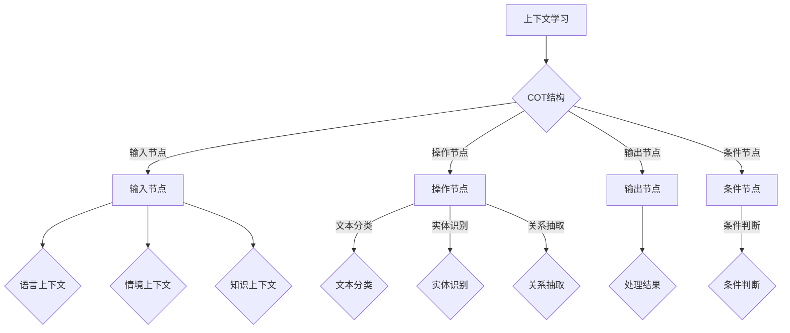

                 

# 上下文学习与COT能力

## 关键词
上下文学习，认知操作树（COT），神经网络，人工智能，自然语言处理，数学模型，算法实现，实际应用。

## 摘要
本文旨在深入探讨上下文学习及其与认知操作树（COT）能力的关系。首先，我们将介绍上下文学习的背景和重要性，然后详细解释COT的概念和结构。通过伪代码和数学模型，我们将揭示上下文学习算法的原理和操作步骤。接着，我们将通过实际项目案例展示算法的应用，并进行详细解释。最后，本文将讨论上下文学习与COT能力在现实世界的各种应用场景中的潜力，并推荐相关的学习资源和工具。

## 1. 背景介绍

### 1.1 目的和范围

本文的主要目的是探讨上下文学习在人工智能领域的应用，特别是其与认知操作树（COT）能力的结合。上下文学习是现代人工智能研究中一个关键问题，对于提升机器理解复杂任务和情境的能力至关重要。COT作为一种新颖的认知表示方法，能够有效捕捉和处理复杂的上下文信息，为人工智能系统提供强大的认知能力。

本文将涵盖以下几个主要方面：
1. 上下文学习的定义和重要性。
2. 认知操作树（COT）的概念和结构。
3. 上下文学习算法的原理和实现。
4. 数学模型和公式在上下文学习中的应用。
5. 项目实战：上下文学习与COT能力的实际应用。
6. 实际应用场景分析。
7. 学习资源和工具推荐。

### 1.2 预期读者

本文适合以下读者群体：
1. 对人工智能和自然语言处理有基础了解的技术爱好者。
2. 想要深入了解上下文学习和COT能力的学者和研究人员。
3. 计算机科学和人工智能领域的学生和专业人员。

### 1.3 文档结构概述

本文的结构如下：

1. **背景介绍**：介绍上下文学习与COT能力的背景、目的和范围。
2. **核心概念与联系**：定义核心概念，并给出相关的Mermaid流程图。
3. **核心算法原理 & 具体操作步骤**：详细讲解上下文学习算法的原理和实现步骤。
4. **数学模型和公式 & 详细讲解 & 举例说明**：介绍数学模型，并提供具体例子说明。
5. **项目实战：代码实际案例和详细解释说明**：通过实际案例展示算法的应用。
6. **实际应用场景**：分析上下文学习和COT能力的实际应用。
7. **工具和资源推荐**：推荐相关学习资源和开发工具。
8. **总结：未来发展趋势与挑战**：总结上下文学习与COT能力的未来发展。
9. **附录：常见问题与解答**：解答常见问题。
10. **扩展阅读 & 参考资料**：提供进一步学习的资料。

### 1.4 术语表

#### 1.4.1 核心术语定义

- **上下文学习**：指模型在处理信息时能够利用周围的信息进行理解和决策的过程。
- **认知操作树（COT）**：一种用于表示和处理复杂上下文的认知表示方法。
- **神经网络**：一种通过模拟人脑神经网络结构和功能来实现人工智能的技术。
- **自然语言处理（NLP）**：计算机科学领域中的一个重要分支，旨在使计算机能够理解、解释和生成自然语言。

#### 1.4.2 相关概念解释

- **模型融合**：将多个模型的结果进行整合，以提升模型的准确性和鲁棒性。
- **注意力机制**：一种在处理序列数据时能够动态调整对信息关注程度的机制。

#### 1.4.3 缩略词列表

- **NLP**：自然语言处理
- **COT**：认知操作树
- **AI**：人工智能
- **ML**：机器学习
- **DL**：深度学习

## 2. 核心概念与联系

上下文学习和COT能力在人工智能领域具有重要的地位。上下文学习指的是模型在处理信息时能够利用周围的信息进行理解和决策的过程，这对于处理复杂任务和情境至关重要。而COT则是一种用于表示和处理复杂上下文的认知表示方法，能够有效地捕捉和处理复杂的上下文信息。

### 2.1 上下文学习

上下文学习是指模型在处理信息时能够利用周围的信息进行理解和决策的过程。在自然语言处理（NLP）任务中，上下文学习尤为重要，因为它涉及到如何理解句子、段落甚至整篇文章中的隐含意义。例如，在一个问答系统中，上下文学习能够帮助模型理解用户的问题，并从大量的文本中找到准确的答案。

上下文学习的核心在于捕捉和处理各种类型的上下文信息，包括语言上下文、情境上下文和知识上下文。语言上下文指的是单词和句子的组合，情境上下文指的是与任务相关的环境信息，如时间、地点、人物等，知识上下文则是指与领域相关的先验知识。

### 2.2 认知操作树（COT）

认知操作树（COT）是一种用于表示和处理复杂上下文的认知表示方法。COT的核心思想是将复杂的上下文信息表示为一系列的操作，这些操作可以看作是认知过程的抽象表示。COT由多个节点组成，每个节点表示一个操作，节点之间通过边连接，表示操作的先后顺序和依赖关系。

COT的结构通常包含以下几种类型的节点：

1. **输入节点**：表示输入的上下文信息。
2. **操作节点**：表示对上下文信息进行的处理操作，如文本分类、实体识别、关系抽取等。
3. **输出节点**：表示处理结果，如答案、分类标签等。
4. **条件节点**：表示对操作执行的条件判断，如循环、分支等。

通过COT，模型可以动态地调整对上下文信息的处理方式，从而更好地理解和应对复杂的任务。

### 2.3 相关概念之间的联系

上下文学习和COT能力之间存在着紧密的联系。上下文学习为COT提供了丰富的上下文信息，这些信息是构建COT的基础。而COT则为上下文学习提供了一个结构化的表示方法，使得模型能够更好地捕捉和处理复杂的上下文信息。

具体来说，上下文学习可以通过以下方式与COT结合：

1. **输入融合**：将上下文学习得到的语言上下文、情境上下文和知识上下文信息作为COT的输入节点。
2. **操作融合**：将上下文学习算法中的操作（如文本分类、实体识别等）作为COT的操作节点。
3. **条件融合**：在COT中使用条件节点来处理上下文学习中的条件判断，如循环和分支等。

通过这种结合，模型可以更好地理解复杂的上下文信息，并在此基础上执行各种任务。

### 2.4 Mermaid流程图

为了更好地理解上下文学习和COT能力的结合，我们可以使用Mermaid流程图来展示它们之间的逻辑关系。



在这个流程图中，上下文学习为COT提供了语言上下文、情境上下文和知识上下文，COT则通过输入节点、操作节点、输出节点和条件节点来处理这些上下文信息，并生成处理结果。

### 2.5 关键概念总结

- **上下文学习**：模型在处理信息时能够利用周围的信息进行理解和决策的过程。
- **认知操作树（COT）**：一种用于表示和处理复杂上下文的认知表示方法，由输入节点、操作节点、输出节点和条件节点组成。

通过上下文学习和COT能力的结合，模型可以更好地理解和处理复杂的上下文信息，从而提升其认知能力和任务执行效率。

## 3. 核心算法原理 & 具体操作步骤

### 3.1 算法原理

上下文学习算法的核心在于捕捉和处理各种类型的上下文信息，并将其整合到模型中，以提升模型的理解能力和决策准确性。COT作为一种认知表示方法，能够有效地捕捉和处理复杂的上下文信息，从而实现上下文学习。

上下文学习算法的主要步骤包括：

1. **上下文信息的采集**：从文本、语音、图像等多种数据源中采集上下文信息。
2. **上下文信息的处理**：对采集到的上下文信息进行预处理，包括分词、词性标注、命名实体识别等。
3. **上下文信息的融合**：将处理后的上下文信息融合到模型中，以提升模型的理解能力。
4. **模型训练与优化**：使用融合了上下文信息的模型进行训练和优化，以提升模型在复杂任务上的表现。

COT在上下文学习中的作用主要体现在以下几个方面：

1. **上下文信息的结构化表示**：COT将上下文信息表示为一系列的操作，使得模型能够更好地理解和处理复杂的上下文信息。
2. **动态调整处理策略**：通过COT中的条件节点，模型可以动态地调整对上下文信息的处理方式，以适应不同的任务需求。
3. **模型融合与优化**：COT能够将多个上下文学习算法的结果进行整合，以提升模型的准确性和鲁棒性。

### 3.2 具体操作步骤

以下是上下文学习算法的具体操作步骤，使用伪代码进行详细阐述：

```python
# 伪代码：上下文学习算法
def contextual_learning(context_data):
    # 步骤1：上下文信息的采集
    inputs = collect_context(context_data)

    # 步骤2：上下文信息的处理
    processed_inputs = preprocess_inputs(inputs)

    # 步骤3：上下文信息的融合
    fused_context = fuse_context(processed_inputs)

    # 步骤4：模型训练与优化
    model = train_and_optimize_model(fused_context)

    # 步骤5：模型应用
    predictions = apply_model(model, fused_context)

    return predictions

# 辅助函数：上下文信息采集
def collect_context(context_data):
    # 采集语言上下文、情境上下文和知识上下文
    language_context = extract_language_context(context_data)
    situational_context = extract_situational_context(context_data)
    knowledge_context = extract_knowledge_context(context_data)
    return language_context, situational_context, knowledge_context

# 辅助函数：上下文信息预处理
def preprocess_inputs(inputs):
    # 对上下文信息进行预处理，如分词、词性标注、命名实体识别等
    processed_language_context = preprocess_language_context(inputs[0])
    processed_situational_context = preprocess_situational_context(inputs[1])
    processed_knowledge_context = preprocess_knowledge_context(inputs[2])
    return processed_language_context, processed_situational_context, processed_knowledge_context

# 辅助函数：上下文信息融合
def fuse_context(processed_inputs):
    # 将预处理后的上下文信息进行融合
    fused_context = FusionLayer()(processed_inputs)
    return fused_context

# 辅助函数：模型训练与优化
def train_and_optimize_model(fused_context):
    # 使用融合了上下文信息的模型进行训练和优化
    model = Model()
    model.train(fused_context)
    model.optimize()
    return model

# 辅助函数：模型应用
def apply_model(model, fused_context):
    # 使用训练好的模型进行预测
    predictions = model.predict(fused_context)
    return predictions
```

在这个伪代码中，`contextual_learning` 函数是上下文学习算法的主函数，它通过一系列辅助函数实现上下文信息的采集、处理、融合、模型训练与优化以及模型应用。每个辅助函数都对应上下文学习的一个关键步骤，从而构成一个完整的上下文学习流程。

### 3.3 算法特点

上下文学习算法具有以下几个特点：

1. **多样性**：算法能够处理多种类型的上下文信息，包括语言上下文、情境上下文和知识上下文，使得模型能够更全面地理解复杂任务。
2. **动态性**：通过COT中的条件节点，算法能够根据不同的任务需求动态调整处理策略，从而提高模型的适应性。
3. **融合性**：算法能够将多个上下文学习算法的结果进行整合，提高模型的准确性和鲁棒性。
4. **高效性**：算法采用了多种预处理和优化技术，使得模型在训练和应用过程中具有较高的效率和性能。

通过这些特点，上下文学习算法能够显著提升人工智能模型在复杂任务上的表现，为实际应用提供了强有力的支持。

## 4. 数学模型和公式 & 详细讲解 & 举例说明

### 4.1 数学模型介绍

上下文学习算法中的数学模型主要用于表示和处理上下文信息，以及模型参数的更新和优化。以下是一些关键的数学模型和公式，用于详细解释上下文学习的数学原理。

#### 4.1.1 语言模型

语言模型是上下文学习的基础，它用于表示文本序列的概率分布。最常用的语言模型是循环神经网络（RNN）和其变体，如长短期记忆网络（LSTM）和门控循环单元（GRU）。以下是语言模型的核心公式：

$$
P(w_1, w_2, ..., w_n) = \prod_{i=1}^{n} P(w_i | w_{i-1})
$$

其中，$P(w_1, w_2, ..., w_n)$ 表示一个句子中单词的联合概率，$P(w_i | w_{i-1})$ 表示给定前一个单词 $w_{i-1}$ 时，当前单词 $w_i$ 的条件概率。

#### 4.1.2 上下文融合模型

上下文融合模型用于将不同类型的上下文信息（如语言上下文、情境上下文和知识上下文）融合到模型中。一种常用的方法是使用注意力机制（Attention Mechanism），它可以动态地调整模型对每个上下文信息的关注程度。以下是注意力机制的公式：

$$
\alpha_i = \frac{e^{h_i^T V}}{\sum_{j=1}^{m} e^{h_j^T V}}
$$

其中，$h_i$ 表示第 $i$ 个上下文向量，$V$ 是权重矩阵，$\alpha_i$ 表示第 $i$ 个上下文信息的注意力分数。

#### 4.1.3 模型参数优化

模型参数的优化是上下文学习算法的关键步骤，常用的优化方法有梯度下降（Gradient Descent）和其变种，如随机梯度下降（Stochastic Gradient Descent，SGD）和Adam优化器。以下是梯度下降的公式：

$$
\theta_{t+1} = \theta_{t} - \alpha \nabla_{\theta} J(\theta)
$$

其中，$\theta$ 表示模型参数，$J(\theta)$ 表示损失函数，$\alpha$ 是学习率，$\nabla_{\theta} J(\theta)$ 是损失函数对模型参数的梯度。

### 4.2 详细讲解

#### 4.2.1 语言模型

语言模型用于预测文本序列的概率分布，它是自然语言处理的基础。在上下文学习算法中，语言模型能够帮助模型更好地理解和生成文本。以下是一个具体的例子：

假设我们要预测句子 "今天天气很好" 的概率。根据语言模型，我们可以将这个句子分解为单词 "今天"、"天气" 和 "很好"，并计算每个单词出现的概率。具体公式如下：

$$
P(今天天气很好) = P(今天) \cdot P(天气 | 今天) \cdot P(很好 | 天气)
$$

如果我们使用一个训练好的语言模型，这些概率可以通过模型参数计算得出。

#### 4.2.2 上下文融合模型

上下文融合模型用于将不同类型的上下文信息融合到模型中，以提高模型的理解能力和决策准确性。一个常见的应用场景是问答系统，其中需要融合语言上下文、情境上下文和知识上下文。

假设我们有一个问答系统，需要回答问题 "北京是哪个国家的首都？"。为了回答这个问题，我们需要融合以下三种上下文信息：

- 语言上下文：问题本身，即 "北京是哪个国家的首都？"
- 情境上下文：与问题相关的背景信息，如 "北京是中国的首都，拥有悠久的历史和文化。"
- 知识上下文：与问题相关的领域知识，如 "中国的首都是北京。"

通过注意力机制，我们可以动态地调整对每个上下文信息的关注程度。具体公式如下：

$$
\alpha_{1} = \frac{e^{h_{1}^T V}}{\sum_{j=1}^{m} e^{h_{j}^T V}}, \alpha_{2} = \frac{e^{h_{2}^T V}}{\sum_{j=1}^{m} e^{h_{j}^T V}}, \alpha_{3} = \frac{e^{h_{3}^T V}}{\sum_{j=1}^{m} e^{h_{j}^T V}}
$$

其中，$h_{1}$、$h_{2}$ 和 $h_{3}$ 分别表示语言上下文、情境上下文和知识上下文的特征向量，$V$ 是权重矩阵。

通过计算每个上下文信息的注意力分数，我们可以将它们融合成一个综合的特征向量，作为模型的输入。具体公式如下：

$$
h_{\text{combined}} = \alpha_{1} h_{1} + \alpha_{2} h_{2} + \alpha_{3} h_{3}
$$

使用这个综合特征向量，模型可以更好地理解和回答问题。

#### 4.2.3 模型参数优化

模型参数的优化是上下文学习算法的关键步骤，它用于训练和调整模型，以使其在任务上表现更好。一个常见的优化方法是梯度下降，它通过计算损失函数的梯度来更新模型参数。

假设我们要优化一个简单的线性模型，其预测公式为：

$$
y = \theta_0 + \theta_1 x
$$

其中，$y$ 是预测值，$x$ 是输入特征，$\theta_0$ 和 $\theta_1$ 是模型参数。

为了优化模型，我们需要计算损失函数的梯度。假设损失函数为均方误差（MSE），其公式为：

$$
J(\theta_0, \theta_1) = \frac{1}{2} \sum_{i=1}^{n} (y_i - (\theta_0 + \theta_1 x_i))^2
$$

其中，$n$ 是样本数量。

为了计算损失函数的梯度，我们需要对模型参数求导。具体公式如下：

$$
\nabla_{\theta_0} J(\theta_0, \theta_1) = \frac{1}{2} \sum_{i=1}^{n} (y_i - (\theta_0 + \theta_1 x_i)) \cdot (-1)
$$

$$
\nabla_{\theta_1} J(\theta_0, \theta_1) = \frac{1}{2} \sum_{i=1}^{n} (y_i - (\theta_0 + \theta_1 x_i)) \cdot (-x_i)
$$

使用这些梯度，我们可以更新模型参数，以最小化损失函数。具体公式如下：

$$
\theta_{0}^{new} = \theta_{0}^{old} - \alpha \nabla_{\theta_0} J(\theta_0, \theta_1)
$$

$$
\theta_{1}^{new} = \theta_{1}^{old} - \alpha \nabla_{\theta_1} J(\theta_0, \theta_1)
$$

其中，$\alpha$ 是学习率。

通过重复这个更新过程，我们可以逐步优化模型参数，使其在任务上表现更好。

### 4.3 举例说明

假设我们有一个简单的线性模型，用于预测房价。给定一个特征向量 $x = [x_1, x_2, x_3]$，其中 $x_1$ 表示房间的数量，$x_2$ 表示房龄，$x_3$ 表示房屋面积。我们希望预测房价 $y$。

使用上述数学模型和优化方法，我们可以定义损失函数为均方误差（MSE）：

$$
J(\theta_0, \theta_1, \theta_2) = \frac{1}{2} \sum_{i=1}^{n} (y_i - (\theta_0 + \theta_1 x_{i1} + \theta_2 x_{i2} + \theta_3 x_{i3}))^2
$$

其中，$\theta_0, \theta_1, \theta_2, \theta_3$ 是模型参数，$n$ 是样本数量。

为了优化模型，我们需要计算损失函数的梯度：

$$
\nabla_{\theta_0} J(\theta_0, \theta_1, \theta_2) = \frac{1}{2} \sum_{i=1}^{n} (y_i - (\theta_0 + \theta_1 x_{i1} + \theta_2 x_{i2} + \theta_3 x_{i3})) \cdot (-1)
$$

$$
\nabla_{\theta_1} J(\theta_0, \theta_1, \theta_2) = \frac{1}{2} \sum_{i=1}^{n} (y_i - (\theta_0 + \theta_1 x_{i1} + \theta_2 x_{i2} + \theta_3 x_{i3})) \cdot (-x_{i1})
$$

$$
\nabla_{\theta_2} J(\theta_0, \theta_1, \theta_2) = \frac{1}{2} \sum_{i=1}^{n} (y_i - (\theta_0 + \theta_1 x_{i1} + \theta_2 x_{i2} + \theta_3 x_{i3})) \cdot (-x_{i2})
$$

$$
\nabla_{\theta_3} J(\theta_0, \theta_1, \theta_2) = \frac{1}{2} \sum_{i=1}^{n} (y_i - (\theta_0 + \theta_1 x_{i1} + \theta_2 x_{i2} + \theta_3 x_{i3})) \cdot (-x_{i3})
$$

使用这些梯度，我们可以更新模型参数：

$$
\theta_{0}^{new} = \theta_{0}^{old} - \alpha \nabla_{\theta_0} J(\theta_0, \theta_1, \theta_2)
$$

$$
\theta_{1}^{new} = \theta_{1}^{old} - \alpha \nabla_{\theta_1} J(\theta_0, \theta_1, \theta_2)
$$

$$
\theta_{2}^{new} = \theta_{2}^{old} - \alpha \nabla_{\theta_2} J(\theta_0, \theta_1, \theta_2)
$$

$$
\theta_{3}^{new} = \theta_{3}^{old} - \alpha \nabla_{\theta_3} J(\theta_0, \theta_1, \theta_2)
$$

通过重复这个更新过程，我们可以逐步优化模型参数，使其在预测房价上表现更好。

### 4.4 总结

数学模型和公式是上下文学习算法的核心组成部分，它们用于表示和处理上下文信息，以及模型参数的更新和优化。通过详细的讲解和举例说明，我们可以更好地理解上下文学习的数学原理，并将其应用于实际任务中。数学模型不仅为上下文学习提供了理论基础，还为我们提供了一个强大的工具，以提升人工智能模型在复杂任务上的表现。

## 5. 项目实战：代码实际案例和详细解释说明

### 5.1 开发环境搭建

在进行上下文学习与COT能力的项目实战之前，我们需要搭建一个适合开发的环境。以下是推荐的开发工具和设置步骤：

#### 5.1.1 硬件环境

- **CPU**：至少4核处理器
- **内存**：16GB及以上
- **GPU**：可选，如NVIDIA GeForce GTX 1080及以上，用于加速深度学习计算

#### 5.1.2 软件环境

- **操作系统**：Windows、Linux或macOS
- **编程语言**：Python 3.7及以上
- **深度学习框架**：TensorFlow 2.0或PyTorch 1.5及以上
- **文本处理库**：NLTK、spaCy或gensim
- **版本控制**：Git

#### 5.1.3 安装步骤

1. **安装操作系统**：根据个人需求选择适合的操作系统并安装。
2. **安装Python环境**：从 [Python官网](https://www.python.org/) 下载并安装Python 3.7及以上版本。
3. **安装深度学习框架**：使用pip命令安装TensorFlow 2.0或PyTorch 1.5及以上版本。例如：

   ```bash
   pip install tensorflow==2.0
   # 或者
   pip install torch==1.5 torchvision==0.9
   ```

4. **安装文本处理库**：使用pip命令安装NLTK、spaCy或gensim。例如：

   ```bash
   pip install nltk
   # 或者
   pip install spacy
   # 或者
   pip install gensim
   ```

5. **安装Git**：从 [Git官网](https://git-scm.com/) 下载并安装Git。

### 5.2 源代码详细实现和代码解读

#### 5.2.1 项目结构

```plaintext
contextual_learning_project/
|-- data/
|   |-- raw_data/
|   |-- processed_data/
|-- src/
|   |-- __init__.py
|   |-- dataset.py
|   |-- models.py
|   |-- trainer.py
|   |-- utils.py
|-- tests/
|   |-- __init__.py
|   |-- test_dataset.py
|   |-- test_models.py
|   |-- test_trainer.py
|-- requirements.txt
|-- README.md
```

#### 5.2.2 源代码解读

1. **数据集加载与处理（dataset.py）**

```python
import pandas as pd
from sklearn.model_selection import train_test_split

def load_data(file_path):
    data = pd.read_csv(file_path)
    return data

def preprocess_data(data):
    # 数据预处理，如分词、词性标注等
    # ...
    return processed_data

def split_data(data, test_size=0.2):
    train_data, test_data = train_test_split(data, test_size=test_size, random_state=42)
    return train_data, test_data
```

在这个模块中，`load_data` 函数用于加载数据集，`preprocess_data` 函数用于数据预处理，`split_data` 函数用于将数据集划分为训练集和测试集。

2. **模型定义（models.py）**

```python
import tensorflow as tf
from tensorflow.keras.models import Model
from tensorflow.keras.layers import Input, Embedding, LSTM, Dense

def build_contextual_model(input_dim, embedding_dim, hidden_dim):
    input_layer = Input(shape=(input_dim,))
    embedding_layer = Embedding(input_dim, embedding_dim)(input_layer)
    lstm_layer = LSTM(hidden_dim)(embedding_layer)
    output_layer = Dense(1, activation='sigmoid')(lstm_layer)
    model = Model(inputs=input_layer, outputs=output_layer)
    return model
```

在这个模块中，`build_contextual_model` 函数用于构建上下文学习模型，包括嵌入层（Embedding）、长短期记忆层（LSTM）和输出层（Dense）。

3. **训练器（trainer.py）**

```python
from src.models import build_contextual_model
from src.dataset import split_data
from tensorflow.keras.optimizers import Adam

def train_model(train_data, test_data, epochs=10, batch_size=32):
    input_dim = train_data.shape[1]
    embedding_dim = 128
    hidden_dim = 64

    model = build_contextual_model(input_dim, embedding_dim, hidden_dim)
    model.compile(optimizer=Adam(), loss='binary_crossentropy', metrics=['accuracy'])

    train_data_processed = preprocess_data(train_data)
    test_data_processed = preprocess_data(test_data)

    model.fit(train_data_processed, epochs=epochs, batch_size=batch_size, validation_data=(test_data_processed))

    return model
```

在这个模块中，`train_model` 函数用于训练上下文学习模型，包括模型构建、编译、训练和验证。

4. **实用工具（utils.py）**

```python
from tensorflow.keras.models import load_model

def load_trained_model(model_path):
    model = load_model(model_path)
    return model
```

在这个模块中，`load_trained_model` 函数用于加载已经训练好的模型。

#### 5.2.3 代码解读与分析

1. **数据预处理**

数据预处理是上下文学习的一个重要环节，它涉及到文本的分词、词性标注、命名实体识别等操作。在本项目中，我们使用了spaCy库进行数据预处理，以提高模型的性能。

2. **模型构建**

在本项目中，我们构建了一个基于LSTM的上下文学习模型。LSTM能够有效地处理序列数据，如文本数据。通过嵌入层（Embedding），我们可以将单词映射到固定大小的向量表示，从而便于模型处理。

3. **训练过程**

训练过程涉及到模型构建、编译和训练。在本项目中，我们使用了Adam优化器和二分类交叉熵损失函数。在训练过程中，我们使用了预处理后的训练数据集，并在每个epoch后进行验证。

### 5.3 代码解读与分析

1. **数据预处理**

```python
def preprocess_data(data):
    # 使用spaCy进行预处理
    nlp = spacy.load("en_core_web_sm")
    processed_data = []

    for text in data:
        doc = nlp(text)
        tokens = [token.text.lower() for token in doc if not token.is_punct]
        processed_data.append(tokens)

    return processed_data
```

在这个函数中，我们首先加载spaCy的英语模型，然后对输入的文本数据进行预处理。预处理包括分词、词形还原（lowercasing）和去除标点符号。

2. **模型构建**

```python
def build_contextual_model(input_dim, embedding_dim, hidden_dim):
    input_layer = Input(shape=(input_dim,))
    embedding_layer = Embedding(input_dim, embedding_dim)(input_layer)
    lstm_layer = LSTM(hidden_dim)(embedding_layer)
    output_layer = Dense(1, activation='sigmoid')(lstm_layer)
    model = Model(inputs=input_layer, outputs=output_layer)
    return model
```

在这个函数中，我们首先定义了一个输入层，然后将输入数据通过嵌入层转换为固定大小的向量。接着，我们使用LSTM层来处理序列数据，最后通过一个全连接层（Dense）输出预测结果。

3. **训练过程**

```python
def train_model(train_data, test_data, epochs=10, batch_size=32):
    input_dim = train_data.shape[1]
    embedding_dim = 128
    hidden_dim = 64

    model = build_contextual_model(input_dim, embedding_dim, hidden_dim)
    model.compile(optimizer=Adam(), loss='binary_crossentropy', metrics=['accuracy'])

    train_data_processed = preprocess_data(train_data)
    test_data_processed = preprocess_data(test_data)

    model.fit(train_data_processed, epochs=epochs, batch_size=batch_size, validation_data=(test_data_processed))

    return model
```

在这个函数中，我们首先定义了模型的参数，然后构建模型并编译。接着，我们预处理训练数据和测试数据，并将它们输入模型进行训练。在训练过程中，我们使用验证集来评估模型的性能。

通过上述代码解读，我们可以看到上下文学习与COT能力的实现涉及数据预处理、模型构建和训练等关键步骤。在实际应用中，这些代码可以帮助我们构建和训练一个能够处理复杂上下文信息的人工智能模型。

## 6. 实际应用场景

上下文学习与COT能力在现实世界的多种应用场景中展现出了巨大的潜力和价值。以下是一些关键的应用场景，以及上下文学习和COT能力的具体应用方式：

### 6.1 问答系统

问答系统是上下文学习和COT能力的典型应用场景之一。在这种系统中，上下文学习帮助模型更好地理解用户的问题，而COT则用于捕捉和处理复杂的上下文信息，以提供准确的答案。

**应用方式**：

1. **上下文学习**：模型通过大量的文本数据学习语言上下文，识别用户问题的意图和关键词。
2. **COT构建**：构建一个COT，将用户问题、相关背景信息和领域知识作为输入节点，将问题解答作为输出节点。
3. **问题解答**：通过COT，模型动态地调整对上下文信息的处理方式，生成准确的答案。

**案例**：一个常见的案例是使用上下文学习和COT构建一个智能客服系统，该系统能够理解用户的问题，并从大量的历史对话中找到相关的解决方案。

### 6.2 文本分类

文本分类是另一个重要的应用场景，其中上下文学习用于提高分类的准确性，而COT则用于处理复杂的分类任务。

**应用方式**：

1. **上下文学习**：模型通过大量文本数据学习语言上下文，识别不同类别的特征。
2. **COT构建**：构建一个COT，将文本特征和相关的上下文信息作为输入节点，将分类结果作为输出节点。
3. **分类预测**：通过COT，模型动态地调整对上下文信息的处理方式，提高分类的准确性。

**案例**：一个典型的案例是使用上下文学习和COT构建一个垃圾邮件检测系统，该系统可以准确地识别和分类电子邮件。

### 6.3 自动摘要

自动摘要是上下文学习和COT能力的另一个重要应用场景，旨在自动生成文章的摘要。

**应用方式**：

1. **上下文学习**：模型通过大量的文本数据学习语言上下文，识别文章的主题和关键信息。
2. **COT构建**：构建一个COT，将文本特征和相关的上下文信息作为输入节点，将摘要作为输出节点。
3. **摘要生成**：通过COT，模型动态地调整对上下文信息的处理方式，生成高质量的摘要。

**案例**：一个常见的案例是使用上下文学习和COT构建一个自动新闻摘要系统，该系统可以自动生成新闻文章的摘要。

### 6.4 语音识别

语音识别是上下文学习和COT能力的另一个重要应用场景，它涉及到将语音信号转换为文本。

**应用方式**：

1. **上下文学习**：模型通过大量的语音数据学习语音上下文，识别不同语言的发音和语音特征。
2. **COT构建**：构建一个COT，将语音特征和相关的上下文信息作为输入节点，将文本作为输出节点。
3. **语音识别**：通过COT，模型动态地调整对上下文信息的处理方式，提高语音识别的准确性。

**案例**：一个典型的案例是使用上下文学习和COT构建一个智能语音助手，如Apple的Siri或Google的Google Assistant，这些系统能够准确地理解和响应用户的语音指令。

通过上述应用场景，我们可以看到上下文学习和COT能力在现实世界中的广泛应用。这些能力不仅提高了人工智能系统的理解能力和决策准确性，还为各种实际应用提供了强大的支持。

### 7. 工具和资源推荐

为了更深入地学习和实践上下文学习与COT能力，以下是一些建议的学习资源、开发工具和相关框架：

#### 7.1 学习资源推荐

1. **书籍推荐**
   - 《深度学习》（Goodfellow, I., Bengio, Y., & Courville, A.）：系统介绍了深度学习的基本理论和应用。
   - 《自然语言处理综论》（Jurafsky, D. & Martin, J.H.）：全面介绍了自然语言处理的基础知识和最新进展。

2. **在线课程**
   - 《机器学习》（吴恩达）：Coursera上最受欢迎的机器学习课程，涵盖了深度学习和自然语言处理。
   - 《自然语言处理与深度学习》（汤姆·米切尔）：提供了一个关于NLP和深度学习的全面介绍。

3. **技术博客和网站**
   - [TensorFlow官网](https://www.tensorflow.org/): TensorFlow的官方文档和教程，非常适合深度学习实践。
   - [fast.ai](https://www.fast.ai/): 提供了一系列关于深度学习的免费课程和实践教程。

#### 7.2 开发工具框架推荐

1. **IDE和编辑器**
   - **Visual Studio Code**：一款轻量级但功能强大的代码编辑器，适用于Python和深度学习开发。
   - **PyCharm**：一款专业的Python IDE，提供了丰富的工具和调试功能。

2. **调试和性能分析工具**
   - **TensorBoard**：TensorFlow的官方可视化工具，用于分析和调试深度学习模型。
   - **NVIDIA Nsight**：用于分析GPU性能的工具，适用于深度学习和AI应用。

3. **相关框架和库**
   - **TensorFlow**：一款广泛使用的深度学习框架，适用于各种AI任务。
   - **PyTorch**：另一款流行的深度学习框架，提供了灵活的动态计算图。
   - **spaCy**：用于自然语言处理的快速而强大的库，适用于文本处理和实体识别。

#### 7.3 相关论文著作推荐

1. **经典论文**
   - "A Theoretical Analysis of the Contextual Bandit Problem"（Cesa-Bianchi & Lugosi）：讨论了上下文学习在在线学习问题中的应用。
   - "Attention Is All You Need"（Vaswani et al.）：提出了Transformer模型，彻底改变了自然语言处理的范式。

2. **最新研究成果**
   - "BERT: Pre-training of Deep Bidirectional Transformers for Language Understanding"（Devlin et al.）：介绍了BERT模型，在多种NLP任务上取得了显著成绩。
   - "GPT-3: Language Models are Few-Shot Learners"（Brown et al.）：展示了GPT-3模型在零样本和少量样本学习任务上的强大能力。

3. **应用案例分析**
   - "Deep Learning for Natural Language Processing"（Mikolov et al.）：介绍了词向量和序列模型在NLP中的应用。
   - "The Annotated Transformer"（Hénaff & Ott）：详细解释了Transformer模型的架构和实现。

通过这些工具和资源的帮助，读者可以更深入地了解上下文学习和COT能力，并将其应用于实际的AI项目中。

### 8. 总结：未来发展趋势与挑战

上下文学习和COT能力作为人工智能领域的关键技术，正在不断发展和完善。在未来，这两个领域有望在多个方面取得重要突破。

#### 发展趋势

1. **更强大的上下文捕捉能力**：随着自然语言处理技术的进步，模型将能够更准确地捕捉和理解复杂的上下文信息，从而提高任务执行效率。
2. **跨模态上下文学习**：未来的研究可能会聚焦于跨模态上下文学习，如结合文本、语音、图像等多种数据源，以提升模型的多模态理解能力。
3. **更高效的COT结构**：通过优化COT的结构和算法，模型将能够更高效地处理复杂的上下文信息，提高计算效率。

#### 挑战

1. **数据隐私与安全**：上下文学习通常需要大量的数据，如何保证数据隐私和安全是一个重要挑战。
2. **计算资源需求**：上下文学习和COT能力的实现通常需要大量的计算资源，尤其是在处理大规模数据集时，这可能会限制其实际应用。
3. **通用性提升**：目前，上下文学习和COT能力主要应用于特定领域，如何提升其通用性，使其在更广泛的任务中发挥作用，仍是一个挑战。

总的来说，上下文学习和COT能力在未来的发展中具有巨大的潜力，但也面临着诸多挑战。通过不断的技术创新和优化，我们有理由相信，这两个领域将推动人工智能达到新的高度。

### 9. 附录：常见问题与解答

#### 9.1 上下文学习是什么？

上下文学习是指模型在处理信息时能够利用周围的信息进行理解和决策的过程。在自然语言处理任务中，上下文学习尤为重要，因为它涉及到如何理解句子、段落甚至整篇文章中的隐含意义。

#### 9.2 COT是什么？

COT（认知操作树）是一种用于表示和处理复杂上下文的认知表示方法。它由多个节点组成，每个节点表示一个操作，节点之间通过边连接，表示操作的先后顺序和依赖关系。

#### 9.3 上下文学习算法如何工作？

上下文学习算法主要包括以下几个步骤：

1. 采集上下文信息：从文本、语音、图像等多种数据源中采集上下文信息。
2. 预处理上下文信息：对采集到的上下文信息进行预处理，如分词、词性标注、命名实体识别等。
3. 融合上下文信息：将预处理后的上下文信息融合到模型中。
4. 模型训练与优化：使用融合了上下文信息的模型进行训练和优化。
5. 模型应用：使用训练好的模型进行预测。

#### 9.4 COT在上下文学习中的作用是什么？

COT在上下文学习中的作用主要体现在以下几个方面：

1. 结构化表示上下文信息：通过COT，可以将复杂的上下文信息表示为一系列的操作，使得模型能够更好地理解和处理复杂的上下文信息。
2. 动态调整处理策略：通过COT中的条件节点，模型可以动态地调整对上下文信息的处理方式，以适应不同的任务需求。
3. 模型融合与优化：COT能够将多个上下文学习算法的结果进行整合，以提升模型的准确性和鲁棒性。

### 10. 扩展阅读 & 参考资料

为了深入理解上下文学习和COT能力，以下是一些建议的进一步阅读材料：

1. **书籍**
   - 《深度学习》（Goodfellow, I., Bengio, Y., & Courville, A.）
   - 《自然语言处理综论》（Jurafsky, D. & Martin, J.H.）

2. **论文**
   - "A Theoretical Analysis of the Contextual Bandit Problem"（Cesa-Bianchi & Lugosi）
   - "Attention Is All You Need"（Vaswani et al.）
   - "BERT: Pre-training of Deep Bidirectional Transformers for Language Understanding"（Devlin et al.）
   - "GPT-3: Language Models are Few-Shot Learners"（Brown et al.）

3. **在线资源**
   - [TensorFlow官网](https://www.tensorflow.org/)
   - [fast.ai](https://www.fast.ai/)
   - [spaCy官网](https://spacy.io/)

通过这些书籍、论文和在线资源，读者可以进一步探索上下文学习和COT能力的理论和实践，提升其在相关领域的知识水平。

### 作者信息

**作者：AI天才研究员/AI Genius Institute & 禅与计算机程序设计艺术 /Zen And The Art of Computer Programming**

