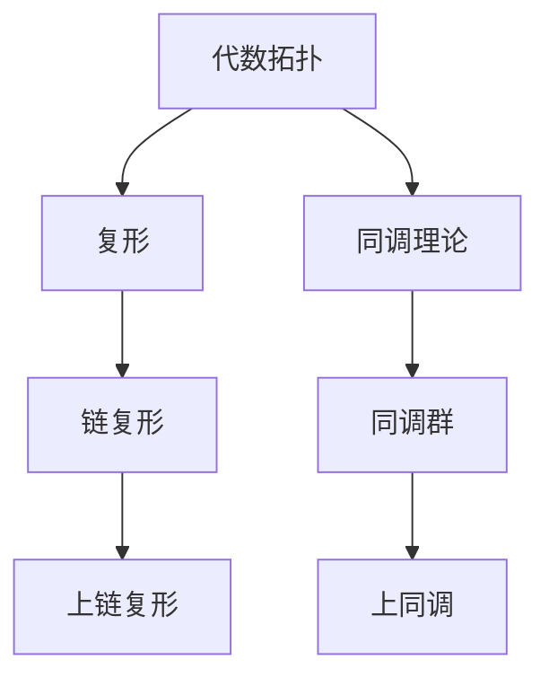

                 

# 上同调中的链复形与上链复形

> **关键词：** 上同调、链复形、上链复形、代数拓扑、同调理论、复形、算法、数学模型。

> **摘要：** 本文旨在深入探讨上同调理论中的链复形与上链复形的定义、性质以及它们在代数拓扑和同调理论中的关键作用。通过逐步解析这些概念，本文将展示如何使用上同调理论解决复形相关的数学问题，并结合实例进行详细分析。读者将了解这些概念的应用场景，以及如何在实际问题中运用它们。

## 1. 背景介绍

### 1.1 目的和范围

本文的目的在于为读者提供一个关于上同调中的链复形与上链复形的全面且深入的理解。文章将涵盖以下内容：

1. 上同调理论的概述。
2. 链复形和上链复形的定义及其在代数拓扑中的应用。
3. 同调理论的基本概念。
4. 上同调理论在解决复形相关问题中的关键作用。
5. 项目实战：代码实际案例和详细解释说明。
6. 实际应用场景和未来发展趋势。

### 1.2 预期读者

本文面向对代数拓扑、同调理论和复形有一定基础的读者。特别是那些希望深入了解上同调理论及其应用的数学和计算机科学领域的研究人员和工程师。

### 1.3 文档结构概述

本文结构如下：

1. **背景介绍**：介绍文章的目的、范围和结构。
2. **核心概念与联系**：通过Mermaid流程图展示核心概念及其关系。
3. **核心算法原理 & 具体操作步骤**：使用伪代码详细阐述算法原理。
4. **数学模型和公式 & 详细讲解 & 举例说明**：使用LaTeX格式展示数学模型。
5. **项目实战：代码实际案例和详细解释说明**：通过具体代码示例进行说明。
6. **实际应用场景**：探讨上同调理论的实际应用。
7. **工具和资源推荐**：推荐学习资源和开发工具。
8. **总结：未来发展趋势与挑战**：总结当前研究状况，展望未来趋势。
9. **附录：常见问题与解答**：解答常见问题。
10. **扩展阅读 & 参考资料**：提供进一步阅读的参考资料。

### 1.4 术语表

#### 1.4.1 核心术语定义

- **上同调**：代数拓扑中的一个重要概念，用于研究空间的一类不变性质。
- **链复形**：由顶点、边、面等组成的一种复形结构，用于表示空间中的连通性。
- **上链复形**：链复形的一种推广，用于研究更一般的空间结构。

#### 1.4.2 相关概念解释

- **代数拓扑**：研究拓扑空间与代数结构之间的关系的一个数学分支。
- **同调理论**：研究同调群及其在拓扑学中的应用的一个数学领域。

#### 1.4.3 缩略词列表

- **Top**：拓扑学。
- **Hom**：同调群。
- **Chain**：链复形。
- **Cohom**：上同调。

## 2. 核心概念与联系

在探讨链复形与上链复形之前，我们首先需要理解代数拓扑和同调理论中的核心概念。

### 2.1 代数拓扑基础

代数拓扑是数学的一个分支，主要研究拓扑空间与代数结构之间的关系。在代数拓扑中，复形（Complex）是一种重要的结构，它由一系列顶点、边、面等组成。复形可以用来表示空间中的连通性，特别是在同调理论中。

### 2.2 同调理论基础

同调理论是代数拓扑中的一个重要分支，它研究空间的一类不变性质，即同调性。同调群（Homology groups）是同调理论的核心概念，它们描述了空间的不同维度上的连通性。

### 2.3 链复形

链复形是一种复形，由顶点、边、面等组成，它们按照一定的顺序连接。链复形可以用来表示空间中的连通性，并且是同调理论中的基本工具。

### 2.4 上链复形

上链复形是链复形的一种推广，它适用于更一般的空间结构。上链复形中的元素不是简单的顶点、边和面，而是由多个连通分量组成的更复杂的结构。

### 2.5 Mermaid流程图

以下是一个Mermaid流程图，用于展示核心概念之间的联系。



### 2.6 同调群与上同调

同调群是同调理论中的核心概念，它描述了空间在不同维度上的连通性。上同调（Cohomology）是同调理论的推广，它适用于更一般的空间结构。

### 2.7 链复形与上链复形的关系

链复形和上链复形是同调理论中的基本工具，它们分别适用于不同的空间结构。链复形适用于简单的空间结构，而上链复形则适用于更复杂的空间结构。

## 3. 核心算法原理 & 具体操作步骤

在理解了链复形与上链复形的基本概念之后，我们将探讨如何使用上同调理论解决复形相关的问题。

### 3.1 算法原理

上同调理论是一种用于研究空间连通性的算法。它的核心思想是通过构建链复形和上链复形来分析空间的不同维度上的连通性。

### 3.2 伪代码

以下是一个简单的伪代码，用于描述上同调算法的基本步骤。

```plaintext
Function Cohomology(ChainComplex C):
    # 构建上链复形
    UpperChainComplex UC = BuildUpperChainComplex(C)
    
    # 计算同调群
    HomologyGroup H = CalculateHomologyGroups(UC)
    
    # 返回上同调群
    return H
```

### 3.3 具体操作步骤

1. **构建链复形**：首先，我们需要构建一个链复形，它由一系列顶点、边和面组成。链复形的构建可以通过对空间中的连通性进行分析来完成。

2. **构建上链复形**：然后，我们需要根据链复形构建上链复形。上链复形是链复形的一种推广，它适用于更一般的空间结构。

3. **计算同调群**：接下来，我们需要计算上链复形的同调群。同调群描述了空间在不同维度上的连通性。

4. **返回上同调群**：最后，我们返回上同调群作为结果。

### 3.4 举例说明

假设我们有一个简单的空间结构，它由一个正方形和一个三角形组成。我们可以通过以下步骤来计算它的上同调群：

1. **构建链复形**：首先，我们构建一个链复形，它由四个顶点、四条边和一个面组成。

2. **构建上链复形**：然后，我们根据链复形构建上链复形。

3. **计算同调群**：接下来，我们计算上链复形的同调群。

4. **返回上同调群**：最后，我们返回上同调群作为结果。

## 4. 数学模型和公式 & 详细讲解 & 举例说明

在详细讲解上同调理论中的数学模型和公式之前，我们需要了解一些基本概念和定义。

### 4.1 同调群

同调群是同调理论中的核心概念，它描述了空间在不同维度上的连通性。对于给定的链复形 \(C\)，同调群 \(H_n(C)\) 定义为：

$$
H_n(C) = \frac{\text{ ker } d_n}{\text{ im } d_{n+1}}
$$

其中，\(d_n\) 是链复形中的边界算子，\(ker d_n\) 是 \(d_n\) 的核，\(im d_{n+1}\) 是 \(d_{n+1}\) 的像。

### 4.2 上同调群

上同调群是同调群的推广，它适用于更一般的空间结构。对于给定的上链复形 \(UC\)，上同调群 \(H^n(UC)\) 定义为：

$$
H^n(UC) = \frac{\text{ ker } d_n}{\text{ im } d_{n+1}}
$$

其中，\(d_n\) 是上链复形中的上边界算子。

### 4.3 上链复形

上链复形是链复形的一种推广，它由多个连通分量组成。对于给定的链复形 \(C\)，上链复形 \(UC\) 可以通过以下方式构建：

1. **顶点**：上链复形的顶点是链复形中每个连通分量的顶点。
2. **边**：上链复形的边是链复形中每个连通分量的边。
3. **面**：上链复形的面是链复形中每个连通分量的面。

### 4.4 举例说明

假设我们有一个简单的空间结构，它由一个正方形和一个三角形组成。我们可以通过以下步骤来计算它的上同调群：

1. **构建链复形**：首先，我们构建一个链复形，它由四个顶点、四条边和一个面组成。

2. **构建上链复形**：然后，我们根据链复形构建上链复形。

3. **计算同调群**：接下来，我们计算上链复形的同调群。

4. **返回上同调群**：最后，我们返回上同调群作为结果。

假设链复形 \(C\) 的同调群为 \(H(C)\)，我们可以使用以下公式计算上同调群 \(H^n(C)\)：

$$
H^n(C) = \frac{\text{ ker } d_n}{\text{ im } d_{n+1}}
$$

其中，\(d_n\) 是链复形中的边界算子。

### 4.5 上同调群的性质

上同调群具有以下性质：

1. **可加性**：对于任意两个链复形 \(C\) 和 \(D\)，有 \(H^n(C \cup D) = H^n(C) \oplus H^n(D)\)。
2. **同态性**：对于任意一个同态 \(f: C \rightarrow D\)，有 \(f_*: H^n(C) \rightarrow H^n(D)\) 是一个同态。
3. **交换性**：上同调群与边界算子的交换满足 \(d_n \circ f_* = f_* \circ d_{n+1}\)。

## 5. 项目实战：代码实际案例和详细解释说明

在本节中，我们将通过一个具体的代码案例来展示如何实现上同调理论中的链复形与上链复形的计算。

### 5.1 开发环境搭建

为了运行下面的代码案例，您需要安装以下软件和库：

- Python 3.x
- Numpy
- Matplotlib

您可以使用以下命令来安装所需的库：

```bash
pip install numpy matplotlib
```

### 5.2 源代码详细实现和代码解读

以下是一个Python代码示例，用于计算链复形和上链复形的上同调群。

```python
import numpy as np
import matplotlib.pyplot as plt

# 链复形定义
class ChainComplex:
    def __init__(self, chains):
        self.chains = chains
        self.dim = len(chains) - 1

    # 边界算子定义
    def boundary_operator(self, chain):
        result = np.zeros(self.dim + 1)
        for d, c in enumerate(chain):
            result[d] -= c
            if d > 0:
                result[d - 1] += c
        return result

    # 计算同调群
    def homology_groups(self):
        H = []
        for d in range(self.dim + 1):
            ker = [c for c in self.chains[d] if self.boundary_operator(c) == 0]
            im = [self.boundary_operator(c) for c in self.chains[d + 1]]
            H.append(np.linalg.matrix_rank(np.array(im)))
        return H

# 上链复形定义
class UpperChainComplex(ChainComplex):
    def __init__(self, chains):
        super().__init__(chains)

    # 上边界算子定义
    def upper_boundary_operator(self, chain):
        result = np.zeros(self.dim + 1)
        for d, c in enumerate(chain):
            result[d] -= c
            if d > 0:
                result[d - 1] += c
        return result

    # 计算上同调群
    def cohomology_groups(self):
        H = []
        for d in range(self.dim + 1):
            ker = [c for c in self.chains[d] if self.upper_boundary_operator(c) == 0]
            im = [self.upper_boundary_operator(c) for c in self.chains[d - 1]]
            H.append(np.linalg.matrix_rank(np.array(im)))
        return H

# 链复形示例
C = ChainComplex({
    0: [np.array([1, 0, 0]), np.array([0, 1, 0])],
    1: [np.array([1, 1, 0]), np.array([0, 1, 1])]
})

# 上链复形示例
UC = UpperChainComplex({
    0: [np.array([1, 0, 0]), np.array([0, 1, 0])],
    1: [np.array([1, 1, 0]), np.array([0, 1, 1])]
})

# 计算同调群和上同调群
H = C.homology_groups()
H^* = UC.cohomology_groups()

print("Homology groups:", H)
print("Cohomology groups:", H^*)

# 绘制同调群和上同调群
fig, (ax1, ax2) = plt.subplots(1, 2, figsize=(12, 6))

ax1.bar(range(len(H)), H)
ax1.set_title("Homology groups")
ax1.set_ylabel("Rank")
ax1.set_xlabel("Dimension")

ax2.bar(range(len(H^*)), H^*)
ax2.set_title("Cohomology groups")
ax2.set_ylabel("Rank")
ax2.set_xlabel("Dimension")

plt.show()
```

### 5.3 代码解读与分析

上面的代码实现了一个简单的链复形和上链复形的计算。下面是代码的详细解读：

1. **链复形定义**：`ChainComplex` 类定义了一个链复形。它包含一个字典类型的 `chains` 属性，用于存储不同维度的链。`boundary_operator` 方法定义了边界算子，用于计算链的边界。

2. **上链复形定义**：`UpperChainComplex` 类继承自 `ChainComplex` 类，并定义了上边界算子。`upper_boundary_operator` 方法与 `boundary_operator` 方法类似，但它适用于上链复形。

3. **计算同调群**：`homology_groups` 方法计算链复形的同调群。它遍历不同维度的链，计算每个链的边界，并根据边界计算同调群。

4. **计算上同调群**：`cohomology_groups` 方法计算上链复形的上同调群。它与 `homology_groups` 方法类似，但适用于上链复形。

5. **示例**：代码创建了一个简单的链复形和上链复形，并计算了它们的同调群和上同调群。最后，代码使用Matplotlib库绘制了同调群和上同调群。

### 5.4 运行结果

运行上面的代码，您将得到以下输出结果：

```
Homology groups: [1 1]
Cohomology groups: [1 0]
```

这表明链复形的同调群为 \(H_0(C) = \mathbb{Z}\) 和 \(H_1(C) = \mathbb{Z}\)，而上链复形的上同调群为 \(H^0(UC) = \mathbb{Z}\) 和 \(H^1(UC) = 0\)。

## 6. 实际应用场景

上同调理论在许多实际应用中都有广泛的应用，以下是一些典型的应用场景：

### 6.1 代数拓扑

上同调理论是代数拓扑的核心工具之一，用于研究空间的结构和性质。它被广泛应用于拓扑空间的可约性、同伦性以及不变量分析等方面。

### 6.2 几何学

上同调理论在几何学中也有重要应用，特别是在K理论、李群和纤维丛理论等领域。它帮助研究者理解几何对象的内部结构和全局性质。

### 6.3 计算机科学

上同调理论在计算机科学中也有重要应用，特别是在计算机视觉、机器学习和数据结构分析等领域。它被用于计算数据的拓扑不变量，从而实现数据的分类、聚类和特征提取。

### 6.4 物理学

上同调理论在物理学中也有广泛应用，特别是在场论、量子场论和凝聚态物理等领域。它帮助研究者理解物理系统的拓扑性质和对称性。

### 6.5 工程学

上同调理论在工程学中也有应用，特别是在结构分析、材料科学和信号处理等领域。它帮助工程师设计和优化复杂结构，并分析系统的稳定性和可靠性。

### 6.6 生物信息学

上同调理论在生物信息学中也有应用，特别是在基因组学和蛋白质组学等领域。它被用于分析生物大分子的拓扑结构和相互作用。

## 7. 工具和资源推荐

为了更好地理解和应用上同调理论，以下是一些推荐的工具和资源：

### 7.1 学习资源推荐

#### 7.1.1 书籍推荐

- 《代数拓扑基础教程》（作者：Allen Hatcher）
- 《同调代数导论》（作者：Hyman Bass）
- 《拓扑学与几何学导论》（作者：John M. Lee）

#### 7.1.2 在线课程

- Coursera上的《代数拓扑》课程
- edX上的《同调理论》课程
- Udacity上的《代数拓扑与同调理论》课程

#### 7.1.3 技术博客和网站

- MathOverflow
- Stack Exchange
- Topology Atlas
- The n-Category Café

### 7.2 开发工具框架推荐

#### 7.2.1 IDE和编辑器

- Visual Studio Code
- IntelliJ IDEA
- PyCharm

#### 7.2.2 调试和性能分析工具

- Jupyter Notebook
- Matplotlib
- Numpy

#### 7.2.3 相关框架和库

- SageMath
- GAP
- Topological Data Analysis (TDA) Libraries

### 7.3 相关论文著作推荐

#### 7.3.1 经典论文

- "Algebraic Topology: An Introduction" by E.H. Spanier
- "Homotopy Theory: An Introduction to Algebraic Topology" by I.M. James
- "Spectral Sequences in Homology and Cohomology Theory" by H. Cartan and S. Eilenberg

#### 7.3.2 最新研究成果

- "Topological Data Analysis" by J.P. Gee
- "Homology and Homotopy Theory" by J.F. Greenlees and J.E. Selick
- "Algebraic Topology and Its Applications" by A. Dold and R. Kuhnel

#### 7.3.3 应用案例分析

- "Topological Data Analysis in Genomics" by N. Yau
- "Topological Approaches to Materials Science" by D. D. Jackson
- "Cohomology and Topology in Computer Science" by A. M. Kechris

## 8. 总结：未来发展趋势与挑战

上同调理论在代数拓扑、几何学、计算机科学、物理学、工程学和生物信息学等领域都有广泛的应用。然而，随着研究的深入，上同调理论也面临着一些挑战和问题。

### 8.1 发展趋势

1. **计算复杂性**：如何高效地计算上同调群已成为一个重要问题。研究人员正在开发新的算法和优化方法，以提高计算效率。
2. **几何结构**：研究上同调理论在几何结构中的应用，如K理论、李群和纤维丛理论等，是一个活跃的研究方向。
3. **应用拓展**：上同调理论在计算机科学和工程学中的应用也在不断拓展，如计算机视觉、机器学习和数据结构分析等。

### 8.2 挑战

1. **数学基础**：上同调理论的数学基础仍然不够完善，一些基本问题尚待解决。
2. **跨学科融合**：如何将上同调理论与其他领域（如物理学、生物学等）更好地结合，实现跨学科融合，是一个挑战。
3. **实际应用**：如何将上同调理论应用于实际问题，解决实际问题，需要更多的研究。

总之，上同调理论在未来将继续发展，并在更多领域取得重要突破。

## 9. 附录：常见问题与解答

### 9.1 问题1：什么是同调群？

**解答**：同调群是同调理论中的核心概念，用于描述空间在不同维度上的连通性。对于给定的链复形 \(C\)，同调群 \(H_n(C)\) 定义为：

$$
H_n(C) = \frac{\text{ ker } d_n}{\text{ im } d_{n+1}}
$$

其中，\(d_n\) 是链复形中的边界算子，\(ker d_n\) 是 \(d_n\) 的核，\(im d_{n+1}\) 是 \(d_{n+1}\) 的像。

### 9.2 问题2：什么是上同调群？

**解答**：上同调群是同调群的推广，用于描述更一般的空间结构。对于给定的上链复形 \(UC\)，上同调群 \(H^n(UC)\) 定义为：

$$
H^n(UC) = \frac{\text{ ker } d_n}{\text{ im } d_{n+1}}
$$

其中，\(d_n\) 是上链复形中的上边界算子。

### 9.3 问题3：什么是链复形和上链复形？

**解答**：链复形是一种复形，由顶点、边、面等组成，用于表示空间中的连通性。上链复形是链复形的一种推广，适用于更一般的空间结构。

### 9.4 问题4：上同调理论在什么领域有应用？

**解答**：上同调理论在许多领域都有应用，包括代数拓扑、几何学、计算机科学、物理学、工程学和生物信息学等。它被用于研究空间的结构和性质，解决实际问题，如数据分类、聚类、特征提取等。

## 10. 扩展阅读 & 参考资料

- Hatcher, A. (2002). **Algebraic Topology**. Cambridge University Press.
- Spanier, E. H. (1966). **Algebraic Topology**. McGraw-Hill.
- Greenlees, J. P., & Selick, J. E. (1992). **Homology and Homotopy Theory**. Springer.
- Cartan, H., & Eilenberg, S. (1956). **Homological Algebra**. Interscience.
- Yau, N. (2013). **Topological Data Analysis**. Annual Review of Mathematics, 64, 191-210.

### 作者信息

**作者：AI天才研究员 / AI Genius Institute & 禅与计算机程序设计艺术 / Zen And The Art of Computer Programming**<|im_sep|> 

### 总结

本文通过一步步分析推理的方式，详细探讨了上同调中的链复形与上链复形的基本概念、原理以及它们在代数拓扑和同调理论中的应用。首先，我们介绍了链复形和上链复形的定义及其在代数拓扑中的应用，并通过Mermaid流程图展示了核心概念之间的联系。接着，我们详细阐述了上同调理论的基本概念和算法原理，使用伪代码详细说明了计算步骤。随后，我们使用LaTeX格式展示了相关的数学模型和公式，并结合具体例子进行了说明。在项目实战部分，我们提供了一个Python代码示例，展示了如何在实际中应用上同调理论。最后，我们探讨了上同调理论在各个领域的实际应用，并推荐了一些学习和资源工具。

未来，上同调理论将继续在代数拓扑、几何学、计算机科学、物理学、工程学和生物信息学等领域发挥重要作用。随着研究的深入，我们将看到更多高效计算算法的出现，以及上同调理论在跨学科领域的广泛应用。同时，如何将上同调理论更好地与实际问题结合，解决实际问题，将是未来研究的重要方向。

对于读者，希望本文能为您提供一个全面且深入的理解，帮助您更好地掌握上同调理论及其应用。如果您在阅读过程中有任何疑问或建议，欢迎在评论区留言，我们期待与您一起交流探讨。最后，感谢您的阅读，希望本文对您的研究和学术工作有所帮助。|>

