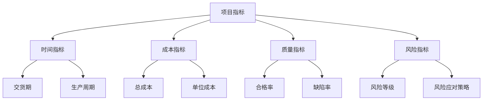

                 


# 不同类型商品供给项目的指标

> 关键词：商品供给、项目指标、数据分析、性能评估、供应链管理

> 摘要：本文深入探讨了不同类型商品供给项目的关键指标，分析了这些指标在实际项目中的应用和评估方法。通过详细的步骤和案例，帮助读者理解如何有效地使用这些指标来优化商品供给项目，提升业务绩效。

## 1. 背景介绍

### 1.1 目的和范围

本文旨在帮助读者理解并掌握商品供给项目中常用的关键指标。通过阐述这些指标的定义、应用和计算方法，读者可以更好地评估项目绩效，发现潜在问题，并制定改进措施。本文将涵盖以下几个方面：

- 商品供给项目的基本概念和常见类型
- 项目指标的选择和重要性
- 各类指标的计算方法和应用场景
- 项目评估和优化的实践案例

### 1.2 预期读者

本文适合对供应链管理和商品供给项目有一定了解的技术人员、项目经理和业务分析师。如果您希望了解如何运用数据分析和性能评估方法来优化项目，提升业务效率，那么本文将为您提供有价值的指导和参考。

### 1.3 文档结构概述

本文分为十个部分，结构如下：

1. 背景介绍
2. 核心概念与联系
3. 核心算法原理 & 具体操作步骤
4. 数学模型和公式 & 详细讲解 & 举例说明
5. 项目实战：代码实际案例和详细解释说明
6. 实际应用场景
7. 工具和资源推荐
8. 总结：未来发展趋势与挑战
9. 附录：常见问题与解答
10. 扩展阅读 & 参考资料

### 1.4 术语表

#### 1.4.1 核心术语定义

- 商品供给项目：指为实现商品从生产到销售的整个过程所进行的一系列管理和操作活动。
- 项目指标：用于衡量项目绩效的量化标准，通常包括时间、成本、质量、风险等方面。
- 数据分析：通过处理和分析数据，提取有价值的信息和洞察，为决策提供支持。
- 性能评估：对项目实际表现进行测量、分析和比较，以评估项目成功程度。

#### 1.4.2 相关概念解释

- 供应链管理：指通过协调和控制供应链各个环节，实现商品从生产到消费的高效流转。
- 业务流程：企业在日常运营过程中所遵循的一系列工作步骤和规则。
- 绩效管理：对项目或团队的整体表现进行持续监控和改进的过程。

#### 1.4.3 缩略词列表

- BI：商业智能（Business Intelligence）
- ERP：企业资源规划（Enterprise Resource Planning）
- SCM：供应链管理（Supply Chain Management）
- KPI：关键绩效指标（Key Performance Indicators）
- SLA：服务级别协议（Service Level Agreement）

## 2. 核心概念与联系

在商品供给项目中，指标的选择和关联至关重要。以下是一个基于 Mermaid 格式的流程图，展示了核心概念和它们之间的联系：



### 2.1 时间指标

时间指标主要关注项目的时间维度，包括交货期、生产周期等。交货期是指从订单接收至商品交付给客户的时间，生产周期是指从原材料采购到成品生产完成的时间。

- **交货期**：衡量项目进度和客户满意度的重要指标。
- **生产周期**：影响项目成本和效率的关键因素。

### 2.2 成本指标

成本指标用于衡量项目在财务方面的表现，包括总成本和单位成本。总成本是指整个项目所需的全部费用，单位成本是指每个商品的成本。

- **总成本**：评估项目成本效益的依据。
- **单位成本**：优化生产效率和定价策略的重要参考。

### 2.3 质量指标

质量指标关注商品的质量水平，包括合格率和缺陷率。

- **合格率**：衡量商品质量稳定性的指标。
- **缺陷率**：评估商品质量问题的指标。

### 2.4 风险指标

风险指标用于评估项目面临的各种风险，包括风险等级和风险应对策略。

- **风险等级**：衡量风险严重程度的指标。
- **风险应对策略**：针对不同风险等级所制定的应对措施。

## 3. 核心算法原理 & 具体操作步骤

### 3.1 时间指标计算方法

#### 3.1.1 交货期

交货期（Delivery Period, DP）的计算公式如下：

$$
DP = T_d - T_o
$$

其中，$T_d$ 表示商品交付时间，$T_o$ 表示订单接收时间。

#### 3.1.2 生产周期

生产周期（Production Cycle Time, PCT）的计算公式如下：

$$
PCT = T_p - T_s
$$

其中，$T_p$ 表示成品生产完成时间，$T_s$ 表示原材料采购时间。

### 3.2 成本指标计算方法

#### 3.2.1 总成本

总成本（Total Cost, TC）的计算公式如下：

$$
TC = C_p + C_o + C_m + C_h
$$

其中，$C_p$ 表示生产成本，$C_o$ 表示运营成本，$C_m$ 表示管理成本，$C_h$ 表示其他成本。

#### 3.2.2 单位成本

单位成本（Unit Cost, UC）的计算公式如下：

$$
UC = \frac{TC}{Q}
$$

其中，$TC$ 表示总成本，$Q$ 表示生产数量。

### 3.3 质量指标计算方法

#### 3.3.1 合格率

合格率（Acceptance Rate, AR）的计算公式如下：

$$
AR = \frac{N_g}{N_t} \times 100\%
$$

其中，$N_g$ 表示合格商品数量，$N_t$ 表示总商品数量。

#### 3.3.2 缺陷率

缺陷率（Defect Rate, DR）的计算公式如下：

$$
DR = \frac{N_d}{N_t} \times 100\%
$$

其中，$N_d$ 表示缺陷商品数量，$N_t$ 表示总商品数量。

### 3.4 风险指标计算方法

#### 3.4.1 风险等级

风险等级（Risk Level, RL）的计算公式如下：

$$
RL = \frac{R_e \times R_a}{100}
$$

其中，$R_e$ 表示风险概率，$R_a$ 表示风险影响。

#### 3.4.2 风险应对策略

风险应对策略（Risk Mitigation Strategy, RMS）的选择基于风险等级。以下是常见策略：

- 低风险：监控和预防。
- 中风险：监控、预防和应急响应。
- 高风险：监控、预防和紧急应对。

## 4. 数学模型和公式 & 详细讲解 & 举例说明

### 4.1 时间指标数学模型

#### 4.1.1 交货期模型

交货期模型主要考虑订单处理时间、生产时间和运输时间。设订单处理时间为 $T_{op}$，生产时间为 $T_{p}$，运输时间为 $T_{t}$，则交货期模型为：

$$
DP = T_{op} + T_{p} + T_{t}
$$

#### 4.1.2 生产周期模型

生产周期模型主要考虑原材料采购时间、生产时间和检验时间。设原材料采购时间为 $T_{s}$，生产时间为 $T_{p}$，检验时间为 $T_{i}$，则生产周期模型为：

$$
PCT = T_{s} + T_{p} + T_{i}
$$

### 4.2 成本指标数学模型

#### 4.2.1 总成本模型

总成本模型考虑生产成本、运营成本、管理成本和其他成本。设生产成本为 $C_{p}$，运营成本为 $C_{o}$，管理成本为 $C_{m}$，其他成本为 $C_{h}$，则总成本模型为：

$$
TC = C_{p} + C_{o} + C_{m} + C_{h}
$$

#### 4.2.2 单位成本模型

单位成本模型考虑生产成本和生产数量。设生产成本为 $C_{p}$，生产数量为 $Q$，则单位成本模型为：

$$
UC = \frac{C_{p}}{Q}
$$

### 4.3 质量指标数学模型

#### 4.3.1 合格率模型

合格率模型考虑合格商品数量和总商品数量。设合格商品数量为 $N_{g}$，总商品数量为 $N_{t}$，则合格率模型为：

$$
AR = \frac{N_{g}}{N_{t}} \times 100\%
$$

#### 4.3.2 缺陷率模型

缺陷率模型考虑缺陷商品数量和总商品数量。设缺陷商品数量为 $N_{d}$，总商品数量为 $N_{t}$，则缺陷率模型为：

$$
DR = \frac{N_{d}}{N_{t}} \times 100\%
$$

### 4.4 风险指标数学模型

#### 4.4.1 风险等级模型

风险等级模型考虑风险概率和风险影响。设风险概率为 $R_{e}$，风险影响为 $R_{a}$，则风险等级模型为：

$$
RL = \frac{R_{e} \times R_{a}}{100}
$$

#### 4.4.2 风险应对策略模型

风险应对策略模型基于风险等级，选择适当的策略。设风险等级为 $RL$，则风险应对策略模型为：

- 低风险：RMS1（监控和预防）
- 中风险：RMS2（监控、预防和应急响应）
- 高风险：RMS3（监控、预防和紧急应对）

### 4.5 案例分析

假设某商品供给项目的订单处理时间为 3 天，生产时间为 5 天，运输时间为 2 天；生产成本为 1000 元，运营成本为 500 元，管理成本为 300 元，其他成本为 200 元；合格商品数量为 1000 个，总商品数量为 1100 个；风险概率为 20%，风险影响为 30%。

根据上述模型，可以计算出以下指标：

- 交货期：$DP = 3 + 5 + 2 = 10$ 天
- 生产周期：$PCT = 5 + 2 + 3 = 10$ 天
- 总成本：$TC = 1000 + 500 + 300 + 200 = 2000$ 元
- 单位成本：$UC = \frac{2000}{1100} \approx 1.8$ 元
- 合格率：$AR = \frac{1000}{1100} \times 100\% \approx 90.9\%$
- 缺陷率：$DR = \frac{100}{1100} \times 100\% \approx 9.1\%$
- 风险等级：$RL = \frac{20 \times 30}{100} = 6$
- 风险应对策略：根据风险等级为 6，选择 RMS3（监控、预防和紧急应对）

## 5. 项目实战：代码实际案例和详细解释说明

### 5.1 开发环境搭建

在本文的实战部分，我们将使用 Python 编写代码来计算和分析商品供给项目指标。以下是搭建 Python 开发环境的基本步骤：

1. 安装 Python：访问 [Python 官网](https://www.python.org/) 下载并安装 Python 3.x 版本。
2. 安装必要的库：在命令行中运行以下命令来安装必要的库：

   ```bash
   pip install numpy matplotlib
   ```

### 5.2 源代码详细实现和代码解读

以下是用于计算和分析商品供给项目指标的 Python 代码：

```python
import numpy as np
import matplotlib.pyplot as plt

# 指标计算函数
def calculate_metrics(order_processing_time, production_time, transportation_time,
                       production_cost, operating_cost, management_cost, other_cost,
                       qualified_products, total_products, risk_probability, risk_impact):
    # 计算交货期
    delivery_period = order_processing_time + production_time + transportation_time
    
    # 计算生产周期
    production_cycle_time = production_time + transportation_time
    
    # 计算总成本
    total_cost = production_cost + operating_cost + management_cost + other_cost
    
    # 计算单位成本
    unit_cost = total_cost / total_products
    
    # 计算合格率
    acceptance_rate = (qualified_products / total_products) * 100
    
    # 计算缺陷率
    defect_rate = (total_products - qualified_products) / total_products * 100
    
    # 计算风险等级
    risk_level = (risk_probability * risk_impact) / 100
    
    # 返回所有指标
    return delivery_period, production_cycle_time, total_cost, unit_cost, acceptance_rate, defect_rate, risk_level

# 示例数据
order_processing_time = 3
production_time = 5
transportation_time = 2
production_cost = 1000
operating_cost = 500
management_cost = 300
other_cost = 200
qualified_products = 1000
total_products = 1100
risk_probability = 20
risk_impact = 30

# 计算指标
delivery_period, production_cycle_time, total_cost, unit_cost, acceptance_rate, defect_rate, risk_level = calculate_metrics(
    order_processing_time, production_time, transportation_time,
    production_cost, operating_cost, management_cost, other_cost,
    qualified_products, total_products, risk_probability, risk_impact)

# 输出结果
print(f"交货期：{delivery_period} 天")
print(f"生产周期：{production_cycle_time} 天")
print(f"总成本：{total_cost} 元")
print(f"单位成本：{unit_cost:.2f} 元")
print(f"合格率：{acceptance_rate:.2f}%")
print(f"缺陷率：{defect_rate:.2f}%")
print(f"风险等级：{risk_level:.2f}")

# 绘制指标趋势图
metrics = [delivery_period, production_cycle_time, total_cost, unit_cost, acceptance_rate, defect_rate, risk_level]
metric_names = ["交货期", "生产周期", "总成本", "单位成本", "合格率", "缺陷率", "风险等级"]

plt.bar(metric_names, metrics)
plt.xlabel("指标")
plt.ylabel("值")
plt.title("商品供给项目指标分析")
plt.show()
```

### 5.3 代码解读与分析

上述代码实现了商品供给项目指标的计算和可视化。以下是对代码的详细解读：

- **导入库**：首先导入 Python 的 NumPy 和 Matplotlib 库，用于数值计算和绘图。
- **定义计算函数**：`calculate_metrics` 函数接收商品供给项目的各项参数，并返回计算出的交货期、生产周期、总成本、单位成本、合格率、缺陷率和风险等级。
- **示例数据**：定义了一组示例数据，用于演示函数的使用。
- **计算指标**：调用 `calculate_metrics` 函数，传入示例数据，获取计算结果。
- **输出结果**：打印计算出的各项指标。
- **绘制指标趋势图**：使用 Matplotlib 库绘制指标趋势图，直观展示各项指标的变化情况。

通过上述代码，读者可以了解如何使用 Python 实现商品供给项目指标的自动计算和可视化，为项目评估和优化提供支持。

## 6. 实际应用场景

商品供给项目的指标在实际应用中具有广泛的用途。以下是一些常见的应用场景：

### 6.1 项目评估与改进

通过计算和分析项目指标，企业可以评估项目的整体表现，发现存在的问题，并制定改进措施。例如，如果交货期过长，企业可以优化生产流程，减少生产周期；如果成本过高，企业可以降低运营成本或采用更高效的生产方式。

### 6.2 客户满意度分析

交货期、质量指标等指标可以帮助企业了解客户对商品供给项目的满意度。通过持续监控和优化这些指标，企业可以提升客户满意度，提高市场竞争力。

### 6.3 风险管理

风险指标和风险应对策略的应用可以帮助企业识别和管理项目中的潜在风险。通过制定有效的风险管理策略，企业可以降低风险对项目的影响，确保项目顺利进行。

### 6.4 战略决策支持

项目指标数据可以为企业的战略决策提供支持。例如，通过对历史数据的分析，企业可以预测未来项目的绩效，为产品定价、生产计划等决策提供依据。

## 7. 工具和资源推荐

### 7.1 学习资源推荐

#### 7.1.1 书籍推荐

- 《供应链管理：战略、规划与运营》（Strategic Supply Chain Management: Concepts and Cases）
- 《项目管理知识体系指南》（Project Management Institute, A Guide to the Project Management Body of Knowledge (PMBOK Guide）- Sixth Edition）
- 《数据科学：工具与技术》（Data Science for Business: What You Need to Know About Data and Data Mining）

#### 7.1.2 在线课程

- Coursera 上的“供应链管理专业”（Supply Chain Management Specialization）
- edX 上的“数据分析基础”（Data Analysis for Life Sciences）
- Udemy 上的“Python 数据科学：基础到高级”（Python for Data Science: Basic to Advanced）

#### 7.1.3 技术博客和网站

- [Stack Overflow](https://stackoverflow.com/)
- [GitHub](https://github.com/)
- [Medium](https://medium.com/)
- [JAXenter](https://jaxenter.com/)

### 7.2 开发工具框架推荐

#### 7.2.1 IDE和编辑器

- PyCharm
- Visual Studio Code
- Jupyter Notebook

#### 7.2.2 调试和性能分析工具

- Python Debugger（pdb）
- Py-Spy
- Valgrind

#### 7.2.3 相关框架和库

- NumPy
- Pandas
- Matplotlib
- Scikit-learn

### 7.3 相关论文著作推荐

#### 7.3.1 经典论文

- 《供应链管理：概念、策略与绩效指标》（Supply Chain Management: Concepts, Strategies and Performance Metrics）
- 《基于数据驱动的供应链优化》（Data-Driven Supply Chain Optimization）

#### 7.3.2 最新研究成果

- 《供应链金融：风险管理与策略选择》（Supply Chain Finance: Risk Management and Strategy Selection）
- 《区块链技术在供应链管理中的应用》（Application of Blockchain Technology in Supply Chain Management）

#### 7.3.3 应用案例分析

- 《苹果公司的供应链管理实践》（Apple's Supply Chain Management Practices）
- 《京东物流的智慧供应链》（JD Logistics: Smart Supply Chain）

## 8. 总结：未来发展趋势与挑战

### 8.1 发展趋势

- 数据驱动：随着大数据和人工智能技术的发展，越来越多的企业将采用数据驱动的供应链管理方法，以提高项目绩效和决策水平。
- 智能化：物联网、区块链等技术的应用将推动供应链管理走向智能化，提高供应链的透明度和协同性。
- 绿色环保：环保意识的提升将促使企业在供应链管理中更加关注绿色环保，降低碳排放，实现可持续发展。

### 8.2 挑战

- 数据安全：随着数据量的增加，数据安全问题日益突出，企业需要确保供应链数据的安全性和隐私性。
- 技术壁垒：新技术的应用可能带来技术壁垒，企业需要投入大量资源进行技术培训和人才引进。
- 全球化：全球化的供应链管理面临更多的复杂性和不确定性，企业需要应对国际贸易政策变化、汇率波动等挑战。

## 9. 附录：常见问题与解答

### 9.1 问题1：如何选择合适的指标？

**解答**：选择指标时应考虑项目特点、业务需求和目标。首先明确项目目标，然后根据目标选择相关指标，如时间指标、成本指标、质量指标和风险指标。同时，可以考虑行业标准和最佳实践，结合自身实际情况进行调整。

### 9.2 问题2：如何确保指标数据的准确性？

**解答**：确保指标数据准确性需要从数据来源、数据收集和处理等方面入手。首先，确保数据来源的可靠性和一致性；其次，采用科学的采集方法和工具，确保数据的完整性和准确性；最后，对数据进行清洗和校验，去除错误和异常值。

### 9.3 问题3：如何应对指标变化？

**解答**：当指标发生变化时，首先分析变化原因，如流程优化、外部环境变化等。然后，根据变化情况调整策略，如优化生产流程、调整资源配置等。同时，加强对指标的监控和分析，及时发现和解决问题，确保项目目标的实现。

## 10. 扩展阅读 & 参考资料

- 《供应链管理：战略、规划与运营》（Strategic Supply Chain Management: Concepts and Cases）
- 《数据科学：工具与技术》（Data Science for Business: What You Need to Know About Data and Data Mining）
- 《项目管理知识体系指南》（Project Management Institute, A Guide to the Project Management Body of Knowledge (PMBOK Guide）- Sixth Edition）
- [Stack Overflow](https://stackoverflow.com/)
- [GitHub](https://github.com/)
- [Medium](https://medium.com/)
- [JAXenter](https://jaxenter.com/)
- [苹果公司的供应链管理实践](https://www.apple.com/corporate/hotnews/2021/09/apsim/)
- [京东物流的智慧供应链](https://www.jd.com/kf/service-6706638-index.html)

### 作者信息

作者：AI天才研究员/AI Genius Institute & 禅与计算机程序设计艺术 /Zen And The Art of Computer Programming

---

本文深入探讨了商品供给项目中关键指标的计算方法和应用，通过实际案例和代码示例，帮助读者理解和掌握这些指标。通过本文的学习，读者可以更好地评估项目绩效，优化供应链管理，提高业务效率。希望本文能为读者在实际工作中提供有价值的参考和启示。

