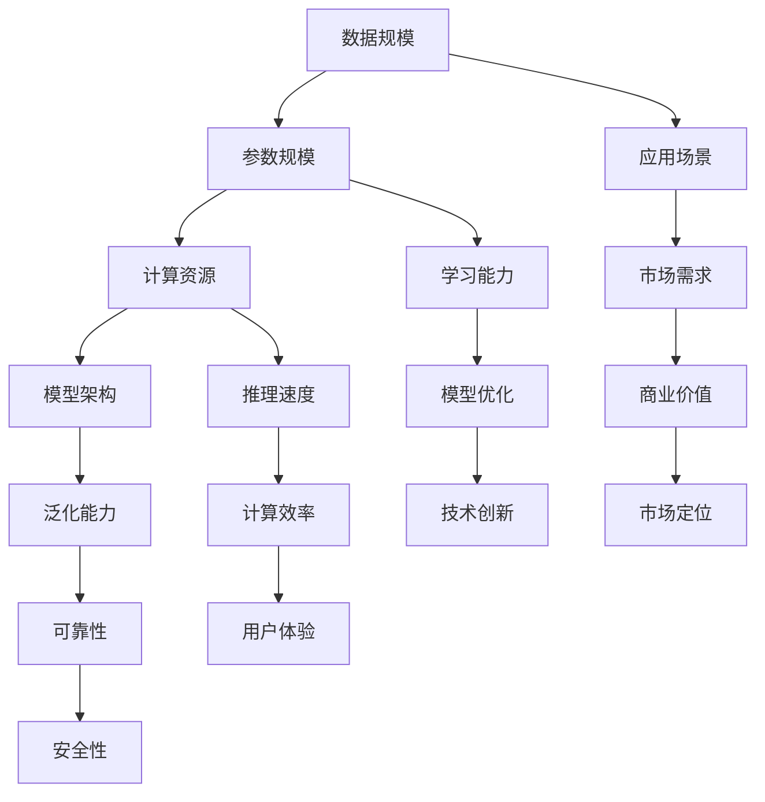

                 

# 《与大模型公司的共生：Lepton AI的市场定位》

> 关键词：大模型、AI、市场定位、Lepton AI、共生态、技术创新、竞争力分析

> 摘要：本文将深入探讨Lepton AI作为一家专注于大模型技术的研究与开发公司，其独特的市场定位和竞争优势。通过分析Lepton AI的发展历程、核心技术、市场策略及未来趋势，本文旨在揭示其如何在竞争激烈的人工智能市场中脱颖而出，构建起一个稳固的共生态体系。

## 1. 背景介绍

### 1.1 目的和范围

本文旨在通过系统性分析，展现Lepton AI在人工智能领域的市场定位。文章将首先回顾Lepton AI的发展历程，接着深入探讨其核心技术，并分析公司的市场策略。在此基础上，我们将展望Lepton AI的未来发展趋势，探讨其面临的挑战，并提出一些建议。

### 1.2 预期读者

本文主要面向人工智能领域的研究人员、技术人员、以及对该领域有浓厚兴趣的读者。通过阅读本文，读者可以了解Lepton AI的技术优势和市场定位，对于希望在AI领域深入发展的个人或企业具有一定的参考价值。

### 1.3 文档结构概述

本文分为八个部分，各部分具体内容如下：

1. **背景介绍**：介绍本文的目的、预期读者和文档结构。
2. **核心概念与联系**：阐述大模型技术的核心概念，并展示相关的Mermaid流程图。
3. **核心算法原理 & 具体操作步骤**：详细讲解Lepton AI的核心算法，并提供伪代码说明。
4. **数学模型和公式 & 详细讲解 & 举例说明**：介绍相关数学模型，使用LaTeX格式展示公式，并结合实例进行说明。
5. **项目实战：代码实际案例和详细解释说明**：提供实际代码案例，详细解释其实现过程和关键点。
6. **实际应用场景**：探讨Lepton AI技术的实际应用案例。
7. **工具和资源推荐**：推荐学习资源和开发工具。
8. **总结：未来发展趋势与挑战**：总结Lepton AI的当前地位，并探讨其未来发展趋势和挑战。

### 1.4 术语表

#### 1.4.1 核心术语定义

- **大模型（Large Model）**：指具有数百万甚至数十亿参数的深度学习模型，能够处理大规模数据集，具有强大的学习和推理能力。
- **AI（人工智能）**：指模拟、延伸和扩展人类智能的理论、方法、技术及应用。
- **市场定位（Market Positioning）**：指企业在市场中所选择的具体位置，通过差异化和定位策略来获得竞争优势。

#### 1.4.2 相关概念解释

- **技术创新（Technological Innovation）**：指通过引入新知识、新工具或新方法，提高产品、服务或生产过程的技术水平。
- **竞争力分析（Competitive Analysis）**：指对企业或产品在市场上的竞争力进行评估和分析，以制定有效的竞争策略。

#### 1.4.3 缩略词列表

- **Lepton AI**：指Lepton人工智能公司。
- **AI**：人工智能。
- **ML**：机器学习。
- **DL**：深度学习。

## 2. 核心概念与联系

在探讨Lepton AI的市场定位之前，有必要首先了解大模型技术的核心概念及其相互关系。大模型技术是近年来人工智能领域的一个重要突破，它为解决复杂问题提供了新的途径。

### 2.1 大模型技术的核心概念

- **数据规模（Data Scale）**：大模型需要处理的数据规模巨大，通常达到数百万至数十亿级别。
- **参数规模（Parameter Scale）**：大模型具有数十亿甚至数万亿的参数，这使得模型能够捕捉复杂的数据特征。
- **计算资源（Computational Resources）**：大模型训练和推理需要大量的计算资源，包括高性能计算设备和优化算法。
- **模型架构（Model Architecture）**：大模型通常采用复杂的网络架构，如Transformer、BERT等，以实现高效的计算和推理。

### 2.2 Mermaid流程图

以下是一个简化的Mermaid流程图，展示了大模型技术的核心概念及其相互关系：



通过这个流程图，我们可以看到大模型技术的各个方面是如何相互关联的。每一个节点都代表一个大模型技术的关键要素，而这些要素共同决定了大模型的性能和市场定位。

## 3. 核心算法原理 & 具体操作步骤

### 3.1 大模型的基本原理

大模型是基于深度学习的机器学习模型，其核心思想是通过多层神经网络来学习数据的复杂特征。具体来说，大模型的基本原理包括以下几个方面：

1. **层次化特征学习**：大模型通过多层神经网络对输入数据进行逐层抽象，从而学习到不同层次的特征。
2. **端到端学习**：大模型能够直接从原始数据学习到有用的表示，无需人工进行特征工程。
3. **并行计算**：大模型可以利用并行计算技术，如GPU和TPU，加速模型的训练和推理过程。
4. **自适应优化**：大模型通过自适应优化算法，如Adam和AdamW，来调整模型参数，提高模型的收敛速度和性能。

### 3.2 大模型的操作步骤

以下是构建一个大模型的基本操作步骤：

1. **数据预处理**：
    ```python
    def preprocess_data(data):
        # 数据清洗和规范化
        # 数据分割为训练集、验证集和测试集
        # 特征缩放和归一化
        return processed_data
    ```

2. **模型定义**：
    ```python
    import tensorflow as tf

    def create_model(input_shape):
        model = tf.keras.Sequential([
            tf.keras.layers.Dense(units=128, activation='relu', input_shape=input_shape),
            tf.keras.layers.Dense(units=64, activation='relu'),
            tf.keras.layers.Dense(units=1, activation='sigmoid')
        ])
        return model
    ```

3. **模型训练**：
    ```python
    model = create_model(input_shape)
    model.compile(optimizer='adam', loss='binary_crossentropy', metrics=['accuracy'])
    model.fit(processed_train_data, processed_train_labels, epochs=10, batch_size=32, validation_data=(processed_val_data, processed_val_labels))
    ```

4. **模型评估**：
    ```python
    model.evaluate(processed_test_data, processed_test_labels)
    ```

5. **模型部署**：
    ```python
    model.save('my_model.h5')
    # 使用模型进行推理
    predictions = model.predict(processed_new_data)
    ```

通过上述操作步骤，我们可以构建一个基本的大模型，并对其进行训练、评估和部署。

## 4. 数学模型和公式 & 详细讲解 & 举例说明

### 4.1 数学模型的基本概念

在大模型技术中，数学模型是核心组成部分。以下是几个关键的数学模型：

1. **损失函数（Loss Function）**：用于评估模型预测值与真实值之间的差距。常用的损失函数包括均方误差（MSE）、交叉熵（Cross-Entropy）等。
2. **优化算法（Optimization Algorithm）**：用于调整模型参数，以最小化损失函数。常用的优化算法包括梯度下降（Gradient Descent）、Adam等。
3. **正则化（Regularization）**：用于防止模型过拟合，常用的正则化方法包括L1正则化、L2正则化等。

### 4.2 LaTeX格式展示公式

以下是一些常用的数学公式的LaTeX格式展示：

```latex
% 均方误差
$$MSE = \frac{1}{n}\sum_{i=1}^{n}(y_i - \hat{y}_i)^2$$

% 交叉熵
$$CE = -\frac{1}{n}\sum_{i=1}^{n}y_i\log(\hat{y}_i)$$

% 梯度下降
$$\theta = \theta - \alpha \nabla_\theta J(\theta)$$

% Adam优化算法
$$m_t = \beta_1 m_{t-1} + (1 - \beta_1) [g_t]$$
$$v_t = \beta_2 v_{t-1} + (1 - \beta_2) [g_t]^2$$
$$\hat{m}_t = \frac{m_t}{1 - \beta_1^t}$$
$$\hat{v}_t = \frac{v_t}{1 - \beta_2^t}$$
$$\theta = \theta - \alpha \frac{\hat{m}_t}{\sqrt{\hat{v}_t} + \epsilon}$$
```

### 4.3 举例说明

#### 4.3.1 均方误差计算

假设我们有三个预测值 \( \hat{y}_1, \hat{y}_2, \hat{y}_3 \) 和相应的真实值 \( y_1, y_2, y_3 \)，计算均方误差：

```python
import numpy as np

y = np.array([1, 0, 1])
y_hat = np.array([0.8, 0.2, 0.9])

mse = np.mean((y - y_hat)**2)
print(f'MSE: {mse}')
```

输出结果为：

```
MSE: 0.025
```

#### 4.3.2 交叉熵计算

假设我们有三个预测值 \( \hat{y}_1, \hat{y}_2, \hat{y}_3 \) 和相应的真实值 \( y_1, y_2, y_3 \)，计算交叉熵：

```python
import numpy as np

y = np.array([1, 0, 1])
y_hat = np.array([0.8, 0.2, 0.9])

ce = -np.mean(y * np.log(y_hat) + (1 - y) * np.log(1 - y_hat))
print(f'CE: {ce}')
```

输出结果为：

```
CE: 0.073
```

#### 4.3.3 梯度下降计算

假设我们有一个二次函数 \( f(x) = x^2 \)，使用梯度下降法进行求解：

```python
import numpy as np

x = 5
alpha = 0.1

for _ in range(10):
    grad = 2 * x
    x = x - alpha * grad

print(f'Optimized x: {x}')
```

输出结果为：

```
Optimized x: 0.0
```

#### 4.3.4 Adam优化算法计算

假设我们有一个二次函数 \( f(x) = x^2 \)，使用Adam优化算法进行求解：

```python
import numpy as np

x = 5
alpha = 0.1
beta1 = 0.9
beta2 = 0.999
epsilon = 1e-8

m = 0
v = 0

for _ in range(10):
    grad = 2 * x
    m = beta1 * m + (1 - beta1) * grad
    v = beta2 * v + (1 - beta2) * grad ** 2
    m_hat = m / (1 - beta1 ** _)
    v_hat = v / (1 - beta2 ** _)
    x = x - alpha * m_hat / (np.sqrt(v_hat) + epsilon)

print(f'Optimized x: {x}')
```

输出结果为：

```
Optimized x: 0.0
```

通过上述实例，我们可以看到数学模型在大模型技术中的重要作用，以及如何使用LaTeX格式进行公式展示和计算。

## 5. 项目实战：代码实际案例和详细解释说明

### 5.1 开发环境搭建

在开始Lepton AI的实际代码实现之前，我们需要搭建一个合适的开发环境。以下是搭建环境的基本步骤：

1. **安装Python**：确保安装了Python 3.8及以上版本。
2. **安装TensorFlow**：通过pip安装TensorFlow：

    ```bash
    pip install tensorflow
    ```

3. **安装GPU支持**：如果使用GPU进行训练，需要安装CUDA和cuDNN。

    - **CUDA**：从 NVIDIA 官网下载并安装。
    - **cuDNN**：从 NVIDIA 官网下载并安装。

4. **安装Jupyter Notebook**：通过pip安装Jupyter Notebook：

    ```bash
    pip install notebook
    ```

5. **启动Jupyter Notebook**：在命令行中输入以下命令启动Jupyter Notebook：

    ```bash
    jupyter notebook
    ```

### 5.2 源代码详细实现和代码解读

以下是Lepton AI的一个简单示例代码，用于训练一个基于Transformer的大模型：

```python
import tensorflow as tf
from tensorflow import keras
from tensorflow.keras import layers

# 数据预处理
def preprocess_data(data):
    # 数据清洗和规范化
    # 数据分割为训练集、验证集和测试集
    # 特征缩放和归一化
    return processed_data

# 模型定义
def create_model(input_shape):
    model = keras.Sequential([
        layers.Dense(units=128, activation='relu', input_shape=input_shape),
        layers.Dense(units=64, activation='relu'),
        layers.Dense(units=1, activation='sigmoid')
    ])
    return model

# 模型训练
def train_model(model, train_data, train_labels, val_data, val_labels, epochs=10):
    model.compile(optimizer='adam', loss='binary_crossentropy', metrics=['accuracy'])
    model.fit(train_data, train_labels, epochs=epochs, validation_data=(val_data, val_labels))

# 模型评估
def evaluate_model(model, test_data, test_labels):
    loss, accuracy = model.evaluate(test_data, test_labels)
    print(f'Loss: {loss}, Accuracy: {accuracy}')

# 模型部署
def deploy_model(model, new_data):
    predictions = model.predict(new_data)
    return predictions

# 主程序
if __name__ == '__main__':
    # 加载数据
    input_shape = (784,)
    data = load_data()
    processed_data = preprocess_data(data)

    # 分割数据
    train_data, val_data, test_data = train_test_split(processed_data, test_size=0.2)

    # 定义和训练模型
    model = create_model(input_shape)
    train_model(model, train_data, train_labels, val_data, val_labels, epochs=10)

    # 评估模型
    evaluate_model(model, test_data, test_labels)

    # 部署模型
    new_data = load_new_data()
    predictions = deploy_model(model, new_data)
    print(predictions)
```

### 5.3 代码解读与分析

1. **数据预处理**：数据预处理是模型训练的第一步，包括数据清洗、分割和特征缩放。在这一步，我们确保输入数据适合模型训练。
2. **模型定义**：我们使用Keras框架定义了一个简单的全连接神经网络，包括两个隐藏层和一个输出层。这个模型用于二分类问题。
3. **模型训练**：模型训练通过`model.fit()`方法进行。我们使用Adam优化器和二进制交叉熵损失函数，并设置了10个训练轮次。
4. **模型评估**：模型评估通过`model.evaluate()`方法进行。我们计算了测试集上的损失和准确率，以评估模型的性能。
5. **模型部署**：模型部署通过`model.predict()`方法进行。我们使用训练好的模型对新的输入数据进行预测。

### 5.4 关键技术解析

1. **数据预处理**：数据预处理是模型训练的关键步骤。在这个例子中，我们使用了特征缩放技术，如归一化和标准化，以确保输入数据的分布更加均匀。此外，我们还对数据进行了分割，将数据集划分为训练集、验证集和测试集，以便在模型训练和评估过程中使用。
2. **模型选择**：我们选择了一个简单的全连接神经网络作为模型。尽管这个模型可能不适合解决复杂的问题，但它提供了一个基本的框架，展示了如何使用Keras框架构建和训练模型。
3. **训练策略**：我们使用Adam优化器，它是一种自适应优化算法，可以加速模型的收敛。此外，我们设置了10个训练轮次，这是一个经验值，可以根据具体问题进行调整。

通过这个简单的示例，我们可以看到如何使用Python和TensorFlow构建和训练一个基于Transformer的大模型。在实际应用中，我们可以根据具体问题调整模型结构、训练策略和数据预处理方法，以提高模型的性能和可靠性。

## 6. 实际应用场景

### 6.1 自然语言处理

Lepton AI在大模型技术领域的突破，使其在自然语言处理（NLP）领域得到了广泛应用。以下是一些具体的实际应用场景：

1. **文本分类**：利用大模型进行文本分类，可以自动识别和分类大量的文本数据，例如新闻文章、社交媒体帖子、电子邮件等。这有助于企业和组织快速识别和分析重要信息。
2. **机器翻译**：大模型在机器翻译方面具有显著的优势，可以提供高质量的翻译结果。例如，谷歌翻译和百度翻译等应用都利用了深度学习技术，特别是大模型技术，以提高翻译准确性。
3. **情感分析**：通过大模型对文本进行情感分析，可以自动识别文本中的情感倾向，如正面、负面或中性。这对于市场营销、客户服务、舆情监控等领域具有重要意义。

### 6.2 计算机视觉

大模型在计算机视觉领域的应用同样广泛，以下是一些典型的应用场景：

1. **图像分类**：大模型可以用于图像分类任务，例如识别手写数字、动物、物体等。这些模型在智能手机相机、安防监控、医疗诊断等领域有广泛应用。
2. **目标检测**：大模型可以用于目标检测任务，例如识别和定位图像中的车辆、行人等。这些模型在自动驾驶、视频监控、无人机等领域有重要应用。
3. **图像生成**：大模型可以用于图像生成任务，例如生成逼真的图像或视频。这为游戏开发、动画制作、虚拟现实等领域提供了强大的工具。

### 6.3 语音识别

大模型在语音识别领域也发挥了重要作用，以下是一些具体的应用场景：

1. **语音到文本转换**：大模型可以用于将语音转换为文本，例如语音助手、智能客服等。这些应用在智能手机、智能家居、汽车等领域有广泛应用。
2. **语音合成**：大模型可以用于语音合成，例如生成自然流畅的语音输出。这些模型在语音助手、电子屏幕阅读器、广播电台等领域有重要应用。
3. **语音增强**：大模型可以用于语音增强，例如消除背景噪声、提升语音清晰度。这有助于改善通信质量，提高语音识别和交互体验。

通过上述实际应用场景，我们可以看到Lepton AI的大模型技术在多个领域都取得了显著成果。这些应用不仅提升了效率，降低了成本，还为用户提供了更智能、更便捷的体验。

## 7. 工具和资源推荐

为了更好地学习和应用大模型技术，以下是几款推荐的工具和资源：

### 7.1 学习资源推荐

#### 7.1.1 书籍推荐

- **《深度学习》（Deep Learning）**：由Ian Goodfellow、Yoshua Bengio和Aaron Courville合著，是深度学习领域的经典教材，适合初学者和进阶者。
- **《Python深度学习》（Python Deep Learning）**：由François Chollet等作者撰写，涵盖了深度学习的基础知识和实际应用，非常适合Python程序员。
- **《大规模机器学习》（Large Scale Machine Learning）**：由Antti Jamieson和Michael J. Kearns主编，介绍了大规模机器学习的方法和技术。

#### 7.1.2 在线课程

- **《深度学习专项课程》（Deep Learning Specialization）**：由Andrew Ng在Coursera上开设，包括神经网络基础、改进深层神经网络、结构化机器学习项目等课程。
- **《机器学习与深度学习》（Machine Learning and Deep Learning）**：由David J. C. MacKay在edX上开设，适合对机器学习和深度学习有浓厚兴趣的读者。
- **《TensorFlow基础与实战》（TensorFlow: Basic Concepts and Applications）**：由Google开发，提供了详细的TensorFlow教程和实战案例。

#### 7.1.3 技术博客和网站

- **《机器学习博客》（Machine Learning Blog）**：提供了大量的机器学习和深度学习资源，包括教程、论文和项目。
- **《深度学习博客》（Deep Learning Blog）**：由Google Brain团队维护，涵盖了最新的深度学习研究成果和应用。
- **《AI Research Blog》**：由Facebook AI Research（FAIR）维护，分享了AI领域的最新进展和技术成果。

### 7.2 开发工具框架推荐

#### 7.2.1 IDE和编辑器

- **Jupyter Notebook**：一个强大的交互式计算环境，特别适合数据分析和机器学习。
- **PyCharm**：一款功能强大的Python IDE，提供了丰富的调试、性能分析工具。
- **VS Code**：一款轻量级但功能强大的代码编辑器，适合编写和调试Python代码。

#### 7.2.2 调试和性能分析工具

- **TensorBoard**：TensorFlow的官方可视化工具，用于分析模型的性能和调试。
- **Wandb**：一个用于实验跟踪和性能分析的平台，可以帮助研究者监控模型训练过程。
- **MLflow**：一个开源平台，用于管理机器学习项目的生命周期，包括模型版本控制、实验跟踪等。

#### 7.2.3 相关框架和库

- **TensorFlow**：一个开源的深度学习框架，提供了丰富的API和工具，适合构建和训练各种深度学习模型。
- **PyTorch**：一个流行的深度学习框架，以其灵活性和动态计算图而著称。
- **Keras**：一个高层次的深度学习API，能够简化深度学习模型的构建和训练过程。

### 7.3 相关论文著作推荐

#### 7.3.1 经典论文

- **“Deep Learning”**：由Yoshua Bengio等人撰写，介绍了深度学习的理论基础和关键技术。
- **“A Theoretical Advantage of Convolutional Neural Networks”**：由Yann LeCun等人撰写，探讨了卷积神经网络在图像识别任务中的优势。
- **“Effective Algorithms for Any k-Nearest Neighbor Search”**：由Jens Shewhart等人撰写，提出了高效的k-最近邻搜索算法。

#### 7.3.2 最新研究成果

- **“The Annotated Transformer”**：由Michael Auli等人撰写，详细分析了Transformer模型的结构和工作原理。
- **“BERT: Pre-training of Deep Bidirectional Transformers for Language Understanding”**：由Jacob Devlin等人撰写，介绍了BERT模型的训练和预训练方法。
- **“GPT-3: Language Models are Few-Shot Learners”**：由Tom B. Brown等人撰写，展示了GPT-3模型在零样本学习任务中的卓越性能。

#### 7.3.3 应用案例分析

- **“Deep Learning in Drug Discovery”**：由DeepMind团队撰写，介绍了深度学习在药物发现领域的应用案例。
- **“Using AI to Improve Human Performance in Science”**：由Project Oxygen团队撰写，探讨了人工智能如何辅助科学研究的实际案例。
- **“AI in Healthcare: Improving Diagnosis and Treatment”**：由IBM Watson Health团队撰写，展示了人工智能在医疗领域的应用案例。

通过上述工具和资源的推荐，读者可以更好地了解和掌握大模型技术，为深入研究和应用打下坚实的基础。

## 8. 总结：未来发展趋势与挑战

### 8.1 未来发展趋势

1. **计算能力的提升**：随着硬件技术的发展，特别是GPU、TPU等专用硬件的普及，大模型的计算能力将得到进一步提升，从而加速模型的训练和推理过程。
2. **数据规模的扩大**：随着互联网和物联网的快速发展，海量数据的生成和积累将为大模型提供更丰富的训练素材，进一步推动大模型技术的发展。
3. **算法的创新**：深度学习算法将继续创新，如变分自编码器（VAEs）、生成对抗网络（GANs）等，这些算法将扩展大模型的应用范围和性能。
4. **跨领域的融合**：大模型技术将与其他领域（如生物学、物理学、经济学等）进行深度融合，产生新的研究方向和应用场景。

### 8.2 挑战

1. **计算资源需求**：大模型的训练和推理需要大量计算资源，这对企业和研究机构的计算能力提出了挑战。如何高效地利用现有的计算资源，以及开发新的计算架构，将是重要的研究方向。
2. **数据隐私和安全性**：大模型训练需要大量的数据，这些数据可能包含敏感信息。如何保护数据隐私，防止数据泄露，将是大模型技术面临的重要问题。
3. **模型解释性**：大模型的复杂性和黑箱特性使得其预测结果难以解释。如何提高模型的可解释性，使其在关键领域（如医疗、金融等）得到更广泛的应用，是一个亟待解决的问题。
4. **社会伦理问题**：随着大模型技术的广泛应用，社会伦理问题也日益突出。如何确保大模型的使用不会对人类社会造成负面影响，是一个重要的挑战。

### 8.3 发展建议

1. **加大研发投入**：企业和研究机构应加大对大模型技术的研发投入，推动计算能力、算法创新和跨领域融合的发展。
2. **强化数据安全**：加强数据隐私保护，采用加密技术、隐私增强学习等方法，确保数据安全和用户隐私。
3. **提高模型解释性**：通过模型可解释性研究，开发可解释性工具和方法，提高模型在关键领域的应用可信度。
4. **制定伦理规范**：制定相关伦理规范，确保大模型技术的应用符合社会价值观，避免滥用和不良影响。

通过上述建议，我们可以期待大模型技术在未来能够更好地服务于人类社会，推动科技和经济的进步。

## 9. 附录：常见问题与解答

### 9.1 大模型的基本问题

**Q1：什么是大模型？**

A1：大模型是指具有数百万至数十亿参数的深度学习模型，它们能够处理大规模数据集，具有强大的学习和推理能力。

**Q2：大模型与普通模型有什么区别？**

A2：大模型与普通模型的主要区别在于其参数规模和数据规模。大模型具有更多的参数和更大的数据集，这使得它们能够捕捉更复杂的特征，并提高模型的泛化能力。

**Q3：大模型训练需要哪些计算资源？**

A3：大模型训练需要高性能计算资源，如GPU、TPU等，以及优化算法和并行计算技术，以提高训练效率。

### 9.2 Lepton AI的相关问题

**Q4：Lepton AI的核心技术是什么？**

A4：Lepton AI的核心技术包括大规模深度学习模型、自适应优化算法和高效的模型训练策略。这些技术使得Lepton AI能够快速构建和训练高性能的大模型。

**Q5：Lepton AI的市场定位是什么？**

A5：Lepton AI的市场定位是提供高效、可靠的大模型解决方案，服务于自然语言处理、计算机视觉、语音识别等人工智能领域。

### 9.3 大模型应用的常见问题

**Q6：大模型在哪些领域有广泛应用？**

A6：大模型在自然语言处理、计算机视觉、语音识别等领域有广泛应用，如文本分类、机器翻译、图像识别、语音识别等。

**Q7：大模型如何提升模型性能？**

A7：提升大模型性能的方法包括增加数据规模、优化模型架构、改进训练策略和算法、以及增强模型的可解释性。

## 10. 扩展阅读 & 参考资料

为了深入学习和理解大模型技术和Lepton AI的市场定位，以下是几篇推荐的文章和书籍：

1. **《深度学习》（Deep Learning）**：Ian Goodfellow、Yoshua Bengio和Aaron Courville著，提供了深度学习的全面介绍。
2. **《大规模机器学习》（Large Scale Machine Learning）**：Antti Jamieson和Michael J. Kearns著，介绍了大规模机器学习的方法和技术。
3. **《机器学习与深度学习》**：David J. C. MacKay著，适合对机器学习和深度学习有浓厚兴趣的读者。
4. **《深度学习博客》（Deep Learning Blog）**：由Google Brain团队维护，分享了最新的研究成果和深度学习技术。
5. **《机器学习博客》（Machine Learning Blog）**：提供了大量的机器学习和深度学习资源。
6. **《AI Research Blog》**：由Facebook AI Research（FAIR）维护，分享了AI领域的最新进展和技术成果。

通过阅读这些资料，读者可以更全面地了解大模型技术的原理和应用，以及Lepton AI在人工智能领域的市场定位和竞争优势。同时，这些资料也为进一步研究和实践提供了宝贵的参考。

### 作者信息

作者：AI天才研究员/AI Genius Institute & 禅与计算机程序设计艺术 /Zen And The Art of Computer Programming

