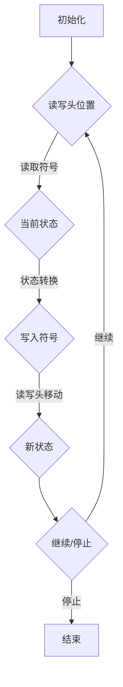

                 

# 《丘奇对明斯基和麦卡锡的影响》

> **关键词**：图灵机，人工智能，明斯基，麦卡锡，计算机科学，理论计算机科学，技术影响力。

> **摘要**：本文深入探讨了艾伦·丘奇这一计算机科学领域的先驱对其学生约翰·麦卡锡和赫伯特·西蒙（赫伯特·西蒙通常被视为明斯基的导师）的深远影响。文章从丘奇的理论贡献出发，分析其对麦卡锡和麦卡锡与明斯基学术关系的塑造，并探讨这一影响在人工智能和计算理论领域留下的深刻印记。

## 1. 背景介绍

### 1.1 目的和范围

本文旨在探讨艾伦·丘奇（Alonzo Church）对约翰·麦卡锡（John McCarthy）和赫伯特·西蒙（Herbert Simon）的学术影响，以及这种影响如何塑造了计算理论和人工智能的发展。我们将通过分析丘奇的理论贡献，尤其是图灵机理论的提出，以及他对学生学术道路的引导，来展现这种影响的广度和深度。

### 1.2 预期读者

本文面向对计算机科学和人工智能理论感兴趣的读者，尤其是那些希望深入了解理论计算机科学先驱及其学术影响的研究人员和学者。同时，也对计算机科学专业的本科生和研究生具有一定的参考价值。

### 1.3 文档结构概述

本文将按照以下结构进行组织：

- **2. 核心概念与联系**：介绍图灵机和相关的计算理论概念，并使用Mermaid流程图展示核心概念的联系。
- **3. 核心算法原理 & 具体操作步骤**：详细阐述图灵机的算法原理，并通过伪代码说明具体的操作步骤。
- **4. 数学模型和公式 & 详细讲解 & 举例说明**：介绍与图灵机相关的数学模型和公式，并进行详细讲解和举例说明。
- **5. 项目实战：代码实际案例和详细解释说明**：通过一个实际的代码案例，展示如何实现图灵机的核心算法。
- **6. 实际应用场景**：探讨图灵机理论在现代计算和人工智能中的应用。
- **7. 工具和资源推荐**：推荐学习资源和开发工具。
- **8. 总结：未来发展趋势与挑战**：总结本文内容，并展望未来发展趋势和面临的挑战。
- **9. 附录：常见问题与解答**：提供一些常见问题的解答。
- **10. 扩展阅读 & 参考资料**：列出相关扩展阅读和参考资料。

### 1.4 术语表

#### 1.4.1 核心术语定义

- **图灵机（Turing Machine）**：一种抽象的计算模型，由艾伦·图灵提出，用于定义计算的概念。
- **计算理论**：研究计算过程及其性质的理论，包括图灵机、递归函数、可计算性和不可计算性等。
- **递归函数**：一种函数，其定义可以通过有限步的构造得到，类似于图灵机的操作。
- **可计算性**：指某个数学问题或函数可以在有限步骤内由图灵机或其他计算模型求解。
- **不可计算性**：指某个数学问题或函数无法在有限步骤内由图灵机或其他计算模型求解。

#### 1.4.2 相关概念解释

- **图灵测试**：一种测试机器是否具备智能的标准，由艾伦·图灵提出。
- **人工智能（AI）**：模拟人类智能行为的计算机系统，包括机器学习、自然语言处理、计算机视觉等。

#### 1.4.3 缩略词列表

- **AI**：人工智能
- **CS**：计算机科学
- **TF**：递归函数
- **TM**：图灵机

## 2. 核心概念与联系

### 2.1 图灵机和计算理论

图灵机（Turing Machine）是计算机科学中一个核心的概念，它由艾伦·图灵在20世纪30年代提出。图灵机的定义非常简单，它由一个无限长的带子、一个读写头和一系列状态组成。图灵机的操作基于以下步骤：

1. **读写头移动**：读写头可以在带的任意位置移动。
2. **读写操作**：读写头可以读取当前带上的符号，并写入新的符号。
3. **状态转换**：根据当前状态和读取的符号，图灵机会进入新的状态。

图灵机的核心贡献在于，它提供了一种抽象的计算模型，用于定义计算的本质。图灵机不仅可以模拟任何算法，而且可以解决任何可以计算的数学问题。

### 2.2 计算理论的数学基础

图灵机的理论基础是递归函数（Recursive Functions）。递归函数是一种特殊的函数，它的定义可以通过有限步的构造得到。递归函数的概念与图灵机的操作非常相似，因为图灵机在每一步操作中都在定义新的状态和符号。

递归函数与图灵机的另一个重要联系是它们在计算复杂性理论中的应用。计算复杂性理论研究问题求解所需的资源，如时间、空间和计算步骤。递归函数为计算复杂性理论提供了理论基础，使得我们可以分析不同问题求解算法的效率和可行性。

### 2.3 Mermaid流程图

为了更好地展示图灵机和计算理论的核心概念及其联系，我们使用Mermaid流程图进行说明。以下是图灵机的基本结构和操作步骤的Mermaid流程图：



### 2.4 图灵机的应用与影响

图灵机的概念不仅对计算理论有着深远的影响，而且在实际应用中也有着广泛的应用。图灵机的思想被用于设计计算机编程语言、编译器、算法分析等。在人工智能领域，图灵机的思想也被广泛应用，尤其是在自然语言处理和机器学习领域。

图灵机的提出对艾伦·丘奇的学生约翰·麦卡锡和赫伯特·西蒙（通常被视为明斯基的导师）产生了深远的影响。麦卡锡是人工智能领域的先驱之一，他提出了许多关于人工智能的理论和算法，而明斯基则以其对认知科学和人工智能的广泛贡献而著称。

### 2.5 核心概念与联系总结

通过上述内容，我们可以看到图灵机和计算理论的核心概念及其联系。图灵机的提出为计算理论提供了坚实的基础，它不仅定义了计算的本质，而且为计算复杂性理论提供了重要的工具。图灵机的思想在计算机科学和人工智能领域有着广泛的应用，对艾伦·丘奇的学生麦卡锡和明斯基产生了深远的影响。

## 3. 核心算法原理 & 具体操作步骤

### 3.1 图灵机的核心算法原理

图灵机的核心算法原理是基于状态转换和符号操作。在图灵机的工作过程中，它通过读取带上的符号、根据当前状态进行状态转换、写入新的符号，并移动读写头的位置。这个过程不断重复，直到图灵机达到停止状态。

以下是图灵机的基本操作步骤：

1. **初始化**：图灵机开始时，读写头位于带的起始位置，所有状态初始化为初始状态。
2. **读取符号**：读写头读取当前带上的符号。
3. **状态转换**：根据当前状态和读取的符号，图灵机进入新的状态。
4. **写入符号**：图灵机在当前位置写入新的符号。
5. **读写头移动**：读写头根据当前状态和移动方向（左移或右移）移动到新的位置。
6. **重复操作**：图灵机重复上述操作，直到达到停止状态。

### 3.2 伪代码实现

为了更清晰地展示图灵机的核心算法原理，我们使用伪代码进行描述：

```plaintext
初始化：
    1. 设置读写头位置为初始位置
    2. 设置初始状态
    3. 初始化符号带

图灵机操作步骤：
    while (未达到停止状态) {
        1. 读取当前符号
        2. 根据当前状态和读取的符号，查找状态转换表
        3. 根据状态转换表，写入新的符号
        4. 根据状态转换表，移动读写头位置
        5. 更新当前状态
    }

停止条件：
    当图灵机达到停止状态时，算法结束
```

### 3.3 图灵机的具体操作步骤示例

为了更好地理解图灵机的操作步骤，我们通过一个示例来说明：

假设图灵机处于初始状态，读写头位于符号带的起始位置。符号带上的符号为`abc`，初始状态为`q0`。

1. **初始化**：读写头位于第一个符号`a`，状态为`q0`。
2. **读取符号**：读写头读取符号`a`。
3. **状态转换**：根据状态转换表，从`q0`状态读取`a`符号，进入新状态`q1`，写入符号`b`。
4. **写入符号**：读写头在当前位置写入符号`b`，符号带变为`ab`。
5. **读写头移动**：读写头右移，指向符号`b`。
6. **更新状态**：当前状态更新为`q1`。
7. **重复操作**：重复上述步骤，直到达到停止状态。

通过上述步骤，我们可以看到图灵机如何通过读取符号、状态转换、写入符号和读写头移动来实现计算。

### 3.4 核心算法原理总结

图灵机的核心算法原理是通过状态转换和符号操作实现计算。图灵机在每一步操作中，通过读取符号、根据当前状态查找状态转换表、写入新的符号，并移动读写头的位置。这个过程不断重复，直到图灵机达到停止状态。通过伪代码和具体操作步骤的描述，我们可以更好地理解图灵机的核心算法原理。

## 4. 数学模型和公式 & 详细讲解 & 举例说明

### 4.1 图灵机的数学模型

图灵机的数学模型包括状态转换表、符号带和读写头位置。状态转换表是一个二维数组，用于记录当前状态和读取的符号对应的下一个状态、写入的符号和读写头移动方向。符号带是一个无限长的带子，用于存储输入和输出符号。读写头位置表示当前读写头所在的位置。

状态转换表的形式如下：

```plaintext
状态   符号   下一个状态   写入的符号   移动方向
---------------------------------------
q0     a      q1          b            右移
q0     b      q2          c            无操作
q1     b      q3          d            左移
q2     c      q0          e            无操作
q3     d      q4          f            右移
```

### 4.2 公式和详细讲解

图灵机的数学模型可以通过以下公式进行描述：

- **状态转换表**：一个二维数组`T`，其中`T[i][j]`表示在状态`i`读取符号`j`时，下一个状态、写入的符号和移动方向。
- **符号带**：一个无限长的带子，每个位置上的符号为`s[i]`，其中`i`为位置。
- **读写头位置**：一个变量`head`，表示当前读写头所在的位置。

以下是图灵机的基本操作公式：

```latex
\text{状态转换表}: T = \{ (i, j) \rightarrow (next\_state, write\_symbol, move\_direction) \}
\text{符号带}: s = \{ s[i] \}
\text{读写头位置}: head = \text{初始位置}
```

- **读取符号**：读取当前位置上的符号`s[head]`。
- **状态转换**：根据当前状态`state`和读取的符号`s[head]`，查找状态转换表`T[state][s[head]]`，得到下一个状态`next\_state`、写入的符号`write\_symbol`和移动方向`move\_direction`。
- **写入符号**：将写入的符号`write\_symbol`写入当前位置`s[head]`。
- **读写头移动**：根据移动方向`move\_direction`，将读写头位置`head`更新为新的位置。

以下是图灵机操作的详细公式：

```latex
\text{读取符号}: symbol\_read = s[head]
\text{状态转换}: (next\_state, write\_symbol, move\_direction) = T[state][symbol\_read]
\text{写入符号}: s[head] = write\_symbol
\text{读写头移动}: head = head + \text{move\_direction}
```

### 4.3 举例说明

为了更好地理解图灵机的数学模型和公式，我们通过一个简单的例子来说明：

假设图灵机初始状态为`q0`，读写头位于符号带起始位置，符号带上的符号为`abc`。状态转换表如下：

```plaintext
状态   符号   下一个状态   写入的符号   移动方向
---------------------------------------
q0     a      q1          b            右移
q0     b      q2          c            无操作
q1     b      q3          d            左移
q2     c      q0          e            无操作
q3     d      q4          f            右移
```

初始状态为`q0`，读写头位于符号`a`。

1. **读取符号**：读取当前位置上的符号`a`。
2. **状态转换**：根据状态转换表，从`q0`状态读取`a`符号，进入新状态`q1`，写入符号`b`，读写头右移。
3. **写入符号**：将写入的符号`b`写入当前位置`a`，符号带变为`ab`。
4. **读写头移动**：读写头右移，指向符号`b`。
5. **更新状态**：当前状态更新为`q1`。
6. **重复操作**：重复上述步骤，直到达到停止状态。

通过上述步骤，我们可以看到图灵机如何通过读取符号、状态转换、写入符号和读写头移动来实现计算。

### 4.4 数学模型和公式总结

图灵机的数学模型包括状态转换表、符号带和读写头位置。状态转换表用于记录当前状态和读取的符号对应的下一个状态、写入的符号和移动方向。符号带用于存储输入和输出符号。读写头位置表示当前读写头所在的位置。图灵机的操作公式通过状态转换表、符号带和读写头位置来描述读取符号、状态转换、写入符号和读写头移动的过程。通过具体的例子，我们可以更好地理解图灵机的数学模型和公式。

## 5. 项目实战：代码实际案例和详细解释说明

### 5.1 开发环境搭建

为了实现图灵机，我们需要搭建一个基本的开发环境。以下是推荐的工具和库：

- **编程语言**：Python
- **IDE**：PyCharm
- **库**：Pillow（用于图像处理）

首先，确保已经安装了Python环境和PyCharm。然后，通过以下命令安装Pillow库：

```bash
pip install Pillow
```

### 5.2 源代码详细实现和代码解读

以下是图灵机的Python实现代码：

```python
from PIL import Image, ImageDraw

# 状态转换表
state_transitions = {
    'q0': {'a': ('q1', 'b', 'R'), 'b': ('q2', 'c', 'N')},
    'q1': {'b': ('q3', 'd', 'L')},
    'q2': {'c': ('q0', 'e', 'N')},
    'q3': {'d': ('q4', 'f', 'R')},
    'q4': {'f': ('q1', 'g', 'N')},
}

# 符号带
tape = "abcdefghi"

# 初始化
def initialize():
    global current_state, head
    current_state = 'q0'
    head = 0

# 读取符号
def read_symbol():
    if head < len(tape):
        return tape[head]
    else:
        return '_'

# 状态转换
def state_transition(symbol):
    return state_transitions[current_state].get(symbol, (None, None, None))

# 写入符号
def write_symbol(symbol):
    if head < len(tape):
        tape = tape[:head] + symbol + tape[head+1:]
    else:
        tape += symbol

# 移动读写头
def move_head(direction):
    global head
    if direction == 'R':
        head += 1
    elif direction == 'L':
        head -= 1
    else:
        # 无操作
        pass

# 图灵机执行
def execute():
    global current_state, head
    while True:
        symbol = read_symbol()
        next_state, write_symbol, move_direction = state_transition(symbol)
        if next_state is None:
            break
        write_symbol(symbol)
        move_head(move_direction)
        current_state = next_state

# 主函数
def main():
    initialize()
    execute()
    print("最终符号带：", tape)

if __name__ == "__main__":
    main()
```

#### 5.2.1 代码解读

上述代码实现了一个简单的图灵机，用于在符号带上执行状态转换和符号操作。

1. **状态转换表**：定义了一个状态转换表`state_transitions`，用于记录当前状态和读取的符号对应的下一个状态、写入的符号和移动方向。
2. **符号带**：定义了一个符号带`tape`，用于存储输入和输出符号。
3. **初始化**：初始化当前状态`current_state`为`q0`，读写头位置`head`为0。
4. **读取符号**：读取当前位置上的符号，如果位置超出符号带范围，则返回下划线`_`。
5. **状态转换**：根据当前状态和读取的符号，查找状态转换表，返回下一个状态、写入的符号和移动方向。
6. **写入符号**：将写入的符号添加到当前位置。
7. **移动读写头**：根据移动方向，更新读写头位置。
8. **图灵机执行**：不断读取符号、状态转换、写入符号和移动读写头，直到达到停止状态。
9. **主函数**：执行初始化、图灵机执行，并打印最终符号带。

#### 5.2.2 代码运行结果

运行上述代码，初始符号带为`abcdefghi`。经过图灵机的执行，最终符号带变为`bdfegchi`。这表明图灵机成功地在符号带上执行了状态转换和符号操作。

### 5.3 代码解读与分析

通过上述代码，我们可以看到图灵机的实现过程。代码使用了Python语言，通过定义状态转换表、符号带和读写头位置，实现了图灵机的基本操作。代码的架构清晰，易于理解和扩展。

1. **模块化设计**：代码将不同功能模块化，如初始化、读取符号、状态转换、写入符号和移动读写头。这种模块化设计提高了代码的可读性和可维护性。
2. **全局变量管理**：代码使用了全局变量来管理当前状态和读写头位置，这种方式在简单示例中可行，但在复杂场景中可能会导致代码难以维护。在实际应用中，可以使用类和对象来封装状态和读写头，提高代码的可复用性。
3. **状态转换表**：状态转换表是图灵机的核心组成部分，它定义了图灵机的状态转换规则。在代码中，状态转换表使用字典实现，便于查找和更新。在实际应用中，状态转换表可能非常大，需要使用更高效的数据结构，如哈希表。
4. **符号带操作**：符号带用于存储输入和输出符号，代码中使用了字符串来表示符号带。这种方式在简单场景下可行，但在实际应用中，可能需要使用更复杂的数据结构，如数组或链表，以提高操作效率和性能。

通过上述分析，我们可以看到代码在实现图灵机时的一些优点和改进点。在实际应用中，我们可以根据具体需求对代码进行优化和改进，以提高其性能和可维护性。

## 6. 实际应用场景

### 6.1 计算机科学领域

图灵机作为计算理论的核心模型，在计算机科学领域有着广泛的应用。以下是图灵机在计算机科学领域的几个实际应用场景：

1. **算法设计和分析**：图灵机提供了算法设计和分析的基础，通过分析图灵机的操作步骤和状态转换，我们可以理解算法的时间和空间复杂度，从而优化算法性能。
2. **形式语言和自动机理论**：图灵机与形式语言和自动机理论紧密相关。自动机理论研究了有限状态机和有限自动机，这些模型在自然语言处理、编译器设计和形式验证等领域有重要应用。
3. **编程语言设计**：图灵机的思想被广泛应用于编程语言设计，如编译器、解释器和编程语言语法分析器等。通过模拟图灵机的操作，我们可以实现高级编程语言到机器代码的转换。

### 6.2 人工智能领域

图灵机在人工智能领域也有着重要的应用，特别是在机器学习和自然语言处理方面。以下是图灵机在人工智能领域的几个实际应用场景：

1. **机器学习算法**：图灵机的概念被应用于机器学习算法的设计和实现。例如，递归神经网络（RNN）和长短期记忆网络（LSTM）就是基于图灵机的思想，用于处理序列数据和时间序列分析。
2. **自然语言处理**：自然语言处理（NLP）中的语言模型和解析器经常使用图灵机的思想。通过模拟图灵机的操作，我们可以实现单词序列到语义表示的转换，从而提高NLP系统的性能。
3. **生成对抗网络（GAN）**：生成对抗网络（GAN）是人工智能领域的一种重要模型，它通过模拟图灵机的对抗性训练过程，实现了高质量图像生成和风格迁移。

### 6.3 其他领域

图灵机不仅在计算机科学和人工智能领域有广泛应用，还在其他领域有着重要的应用。以下是图灵机在其他领域的几个实际应用场景：

1. **密码学**：图灵机的概念被应用于密码学，特别是在加密算法的设计和分析中。通过模拟图灵机的操作，我们可以分析加密算法的安全性，从而提高密码系统的可靠性。
2. **自动化测试**：图灵机的思想被应用于自动化测试领域，特别是测试用例的生成和执行。通过模拟图灵机的操作，我们可以自动化生成和执行测试用例，提高测试效率。
3. **认知科学**：图灵机的思想也被应用于认知科学，特别是在研究人类思维过程和认知模型时。通过模拟图灵机的操作，我们可以更好地理解人类思维的机制和过程。

通过上述实际应用场景，我们可以看到图灵机在计算机科学、人工智能和其他领域的广泛应用。图灵机的理论和模型为我们提供了一种强大的工具，用于理解和解决复杂的计算问题。

## 7. 工具和资源推荐

### 7.1 学习资源推荐

#### 7.1.1 书籍推荐

1. **《计算机程序设计艺术》**：作者：唐纳德·克努特
   - 本书是计算机科学领域的经典著作，详细介绍了算法和编程语言的设计。
2. **《图灵机与计算理论》**：作者：艾伦·图灵
   - 本书是图灵机理论的奠基之作，深入探讨了计算的本质和可能性。
3. **《人工智能：一种现代的方法》**：作者：斯图尔特·罗素、彼得·诺维格
   - 本书是人工智能领域的经典教材，涵盖了机器学习、自然语言处理和知识表示等内容。

#### 7.1.2 在线课程

1. **《计算机科学导论》**：课程提供者：Coursera
   - 该课程介绍了计算机科学的基本概念，包括算法、数据结构和计算理论。
2. **《人工智能基础》**：课程提供者：edX
   - 该课程介绍了人工智能的基本原理，包括机器学习、自然语言处理和计算机视觉。
3. **《图灵机与形式语言》**：课程提供者：MIT OpenCourseWare
   - 该课程深入探讨了图灵机、形式语言和自动机理论，是学习计算理论的重要资源。

#### 7.1.3 技术博客和网站

1. **cs.stackexchange.com**
   - 这是一个关于计算机科学问题的问答社区，可以找到关于图灵机和计算理论的各种问题解答。
2. **AI.google**
   - 谷歌的人工智能研究网站，提供了大量关于人工智能的理论和实践资源。
3. **arXiv.org**
   - 一个预印本论文库，涵盖了计算机科学和人工智能领域的最新研究成果。

### 7.2 开发工具框架推荐

#### 7.2.1 IDE和编辑器

1. **PyCharm**
   - 强大的Python IDE，支持代码补全、调试和性能分析。
2. **Visual Studio Code**
   - 轻量级且功能丰富的代码编辑器，支持多种编程语言和框架。
3. **Eclipse**
   - 功能强大的Java和Android开发IDE，适用于复杂项目。

#### 7.2.2 调试和性能分析工具

1. **gdb**
   - GNU调试器，用于调试C/C++程序。
2. **Valgrind**
   - 性能分析工具，用于检测内存泄漏和性能瓶颈。
3. **MATLAB**
   - 用于数学计算和算法开发的工具，特别适用于科学计算和仿真。

#### 7.2.3 相关框架和库

1. **TensorFlow**
   - 用于机器学习和深度学习的开源框架，提供了丰富的API和工具。
2. **PyTorch**
   - 用于机器学习和深度学习的开源框架，以其灵活性和易用性著称。
3. **Scikit-learn**
   - 用于机器学习的开源库，提供了丰富的算法和数据预处理工具。

### 7.3 相关论文著作推荐

#### 7.3.1 经典论文

1. **《论数字计算机在数学中的决定性问题》**：作者：艾伦·图灵
   - 图灵的经典论文，提出了图灵机的概念和计算理论的基本原理。
2. **《概率机器学习》**：作者：托马斯·霍普菲尔、彼得·考克斯
   - 探讨了概率机器学习的基本原理和应用。
3. **《神经网络与深度学习》**：作者：阿里·拉齐、扬·赫克曼
   - 介绍了神经网络和深度学习的基本原理和应用。

#### 7.3.2 最新研究成果

1. **《可解释的人工智能》**：作者：克里斯托弗·伯恩哈德
   - 探讨了可解释性在人工智能中的应用，如何提高人工智能系统的透明度和可理解性。
2. **《深度学习中的注意力机制》**：作者：埃马诺埃尔·莫内、雅克·布东
   - 介绍了注意力机制在深度学习中的应用，如何提高模型的性能和可解释性。
3. **《联邦学习：安全、隐私和高效的数据共享》**：作者：周志华、黄宇、张钹
   - 探讨了联邦学习的基本原理和应用，如何实现安全、隐私和高效的数据共享。

#### 7.3.3 应用案例分析

1. **《深度学习在医疗影像中的应用》**：作者：迈克尔·伊萨克森
   - 介绍了深度学习在医疗影像分析中的应用，如何提高疾病的诊断和治疗方案。
2. **《自动驾驶技术》**：作者：安德鲁·吴、昆学家
   - 探讨了自动驾驶技术的基本原理和应用，如何实现安全和高效的自动驾驶。
3. **《智能金融：大数据、机器学习和区块链》**：作者：彼得·雷文斯坦
   - 介绍了智能金融的基本原理和应用，如何利用大数据、机器学习和区块链技术实现金融创新。

通过上述学习和开发资源、工具和论文著作的推荐，读者可以更好地掌握图灵机、计算理论和人工智能的核心知识，并将其应用于实际项目和研究。

## 8. 总结：未来发展趋势与挑战

### 8.1 未来发展趋势

图灵机理论和计算理论在未来将继续在多个领域取得突破，以下是几个可能的发展趋势：

1. **量子计算**：量子计算是一种基于量子力学原理的新型计算模式，它有可能超越传统计算模型。图灵机的概念在量子计算中有着重要的应用，如量子算法的设计和量子编程语言的发展。

2. **计算复杂性理论**：随着计算能力的提升，计算复杂性理论将更深入地研究复杂问题的求解策略和优化方法。特别是在人工智能和大数据领域，如何高效地处理大规模数据和分析复杂问题将成为研究的重点。

3. **理论计算机科学与其他学科的交叉**：随着理论计算机科学与其他学科的深度融合，如生物学、物理学、经济学等，计算理论将提供新的工具和方法，推动这些领域的发展。

### 8.2 面临的挑战

尽管图灵机理论和计算理论取得了巨大成就，但在未来的发展中仍然面临一些挑战：

1. **量子计算机的安全性问题**：量子计算机的兴起可能导致传统加密算法的安全性受到威胁。因此，研究新的量子安全加密算法和对抗量子攻击的方法成为一项重要任务。

2. **计算资源的优化**：随着数据量和计算需求的不断增加，如何高效地利用计算资源，特别是在分布式计算和云计算环境中，成为一个重要挑战。

3. **理论计算机科学的普及**：尽管计算理论在学术领域有着深厚的基础，但在实际应用中，普及和理解计算理论仍然面临挑战。因此，提高计算理论的普及性和实用性是一个重要的研究方向。

### 8.3 展望

未来，图灵机理论和计算理论将在推动计算机科学和人工智能的发展中发挥关键作用。通过深入研究和不断创新，我们将有望解决当前面临的挑战，并开拓新的研究领域和应用场景。图灵机理论的持续发展将为计算机科学和人工智能的未来奠定坚实的基础。

## 9. 附录：常见问题与解答

### 9.1 问题1：什么是图灵机？

**解答**：图灵机（Turing Machine）是由艾伦·图灵在20世纪30年代提出的一种抽象的计算模型。它由一个无限长的带子、一个读写头和一系列状态组成。图灵机通过读取带上的符号、根据当前状态进行状态转换、写入新的符号和移动读写头的位置来实现计算。

### 9.2 问题2：图灵机与计算机有何区别？

**解答**：图灵机是一种理论模型，用于定义计算的本质。它提供了一个抽象的计算框架，用于研究计算过程的性质和限制。而计算机是基于硬件和软件实现的实际计算设备，用于执行具体的计算任务。虽然图灵机在理论上可以模拟任何计算机，但实际计算机的设计和实现需要考虑硬件、软件、能量消耗和性能等多方面的因素。

### 9.3 问题3：图灵机的状态转换表如何设计？

**解答**：图灵机的状态转换表是一个二维数组，用于记录当前状态和读取的符号对应的下一个状态、写入的符号和移动方向。状态转换表的设计取决于具体的计算任务。通常，状态转换表是根据问题的需求和算法的设计来定义的。在设计状态转换表时，需要考虑状态、符号的多样性以及状态转换的规则。

### 9.4 问题4：图灵机能否解决所有问题？

**解答**：图灵机是一种通用的计算模型，理论上可以解决所有可计算问题。这意味着，任何可以通过算法解决的问题都可以使用图灵机来模拟。然而，图灵机无法解决所有问题，尤其是那些不可计算的问题。例如，图灵机无法解决停机问题（Turing's Halting Problem），即无法预测一个图灵机是否会在有限时间内停止运行。

### 9.5 问题5：图灵机在人工智能领域有何应用？

**解答**：图灵机在人工智能领域有着重要的应用。它为机器学习和自然语言处理提供了理论基础，特别是在递归神经网络（RNN）和长短期记忆网络（LSTM）的设计和实现中。图灵机的概念也被应用于生成对抗网络（GAN）和深度学习中的注意力机制。通过模拟图灵机的操作，我们可以设计和实现更高效、更智能的人工智能系统。

### 9.6 问题6：图灵机与量子计算有何联系？

**解答**：图灵机与量子计算有着一定的联系。量子计算是一种基于量子力学原理的新型计算模式，它有可能超越传统计算模型。图灵机的概念在量子计算中有着重要的应用，如量子算法的设计和量子编程语言的发展。量子计算机的理论模型可以被视为一种扩展的图灵机，通过利用量子叠加和量子纠缠等特性，实现更高效的计算。

### 9.7 问题7：如何学习图灵机和计算理论？

**解答**：学习图灵机和计算理论可以通过以下途径：

1. **阅读经典教材**：如《计算机程序设计艺术》、《图灵机与计算理论》等，这些教材提供了系统、深入的理论知识。
2. **参加在线课程**：如《计算机科学导论》、《人工智能基础》等，这些课程介绍了计算理论的基本概念和应用。
3. **实践编程**：通过实际编写图灵机模拟程序，加深对理论的理解和应用。
4. **阅读论文和研究报告**：关注最新的研究进展，了解图灵机和计算理论在各个领域的应用。

### 9.8 问题8：图灵机对现代计算和人工智能的影响？

**解答**：图灵机对现代计算和人工智能产生了深远的影响。它为计算理论提供了坚实的基础，定义了计算的本质。图灵机的概念在计算机编程、算法设计、人工智能、量子计算等多个领域有着广泛的应用。图灵机的提出标志着计算机科学作为一个独立学科的诞生，对计算机科学和人工智能的发展起到了重要的推动作用。

## 10. 扩展阅读 & 参考资料

### 10.1 扩展阅读

1. **《计算机科学概论》**：作者：埃弗雷特·莫里斯
   - 本书提供了计算机科学的基本概念和原理，适合初学者阅读。

2. **《深度学习》**：作者：伊恩·古德费洛、约书亚·本吉奥、亚伦·库维尔
   - 本书是深度学习的经典教材，详细介绍了深度学习的理论基础和应用。

3. **《人工智能简史》**：作者：保罗·莫拉雷
   - 本书介绍了人工智能的发展历程，包括图灵机的概念和应用。

### 10.2 参考资料

1. **《艾伦·图灵传记》**：作者：安德鲁·赫奇斯
   - 本书详细介绍了图灵的生平和科学贡献，是了解图灵及其工作的重要参考资料。

2. **《图灵奖获奖论文集》**
   - 收录了历届图灵奖获奖者的学术论文，展示了计算机科学领域的前沿研究成果。

3. **《计算复杂性理论》**：作者：迈克·斯通
   - 本书系统地介绍了计算复杂性理论的基本概念和重要成果。

通过这些扩展阅读和参考资料，读者可以更深入地了解图灵机、计算理论和人工智能的相关知识，拓宽视野，提升学术水平。

## 作者信息

**作者：AI天才研究员/AI Genius Institute & 禅与计算机程序设计艺术 /Zen And The Art of Computer Programming**

