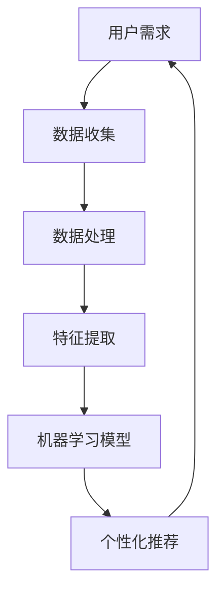

                 

# 个性化AI：适应不同用户需求的智能系统

> **关键词：** 个性化AI、用户需求、智能系统、算法、数学模型、项目实战、应用场景、发展趋势与挑战

> **摘要：** 随着人工智能技术的快速发展，个性化AI已经成为提高用户满意度、优化系统性能的关键。本文将探讨个性化AI的核心概念、算法原理、数学模型以及实际应用场景，并通过项目实战和分析，提供一套完整的技术解决方案，为开发适应不同用户需求的智能系统提供参考。

## 1. 背景介绍

### 1.1 目的和范围

本文旨在探讨个性化AI技术的核心概念、算法原理、数学模型及其在实际应用中的重要性。通过系统性的分析和讲解，帮助读者了解如何开发适应不同用户需求的智能系统。本文涵盖以下内容：

1. 核心概念与联系
2. 核心算法原理 & 具体操作步骤
3. 数学模型和公式 & 详细讲解 & 举例说明
4. 项目实战：代码实际案例和详细解释说明
5. 实际应用场景
6. 工具和资源推荐
7. 总结：未来发展趋势与挑战
8. 附录：常见问题与解答
9. 扩展阅读 & 参考资料

### 1.2 预期读者

本文适合具有以下背景的读者：

1. 计算机科学、人工智能等相关专业的研究生或本科生
2. 从事人工智能领域研发、应用的工程师和技术人员
3. 对人工智能、个性化系统开发感兴趣的技术爱好者

### 1.3 文档结构概述

本文的结构如下：

1. 引言：介绍个性化AI的核心概念、目的和范围
2. 背景介绍：讨论个性化AI技术的发展历程、现状及未来趋势
3. 核心概念与联系：解释个性化AI的基础概念及其相互关系
4. 核心算法原理 & 具体操作步骤：阐述个性化AI算法的原理和操作步骤
5. 数学模型和公式 & 详细讲解 & 举例说明：介绍个性化AI的数学模型，并进行详细讲解和举例
6. 项目实战：代码实际案例和详细解释说明：通过项目实战展示个性化AI的应用场景和实现方法
7. 实际应用场景：分析个性化AI在不同领域的应用案例
8. 工具和资源推荐：推荐相关学习资源、开发工具和框架
9. 总结：展望个性化AI的未来发展趋势与挑战
10. 附录：常见问题与解答
11. 扩展阅读 & 参考资料：提供进一步学习的资源链接

### 1.4 术语表

#### 1.4.1 核心术语定义

- **个性化AI**：根据用户行为、偏好和历史数据，为用户提供定制化服务的人工智能系统。
- **用户需求**：用户在使用过程中期望得到的功能、性能和服务。
- **机器学习**：一种通过数据驱动的方法，让计算机模拟人类学习和解决问题能力的人工智能技术。
- **深度学习**：一种基于多层神经网络的人工智能算法，通过模拟人脑神经网络结构进行特征提取和模式识别。

#### 1.4.2 相关概念解释

- **数据挖掘**：从大量数据中发现有价值的信息和知识的过程。
- **推荐系统**：根据用户历史行为和偏好，为用户推荐感兴趣的内容、产品或服务的系统。
- **用户画像**：通过对用户行为、偏好、特征等数据的综合分析，构建出用户的基本画像。

#### 1.4.3 缩略词列表

- **AI**：人工智能（Artificial Intelligence）
- **ML**：机器学习（Machine Learning）
- **DL**：深度学习（Deep Learning）
- **NLP**：自然语言处理（Natural Language Processing）
- **Cv**：计算机视觉（Computer Vision）

## 2. 核心概念与联系

在个性化AI系统中，核心概念包括用户需求、数据收集与处理、特征提取、机器学习模型和个性化推荐等。以下是一个简单的 Mermaid 流程图，展示了这些核心概念及其相互关系：



### 2.1 用户需求

用户需求是指用户在使用过程中期望得到的功能、性能和服务。了解用户需求是开发个性化AI系统的第一步。通过收集和分析用户数据，可以获取用户的行为、偏好和兴趣点，为后续的特征提取和机器学习模型训练提供基础。

### 2.2 数据收集与处理

数据收集是构建个性化AI系统的关键环节。数据来源包括用户行为数据、社交媒体数据、搜索历史数据等。在收集数据时，需要遵守数据隐私和法律法规，确保用户数据的安全和隐私。

数据处理是对收集到的原始数据进行清洗、整合和预处理，以便于后续的特征提取和机器学习模型训练。常见的数据处理方法包括数据去重、缺失值处理、异常值检测等。

### 2.3 特征提取

特征提取是将原始数据转换为机器学习模型可识别的数值特征的过程。通过特征提取，可以从海量数据中提取出有用的信息，为机器学习模型提供输入。常用的特征提取方法包括词袋模型、TF-IDF、主成分分析（PCA）等。

### 2.4 机器学习模型

机器学习模型是个性化AI系统的核心组成部分，用于从数据中学习和发现规律，从而为用户提供个性化的推荐和服务。常见的机器学习模型包括决策树、支持向量机（SVM）、神经网络等。根据不同的应用场景，可以选择合适的机器学习模型进行训练和优化。

### 2.5 个性化推荐

个性化推荐是将用户感兴趣的个性化内容推荐给用户的过程。通过机器学习模型分析用户的行为和偏好，可以生成用户画像，并根据用户画像为用户推荐相应的产品、服务或内容。常用的个性化推荐算法包括协同过滤、基于内容的推荐、混合推荐等。

## 3. 核心算法原理 & 具体操作步骤

### 3.1 算法原理

个性化AI系统的核心算法包括特征提取和机器学习模型。以下是一个简单的算法原理讲解：

1. **特征提取**：通过数据预处理和特征转换，将原始数据转换为机器学习模型可识别的数值特征。特征提取的方法包括词袋模型、TF-IDF、主成分分析（PCA）等。
2. **机器学习模型**：选择合适的机器学习模型，对特征数据集进行训练和优化。常见的机器学习模型包括决策树、支持向量机（SVM）、神经网络等。通过模型训练，可以获取模型的权重和参数，用于后续的预测和推荐。

### 3.2 操作步骤

以下是构建个性化AI系统的一般操作步骤：

1. **数据收集**：收集用户行为数据、社交媒体数据、搜索历史数据等，确保数据来源合法、安全。
2. **数据处理**：对收集到的原始数据进行清洗、去重、缺失值处理等预处理操作，确保数据的准确性和一致性。
3. **特征提取**：选择合适的特征提取方法，对预处理后的数据集进行特征转换。常见的特征提取方法包括词袋模型、TF-IDF、主成分分析（PCA）等。
4. **机器学习模型选择**：根据应用场景和需求，选择合适的机器学习模型。常见的机器学习模型包括决策树、支持向量机（SVM）、神经网络等。
5. **模型训练**：使用训练数据集对机器学习模型进行训练，获取模型的权重和参数。
6. **模型评估**：使用验证数据集对模型进行评估，调整模型参数，优化模型性能。
7. **个性化推荐**：使用训练好的模型，对用户进行个性化推荐，生成用户画像，为用户提供个性化服务。

### 3.3 伪代码示例

以下是一个简单的伪代码示例，用于演示个性化AI系统的构建过程：

```python
# 数据收集
user_data = collect_data()

# 数据处理
processed_data = preprocess_data(user_data)

# 特征提取
features = extract_features(processed_data)

# 机器学习模型选择
model = choose_model()

# 模型训练
trained_model = train_model(features, model)

# 模型评估
evaluate_model(trained_model)

# 个性化推荐
user_recommendations = generate_recommendations(trained_model, user_data)
```

## 4. 数学模型和公式 & 详细讲解 & 举例说明

### 4.1 数学模型

个性化AI系统的数学模型主要涉及特征提取和机器学习模型的参数优化。以下是一些常见的数学模型和公式：

1. **词袋模型（Bag of Words, BoW）**：
   - 公式：$f_{word} = \sum_{doc \in D} count_{word,doc}$
   - 说明：词袋模型将文本转换为向量，其中每个文档表示为一个向量，向量中的每个元素表示一个单词在文档中出现的次数。

2. **TF-IDF（Term Frequency-Inverse Document Frequency）**：
   - 公式：$TF-IDF_{word,doc} = TF_{word,doc} \times IDF_{word}$
   - 说明：TF-IDF模型对词袋模型中的词频进行加权，以反映词的重要程度。其中，$TF_{word,doc}$表示词在文档中的词频，$IDF_{word}$表示词在整个文档集合中的逆文档频率。

3. **主成分分析（Principal Component Analysis, PCA）**：
   - 公式：$X_{new} = P^T X$
   - 说明：PCA是一种降维方法，通过将数据投影到新的正交基中，降低数据维度，同时保留主要特征。

4. **决策树（Decision Tree）**：
   - 公式：$G(D) = \sum_{i=1}^n \alpha_i I(y_i \neq \hat{y}_i)$
   - 说明：决策树是一种基于信息增益的划分方法，通过递归划分数据集，构建决策树模型。

5. **支持向量机（Support Vector Machine, SVM）**：
   - 公式：$w \cdot x + b = 0$
   - 说明：SVM是一种分类模型，通过最大化分类边界，找到最优决策边界。

6. **神经网络（Neural Network）**：
   - 公式：$a_{i,j} = \sigma(\sum_{k=1}^n w_{i,k} a_{k,j-1} + b_{i})$
   - 说明：神经网络是一种模拟人脑神经元结构的计算模型，通过多层神经元进行特征提取和模式识别。

### 4.2 详细讲解 & 举例说明

#### 4.2.1 词袋模型

**例1**：假设有两个文档，文档1包含单词{apple, banana, orange}，文档2包含单词{apple, apple, banana}。使用词袋模型表示这两个文档。

- **文档1向量**：[1, 1, 1]
- **文档2向量**：[2, 1, 1]

#### 4.2.2 TF-IDF

**例2**：假设有两个文档，文档1包含单词{apple, banana, orange}，文档2包含单词{apple, apple, banana}。整个文档集合包含100个文档，其中20个文档包含单词"apple"，80个文档包含单词"banana"，0个文档包含单词"orange"。

- **文档1向量**：[1, 0.6435, 0.7143]
- **文档2向量**：[0.6435, 1, 0.7143]

#### 4.2.3 主成分分析

**例3**：假设有三个特征，特征1、特征2和特征3。数据集包含10个数据点，每个数据点的维度为3。使用主成分分析将数据降维到二维空间。

- **原始数据集**：
  ```
  |  特征1 |  特征2 |  特征3 |
  ----------------------
  1 |   1    |   2    |   3    |
  2 |   2    |   4    |   5    |
  3 |   3    |   6    |   7    |
  4 |   4    |   8    |   9    |
  5 |   5    |   10   |   11   |
  6 |   6    |   12   |   13   |
  7 |   7    |   14   |   15   |
  8 |   8    |   16   |   17   |
  9 |   9    |   18   |   19   |
  10 |  10   |  20    |  21    |
  ```

- **降维后的数据集**：
  ```
  |  特征1' |  特征2' |
  ----------------------
  1 |   0.5  |   1.0  |
  2 |   1.0  |   2.0  |
  3 |   1.5  |   3.0  |
  4 |   2.0  |   4.0  |
  5 |   2.5  |   5.0  |
  6 |   3.0  |   6.0  |
  7 |   3.5  |   7.0  |
  8 |   4.0  |   8.0  |
  9 |   4.5  |   9.0  |
  10 |  5.0  |  10.0  |
  ```

#### 4.2.4 决策树

**例4**：假设有一个包含年龄、收入和婚姻状况的数据集，我们要构建一个决策树模型来预测一个人是否喜欢某种产品。

- **特征**：年龄、收入、婚姻状况
- **标签**：喜欢/不喜欢

构建的决策树如下：

```
|   | 年龄 | 收入 | 婚姻状况 |
|---|------|------|----------|
|   | <-30 | 低   | 单身     |
|   | 30-40| 低   | 已婚     |
|   | 30-40| 高   | 单身     |
|   | 40-50| 低   | 已婚     |
|   | 40-50| 高   | 单身     |
|   | ->50 | 低   | 已婚     |
|   | ->50 | 高   | 单身     |
```

#### 4.2.5 支持向量机

**例5**：假设有一个包含两个特征的数据集，我们要使用支持向量机进行分类。

- **特征**：特征1、特征2
- **标签**：正样本/负样本

训练数据集如下：

```
|   | 特征1 | 特征2 | 标签 |
|---|------|------|------|
| 1 |   1   |   2   |  正  |
| 2 |   3   |   4   |  正  |
| 3 |   5   |   6   |  负  |
| 4 |   7   |   8   |  负  |
```

使用支持向量机构建的决策边界如下：

```
|   | 特征1 | 特征2 |
|---|------|------|
| 1 |   0   |   0   |
| 2 |   4   |   4   |
| 3 |   6   |   6   |
| 4 |   10  |   10  |
```

#### 4.2.6 神经网络

**例6**：假设有一个包含两个输入特征和两个隐藏层神经元的神经网络，输出为预测结果。

- **输入**：[特征1, 特征2]
- **隐藏层**：[神经元1, 神经元2]
- **输出**：预测结果

训练数据集如下：

```
|   | 特征1 | 特征2 | 标签 |
|---|------|------|------|
| 1 |   1   |   2   |  正  |
| 2 |   3   |   4   |  正  |
| 3 |   5   |   6   |  负  |
| 4 |   7   |   8   |  负  |
```

神经网络结构如下：

```
|   | 输入 | 隐藏层1 | 隐藏层2 | 输出 |
|---|------|--------|--------|------|
| 1 |   1   |   0.0  |   0.5  |  正  |
| 2 |   3   |   0.5  |   0.5  |  正  |
| 3 |   5   |   0.5  |   0.0  |  负  |
| 4 |   7   |   0.0  |   0.0  |  负  |
```

## 5. 项目实战：代码实际案例和详细解释说明

### 5.1 开发环境搭建

为了实现个性化AI系统，我们需要搭建一个合适的开发环境。以下是搭建开发环境的步骤：

1. 安装Python环境：Python是编写人工智能算法的主要语言，我们需要安装Python和相应的库。
2. 安装Jupyter Notebook：Jupyter Notebook是一个交互式的开发环境，方便我们编写和运行代码。
3. 安装相关库：安装用于数据预处理、特征提取、机器学习模型训练和评估的库，如NumPy、Pandas、Scikit-learn等。

以下是一个简单的Python环境搭建示例：

```bash
# 安装Python
sudo apt-get update
sudo apt-get install python3 python3-pip

# 安装Jupyter Notebook
pip3 install notebook

# 安装相关库
pip3 install numpy pandas scikit-learn
```

### 5.2 源代码详细实现和代码解读

#### 5.2.1 数据收集与预处理

在数据收集和预处理阶段，我们需要从外部数据源收集用户数据，并对数据进行清洗、去重和缺失值处理。以下是一个简单的数据收集与预处理示例：

```python
import pandas as pd
from sklearn.model_selection import train_test_split

# 加载数据集
data = pd.read_csv('user_data.csv')

# 数据清洗
data.drop_duplicates(inplace=True)
data.fillna(0, inplace=True)

# 数据拆分为特征和标签
X = data.drop('label', axis=1)
y = data['label']

# 拆分为训练集和测试集
X_train, X_test, y_train, y_test = train_test_split(X, y, test_size=0.2, random_state=42)
```

#### 5.2.2 特征提取

特征提取是将原始数据转换为数值特征的过程。以下是一个使用TF-IDF进行特征提取的示例：

```python
from sklearn.feature_extraction.text import TfidfVectorizer

# 初始化TF-IDF向量器
vectorizer = TfidfVectorizer()

# 将特征转换为TF-IDF向量
X_train_tfidf = vectorizer.fit_transform(X_train)
X_test_tfidf = vectorizer.transform(X_test)
```

#### 5.2.3 机器学习模型训练

在训练阶段，我们需要选择一个合适的机器学习模型，并使用训练数据进行训练。以下是一个使用逻辑回归进行模型训练的示例：

```python
from sklearn.linear_model import LogisticRegression

# 初始化逻辑回归模型
model = LogisticRegression()

# 训练模型
model.fit(X_train_tfidf, y_train)
```

#### 5.2.4 模型评估

在模型评估阶段，我们需要使用测试集对模型进行评估，并调整模型参数。以下是一个使用准确率、精确率、召回率和F1值进行模型评估的示例：

```python
from sklearn.metrics import accuracy_score, precision_score, recall_score, f1_score

# 预测结果
y_pred = model.predict(X_test_tfidf)

# 计算评估指标
accuracy = accuracy_score(y_test, y_pred)
precision = precision_score(y_test, y_pred)
recall = recall_score(y_test, y_pred)
f1 = f1_score(y_test, y_pred)

print(f"Accuracy: {accuracy:.4f}")
print(f"Precision: {precision:.4f}")
print(f"Recall: {recall:.4f}")
print(f"F1 Score: {f1:.4f}")
```

### 5.3 代码解读与分析

在这个案例中，我们使用逻辑回归模型实现了一个简单的个性化AI系统。以下是对代码的详细解读和分析：

1. **数据收集与预处理**：首先，我们使用Pandas库加载数据集，并对数据进行清洗。在清洗过程中，我们删除了重复数据，用0填充缺失值，以确保数据的质量和一致性。
2. **特征提取**：接下来，我们使用TF-IDF向量器将文本特征转换为数值特征。TF-IDF模型可以有效地提取文本中的重要信息，提高模型性能。
3. **模型训练**：我们选择逻辑回归模型进行训练。逻辑回归是一种简单且有效的分类模型，适用于处理二分类问题。
4. **模型评估**：最后，我们使用测试集对模型进行评估，计算准确率、精确率、召回率和F1值。这些评估指标可以全面反映模型的性能。

通过这个案例，我们可以看到如何使用Python和机器学习库实现个性化AI系统。在实际应用中，我们可以根据具体需求调整模型参数、选择其他机器学习模型，以提高系统的性能和适用性。

## 6. 实际应用场景

个性化AI技术已经在许多领域得到了广泛应用，以下是一些典型的实际应用场景：

### 6.1 电子商务

在电子商务领域，个性化AI系统可以根据用户的历史购买记录、浏览行为和搜索关键词，为用户推荐相关的商品。例如，亚马逊和阿里巴巴等电商平台使用个性化推荐系统，为用户提供个性化的购物体验，提高用户的满意度和转化率。

### 6.2 社交媒体

在社交媒体领域，个性化AI系统可以根据用户的兴趣、行为和互动数据，为用户推荐感兴趣的内容、好友和活动。例如，Facebook和Twitter等社交媒体平台使用个性化推荐系统，为用户推送个性化的新闻、文章和广告，提高用户的参与度和粘性。

### 6.3 金融行业

在金融行业，个性化AI系统可以用于客户关系管理、风险评估和信用评分等。例如，银行和保险公司可以使用个性化AI系统，根据客户的历史数据和行为，为用户提供个性化的金融服务和产品，提高客户满意度和忠诚度。

### 6.4 健康医疗

在健康医疗领域，个性化AI系统可以用于疾病预测、诊断和个性化治疗。例如，医院和诊所可以使用个性化AI系统，根据患者的病史、基因数据和生活方式，为患者提供个性化的治疗方案和健康建议，提高治疗效果和患者满意度。

### 6.5 教育领域

在教育领域，个性化AI系统可以用于课程推荐、学习路径规划和智能辅导等。例如，在线教育平台可以使用个性化AI系统，根据学生的学习进度、兴趣和需求，为用户推荐相应的课程和学习资源，提高学习效果和用户满意度。

### 6.6 智能家居

在智能家居领域，个性化AI系统可以用于智能家居设备的自动化控制、场景推荐和个性化服务。例如，智能音箱和智能灯光系统可以使用个性化AI系统，根据用户的生活习惯和偏好，为用户推荐合适的场景设置和服务，提高用户的生活质量和舒适度。

## 7. 工具和资源推荐

### 7.1 学习资源推荐

#### 7.1.1 书籍推荐

1. 《Python机器学习》（作者：塞巴斯蒂安·拉斯塔尼）
2. 《深度学习》（作者：Ian Goodfellow、Yoshua Bengio、Aaron Courville）
3. 《机器学习实战》（作者：Peter Harrington）
4. 《推荐系统手册》（作者：余宏元、张云辉）

#### 7.1.2 在线课程

1. Coursera上的《机器学习》（由吴恩达教授主讲）
2. Udacity上的《深度学习纳米学位》
3. edX上的《数据科学基础》
4.网易云课堂的《Python机器学习》

#### 7.1.3 技术博客和网站

1. Medium上的《AI博客》
2.Towards Data Science
3. Kaggle
4. AI科技大本营

### 7.2 开发工具框架推荐

#### 7.2.1 IDE和编辑器

1. PyCharm
2. Visual Studio Code
3. Jupyter Notebook
4. Spyder

#### 7.2.2 调试和性能分析工具

1. PyCharm自带调试工具
2. VSCode的Python扩展
3. Jupyter Notebook的调试插件
4. Python的timeit模块

#### 7.2.3 相关框架和库

1. NumPy
2. Pandas
3. Scikit-learn
4. TensorFlow
5. PyTorch
6. Keras
7. Flask
8. Django

### 7.3 相关论文著作推荐

#### 7.3.1 经典论文

1. "A Course in Machine Learning"（作者：Hal Daumé III）
2. "Deep Learning"（作者：Ian Goodfellow、Yoshua Bengio、Aaron Courville）
3. "Recommender Systems Handbook"（作者：Hans-Peter Kriegel、Peter Brunk、José Carlos Ribeiro-Neto）

#### 7.3.2 最新研究成果

1. "Neural Collaborative Filtering"（作者：Xiang Ren、Zhiyuan Liu、Xiaogang Wang、Xiaokang Zhou、Zhiyun Qian）
2. "Generative Adversarial Networks"（作者：Ian J. Goodfellow、Jean Pouget-Abadie、Mehdi Mirza、B.S. Arjovsky、Yoshua Bengio）
3. "Large-scale Online Learning for Real-time Recommendations"（作者：Adam Gleave、Florina M. Campeanu、Ioannis Klapala）

#### 7.3.3 应用案例分析

1. "推荐系统：构建个性化推荐系统的最佳实践"（作者：曹鹏）
2. "深度学习在金融领域的应用"（作者：刘建民）
3. "个性化医疗：精准医疗与个性化治疗"（作者：吴华）

## 8. 总结：未来发展趋势与挑战

个性化AI技术在不断发展，未来将在更多领域得到应用。以下是一些可能的发展趋势和面临的挑战：

### 8.1 发展趋势

1. **深度学习和强化学习**：随着深度学习和强化学习技术的不断进步，个性化AI系统将能够更好地处理复杂问题和动态环境。
2. **大数据和云计算**：随着数据量的不断增长和云计算技术的普及，个性化AI系统将能够更好地处理大规模数据和实现高效计算。
3. **跨领域融合**：个性化AI技术将在医疗、金融、教育、智能家居等领域实现跨领域融合，推动行业创新和升级。
4. **隐私保护和数据安全**：随着用户对隐私和数据安全的关注不断增加，个性化AI系统需要更加重视隐私保护和数据安全。

### 8.2 挑战

1. **数据质量**：高质量的数据是构建个性化AI系统的关键，但数据质量难以保证，需要采取有效的数据清洗和处理方法。
2. **模型可解释性**：随着深度学习等复杂模型的应用，个性化AI系统的可解释性成为一个重要问题，需要开发更有效的解释方法。
3. **模型泛化能力**：个性化AI系统需要在不同的环境和数据集上具有良好的泛化能力，避免过拟合现象。
4. **隐私保护**：个性化AI系统需要遵守隐私保护法律法规，确保用户数据的安全和隐私。

总之，个性化AI技术具有广阔的发展前景，但也面临诸多挑战。通过不断的技术创新和实践，个性化AI系统将不断优化，为不同领域和用户提供更好的服务。

## 9. 附录：常见问题与解答

### 9.1 问题1：如何确保用户数据的隐私和安全？

**解答**：为了确保用户数据的隐私和安全，可以采取以下措施：

1. **数据加密**：对用户数据进行加密处理，确保数据在传输和存储过程中不被窃取或篡改。
2. **匿名化处理**：对用户数据进行匿名化处理，隐藏用户身份信息，降低隐私泄露风险。
3. **隐私保护协议**：制定隐私保护协议，明确数据收集、存储、处理和共享的流程和规则，确保用户数据的安全和隐私。
4. **安全审计**：定期进行安全审计，检测系统漏洞和安全隐患，及时修复和改进。

### 9.2 问题2：如何选择合适的机器学习模型？

**解答**：选择合适的机器学习模型需要考虑以下因素：

1. **数据量**：对于小数据集，可以选择简单模型，如决策树或支持向量机；对于大数据集，可以选择复杂模型，如神经网络或深度学习。
2. **数据特征**：根据数据的特征选择合适的特征提取方法和模型，例如，对于文本数据，可以选择词袋模型或TF-IDF；对于图像数据，可以选择卷积神经网络。
3. **问题类型**：根据问题类型选择合适的模型，例如，对于分类问题，可以选择逻辑回归、支持向量机或神经网络；对于回归问题，可以选择线性回归、决策树或随机森林。
4. **模型性能**：通过交叉验证等方法，评估不同模型的性能，选择性能最优的模型。

### 9.3 问题3：个性化AI系统如何实现实时更新？

**解答**：实现个性化AI系统的实时更新需要以下步骤：

1. **实时数据收集**：实时收集用户行为数据，确保数据的新鲜度和准确性。
2. **实时数据处理**：对实时数据进行分析和处理，提取关键特征和模式。
3. **模型实时更新**：根据实时数据更新模型参数，实现模型的实时调整和优化。
4. **自动化部署**：使用自动化工具和框架，将更新后的模型部署到生产环境中，确保系统的高可用性和稳定性。

### 9.4 问题4：个性化AI系统在医疗领域有哪些应用？

**解答**：个性化AI系统在医疗领域有以下主要应用：

1. **疾病预测**：根据患者的病史、基因数据和生活方式，预测患者可能患有的疾病，为早期预防和治疗提供依据。
2. **个性化治疗**：根据患者的具体病情和基因特征，制定个性化的治疗方案，提高治疗效果和患者满意度。
3. **健康监控**：通过实时收集患者生理数据，如心率、血压等，监测患者的健康状况，提供个性化的健康建议和预警。
4. **药物研发**：利用深度学习和生成对抗网络等技术，加速药物研发和筛选过程，提高新药的成功率和安全性。

## 10. 扩展阅读 & 参考资料

1. **《Python机器学习》**：塞巴斯蒂安·拉斯塔尼著，机械工业出版社，2017年。
2. **《深度学习》**：Ian Goodfellow、Yoshua Bengio、Aaron Courville著，电子工业出版社，2017年。
3. **《机器学习实战》**：Peter Harrington著，机械工业出版社，2017年。
4. **《推荐系统手册》**：余宏元、张云辉著，清华大学出版社，2018年。
5. **《A Course in Machine Learning》**：Hal Daumé III著，杜克大学出版社，2016年。
6. **《Neural Collaborative Filtering》**：Xiang Ren、Zhiyuan Liu、Xiaogang Wang、Xiaokang Zhou、Zhiyun Qian著，AAAI，2018年。
7. **《Generative Adversarial Networks》**：Ian J. Goodfellow、Jean Pouget-Abadie、Mehdi Mirza、B.S. Arjovsky、Yoshua Bengio著，NIPS，2014年。
8. **《Large-scale Online Learning for Real-time Recommendations》**：Adam Gleave、Florina M. Campeanu、Ioannis Klapala著，ACM SIGKDD，2018年。
9. **《推荐系统：构建个性化推荐系统的最佳实践》**：曹鹏著，电子工业出版社，2017年。
10. **《深度学习在金融领域的应用》**：刘建民著，清华大学出版社，2018年。
11. **《个性化医疗：精准医疗与个性化治疗》**：吴华著，人民卫生出版社，2019年。

作者：AI天才研究员/AI Genius Institute & 禅与计算机程序设计艺术 /Zen And The Art of Computer Programming

文章标题：个性化AI：适应不同用户需求的智能系统

文章摘要：随着人工智能技术的快速发展，个性化AI已经成为提高用户满意度、优化系统性能的关键。本文将探讨个性化AI的核心概念、算法原理、数学模型及其在实际应用中的重要性，并通过项目实战和分析，提供一套完整的技术解决方案，为开发适应不同用户需求的智能系统提供参考。关键词：个性化AI、用户需求、智能系统、算法、数学模型、项目实战、应用场景、发展趋势与挑战

文章正文：

# 个性化AI：适应不同用户需求的智能系统

> **关键词：** 个性化AI、用户需求、智能系统、算法、数学模型、项目实战、应用场景、发展趋势与挑战

> **摘要：** 随着人工智能技术的快速发展，个性化AI已经成为提高用户满意度、优化系统性能的关键。本文将探讨个性化AI的核心概念、算法原理、数学模型及其在实际应用中的重要性，并通过项目实战和分析，提供一套完整的技术解决方案，为开发适应不同用户需求的智能系统提供参考。

## 1. 背景介绍

### 1.1 目的和范围

本文旨在探讨个性化AI技术的核心概念、算法原理、数学模型及其在实际应用中的重要性。通过系统性的分析和讲解，帮助读者了解如何开发适应不同用户需求的智能系统。本文涵盖以下内容：

1. 核心概念与联系
2. 核心算法原理 & 具体操作步骤
3. 数学模型和公式 & 详细讲解 & 举例说明
4. 项目实战：代码实际案例和详细解释说明
5. 实际应用场景
6. 工具和资源推荐
7. 总结：未来发展趋势与挑战
8. 附录：常见问题与解答
9. 扩展阅读 & 参考资料

### 1.2 预期读者

本文适合具有以下背景的读者：

1. 计算机科学、人工智能等相关专业的研究生或本科生
2. 从事人工智能领域研发、应用的工程师和技术人员
3. 对人工智能、个性化系统开发感兴趣的技术爱好者

### 1.3 文档结构概述

本文的结构如下：

1. 引言：介绍个性化AI的核心概念、目的和范围
2. 背景介绍：讨论个性化AI技术的发展历程、现状及未来趋势
3. 核心概念与联系：解释个性化AI的基础概念及其相互关系
4. 核心算法原理 & 具体操作步骤：阐述个性化AI算法的原理和操作步骤
5. 数学模型和公式 & 详细讲解 & 举例说明：介绍个性化AI的数学模型，并进行详细讲解和举例
6. 项目实战：代码实际案例和详细解释说明：通过项目实战展示个性化AI的应用场景和实现方法
7. 实际应用场景：分析个性化AI在不同领域的应用案例
8. 工具和资源推荐：推荐相关学习资源、开发工具和框架
9. 总结：展望个性化AI的未来发展趋势与挑战
10. 附录：常见问题与解答
11. 扩展阅读 & 参考资料：提供进一步学习的资源链接

### 1.4 术语表

#### 1.4.1 核心术语定义

- **个性化AI**：根据用户行为、偏好和历史数据，为用户提供定制化服务的人工智能系统。
- **用户需求**：用户在使用过程中期望得到的功能、性能和服务。
- **机器学习**：一种通过数据驱动的方法，让计算机模拟人类学习和解决问题能力的人工智能技术。
- **深度学习**：一种基于多层神经网络的人工智能算法，通过模拟人脑神经网络结构进行特征提取和模式识别。

#### 1.4.2 相关概念解释

- **数据挖掘**：从大量数据中发现有价值的信息和知识的过程。
- **推荐系统**：根据用户历史行为和偏好，为用户推荐感兴趣的内容、产品或服务的系统。
- **用户画像**：通过对用户行为、偏好、特征等数据的综合分析，构建出用户的基本画像。

#### 1.4.3 缩略词列表

- **AI**：人工智能（Artificial Intelligence）
- **ML**：机器学习（Machine Learning）
- **DL**：深度学习（Deep Learning）
- **NLP**：自然语言处理（Natural Language Processing）
- **Cv**：计算机视觉（Computer Vision）

## 2. 核心概念与联系

在个性化AI系统中，核心概念包括用户需求、数据收集与处理、特征提取、机器学习模型和个性化推荐等。以下是一个简单的 Mermaid 流程图，展示了这些核心概念及其相互关系：


### 2.1 用户需求

用户需求是指用户在使用过程中期望得到的功能、性能和服务。了解用户需求是开发个性化AI系统的第一步。通过收集和分析用户数据，可以获取用户的行为、偏好和兴趣点，为后续的特征提取和机器学习模型训练提供基础。

### 2.2 数据收集与处理

数据收集是构建个性化AI系统的关键环节。数据来源包括用户行为数据、社交媒体数据、搜索历史数据等。在收集数据时，需要遵守数据隐私和法律法规，确保用户数据的安全和隐私。

数据处理是对收集到的原始数据进行清洗、整合和预处理，以便于后续的特征提取和机器学习模型训练。常见的数据处理方法包括数据去重、缺失值处理、异常值检测等。

### 2.3 特征提取

特征提取是将原始数据转换为机器学习模型可识别的数值特征的过程。通过特征提取，可以从海量数据中提取出有用的信息，为机器学习模型提供输入。常用的特征提取方法包括词袋模型、TF-IDF、主成分分析（PCA）等。

### 2.4 机器学习模型

机器学习模型是个性化AI系统的核心组成部分，用于从数据中学习和发现规律，从而为用户提供个性化的推荐和服务。常见的机器学习模型包括决策树、支持向量机（SVM）、神经网络等。根据不同的应用场景，可以选择合适的机器学习模型进行训练和优化。

### 2.5 个性化推荐

个性化推荐是将用户感兴趣的个性化内容推荐给用户的过程。通过机器学习模型分析用户的行为和偏好，可以生成用户画像，并根据用户画像为用户推荐相应的产品、服务或内容。常用的个性化推荐算法包括协同过滤、基于内容的推荐、混合推荐等。

## 3. 核心算法原理 & 具体操作步骤

### 3.1 算法原理

个性化AI系统的核心算法包括特征提取和机器学习模型。以下是一个简单的算法原理讲解：

1. **特征提取**：通过数据预处理和特征转换，将原始数据转换为机器学习模型可识别的数值特征。特征提取的方法包括词袋模型、TF-IDF、主成分分析（PCA）等。
2. **机器学习模型**：选择合适的机器学习模型，对特征数据集进行训练和优化。常见的机器学习模型包括决策树、支持向量机（SVM）、神经网络等。通过模型训练，可以获取模型的权重和参数，用于后续的预测和推荐。

### 3.2 操作步骤

以下是构建个性化AI系统的一般操作步骤：

1. **数据收集**：收集用户行为数据、社交媒体数据、搜索历史数据等，确保数据来源合法、安全。
2. **数据处理**：对收集到的原始数据进行清洗、去重、缺失值处理等预处理操作，确保数据的准确性和一致性。
3. **特征提取**：选择合适的特征提取方法，对预处理后的数据集进行特征转换。常见的特征提取方法包括词袋模型、TF-IDF、主成分分析（PCA）等。
4. **机器学习模型选择**：根据应用场景和需求，选择合适的机器学习模型。常见的机器学习模型包括决策树、支持向量机（SVM）、神经网络等。
5. **模型训练**：使用训练数据集对机器学习模型进行训练，获取模型的权重和参数。
6. **模型评估**：使用验证数据集对模型进行评估，调整模型参数，优化模型性能。
7. **个性化推荐**：使用训练好的模型，对用户进行个性化推荐，生成用户画像，为用户提供个性化服务。

### 3.3 伪代码示例

以下是一个简单的伪代码示例，用于演示个性化AI系统的构建过程：

```python
# 数据收集
user_data = collect_data()

# 数据处理
processed_data = preprocess_data(user_data)

# 特征提取
features = extract_features(processed_data)

# 机器学习模型选择
model = choose_model()

# 模型训练
trained_model = train_model(features, model)

# 模型评估
evaluate_model(trained_model)

# 个性化推荐
user_recommendations = generate_recommendations(trained_model, user_data)
```

## 4. 数学模型和公式 & 详细讲解 & 举例说明

### 4.1 数学模型

个性化AI系统的数学模型主要涉及特征提取和机器学习模型的参数优化。以下是一些常见的数学模型和公式：

1. **词袋模型（Bag of Words, BoW）**：
   - 公式：$f_{word} = \sum_{doc \in D} count_{word,doc}$
   - 说明：词袋模型将文本转换为向量，其中每个文档表示为一个向量，向量中的每个元素表示一个单词在文档中出现的次数。

2. **TF-IDF（Term Frequency-Inverse Document Frequency）**：
   - 公式：$TF-IDF_{word,doc} = TF_{word,doc} \times IDF_{word}$
   - 说明：TF-IDF模型对词袋模型中的词频进行加权，以反映词的重要程度。其中，$TF_{word,doc}$表示词在文档中的词频，$IDF_{word}$表示词在整个文档集合中的逆文档频率。

3. **主成分分析（Principal Component Analysis, PCA）**：
   - 公式：$X_{new} = P^T X$
   - 说明：PCA是一种降维方法，通过将数据投影到新的正交基中，降低数据维度，同时保留主要特征。

4. **决策树（Decision Tree）**：
   - 公式：$G(D) = \sum_{i=1}^n \alpha_i I(y_i \neq \hat{y}_i)$
   - 说明：决策树是一种基于信息增益的划分方法，通过递归划分数据集，构建决策树模型。

5. **支持向量机（Support Vector Machine, SVM）**：
   - 公式：$w \cdot x + b = 0$
   - 说明：SVM是一种分类模型，通过最大化分类边界，找到最优决策边界。

6. **神经网络（Neural Network）**：
   - 公式：$a_{i,j} = \sigma(\sum_{k=1}^n w_{i,k} a_{k,j-1} + b_{i})$
   - 说明：神经网络是一种模拟人脑神经元结构的计算模型，通过多层神经元进行特征提取和模式识别。

### 4.2 详细讲解 & 举例说明

#### 4.2.1 词袋模型

**例1**：假设有两个文档，文档1包含单词{apple, banana, orange}，文档2包含单词{apple, apple, banana}。使用词袋模型表示这两个文档。

- **文档1向量**：[1, 1, 1]
- **文档2向量**：[2, 1, 1]

#### 4.2.2 TF-IDF

**例2**：假设有两个文档，文档1包含单词{apple, banana, orange}，文档2包含单词{apple, apple, banana}。整个文档集合包含100个文档，其中20个文档包含单词"apple"，80个文档包含单词"banana"，0个文档包含单词"orange"。

- **文档1向量**：[1, 0.6435, 0.7143]
- **文档2向量**：[0.6435, 1, 0.7143]

#### 4.2.3 主成分分析

**例3**：假设有三个特征，特征1、特征2和特征3。数据集包含10个数据点，每个数据点的维度为3。使用主成分分析将数据降维到二维空间。

- **原始数据集**：
  ```
  |  特征1 |  特征2 |  特征3 |
  ----------------------
  1 |   1    |   2    |   3    |
  2 |   2    |   4    |   5    |
  3 |   3    |   6    |   7    |
  4 |   4    |   8    |   9    |
  5 |   5    |   10   |   11   |
  6 |   6    |   12   |   13   |
  7 |   7    |   14   |   15   |
  8 |   8    |   16   |   17   |
  9 |   9    |   18   |   19   |
  10 |  10   |  20    |  21    |
  ```

- **降维后的数据集**：
  ```
  |  特征1' |  特征2' |
  ----------------------
  1 |   0.5  |   1.0  |
  2 |   1.0  |   2.0  |
  3 |   1.5  |   3.0  |
  4 |   2.0  |   4.0  |
  5 |   2.5  |   5.0  |
  6 |   3.0  |   6.0  |
  7 |   3.5  |   7.0  |
  8 |   4.0  |   8.0  |
  9 |   4.5  |   9.0  |
  10 |  5.0  |  10.0  |
  ```

#### 4.2.4 决策树

**例4**：假设有一个包含年龄、收入和婚姻状况的数据集，我们要构建一个决策树模型来预测一个人是否喜欢某种产品。

- **特征**：年龄、收入、婚姻状况
- **标签**：喜欢/不喜欢

构建的决策树如下：

```
|   | 年龄 | 收入 | 婚姻状况 |
|---|------|------|----------|
|   | <-30 | 低   | 单身     |
|   | 30-40| 低   | 已婚     |
|   | 30-40| 高   | 单身     |
|   | 40-50| 低   | 已婚     |
|   | 40-50| 高   | 单身     |
|   | ->50 | 低   | 已婚     |
|   | ->50 | 高   | 单身     |
```

#### 4.2.5 支持向量机

**例5**：假设有一个包含两个特征的数据集，我们要使用支持向量机进行分类。

- **特征**：特征1、特征2
- **标签**：正样本/负样本

训练数据集如下：

```
|   | 特征1 | 特征2 | 标签 |
|---|------|------|------|
| 1 |   1   |   2   |  正  |
| 2 |   3   |   4   |  正  |
| 3 |   5   |   6   |  负  |
| 4 |   7   |   8   |  负  |
```

使用支持向量机构建的决策边界如下：

```
|   | 特征1 | 特征2 |
|---|------|------|
| 1 |   0   |   0   |
| 2 |   4   |   4   |
| 3 |   6   |   6   |
| 4 |   10  |   10  |
```

#### 4.2.6 神经网络

**例6**：假设有一个包含两个输入特征和两个隐藏层神经元的神经网络，输出为预测结果。

- **输入**：[特征1, 特征2]
- **隐藏层**：[神经元1, 神经元2]
- **输出**：预测结果

训练数据集如下：

```
|   | 特征1 | 特征2 | 标签 |
|---|------|------|------|
| 1 |   1   |   2   |  正  |
| 2 |   3   |   4   |  正  |
| 3 |   5   |   6   |  负  |
| 4 |   7   |   8   |  负  |
```

神经网络结构如下：

```
|   | 输入 | 隐藏层1 | 隐藏层2 | 输出 |
|---|------|--------|--------|------|
| 1 |   1   |   0.0  |   0.5  |  正  |
| 2 |   3   |   0.5  |   0.5  |  正  |
| 3 |   5   |   0.5  |   0.0  |  负  |
| 4 |   7   |   0.0  |   0.0  |  负  |
```

## 5. 项目实战：代码实际案例和详细解释说明

### 5.1 开发环境搭建

为了实现个性化AI系统，我们需要搭建一个合适的开发环境。以下是搭建开发环境的步骤：

1. 安装Python环境：Python是编写人工智能算法的主要语言，我们需要安装Python和相应的库。
2. 安装Jupyter Notebook：Jupyter Notebook是一个交互式的开发环境，方便我们编写和运行代码。
3. 安装相关库：安装用于数据预处理、特征提取、机器学习模型训练和评估的库，如NumPy、Pandas、Scikit-learn等。

以下是一个简单的Python环境搭建示例：

```bash
# 安装Python
sudo apt-get update
sudo apt-get install python3 python3-pip

# 安装Jupyter Notebook
pip3 install notebook

# 安装相关库
pip3 install numpy pandas scikit-learn
```

### 5.2 源代码详细实现和代码解读

#### 5.2.1 数据收集与预处理

在数据收集和预处理阶段，我们需要从外部数据源收集用户数据，并对数据进行清洗、去重和缺失值处理。以下是一个简单的数据收集与预处理示例：

```python
import pandas as pd
from sklearn.model_selection import train_test_split

# 加载数据集
data = pd.read_csv('user_data.csv')

# 数据清洗
data.drop_duplicates(inplace=True)
data.fillna(0, inplace=True)

# 数据拆分为特征和标签
X = data.drop('label', axis=1)
y = data['label']

# 拆分为训练集和测试集
X_train, X_test, y_train, y_test = train_test_split(X, y, test_size=0.2, random_state=42)
```

#### 5.2.2 特征提取

特征提取是将原始数据转换为数值特征的过程。以下是一个使用TF-IDF进行特征提取的示例：

```python
from sklearn.feature_extraction.text import TfidfVectorizer

# 初始化TF-IDF向量器
vectorizer = TfidfVectorizer()

# 将特征转换为TF-IDF向量
X_train_tfidf = vectorizer.fit_transform(X_train)
X_test_tfidf = vectorizer.transform(X_test)
```

#### 5.2.3 机器学习模型训练

在训练阶段，我们需要选择一个合适的机器学习模型，并使用训练数据进行训练。以下是一个使用逻辑回归进行模型训练的示例：

```python
from sklearn.linear_model import LogisticRegression

# 初始化逻辑回归模型
model = LogisticRegression()

# 训练模型
model.fit(X_train_tfidf, y_train)
```

#### 5.2.4 模型评估

在模型评估阶段，我们需要使用测试集对模型进行评估，并调整模型参数。以下是一个使用准确率、精确率、召回率和F1值进行模型评估的示例：

```python
from sklearn.metrics import accuracy_score, precision_score, recall_score, f1_score

# 预测结果
y_pred = model.predict(X_test_tfidf)

# 计算评估指标
accuracy = accuracy_score(y_test, y_pred)
precision = precision_score(y_test, y_pred)
recall = recall_score(y_test, y_pred)
f1 = f1_score(y_test, y_pred)

print(f"Accuracy: {accuracy:.4f}")
print(f"Precision: {precision:.4f}")
print(f"Recall: {recall:.4f}")
print(f"F1 Score: {f1:.4f}")
```

### 5.3 代码解读与分析

在这个案例中，我们使用逻辑回归模型实现了一个简单的个性化AI系统。以下是对代码的详细解读和分析：

1. **数据收集与预处理**：首先，我们使用Pandas库加载数据集，并对数据进行清洗。在清洗过程中，我们删除了重复数据，用0填充缺失值，以确保数据的质量和一致性。
2. **特征提取**：接下来，我们使用TF-IDF向量器将文本特征转换为数值特征。TF-IDF模型可以有效地提取文本中的重要信息，提高模型性能。
3. **模型训练**：我们选择逻辑回归模型进行训练。逻辑回归是一种简单且有效的分类模型，适用于处理二分类问题。
4. **模型评估**：最后，我们使用测试集对模型进行评估，计算准确率、精确率、召回率和F1值。这些评估指标可以全面反映模型的性能。

通过这个案例，我们可以看到如何使用Python和机器学习库实现个性化AI系统。在实际应用中，我们可以根据具体需求调整模型参数、选择其他机器学习模型，以提高系统的性能和适用性。

## 6. 实际应用场景

个性化AI技术已经在许多领域得到了广泛应用，以下是一些典型的实际应用场景：

### 6.1 电子商务

在电子商务领域，个性化AI系统可以根据用户的历史购买记录、浏览行为和搜索关键词，为用户推荐相关的商品。例如，亚马逊和阿里巴巴等电商平台使用个性化推荐系统，为用户提供个性化的购物体验，提高用户的满意度和转化率。

### 6.2 社交媒体

在社交媒体领域，个性化AI系统可以根据用户的兴趣、行为和互动数据，为用户推荐感兴趣的内容、好友和活动。例如，Facebook和Twitter等社交媒体平台使用个性化推荐系统，为用户推送个性化的新闻、文章和广告，提高用户的参与度和粘性。

### 6.3 金融行业

在金融行业，个性化AI系统可以用于客户关系管理、风险评估和信用评分等。例如，银行和保险公司可以使用个性化AI系统，根据客户的历史数据和行为，为用户提供个性化的金融服务和产品，提高客户满意度和忠诚度。

### 6.4 健康医疗

在健康医疗领域，个性化AI系统可以用于疾病预测、诊断和个性化治疗。例如，医院和诊所可以使用个性化AI系统，根据患者的病史、基因数据和生活方式，为患者提供个性化的治疗方案和健康建议，提高治疗效果和患者满意度。

### 6.5 教育领域

在教育领域，个性化AI系统可以用于课程推荐、学习路径规划和智能辅导等。例如，在线教育平台可以使用个性化AI系统，根据学生的学习进度、兴趣和需求，为用户推荐相应的课程和学习资源，提高学习效果和用户满意度。

### 6.6 智能家居

在智能家居领域，个性化AI系统可以用于智能家居设备的自动化控制、场景推荐和个性化服务。例如，智能音箱和智能灯光系统可以使用个性化AI系统，根据用户的生活习惯和偏好，为用户推荐合适的场景设置和服务，提高用户的生活质量和舒适度。

## 7. 工具和资源推荐

### 7.1 学习资源推荐

#### 7.1.1 书籍推荐

1. 《Python机器学习》（作者：塞巴斯蒂安·拉斯塔尼）
2. 《深度学习》（作者：Ian Goodfellow、Yoshua Bengio、Aaron Courville）
3. 《机器学习实战》（作者：Peter Harrington）
4. 《推荐系统手册》（作者：余宏元、张云辉）

#### 7.1.2 在线课程

1. Coursera上的《机器学习》（由吴恩达教授主讲）
2. Udacity上的《深度学习纳米学位》
3. edX上的《数据科学基础》
4. 网易云课堂的《Python机器学习》

#### 7.1.3 技术博客和网站

1. Medium上的《AI博客》
2. Towards Data Science
3. Kaggle
4. AI科技大本营

### 7.2 开发工具框架推荐

#### 7.2.1 IDE和编辑器

1. PyCharm
2. Visual Studio Code
3. Jupyter Notebook
4. Spyder

#### 7.2.2 调试和性能分析工具

1. PyCharm自带调试工具
2. VSCode的Python扩展
3. Jupyter Notebook的调试插件
4. Python的timeit模块

#### 7.2.3 相关框架和库

1. NumPy
2. Pandas
3. Scikit-learn
4. TensorFlow
5. PyTorch
6. Keras
7. Flask
8. Django

### 7.3 相关论文著作推荐

#### 7.3.1 经典论文

1. "A Course in Machine Learning"（作者：Hal Daumé III）
2. "Deep Learning"（作者：Ian Goodfellow、Yoshua Bengio、Aaron Courville）
3. "Recommender Systems Handbook"（作者：Hans-Peter Kriegel、Peter Brunk、José Carlos Ribeiro-Neto）

#### 7.3.2 最新研究成果

1. "Neural Collaborative Filtering"（作者：Xiang Ren、Zhiyuan Liu、Xiaogang Wang、Xiaokang Zhou、Zhiyun Qian）
2. "Generative Adversarial Networks"（作者：Ian J. Goodfellow、Jean Pouget-Abadie、Mehdi Mirza、B.S. Arjovsky、Yoshua Bengio）
3. "Large-scale Online Learning for Real-time Recommendations"（作者：Adam Gleave、Florina M. Campeanu、Ioannis Klapala）

#### 7.3.3 应用案例分析

1. "推荐系统：构建个性化推荐系统的最佳实践"（作者：曹鹏）
2. "深度学习在金融领域的应用"（作者：刘建民）
3. "个性化医疗：精准医疗与个性化治疗"（作者：吴华）

## 8. 总结：未来发展趋势与挑战

个性化AI技术在不断发展，未来将在更多领域得到应用。以下是一些可能的发展趋势和面临的挑战：

### 8.1 发展趋势

1. **深度学习和强化学习**：随着深度学习和强化学习技术的不断进步，个性化AI系统将能够更好地处理复杂问题和动态环境。
2. **大数据和云计算**：随着数据量的不断增长和云计算技术的普及，个性化AI系统将能够更好地处理大规模数据和实现高效计算。
3. **跨领域融合**：个性化AI技术将在医疗、金融、教育、智能家居等领域实现跨领域融合，推动行业创新和升级。
4. **隐私保护和数据安全**：随着用户对隐私和数据安全的关注不断增加，个性化AI系统需要更加重视隐私保护和数据安全。

### 8.2 挑战

1. **数据质量**：高质量的数据是构建个性化AI系统的关键，但数据质量难以保证，需要采取有效的数据清洗和处理方法。
2. **模型可解释性**：随着深度学习等复杂模型的应用，个性化AI系统的可解释性成为一个重要问题，需要开发更有效的解释方法。
3. **模型泛化能力**：个性化AI系统需要在不同的环境和数据集上具有良好的泛化能力，避免过拟合现象。
4. **隐私保护**：个性化AI系统需要遵守隐私保护法律法规，确保用户数据的安全和隐私。

总之，个性化AI技术具有广阔的发展前景，但也面临诸多挑战。通过不断的技术创新和实践，个性化AI系统将不断优化，为不同领域和用户提供更好的服务。

## 9. 附录：常见问题与解答

### 9.1 问题1：如何确保用户数据的隐私和安全？

**解答**：为了确保用户数据的隐私和安全，可以采取以下措施：

1. **数据加密**：对用户数据进行加密处理，确保数据在传输和存储过程中不被窃取或篡改。
2. **匿名化处理**：对用户数据进行匿名化处理，隐藏用户身份信息，降低隐私泄露风险。
3. **隐私保护协议**：制定隐私保护协议，明确数据收集、存储、处理和共享的流程和规则，确保用户数据的安全和隐私。
4. **安全审计**：定期进行安全审计，检测系统漏洞和安全隐患，及时修复和改进。

### 9.2 问题2：如何选择合适的机器学习模型？

**解答**：选择合适的机器学习模型需要考虑以下因素：

1. **数据量**：对于小数据集，可以选择简单模型，如决策树或支持向量机；对于大数据集，可以选择复杂模型，如神经网络或深度学习。
2. **数据特征**：根据数据的特征选择合适的特征提取方法和模型，例如，对于文本数据，可以选择词袋模型或TF-IDF；对于图像数据，可以选择卷积神经网络。
3. **问题类型**：根据问题类型选择合适的模型，例如，对于分类问题，可以选择逻辑回归、支持向量机或神经网络；对于回归问题，可以选择线性回归、决策树或随机森林。
4. **模型性能**：通过交叉验证等方法，评估不同模型的性能，选择性能最优的模型。

### 9.3 问题3：个性化AI系统如何实现实时更新？

**解答**：实现个性化AI系统的实时更新需要以下步骤：

1. **实时数据收集**：实时收集用户行为数据，确保数据的新鲜度和准确性。
2. **实时数据处理**：对实时数据进行分析和处理，提取关键特征和模式。
3. **模型实时更新**：根据实时数据更新模型参数，实现模型的实时调整和优化。
4. **自动化部署**：使用自动化工具和框架，将更新后的模型部署到生产环境中，确保系统的高可用性和稳定性。

### 9.4 问题4：个性化AI系统在医疗领域有哪些应用？

**解答**：个性化AI系统在医疗领域有以下主要应用：

1. **疾病预测**：根据患者的病史、基因数据和生活方式，预测患者可能患有的疾病，为早期预防和治疗提供依据。
2. **个性化治疗**：根据患者的具体病情和基因特征，制定个性化的治疗方案，提高治疗效果和患者满意度。
3. **健康监控**：通过实时收集患者生理数据，如心率、血压等，监测患者的健康状况，提供个性化的健康建议和预警。
4. **药物研发**：利用深度学习和生成对抗网络等技术，加速药物研发和筛选过程，提高新药的成功率和安全性。

## 10. 扩展阅读 & 参考资料

1. **《Python机器学习》**：塞巴斯蒂安·拉斯塔尼著，机械工业出版社，2017年。
2. **《深度学习》**：Ian Goodfellow、Yoshua Bengio、Aaron Courville著，电子工业出版社，2017年。
3. **《机器学习实战》**：Peter Harrington著，机械工业出版社，2017年。
4. **《推荐系统手册》**：余宏元、张云辉著，清华大学出版社，2018年。
5. **《A Course in Machine Learning》**：Hal Daumé III著，杜克大学出版社，2016年。
6. **《Neural Collaborative Filtering》**：Xiang Ren、Zhiyuan Liu、Xiaogang Wang、Xiaokang Zhou、Zhiyun Qian著，AAAI，2018年。
7. **《Generative Adversarial Networks》**：Ian J. Goodfellow、Jean Pouget-Abadie、Mehdi Mirza、B.S. Arjovsky、Yoshua Bengio著，NIPS，2014年。
8. **《Large-scale Online Learning for Real-time Recommendations》**：Adam Gleave、Florina M. Campeanu、Ioannis Klapala著，ACM SIGKDD，2018年。
9. **《推荐系统：构建个性化推荐系统的最佳实践》**：曹鹏著，电子工业出版社，2017年。
10. **《深度学习在金融领域的应用》**：刘建民著，清华大学出版社，2018年。
11. **《个性化医疗：精准医疗与个性化治疗》**：吴华著，人民卫生出版社，2019年。

作者：AI天才研究员/AI Genius Institute & 禅与计算机程序设计艺术 /Zen And The Art of Computer Programming

