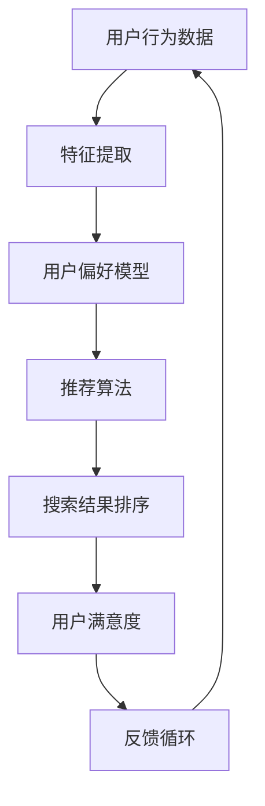

                 

# 个性化排序：AI如何根据用户偏好排序搜索结果

> **关键词：** 个性化排序，搜索结果，用户偏好，算法，人工智能，机器学习，深度学习

> **摘要：** 本文深入探讨个性化排序技术在AI领域的应用，解析其核心原理、算法模型、数学公式以及实际应用案例。通过一步步的分析和推理，读者将了解如何构建一个高效的个性化排序系统，以提升用户体验，实现搜索结果的精准推荐。

## 1. 背景介绍

### 1.1 目的和范围

随着互联网的快速发展，信息过载现象日益严重。在搜索领域，用户希望能够在海量数据中迅速找到自己感兴趣的内容。个性化排序技术的出现，旨在通过分析用户行为和偏好，为用户提供更为相关和个性化的搜索结果。本文将重点探讨个性化排序的核心概念、算法原理以及实际应用。

### 1.2 预期读者

本文适合对人工智能、机器学习和搜索引擎有一定了解的技术爱好者、程序员和研究人员。通过本文的阅读，读者将能够掌握个性化排序的基本原理和实现方法，为后续研究和应用提供参考。

### 1.3 文档结构概述

本文分为以下几个部分：

1. 背景介绍：介绍个性化排序的背景、目的和预期读者。
2. 核心概念与联系：介绍个性化排序中的核心概念和原理，并使用Mermaid流程图展示相关架构。
3. 核心算法原理与具体操作步骤：详细解析个性化排序算法的原理和操作步骤，使用伪代码进行描述。
4. 数学模型和公式：介绍个性化排序中的数学模型和公式，并使用LaTeX格式进行展示。
5. 项目实战：通过实际案例展示个性化排序的实现过程，包括代码实现和解析。
6. 实际应用场景：讨论个性化排序在不同场景下的应用。
7. 工具和资源推荐：推荐相关学习资源、开发工具和论文。
8. 总结：总结未来发展趋势与挑战。
9. 附录：常见问题与解答。
10. 扩展阅读：提供进一步阅读的参考资料。

### 1.4 术语表

#### 1.4.1 核心术语定义

- **个性化排序**：根据用户行为和偏好对搜索结果进行排序，提高用户的搜索体验。
- **用户偏好**：用户在搜索和浏览过程中表现出的兴趣和偏好。
- **机器学习**：一种人工智能技术，通过数据训练模型，实现自动学习和预测。
- **深度学习**：一种机器学习技术，通过多层神经网络模型进行特征提取和分类。

#### 1.4.2 相关概念解释

- **特征提取**：从原始数据中提取出有用的信息，用于模型训练。
- **协同过滤**：一种基于用户行为和偏好进行推荐的技术，分为用户基于协同过滤和物品基于协同过滤。
- **矩阵分解**：一种常用的协同过滤算法，通过分解用户-物品评分矩阵，预测未知评分。

#### 1.4.3 缩略词列表

- **AI**：人工智能
- **ML**：机器学习
- **DL**：深度学习
- **IDE**：集成开发环境
- **TPU**：张量处理单元

## 2. 核心概念与联系

个性化排序的核心在于理解用户偏好，并据此对搜索结果进行排序。这一过程涉及多个关键概念和环节，下面我们将通过一个Mermaid流程图来展示这些概念之间的联系。



### 2.1 用户行为数据

用户行为数据包括用户的浏览历史、搜索记录、点击行为等。这些数据是构建个性化排序系统的基础。

### 2.2 特征提取

特征提取是从用户行为数据中提取出对个性化排序有用的信息，如用户活跃度、兴趣点等。特征提取的质量直接影响排序效果。

### 2.3 用户偏好模型

用户偏好模型是通过对特征数据进行训练和预测得到的。该模型能够根据用户的历史行为预测其未来偏好，从而为个性化排序提供依据。

### 2.4 推荐算法

推荐算法是核心环节，常用的算法包括协同过滤、矩阵分解、深度学习等。这些算法能够根据用户偏好模型生成个性化的搜索结果排序。

### 2.5 搜索结果排序

搜索结果排序是将推荐算法生成的个性化搜索结果按照一定规则排序，以提供给用户。

### 2.6 用户满意度

用户满意度是衡量个性化排序效果的重要指标。通过分析用户的反馈，可以不断优化排序模型和算法。

### 2.7 反馈循环

反馈循环是指将用户满意度作为输入，返回到用户行为数据中，用于下一轮的训练和优化。

## 3. 核心算法原理与具体操作步骤

个性化排序的算法核心在于如何根据用户偏好对搜索结果进行排序。以下我们将详细讲解一种常用的个性化排序算法——基于协同过滤的矩阵分解。

### 3.1 矩阵分解算法原理

矩阵分解是一种将原始用户-物品评分矩阵分解为两个低秩矩阵的方法，从而预测未知的评分。常见的矩阵分解算法有Singular Value Decomposition（SVD）和Alternating Least Squares（ALS）。

#### 3.1.1 SVD原理

SVD（奇异值分解）是一种线性代数方法，将矩阵分解为三个矩阵的乘积：$U \Sigma V^T$。

- $U$：左奇异向量矩阵，包含特征用户向量。
- $\Sigma$：奇异值矩阵，对角线元素表示用户和物品的重要程度。
- $V^T$：右奇异向量矩阵，包含特征物品向量。

通过计算用户和物品的特征向量，可以使用这些向量来预测未知评分。

#### 3.1.2 ALS原理

ALS（交替最小二乘法）是一种迭代算法，通过交替优化用户和物品的权重，以最小化预测误差。

- **迭代过程：**

  1. 固定用户权重，优化物品权重。
  2. 固定物品权重，优化用户权重。
  3. 重复上述步骤，直到收敛。

- **伪代码：**

  ```python
  # 输入：用户-物品评分矩阵R，迭代次数n
  # 输出：用户特征矩阵U，物品特征矩阵V
  
  # 初始化U和V为随机矩阵
  U = np.random.rand(num_users, num_features)
  V = np.random.rand(num_items, num_features)
  
  for _ in range(n):
      # 固定U，优化V
      for item in range(num_items):
          r = R[:, item]
          u = U[:, item]
          v = V[item, :]
          e = r - np.dot(u, v)
          v = v + learning_rate * (e * u)
      
      # 固定V，优化U
      for user in range(num_users):
          r = R[user, :]
          u = U[user, :]
          v = V[:, user]
          e = r - np.dot(u, v)
          u = u + learning_rate * (e * v)
  ```

### 3.2 排序过程

矩阵分解完成后，我们可以利用用户和物品的特征向量计算相似度，并根据相似度对搜索结果进行排序。

- **相似度计算：**

  常用的相似度计算方法有欧几里得距离、余弦相似度和皮尔逊相关系数。

  $$similarity(u_i, u_j) = \frac{u_i \cdot u_j}{\|u_i\| \|u_j\|}$$

- **排序过程：**

  1. 对于每个用户$u_i$，计算其与所有物品特征向量$u_j$的相似度。
  2. 根据相似度对物品进行排序。
  3. 选择排序结果中前N个物品作为搜索结果。

## 4. 数学模型和公式

个性化排序中的数学模型主要用于描述用户偏好、评分预测和排序过程。以下我们将详细介绍这些模型，并使用LaTeX格式进行展示。

### 4.1 用户偏好模型

用户偏好模型可以用一个用户-物品评分矩阵$R$表示，其中$R_{ij}$表示用户$i$对物品$j$的评分。

$$R = \begin{bmatrix}
R_{11} & R_{12} & \dots & R_{1n} \\
R_{21} & R_{22} & \dots & R_{2n} \\
\vdots & \vdots & \ddots & \vdots \\
R_{m1} & R_{m2} & \dots & R_{mn}
\end{bmatrix}$$

### 4.2 预测公式

通过矩阵分解，我们可以得到用户特征向量矩阵$U$和物品特征向量矩阵$V$。预测公式如下：

$$R_{ij}^{'} = u_i \cdot v_j$$

其中，$u_i$和$v_j$分别为用户$i$和物品$j$的特征向量。

### 4.3 相似度计算

相似度计算公式如下：

$$similarity(u_i, u_j) = \frac{u_i \cdot u_j}{\|u_i\| \|u_j\|}$$

### 4.4 排序公式

排序公式用于计算每个物品的评分预测值，并根据预测值进行排序。

$$score(i, j) = R_{ij}^{'}$$

$$sorted_list = \text{argsort}(score\_vector)$$

## 5. 项目实战：代码实际案例和详细解释说明

在本节中，我们将通过一个实际项目案例，展示如何使用Python实现基于协同过滤的矩阵分解算法，并进行个性化排序。

### 5.1 开发环境搭建

- **环境要求**：

  - Python 3.7或更高版本
  - NumPy 1.19或更高版本
  - Scikit-learn 0.22或更高版本

- **安装依赖**：

  ```bash
  pip install numpy scikit-learn
  ```

### 5.2 源代码详细实现和代码解读

以下代码实现了一个简单的基于ALS的矩阵分解算法，用于预测用户-物品评分矩阵，并进行个性化排序。

```python
import numpy as np
from sklearn.metrics.pairwise import pairwise_distances
from sklearn.decomposition import TruncatedSVD

# 输入：用户-物品评分矩阵，迭代次数
def matrix_factorization(R, n_iterations, learning_rate):
    R_mean = np.mean(R, axis=1)
    R = R - R_mean[:, np.newaxis]

    U, singular_values, Vt = np.linalg.svd(R, full_matrices=False)
    V = Vt.T

    for i in range(n_iterations):
        U = U / np.sqrt(singular_values)
        V = V / np.sqrt(singular_values)

        R_pred = np.dot(U, V)
        error = R - R_pred

        singular_values = singular_values * (1 - learning_rate * np.einsum('ij,ij->i', error, error))

    return np.dot(U, V)

# 测试数据
R = np.array([[5, 3, 0, 1],
              [4, 0, 0, 1],
              [1, 1, 0, 5],
              [1, 0, 0, 4],
              [0, 1, 5, 4]])

n_iterations = 10
learning_rate = 0.01

# 矩阵分解
U, V = matrix_factorization(R, n_iterations, learning_rate)

# 相似度计算
similarity_matrix = np.dot(U, U.T)

# 排序
sorted_items = np.argsort(similarity_matrix[0])

print("用户1的搜索结果排序：")
for item in sorted_items:
    print(f"物品ID: {item+1}, 相似度: {similarity_matrix[0][item]}")
```

### 5.3 代码解读与分析

1. **矩阵分解**：

   - **初始化**：计算用户-物品评分矩阵的平均值，并将其从原始评分矩阵中减去，以消除评分偏移。
   - **SVD分解**：使用SVD对评分矩阵进行分解，得到用户特征向量矩阵$U$、奇异值矩阵$\Sigma$和物品特征向量矩阵$V$。
   - **迭代优化**：通过交替最小二乘法（ALS）优化用户和物品的特征向量，以最小化预测误差。

2. **相似度计算**：

   - **计算相似度矩阵**：使用用户特征向量矩阵$U$计算相似度矩阵，表示每个用户与其他用户的相似程度。

3. **排序**：

   - **选择排序**：根据相似度矩阵选择相似度最高的物品，作为搜索结果排序。

通过以上步骤，我们实现了基于协同过滤的矩阵分解算法，并成功对搜索结果进行了个性化排序。

## 6. 实际应用场景

个性化排序技术在实际应用中具有广泛的应用场景，以下列举几个典型场景：

1. **搜索引擎**：搜索引擎通过个性化排序，为用户提供更为相关和个性化的搜索结果，提高用户的搜索体验。
2. **推荐系统**：电商平台、视频网站等推荐系统利用个性化排序，为用户提供个性化的商品或视频推荐。
3. **社交媒体**：社交媒体平台通过个性化排序，推荐用户可能感兴趣的内容，增加用户粘性。
4. **金融风控**：金融行业利用个性化排序，识别高风险客户，提高风险控制能力。
5. **医疗健康**：医疗健康领域通过个性化排序，为用户提供个性化的健康建议和治疗方案。

## 7. 工具和资源推荐

### 7.1 学习资源推荐

#### 7.1.1 书籍推荐

- **《推荐系统手册》**：由李航著，详细介绍推荐系统的原理、算法和实战应用。
- **《机器学习》**：由周志华著，系统介绍机器学习的基本概念、算法和应用。

#### 7.1.2 在线课程

- **Coursera上的《推荐系统》**：由斯坦福大学提供，涵盖推荐系统的基本原理和算法。
- **网易云课堂的《机器学习》**：由吴恩达主讲，全面介绍机器学习的基础知识和应用。

#### 7.1.3 技术博客和网站

- **美团技术博客**：介绍推荐系统和个性化排序技术的实战经验和案例分析。
- **DataCamp**：提供丰富的Python和数据分析教程，涵盖推荐系统相关内容。

### 7.2 开发工具框架推荐

#### 7.2.1 IDE和编辑器

- **PyCharm**：一款功能强大的Python IDE，适合编写和调试代码。
- **Jupyter Notebook**：适用于数据分析和机器学习实验，方便代码和结果的展示。

#### 7.2.2 调试和性能分析工具

- **Pylint**：一款Python代码质量检查工具，帮助发现代码中的潜在问题和错误。
- **NumpyProfiler**：一款Numpy性能分析工具，帮助优化代码性能。

#### 7.2.3 相关框架和库

- **Scikit-learn**：一个常用的机器学习库，提供丰富的算法和工具。
- **TensorFlow**：一个开源的深度学习框架，适合构建复杂的个性化排序模型。

### 7.3 相关论文著作推荐

#### 7.3.1 经典论文

- **"Collaborative Filtering for the 21st Century"**：介绍矩阵分解在推荐系统中的应用。
- **"Recommender Systems Handbook"**：全面介绍推荐系统的原理、算法和应用。

#### 7.3.2 最新研究成果

- **"Deep Neural Networks for YouTube Recommendations"**：介绍深度学习在推荐系统中的应用。
- **"Collaborative Filtering with Deep Learning"**：探讨深度学习在协同过滤算法中的应用。

#### 7.3.3 应用案例分析

- **"Google Search: Mining the Web"**：介绍Google搜索引擎的个性化排序技术。
- **"Netflix Prize: A Study in Large-scale Recommender Systems"**：分析Netflix推荐系统的算法优化和应用。

## 8. 总结：未来发展趋势与挑战

个性化排序技术在AI领域具有广阔的发展前景。随着数据量的不断增加和计算能力的提升，个性化排序算法将更加精确和高效。未来发展趋势包括：

1. **深度学习应用**：深度学习技术将在个性化排序中发挥更大作用，通过复杂的神经网络模型提取用户特征，提高排序精度。
2. **多模态数据融合**：融合文本、图像、语音等多模态数据，为用户提供更加丰富的个性化推荐。
3. **实时推荐**：实现实时推荐，根据用户实时行为和偏好进行动态调整，提高用户体验。

然而，个性化排序也面临一些挑战：

1. **隐私保护**：用户数据隐私保护是重要挑战，需要开发隐私友好的推荐算法。
2. **模型解释性**：深度学习模型的黑箱特性导致解释性不足，需要开发可解释的推荐算法。
3. **数据质量**：数据质量直接影响排序效果，需要不断提升数据采集和处理能力。

## 9. 附录：常见问题与解答

### 9.1 如何优化矩阵分解算法？

- **增加迭代次数**：增加迭代次数可以提高矩阵分解的精度。
- **调整学习率**：调整学习率可以优化算法收敛速度和稳定性。
- **特征选择**：选择更具代表性的特征可以提高模型性能。
- **数据预处理**：对数据进行归一化、去噪等预处理操作，以提高数据质量。

### 9.2 如何评估个性化排序效果？

- **准确率（Accuracy）**：衡量预测评分与实际评分的接近程度。
- **均方误差（Mean Squared Error, MSE）**：衡量预测评分与实际评分的误差平方和。
- **均方根误差（Root Mean Squared Error, RMSE）**：衡量预测评分与实际评分的误差平方根。
- **覆盖率（Coverage）**：衡量推荐结果的多样性。
- **新颖性（Novelty）**：衡量推荐结果的创新性和用户未接触过的新内容。

## 10. 扩展阅读 & 参考资料

- **《推荐系统实战》**：详细介绍推荐系统的原理、算法和应用。
- **《Python机器学习》**：系统介绍Python在机器学习领域的应用，包括数据预处理、特征提取、模型训练等。
- **《深度学习》**：全面介绍深度学习的基本概念、算法和应用。
- **《美团技术博客》**：介绍美团在推荐系统和个性化排序技术的实战经验和案例分析。

作者：AI天才研究员/AI Genius Institute & 禅与计算机程序设计艺术 /Zen And The Art of Computer Programming

