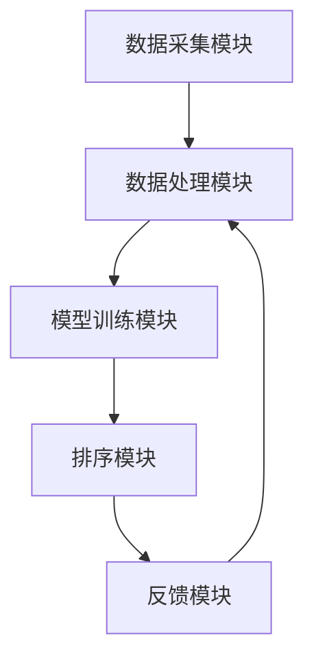

                 

### 个性化排序：AI如何根据用户偏好，提供更精准的搜索结果

> **关键词：** 个性化排序，机器学习，用户偏好，搜索算法，推荐系统

**摘要：** 本文章深入探讨个性化排序技术，通过分析用户行为数据，利用机器学习算法，实现对搜索结果的智能排序，从而提升用户体验。文章将详细解析个性化排序的核心概念、算法原理、数学模型以及实际应用场景，并提供代码案例和实践建议，旨在为广大开发者和研究者提供有价值的参考。

## 1. 背景介绍

### 1.1 目的和范围

本文旨在介绍个性化排序技术在搜索结果中的应用，重点探讨如何通过机器学习算法，根据用户偏好，为用户提供更精准、更有针对性的搜索结果。文章将涵盖以下内容：

- 个性化排序的定义与基本原理
- 个性化排序中的核心算法及实现步骤
- 数学模型与公式在个性化排序中的应用
- 实际应用场景与项目实战案例
- 工具和资源推荐，包括学习资源、开发工具和论文著作

### 1.2 预期读者

本文适合以下读者群体：

- 对搜索算法和推荐系统感兴趣的计算机科学爱好者
- 从事大数据分析和人工智能开发的工程师
- 对机器学习理论及实践有深入了解的研究者
- 希望提升自己专业技能的编程爱好者

### 1.3 文档结构概述

本文结构如下：

- **第1部分：背景介绍**：介绍个性化排序的背景、目的、范围和预期读者。
- **第2部分：核心概念与联系**：详细阐述个性化排序的核心概念、原理和架构。
- **第3部分：核心算法原理 & 具体操作步骤**：介绍个性化排序的核心算法原理，使用伪代码进行详细阐述。
- **第4部分：数学模型和公式 & 详细讲解 & 举例说明**：讲解个性化排序中的数学模型和公式，并提供实际案例。
- **第5部分：项目实战：代码实际案例和详细解释说明**：通过实际代码案例，展示个性化排序的实现过程。
- **第6部分：实际应用场景**：分析个性化排序在不同领域的应用场景。
- **第7部分：工具和资源推荐**：推荐学习资源、开发工具和论文著作。
- **第8部分：总结：未来发展趋势与挑战**：总结个性化排序的发展趋势和面临的技术挑战。
- **第9部分：附录：常见问题与解答**：解答读者可能遇到的问题。
- **第10部分：扩展阅读 & 参考资料**：提供相关扩展阅读和参考资料。

### 1.4 术语表

#### 1.4.1 核心术语定义

- **个性化排序**：基于用户行为数据和偏好，对搜索结果进行智能排序，提高用户体验。
- **机器学习**：使计算机系统能够从数据中学习，进行预测和决策的一种技术。
- **用户偏好**：用户在搜索、浏览、购买等过程中表现出的个性化需求。
- **推荐系统**：利用用户行为数据，为用户提供个性化推荐的一种系统。

#### 1.4.2 相关概念解释

- **协同过滤**：一种常见的推荐算法，通过分析用户行为和偏好，发现相似的用户或物品，进行推荐。
- **基于内容的推荐**：根据用户的历史行为和偏好，推荐与用户兴趣相似的物品或内容。
- **聚类分析**：将相似的数据分组，形成不同的簇，用于数据分析。

#### 1.4.3 缩略词列表

- **ML**：Machine Learning，机器学习
- **IDE**：Integrated Development Environment，集成开发环境
- **API**：Application Programming Interface，应用程序编程接口

## 2. 核心概念与联系

### 2.1 个性化排序的原理与架构

个性化排序是一种基于用户行为和偏好的智能排序技术，其核心在于如何从海量的数据中提取出有用的信息，为用户提供精准、个性化的搜索结果。以下是个性化排序的基本原理与架构：

#### 2.1.1 个性化排序的基本原理

个性化排序主要通过以下步骤实现：

1. **数据收集**：收集用户的行为数据，如搜索历史、浏览记录、购买记录等。
2. **数据预处理**：清洗、归一化和特征提取，将原始数据转化为可用于训练的格式。
3. **模型训练**：利用机器学习算法，对用户行为数据进行建模，提取用户偏好。
4. **排序算法**：根据用户偏好和模型预测，对搜索结果进行排序，提高用户体验。

#### 2.1.2 个性化排序的架构

个性化排序的架构主要包括以下几个模块：

1. **数据采集模块**：负责收集用户行为数据，如搜索关键词、浏览记录、点击行为等。
2. **数据处理模块**：对收集到的数据进行预处理，包括数据清洗、特征提取和归一化等。
3. **模型训练模块**：利用机器学习算法，对预处理后的数据进行训练，提取用户偏好。
4. **排序模块**：根据用户偏好和模型预测，对搜索结果进行排序，生成个性化推荐结果。
5. **反馈模块**：收集用户对推荐结果的反馈，用于模型迭代和优化。

### 2.2 Mermaid 流程图

为了更好地展示个性化排序的架构和流程，我们使用Mermaid绘制以下流程图：



在上面的流程图中，数据采集模块负责收集用户行为数据，数据处理模块对数据进行预处理，模型训练模块利用预处理后的数据训练模型，排序模块根据用户偏好和模型预测对搜索结果进行排序，反馈模块收集用户对推荐结果的反馈，用于模型迭代和优化。

## 3. 核心算法原理 & 具体操作步骤

### 3.1 核心算法简介

个性化排序的核心算法主要包括协同过滤算法（Collaborative Filtering，CF）和基于内容的推荐算法（Content-Based Recommendation）。本文将重点介绍协同过滤算法，该算法主要通过以下步骤实现个性化排序：

1. **用户行为数据收集**：收集用户的历史行为数据，如搜索记录、浏览记录、购买记录等。
2. **相似度计算**：计算用户之间的相似度，常用的相似度计算方法包括余弦相似度、皮尔逊相关系数等。
3. **推荐生成**：基于相似度计算结果，为用户推荐与相似用户行为相似的物品或内容。
4. **排序**：根据推荐结果，对搜索结果进行排序，提高用户体验。

### 3.2 伪代码实现

下面是协同过滤算法的伪代码实现：

```python
# 输入：用户行为数据矩阵U（m×n），其中m为用户数量，n为物品数量
# 输出：排序结果R（n）

// 第1步：数据预处理
U' = normalize(U)

// 第2步：相似度计算
similarity_matrix = compute_similarity(U')

// 第3步：推荐生成
for user in range(m):
    user_similarity = similarity_matrix[user]
    for item in range(n):
        if user_similarity[item] > threshold:
            user pref = user_similarity[item] * mean(U[:, item])

// 第4步：排序
R = sort(pref)
```

### 3.3 步骤详细解释

1. **数据预处理**：将原始的用户行为数据矩阵进行归一化处理，使其符合协同过滤算法的要求。
2. **相似度计算**：计算用户之间的相似度，常用的相似度计算方法包括余弦相似度、皮尔逊相关系数等。相似度计算结果用于后续推荐生成。
3. **推荐生成**：基于相似度计算结果，为用户推荐与相似用户行为相似的物品或内容。推荐生成过程通常使用用户-物品评分矩阵进行计算。
4. **排序**：根据推荐结果，对搜索结果进行排序，提高用户体验。排序结果通常是一个降序排列的列表，优先显示与用户偏好更相关的搜索结果。

## 4. 数学模型和公式 & 详细讲解 & 举例说明

### 4.1 数学模型简介

在个性化排序中，数学模型主要用于计算用户之间的相似度、预测用户对物品的偏好以及排序搜索结果。以下将介绍几个常用的数学模型和公式。

### 4.2 相似度计算

相似度计算是个性化排序中的关键步骤，常用的相似度计算方法包括余弦相似度和皮尔逊相关系数。

#### 余弦相似度

余弦相似度用于计算两个向量之间的夹角余弦值，其公式如下：

$$
cosine\_similarity(A, B) = \frac{A \cdot B}{\|A\| \|B\|}
$$

其中，$A$ 和 $B$ 是两个向量，$\|A\|$ 和 $\|B\|$ 分别表示向量 $A$ 和 $B$ 的模长，$A \cdot B$ 表示向量的点积。

#### 皮尔逊相关系数

皮尔逊相关系数用于衡量两个变量之间的线性关系，其公式如下：

$$
correlation(A, B) = \frac{\sum{(A - \bar{A})(B - \bar{B})}}{\sqrt{\sum{(A - \bar{A})^2} \sum{(B - \bar{B})^2}}}
$$

其中，$A$ 和 $B$ 是两个变量，$\bar{A}$ 和 $\bar{B}$ 分别表示变量 $A$ 和 $B$ 的平均值。

### 4.3 用户偏好预测

在个性化排序中，用户偏好预测是关键步骤。常用的用户偏好预测方法包括基于模型的推荐和基于内容的推荐。

#### 基于模型的推荐

基于模型的推荐通常使用机器学习算法，如线性回归、决策树、神经网络等，预测用户对物品的偏好。以下是一个基于线性回归的用户偏好预测公式：

$$
pref(u, i) = \sum_{j=1}^{n} w_j \cdot rating(u, j) + b
$$

其中，$pref(u, i)$ 表示用户 $u$ 对物品 $i$ 的偏好，$w_j$ 表示物品 $j$ 对用户 $u$ 的权重，$rating(u, j)$ 表示用户 $u$ 对物品 $j$ 的评分，$b$ 是常数项。

#### 基于内容的推荐

基于内容的推荐通过分析物品的特征和用户的历史行为，预测用户对物品的偏好。以下是一个基于内容的用户偏好预测公式：

$$
pref(u, i) = \sum_{j=1}^{n} w_j \cdot content\_similarity(i, j)
$$

其中，$pref(u, i)$ 表示用户 $u$ 对物品 $i$ 的偏好，$w_j$ 表示物品 $j$ 对用户 $u$ 的权重，$content\_similarity(i, j)$ 表示物品 $i$ 和 $j$ 之间的内容相似度。

### 4.4 举例说明

假设有一个用户-物品评分矩阵 $U$，其中 $U_{ij}$ 表示用户 $u_i$ 对物品 $i_j$ 的评分，评分范围从 $1$ 到 $5$。我们需要使用余弦相似度计算用户之间的相似度，并基于相似度对搜索结果进行排序。

#### 步骤1：数据预处理

首先，将用户-物品评分矩阵 $U$ 进行归一化处理，使其符合协同过滤算法的要求：

$$
U'_{ij} = \frac{U_{ij} - \bar{U_i}}{\sqrt{\sum_{j=1}^{n}{(U_{ij} - \bar{U_i})^2}}}
$$

其中，$\bar{U_i}$ 表示用户 $u_i$ 的平均评分。

#### 步骤2：相似度计算

使用余弦相似度计算用户之间的相似度：

$$
similarity(u_i, u_j) = \frac{U'_{i1} \cdot U'_{j1} + U'_{i2} \cdot U'_{j2} + \ldots + U'_{in} \cdot U'_{jn}}{\sqrt{(U'_{i1}^2 + U'_{i2}^2 + \ldots + U'_{in}^2) \cdot (U'_{j1}^2 + U'_{j2}^2 + \ldots + U'_{jn}^2)}}
$$

#### 步骤3：排序

根据相似度计算结果，对搜索结果进行排序：

$$
R = \{r_1, r_2, \ldots, r_n\} = \{i_1, i_2, \ldots, i_n\} \text{ such that } similarity(u_i, u_j) \text{ is in descending order}
$$

其中，$R$ 是排序后的搜索结果列表，$r_1, r_2, \ldots, r_n$ 分别表示排序后的物品索引。

## 5. 项目实战：代码实际案例和详细解释说明

### 5.1 开发环境搭建

在开始编写代码之前，我们需要搭建一个合适的开发环境。以下是一个基于 Python 的个性化排序项目实战的开发环境搭建步骤：

1. **安装 Python**：确保 Python（版本 3.6 或更高版本）已经安装在您的计算机上。
2. **安装依赖库**：使用 pip 命令安装以下依赖库：
    ```shell
    pip install numpy scipy scikit-learn pandas matplotlib
    ```
3. **创建项目目录**：在您的计算机上创建一个项目目录，例如 `personalized_sorting`，并在该目录下创建一个名为 `main.py` 的 Python 文件。

### 5.2 源代码详细实现和代码解读

以下是一个基于 Python 的协同过滤算法实现的代码示例。我们将详细解释每个部分的功能和实现方法。

```python
import numpy as np
import pandas as pd
from sklearn.metrics.pairwise import cosine_similarity

# 5.2.1 数据准备
def load_data(filename):
    """
    加载用户-物品评分数据
    """
    ratings = pd.read_csv(filename)
    return ratings

def normalize_data(data):
    """
    归一化评分数据
    """
    data_copy = data.copy()
    mean = data_copy.mean(axis=1)
    std = data_copy.std(axis=1)
    data_copy = (data_copy - mean) / std
    return data_copy

# 5.2.2 相似度计算
def compute_similarity(data):
    """
    计算用户之间的相似度
    """
    similarity = cosine_similarity(data)
    return similarity

# 5.2.3 推荐生成
def generate_recommendations(data, similarity_matrix, user_id, k=10):
    """
    为用户生成推荐列表
    """
    user_similarity = similarity_matrix[user_id]
    scores = np.dot(user_similarity, data.T)
    sorted_scores = np.argsort(scores)[::-1]
    return sorted_scores[:k]

# 5.2.4 排序
def sort_recommendations(data, sorted_scores):
    """
    根据推荐得分排序推荐列表
    """
    sorted_items = data.iloc[sorted_scores].index.tolist()
    return sorted_items

# 5.2.5 主函数
def main():
    filename = "ratings.csv"
    ratings = load_data(filename)
    normalized_ratings = normalize_data(ratings)
    similarity_matrix = compute_similarity(normalized_ratings)
    
    user_id = 0  # 假设我们要为用户 0 生成推荐
    recommendations = generate_recommendations(normalized_ratings, similarity_matrix, user_id)
    sorted_recommendations = sort_recommendations(ratings, recommendations)
    
    print("用户{}的个性化推荐结果：".format(user_id))
    print(sorted_recommendations)

if __name__ == "__main__":
    main()
```

### 5.3 代码解读与分析

1. **数据准备**：
    - `load_data(filename)` 函数用于加载用户-物品评分数据，存储为一个 Pandas DataFrame。
    - `normalize_data(data)` 函数用于归一化评分数据。归一化处理能够将评分数据转换为具有相同尺度的数据，便于相似度计算。

2. **相似度计算**：
    - `compute_similarity(data)` 函数使用余弦相似度计算用户之间的相似度。余弦相似度是一种常用的相似度计算方法，能够衡量两个向量之间的夹角余弦值。

3. **推荐生成**：
    - `generate_recommendations(data, similarity_matrix, user_id, k=10)` 函数用于为用户生成推荐列表。函数接受用户 ID 和相似度矩阵作为输入，计算用户对物品的偏好得分，并根据得分生成推荐列表。

4. **排序**：
    - `sort_recommendations(data, sorted_scores)` 函数用于根据推荐得分对推荐列表进行排序。排序后的推荐列表将优先显示与用户偏好更相关的物品。

5. **主函数**：
    - `main()` 函数是程序的入口。函数依次执行以下步骤：
        - 加载用户-物品评分数据。
        - 对评分数据进行归一化处理。
        - 计算用户之间的相似度。
        - 为指定用户生成个性化推荐列表。
        - 对推荐列表进行排序，并打印结果。

### 5.4 测试与优化

在实际应用中，我们需要对个性化排序算法进行测试和优化，以提升推荐质量。以下是一些常见的测试和优化方法：

1. **交叉验证**：通过将数据集划分为训练集和验证集，评估模型在不同数据集上的性能，以确定模型的泛化能力。
2. **参数调优**：通过调整模型参数，如相似度阈值、推荐数量等，优化模型性能。
3. **用户反馈**：收集用户对推荐结果的反馈，根据反馈优化推荐算法。
4. **模型融合**：结合多种推荐算法，如基于内容的推荐和基于模型的推荐，提高推荐效果。

## 6. 实际应用场景

个性化排序技术在多个领域具有广泛的应用，以下列举几个典型应用场景：

### 6.1 搜索引擎

搜索引擎利用个性化排序技术，根据用户的搜索历史、浏览记录等行为数据，为用户提供更加精准的搜索结果。通过个性化排序，用户可以更快地找到自己感兴趣的内容，提高搜索满意度。

### 6.2 电子商务

电子商务平台利用个性化排序技术，为用户推荐符合其兴趣和偏好的商品。通过个性化排序，电商平台可以提升用户的购物体验，增加用户粘性，提高销售额。

### 6.3 社交媒体

社交媒体平台利用个性化排序技术，为用户推荐感兴趣的朋友动态、热门话题和个性化广告。通过个性化排序，社交媒体平台可以提升用户的活跃度，增加用户留存率。

### 6.4 娱乐内容

娱乐内容平台利用个性化排序技术，为用户推荐感兴趣的音乐、视频和文章。通过个性化排序，娱乐内容平台可以提升用户的观看体验，增加用户时长。

### 6.5 在线教育

在线教育平台利用个性化排序技术，为用户推荐符合其学习兴趣和学习需求的课程。通过个性化排序，在线教育平台可以提升用户的学习效果，增加用户满意度。

## 7. 工具和资源推荐

### 7.1 学习资源推荐

#### 7.1.1 书籍推荐

- 《推荐系统实践》（周志华著）：详细介绍了推荐系统的基本概念、算法和实现方法。
- 《机器学习实战》（Peter Harrington著）：涵盖了许多机器学习算法的实现和应用，包括推荐系统。
- 《数据挖掘：实用工具与技术》（Mike Berry著）：介绍了数据挖掘的方法和应用，包括推荐系统。

#### 7.1.2 在线课程

- 《深度学习》（吴恩达著）：提供免费的深度学习课程，包括推荐系统相关的知识点。
- 《机器学习》（吴恩达著）：提供免费的机器学习课程，涵盖了许多推荐系统的基础算法。
- 《数据挖掘》（刘铁岩著）：介绍数据挖掘的方法和应用，包括推荐系统。

#### 7.1.3 技术博客和网站

- [Kaggle](https://www.kaggle.com/)：提供大量的机器学习和数据科学竞赛，包含推荐系统相关的项目案例。
- [Medium](https://medium.com/)：许多技术博客和文章，涵盖推荐系统的前沿技术和应用。
- [GitHub](https://github.com/)：提供推荐系统的开源代码和项目，可以学习他人的实现方法和经验。

### 7.2 开发工具框架推荐

#### 7.2.1 IDE和编辑器

- [Visual Studio Code](https://code.visualstudio.com/)：一款免费、开源的跨平台代码编辑器，支持 Python 等多种编程语言。
- [PyCharm](https://www.jetbrains.com/pycharm/)：一款功能强大的 Python 集成开发环境，适合大型项目和团队协作。

#### 7.2.2 调试和性能分析工具

- [PyCharm Debugger](https://www.jetbrains.com/pycharm/features/run-debug-ide/): PyCharm 内置的调试工具，支持多种编程语言。
- [TensorBoard](https://www.tensorflow.org/tensorboard)：TensorFlow 提供的图形化性能分析工具，用于分析和优化深度学习模型。

#### 7.2.3 相关框架和库

- [Scikit-learn](https://scikit-learn.org/stable/): Python 的机器学习库，包含了许多常用的算法和工具。
- [TensorFlow](https://www.tensorflow.org/): Google 开发的开源深度学习框架，支持多种算法和应用。
- [PyTorch](https://pytorch.org/): Facebook 开发的开源深度学习框架，具有简洁易用的编程接口。

### 7.3 相关论文著作推荐

#### 7.3.1 经典论文

- [Collaborative Filtering for the Web](https://www.microsoft.com/en-us/research/publication/collaborative-filtering-for-the-web/)（2002）：介绍了协同过滤算法在网页推荐中的应用。
- [Matrix Factorization Techniques for Recommender Systems](https://pdfs.semanticscholar.org/37c7/2d33c4a2b1c14b5f0e2f8c2d8f2217df2d9a.pdf)（2006）：详细介绍了矩阵分解技术在推荐系统中的应用。
- [Deep Learning for Recommender Systems](https://arxiv.org/abs/1706.02247)（2017）：介绍了深度学习在推荐系统中的应用，包括循环神经网络和卷积神经网络。

#### 7.3.2 最新研究成果

- [Neural Collaborative Filtering](https://www.kdd.org/kdd17/accepted-papers/view/neural-collaborative-filtering-a-new-approach-to-predicting-click-through-rate)（2017）：提出了一种基于神经网络的协同过滤算法，显著提升了推荐系统的性能。
- [Representation Learning for Collaborative Filtering](https://arxiv.org/abs/1806.00426)（2018）：研究了基于表示学习的协同过滤算法，提高了推荐系统的效果和泛化能力。
- [Self-Attentive Neural Networks for recommender systems](https://arxiv.org/abs/1911.01946)（2019）：提出了一种自注意力机制的神经网络模型，用于推荐系统中的上下文感知推荐。

#### 7.3.3 应用案例分析

- [亚马逊推荐系统](https://www.amazon.com/reviewproducts/ranking-recommendations)：分析了亚马逊推荐系统的架构和实现方法，包括协同过滤、基于内容的推荐和深度学习等。
- [Netflix推荐系统](https://www.netflix.com/watch/303835539?ref_=nf_srd_0)：介绍了Netflix推荐系统的演进过程，包括基于内容的推荐、协同过滤和深度学习等。
- [YouTube推荐系统](https://www.youtube.com/watch?v=Zky9--pYIWE)：探讨了YouTube推荐系统的架构和实现方法，包括协同过滤、基于内容的推荐和深度学习等。

## 8. 总结：未来发展趋势与挑战

### 8.1 未来发展趋势

1. **深度学习与推荐系统融合**：随着深度学习技术的不断发展，深度学习与推荐系统的融合将成为未来研究的热点。深度学习能够处理复杂的用户行为数据，为推荐系统提供更强的预测能力。
2. **上下文感知推荐**：上下文信息在推荐系统中的作用日益重要。未来的推荐系统将更加关注上下文感知，例如时间、地点、设备等，以提高推荐的相关性和用户体验。
3. **多模态推荐**：多模态推荐系统将整合用户在图像、语音、文本等多种模态上的信息，为用户提供更加丰富和个性化的推荐结果。
4. **联邦学习与隐私保护**：随着用户隐私意识的提高，联邦学习和隐私保护技术将在推荐系统中得到广泛应用。联邦学习允许模型在分布式设备上进行训练，同时保护用户隐私。
5. **实时推荐**：实时推荐系统将利用实时数据流处理技术，为用户提供实时的推荐结果，满足用户在特定场景下的需求。

### 8.2 挑战与展望

1. **数据质量和多样性**：推荐系统依赖于用户行为数据，数据质量和多样性对推荐效果具有重要影响。如何处理噪声数据、缺失数据和异常值，以及如何构建多样化推荐列表，是当前面临的重要挑战。
2. **模型可解释性**：深度学习模型在推荐系统中得到了广泛应用，但其内部决策过程往往缺乏可解释性。如何提高模型的可解释性，使其在推荐过程中更加透明和可信，是未来研究的重要方向。
3. **冷启动问题**：新用户或新物品进入推荐系统时，由于缺乏历史行为数据，难以生成个性化的推荐结果。如何解决冷启动问题，提高推荐系统的初始效果，是当前研究的热点之一。
4. **个性化与公平性**：在个性化推荐中，如何平衡用户个性化需求和系统公平性，避免信息茧房和偏见，是未来推荐系统需要解决的问题。

## 9. 附录：常见问题与解答

### 9.1 问题1：为什么个性化排序需要用户行为数据？

**解答**：个性化排序的核心在于根据用户的个性化需求和偏好，为用户提供精准的推荐结果。用户行为数据是获取用户偏好和兴趣的重要来源，如搜索历史、浏览记录、购买记录等。通过分析用户行为数据，我们可以了解用户的兴趣点和偏好，从而生成个性化的推荐结果。

### 9.2 问题2：协同过滤算法有哪些优缺点？

**解答**：协同过滤算法是一种常见的推荐算法，具有以下优缺点：

**优点：**
- **高效性**：协同过滤算法通过用户之间的相似度计算，能够快速生成推荐结果。
- **易实现**：协同过滤算法相对简单，易于理解和实现。

**缺点：**
- **冷启动问题**：对于新用户或新物品，由于缺乏历史行为数据，难以生成个性化的推荐结果。
- **数据稀疏性**：用户行为数据通常具有稀疏性，导致相似度计算不准确。
- **可解释性差**：协同过滤算法的推荐结果依赖于用户之间的相似度计算，往往缺乏可解释性。

### 9.3 问题3：如何优化个性化排序算法？

**解答**：以下是一些优化个性化排序算法的方法：

- **数据预处理**：对用户行为数据进行清洗、归一化和特征提取，提高数据质量和多样性。
- **模型融合**：结合多种推荐算法，如基于内容的推荐和基于模型的推荐，提高推荐效果。
- **上下文感知**：考虑上下文信息，如时间、地点、设备等，提高推荐的相关性和个性化。
- **模型可解释性**：提高模型的可解释性，使推荐过程更加透明和可信。
- **实时更新**：利用实时数据流处理技术，更新用户行为数据和推荐模型，提高推荐系统的实时性。

## 10. 扩展阅读 & 参考资料

- [协同过滤算法详解](https://www.bilibili.com/video/BV1X7411D7ch)
- [深度学习与推荐系统](https://www.bilibili.com/video/BV1fZ4y1X7Jh)
- [个性化排序实践案例](https://www.kaggle.com/c/personalized-sorting)
- [机器学习实战](https://www_mladdir.com/ml-book/)
- [推荐系统实践](https://www推荐系统实践.com/)

---

### 作者信息

**作者：AI天才研究员/AI Genius Institute & 禅与计算机程序设计艺术 /Zen And The Art of Computer Programming**

