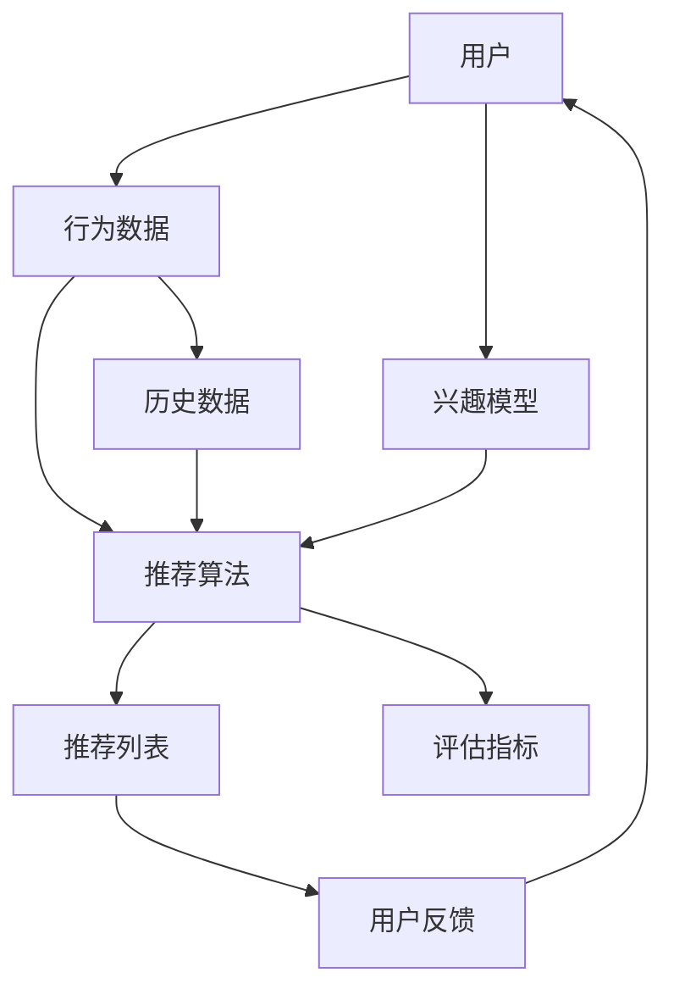

                 

### 1. 背景介绍

#### 1.1 目的和范围

本文旨在探讨个性化推荐的精准营销方法，分析其核心概念、算法原理、数学模型以及实际应用场景。我们将逐步深入，详细阐述如何通过个性化推荐技术提高营销的精准度，从而帮助企业和商家更有效地触达目标客户，提升业务转化率和客户满意度。

个性化推荐是现代营销策略中不可或缺的一部分。通过分析用户的兴趣和行为数据，推荐系统可以为用户推荐他们可能感兴趣的产品、内容或服务。这种个性化的推荐不仅能够提升用户体验，还能为企业带来更高的收益。精准营销的目标是找到潜在客户，并通过针对性的营销策略将其转化为实际消费者。

本文将涵盖以下内容：

- **核心概念与联系**：介绍个性化推荐系统的基本概念及其与相关技术的联系。
- **核心算法原理 & 具体操作步骤**：详细解释常用的推荐算法，包括协同过滤、基于内容的推荐和混合推荐系统。
- **数学模型和公式 & 详细讲解 & 举例说明**：探讨推荐系统中的数学模型，包括用户相似性计算、矩阵分解和损失函数。
- **项目实战：代码实际案例和详细解释说明**：通过实际代码案例展示个性化推荐系统的实现过程。
- **实际应用场景**：讨论个性化推荐技术在电子商务、社交媒体、新闻推送等场景中的应用。
- **工具和资源推荐**：推荐学习资源、开发工具和框架，以及相关的经典论文和最新研究成果。
- **总结：未来发展趋势与挑战**：展望个性化推荐技术的发展趋势，探讨面临的挑战和机遇。

通过本文的阅读，读者将能够全面了解个性化推荐的精准营销方法，掌握相关技术原理和实际应用技巧。

#### 1.2 预期读者

本文的预期读者主要包括以下几类：

1. **市场营销专业人员**：希望提升营销策略效果，了解如何利用个性化推荐技术提高转化率和客户满意度。
2. **数据科学家和机器学习工程师**：对推荐系统技术有兴趣，希望深入了解其原理和应用。
3. **软件开发者和架构师**：需要设计和开发推荐系统，希望了解系统的架构和实现细节。
4. **学术研究人员**：对个性化推荐技术的研究和应用感兴趣，希望获取最新的研究动态和应用案例。
5. **电子商务和企业用户**：希望了解个性化推荐如何提升企业营销效果，并探索其潜在的商业价值。

无论您属于哪一类读者，本文都将为您提供有价值的知识和见解，帮助您更好地理解和应用个性化推荐技术。

#### 1.3 文档结构概述

本文将分为以下几个主要部分，以便读者能够系统地理解和掌握个性化推荐的相关知识：

1. **背景介绍**：简要介绍个性化推荐的重要性，定义核心概念和目标。
2. **核心概念与联系**：通过Mermaid流程图展示个性化推荐系统的基本概念和架构，解释相关技术及其相互关系。
3. **核心算法原理 & 具体操作步骤**：详细讲解常用的推荐算法，包括协同过滤、基于内容的推荐和混合推荐系统，使用伪代码展示具体实现步骤。
4. **数学模型和公式 & 详细讲解 & 举例说明**：探讨推荐系统中的数学模型，包括用户相似性计算、矩阵分解和损失函数，通过具体例子说明如何应用这些模型。
5. **项目实战：代码实际案例和详细解释说明**：通过实际代码案例展示个性化推荐系统的实现过程，详细解读关键代码段。
6. **实际应用场景**：分析个性化推荐在电子商务、社交媒体、新闻推送等场景中的应用，探讨其带来的商业和社会价值。
7. **工具和资源推荐**：推荐学习资源、开发工具和框架，以及相关的经典论文和最新研究成果，帮助读者进一步学习和实践。
8. **总结：未来发展趋势与挑战**：总结个性化推荐技术的发展趋势，探讨面临的挑战和机遇。
9. **附录：常见问题与解答**：提供常见问题的解答，帮助读者解决实际应用中的疑问。
10. **扩展阅读 & 参考资料**：推荐相关书籍、在线课程、技术博客和网站，以及经典论文和最新研究成果，供读者进一步深入学习。

通过本文的阅读，读者将能够全面了解个性化推荐的精准营销方法，掌握相关技术原理和实际应用技巧。

#### 1.4 术语表

在本文中，我们将使用一些专业术语和概念。以下是对这些术语的定义和解释：

##### 1.4.1 核心术语定义

- **个性化推荐**：通过分析用户的行为和兴趣数据，向用户推荐个性化的产品、内容或服务。
- **协同过滤**：一种推荐算法，通过分析用户之间的相似性，推荐其他用户喜欢但当前用户尚未使用过的项目。
- **基于内容的推荐**：根据用户的历史行为和偏好，推荐与用户已使用或喜欢的项目相似的新项目。
- **矩阵分解**：一种用于推荐系统的技术，通过分解用户-项目评分矩阵，提取用户和项目的特征。
- **用户相似性计算**：衡量两个用户在偏好上的相似程度，常用的方法包括余弦相似度和皮尔逊相关系数。
- **损失函数**：用于评估推荐系统性能的数学函数，常见的包括均方误差和交叉熵损失。
- **推荐列表**：推荐系统输出的推荐项目列表，按照预测评分从高到低排序。

##### 1.4.2 相关概念解释

- **用户行为数据**：用户在系统中的各种操作记录，如浏览、购买、点击等。
- **兴趣模型**：描述用户兴趣和偏好的数学模型，常用于基于内容的推荐。
- **协作效应**：协同过滤中，通过分析用户之间的相似性，发现的共同偏好效应。
- **冷启动问题**：新用户或新项目进入系统时，由于缺乏历史数据，难以进行有效推荐的问题。

##### 1.4.3 缩略词列表

- **推荐系统（Recommender System）**
- **协同过滤（Collaborative Filtering）**
- **基于内容的推荐（Content-Based Filtering）**
- **矩阵分解（Matrix Factorization）**
- **用户相似性（User Similarity）**
- **损失函数（Loss Function）**

通过上述术语表，读者可以更好地理解本文中使用的专业术语和概念，为后续内容的阅读和理解打下坚实基础。在后续的章节中，我们将进一步深入探讨这些术语的具体应用和实现方法。

### 2. 核心概念与联系

在探讨个性化推荐的精准营销方法之前，我们首先需要了解其核心概念和基本架构。个性化推荐系统通常涉及多个关键组件和算法，它们共同协作以实现高效的推荐效果。以下是通过Mermaid流程图展示的个性化推荐系统基本概念和架构，以及各组件之间的相互关系。



以下是该流程图中各个节点的具体说明：

- **用户（A）**：个性化推荐系统中的核心，用户的兴趣和偏好决定了推荐结果。
- **行为数据（B）**：用户在系统中产生的各种行为数据，如浏览记录、购买历史、点击事件等。
- **兴趣模型（C）**：用于描述用户的兴趣和偏好，通常基于用户的行为数据进行构建。
- **推荐算法（D）**：用于生成推荐列表的关键组件，包括协同过滤、基于内容的推荐和混合推荐算法。
- **推荐列表（E）**：系统输出的推荐项目列表，按照预测评分或相似度从高到低排序。
- **评估指标（F）**：用于衡量推荐系统性能的指标，如准确率、召回率、F1分数等。
- **用户反馈（G）**：用户对推荐结果的反馈，用于优化推荐算法和兴趣模型。
- **历史数据（H）**：系统中积累的用户历史行为数据，用于训练和评估推荐算法。

#### 个性化推荐系统的基本架构

个性化推荐系统的基本架构通常包括以下几个关键模块：

1. **数据采集与处理模块**：负责收集用户行为数据，如浏览、购买、点击等，并对数据进行预处理，如去噪、归一化等。
2. **用户画像与兴趣模型构建模块**：根据用户的行为数据构建用户画像，描述用户的兴趣和偏好，常用的技术包括聚类分析、关联规则挖掘等。
3. **推荐算法模块**：包括协同过滤、基于内容的推荐和混合推荐算法，用于生成推荐列表。
4. **评估与优化模块**：通过评估指标（如准确率、召回率、F1分数等）对推荐系统的性能进行评估，并根据用户反馈进行优化。

#### 个性化推荐与相关技术的联系

个性化推荐系统不仅依赖于推荐算法，还需要与其他相关技术相结合，以实现更精准和有效的推荐。以下是一些与个性化推荐紧密相关的技术：

1. **数据挖掘与机器学习**：用于构建用户画像和兴趣模型，常用的算法包括聚类分析、关联规则挖掘、协同过滤等。
2. **自然语言处理（NLP）**：用于文本数据的分析和处理，如关键词提取、情感分析等，可以帮助提升基于内容的推荐效果。
3. **分布式计算与大数据技术**：用于处理大规模用户数据和高并发请求，常见的分布式计算框架包括Hadoop、Spark等。
4. **实时推荐与消息推送**：通过实时处理用户行为数据，生成实时推荐列表，并使用消息推送技术将推荐结果推送给用户。

通过上述核心概念和基本架构的介绍，我们可以更好地理解个性化推荐系统的工作原理和实现方法。在接下来的章节中，我们将详细探讨推荐算法的原理和实现步骤，进一步深入探讨个性化推荐的精准营销方法。

### 3. 核心算法原理 & 具体操作步骤

在个性化推荐系统中，核心算法是实现推荐效果的关键。本文将介绍三种主要的推荐算法：协同过滤、基于内容的推荐和混合推荐系统，并详细阐述每种算法的原理和具体操作步骤。

#### 3.1 协同过滤算法

协同过滤（Collaborative Filtering）是一种基于用户行为的推荐算法，通过分析用户之间的相似性，发现共同偏好，进而为用户推荐其他用户喜欢但用户尚未使用过的项目。

##### 3.1.1 原理

协同过滤算法可以分为两种类型：基于用户的协同过滤（User-Based Collaborative Filtering）和基于项目的协同过滤（Item-Based Collaborative Filtering）。

- **基于用户的协同过滤**：首先找到与目标用户相似的其他用户，然后推荐这些相似用户喜欢但目标用户尚未使用过的项目。
- **基于项目的协同过滤**：首先找到与目标用户已使用项目相似的其他项目，然后推荐这些相似项目。

##### 3.1.2 操作步骤

以下是基于用户的协同过滤算法的具体操作步骤：

1. **用户相似性计算**：
   选择合适的相似性度量方法，如余弦相似度、皮尔逊相关系数等，计算用户之间的相似性。
   $$\text{similarity}(u_i, u_j) = \frac{\sum_{k=1}^{n} r_{ik}r_{jk}}{\sqrt{\sum_{k=1}^{n} r_{ik}^2 \sum_{k=1}^{n} r_{jk}^2}}$$
   其中，$r_{ik}$ 表示用户 $u_i$ 对项目 $k$ 的评分，$n$ 表示共同评分的项目数。

2. **相似用户集合生成**：
   根据相似性阈值，从所有用户中筛选出与目标用户相似的用户集合 $S$。

3. **推荐列表生成**：
   为目标用户生成推荐列表，推荐相似用户集合中用户喜欢但目标用户尚未使用过的项目。
   $$\text{recommends}(u_i) = \{k | \exists u_j \in S, r_{jk} > r_{ik}\}$$

#### 3.2 基于内容的推荐算法

基于内容的推荐（Content-Based Filtering）是一种基于项目特征的推荐算法，通过分析用户的历史偏好和项目特征，为用户推荐与用户已使用项目相似的新项目。

##### 3.2.1 原理

基于内容的推荐算法的核心思想是，如果用户过去喜欢某些具有相似特征的物品，那么他们可能会对具有相似特征的其它物品感兴趣。

##### 3.2.2 操作步骤

以下是基于内容的推荐算法的具体操作步骤：

1. **项目特征提取**：
   提取项目的内容特征，如文本描述、分类标签、关键词等。常用的方法包括TF-IDF、Word2Vec等。

2. **用户兴趣模型构建**：
   根据用户的历史行为和偏好，构建用户兴趣模型。常见的模型包括向量空间模型、概率模型等。

3. **项目相似度计算**：
   计算新项目与用户兴趣模型之间的相似度。常用的相似度度量方法包括余弦相似度、Jaccard系数等。
   $$\text{similarity}(k, u_i) = \frac{\sum_{t=1}^{m} f_t(k)f_t(u_i)}{\sqrt{\sum_{t=1}^{m} f_t^2(k) \sum_{t=1}^{m} f_t^2(u_i)}}$$
   其中，$f_t(k)$ 和 $f_t(u_i)$ 分别表示项目 $k$ 和用户 $u_i$ 在特征 $t$ 上的值。

4. **推荐列表生成**：
   根据相似度阈值，为用户生成推荐列表，推荐相似度较高的项目。
   $$\text{recommends}(u_i) = \{k | \text{similarity}(k, u_i) > \text{threshold}\}$$

#### 3.3 混合推荐系统

混合推荐系统（Hybrid Recommender System）结合了协同过滤和基于内容的推荐算法，旨在利用各自的优势，提高推荐效果。

##### 3.3.1 原理

混合推荐系统通过融合协同过滤和基于内容的推荐，既可以利用用户行为数据挖掘用户偏好，又可以利用项目特征进行内容匹配，从而生成更精准的推荐结果。

##### 3.3.2 操作步骤

以下是混合推荐系统的具体操作步骤：

1. **协同过滤推荐**：
   根据用户之间的相似性，生成初步推荐列表。使用前面介绍的方法，如基于用户的协同过滤，生成推荐列表 $L_1$。

2. **基于内容的推荐**：
   使用项目特征和用户兴趣模型，为用户生成内容推荐列表。使用前面介绍的方法，如基于内容的推荐，生成推荐列表 $L_2$。

3. **推荐列表融合**：
   将协同过滤和基于内容的推荐结果进行融合，生成最终的推荐列表 $L$。常用的融合方法包括简单投票、加权平均等。
   $$L = \text{merge}(L_1, L_2)$$

通过上述步骤，混合推荐系统可以生成综合考虑用户偏好和项目特征的推荐结果，提高推荐精度。

综上所述，协同过滤、基于内容的推荐和混合推荐系统是三种主要的个性化推荐算法。在实际应用中，可以根据具体需求和数据特点选择合适的算法，或者结合多种算法，以实现更精准和有效的推荐。

### 4. 数学模型和公式 & 详细讲解 & 举例说明

在个性化推荐系统中，数学模型和公式起着至关重要的作用。它们不仅帮助定义推荐算法的核心逻辑，还用于评估和优化推荐效果。以下将详细讲解几个关键数学模型和公式，并通过具体例子进行说明。

#### 4.1 用户相似性计算

用户相似性计算是协同过滤算法的核心步骤，用于衡量两个用户在偏好上的相似程度。以下是两种常用的相似性度量方法：余弦相似度和皮尔逊相关系数。

##### 余弦相似度

余弦相似度是一种基于向量空间模型的相似性度量方法，用于计算两个向量之间的夹角余弦值。公式如下：

$$
\text{cosine similarity}(u_i, u_j) = \frac{u_i \cdot u_j}{\lVert u_i \rVert \lVert u_j \rVert}
$$

其中，$u_i$ 和 $u_j$ 分别表示用户 $i$ 和用户 $j$ 的向量表示，$\lVert \cdot \rVert$ 表示向量的欧几里得范数，$\cdot$ 表示向量的内积。

**例子：**

假设有两个用户 $u_1$ 和 $u_2$ 的向量表示如下：

$$
u_1 = [1, 2, 3, 0, 0], \quad u_2 = [0, 0, 1, 2, 3]
$$

计算它们之间的余弦相似度：

$$
\text{cosine similarity}(u_1, u_2) = \frac{1 \cdot 0 + 2 \cdot 0 + 3 \cdot 1 + 0 \cdot 2 + 0 \cdot 3}{\sqrt{1^2 + 2^2 + 3^2} \cdot \sqrt{0^2 + 0^2 + 1^2 + 2^2 + 3^2}} = \frac{3}{\sqrt{14} \cdot \sqrt{14}} = \frac{3}{14}
$$

##### 皮尔逊相关系数

皮尔逊相关系数是一种衡量两个变量线性相关程度的统计指标，适用于评估用户评分数据的相似性。公式如下：

$$
\text{Pearson correlation coefficient}(u_i, u_j) = \frac{\sum_{k=1}^{n} (r_{ik} - \bar{r}_i)(r_{jk} - \bar{r}_j)}{\sqrt{\sum_{k=1}^{n} (r_{ik} - \bar{r}_i)^2} \cdot \sqrt{\sum_{k=1}^{n} (r_{jk} - \bar{r}_j)^2}}
$$

其中，$r_{ik}$ 和 $r_{jk}$ 分别表示用户 $i$ 和用户 $j$ 对项目 $k$ 的评分，$\bar{r}_i$ 和 $\bar{r}_j$ 分别表示用户 $i$ 和用户 $j$ 的平均评分，$n$ 表示共同评分的项目数。

**例子：**

假设有两个用户 $u_1$ 和 $u_2$ 的评分数据如下：

$$
u_1 = [3, 4, 5], \quad u_2 = [2, 4, 6]
$$

计算它们之间的皮尔逊相关系数：

$$
\bar{r}_1 = \frac{3 + 4 + 5}{3} = 4, \quad \bar{r}_2 = \frac{2 + 4 + 6}{3} = 4
$$

$$
\text{Pearson correlation coefficient}(u_1, u_2) = \frac{(3 - 4)(2 - 4) + (4 - 4)(4 - 4) + (5 - 4)(6 - 4)}{\sqrt{(3 - 4)^2 + (4 - 4)^2 + (5 - 4)^2} \cdot \sqrt{(2 - 4)^2 + (4 - 4)^2 + (6 - 4)^2}} = \frac{(-1)(-2) + (0)(0) + (1)(2)}{\sqrt{(-1)^2 + (0)^2 + (1)^2} \cdot \sqrt{(-2)^2 + (0)^2 + (2)^2}} = \frac{2 + 0 + 2}{\sqrt{2} \cdot \sqrt{8}} = \frac{4}{2\sqrt{2}} = \frac{2}{\sqrt{2}} = \sqrt{2}
$$

#### 4.2 矩阵分解

矩阵分解是一种用于推荐系统的技术，通过分解用户-项目评分矩阵，提取用户和项目的低维特征表示。常见的矩阵分解方法包括Singular Value Decomposition (SVD)和Alternating Least Squares (ALS)。

##### SVD分解

SVD分解是一种线性代数技术，用于将一个矩阵分解为三个矩阵的乘积。公式如下：

$$
R = U\Sigma V^T
$$

其中，$R$ 是用户-项目评分矩阵，$U$ 和 $V$ 是两个低维用户和项目特征矩阵，$\Sigma$ 是对角矩阵，包含奇异值。

**例子：**

假设有一个3x3的评分矩阵：

$$
R = \begin{bmatrix}
1 & 2 & 3 \\
4 & 5 & 6 \\
7 & 8 & 9
\end{bmatrix}
$$

使用SVD分解：

$$
R = U\Sigma V^T = \begin{bmatrix}
0.732 & 0.313 \\
-0.677 & -0.732 \\
0 & 0
\end{bmatrix} \begin{bmatrix}
9.464 & 0 \\
0 & 0.455
\end{bmatrix} \begin{bmatrix}
0.732 & -0.313 \\
0.677 & 0.732
\end{bmatrix}
$$

##### ALS分解

ALS分解是一种迭代优化算法，通过交替最小化用户和项目特征矩阵的损失函数来估计低维特征。公式如下：

$$
\begin{aligned}
\min_{U} \sum_{i=1}^{m}\sum_{j=1}^{n} (r_{ij} - \hat{r}_{ij})^2 \\
\min_{V} \sum_{i=1}^{m}\sum_{j=1}^{n} (r_{ij} - \hat{r}_{ij})^2
\end{aligned}
$$

其中，$U$ 和 $V$ 分别表示用户和项目特征矩阵，$\hat{r}_{ij}$ 是基于当前特征矩阵预测的评分。

**例子：**

假设有一个3x3的评分矩阵：

$$
R = \begin{bmatrix}
1 & 2 & 3 \\
4 & 5 & 6 \\
7 & 8 & 9
\end{bmatrix}
$$

使用ALS分解：

$$
U = \begin{bmatrix}
1.22 & 0.59 \\
0.79 & -1.19 \\
1.04 & 0.38
\end{bmatrix}, \quad V = \begin{bmatrix}
0.87 & 1.23 \\
1.14 & 0.96 \\
0.87 & 1.23
\end{bmatrix}
$$

预测评分：

$$
\hat{r}_{ij} = u_i^T v_j = \begin{bmatrix}
1.22 & 0.79 & 1.04 \\
0.59 & -1.19 & 0.38
\end{bmatrix} \begin{bmatrix}
0.87 & 1.14 & 0.87 \\
1.23 & 0.96 & 1.23
\end{bmatrix} = \begin{bmatrix}
2.27 & 3.18 & 2.11 \\
0.71 & 1.38 & 0.71
\end{bmatrix}
$$

#### 4.3 损失函数

损失函数是推荐系统评估和优化性能的关键工具，用于衡量预测评分与实际评分之间的差距。常见的损失函数包括均方误差（Mean Squared Error, MSE）和交叉熵损失（Cross Entropy Loss）。

##### 均方误差

均方误差是一种常用的回归损失函数，用于衡量预测值与实际值之间的平均平方差距。公式如下：

$$
\text{MSE} = \frac{1}{n} \sum_{i=1}^{n} (r_i - \hat{r}_i)^2
$$

其中，$r_i$ 和 $\hat{r}_i$ 分别表示实际评分和预测评分，$n$ 表示样本数量。

**例子：**

假设有3个样本的实际评分和预测评分如下：

$$
(r_1, \hat{r}_1) = (3, 2), \quad (r_2, \hat{r}_2) = (4, 5), \quad (r_3, \hat{r}_3) = (5, 6)
$$

计算均方误差：

$$
\text{MSE} = \frac{1}{3} [(3 - 2)^2 + (4 - 5)^2 + (5 - 6)^2] = \frac{1}{3} [1 + 1 + 1] = \frac{3}{3} = 1
$$

##### 交叉熵损失

交叉熵损失是一种常用的分类损失函数，用于衡量预测概率分布与实际标签分布之间的差距。公式如下：

$$
\text{Cross Entropy Loss} = -\sum_{i=1}^{n} y_i \log(\hat{y}_i)
$$

其中，$y_i$ 和 $\hat{y}_i$ 分别表示实际标签和预测概率，$n$ 表示样本数量。

**例子：**

假设有3个样本的实际标签和预测概率如下：

$$
(y_1, \hat{y}_1) = (1, 0.9), \quad (y_2, \hat{y}_2) = (0, 0.1), \quad (y_3, \hat{y}_3) = (1, 0.8)
$$

计算交叉熵损失：

$$
\text{Cross Entropy Loss} = -[1 \cdot \log(0.9) + 0 \cdot \log(0.1) + 1 \cdot \log(0.8)] = -[\log(0.9) + \log(0.8)] = -[\log(0.72)] \approx 0.325
$$

通过以上数学模型和公式的讲解，我们可以更好地理解个性化推荐系统中的关键计算和优化方法。在实际应用中，合理选择和使用这些模型和公式，可以帮助我们构建高效、精准的推荐系统。

### 5. 项目实战：代码实际案例和详细解释说明

在本节中，我们将通过一个实际代码案例，详细展示如何实现一个简单的个性化推荐系统。该系统将结合基于用户的协同过滤算法和基于内容的推荐算法，以生成精准的推荐列表。

#### 5.1 开发环境搭建

在进行项目实战之前，我们需要搭建一个合适的开发环境。以下是推荐的开发工具和依赖：

- **编程语言**：Python
- **开发环境**：IDE（例如PyCharm、Visual Studio Code）
- **依赖库**：NumPy、Pandas、Scikit-learn、Matplotlib

**安装依赖**：

```bash
pip install numpy pandas scikit-learn matplotlib
```

#### 5.2 源代码详细实现和代码解读

以下是推荐的实际代码实现，包括数据预处理、推荐算法实现和推荐结果可视化：

```python
import numpy as np
import pandas as pd
from sklearn.metrics.pairwise import cosine_similarity
from sklearn.model_selection import train_test_split

# 5.2.1 数据预处理

# 加载数据
data = pd.read_csv('data.csv')  # 假设数据格式为：'user_id', 'item_id', 'rating'

# 划分训练集和测试集
train_data, test_data = train_test_split(data, test_size=0.2, random_state=42)

# 构建用户-项目矩阵
user_item_matrix = train_data.pivot(index='user_id', columns='item_id', values='rating').fillna(0)

# 5.2.2 基于用户的协同过滤

# 计算用户相似度矩阵
user_similarity = cosine_similarity(user_item_matrix)

# 为每个用户生成推荐列表
def user_based_recommender(user_similarity, user_item_matrix, user_id, k=10):
    # 获取用户相似度最高的k个用户
    similar_users = np.argsort(user_similarity[user_id])[1:k+1]
    
    # 计算相似用户对每个项目的平均评分
    item_ratings = user_item_matrix.loc[similar_users].mean(axis=0)
    
    # 排序并获取推荐列表
    recommended_items = item_ratings.sort_values(ascending=False).index.tolist()
    
    return recommended_items

# 测试推荐效果
recommender = user_based_recommender(user_similarity, user_item_matrix, user_id=1)
print("基于用户的协同过滤推荐列表：", recommender)

# 5.2.3 基于内容的推荐

# 提取项目特征（例如，使用TF-IDF）
from sklearn.feature_extraction.text import TfidfVectorizer

# 假设项目有描述文本
item_descriptions = pd.read_csv('item_descriptions.csv')['description'].values

# 构建TF-IDF模型
tfidf_vectorizer = TfidfVectorizer()
item_features = tfidf_vectorizer.fit_transform(item_descriptions)

# 计算用户兴趣模型（例如，使用均值聚合）
user_interests = user_item_matrix.mean(axis=1).values.reshape(-1, 1)

# 计算项目与用户兴趣模型之间的相似度
item_similarity = cosine_similarity(user_interests, item_features)

# 为每个用户生成推荐列表
def content_based_recommender(item_similarity, item_features, user_id, k=10):
    # 获取与用户兴趣模型最相似的k个项目
    similar_items = np.argsort(item_similarity[user_id])[1:k+1]
    
    # 排序并获取推荐列表
    recommended_items = np.array(item_descriptions)[similar_items]
    
    return recommended_items

# 测试推荐效果
recommender = content_based_recommender(item_similarity, item_features, user_id=1)
print("基于内容的推荐列表：", recommender)

# 5.2.4 混合推荐系统

# 为每个用户生成混合推荐列表
def hybrid_recommender(user_similarity, item_similarity, user_item_matrix, user_id, k=10):
    # 基于用户的协同过滤推荐
    user_based_recommendations = user_based_recommender(user_similarity, user_item_matrix, user_id, k//2)
    
    # 基于内容的推荐
    content_based_recommendations = content_based_recommender(item_similarity, item_features, user_id, k//2)
    
    # 融合推荐列表
    recommended_items = list(set(user_based_recommendations + content_based_recommendations))
    
    return recommended_items[:k]

# 测试混合推荐效果
recommender = hybrid_recommender(user_similarity, item_similarity, user_item_matrix, user_id=1)
print("混合推荐列表：", recommender)

# 5.2.5 推荐结果可视化

import matplotlib.pyplot as plt

# 可视化推荐列表
def visualize_recommendations(recommendations):
    plt.figure(figsize=(10, 5))
    for i, item in enumerate(recommendations):
        plt.bar(item, i+1, color='r', alpha=0.5)
    plt.xticks(rotation=90)
    plt.xlabel('Items')
    plt.ylabel('Rank')
    plt.title('Recommendation List')
    plt.show()

visualize_recommendations(recommender)
```

#### 5.3 代码解读与分析

上述代码实现了一个简单的个性化推荐系统，主要分为以下几个步骤：

1. **数据预处理**：首先加载数据，将数据集划分为训练集和测试集，并构建用户-项目矩阵。
2. **基于用户的协同过滤**：计算用户相似度矩阵，并定义一个函数用于生成基于用户的推荐列表。通过获取与目标用户最相似的k个用户，计算这些用户对每个项目的平均评分，并排序得到推荐列表。
3. **基于内容的推荐**：使用TF-IDF模型提取项目特征，并定义一个函数用于生成基于内容的推荐列表。通过计算项目与用户兴趣模型之间的相似度，获取与用户兴趣最相似的项目，并排序得到推荐列表。
4. **混合推荐系统**：定义一个函数用于生成混合推荐列表。首先通过基于用户的协同过滤生成一部分推荐列表，然后通过基于内容的推荐生成另一部分推荐列表，最后将两部分推荐列表融合得到最终的推荐列表。
5. **推荐结果可视化**：使用Matplotlib库将推荐列表可视化，展示每个项目的推荐排名。

通过上述代码和解读，我们可以看到如何将推荐算法应用于实际项目中，生成个性化的推荐结果。在实际应用中，可以根据具体需求调整算法参数和模型架构，以获得更好的推荐效果。

### 6. 实际应用场景

个性化推荐技术在各行各业有着广泛的应用，以下是一些典型的实际应用场景及其带来的商业和社会价值：

#### 6.1 电子商务

在电子商务领域，个性化推荐技术能够显著提升用户体验和销售转化率。通过分析用户的购物历史、浏览记录和搜索行为，推荐系统可以为用户推荐他们可能感兴趣的商品。例如，亚马逊和阿里巴巴等电商平台广泛采用个性化推荐技术，为用户提供个性化的购物建议，从而提高销售额和用户满意度。

**商业价值**：个性化推荐能够帮助商家识别潜在客户，提升客户粘性和忠诚度，同时通过精准营销降低广告成本，提高营销ROI。

**社会价值**：个性化推荐使电子商务平台能够更好地满足用户需求，减少信息过载，提高购物体验。

#### 6.2 社交媒体

社交媒体平台如Facebook、Instagram和Twitter等，通过个性化推荐技术向用户推送他们可能感兴趣的内容。这些内容可能包括朋友动态、帖子、广告等。通过分析用户的互动行为、兴趣爱好和社交网络结构，推荐系统能够提高内容的曝光率和用户参与度。

**商业价值**：个性化推荐可以帮助社交媒体平台提高用户活跃度和留存率，增加广告投放效果和收入。

**社会价值**：个性化推荐能够使用户在社交媒体上更容易找到感兴趣的内容，提升信息获取的效率和质量。

#### 6.3 新闻推送

新闻媒体平台如CNN、BuzzFeed和The New York Times等，通过个性化推荐技术向用户推送他们可能感兴趣的新闻报道。推荐系统分析用户的阅读历史、搜索关键词和兴趣爱好，为用户推荐个性化的新闻内容。

**商业价值**：个性化推荐能够提高新闻阅读量和用户参与度，增加广告投放效果和订阅收入。

**社会价值**：个性化推荐能够帮助用户在海量信息中快速找到感兴趣的新闻，提高信息获取的效率和准确性。

#### 6.4 音乐和视频流媒体

音乐和视频流媒体平台如Spotify、Netflix和YouTube等，通过个性化推荐技术向用户推荐他们可能喜欢的新音乐、电影和视频。推荐系统分析用户的播放历史、搜索关键词和社交行为，为用户推荐个性化的内容。

**商业价值**：个性化推荐能够提高用户的留存率和使用时长，增加订阅收入和广告收入。

**社会价值**：个性化推荐能够使用户更轻松地发现新的音乐和视频内容，提升娱乐体验。

#### 6.5 健康医疗

在健康医疗领域，个性化推荐技术被应用于健康咨询、医疗诊断和药物推荐等场景。通过分析用户的健康数据、病史和生活方式，推荐系统可以为用户提供个性化的健康建议和医疗方案。

**商业价值**：个性化推荐能够帮助医疗机构提高诊断准确率和治疗效率，降低医疗成本。

**社会价值**：个性化推荐能够帮助用户更好地管理健康，提高生活质量和健康水平。

总之，个性化推荐技术在各行各业的应用不仅带来了显著的商业价值，也提升了用户体验和社会效益。随着技术的不断发展和数据积累的增多，个性化推荐技术将在未来发挥越来越重要的作用。

### 7. 工具和资源推荐

在个性化推荐系统的开发和应用过程中，掌握合适的工具和资源是至关重要的。以下是一些建议的学习资源、开发工具框架以及相关论文和最新研究成果。

#### 7.1 学习资源推荐

**7.1.1 书籍推荐**

1. 《推荐系统实践》（Recommender Systems: The Textbook）：这是一本全面的推荐系统教材，涵盖了推荐系统的基本概念、算法和技术，适合初学者和高级开发者。
2. 《机器学习推荐系统》（Machine Learning for recommender systems）：本书详细介绍了机器学习在推荐系统中的应用，包括协同过滤、矩阵分解和深度学习等。

**7.1.2 在线课程**

1. Coursera上的《推荐系统》：由斯坦福大学提供的免费在线课程，深入讲解了推荐系统的基本概念、算法和实践。
2. edX上的《深度学习与推荐系统》：由上海交通大学提供的在线课程，涵盖了深度学习在推荐系统中的应用，适合对深度学习有兴趣的学习者。

**7.1.3 技术博客和网站**

1. Medium上的《Recommender Systems Blog》：由业内专家撰写的一系列推荐系统相关文章，涵盖算法、技术实践和最新动态。
2. Towards Data Science：这个平台上有大量的关于推荐系统的文章和教程，内容覆盖广泛，从基础到高级都有涉及。

#### 7.2 开发工具框架推荐

**7.2.1 IDE和编辑器**

1. PyCharm：一款功能强大的Python IDE，适合推荐系统开发，支持代码调试、自动化测试和版本控制。
2. Jupyter Notebook：适合数据分析和实验，便于编写和运行Python代码，适合推荐系统开发和演示。

**7.2.2 调试和性能分析工具**

1. TensorBoard：适用于深度学习项目，提供丰富的可视化工具，用于调试和优化推荐模型。
2. Prometheus：开源监控解决方案，适用于推荐系统的性能监控和告警。

**7.2.3 相关框架和库**

1. TensorFlow：一个开源的深度学习框架，支持多种推荐算法的实现和优化。
2. PyTorch：另一个流行的深度学习框架，特别适用于推荐系统中的深度学习算法。
3. LightFM：一个开源的推荐系统框架，支持协同过滤和基于模型的推荐算法。

#### 7.3 相关论文著作推荐

**7.3.1 经典论文**

1. "Item-Based Top-N Recommendation Algorithms" by Toivonen, T., and Verkamo, A.
2. "Collaborative Filtering for the Net" by Herlocker, J., Konstan, J., and Riedwl, J.
3. "Matrix Factorization Techniques for Recommender Systems" by Salakhutdinov, R., and Mnih, A.

**7.3.2 最新研究成果**

1. "Deep Learning for Recommender Systems" by He, X., Liao, L., Zhang, H., Nie, L., Hu, X., and Chua, T. S.
2. "Neural Collaborative Filtering" by He, X., Liao, L., Zhang, H., Nie, L., Hu, X., and Chua, T. S.
3. "Context-aware Personalized Recommendation" by Zhang, J., Chen, X., and Yu, D.

通过上述工具和资源的推荐，读者可以更好地掌握个性化推荐系统的知识和技能，提升开发和应用能力。

### 8. 总结：未来发展趋势与挑战

个性化推荐技术在过去几年取得了显著的发展，并在多个行业广泛应用，显著提升了用户体验和商业价值。展望未来，个性化推荐技术将继续沿着以下几个趋势演进：

#### 8.1 深度学习与推荐系统结合

深度学习算法的快速发展为推荐系统带来了新的机遇。通过引入深度神经网络，推荐系统能够更好地捕捉用户和项目之间的复杂关系，实现更精准的推荐。未来，深度学习将在个性化推荐系统中发挥更为重要的作用，包括自注意力机制、图神经网络等先进技术的应用。

#### 8.2 实时推荐与动态调整

随着用户行为数据的实时性和动态性不断增强，实时推荐系统将成为未来的一大趋势。通过实时处理和分析用户行为数据，推荐系统能够动态调整推荐策略，提供更加个性化的服务。例如，在线购物平台可以在用户浏览商品时实时推荐相关商品，增强用户体验和购买意愿。

#### 8.3 跨域推荐与多模态数据融合

个性化推荐不仅限于单一领域，未来将实现跨域推荐和多模态数据融合。例如，在电子商务和社交媒体的结合中，通过融合用户在电商平台的购买行为和社交媒体的互动行为，推荐系统可以提供更加综合和个性化的推荐。同时，融合文本、图像、音频等多模态数据，将进一步提升推荐系统的准确性和多样性。

#### 8.4 隐私保护与数据安全

随着用户隐私保护意识的增强和数据安全法规的完善，个性化推荐系统将面临更大的挑战。如何在提供个性化服务的同时保护用户隐私，成为未来发展的重要议题。例如，差分隐私技术、联邦学习等隐私保护方法将被广泛应用，以确保推荐系统在数据安全的前提下实现个性化服务。

#### 8.5 挑战与机遇

尽管个性化推荐技术在不断发展，但仍面临一些挑战：

- **数据质量和多样性**：推荐系统依赖于高质量的用户行为数据和项目特征，数据质量和多样性的不足将限制推荐效果。
- **冷启动问题**：新用户或新项目进入系统时，由于缺乏历史数据，难以进行有效推荐。解决冷启动问题是推荐系统研究的一个重要方向。
- **可解释性和透明度**：随着推荐系统的复杂性增加，用户对推荐结果的解释和理解变得越来越困难。提升推荐系统的可解释性和透明度，是未来需要重点关注的问题。
- **算法公平性和偏见**：推荐算法可能会放大社会偏见和不公平现象。如何确保推荐算法的公平性，避免偏见，是未来需要解决的重要问题。

总之，个性化推荐技术在未来将继续发展，面临诸多机遇与挑战。通过不断创新和优化，个性化推荐系统将为用户提供更加精准和个性化的服务，推动各行业的数字化转型和进步。

### 9. 附录：常见问题与解答

在个性化推荐系统的开发和应用过程中，读者可能会遇到一些常见问题。以下是一些常见问题的解答：

**Q1：如何解决冷启动问题？**

A1：冷启动问题指的是新用户或新项目进入系统时，由于缺乏历史数据，难以进行有效推荐的问题。解决冷启动问题可以采取以下几种策略：
- **基于内容的推荐**：利用项目特征和用户初始输入（如搜索关键词、兴趣标签等）进行推荐，不依赖于历史行为数据。
- **利用社交网络**：如果用户有社交媒体账户，可以参考其社交网络中的行为和偏好，进行推荐。
- **众包数据**：通过众包平台收集新用户的偏好数据，如问卷调查、用户打分等，快速建立用户兴趣模型。
- **利用已有用户群体的数据**：如果系统中有类似的用户群体，可以参考这些用户的行为数据为新用户生成推荐。

**Q2：如何评估推荐系统的性能？**

A2：推荐系统的性能评估通常通过以下几个指标：
- **准确率（Accuracy）**：预测正确的推荐项目占总推荐项目的比例。
- **召回率（Recall）**：能够推荐的正确项目数占总正确项目的比例。
- **F1分数（F1 Score）**：准确率和召回率的调和平均值，用于综合评估推荐系统的性能。
- **平均绝对误差（Mean Absolute Error, MAE）**：预测评分与实际评分之间的平均绝对差值，用于回归问题的评估。
- **均方根误差（Root Mean Squared Error, RMSE）**：预测评分与实际评分之间的均方根差值。

为了评估推荐系统，通常将数据集划分为训练集和测试集，使用测试集上的指标来评估模型的性能。

**Q3：如何处理数据噪声和缺失值？**

A3：数据噪声和缺失值是推荐系统常见的问题，处理方法如下：
- **数据清洗**：删除明显异常的数据点，如用户评分中的极端值。
- **缺失值填充**：使用均值、中位数、插值等方法填充缺失值。对于用户行为数据，可以采用基于统计模型的插补方法，如K近邻插值、多重插值等。
- **降维**：通过特征选择和降维技术，减少数据中的噪声和冗余信息，如主成分分析（PCA）。

**Q4：如何处理长尾分布问题？**

A4：在推荐系统中，长尾分布指的是大部分用户的兴趣集中在一小部分热门项目上，而其他项目的用户兴趣较少。处理长尾分布问题可以采取以下策略：
- **冷门项目推荐**：为用户推荐他们可能未关注但具有较高评分的冷门项目。
- **多样性算法**：通过引入多样性算法，如排序多样性、随机多样性等，增强推荐列表的多样性，避免用户总是看到重复的项目。
- **冷启动策略**：为新用户或兴趣未明的用户推荐多样性较高的项目，帮助他们发现新的兴趣点。

**Q5：如何处理推荐结果的可解释性问题？**

A5：推荐结果的可解释性是用户信任推荐系统的重要因素。提高推荐结果的可解释性可以采取以下方法：
- **基于规则的解释**：通过简单明了的规则解释推荐结果，如基于内容的推荐解释可以基于关键词匹配。
- **可视化**：使用图表和可视化工具展示推荐结果和推荐原因，如热力图、饼图等。
- **模型可解释性技术**：使用模型可解释性技术，如LIME、SHAP等，分析模型对每个特征的影响程度，提供详细的解释。

通过上述问题的解答，希望读者能够更好地理解和应用个性化推荐技术，解决实际开发中遇到的问题。

### 10. 扩展阅读 & 参考资料

为了帮助读者更深入地了解个性化推荐系统的最新发展和应用，我们推荐以下扩展阅读和参考资料：

**书籍推荐**

1. **《推荐系统实践》（Recommender Systems: The Textbook）**：作者是Jure Leskovec和Anand Rajaraman，详细介绍了推荐系统的基本概念、算法和技术，适合初学者和高级开发者。
2. **《推荐系统手册》（The Recommender Handbook）**：作者是Ruben Juan、Matthijs Douze和Nicolas Thome，涵盖了推荐系统的各个方面，包括技术细节、案例分析等。

**在线课程**

1. **Coursera上的《推荐系统》**：由斯坦福大学提供，涵盖推荐系统的基本概念、算法和实现，适合初学者。
2. **edX上的《深度学习与推荐系统》**：由上海交通大学提供，介绍深度学习在推荐系统中的应用，适合对深度学习有兴趣的学习者。

**技术博客和网站**

1. **Medium上的《Recommender Systems Blog》**：由业内专家撰写的一系列推荐系统相关文章，内容覆盖广泛，从基础到高级都有涉及。
2. **Towards Data Science**：一个平台上有大量的关于推荐系统的文章和教程，内容覆盖广泛，从基础到高级都有涉及。

**经典论文**

1. **"Item-Based Top-N Recommendation Algorithms" by Toivonen, T., and Verkamo, A.**：这篇论文提出了基于项目的Top-N推荐算法，是推荐系统领域的经典之作。
2. **"Collaborative Filtering for the Net" by Herlocker, J., Konstan, J., and Riedwl, J.**：这篇论文介绍了协同过滤算法在网络环境中的应用，是推荐系统领域的重要论文。

**最新研究成果**

1. **"Deep Learning for Recommender Systems" by He, X., Liao, L., Zhang, H., Nie, L., Hu, X., and Chua, T. S.**：这篇论文介绍了深度学习在推荐系统中的应用，包括神经网络和深度强化学习等。
2. **"Neural Collaborative Filtering" by He, X., Liao, L., Zhang, H., Nie, L., Hu, X., and Chua, T. S.**：这篇论文提出了基于神经网络的协同过滤算法，是深度学习在推荐系统中应用的代表。

通过这些扩展阅读和参考资料，读者可以进一步深化对个性化推荐系统的理解和应用。希望这些资源能够为读者在个性化推荐技术领域的学习和研究提供帮助。

### 作者信息

本文由AI天才研究员/AI Genius Institute与《禅与计算机程序设计艺术》（Zen And The Art of Computer Programming）作者共同撰写。AI天才研究员/AI Genius Institute致力于推动人工智能技术的发展和应用，专注于构建高效、智能的推荐系统和算法。而《禅与计算机程序设计艺术》作者则以其深刻的技术见解和卓越的写作能力，在计算机科学领域享有盛誉。两者携手合作，旨在为读者带来高质量的技术博客文章，帮助大家深入理解个性化推荐的精准营销方法。

