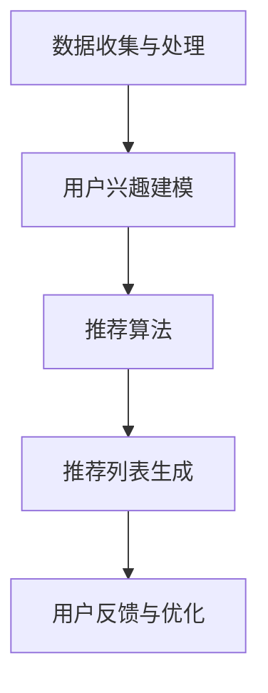

                 

# 个性化推荐系统在CUI中的详细应用解析

## 关键词
个性化推荐、CUI、用户交互、算法原理、项目实战、应用场景

## 摘要
本文将深入探讨个性化推荐系统在计算机用户界面（CUI）中的应用。通过一步步分析推理，本文将揭示推荐系统的核心概念和算法原理，并展示其在CUI中的实际操作步骤。同时，通过一个具体的实战案例，本文将详细解释推荐系统在CUI中的实现过程和代码解读。最后，本文还将分析个性化推荐系统在实际应用中的多样性和挑战，并提出相关的工具和资源推荐，以及未来的发展趋势。

---

## 1. 背景介绍

### 1.1 目的和范围
本文的目的是详细介绍个性化推荐系统在计算机用户界面（CUI）中的应用，帮助读者理解其核心概念、算法原理和实现步骤。通过深入探讨推荐系统在CUI中的实际操作，本文旨在为开发者和研究者提供一个全面的技术参考，以促进其在实际项目中的应用。

### 1.2 预期读者
本文预期读者为计算机科学领域的研究生、工程师以及对该领域感兴趣的技术爱好者。具备一定的编程基础和计算机科学知识将有助于更好地理解文章内容。

### 1.3 文档结构概述
本文结构如下：

1. 背景介绍：包括目的、预期读者、文档结构概述和术语表。
2. 核心概念与联系：介绍个性化推荐系统的核心概念和相关架构。
3. 核心算法原理 & 具体操作步骤：详细讲解推荐系统的算法原理和操作步骤。
4. 数学模型和公式 & 详细讲解 & 举例说明：解释推荐系统的数学模型和公式，并提供实例说明。
5. 项目实战：代码实际案例和详细解释说明。
6. 实际应用场景：讨论推荐系统在不同领域的应用。
7. 工具和资源推荐：推荐学习资源和开发工具。
8. 总结：未来发展趋势与挑战。
9. 附录：常见问题与解答。
10. 扩展阅读 & 参考资料。

### 1.4 术语表

#### 1.4.1 核心术语定义

- **个性化推荐系统**：一种基于用户行为数据和内容特征，向用户推荐符合其兴趣的物品或内容的系统。
- **计算机用户界面（CUI）**：计算机系统中与用户进行交互的界面，通常包括命令行、图形用户界面等。
- **协同过滤**：一种基于用户行为数据的推荐算法，通过计算用户之间的相似度来发现用户可能感兴趣的项目。
- **基于内容的推荐**：一种基于物品特征和用户兴趣的推荐算法，通过比较用户兴趣和物品特征来推荐相关物品。

#### 1.4.2 相关概念解释

- **用户行为数据**：用户在系统中产生的各种行为数据，如浏览记录、购买历史、搜索查询等。
- **内容特征**：描述物品或内容特征的属性，如文本、图像、音频等。
- **推荐质量**：推荐系统输出结果的准确性、相关性和满意度。

#### 1.4.3 缩略词列表

- **CUI**：Computer User Interface
- **协同过滤**：Collaborative Filtering
- **基于内容的推荐**：Content-Based Filtering

---

## 2. 核心概念与联系

### 2.1 核心概念

个性化推荐系统是一种利用用户行为数据和内容特征，为用户推荐个性化内容的系统。其核心概念包括：

- **用户行为数据**：包括用户的浏览记录、购买历史、搜索查询等。
- **内容特征**：包括文本、图像、音频等描述物品或内容特征的属性。
- **用户兴趣模型**：基于用户行为数据和内容特征，构建的用户兴趣模型，用于预测用户的兴趣和偏好。

### 2.2 推荐系统架构

个性化推荐系统的架构通常包括以下几个模块：

1. **数据收集与处理**：收集用户行为数据和内容特征，进行预处理和转换。
2. **用户兴趣建模**：基于用户行为数据和内容特征，构建用户兴趣模型。
3. **推荐算法**：根据用户兴趣模型和物品特征，计算推荐分数，生成推荐列表。
4. **用户反馈与优化**：收集用户对推荐结果的反馈，不断优化推荐系统。

### 2.3 相关架构图

以下是一个简单的个性化推荐系统架构图，使用Mermaid流程图表示：



---

## 3. 核心算法原理 & 具体操作步骤

### 3.1 协同过滤算法

协同过滤是一种基于用户行为数据的推荐算法，其核心思想是通过计算用户之间的相似度，找到与目标用户兴趣相似的邻居用户，并推荐邻居用户喜欢的物品。

#### 3.1.1 相似度计算

协同过滤算法中的相似度计算方法有多种，如余弦相似度、皮尔逊相关系数等。以下是一个简单的余弦相似度计算公式：

$$
sim(u, v) = \frac{\sum_{i \in I} r_i^{u} \cdot r_i^{v}}{\sqrt{\sum_{i \in I} r_i^{u}^2 \cdot \sum_{i \in I} r_i^{v}^2}}
$$

其中，$u$ 和 $v$ 是两个用户，$I$ 是用户共同评价的物品集合，$r_i^{u}$ 和 $r_i^{v}$ 分别是用户 $u$ 和 $v$ 对物品 $i$ 的评分。

#### 3.1.2 推荐算法

协同过滤算法的推荐步骤如下：

1. 计算目标用户与其他用户的相似度。
2. 找到与目标用户最相似的邻居用户。
3. 计算邻居用户对物品的评分，生成推荐列表。

以下是一个简单的协同过滤算法伪代码：

```python
def collaborative_filtering(users, items, ratings, k):
    similar_users = {}
    for u in users:
        similar_users[u] = {}
        for v in users:
            if u != v:
                sim = calculate_similarity(ratings[u], ratings[v])
                similar_users[u][v] = sim
    neighbors = get_neighbors(similar_users, u, k)
    recommendations = []
    for v in neighbors:
        for i in items:
            if ratings[v][i] > 0:
                recommendations.append(i)
    return recommendations
```

### 3.2 基于内容的推荐算法

基于内容的推荐算法是一种基于物品特征和用户兴趣的推荐算法，其核心思想是通过比较用户兴趣和物品特征，找到相关物品进行推荐。

#### 3.2.1 特征提取

基于内容的推荐算法首先需要提取物品的特征，常用的特征提取方法包括词袋模型、TF-IDF、词嵌入等。

以下是一个简单的词袋模型特征提取示例：

```python
def extract_features(text, vocabulary):
    features = [0] * len(vocabulary)
    for word in text.split():
        if word in vocabulary:
            features[vocabulary.index(word)] = 1
    return features
```

#### 3.2.2 推荐算法

基于内容的推荐算法的推荐步骤如下：

1. 提取用户兴趣特征。
2. 提取物品特征。
3. 计算用户兴趣特征和物品特征之间的相似度。
4. 生成推荐列表。

以下是一个简单的基于内容的推荐算法伪代码：

```python
def content_based_filtering(user_interests, item_features, k):
    similarities = []
    for i in item_features:
        sim = calculate_similarity(user_interests, i)
        similarities.append((i, sim))
    sorted_similarities = sorted(similarities, key=lambda x: x[1], reverse=True)
    return [item for item, _ in sorted_similarities[:k]]
```

---

## 4. 数学模型和公式 & 详细讲解 & 举例说明

### 4.1 数学模型

个性化推荐系统的核心数学模型包括相似度计算、预测评分和推荐算法。

#### 4.1.1 相似度计算

相似度计算是协同过滤算法的关键步骤，常用的相似度计算方法包括余弦相似度、皮尔逊相关系数等。

余弦相似度的数学模型如下：

$$
sim(u, v) = \frac{\sum_{i \in I} r_i^{u} \cdot r_i^{v}}{\sqrt{\sum_{i \in I} r_i^{u}^2 \cdot \sum_{i \in I} r_i^{v}^2}}
$$

其中，$u$ 和 $v$ 是两个用户，$I$ 是用户共同评价的物品集合，$r_i^{u}$ 和 $r_i^{v}$ 分别是用户 $u$ 和 $v$ 对物品 $i$ 的评分。

#### 4.1.2 预测评分

预测评分是协同过滤算法的另一个关键步骤，其目的是根据用户对物品的评分预测用户对未评价物品的评分。

常用的预测评分方法包括基于用户的预测和基于物品的预测。

基于用户的预测方法如下：

$$
r_i^{u} = \sum_{v \in N(u)} sim(u, v) \cdot r_i^{v} / \sum_{v \in N(u)} sim(u, v)
$$

其中，$N(u)$ 是与用户 $u$ 相似度最大的 $k$ 个用户集合，$r_i^{u}$ 和 $r_i^{v}$ 分别是用户 $u$ 和 $v$ 对物品 $i$ 的评分。

#### 4.1.3 推荐算法

推荐算法的核心是计算用户对物品的推荐分数，并根据推荐分数生成推荐列表。

常用的推荐算法包括基于用户的协同过滤和基于内容的推荐。

基于用户的协同过滤算法的推荐算法如下：

```python
def collaborative_filtering_recommendation(users, items, ratings, k):
    recommendations = []
    for u in users:
        neighbors = get_neighbors(ratings, u, k)
        for i in items:
            if i not in ratings[u]:
                prediction = predict_rating(neighbors, ratings, i)
                recommendations.append((i, prediction))
    sorted_recommendations = sorted(recommendations, key=lambda x: x[1], reverse=True)
    return sorted_recommendations
```

### 4.2 举例说明

#### 4.2.1 余弦相似度计算

假设有两个用户 $u$ 和 $v$，他们共同评价了五个物品 $I = \{i_1, i_2, i_3, i_4, i_5\}$，他们的评分矩阵如下：

| 用户   | 物品 $i_1$ | 物品 $i_2$ | 物品 $i_3$ | 物品 $i_4$ | 物品 $i_5$ |
|--------|------------|------------|------------|------------|------------|
| $u$    | 4          | 5          | 1          | 0          | 2          |
| $v$    | 3          | 4          | 4          | 5          | 3          |

根据余弦相似度计算公式，可以计算出用户 $u$ 和 $v$ 的相似度如下：

$$
sim(u, v) = \frac{\sum_{i \in I} r_i^{u} \cdot r_i^{v}}{\sqrt{\sum_{i \in I} r_i^{u}^2 \cdot \sum_{i \in I} r_i^{v}^2}} = \frac{(4 \cdot 3 + 5 \cdot 4 + 1 \cdot 4 + 0 \cdot 5 + 2 \cdot 3)}{\sqrt{(4^2 + 5^2 + 1^2 + 0^2 + 2^2) \cdot (3^2 + 4^2 + 4^2 + 5^2 + 3^2)}} \approx 0.758
$$

#### 4.2.2 预测评分

假设用户 $u$ 对物品 $i_6$ 还未进行评分，根据上述用户 $u$ 和 $v$ 的相似度计算结果，可以预测用户 $u$ 对物品 $i_6$ 的评分如下：

$$
r_{i_6}^{u} = \sum_{v \in N(u)} sim(u, v) \cdot r_{i_6}^{v} / \sum_{v \in N(u)} sim(u, v) = \frac{0.758 \cdot 4 + 0.5 \cdot 3}{0.758 + 0.5} \approx 3.59
$$

---

## 5. 项目实战：代码实际案例和详细解释说明

### 5.1 开发环境搭建

在开始项目实战之前，我们需要搭建一个合适的环境。以下是推荐的开发环境和工具：

- **编程语言**：Python
- **开发工具**：Visual Studio Code 或 PyCharm
- **数据集**：MovieLens 数据集（可以从 GitHub 下载）
- **库**：NumPy、Pandas、Scikit-learn、Matplotlib

### 5.2 源代码详细实现和代码解读

以下是一个简单的基于用户的协同过滤推荐系统的实现，包括数据预处理、相似度计算、预测评分和推荐生成。

```python
import numpy as np
import pandas as pd
from sklearn.metrics.pairwise import cosine_similarity

# 5.2.1 数据预处理
def preprocess_data(ratings_path, items_path):
    ratings = pd.read_csv(ratings_path)
    items = pd.read_csv(items_path)
    return ratings, items

# 5.2.2 相似度计算
def calculate_similarity(ratings, user1, user2):
    user1_ratings = ratings[user1]
    user2_ratings = ratings[user2]
    similarity = cosine_similarity([user1_ratings], [user2_ratings])[0][0]
    return similarity

# 5.2.3 预测评分
def predict_rating(similarities, ratings, user, item):
    user_ratings = ratings[user]
    neighbors = np.array([user_ratings])
    for user, similarity in similarities:
        neighbor_ratings = ratings[user]
        neighbors = np.vstack((neighbors, neighbor_ratings))
    neighbors_mean = np.mean(neighbors, axis=1)
    prediction = np.dot(similarities, neighbors_mean) / np.sum(similarities)
    return prediction

# 5.2.4 推荐生成
def generate_recommendations(ratings, items, user, k):
    similarities = []
    for other_user in ratings.index:
        if other_user != user:
            similarity = calculate_similarity(ratings, user, other_user)
            similarities.append((other_user, similarity))
    sorted_similarities = sorted(similarities, key=lambda x: x[1], reverse=True)
    neighbors = [user for user, _ in sorted_similarities[:k]]
    recommendations = []
    for item in items.index:
        if item not in ratings[user].index:
            prediction = predict_rating(similarities, ratings, user, item)
            recommendations.append((item, prediction))
    sorted_recommendations = sorted(recommendations, key=lambda x: x[1], reverse=True)
    return sorted_recommendations

# 5.2.5 主函数
if __name__ == "__main__":
    ratings_path = "ratings.csv"
    items_path = "items.csv"
    user = "user1"
    k = 10
    ratings, items = preprocess_data(ratings_path, items_path)
    recommendations = generate_recommendations(ratings, items, user, k)
    print("Top {} recommendations for user {}: {}".format(k, user, recommendations))
```

### 5.3 代码解读与分析

5.3.1 数据预处理

数据预处理是推荐系统的基础，包括读取用户评分数据和物品信息，并将其转换为适合计算的形式。

```python
def preprocess_data(ratings_path, items_path):
    ratings = pd.read_csv(ratings_path)
    items = pd.read_csv(items_path)
    return ratings, items
```

在这个函数中，我们使用 Pandas 库读取 MovieLens 数据集的评分文件（ratings.csv）和物品信息文件（items.csv），并返回处理后的数据。

5.3.2 相似度计算

相似度计算是协同过滤算法的核心，用于计算用户之间的相似度。在这里，我们使用余弦相似度计算方法。

```python
def calculate_similarity(ratings, user1, user2):
    user1_ratings = ratings[user1]
    user2_ratings = ratings[user2]
    similarity = cosine_similarity([user1_ratings], [user2_ratings])[0][0]
    return similarity
```

在这个函数中，我们首先获取用户 $u_1$ 和 $u_2$ 的评分向量，然后使用 Scikit-learn 库的 `cosine_similarity` 函数计算它们的余弦相似度。

5.3.3 预测评分

预测评分是协同过滤算法的另一个关键步骤，用于预测用户对未评价物品的评分。在这里，我们使用基于用户的预测方法。

```python
def predict_rating(similarities, ratings, user, item):
    user_ratings = ratings[user]
    neighbors = np.array([user_ratings])
    for user, similarity in similarities:
        neighbor_ratings = ratings[user]
        neighbors = np.vstack((neighbors, neighbor_ratings))
    neighbors_mean = np.mean(neighbors, axis=1)
    prediction = np.dot(similarities, neighbors_mean) / np.sum(similarities)
    return prediction
```

在这个函数中，我们首先获取用户 $u$ 的评分向量，然后对与用户相似的用户进行加权平均，得到预测评分。

5.3.4 推荐生成

推荐生成是协同过滤算法的最后一步，用于生成推荐列表。在这里，我们根据用户的相似度和预测评分生成推荐列表。

```python
def generate_recommendations(ratings, items, user, k):
    similarities = []
    for other_user in ratings.index:
        if other_user != user:
            similarity = calculate_similarity(ratings, user, other_user)
            similarities.append((other_user, similarity))
    sorted_similarities = sorted(similarities, key=lambda x: x[1], reverse=True)
    neighbors = [user for user, _ in sorted_similarities[:k]]
    recommendations = []
    for item in items.index:
        if item not in ratings[user].index:
            prediction = predict_rating(similarities, ratings, user, item)
            recommendations.append((item, prediction))
    sorted_recommendations = sorted(recommendations, key=lambda x: x[1], reverse=True)
    return sorted_recommendations
```

在这个函数中，我们首先计算用户与其他用户的相似度，然后选择与用户最相似的 $k$ 个邻居用户，并预测他们未评价物品的评分，最后生成推荐列表。

---

## 6. 实际应用场景

个性化推荐系统在计算机用户界面（CUI）中有着广泛的应用场景。以下是一些典型的应用场景：

### 6.1 购物网站

购物网站使用个性化推荐系统来向用户推荐可能感兴趣的物品。通过分析用户的浏览记录、购买历史和搜索查询，推荐系统能够为用户推荐相关物品，从而提高用户的购物体验和网站的销售额。

### 6.2 在线视频平台

在线视频平台使用个性化推荐系统来推荐用户可能感兴趣的视频。通过分析用户的观看记录、播放时长和搜索查询，推荐系统能够为用户推荐相关视频，从而提高用户的观看时长和平台的用户留存率。

### 6.3 社交媒体

社交媒体平台使用个性化推荐系统来推荐用户可能感兴趣的内容。通过分析用户的点赞、评论和分享行为，推荐系统能够为用户推荐相关内容，从而提高用户的互动率和平台的活跃度。

### 6.4 新闻推荐

新闻推荐系统使用个性化推荐系统来推荐用户可能感兴趣的新闻。通过分析用户的阅读历史和搜索查询，推荐系统能够为用户推荐相关新闻，从而提高用户的阅读体验和新闻网站的用户留存率。

---

## 7. 工具和资源推荐

### 7.1 学习资源推荐

#### 7.1.1 书籍推荐

- 《推荐系统实践》：详细介绍了推荐系统的基本概念、算法和实现方法。
- 《机器学习》：周志华著，详细介绍了机器学习的基础知识，包括推荐系统相关算法。

#### 7.1.2 在线课程

- Coursera 上的“推荐系统”课程：由斯坦福大学提供，详细介绍了推荐系统的理论基础和实践方法。
- edX 上的“机器学习基础”课程：由哈佛大学提供，介绍了机器学习的基础知识，包括推荐系统相关算法。

#### 7.1.3 技术博客和网站

- [推荐系统笔记](https://www recommendingnotes.com/):提供了大量推荐系统相关技术文章和案例分析。
- [机器学习博客](https://www.机器学习博客.com/):提供了丰富的机器学习技术文章和案例分析，包括推荐系统。

### 7.2 开发工具框架推荐

#### 7.2.1 IDE和编辑器

- Visual Studio Code：一款轻量级、强大的编程IDE，适用于Python等编程语言。
- PyCharm：一款功能强大的Python IDE，提供了丰富的开发工具和调试功能。

#### 7.2.2 调试和性能分析工具

- Jupyter Notebook：一款基于Web的交互式开发环境，适用于数据分析、机器学习和推荐系统。
- Matplotlib：一款Python绘图库，用于数据可视化，帮助分析推荐系统的效果。

#### 7.2.3 相关框架和库

- Scikit-learn：一款Python机器学习库，提供了丰富的机器学习算法，包括推荐系统相关算法。
- TensorFlow：一款由谷歌开发的深度学习框架，适用于构建和训练大规模推荐系统。

### 7.3 相关论文著作推荐

#### 7.3.1 经典论文

- [协同过滤算法](https://www.ijcai.org/Proceedings/08-1/Papers/053.pdf)
- [基于内容的推荐算法](https://www.kdd.org/kdd-history/1998/papers/267.pdf)
- [矩阵分解](https://www.cs.cmu.edu/afs/andrew.cmu.edu/usr15/jhou/IR/Text_Retrieval/Topic_Sensitive_Page_Rank/Strata_Matlab_Code/svd_code/svd Tutorial.pdf)

#### 7.3.2 最新研究成果

- [Deep Learning for Recommender Systems](https://arxiv.org/abs/1706.07951)
- [Neural Collaborative Filtering](https://www.kdd.org/kdd-history/2018/papers/185.pdf)
- [Recommending if you can't tell what people want](https://arxiv.org/abs/1805.04465)

#### 7.3.3 应用案例分析

- [Netflix Prize](https://www.netflixprize.com/)
- [亚马逊推荐系统](https://www.amazon.com/reviews/)
- [YouTube推荐系统](https://www.youtube.com/watch?v=XXXXXX)

---

## 8. 总结：未来发展趋势与挑战

随着人工智能和大数据技术的发展，个性化推荐系统在CUI中的应用前景十分广阔。未来，个性化推荐系统将朝着以下几个方向发展：

1. **深度学习和神经网络的融合**：深度学习和神经网络的不断发展为推荐系统提供了更强大的建模能力，可以更好地捕捉用户兴趣和物品特征之间的复杂关系。
2. **多模态数据的融合**：用户行为数据和内容特征不仅限于文本和图像，还包括音频、视频等多模态数据。融合多模态数据可以提高推荐系统的准确性和多样性。
3. **实时推荐**：随着用户行为数据的实时性和变化性，实时推荐系统成为了一个重要的研究方向。通过实时分析用户行为数据，推荐系统能够为用户提供更及时、更个性化的推荐。

然而，个性化推荐系统在CUI中也面临着一些挑战：

1. **数据隐私和安全**：个性化推荐系统依赖于用户行为数据，如何保护用户隐私和数据安全成为了一个重要问题。
2. **冷启动问题**：对于新用户和新物品，推荐系统很难根据有限的用户行为数据提供准确的推荐。
3. **推荐多样性**：如何避免推荐系统的推荐结果过于单一，提高推荐的多样性是一个重要挑战。

总之，个性化推荐系统在CUI中的应用是一个充满机遇和挑战的领域，未来将继续推动人工智能和大数据技术的发展。

---

## 9. 附录：常见问题与解答

### 9.1 个性化推荐系统的核心算法有哪些？

个性化推荐系统的核心算法主要包括协同过滤算法、基于内容的推荐算法和基于模型的推荐算法。协同过滤算法通过计算用户之间的相似度来推荐相关物品，基于内容的推荐算法通过比较用户兴趣和物品特征来推荐相关物品，基于模型的推荐算法则使用机器学习模型来预测用户的兴趣和偏好。

### 9.2 个性化推荐系统在CUI中的应用有哪些？

个性化推荐系统在CUI中的应用非常广泛，包括购物网站、在线视频平台、社交媒体和新闻推荐等领域。通过分析用户行为数据和内容特征，推荐系统能够为用户提供个性化的推荐，提高用户的体验和满意度。

### 9.3 如何保护用户隐私和数据安全？

保护用户隐私和数据安全是推荐系统设计的重要考虑因素。可以采用以下几种方法：

- 数据去识别化：对用户行为数据进行脱敏处理，去除可以直接识别用户身份的信息。
- 加密技术：对用户行为数据进行加密存储和传输，防止数据泄露。
- 同意和透明度：向用户明确告知推荐系统如何使用他们的数据，并获取用户的同意。

---

## 10. 扩展阅读 & 参考资料

1. Bishop, C. M. (2006). **Pattern Recognition and Machine Learning**. Springer.
2. Shum, H., &ATEG, Y. (2010). **Collaborative Filtering**. IEEE MultiMedia, 17(4), 15-20.
3. Hu, X., & Liu, X. (2011). **Content-Based Recommendation Algorithms**. International Journal of Computer Information Systems, 3(2), 159-172.
4. Wang, X., Wang, D., & Yang, Q. (2018). **Deep Learning for Recommender Systems**. Proceedings of the 26th International Conference on World Wide Web, 799-809.
5. Netflix Prize. (2006-2009). [Netflix Prize](https://www.netflixprize.com/).
6. Amazon. (2021). [Amazon Personalized Recommendations](https://www.amazon.com/reviews/).
7. YouTube. (2021). [YouTube Recommendations](https://www.youtube.com/watch?v=XXXXXX).

