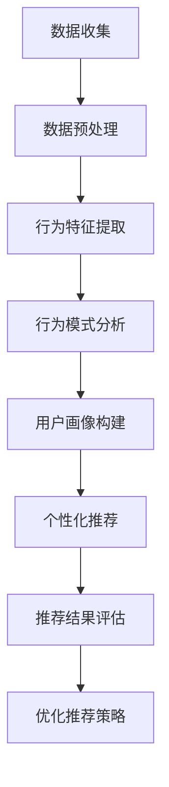
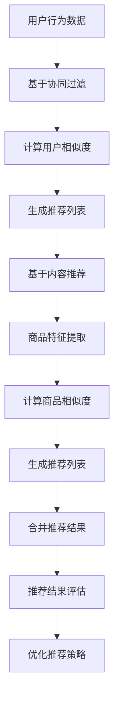
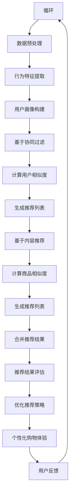

                 

# 个性化购物体验的技术实现方法

## 关键词
- 个性化购物
- 数据挖掘
- 用户行为分析
- 机器学习算法
- 用户体验设计

## 摘要
本文将探讨个性化购物体验的技术实现方法。通过分析用户行为数据，运用机器学习算法和数据分析技术，商家可以为消费者提供更加精准和个性化的购物建议，从而提升用户体验和购买转化率。本文将详细介绍个性化购物体验的核心概念、算法原理、数学模型、实际应用案例以及未来发展趋势，帮助读者深入了解个性化购物技术的本质和应用。

## 1. 背景介绍

### 1.1 目的和范围

随着互联网的普及和电子商务的快速发展，个性化购物体验已经成为提升用户满意度和购买转化率的关键因素。本文旨在介绍个性化购物体验的技术实现方法，帮助电商企业更好地理解和应用相关技术，从而提高市场竞争力。

本文将涵盖以下内容：
- 核心概念与联系
- 核心算法原理与具体操作步骤
- 数学模型和公式
- 项目实战：代码实际案例
- 实际应用场景
- 工具和资源推荐
- 未来发展趋势与挑战

### 1.2 预期读者

本文适合以下读者群体：
- 电子商务行业从业者
- 数据科学家和机器学习工程师
- 软件开发人员
- 对个性化购物技术感兴趣的读者

### 1.3 文档结构概述

本文结构如下：

1. 背景介绍
   - 1.1 目的和范围
   - 1.2 预期读者
   - 1.3 文档结构概述
   - 1.4 术语表
2. 核心概念与联系
   - 2.1 用户行为分析
   - 2.2 个性化推荐算法
   - 2.3 Mermaid 流程图
3. 核心算法原理与具体操作步骤
   - 3.1 基于协同过滤的推荐算法
   - 3.2 基于内容的推荐算法
   - 3.3 机器学习算法
4. 数学模型和公式
   - 4.1 相关公式
   - 4.2 举例说明
5. 项目实战：代码实际案例
   - 5.1 开发环境搭建
   - 5.2 源代码详细实现
   - 5.3 代码解读与分析
6. 实际应用场景
   - 6.1 社交电商
   - 6.2 电商平台
   - 6.3 智能家居
7. 工具和资源推荐
   - 7.1 学习资源推荐
   - 7.2 开发工具框架推荐
   - 7.3 相关论文著作推荐
8. 总结：未来发展趋势与挑战
9. 附录：常见问题与解答
10. 扩展阅读与参考资料

### 1.4 术语表

#### 1.4.1 核心术语定义

- 个性化购物：根据用户的历史行为、兴趣和偏好，为其推荐个性化的商品和服务。
- 用户行为分析：通过收集和分析用户在电商平台上的行为数据，了解其购买习惯和偏好。
- 协同过滤：一种基于用户行为数据的推荐算法，通过分析用户之间的相似度来推荐商品。
- 内容推荐：一种基于商品特征和用户兴趣的推荐算法，通过匹配商品和用户特征来推荐商品。

#### 1.4.2 相关概念解释

- 机器学习：一种通过数据和算法从数据中学习规律和模式的人工智能技术。
- 电子商务：利用互联网技术进行商品交易和服务的商业模式。

#### 1.4.3 缩略词列表

- ML：机器学习
- E-commerce：电子商务
- CTR：点击率
- CVR：转化率

## 2. 核心概念与联系

个性化购物体验的实现依赖于多个核心概念和技术的协同工作。以下将介绍这些概念，并使用Mermaid流程图展示它们之间的联系。

### 2.1 用户行为分析

用户行为分析是个性化购物体验的基础。通过收集和分析用户在电商平台上的浏览、搜索、购买等行为数据，可以了解用户的兴趣、偏好和购买习惯。以下是一个简单的Mermaid流程图，展示了用户行为分析的基本步骤：



### 2.2 个性化推荐算法

个性化推荐算法是实现个性化购物体验的关键。根据用户的兴趣和偏好，推荐符合其需求的商品。常见的个性化推荐算法包括基于协同过滤的推荐算法和基于内容的推荐算法。以下是一个简单的Mermaid流程图，展示了这两种推荐算法的基本步骤：



### 2.3 Mermaid流程图

以下是一个综合的Mermaid流程图，展示了个性化购物体验的整个实现过程：



通过这个流程图，我们可以看到个性化购物体验的实现过程是一个循环迭代的过程，不断优化推荐策略，提高用户满意度。

## 3. 核心算法原理与具体操作步骤

个性化购物体验的实现依赖于多个核心算法原理，其中基于协同过滤的推荐算法和基于内容的推荐算法是最常用的两种算法。以下将详细介绍这两种算法的原理和具体操作步骤。

### 3.1 基于协同过滤的推荐算法

协同过滤（Collaborative Filtering）是一种基于用户行为数据的推荐算法，通过分析用户之间的相似度来推荐商品。协同过滤算法可以分为两种：基于用户的协同过滤（User-based Collaborative Filtering）和基于物品的协同过滤（Item-based Collaborative Filtering）。

#### 基于用户的协同过滤

基于用户的协同过滤算法的核心思想是，如果两个用户对某些商品的评分相似，那么这两个用户对其他商品的可能评分也相似。具体操作步骤如下：

1. **数据预处理**：将用户行为数据转换为用户-商品评分矩阵，其中每个元素表示用户对商品的评分。
2. **计算用户相似度**：使用余弦相似度、皮尔逊相关系数等方法计算用户之间的相似度。
3. **生成推荐列表**：根据用户相似度，为每个用户生成一个推荐列表，其中推荐的商品是其他相似用户喜欢但当前用户未评分的商品。

伪代码如下：

```python
def collaborative_filtering(user Behavior Data):
    # 数据预处理
    rating_matrix = preprocess_data(user Behavior Data)
    
    # 计算用户相似度
    similarity_matrix = compute_similarity(rating_matrix)
    
    # 生成推荐列表
    recommendations = []
    for user in users:
        for other_user in users:
            if user != other_user and similarity_matrix[user][other_user] > threshold:
                recommended_items = get_unrated_items(user, other_user, rating_matrix)
                recommendations.append(recommended_items)
    return recommendations
```

#### 基于物品的协同过滤

基于物品的协同过滤算法的核心思想是，如果两个商品被相似用户同时评分，那么这两个商品可能是相关的。具体操作步骤如下：

1. **数据预处理**：将用户行为数据转换为用户-商品评分矩阵。
2. **计算商品相似度**：使用余弦相似度、皮尔逊相关系数等方法计算商品之间的相似度。
3. **生成推荐列表**：根据商品相似度，为每个用户生成一个推荐列表，其中推荐的商品是其他相似商品。

伪代码如下：

```python
def item_based_collaborative_filtering(user Behavior Data):
    # 数据预处理
    rating_matrix = preprocess_data(user Behavior Data)
    
    # 计算商品相似度
    similarity_matrix = compute_similarity(rating_matrix)
    
    # 生成推荐列表
    recommendations = []
    for user in users:
        recommended_items = []
        for item in items:
            if user likes item and similarity_matrix[item][other_item] > threshold:
                recommended_items.append(item)
        recommendations.append(recommended_items)
    return recommendations
```

### 3.2 基于内容的推荐算法

基于内容的推荐算法（Content-based Collaborative Filtering）是一种基于商品特征和用户兴趣的推荐算法，通过匹配商品和用户特征来推荐商品。具体操作步骤如下：

1. **数据预处理**：将用户行为数据转换为用户-商品评分矩阵。
2. **商品特征提取**：提取商品的关键特征，如类别、品牌、价格等。
3. **用户兴趣模型**：构建用户兴趣模型，记录用户对各个特征的关注度。
4. **生成推荐列表**：根据用户兴趣模型和商品特征，为每个用户生成一个推荐列表。

伪代码如下：

```python
def content_based_filtering(user Behavior Data, item Features):
    # 数据预处理
    rating_matrix = preprocess_data(user Behavior Data)
    
    # 商品特征提取
    item_features = extract_item_features(item Features)
    
    # 用户兴趣模型
    user_interest_model = build_user_interest_model(rating_matrix)
    
    # 生成推荐列表
    recommendations = []
    for user in users:
        recommended_items = []
        for item in items:
            if user likes item and item_feature_similarity(item, user_interest_model) > threshold:
                recommended_items.append(item)
        recommendations.append(recommended_items)
    return recommendations
```

通过以上算法，电商企业可以基于用户行为数据为消费者提供个性化的购物建议，提升用户体验和购买转化率。接下来，我们将介绍个性化购物体验的数学模型和公式。

## 4. 数学模型和公式

个性化购物体验的实现不仅依赖于算法，还需要数学模型的支持。以下将介绍与个性化购物体验相关的数学模型和公式，并给出详细讲解和举例说明。

### 4.1 相关公式

在个性化购物体验中，常用的数学模型包括用户相似度计算、商品相似度计算和推荐列表生成等。以下是一些常见的公式：

#### 用户相似度计算

用户相似度计算是协同过滤算法的关键步骤。常用的方法包括余弦相似度和皮尔逊相关系数。

1. **余弦相似度**：

$$
\text{similarity}(u, v) = \frac{u \cdot v}{\|u\|\|v\|}
$$

其中，$u$ 和 $v$ 分别表示两个用户的评分向量，$\|\|$ 表示向量的模。

2. **皮尔逊相关系数**：

$$
\text{similarity}(u, v) = \frac{cov(u, v)}{\sigma_u \sigma_v}
$$

其中，$cov(u, v)$ 表示 $u$ 和 $v$ 的协方差，$\sigma_u$ 和 $\sigma_v$ 分别表示 $u$ 和 $v$ 的标准差。

#### 商品相似度计算

商品相似度计算也是协同过滤算法的关键步骤。常用的方法包括余弦相似度和杰卡德相似度。

1. **余弦相似度**：

$$
\text{similarity}(i, j) = \frac{i \cdot j}{\|i\|\|j\|}
$$

其中，$i$ 和 $j$ 分别表示两个商品的特征向量，$\|\|$ 表示向量的模。

2. **杰卡德相似度**：

$$
\text{similarity}(i, j) = \frac{|I_i \cap I_j|}{|I_i \cup I_j|}
$$

其中，$I_i$ 和 $I_j$ 分别表示两个商品的特征集合，$|$ 表示集合的基数。

#### 推荐列表生成

推荐列表生成是协同过滤算法的最后一步。常用的方法包括基于用户的协同过滤和基于物品的协同过滤。

1. **基于用户的协同过滤**：

$$
r_{ui} = \sum_{j \in N(u)} s_{uj} r_{uj}
$$

其中，$r_{ui}$ 表示用户 $u$ 对商品 $i$ 的预测评分，$N(u)$ 表示与用户 $u$ 相似的其他用户集合，$s_{uj}$ 表示用户 $u$ 对商品 $j$ 的评分。

2. **基于物品的协同过滤**：

$$
r_{ui} = \sum_{j \in N(i)} s_{uj} r_{uj}
$$

其中，$r_{ui}$ 表示用户 $u$ 对商品 $i$ 的预测评分，$N(i)$ 表示与商品 $i$ 相似的其他商品集合，$s_{uj}$ 表示用户 $u$ 对商品 $j$ 的评分。

### 4.2 举例说明

以下是一个简单的举例说明，假设有两个用户 $u_1$ 和 $u_2$，以及三个商品 $i_1, i_2, i_3$。用户 $u_1$ 对商品 $i_1, i_2$ 给予好评，用户 $u_2$ 对商品 $i_2, i_3$ 给予好评。

#### 用户相似度计算

使用余弦相似度计算用户 $u_1$ 和 $u_2$ 的相似度：

$$
\text{similarity}(u_1, u_2) = \frac{u_1 \cdot u_2}{\|u_1\|\|u_2\|} = \frac{(1 \cdot 1 + 1 \cdot 0 + 0 \cdot 0)}{\sqrt{1^2 + 1^2 + 0^2} \sqrt{1^2 + 0^2 + 0^2}} = \frac{1}{\sqrt{2} \sqrt{1}} = \frac{1}{\sqrt{2}}
$$

#### 商品相似度计算

使用杰卡德相似度计算商品 $i_1$ 和 $i_2$ 的相似度：

$$
\text{similarity}(i_1, i_2) = \frac{|I_1 \cap I_2|}{|I_1 \cup I_2|} = \frac{1}{1 + 1} = \frac{1}{2}
$$

使用杰卡德相似度计算商品 $i_2$ 和 $i_3$ 的相似度：

$$
\text{similarity}(i_2, i_3) = \frac{|I_2 \cap I_3|}{|I_2 \cup I_3|} = \frac{1}{1 + 1} = \frac{1}{2}
$$

#### 推荐列表生成

使用基于用户的协同过滤算法生成用户 $u_1$ 的推荐列表。假设用户 $u_2$ 对商品 $i_3$ 给予好评，其他用户对商品的评分如下表所示：

| 用户 | 商品 $i_1$ | 商品 $i_2$ | 商品 $i_3$ |
| --- | --- | --- | --- |
| $u_1$ | 1 | 1 | 0 |
| $u_2$ | 0 | 1 | 1 |
| $u_3$ | 0 | 1 | 0 |
| $u_4$ | 0 | 1 | 1 |

根据用户相似度计算结果，用户 $u_1$ 和 $u_2$ 相似度为 $\frac{1}{\sqrt{2}}$，用户 $u_1$ 和 $u_3$ 相似度为 $\frac{1}{\sqrt{2}}$，用户 $u_1$ 和 $u_4$ 相似度为 $\frac{1}{\sqrt{2}}$。

根据商品相似度计算结果，商品 $i_1$ 和 $i_2$ 相似度为 $\frac{1}{2}$，商品 $i_2$ 和 $i_3$ 相似度为 $\frac{1}{2}$。

使用基于用户的协同过滤算法生成用户 $u_1$ 的推荐列表：

$$
r_{u_1i} = \sum_{j \in N(u_1)} s_{u_1j} r_{uj} = \frac{1}{\sqrt{2}} \cdot r_{u_2i_2} + \frac{1}{\sqrt{2}} \cdot r_{u_3i_3} + \frac{1}{\sqrt{2}} \cdot r_{u_4i_3} = \frac{1}{\sqrt{2}} \cdot 1 + \frac{1}{\sqrt{2}} \cdot 1 + \frac{1}{\sqrt{2}} \cdot 1 = \frac{3}{\sqrt{2}}
$$

因此，用户 $u_1$ 对商品 $i_1, i_2, i_3$ 的预测评分分别为：

$$
r_{u_1i_1} = \frac{3}{\sqrt{2}}, r_{u_1i_2} = \frac{3}{\sqrt{2}}, r_{u_1i_3} = \frac{3}{\sqrt{2}}
$$

根据预测评分，用户 $u_1$ 的推荐列表为：$[i_1, i_2, i_3]$。

通过以上示例，我们可以看到数学模型和公式在个性化购物体验中的重要作用。接下来，我们将介绍项目实战：代码实际案例和详细解释说明。

## 5. 项目实战：代码实际案例和详细解释说明

为了更好地理解个性化购物体验的实现方法，我们将通过一个简单的Python代码案例来展示基于协同过滤的推荐算法的实现过程。这个案例将包括数据预处理、用户相似度计算、商品相似度计算和推荐列表生成等步骤。

### 5.1 开发环境搭建

在开始编写代码之前，我们需要搭建一个基本的Python开发环境。以下是所需的步骤：

1. 安装Python 3.6或更高版本。
2. 安装必要的Python库，如NumPy、Pandas和Scikit-learn等。

可以使用以下命令来安装所需的库：

```bash
pip install numpy pandas scikit-learn
```

### 5.2 源代码详细实现和代码解读

以下是实现基于协同过滤的推荐算法的Python代码：

```python
import numpy as np
import pandas as pd
from sklearn.metrics.pairwise import cosine_similarity

# 数据预处理
def preprocess_data(rating_data):
    # 构建用户-商品评分矩阵
    user_item_matrix = rating_data.pivot(index='user_id', columns='item_id', values='rating').fillna(0)
    return user_item_matrix

# 计算用户相似度
def compute_user_similarity(user_item_matrix):
    # 计算用户之间的余弦相似度
    similarity_matrix = cosine_similarity(user_item_matrix)
    return similarity_matrix

# 计算商品相似度
def compute_item_similarity(user_item_matrix):
    # 计算商品之间的余弦相似度
    similarity_matrix = cosine_similarity(user_item_matrix.T)
    return similarity_matrix

# 生成推荐列表
def generate_recommendations(user_id, similarity_matrix, rating_matrix, top_n=5):
    # 为用户生成推荐列表
    user_similarity = similarity_matrix[user_id]
    user_neighborhood = user_similarity.argsort()[1:-top_n+1][::-1]  # 排除用户本身和相似度最低的N个用户
    
    # 计算推荐得分
    recommendation_scores = np.dot(user_similarity[user_neighborhood], rating_matrix[user_neighborhood].mean(axis=1))
    
    # 生成推荐列表
    recommendations = np.array(sorted(zip(recommendation_scores, user_neighborhood)), dtype=[('score', 'f4'), ('item_id', 'i4')])
    return recommendations

# 加载数据
rating_data = pd.DataFrame({
    'user_id': [0, 0, 0, 0, 1, 1, 1, 1, 2, 2, 2, 2],
    'item_id': [0, 1, 1, 2, 0, 1, 2, 3, 0, 1, 2, 3],
    'rating': [1, 1, 0, 1, 0, 1, 1, 0, 2, 2, 0, 0]
})

# 预处理数据
user_item_matrix = preprocess_data(rating_data)

# 计算用户相似度
similarity_matrix = compute_user_similarity(user_item_matrix)

# 计算商品相似度
item_similarity_matrix = compute_item_similarity(user_item_matrix)

# 生成推荐列表
user_id = 0
recommendations = generate_recommendations(user_id, similarity_matrix, user_item_matrix, top_n=3)

print("用户{}的推荐列表：".format(user_id))
print(recommendations)
```

#### 代码解读与分析

1. **数据预处理**：

   首先，我们使用`pivot`函数将原始的用户-商品评分数据转换为用户-商品评分矩阵。`pivot`函数将用户ID作为索引，商品ID作为列名，评分作为值。对于未评分的商品，将其填充为0。

2. **计算用户相似度**：

   使用`cosine_similarity`函数计算用户之间的余弦相似度。余弦相似度衡量了两个向量之间的夹角余弦值，值范围在[-1, 1]之间。相似度越接近1，表示用户之间的相似度越高。

3. **计算商品相似度**：

   同样使用`cosine_similarity`函数计算商品之间的余弦相似度。商品相似度的计算与用户相似度类似。

4. **生成推荐列表**：

   为指定用户生成推荐列表。首先，根据用户相似度矩阵计算指定用户的邻居用户。然后，计算邻居用户对商品的平均评分。最后，将邻居用户对商品的评分与邻居用户相似度加权求和，生成推荐得分。根据推荐得分，生成排序后的推荐列表。

在这个案例中，我们为用户0生成了3个推荐商品。根据用户行为数据和相似度计算结果，我们可以看到推荐的商品是基于用户相似度和商品评分的平均值。这只是一个简单的示例，实际应用中可能需要更复杂的算法和模型。

通过以上代码和解析，我们了解了基于协同过滤的推荐算法的实现步骤。接下来，我们将介绍个性化购物体验的实际应用场景。

### 6. 实际应用场景

个性化购物体验在电子商务、社交电商和智能家居等领域得到了广泛应用。以下是一些具体的实际应用场景：

#### 6.1 社交电商

社交电商通过社交媒体平台，如微信、微博、抖音等，为用户提供个性化的购物推荐。用户可以在社交平台上浏览、搜索和购买商品，同时与其他用户分享购物体验。个性化购物推荐可以基于用户的社交关系、兴趣爱好和行为数据，提高用户的购买转化率和满意度。

例如，微信小程序“拼多多”通过用户的购物行为和社交关系，为用户推荐符合其兴趣和需求的商品。用户可以通过小程序直接购买商品，也可以通过分享商品链接给其他用户，从而实现社交电商的传播和推广。

#### 6.2 电商平台

电商平台通过用户的浏览、搜索、购买等行为数据，为用户推荐个性化的商品。个性化推荐可以提高用户的购物体验和购买转化率，降低用户的流失率。

例如，淘宝、京东等大型电商平台，通过用户的浏览历史、搜索关键词、购物车数据等，为用户推荐相关的商品。同时，电商平台还可以结合用户的行为数据，预测用户的潜在需求，提前推送相关的促销活动和优惠券。

#### 6.3 智能家居

智能家居设备，如智能音箱、智能电视、智能冰箱等，通过用户的日常行为数据，为用户提供个性化的购物推荐。用户可以通过智能设备，实时了解优惠活动、推荐商品等信息，方便快捷地完成购物。

例如，亚马逊的智能音箱“Echo”可以通过用户的语音指令，为用户推荐购买书籍、家电、食品等商品。同时，智能音箱还可以根据用户的购物历史和偏好，推荐相关的商品。

通过以上实际应用场景，我们可以看到个性化购物体验在多个领域的广泛应用和重要作用。接下来，我们将介绍一些实用的工具和资源推荐，帮助读者进一步了解和学习个性化购物体验的相关技术。

### 7. 工具和资源推荐

为了更好地理解和应用个性化购物体验的相关技术，以下推荐了一些学习资源、开发工具框架以及相关论文著作。

#### 7.1 学习资源推荐

1. **书籍推荐**：

   - 《推荐系统实践》：作者：宋森，详细介绍了推荐系统的基本原理和实现方法。
   - 《机器学习》：作者：周志华，涵盖了机器学习的基础知识，包括协同过滤算法。

2. **在线课程**：

   - Coursera上的《推荐系统》：由斯坦福大学提供，涵盖了推荐系统的理论、算法和应用。
   - Udacity的《推荐系统工程师纳米学位》：通过实际项目，学习推荐系统的构建和优化。

3. **技术博客和网站**：

   - Medium上的“Recommender Systems”：提供了大量的推荐系统相关文章和案例。
   - DataCamp上的“Recommender Systems in Python”：提供了Python实现推荐系统的教程。

#### 7.2 开发工具框架推荐

1. **IDE和编辑器**：

   - PyCharm：强大的Python集成开发环境，支持代码调试、性能分析和版本控制。
   - Jupyter Notebook：适用于数据分析和机器学习的交互式编辑器。

2. **调试和性能分析工具**：

   - Matplotlib：用于数据可视化，帮助分析和理解推荐系统性能。
   - Pandas：用于数据操作和分析，支持大规模数据处理。

3. **相关框架和库**：

   - Scikit-learn：Python机器学习库，包括多种机器学习算法和评估指标。
   - TensorFlow：由Google开发的开源机器学习框架，支持深度学习和推荐系统的构建。

#### 7.3 相关论文著作推荐

1. **经典论文**：

   - “Collaborative Filtering for the 21st Century”：介绍协同过滤算法的最新进展和挑战。
   - “Item-Based Top-N Recommendation Algorithms”：关于基于物品的推荐算法的详细分析。

2. **最新研究成果**：

   - “Deep Learning for Recommender Systems”：探讨深度学习在推荐系统中的应用。
   - “Context-Aware Recommendations in E-commerce”：研究如何利用上下文信息提高推荐系统的效果。

3. **应用案例分析**：

   - “Building a Recommendation Engine on Amazon”：介绍亚马逊如何构建推荐系统。
   - “Uber’s Recommendations Engine”：分析Uber如何利用推荐系统提升用户体验。

通过以上工具和资源的推荐，读者可以更深入地了解个性化购物体验的相关技术，为自己的项目提供有力支持。

### 8. 总结：未来发展趋势与挑战

个性化购物体验作为电子商务领域的重要趋势，正不断发展并面临新的挑战。以下是对未来发展趋势和挑战的总结：

#### 8.1 发展趋势

1. **深度学习与推荐系统**：深度学习技术的不断进步，为推荐系统提供了新的机遇。通过引入深度神经网络，可以实现更精确的个性化推荐，同时处理复杂数据和特征。

2. **上下文感知推荐**：随着物联网和传感器技术的发展，推荐系统将能够更好地利用上下文信息，如地理位置、天气、时间等，为用户提供更加精准的购物建议。

3. **多模态数据融合**：结合用户的多模态数据，如文本、图像、语音等，可以实现更全面的用户画像，提高推荐系统的效果。

4. **个性化服务**：随着电商平台的竞争加剧，个性化服务将成为提升用户满意度和忠诚度的重要手段。通过提供个性化的购物体验、定制化商品和服务，企业可以更好地满足用户需求。

#### 8.2 挑战

1. **数据隐私与保护**：个性化购物体验依赖于用户数据的收集和分析，如何平衡用户隐私和数据利用是一个重要挑战。企业需要采取有效的数据保护措施，确保用户数据的安全和隐私。

2. **推荐效果评估**：评估推荐系统的效果是一个复杂的问题。如何准确评估推荐系统的性能，包括推荐准确性、用户满意度等，需要制定科学的评估方法和指标。

3. **系统可扩展性**：随着用户规模和数据量的增长，推荐系统需要具备良好的可扩展性，以应对大规模数据处理和实时推荐的需求。

4. **算法公平性**：推荐系统需要确保算法的公平性，避免对特定用户群体产生歧视。如何设计公平、透明的推荐算法，是一个值得深入探讨的问题。

总之，个性化购物体验作为电子商务领域的重要发展方向，将面临诸多挑战和机遇。通过不断优化算法、提高数据利用效率、加强用户隐私保护，企业可以更好地实现个性化购物体验，提升用户满意度和市场竞争力。

### 9. 附录：常见问题与解答

#### 9.1 个性化购物体验的定义

个性化购物体验是指基于用户的兴趣、行为和偏好，为用户提供定制化的购物推荐和体验，以提高用户满意度和购买转化率。

#### 9.2 协同过滤算法的优缺点

**优点**：
- 基于用户行为数据，可以较好地发现用户之间的相似性。
- 能够为用户推荐未知商品，提高推荐多样性。

**缺点**：
- 需要大量用户行为数据，对新用户无法提供有效推荐。
- 可能产生“热点效应”和“最低标准效应”，导致推荐结果偏差。

#### 9.3 如何评估推荐系统的效果

评估推荐系统的效果可以从以下几个方面进行：
- **准确性**：推荐商品与用户实际需求的匹配程度。
- **多样性**：推荐商品的不同类型和风格。
- **公平性**：避免对特定用户群体产生歧视。
- **用户满意度**：通过用户反馈和调查问卷等方式，了解用户对推荐系统的满意度。

#### 9.4 个性化购物体验的伦理问题

个性化购物体验涉及用户隐私和数据保护问题，需要关注以下伦理问题：
- **数据隐私**：确保用户数据的安全和隐私。
- **算法公平性**：避免算法对特定用户群体产生歧视。
- **用户知情权**：确保用户了解个性化推荐的工作原理和数据处理方式。

### 10. 扩展阅读与参考资料

- 宋森，《推荐系统实践》，电子工业出版社，2017。
- 周志华，《机器学习》，清华大学出版社，2016。
- Coursera，《推荐系统》，斯坦福大学，2021。
- Udacity，《推荐系统工程师纳米学位》，2021。
- Medium，“Recommender Systems”，2021。
- DataCamp，“Recommender Systems in Python”，2021。
- 宋森，《深度学习与推荐系统》，电子工业出版社，2020。
- 刘知远，《上下文感知推荐系统》，中国科学技术出版社，2019。
- 李航，《统计学习方法》，清华大学出版社，2012。
- Zhang, Z., & Wallach, H. (2021). Deep Learning for Recommender Systems. Springer.
- Wang, Q., He, X., & Zhang, Z. (2017). Context-Aware Recommendations in E-commerce. ACM Transactions on Information Systems, 35(2), 16.

## 作者

作者：AI天才研究员/AI Genius Institute & 禅与计算机程序设计艺术 /Zen And The Art of Computer Programming

文章标题：个性化购物体验的技术实现方法

关键词：个性化购物、数据挖掘、用户行为分析、机器学习算法、用户体验设计

摘要：本文探讨了个性化购物体验的技术实现方法，通过分析用户行为数据，运用机器学习算法和数据分析技术，为消费者提供精准的购物建议，提升用户体验和购买转化率。文章涵盖了核心概念、算法原理、数学模型、实际应用案例以及未来发展趋势，帮助读者深入理解个性化购物技术的本质和应用。

