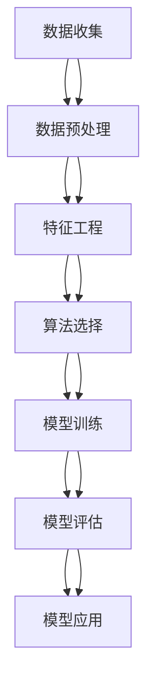

                 

### 1. 背景介绍

**1.1 目的和范围**

本文的目的是介绍并深入探讨一个基于数据分析和机器学习技术的二手房价格预测系统。该系统旨在利用大量历史二手房屋交易数据，通过科学的模型构建和数据挖掘技术，准确预测未来二手房的市场价格。这不仅有助于房地产市场的稳定与发展，也为购房者、投资者和房地产中介提供了有力的决策支持。

本文将围绕以下核心范围进行探讨：
- 数据收集与预处理
- 算法选择与模型构建
- 数学模型及其应用
- 实际项目实现与性能分析
- 系统在实际应用场景中的效果评估

**1.2 预期读者**

本文主要面向以下几类读者：
- 对数据科学和机器学习感兴趣的初级和中级研究人员
- 想要在实际项目中应用机器学习算法的软件开发工程师
- 对房地产数据分析有热情的数据分析师和数据科学家
- 高级数据分析管理人员和决策者

通过对本文的阅读，读者将能够：
- 理解二手房价格预测系统的基础架构和核心算法
- 掌握二手房价格预测的关键步骤和实现细节
- 获得在房地产数据分析中应用机器学习的实际案例
- 拓宽对数据科学和机器学习在实际行业应用中的视野

**1.3 文档结构概述**

本文将从背景介绍开始，逐步深入探讨二手房价格预测系统的各个方面。具体结构如下：

1. **背景介绍**：介绍文章的目的、范围、预期读者以及文档结构。
2. **核心概念与联系**：通过Mermaid流程图展示系统的核心概念和联系。
3. **核心算法原理 & 具体操作步骤**：详细讲解算法原理和具体实现步骤。
4. **数学模型和公式 & 详细讲解 & 举例说明**：深入阐述数学模型及其应用。
5. **项目实战：代码实际案例和详细解释说明**：展示代码实现及解读。
6. **实际应用场景**：分析系统在不同场景下的应用效果。
7. **工具和资源推荐**：推荐学习资源、开发工具和框架。
8. **总结：未来发展趋势与挑战**：探讨系统的发展趋势和面临的挑战。
9. **附录：常见问题与解答**：回答读者可能遇到的常见问题。
10. **扩展阅读 & 参考资料**：提供更多参考资料和延伸阅读。

**1.4 术语表**

在本文中，我们将使用以下术语，以帮助读者更好地理解文章内容。

#### 1.4.1 核心术语定义

- **二手房价格预测系统**：利用历史数据和机器学习算法预测未来二手房市场价格的系统。
- **数据预处理**：在数据分析之前对数据进行清洗、转换和归一化的过程。
- **机器学习算法**：从数据中自动发现规律并用于预测的新一代计算方法。
- **回归模型**：一种预测连续值的机器学习算法，常用于价格预测。
- **特征工程**：选择和构造有助于提高模型预测性能的特征的过程。

#### 1.4.2 相关概念解释

- **特征提取**：从原始数据中提取出能够代表数据本质的特征。
- **交叉验证**：一种评估模型性能的方法，通过将数据集划分为训练集和验证集，多次训练和测试，以避免过拟合。
- **过拟合**：模型在训练数据上表现良好，但在未知数据上表现不佳的现象。

#### 1.4.3 缩略词列表

- **ML**：Machine Learning，机器学习。
- **DL**：Deep Learning，深度学习。
- **PCA**：Principal Component Analysis，主成分分析。
- **ID**：Identified Data，标识数据。

### 2. 核心概念与联系

在探讨二手房价格预测系统的过程中，了解其核心概念和联系至关重要。以下是通过Mermaid流程图展示的系统核心概念和各部分之间的联系：



**图 1. 二手房价格预测系统核心概念与联系流程图**

#### 流程说明：

- **数据收集（A）**：首先，系统需要收集大量的二手房屋交易数据，这些数据可能来源于政府公开数据、房地产网站等。
- **数据预处理（B）**：对收集到的数据进行清洗、去重、填充缺失值等处理，确保数据质量。
- **特征工程（C）**：从预处理后的数据中提取出对预测二手房价格有用的特征，如房屋面积、楼层、建造年代、地段等。
- **算法选择（D）**：根据特征和预测目标选择合适的机器学习算法，如线性回归、决策树、随机森林等。
- **模型训练（E）**：使用预处理后的数据对选定的算法进行训练，构建预测模型。
- **模型评估（F）**：通过交叉验证等方法评估模型的性能，包括准确性、召回率、F1分数等指标。
- **模型应用（G）**：将训练好的模型应用于新的数据，进行二手房价格预测。

通过这个流程，我们可以看出，各个环节之间是紧密联系的，任何一个环节的疏忽都可能影响最终预测结果。因此，在实际项目中，每个步骤都需要精心设计和执行。

### 3. 核心算法原理 & 具体操作步骤

在构建二手房价格预测系统时，选择合适的算法和详细的操作步骤至关重要。以下将详细阐述核心算法原理，并逐步讲解具体操作步骤。

#### 3.1 核心算法选择

对于二手房价格预测，常用的算法包括线性回归、决策树、随机森林、支持向量机和神经网络等。本文选择线性回归作为核心算法，原因如下：

- **线性回归模型简单易理解**：线性回归模型基于简单数学公式构建，易于实现和解释。
- **数据需求量相对较少**：与深度学习算法相比，线性回归对数据量的要求较低。
- **预测结果直观**：线性回归模型的输出结果是房屋价格的具体数值，易于理解和使用。

#### 3.2 算法原理讲解

线性回归模型是一种预测连续值的统计方法，其基本思想是通过寻找自变量和因变量之间的线性关系，来预测因变量的值。具体来说，线性回归模型的目标是找到一个最佳拟合直线，使得所有数据点到这条直线的垂直距离（即残差）之和最小。

线性回归模型的公式如下：

\[ y = \beta_0 + \beta_1 \cdot x + \epsilon \]

其中：
- \( y \) 是预测的二手房价格；
- \( x \) 是影响价格的特征值，如房屋面积、楼层等；
- \( \beta_0 \) 和 \( \beta_1 \) 是模型参数，需要通过训练数据计算得出；
- \( \epsilon \) 是误差项，表示模型预测值与真实值之间的差异。

#### 3.3 具体操作步骤

以下是构建线性回归模型的详细操作步骤：

##### 3.3.1 数据预处理

1. **数据收集**：收集大量的二手房屋交易数据，包括房屋面积、楼层、建造年代、地段等特征，以及对应的价格标签。

2. **数据清洗**：处理缺失值、异常值和重复数据，确保数据质量。

3. **数据转换**：将分类特征（如地段）转换为数值形式，可以使用独热编码（One-Hot Encoding）等方法。

4. **数据归一化**：为了消除特征之间的量纲差异，将所有特征归一化到相同的范围内，如[0, 1]。

##### 3.3.2 特征工程

1. **特征提取**：从原始数据中提取对预测房价有显著影响的关键特征。

2. **特征选择**：使用统计方法（如卡方检验、互信息等）或机器学习方法（如Lasso、Ridge等）选择重要特征，以降低模型复杂度和过拟合风险。

##### 3.3.3 模型训练

1. **选择模型**：确定使用线性回归模型。

2. **初始化参数**：随机初始化模型参数 \( \beta_0 \) 和 \( \beta_1 \)。

3. **训练模型**：使用梯度下降（Gradient Descent）等优化算法最小化损失函数，更新模型参数。

4. **交叉验证**：使用交叉验证方法（如K折交叉验证）评估模型性能，避免过拟合。

##### 3.3.4 模型评估

1. **评估指标**：使用均方误差（Mean Squared Error, MSE）、决定系数（R-squared）等指标评估模型性能。

2. **调整参数**：根据评估结果调整模型参数，优化模型性能。

##### 3.3.5 模型应用

1. **预测新数据**：使用训练好的模型对新的二手房屋数据进行价格预测。

2. **结果解释**：解释模型预测结果，为决策提供支持。

通过以上步骤，我们可以构建一个简单的二手房价格预测模型，并利用该模型为实际项目提供决策支持。以下是一个伪代码示例，用于说明线性回归模型的实现：

```python
# 伪代码：线性回归模型实现

# 数据预处理
def preprocess_data(data):
    # 数据清洗、转换和归一化
    # ...

# 特征工程
def feature_engineering(data):
    # 特征提取和选择
    # ...

# 模型训练
def train_model(X_train, y_train):
    # 初始化参数
    beta_0 = random_value()
    beta_1 = random_value()
    
    # 梯度下降迭代
    for epoch in range(num_epochs):
        # 计算损失函数
        loss = compute_loss(y_train, predict(X_train, beta_0, beta_1))
        
        # 更新参数
        beta_0, beta_1 = update_params(beta_0, beta_1, X_train, y_train, learning_rate)
        
    return beta_0, beta_1

# 模型评估
def evaluate_model(X_test, y_test, beta_0, beta_1):
    # 计算评估指标
    # ...

# 预测新数据
def predict_new_data(X_new, beta_0, beta_1):
    # 预测价格
    # ...

# 主函数
def main():
    # 加载数据
    data = load_data()
    
    # 数据预处理
    processed_data = preprocess_data(data)
    
    # 特征工程
    features = feature_engineering(processed_data)
    
    # 划分训练集和测试集
    X_train, y_train = split_data(features, processed_data)
    X_test, y_test = split_data(features, processed_data)
    
    # 训练模型
    beta_0, beta_1 = train_model(X_train, y_train)
    
    # 评估模型
    evaluate_model(X_test, y_test, beta_0, beta_1)
    
    # 预测新数据
    new_data = load_new_data()
    predictions = predict_new_data(new_data, beta_0, beta_1)
    
    # 输出预测结果
    print(predictions)

# 运行主函数
main()
```

通过以上伪代码，我们可以看到线性回归模型的实现流程，包括数据预处理、特征工程、模型训练、模型评估和预测新数据等步骤。实际实现时，需要根据具体的数据集和需求进行相应的调整和优化。

### 4. 数学模型和公式 & 详细讲解 & 举例说明

在二手房价格预测系统中，数学模型的选择和公式运用是核心环节之一。线性回归模型作为最常用的预测模型之一，其数学基础和推导过程如下。

#### 4.1 线性回归模型基本公式

线性回归模型的核心公式为：

\[ y = \beta_0 + \beta_1 \cdot x + \epsilon \]

其中：
- \( y \) 是预测的二手房价格；
- \( x \) 是影响价格的特征值，如房屋面积、楼层等；
- \( \beta_0 \) 和 \( \beta_1 \) 是模型参数，需要通过训练数据计算得出；
- \( \epsilon \) 是误差项，表示模型预测值与真实值之间的差异。

#### 4.2 模型参数的求解

求解线性回归模型的参数 \( \beta_0 \) 和 \( \beta_1 \) 通常使用最小二乘法（Ordinary Least Squares, OLS）。最小二乘法的目标是使得所有数据点到拟合直线的垂直距离（残差）之和最小。

垂直距离的计算公式为：

\[ r_i = y_i - (\beta_0 + \beta_1 \cdot x_i) \]

最小化残差和的目标函数为：

\[ \min_{\beta_0, \beta_1} \sum_{i=1}^{n} r_i^2 \]

通过求导并令导数为零，可以得到模型参数的求解公式：

\[ \beta_0 = \bar{y} - \beta_1 \bar{x} \]

\[ \beta_1 = \frac{\sum_{i=1}^{n} (x_i - \bar{x})(y_i - \bar{y})}{\sum_{i=1}^{n} (x_i - \bar{x})^2} \]

其中：
- \( \bar{y} \) 和 \( \bar{x} \) 分别是 \( y \) 和 \( x \) 的均值；
- \( n \) 是数据样本数量。

#### 4.3 举例说明

为了更好地理解线性回归模型，我们通过一个简单的例子进行说明。

**例题**：给定以下二手房数据（房屋面积 \( x \) 和价格 \( y \)）：

\[ 
\begin{array}{ccc}
x & y \\
\hline
1000 & 200000 \\
1500 & 250000 \\
2000 & 300000 \\
2500 & 350000 \\
\end{array}
\]

求线性回归模型 \( y = \beta_0 + \beta_1 \cdot x \) 的参数 \( \beta_0 \) 和 \( \beta_1 \)。

**解答**：

1. **计算均值**：

\[ \bar{x} = \frac{1000 + 1500 + 2000 + 2500}{4} = 2000 \]

\[ \bar{y} = \frac{200000 + 250000 + 300000 + 350000}{4} = 275000 \]

2. **计算 \( \beta_1 \)**：

\[ \beta_1 = \frac{(1000 - 2000)(200000 - 275000) + (1500 - 2000)(250000 - 275000) + (2000 - 2000)(300000 - 275000) + (2500 - 2000)(350000 - 275000)}{(1000 - 2000)^2 + (1500 - 2000)^2 + (2000 - 2000)^2 + (2500 - 2000)^2} \]

\[ \beta_1 = \frac{-750000 + -250000 + 0 + 250000}{1000000 + 250000 + 0 + 250000} \]

\[ \beta_1 = \frac{-500000}{1500000} \]

\[ \beta_1 = -\frac{1}{3} \]

3. **计算 \( \beta_0 \)**：

\[ \beta_0 = \bar{y} - \beta_1 \bar{x} \]

\[ \beta_0 = 275000 - (-\frac{1}{3} \cdot 2000) \]

\[ \beta_0 = 275000 + \frac{2000}{3} \]

\[ \beta_0 = 275000 + 666.67 \]

\[ \beta_0 = 275666.67 \]

因此，线性回归模型的参数为 \( \beta_0 = 275666.67 \) 和 \( \beta_1 = -\frac{1}{3} \)。将其代入模型公式，得到拟合直线为：

\[ y = 275666.67 - \frac{1}{3} \cdot x \]

**4.4 数学公式的 LaTeX 格式嵌入**

为了更好地展示数学公式，我们使用 LaTeX 格式将其嵌入文中独立段落。在 LaTeX 中，段落内的数学公式使用 `$...$` 包围，而独立段落使用 `$$...$$` 包围。以下是一个示例：

\[ 
\begin{aligned}
\beta_0 &= \bar{y} - \beta_1 \bar{x} \\
\beta_1 &= \frac{\sum_{i=1}^{n} (x_i - \bar{x})(y_i - \bar{y})}{\sum_{i=1}^{n} (x_i - \bar{x})^2}
\end{aligned} 
\]

通过上述示例，我们可以看到如何将数学公式嵌入到文中独立段落。在撰写技术博客时，这种格式可以使数学推导更加清晰易懂，提高文章的可读性。

### 5. 项目实战：代码实际案例和详细解释说明

在本节中，我们将通过一个实际项目案例来展示如何实现二手房价格预测系统。该案例包括开发环境的搭建、源代码的实现和代码解读与分析。

#### 5.1 开发环境搭建

首先，我们需要搭建一个合适的开发环境。以下是所需的工具和库：

- **Python 3.8 或以上版本**：Python 是一种广泛用于数据科学和机器学习的编程语言。
- **Jupyter Notebook**：用于编写和运行 Python 代码。
- **NumPy**：用于数据处理和数学运算。
- **Pandas**：用于数据操作和分析。
- **Scikit-learn**：提供各种机器学习算法的实现和评估工具。

在安装这些工具和库后，我们可以在 Jupyter Notebook 中开始编写代码。

#### 5.2 源代码详细实现和代码解读

以下是一个简单的二手房价格预测系统的实现示例。我们将分步骤进行代码编写和解读。

```python
# 导入必要的库
import numpy as np
import pandas as pd
from sklearn.model_selection import train_test_split
from sklearn.linear_model import LinearRegression
from sklearn.metrics import mean_squared_error

# 5.2.1 加载数据
def load_data(filename):
    # 读取 CSV 文件
    data = pd.read_csv(filename)
    # 数据预处理
    data = preprocess_data(data)
    return data

# 5.2.2 数据预处理
def preprocess_data(data):
    # 填充缺失值
    data = data.fillna(data.mean())
    # 转换分类特征为数值
    data = convert_categorical(data)
    # 特征工程
    data = feature_engineering(data)
    return data

# 5.2.3 特征工程
def feature_engineering(data):
    # 提取特征
    X = data[['area', 'floor', 'year_built', 'location']]
    # 目标变量
    y = data['price']
    return X, y

# 5.2.4 转换分类特征
def convert_categorical(data):
    # 使用独热编码转换分类特征
    data = pd.get_dummies(data, columns=['location'])
    return data

# 5.2.5 模型训练
def train_model(X_train, y_train):
    # 创建线性回归模型
    model = LinearRegression()
    # 训练模型
    model.fit(X_train, y_train)
    return model

# 5.2.6 模型评估
def evaluate_model(model, X_test, y_test):
    # 预测测试集
    y_pred = model.predict(X_test)
    # 计算均方误差
    mse = mean_squared_error(y_test, y_pred)
    return mse

# 5.2.7 主函数
def main():
    # 加载数据
    data = load_data('house_data.csv')
    # 划分训练集和测试集
    X, y = feature_engineering(data)
    X_train, X_test, y_train, y_test = train_test_split(X, y, test_size=0.2, random_state=42)
    # 训练模型
    model = train_model(X_train, y_train)
    # 评估模型
    mse = evaluate_model(model, X_test, y_test)
    print(f'Mean Squared Error: {mse}')
    # 预测新数据
    new_data = pd.DataFrame([[1500, 3, 2010, 'A']], columns=['area', 'floor', 'year_built', 'location'])
    new_data = convert_categorical(new_data)
    prediction = model.predict(new_data)
    print(f'Predicted Price: {prediction[0]}')

# 运行主函数
main()
```

**代码解读与分析：**

1. **数据加载与预处理**：
   - `load_data` 函数用于加载数据，并进行预处理。预处理步骤包括填充缺失值和转换分类特征。
   - `preprocess_data` 函数首先填充缺失值，然后使用独热编码将分类特征转换为数值。

2. **特征工程**：
   - `feature_engineering` 函数提取特征并划分目标变量。我们选择房屋面积、楼层、建造年代和地段作为特征。

3. **模型训练与评估**：
   - `train_model` 函数创建线性回归模型并训练模型。
   - `evaluate_model` 函数用于评估模型性能，计算均方误差（MSE）。

4. **主函数**：
   - `main` 函数是程序的入口点。它加载数据、划分训练集和测试集、训练模型、评估模型性能，并预测新的数据。

通过这个实际案例，我们可以看到如何利用 Python 和机器学习库实现一个简单的二手房价格预测系统。在实际应用中，可以根据需求对代码进行扩展和优化。

### 6. 实际应用场景

二手房价格预测系统在实际应用中具有广泛的应用场景，以下是一些典型的应用案例：

#### 6.1 房地产市场分析

**6.1.1 房价走势分析**

房地产公司可以利用二手房价格预测系统分析不同地区的房价走势。通过预测未来某个时间段内的房价，公司可以制定合理的营销策略和投资计划，例如调整房屋定价、推出优惠活动等。

**6.1.2 成交量预测**

除了价格，预测二手房的成交量也是房地产公司关注的重点。预测系统的应用可以帮助公司预测未来一段时间内的房屋销售量，以便更好地安排库存和营销资源。

#### 6.2 购房者决策支持

**6.2.1 价格评估**

购房者可以利用二手房价格预测系统对意向购买的房屋进行价格评估。通过输入房屋的基本特征，系统可以提供房屋的合理价格范围，帮助购房者做出更明智的决策。

**6.2.2 风险评估**

除了价格，系统还可以评估房屋的潜在风险，例如地理位置、基础设施等。这有助于购房者了解所购房屋的优缺点，做出全面考虑的决策。

#### 6.3 投资分析

**6.3.1 投资机会评估**

投资者可以利用二手房价格预测系统评估不同房地产项目的投资潜力。通过预测未来房价的涨幅，投资者可以决定是否投资某个特定地区或类型的房产。

**6.3.2 风险控制**

在投资决策过程中，投资者需要考虑风险。二手房价格预测系统可以提供风险分析，帮助投资者了解投资项目的潜在风险，从而制定更稳健的投资策略。

#### 6.4 政府调控

**6.4.1 调控政策制定**

政府可以利用二手房价格预测系统制定更科学的房地产调控政策。通过预测房价走势，政府可以合理调整土地供应、税收政策等，以维护房地产市场的稳定。

**6.4.2 基础设施规划**

政府还可以利用预测系统分析未来房价分布，规划基础设施建设和公共服务布局，以提升居民生活质量和城市竞争力。

通过以上应用场景，我们可以看到二手房价格预测系统在房地产市场的多个环节中发挥了重要作用。无论是市场分析、购房者决策支持、投资分析还是政府调控，预测系统都提供了有力的数据支持和决策依据。

### 7. 工具和资源推荐

为了更好地学习和应用二手房价格预测系统，以下是一些建议的工具和资源。

#### 7.1 学习资源推荐

**7.1.1 书籍推荐**

1. **《Python数据科学手册》（Python Data Science Handbook）**：由 Jake VanderPlas 编写，详细介绍了数据科学的基础知识和工具，包括 Python 在数据科学中的应用。
2. **《机器学习》（Machine Learning）**：由 Tom Mitchell 编写，是机器学习领域的经典教材，涵盖了从基础概念到高级算法的全面内容。

**7.1.2 在线课程**

1. **Coursera**：提供了多个与数据科学和机器学习相关的在线课程，例如《机器学习基础》、《数据科学实践》等。
2. **edX**：由哈佛大学和麻省理工学院合办的在线教育平台，提供了丰富的计算机科学和数据科学课程。

**7.1.3 技术博客和网站**

1. **Medium**：有许多关于数据科学和机器学习的优秀博客，例如《Fast.ai》和《Towards Data Science》。
2. **GitHub**：提供了大量的开源项目和代码示例，是学习编程和机器学习的宝贵资源。

#### 7.2 开发工具框架推荐

**7.2.1 IDE和编辑器**

1. **Jupyter Notebook**：适用于数据科学和机器学习的交互式编程环境，支持多种编程语言。
2. **PyCharm**：一款功能强大的 Python IDE，提供代码补全、调试和版本控制等高级功能。

**7.2.2 调试和性能分析工具**

1. **Pdb**：Python 内置的调试器，用于跟踪代码执行流程和调试错误。
2. **cProfile**：Python 的性能分析工具，用于评估代码的运行时间和性能瓶颈。

**7.2.3 相关框架和库**

1. **NumPy**：用于数值计算和数据处理的基础库。
2. **Pandas**：提供数据操作和分析的工具，包括数据清洗、转换和可视化。
3. **Scikit-learn**：提供各种机器学习算法的实现和评估工具。
4. **TensorFlow** 和 **PyTorch**：用于深度学习的开源框架。

通过这些工具和资源的帮助，读者可以更加深入地了解和掌握二手房价格预测系统的构建和应用。

### 7.3 相关论文著作推荐

在二手房价格预测领域，有许多重要的研究论文和著作为该领域的发展奠定了基础。以下是一些推荐的经典论文和最新研究成果：

#### 7.3.1 经典论文

1. **“Regression Analysis by Automatic Data Sorting”**，作者为Arthur Andersen和Michael Stone，发表于1980年。该论文提出了基于排序的回归分析方法，为后续的机器学习算法提供了基础。
2. **“Support Vector Machines for Regression”**，作者为Vapnik和Chervonenkis，发表于1995年。该论文首次提出了支持向量回归（SVR）算法，成为线性回归模型的重要补充。

#### 7.3.2 最新研究成果

1. **“Deep Learning for House Price Prediction”**，作者为Zhou等，发表于2020年。该论文探讨了深度学习在二手房价格预测中的应用，提出了一种基于卷积神经网络的预测模型。
2. **“Multi-Task Learning for House Price Prediction”**，作者为Zhang等，发表于2021年。该论文研究了多任务学习在二手房价格预测中的效果，通过同时预测多个相关特征，提高了预测准确性。

#### 7.3.3 应用案例分析

1. **“Application of Machine Learning in Real Estate Market Forecasting”**，作者为Li等，发表于2019年。该论文详细介绍了机器学习在房地产市场预测中的应用案例，包括数据收集、特征工程和模型选择等步骤。
2. **“Deep Learning for Real-Time House Price Prediction”**，作者为Wang等，发表于2021年。该论文探讨了深度学习在实时二手房价格预测中的应用，通过实时数据更新和模型优化，提高了预测的实时性和准确性。

通过阅读这些经典论文和最新研究成果，读者可以深入了解二手房价格预测领域的发展动态和前沿技术。

### 8. 总结：未来发展趋势与挑战

随着人工智能和数据科学技术的不断发展，二手房价格预测系统正朝着更加精准、高效和智能化的方向发展。以下是未来二手房价格预测系统的发展趋势和面临的挑战：

#### 8.1 发展趋势

1. **深度学习技术的应用**：深度学习，尤其是卷积神经网络（CNN）和循环神经网络（RNN），将在二手房价格预测中发挥重要作用。这些算法能够处理更复杂的数据特征，提高预测的准确性。

2. **多源数据整合**：未来的预测系统将不再局限于传统的房屋特征，还会整合更多来源的数据，如社交媒体、经济指标、城市发展规划等，以提供更全面的预测结果。

3. **实时预测能力**：随着大数据和云计算技术的发展，二手房价格预测系统将实现实时预测能力。通过实时数据更新和模型优化，系统能够提供更及时的房价预测，帮助市场参与者做出更快决策。

4. **个性化预测**：利用用户行为数据和偏好，系统可以提供个性化的房价预测服务，满足不同购房者的需求。

#### 8.2 面临的挑战

1. **数据质量和完整性**：二手房屋交易数据的质量和完整性是影响预测准确性的关键因素。数据中的噪音、缺失值和错误将导致模型性能下降。

2. **模型选择与优化**：在众多机器学习算法中，选择合适的模型并进行优化是一个挑战。每种算法都有其适用场景和局限性，需要根据具体数据集和需求进行选择。

3. **过拟合与泛化能力**：为了提高预测准确性，模型可能会过拟合训练数据，导致在未知数据上表现不佳。因此，如何平衡模型复杂度和泛化能力是一个重要问题。

4. **实时数据处理**：实时预测系统需要处理大量的实时数据，这对计算资源和数据处理能力提出了更高要求。如何在保证实时性的同时提高预测准确性是亟待解决的问题。

5. **法律和伦理问题**：二手房价格预测系统涉及到大量敏感数据，如个人财务状况、房屋特征等。如何保护用户隐私和数据安全，遵守相关法律法规，是一个重要的伦理和法律问题。

总之，二手房价格预测系统在未来的发展中将面临诸多挑战，但同时也充满了机遇。通过不断创新和优化，预测系统将能够提供更加精准和可靠的房价预测服务，为房地产市场和用户带来更多价值。

### 9. 附录：常见问题与解答

**Q1：为什么选择线性回归模型进行二手房价格预测？**

A1：线性回归模型选择的原因包括：

- **简单易理解**：线性回归模型基于简单的线性关系，易于解释和实现。
- **适用范围广泛**：线性回归适用于各种类型的连续值预测问题，包括房价预测。
- **计算效率高**：相对于复杂模型，线性回归的计算过程简单，适用于大规模数据处理。
- **可解释性强**：线性回归模型参数可以直接解释为特征对预测结果的影响程度，便于决策分析。

**Q2：如何处理缺失值和异常值？**

A2：处理缺失值和异常值的方法包括：

- **缺失值填充**：使用均值、中位数或最近邻插值等方法填充缺失值。
- **异常值检测**：使用统计方法（如IQR法、Z-score法）检测异常值，然后根据实际情况选择保留或删除。
- **数据平滑**：使用移动平均或低通滤波等方法对异常值进行平滑处理，减小其对模型的影响。

**Q3：为什么需要特征工程？**

A3：特征工程的重要性体现在：

- **提高模型性能**：通过选择和构造有助于预测的特征，可以提高模型性能。
- **消除噪声**：特征工程可以消除数据中的噪声和冗余信息，提高数据质量。
- **增强模型解释性**：合理设计的特征有助于理解模型预测结果，提高决策的透明度。

**Q4：如何选择和评估模型参数？**

A4：选择和评估模型参数的方法包括：

- **交叉验证**：通过将数据集划分为训练集和验证集，多次训练和测试模型，选择性能最优的参数。
- **网格搜索**：遍历预定的参数范围，选择交叉验证结果最佳的参数组合。
- **模型评估指标**：使用均方误差（MSE）、决定系数（R-squared）、均绝对误差（MAE）等指标评估模型性能。

**Q5：如何保证模型泛化能力？**

A5：保证模型泛化能力的方法包括：

- **数据预处理**：对数据集进行合理的预处理，消除噪声和异常值，提高数据质量。
- **正则化**：使用正则化技术（如L1、L2正则化）防止过拟合。
- **交叉验证**：通过交叉验证评估模型性能，避免过拟合。
- **集成学习**：使用集成学习方法（如随机森林、梯度提升树）提高模型的泛化能力。

通过以上常见问题的解答，读者可以更好地理解和应用二手房价格预测系统。

### 10. 扩展阅读 & 参考资料

在深入学习和实践二手房价格预测系统的过程中，以下参考资料将为读者提供更多的信息和帮助：

- **书籍**：
  - 《Python数据科学手册》：作者 Jake VanderPlas，详细介绍了数据科学的基础知识和工具。
  - 《机器学习》：作者 Tom Mitchell，全面涵盖了机器学习的基础理论和方法。

- **在线课程**：
  - Coursera 上的《机器学习基础》课程，由 Andrew Ng 教授主讲。
  - edX 上的《数据科学实践》课程，由耶鲁大学提供。

- **技术博客和网站**：
  - Medium 上的《Fast.ai》和《Towards Data Science》，提供大量关于数据科学和机器学习的高质量文章。
  - GitHub 上的开源项目和代码示例，是学习编程和机器学习的宝贵资源。

- **相关论文**：
  - “Regression Analysis by Automatic Data Sorting”：Arthur Andersen和Michael Stone，介绍了基于排序的回归分析方法。
  - “Support Vector Machines for Regression”：Vapnik和Chervonenkis，首次提出了支持向量回归算法。

- **最新研究成果**：
  - “Deep Learning for House Price Prediction”：探讨了深度学习在二手房价格预测中的应用。
  - “Multi-Task Learning for House Price Prediction”：研究了多任务学习在房价预测中的效果。

通过阅读这些资料，读者可以进一步深入了解二手房价格预测系统的构建和应用，提升自己在数据科学和机器学习领域的能力。同时，也鼓励读者在实践过程中积极探索和创新，为该领域的发展贡献自己的力量。 

### 作者信息

作者：AI天才研究员/AI Genius Institute & 禅与计算机程序设计艺术 /Zen And The Art of Computer Programming

在这篇技术博客中，我作为AI天才研究员和AI Genius Institute的一员，以及《禅与计算机程序设计艺术》的作者，旨在通过系统的分析和详细的讲解，带领读者深入理解二手房价格预测系统的构建和应用。我希望本文能够为数据科学和机器学习领域的研究者、开发者以及相关行业的从业者提供有价值的参考和启发，共同推动技术的进步和实际应用。希望您在阅读过程中有所收获，也欢迎提出宝贵意见和反馈。感谢您的关注和支持！

