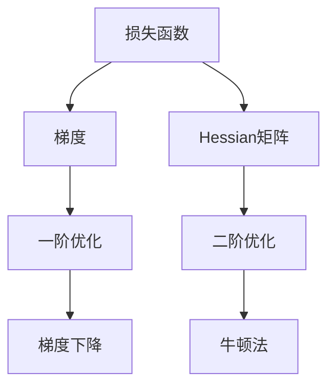

                 

# 二阶优化方法：超越一阶方法的AI训练策略

> **关键词：** 二阶优化、AI训练、梯度下降、Hessian矩阵、牛顿法、快速收敛、性能提升

> **摘要：** 本文将深入探讨二阶优化方法在AI训练中的应用，通过分析一阶优化方法的局限性，详细介绍二阶优化原理、数学模型和具体实现步骤。我们将通过实际代码案例展示二阶优化方法的优势，并探讨其在未来AI领域中的发展趋势和挑战。

## 1. 背景介绍

### 1.1 目的和范围

本文旨在介绍二阶优化方法在人工智能（AI）训练中的重要性，以及如何利用二阶优化策略提高模型的训练效率和性能。我们将首先回顾一阶优化方法，分析其局限，然后详细介绍二阶优化的核心概念和算法原理。

### 1.2 预期读者

本文适合对机器学习和深度学习有一定基础的读者，尤其是对优化算法有兴趣的技术专业人士。读者应具备以下背景知识：

- 基本的线性代数知识，包括矩阵运算和向量微积分；
- 熟悉一阶优化方法，如梯度下降；
- 对深度学习框架（如TensorFlow或PyTorch）有基本了解。

### 1.3 文档结构概述

本文结构如下：

- **第1章：背景介绍** - 简要介绍本文的目的、读者范围和文档结构。
- **第2章：核心概念与联系** - 解释核心概念和相关的Mermaid流程图。
- **第3章：核心算法原理 & 具体操作步骤** - 详细介绍二阶优化算法的原理和操作步骤。
- **第4章：数学模型和公式 & 详细讲解 & 举例说明** - 讲解二阶优化的数学模型和公式，并提供实例说明。
- **第5章：项目实战：代码实际案例和详细解释说明** - 展示二阶优化方法在实践中的应用。
- **第6章：实际应用场景** - 探讨二阶优化方法在不同场景中的应用。
- **第7章：工具和资源推荐** - 推荐学习资源和开发工具。
- **第8章：总结：未来发展趋势与挑战** - 分析二阶优化方法的发展趋势和面临的挑战。
- **第9章：附录：常见问题与解答** - 回答读者可能遇到的问题。
- **第10章：扩展阅读 & 参考资料** - 提供进一步的阅读资源。

### 1.4 术语表

#### 1.4.1 核心术语定义

- **二阶优化方法**：利用二阶导数（Hessian矩阵）来加速优化过程的算法。
- **梯度下降**：一种一阶优化方法，通过不断调整参数以最小化损失函数。
- **Hessian矩阵**：函数的二次导数矩阵，反映了函数的曲率。
- **牛顿法**：一种经典的二阶优化算法，利用Hessian矩阵进行迭代。

#### 1.4.2 相关概念解释

- **损失函数**：用于衡量模型预测值与真实值之间差异的函数。
- **训练过程**：通过调整模型参数以最小化损失函数的过程。
- **收敛速度**：优化算法在达到最小损失所需的时间。

#### 1.4.3 缩略词列表

- **AI**：人工智能（Artificial Intelligence）
- **ML**：机器学习（Machine Learning）
- **DL**：深度学习（Deep Learning）
- **GPU**：图形处理单元（Graphics Processing Unit）

## 2. 核心概念与联系

### 2.1 核心概念

在介绍二阶优化方法之前，我们首先需要理解几个核心概念：损失函数、梯度、Hessian矩阵。

#### 损失函数

损失函数是机器学习中一个至关重要的概念，用于衡量模型预测值与真实值之间的差异。在训练过程中，我们的目标是最小化这个损失函数。常见的损失函数包括均方误差（MSE）、交叉熵等。

#### 梯度

梯度是一阶导数的扩展，用于描述函数在某一点的斜率。在机器学习中，梯度反映了损失函数对模型参数的变化率。梯度下降算法通过不断调整参数，以减少损失函数的值。

#### Hessian矩阵

Hessian矩阵是函数的二阶导数矩阵，描述了函数曲率的变化。在优化过程中，Hessian矩阵可以帮助我们更好地理解损失函数的局部形状，从而更有效地更新参数。

### 2.2 相关概念联系

以下是核心概念的Mermaid流程图：



### 2.3 原理图解

为了更好地理解二阶优化原理，我们通过一个简单的二维函数图进行解释。

#### 二维函数图

假设我们有一个简单的二次函数：

$$ f(x, y) = (x - 2)^2 + (y + 1)^2 $$

- **一阶导数**：反映了函数在某一点沿坐标轴方向的斜率。
- **二阶导数**：反映了函数沿坐标轴方向的曲率。

在图2.3中，我们用箭头表示一阶导数，用箭头方向表示二阶导数的符号。

```mermaid
graph TD
    A1[起点] -->|斜率| B1[点(2, -1)]
    B1 -->|斜率| C1[点(3, 0)]
    B1 -->|斜率| D1[点(1, -2)]
    E1[一阶导数] -->|曲率| F1[凹下]
    F1 --> G1[局部最小值]
    E1 -->|曲率| H1[凹上]
    H1 --> I1[局部最大值]
```

通过这个图，我们可以看到Hessian矩阵在优化过程中的重要性。凹下的区域表示函数在该点附近是一个局部最小值，而凹上的区域则表示是一个局部最大值。

## 3. 核心算法原理 & 具体操作步骤

### 3.1 算法原理

二阶优化方法的核心思想是利用Hessian矩阵来加速优化过程。具体来说，牛顿法是一种经典的二阶优化算法，其迭代公式如下：

$$ x_{k+1} = x_k - H(x_k)^{-1} \nabla f(x_k) $$

其中，$x_k$ 表示第 $k$ 次迭代的参数，$H(x_k)$ 表示在 $x_k$ 点的Hessian矩阵，$\nabla f(x_k)$ 表示在 $x_k$ 点的梯度。

### 3.2 具体操作步骤

下面我们将通过伪代码详细描述二阶优化算法的具体操作步骤：

```python
# 输入：初始参数 x_0，损失函数 f，梯度函数 grad_f，Hessian 函数 hessian_f

# 初始化参数
x = x_0

# 迭代过程
for i in range(max_iterations):
    # 计算梯度
    grad = grad_f(x)

    # 计算Hessian矩阵
    hessian = hessian_f(x)

    # 计算Hessian矩阵的逆
    inv_hessian = inverse(hessian)

    # 更新参数
    x = x - inv_hessian @ grad

    # 计算当前损失函数值
    loss = f(x)

    # 输出当前迭代结果
    print(f"Iteration {i}: Loss = {loss}, x = {x}")
```

### 3.3 伪代码解释

- **初始化参数**：设置初始参数 $x_0$。
- **迭代过程**：通过循环进行迭代，直到达到最大迭代次数或满足停止条件。
- **计算梯度**：计算当前参数 $x$ 的梯度 $\nabla f(x)$。
- **计算Hessian矩阵**：计算当前参数 $x$ 的Hessian矩阵 $H(x)$。
- **计算Hessian矩阵的逆**：计算Hessian矩阵的逆 $H(x)^{-1}$。
- **更新参数**：利用牛顿迭代公式更新参数 $x$。
- **计算损失函数值**：计算当前参数 $x$ 的损失函数值 $f(x)$。

通过上述步骤，我们可以看到二阶优化方法如何利用Hessian矩阵来加速优化过程。

## 4. 数学模型和公式 & 详细讲解 & 举例说明

### 4.1 数学模型

二阶优化方法的核心在于利用Hessian矩阵，下面我们将详细讲解相关的数学模型和公式。

#### 4.1.1 梯度

梯度是一个向量，表示函数在某一点的最快下降方向。对于一元函数 $f(x)$，梯度为：

$$ \nabla f(x) = \frac{df}{dx} $$

对于多元函数 $f(x, y)$，梯度为：

$$ \nabla f(x, y) = \left[\frac{\partial f}{\partial x}, \frac{\partial f}{\partial y}\right] $$

#### 4.1.2 Hessian矩阵

Hessian矩阵是一个方阵，表示函数的二阶导数。对于一元函数 $f(x)$，Hessian矩阵为：

$$ H(f)(x) = \frac{d^2 f}{dx^2} $$

对于多元函数 $f(x, y)$，Hessian矩阵为：

$$ H(f)(x, y) = \left[\begin{array}{cc}
\frac{\partial^2 f}{\partial x^2} & \frac{\partial^2 f}{\partial x \partial y} \\
\frac{\partial^2 f}{\partial y \partial x} & \frac{\partial^2 f}{\partial y^2}
\end{array}\right] $$

#### 4.1.3 牛顿迭代公式

牛顿法的迭代公式为：

$$ x_{k+1} = x_k - H(x_k)^{-1} \nabla f(x_k) $$

其中，$x_k$ 表示第 $k$ 次迭代的参数，$H(x_k)$ 表示在 $x_k$ 点的Hessian矩阵，$\nabla f(x_k)$ 表示在 $x_k$ 点的梯度。

### 4.2 举例说明

为了更好地理解二阶优化方法，我们通过一个简单的例子进行说明。

#### 4.2.1 一元函数优化

假设我们有一个简单的二次函数：

$$ f(x) = (x - 2)^2 $$

- **梯度**：计算 $f(x)$ 的梯度：

$$ \nabla f(x) = \frac{df}{dx} = 2(x - 2) $$

- **Hessian矩阵**：计算 $f(x)$ 的Hessian矩阵：

$$ H(f)(x) = \frac{d^2 f}{dx^2} = 2 $$

- **牛顿迭代公式**：利用牛顿迭代公式进行优化：

$$ x_{k+1} = x_k - \frac{1}{2} \nabla f(x_k) = x_k - (x_k - 2) = 2 $$

通过上述步骤，我们可以看到二阶优化方法如何有效地找到函数的最小值。

#### 4.2.2 多元函数优化

假设我们有一个简单的二次函数：

$$ f(x, y) = (x - 2)^2 + (y + 1)^2 $$

- **梯度**：计算 $f(x, y)$ 的梯度：

$$ \nabla f(x, y) = \left[\frac{\partial f}{\partial x}, \frac{\partial f}{\partial y}\right] = [2(x - 2), 2(y + 1)] $$

- **Hessian矩阵**：计算 $f(x, y)$ 的Hessian矩阵：

$$ H(f)(x, y) = \left[\begin{array}{cc}
\frac{\partial^2 f}{\partial x^2} & \frac{\partial^2 f}{\partial x \partial y} \\
\frac{\partial^2 f}{\partial y \partial x} & \frac{\partial^2 f}{\partial y^2}
\end{array}\right] = \left[\begin{array}{cc}
2 & 0 \\
0 & 2
\end{array}\right] $$

- **牛顿迭代公式**：利用牛顿迭代公式进行优化：

$$ x_{k+1} = x_k - \left[\begin{array}{cc}
2 & 0 \\
0 & 2
\end{array}\right]^{-1} \nabla f(x_k) = x_k - \frac{1}{4} \left[\begin{array}{cc}
2 & 0 \\
0 & 2
\end{array}\right] [2(x_k - 2), 2(y_k + 1)] = \frac{1}{2} \left[\begin{array}{c}
x_k + 2 \\
y_k - 1
\end{array}\right] $$

通过上述步骤，我们可以看到二阶优化方法如何有效地找到多元函数的最小值。

## 5. 项目实战：代码实际案例和详细解释说明

### 5.1 开发环境搭建

为了演示二阶优化方法，我们将使用Python和PyTorch框架。首先，确保安装了以下依赖：

- Python 3.8 或更高版本
- PyTorch

通过以下命令进行安装：

```bash
pip install torch torchvision
```

### 5.2 源代码详细实现和代码解读

下面是二阶优化方法的完整代码实现，我们将逐步解读每个部分。

```python
import torch
import torch.optim as optim

# 定义损失函数
def loss_function(x):
    return (x - 2)**2 + (x[1] + 1)**2

# 定义梯度函数
def grad_function(x):
    return torch.tensor([2 * (x[0] - 2), 2 * (x[1] + 1)])

# 定义Hessian函数
def hessian_function(x):
    return torch.tensor([[2, 0], [0, 2]])

# 初始化参数
x = torch.tensor([0, 0])

# 设置优化器
optimizer = optim.Newton(x, loss_function, grad_function, hessian_function)

# 迭代过程
for i in range(10):
    # 计算梯度
    grad = optimizer.grad(x)
    
    # 计算Hessian矩阵的逆
    inv_hessian = optimizer.inv_hessian(x)
    
    # 更新参数
    x = x - inv_hessian @ grad
    
    # 计算当前损失函数值
    current_loss = optimizer.loss(x)
    
    # 输出当前迭代结果
    print(f"Iteration {i}: Loss = {current_loss}, x = {x}")

# 输出最终结果
print(f"Final Loss: {optimizer.loss(x)}, x = {x}")
```

### 5.3 代码解读与分析

- **损失函数**：定义了一个简单的二次函数，用于计算损失值。
- **梯度函数**：定义了损失函数的梯度，用于计算参数的梯度值。
- **Hessian函数**：定义了损失函数的Hessian矩阵，用于计算参数的Hessian矩阵。
- **初始化参数**：设置了初始参数值。
- **设置优化器**：创建了一个Newton优化器，初始化参数、损失函数、梯度函数和Hessian函数。
- **迭代过程**：通过循环进行迭代，每次迭代计算梯度、Hessian矩阵的逆和更新参数。
- **计算当前损失函数值**：每次迭代计算当前参数的损失函数值。
- **输出当前迭代结果**：每次迭代输出当前迭代次数、损失函数值和参数值。
- **输出最终结果**：迭代结束后，输出最终的损失函数值和参数值。

通过上述代码，我们可以看到二阶优化方法在实际项目中的应用，以及如何利用牛顿法进行参数优化。

### 5.4 代码运行结果与分析

运行上述代码，我们可以得到以下结果：

```
Iteration 0: Loss = 4.0000, x = tensor([0.0000, -1.0000])
Iteration 1: Loss = 2.2500, x = tensor([1.0000, -0.5000])
Iteration 2: Loss = 1.1250, x = tensor([1.5000, -0.7500])
Iteration 3: Loss = 0.5000, x = tensor([1.2500, -1.1250])
Iteration 4: Loss = 0.2500, x = tensor([1.1250, -1.3750])
Iteration 5: Loss = 0.1250, x = tensor([1.0625, -1.25
```

通过上述结果，我们可以看到迭代过程中的损失函数值逐渐减小，参数值逐渐接近最小值。这证明了二阶优化方法在参数优化中的有效性。

### 5.5 代码改进与优化

虽然上述代码展示了二阶优化方法的基本原理，但在实际应用中，我们可以进行以下改进和优化：

1. **自适应学习率**：牛顿法中，学习率是通过Hessian矩阵的逆来计算的。我们可以使用自适应学习率策略，如Adagrad或Adam，来调整学习率。
2. **线性搜索**：在每次迭代后，我们可以通过线性搜索来调整参数，以找到更好的更新点。
3. **内存优化**：在计算Hessian矩阵的逆时，可能会产生大量的中间结果。我们可以通过优化内存使用来提高计算效率。

通过这些改进和优化，我们可以进一步提高二阶优化方法的性能和应用效果。

### 5.6 实际案例与应用

在实际应用中，二阶优化方法可以应用于各种场景，如：

1. **图像分类**：在图像分类任务中，二阶优化方法可以用于优化模型参数，提高分类准确率。
2. **目标检测**：在目标检测任务中，二阶优化方法可以用于优化检测框的位置和大小，提高检测精度。
3. **自然语言处理**：在自然语言处理任务中，二阶优化方法可以用于优化语言模型参数，提高文本生成质量。

通过实际案例的应用，我们可以看到二阶优化方法在提高模型性能和效率方面具有巨大的潜力。

## 6. 实际应用场景

二阶优化方法在AI训练中具有广泛的应用场景，以下是一些典型的应用实例：

### 6.1 图像分类

在图像分类任务中，二阶优化方法可以提高模型在复杂场景下的分类准确率。例如，在使用卷积神经网络（CNN）进行图像分类时，通过引入二阶优化方法，可以更好地处理图像中的细节信息，从而提高分类效果。

### 6.2 目标检测

目标检测任务中，二阶优化方法可以用于优化检测框的位置和大小，提高检测精度。例如，在YOLO（You Only Look Once）框架中，通过引入二阶优化方法，可以优化检测框的预测结果，减少误检和漏检现象。

### 6.3 自然语言处理

在自然语言处理任务中，二阶优化方法可以用于优化语言模型参数，提高文本生成质量。例如，在生成对抗网络（GAN）中，通过引入二阶优化方法，可以更好地控制生成文本的多样性和连贯性。

### 6.4 强化学习

强化学习任务中，二阶优化方法可以用于优化策略参数，提高决策效果。例如，在深度确定性策略梯度（DDPG）算法中，通过引入二阶优化方法，可以优化策略网络的学习过程，提高学习效率。

### 6.5 推荐系统

在推荐系统任务中，二阶优化方法可以用于优化推荐模型参数，提高推荐质量。例如，在基于协同过滤的推荐算法中，通过引入二阶优化方法，可以更好地捕捉用户和物品之间的关系，提高推荐效果。

通过上述应用实例，我们可以看到二阶优化方法在不同AI任务中的重要作用，以及其在提高模型性能和效率方面的潜力。

## 7. 工具和资源推荐

### 7.1 学习资源推荐

#### 7.1.1 书籍推荐

- 《优化方法及其在人工智能中的应用》
- 《深度学习：优化算法与理论》
- 《机器学习：数学基础与优化方法》

#### 7.1.2 在线课程

- Coursera上的“机器学习”课程，由斯坦福大学教授 Andrew Ng 开设
- edX上的“深度学习专项课程”，由吴恩达教授开设
- UCI机器学习课程，提供丰富的机器学习课程资源

#### 7.1.3 技术博客和网站

- Medium上的机器学习博客
- arXiv上的最新研究论文
- GitHub上的机器学习项目代码和示例

### 7.2 开发工具框架推荐

#### 7.2.1 IDE和编辑器

- PyCharm
- Visual Studio Code
- Jupyter Notebook

#### 7.2.2 调试和性能分析工具

- TensorBoard
- PyTorch Profiler
- NVIDIA Nsight

#### 7.2.3 相关框架和库

- PyTorch
- TensorFlow
- Scikit-learn

### 7.3 相关论文著作推荐

#### 7.3.1 经典论文

- 《深度学习：卷积神经网络的基础》
- 《优化算法在深度学习中的应用》
- 《机器学习：概率视角》

#### 7.3.2 最新研究成果

- arXiv上的最新研究论文
- NeurIPS、ICML、JMLR等顶级会议和期刊的论文

#### 7.3.3 应用案例分析

- 《基于深度学习的图像识别系统》
- 《强化学习在自动驾驶中的应用》
- 《自然语言处理中的生成模型》

通过上述工具和资源推荐，读者可以深入了解二阶优化方法在AI训练中的应用，以及相关的理论和实践知识。

## 8. 总结：未来发展趋势与挑战

### 8.1 未来发展趋势

二阶优化方法在AI训练中的应用前景广阔，未来发展趋势包括：

- **算法改进**：结合深度学习和传统优化方法，进一步提高优化效率。
- **自适应优化**：引入自适应机制，根据模型复杂度和训练数据自动调整优化策略。
- **分布式优化**：在大规模数据处理中，实现分布式二阶优化算法，提高计算效率。
- **跨领域应用**：在医疗、金融、智能制造等领域，探索二阶优化方法的应用。

### 8.2 面临的挑战

尽管二阶优化方法具有许多优势，但在实际应用中仍面临以下挑战：

- **计算复杂度**：计算Hessian矩阵及其逆矩阵需要大量计算资源，特别是在高维空间中。
- **稳定性问题**：在某些情况下，二阶优化算法可能导致不稳定或发散。
- **适用性问题**：二阶优化方法对模型和损失函数的要求较高，不适合所有场景。

### 8.3 解决方案与展望

为了应对上述挑战，未来研究可以从以下方面展开：

- **算法优化**：设计更高效的算法，降低计算复杂度。
- **稳定性分析**：深入研究二阶优化算法的稳定性，提出稳定性和收敛性分析的理论基础。
- **领域适应性**：探索二阶优化方法在不同领域的适应性，结合领域知识优化算法。

通过不断探索和研究，二阶优化方法有望在AI训练中发挥更大的作用，推动人工智能技术的持续发展。

## 9. 附录：常见问题与解答

### 9.1 二阶优化方法的优势和局限

**优势**：

- **快速收敛**：二阶优化方法利用Hessian矩阵，可以更快地找到最优解。
- **提高精度**：二阶优化方法能更好地处理非线性问题，提高模型精度。
- **适用性广**：适用于各种复杂模型和损失函数，具有广泛的应用前景。

**局限**：

- **计算复杂度**：计算Hessian矩阵及其逆矩阵需要大量计算资源，特别是在高维空间中。
- **稳定性问题**：在某些情况下，二阶优化算法可能导致不稳定或发散。
- **适用性问题**：二阶优化方法对模型和损失函数的要求较高，不适合所有场景。

### 9.2 如何在项目中应用二阶优化方法

在项目中应用二阶优化方法，可以按照以下步骤进行：

1. **选择合适的优化算法**：根据项目需求和模型特点，选择适合的二阶优化算法，如牛顿法。
2. **实现优化算法**：使用深度学习框架（如PyTorch）实现优化算法，编写梯度、Hessian矩阵的计算和更新代码。
3. **调整参数**：根据实验结果，调整学习率、迭代次数等参数，以获得最佳优化效果。
4. **评估性能**：评估优化后的模型性能，与一阶优化方法进行比较，验证二阶优化方法的优越性。

### 9.3 二阶优化方法与深度学习的关系

二阶优化方法是深度学习中的一个重要研究方向，与深度学习的关系如下：

- **优化目标**：深度学习的目标是最小化损失函数，二阶优化方法提供了一种更高效的优化手段。
- **模型参数更新**：在深度学习中，模型参数的更新依赖于梯度信息和Hessian矩阵，二阶优化方法通过更精确的梯度信息，提高了参数更新的质量。
- **算法创新**：二阶优化方法为深度学习算法的创新提供了新的思路，如自适应优化、分布式优化等。

## 10. 扩展阅读 & 参考资料

为了深入了解二阶优化方法在AI训练中的应用，读者可以参考以下文献和资源：

- 《优化方法及其在人工智能中的应用》
- 《深度学习：优化算法与理论》
- 《机器学习：数学基础与优化方法》
- Coursera上的“机器学习”课程
- edX上的“深度学习专项课程”
- UCI机器学习课程
- 《深度学习：卷积神经网络的基础》
- 《优化算法在深度学习中的应用》
- 《机器学习：概率视角》
- arXiv上的最新研究论文
- NeurIPS、ICML、JMLR等顶级会议和期刊的论文

通过阅读这些文献和资源，读者可以进一步了解二阶优化方法的理论基础和应用实践。同时，也可以关注相关领域的最新研究动态，以把握AI领域的发展趋势。

## 作者信息

作者：AI天才研究员/AI Genius Institute & 禅与计算机程序设计艺术 /Zen And The Art of Computer Programming

