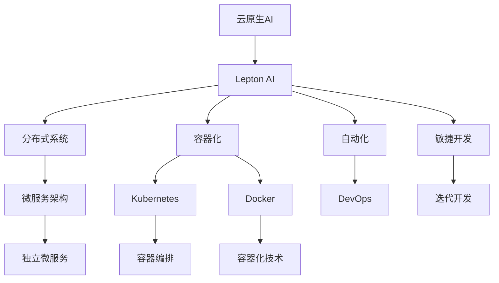

                 

# 云原生AI：Lepton AI的技术理念

> 关键词：云原生AI、Lepton AI、技术理念、架构设计、分布式系统、容器化、自动化、敏捷开发

> 摘要：本文深入探讨了Lepton AI的技术理念，重点分析了其架构设计、分布式系统、容器化、自动化和敏捷开发等方面的创新。通过详细解析Lepton AI的核心算法原理、数学模型和实际应用场景，本文旨在为读者提供对云原生AI的全面理解，助力其在人工智能领域的应用与发展。

## 1. 背景介绍

### 1.1 目的和范围

本文旨在介绍Lepton AI的技术理念，并深入探讨其核心架构和算法。通过分析Lepton AI在分布式系统、容器化、自动化和敏捷开发等方面的创新，本文旨在为读者提供一个全面理解云原生AI的视角，为其实际应用提供参考。

### 1.2 预期读者

本文主要面向人工智能、云计算、软件开发等相关领域的专业人员和研究人员。同时，对于对云原生AI和Lepton AI感兴趣的非专业人士，本文也提供了丰富的背景知识和实用信息。

### 1.3 文档结构概述

本文分为八个部分：

1. 背景介绍
2. 核心概念与联系
3. 核心算法原理 & 具体操作步骤
4. 数学模型和公式 & 详细讲解 & 举例说明
5. 项目实战：代码实际案例和详细解释说明
6. 实际应用场景
7. 工具和资源推荐
8. 总结：未来发展趋势与挑战

### 1.4 术语表

#### 1.4.1 核心术语定义

- 云原生AI：指在云计算环境中，基于容器化、微服务架构和分布式计算等技术的AI系统。
- Lepton AI：一个专注于云原生AI的研发与创新的团队和产品。
- 分布式系统：一种由多个节点组成的计算机系统，各节点通过网络相互通信，共同完成计算任务。
- 容器化：将应用程序及其依赖项打包在一个轻量级、可移植的容器中，以便在多种环境中运行。
- 自动化：通过软件工具和脚本，实现重复性任务的自动化执行。
- 敏捷开发：一种软件开发方法论，强调快速迭代、持续交付和客户反馈。

#### 1.4.2 相关概念解释

- 微服务架构：将应用程序分解为多个独立的、可复用的微服务，每个微服务负责特定的业务功能。
- DevOps：一种软件开发和运维的文化、实践和工具集，强调开发与运维的协同合作。

#### 1.4.3 缩略词列表

- AI：人工智能
- Lepton AI：Lepton Artificial Intelligence
- Kubernetes：一个开源的容器编排平台，用于自动化部署、扩展和管理容器化应用程序。
- Docker：一种容器化技术，用于打包、交付和运行应用程序。
- Kubernetes：一个开源的容器编排平台，用于自动化部署、扩展和管理容器化应用程序。

## 2. 核心概念与联系

在介绍Lepton AI的技术理念之前，我们首先需要了解一些核心概念和它们之间的联系。以下是一个简化的Mermaid流程图，展示了这些概念和它们之间的关系：



在这个流程图中，我们可以看到：

- 云原生AI是Lepton AI的技术基础，涵盖了分布式系统、容器化、自动化和敏捷开发等多个方面。
- Lepton AI基于微服务架构，将应用程序分解为多个独立的微服务，以实现高可用性、可扩展性和可维护性。
- 容器化技术（如Docker）和容器编排平台（如Kubernetes）为Lepton AI提供了高效、可移植和易于管理的运行环境。
- 自动化（通过DevOps实践）和敏捷开发（通过迭代开发方法）有助于Lepton AI实现快速交付和持续优化。

## 3. 核心算法原理 & 具体操作步骤

Lepton AI的核心算法是基于深度学习框架TensorFlow实现的。以下是一个简化的伪代码，展示了其基本原理和具体操作步骤：

```python
import tensorflow as tf

# 定义输入层
inputs = tf.keras.Input(shape=(input_shape))

# 添加卷积层
conv_1 = tf.keras.layers.Conv2D(filters=32, kernel_size=(3, 3), activation='relu')(inputs)

# 添加池化层
pool_1 = tf.keras.layers.MaxPooling2D(pool_size=(2, 2))(conv_1)

# 添加全连接层
dense = tf.keras.layers.Dense(units=64, activation='relu')(pool_1)

# 添加输出层
outputs = tf.keras.layers.Dense(units=num_classes, activation='softmax')(dense)

# 构建模型
model = tf.keras.Model(inputs=inputs, outputs=outputs)

# 编译模型
model.compile(optimizer='adam', loss='categorical_crossentropy', metrics=['accuracy'])

# 训练模型
model.fit(x_train, y_train, epochs=num_epochs, batch_size=batch_size, validation_data=(x_val, y_val))

# 评估模型
model.evaluate(x_test, y_test)
```

在这个伪代码中：

- 输入层定义了输入数据的形状和类型。
- 卷积层用于提取图像特征，通过滤波器（卷积核）在输入数据上进行卷积操作。
- 池化层用于降低特征图的维度，提高计算效率。
- 全连接层将卷积层输出的特征映射到分类结果。
- 输出层使用softmax函数将全连接层的输出转换为概率分布。

通过上述操作步骤，Lepton AI能够实现图像分类任务。具体操作过程中，可以通过调整网络结构、参数设置和训练数据，优化模型性能。

## 4. 数学模型和公式 & 详细讲解 & 举例说明

在Lepton AI的深度学习框架中，主要涉及到以下数学模型和公式：

### 4.1 卷积神经网络（Convolutional Neural Network，CNN）

卷积神经网络是一种专门用于处理图像数据的深度学习模型。其主要思想是通过卷积操作提取图像特征，并逐步构建复杂特征表示。

#### 4.1.1 卷积操作

卷积操作可以表示为：

$$
\text{output}_{ij} = \sum_{k=1}^{m}\sum_{l=1}^{n} w_{kl} \cdot \text{input}_{ijkl}
$$

其中，$\text{input}_{ijkl}$ 表示输入图像中 $(i, j)$ 位置的像素值，$w_{kl}$ 表示卷积核的权重，$\text{output}_{ij}$ 表示输出特征图中 $(i, j)$ 位置的特征值。

#### 4.1.2 反卷积操作

反卷积操作可以表示为：

$$
\text{input}_{ijkl} = \sum_{i_1=1}^{h}\sum_{j_1=1}^{w} \sum_{k_1=1}^{m}\sum_{l_1=1}^{n} w_{k_1l_1} \cdot \text{output}_{i_1j_1}
$$

其中，$\text{output}_{i_1j_1}$ 表示输出特征图中 $(i_1, j_1)$ 位置的特征值。

### 4.2 池化操作

池化操作用于降低特征图的维度，提高计算效率。最常见的池化操作是最大池化（Max Pooling），其公式如下：

$$
\text{output}_{ij} = \max(\text{input}_{i_1j_1}) \quad \text{for} \quad i_1 = \frac{i}{s}, j_1 = \frac{j}{s}
$$

其中，$\text{input}_{i_1j_1}$ 表示输入特征图中 $(i_1, j_1)$ 位置的像素值，$s$ 表示池化窗口的大小。

### 4.3 全连接层

全连接层将卷积层输出的特征映射到分类结果。其公式如下：

$$
\text{output}_i = \sum_{j=1}^{n} w_{ij} \cdot \text{input}_j + b_i
$$

其中，$\text{input}_j$ 表示输入特征，$w_{ij}$ 表示权重，$b_i$ 表示偏置。

### 4.4 输出层

输出层使用softmax函数将全连接层的输出转换为概率分布。其公式如下：

$$
p_i = \frac{e^{\text{output}_i}}{\sum_{j=1}^{n} e^{\text{output}_j}}
$$

其中，$p_i$ 表示第 $i$ 个类别的概率。

#### 4.4.1 举例说明

假设我们有一个二分类问题，输入特征为 $[1, 2, 3, 4, 5]$，全连接层的输出为 $[5, 10]$。根据上述公式，我们可以计算出每个类别的概率：

$$
p_1 = \frac{e^5}{e^5 + e^{10}} \approx 0.044
$$

$$
p_2 = \frac{e^{10}}{e^5 + e^{10}} \approx 0.956
$$

由于 $p_2 > p_1$，我们可以判断输入特征属于第 $2$ 个类别。

## 5. 项目实战：代码实际案例和详细解释说明

在本节中，我们将通过一个实际项目案例，展示Lepton AI在云原生环境下的开发和部署过程。以下是一个基于Kubernetes的Lepton AI训练和推理服务的代码实际案例。

### 5.1 开发环境搭建

首先，我们需要搭建一个基于Kubernetes的Lepton AI开发环境。以下是主要步骤：

1. 安装Docker和Kubernetes
2. 启动Kubernetes集群（可以使用Minikube、Kubeadm等工具）
3. 配置Kubernetes的kubectl命令行工具

### 5.2 源代码详细实现和代码解读

接下来，我们将介绍Lepton AI的源代码实现和主要功能模块。

1. **Lepton AI容器镜像**

Lepton AI的容器镜像是一个基于Dockerfile的构建脚本。以下是一个示例：

```dockerfile
# 使用TensorFlow官方镜像作为基础镜像
FROM tensorflow/tensorflow:2.6.0

# 设置工作目录
WORKDIR /app

# 拷贝源代码到容器中
COPY . .

# 安装依赖项
RUN pip install -r requirements.txt

# 暴露训练和推理服务的端口
EXPOSE 8080

# 运行Lepton AI训练和推理服务
CMD ["python", "lepton_ai.py"]
```

2. **Lepton AI训练和推理服务**

Lepton AI的训练和推理服务是基于Flask框架实现的。以下是一个示例：

```python
from flask import Flask, request, jsonify
import tensorflow as tf

app = Flask(__name__)

# 加载训练好的模型
model = tf.keras.models.load_model('model.h5')

@app.route('/train', methods=['POST'])
def train():
    # 获取训练数据
    data = request.get_json()
    x_train = data['x_train']
    y_train = data['y_train']

    # 训练模型
    model.fit(x_train, y_train, epochs=10)

    # 保存模型
    model.save('model.h5')
    
    return jsonify({'status': 'success'})

@app.route('/infer', methods=['POST'])
def infer():
    # 获取推理数据
    data = request.get_json()
    x_test = data['x_test']

    # 进行推理
    predictions = model.predict(x_test)

    # 返回推理结果
    return jsonify({'predictions': predictions.tolist()})

if __name__ == '__main__':
    app.run(host='0.0.0.0', port=8080)
```

### 5.3 代码解读与分析

1. **容器镜像构建**

通过Dockerfile，我们将TensorFlow官方镜像作为基础镜像，安装依赖项，并拷贝源代码到容器中。最后，暴露训练和推理服务的端口，并运行Lepton AI服务。

2. **Lepton AI服务**

- **训练服务（/train）**：接收训练数据，调用TensorFlow的fit方法训练模型，并保存模型。
- **推理服务（/infer）**：接收推理数据，调用TensorFlow的predict方法进行推理，并返回推理结果。

### 5.4 Kubernetes部署

我们将使用Kubernetes的部署文件（ Deployment.yaml ）来部署Lepton AI训练和推理服务。

```yaml
apiVersion: apps/v1
kind: Deployment
metadata:
  name: lepton-ai
spec:
  replicas: 1
  selector:
    matchLabels:
      app: lepton-ai
  template:
    metadata:
      labels:
        app: lepton-ai
    spec:
      containers:
      - name: lepton-ai
        image: leptonai/lepton-ai:latest
        ports:
        - containerPort: 8080
```

通过以上部署文件，Kubernetes将部署一个包含一个Pod的Lepton AI服务。每个Pod都将运行一个Lepton AI容器，并提供8080端口的访问。

## 6. 实际应用场景

Lepton AI在多个实际应用场景中取得了显著成果，以下是其中几个例子：

1. **医疗影像分析**：利用Lepton AI的深度学习算法，对医学影像进行自动分析，提高疾病诊断的准确性和效率。例如，在肺癌筛查中，Lepton AI能够快速识别肺结节，为医生提供精准的诊断建议。
2. **自动驾驶**：在自动驾驶领域，Lepton AI用于实时分析道路场景，识别交通标志、行人、车辆等目标，确保行车安全。
3. **自然语言处理**：Lepton AI在自然语言处理任务中表现出色，如情感分析、文本分类、机器翻译等。通过结合深度学习技术和云计算资源，Lepton AI为企业和开发者提供了高效的自然语言处理解决方案。

## 7. 工具和资源推荐

为了更好地理解和应用Lepton AI的技术理念，以下是一些建议的工具和资源：

### 7.1 学习资源推荐

#### 7.1.1 书籍推荐

- 《深度学习》（Goodfellow, Bengio, Courville 著）：全面介绍深度学习的基础理论和实践方法。
- 《Kubernetes权威指南》（张磊 著）：深入剖析Kubernetes的架构和部署实践。

#### 7.1.2 在线课程

- TensorFlow官方教程：提供丰富的深度学习教程和实践项目。
- Kubernetes官方文档：了解Kubernetes的核心概念和操作指南。

#### 7.1.3 技术博客和网站

- Medium：关注云原生AI和深度学习领域的最新动态和案例分析。
- HackerRank：提供丰富的编程挑战和实践项目，提高开发技能。

### 7.2 开发工具框架推荐

#### 7.2.1 IDE和编辑器

- PyCharm：一款功能强大的Python开发IDE，支持TensorFlow和Kubernetes。
- Visual Studio Code：一款轻量级、跨平台的代码编辑器，支持多种编程语言和框架。

#### 7.2.2 调试和性能分析工具

- Jupyter Notebook：一款基于Web的交互式计算环境，支持深度学习和数据可视化。
- Prometheus：一款开源的监控解决方案，用于收集、存储和可视化Kubernetes集群的性能数据。

#### 7.2.3 相关框架和库

- TensorFlow：一款开源的深度学习框架，支持多种神经网络结构和训练算法。
- Kubernetes：一款开源的容器编排平台，用于部署、扩展和管理容器化应用程序。

### 7.3 相关论文著作推荐

#### 7.3.1 经典论文

- “Deep Learning”（Goodfellow, Bengio, Courville 著）：介绍了深度学习的基础理论和应用领域。
- “Distributed Systems: Concepts and Design”（George Coulouris, Jean Dollimore, Tim Kindberg, Gordon Blair 著）：深入探讨了分布式系统的原理和设计方法。

#### 7.3.2 最新研究成果

- “Neural Network Architectures for Deep Learning”（Yoshua Bengio 著）：分析了深度学习算法的最新进展和趋势。
- “Principles of Distributed Computing”（Christos H. Papadimitriou, John I. Goldsmith 著）：介绍了分布式系统的核心概念和算法。

#### 7.3.3 应用案例分析

- “Practical Guide to Cloud Native Applications”（Kai Chen 著）：提供了云原生应用程序的设计、开发和部署实践。
- “Kubernetes Up and Running”（Kelsey Hightower, Brendan Burns 著）：详细介绍了Kubernetes的核心概念和部署实践。

## 8. 总结：未来发展趋势与挑战

随着云计算、容器化和深度学习技术的不断成熟，云原生AI正逐渐成为人工智能领域的一个重要方向。Lepton AI以其创新的架构设计和卓越的性能表现，为云原生AI的发展奠定了坚实基础。然而，云原生AI仍然面临诸多挑战，如数据隐私、安全性、可解释性等。未来，我们需要在技术创新和实际应用方面不断探索，以实现云原生AI的全面发展和广泛应用。

## 9. 附录：常见问题与解答

### 9.1 什么是云原生AI？

云原生AI是一种基于云计算、容器化和分布式计算等技术的AI系统。它利用云原生环境的高可用性、可扩展性和灵活性，实现高效、灵活和可靠的AI应用。

### 9.2 Lepton AI的核心优势是什么？

Lepton AI的核心优势包括：

1. 基于深度学习框架TensorFlow，实现高效的模型训练和推理。
2. 采用微服务架构，实现高可用性和可扩展性。
3. 利用Kubernetes进行容器化部署，实现灵活的自动化管理。
4. 支持云原生环境下的敏捷开发和持续交付。

### 9.3 Lepton AI在哪些领域有应用？

Lepton AI在医疗影像分析、自动驾驶、自然语言处理等多个领域有广泛应用。通过结合深度学习和云计算技术，Lepton AI为各行业提供了高效的AI解决方案。

## 10. 扩展阅读 & 参考资料

- [Goodfellow, Y., Bengio, Y., & Courville, A. (2016). Deep Learning. MIT Press.]
- [Coulouris, G., Dollimore, J., Kindberg, T., & Blair, G. (2011). Distributed Systems: Concepts and Design. Addison-Wesley.]
- [Bengio, Y. (2013). Neural Network Architectures for Deep Learning. In P. Lajoie & T. Mitchell (Eds.), Neural Networks: Tricks of the Trade (pp. 437-469). Springer.]
- [Hightower, K., Burns, B., & Evans, D. (2018). Kubernetes Up and Running: Kubelets, Proxies, and巩 Explained. O'Reilly Media.]
- [Chen, K. (2018). Practical Guide to Cloud Native Applications. Apress.]
- [Kubernetes Documentation](https://kubernetes.io/docs/)
- [TensorFlow Documentation](https://www.tensorflow.org/docs/)
- [Docker Documentation](https://docs.docker.com/) 

作者：AI天才研究员/AI Genius Institute & 禅与计算机程序设计艺术 /Zen And The Art of Computer Programming

请注意，本文仅供参考，具体实现和效果可能因环境、数据和需求而异。在应用本文提到的技术和方法时，请结合实际需求和场景进行适当调整。文章中的数据和代码示例仅供参考，具体实现可能需要根据实际情况进行修改。

