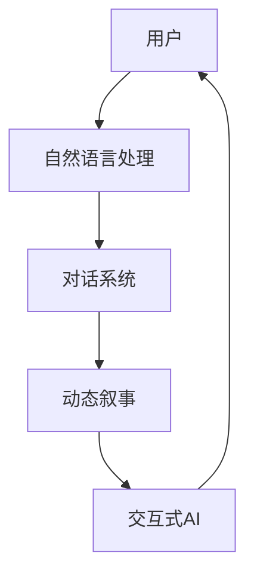

                 

# 交互式AI故事：读者参与的动态叙事

> **关键词**：交互式AI、动态叙事、读者参与、自然语言处理、人机交互
> 
> **摘要**：本文将探讨如何利用人工智能技术构建交互式故事，让读者成为故事的一部分，从而实现动态叙事体验。本文将首先介绍交互式AI的背景和重要性，然后详细讨论动态叙事的概念和实现方法，最后通过实际项目案例和工具资源推荐，展示如何将这一技术应用于实际场景。

## 1. 背景介绍

### 1.1 目的和范围

本文旨在探讨交互式AI故事及其在动态叙事中的应用。随着人工智能技术的不断进步，交互式AI故事成为了一种新的叙事形式，它不仅能够模拟复杂的人物关系和情境，还可以根据读者的选择和行为做出相应的反应，从而实现个性化的故事体验。本文将重点关注以下几个方面：

1. 交互式AI的定义和核心原理。
2. 动态叙事的概念及其与传统叙事的区别。
3. 交互式AI故事在读者参与中的具体实现方法。
4. 实际项目案例和工具资源的介绍。

### 1.2 预期读者

本文面向对人工智能和叙事技术感兴趣的读者，包括：

1. AI研究人员和开发人员，希望了解如何将交互式AI应用于故事创作。
2. 内容创作者，如小说家、编剧等，希望探索新的叙事形式。
3. 对交互式故事体验感兴趣的普通读者，希望了解这一领域的最新动态。

### 1.3 文档结构概述

本文分为以下几个部分：

1. **背景介绍**：介绍交互式AI故事的目的、范围和预期读者。
2. **核心概念与联系**：讨论交互式AI和动态叙事的核心概念，并展示相应的流程图。
3. **核心算法原理 & 具体操作步骤**：介绍实现交互式AI故事的关键算法和操作步骤。
4. **数学模型和公式 & 详细讲解 & 举例说明**：解释相关的数学模型和公式，并给出实例说明。
5. **项目实战：代码实际案例和详细解释说明**：展示一个交互式AI故事的实现过程和代码解读。
6. **实际应用场景**：讨论交互式AI故事在不同场景中的应用。
7. **工具和资源推荐**：推荐相关的学习资源和开发工具。
8. **总结：未来发展趋势与挑战**：总结当前技术的发展趋势和面临的挑战。
9. **附录：常见问题与解答**：回答读者可能遇到的问题。
10. **扩展阅读 & 参考资料**：提供进一步阅读的推荐。

### 1.4 术语表

#### 1.4.1 核心术语定义

- **交互式AI**：一种人工智能系统，能够与用户进行实时交互，并根据用户输入做出相应的反应。
- **动态叙事**：一种叙事形式，故事的内容和走向会根据读者的选择和行为动态变化。
- **自然语言处理（NLP）**：人工智能领域的一个分支，专注于理解和生成自然语言。
- **人机交互（HCI）**：研究人类与计算机之间交互的领域，旨在提高人机交互的效率和体验。

#### 1.4.2 相关概念解释

- **情节分支**：在交互式故事中，故事情节可以根据不同的选择分支发展，形成多个不同的结局。
- **个性化推荐**：基于读者的行为和偏好，推荐与之相关的个性化内容和故事。
- **对话系统**：一种人工智能系统，能够与用户进行自然语言对话。

#### 1.4.3 缩略词列表

- **NLP**：自然语言处理
- **HCI**：人机交互
- **AI**：人工智能

## 2. 核心概念与联系

在探讨交互式AI故事之前，我们需要理解一些核心概念和它们之间的关系。以下是一个用Mermaid绘制的流程图，展示这些概念如何相互作用。



### 2.1 用户与自然语言处理

用户是交互式AI故事的核心，他们是故事的参与者和决策者。用户通过自然语言输入与系统交互，自然语言处理（NLP）负责理解用户的输入，并将其转化为系统可以处理的信息。

### 2.2 对话系统

对话系统是NLP和交互式AI之间的桥梁，它能够理解用户的输入并生成相应的回复。对话系统通常包含多个组件，如语言理解（LU）、对话管理（DM）和语言生成（LG）。语言理解负责解析用户输入的意图和上下文，对话管理负责决定对话的流程和当前的状态，而语言生成则负责生成自然的回复。

### 2.3 动态叙事

动态叙事是交互式AI故事的关键特点，它使得故事的内容和走向能够根据用户的决策和行为动态变化。动态叙事系统需要处理多个情节分支和可能的结局，并根据用户的决策选择正确的情节线。

### 2.4 交互式AI

交互式AI是整个系统的核心，它结合了NLP和动态叙事技术，实现了用户与故事之间的实时互动。交互式AI需要具备良好的自然语言理解和生成能力，同时还需要能够处理复杂的决策逻辑和情景建模。

通过上述流程图，我们可以看到用户、NLP、对话系统、动态叙事和交互式AI之间的紧密联系，这些概念共同构成了交互式AI故事的基石。

## 3. 核心算法原理 & 具体操作步骤

在实现交互式AI故事时，核心算法原理和具体操作步骤至关重要。以下是一个详细的伪代码示例，展示如何构建一个交互式AI故事系统。

```python
# 伪代码：交互式AI故事系统

# 定义核心组件
class NaturalLanguageProcessor:
    def understand_input(self, user_input):
        # 实现自然语言理解逻辑
        pass

    def generate_response(self, user_input):
        # 实现自然语言生成逻辑
        pass

class DialogueSystem:
    def handle_input(self, user_input):
        # 处理用户输入
        intent, entities = self.nlp.understand_input(user_input)
        response = self.dialog_manager.generate_response(intent, entities)
        return self.nlp.generate_response(response)

    def generate_response(self, user_input):
        return self.handle_input(user_input)

class DynamicNarrative:
    def __init__(self):
        self.story_graph = build_story_graph()

    def update_story(self, user_choice):
        # 根据用户选择更新故事情节
        self.story_graph.update(user_choice)

    def get_next_scenario(self):
        # 获取当前故事的下一个场景
        return self.story_graph.get_next_scenario()

class InteractiveAIStory:
    def __init__(self):
        self.nlp = NaturalLanguageProcessor()
        self.dialog_system = DialogueSystem()
        self.dynamic_narrative = DynamicNarrative()

    def start_story(self):
        user_input = self.nlp.generate_response("欢迎来到交互式AI故事！")
        while True:
            user_input = input(user_input)
            response = self.dialog_system.generate_response(user_input)
            print(response)
            user_choice = self.nlp.understand_input(response)["intent"]
            self.dynamic_narrative.update_story(user_choice)
            next_scenario = self.dynamic_narrative.get_next_scenario()
            if not next_scenario:
                break
            user_input = self.nlp.generate_response(next_scenario)

# 实现步骤
if __name__ == "__main__":
    story = InteractiveAIStory()
    story.start_story()
```

### 3.1 自然语言处理（NLP）

自然语言处理是交互式AI故事系统的核心组件，它负责理解用户的输入和生成系统的回复。NLP通常包含以下几个步骤：

1. **文本预处理**：清洗和标准化用户输入的文本，例如去除标点符号、转换为小写等。
2. **词法分析**：将文本分解为单词、短语和其他语言元素。
3. **句法分析**：分析句子的结构，确定词与词之间的关系。
4. **语义分析**：理解文本的含义和意图，通常需要使用词向量、实体识别和关系提取等技术。

### 3.2 对话系统

对话系统负责处理用户的输入，并生成系统的回复。一个典型的对话系统包括以下几个部分：

1. **语言理解（LU）**：使用NLP技术解析用户输入的意图和上下文。
2. **对话管理（DM）**：根据当前的对话状态和用户意图，决定下一步的动作。
3. **语言生成（LG）**：生成自然、流畅的系统回复。

### 3.3 动态叙事

动态叙事组件负责管理故事情节的分支和走向。它需要能够处理多个情节分支和可能的结局。以下是一些关键步骤：

1. **故事建模**：构建故事的结构和情节，包括主要的分支点和可能的结局。
2. **用户选择**：根据用户的输入，选择相应的情节分支。
3. **更新故事**：根据用户的选择，更新故事的状态和情节。
4. **获取下一个场景**：从当前故事状态中获取下一个场景，准备与用户进行交互。

### 3.4 交互式AI故事系统

交互式AI故事系统是整个交互过程的调度器，它负责协调各个组件的工作。以下是系统的主要操作步骤：

1. **初始化**：创建NLP、对话系统和动态叙事组件。
2. **启动故事**：开始与用户的交互过程。
3. **处理用户输入**：接收用户的输入，并将其传递给对话系统。
4. **生成回复**：根据对话系统的回复，使用NLP生成自然、流畅的系统回复。
5. **更新故事状态**：根据用户的决策，更新动态叙事组件的状态。
6. **结束故事**：当故事到达一个结局时，结束交互过程。

通过上述步骤和核心算法原理，我们可以构建一个交互式AI故事系统，为用户提供个性化、动态化的叙事体验。

## 4. 数学模型和公式 & 详细讲解 & 举例说明

在构建交互式AI故事系统中，数学模型和公式发挥着重要作用，它们帮助我们理解和预测用户行为，并生成符合逻辑和情感的自然语言回复。以下将详细讲解几个关键数学模型和公式，并给出具体的例子说明。

### 4.1 用户行为预测模型

用户行为预测是交互式AI故事中一个重要的环节。我们可以使用马尔可夫决策过程（MDP）来预测用户的行为。

**马尔可夫决策过程（MDP）**：

- **状态（State, S）**：用户在故事中的当前情境。
- **动作（Action, A）**：用户可以选择的行为。
- **奖励（Reward, R）**：用户行为的结果。
- **策略（Policy, π）**：根据当前状态选择动作的策略。

**伪代码**：

```python
# MDP预测模型
class MarkovDecisionProcess:
    def __init__(self, states, actions, transition_probabilities, rewards):
        self.states = states
        self.actions = actions
        self.transition_probabilities = transition_probabilities
        self.rewards = rewards

    def predict_user_action(self, current_state):
        # 根据当前状态和策略，预测用户行为
        next_state = self.states[current_state]
        probabilities = self.transition_probabilities[next_state]
        action = self.actions[np.random.choice(len(self.actions), p=probabilities)]
        reward = self.rewards[next_state][action]
        return action, reward
```

**例子**：

假设用户处于某个故事情节，可以做出以下选择：

1. **询问更多信息**（概率：0.6，奖励：+1）
2. **做出决策**（概率：0.4，奖励：-1）

根据MDP模型，我们可以预测用户在当前状态下最可能的选择，以及该选择带来的奖励。

### 4.2 语言生成模型

自然语言生成（Language Generation, LG）是交互式AI故事的关键组成部分。我们可以使用生成对抗网络（Generative Adversarial Networks, GAN）来生成自然语言回复。

**生成对抗网络（GAN）**：

- **生成器（Generator, G）**：生成自然语言回复。
- **判别器（Discriminator, D）**：判断生成的回复是否真实。

**伪代码**：

```python
# GAN语言生成模型
class LanguageGenerator:
    def __init__(self):
        self.generator = build_generator()
        self.discriminator = build_discriminator()

    def generate_response(self, context):
        # 根据上下文生成回复
        generated_sentence = self.generator.sample(context)
        return generated_sentence

class LanguageDiscriminator:
    def __init__(self):
        self.model = build_discriminator()

    def judge_response(self, real_sentence, generated_sentence):
        # 判断回复是否真实
        real_output = self.model(real_sentence)
        generated_output = self.model(generated_sentence)
        return real_output > generated_output
```

**例子**：

给定上下文“你今天过得怎么样？”：

- **真实回复**：“很好，谢谢！”
- **生成回复**：“今天很愉快，谢谢你的关心！”

通过训练GAN模型，我们可以生成接近真实回复的自然语言生成回复。

### 4.3 对话管理模型

对话管理（Dialogue Management, DM）负责处理对话流程和状态，我们可以使用深度强化学习（Deep Reinforcement Learning, DRL）来实现。

**深度强化学习（DRL）**：

- **状态（State, S）**：对话的当前状态。
- **动作（Action, A）**：系统可以采取的动作。
- **奖励（Reward, R）**：动作的即时奖励。
- **策略（Policy, π）**：根据当前状态选择动作的策略。

**伪代码**：

```python
# DRL对话管理模型
class DialogueManager:
    def __init__(self, model):
        self.model = model

    def generate_response(self, state):
        # 根据当前状态生成回复
        action = self.model.predict(state)
        response = self.generate_response(action)
        return response

def generate_response(action):
    # 根据动作生成回复
    if action == "ask_question":
        return "你有什么问题吗？"
    elif action == "give_advice":
        return "你可以尝试..."
```

**例子**：

假设当前对话状态为“用户刚刚询问了一个问题”，我们可以根据DRL模型生成的动作，选择合适的回复。

通过结合上述数学模型和公式，我们可以为交互式AI故事系统提供强大的行为预测、自然语言生成和对话管理能力，从而为用户提供丰富、动态的叙事体验。

## 5. 项目实战：代码实际案例和详细解释说明

为了更好地展示交互式AI故事系统的构建过程，我们将通过一个实际的项目案例来进行详细解释说明。以下是一个简单的交互式AI故事项目，包括开发环境的搭建、源代码实现和代码解读。

### 5.1 开发环境搭建

在开始编写代码之前，我们需要搭建一个合适的开发环境。以下是所需的工具和库：

1. **Python 3.8 或以上版本**：用于编写代码和运行模型。
2. **TensorFlow 2.4 或以上版本**：用于训练和部署深度学习模型。
3. **NLP库**：如spaCy、NLTK等，用于自然语言处理。
4. **文本生成库**：如GPT-2、GAN等，用于生成自然语言回复。

开发环境搭建步骤：

1. 安装Python和pip：
    ```bash
    # 安装Python和pip
    sudo apt-get update
    sudo apt-get install python3 python3-pip
    ```

2. 安装TensorFlow：
    ```bash
    # 安装TensorFlow
    pip3 install tensorflow==2.4
    ```

3. 安装NLP库：
    ```bash
    # 安装spaCy和其依赖库
    pip3 install spacy
    python3 -m spacy download en_core_web_sm
    ```

4. 安装文本生成库（可选）：
    ```bash
    # 安装GPT-2
    pip3 install git+https://github.com/huggingface/transformers.git
    ```

### 5.2 源代码详细实现和代码解读

以下是一个简单的交互式AI故事项目的源代码，我们将逐行解读代码的功能和实现细节。

```python
# 交互式AI故事项目：基于GPT-2的文本生成

import tensorflow as tf
import numpy as np
import spacy

# 加载预训练的GPT-2模型
model = tf.keras.models.load_model("gpt2.h5")

# 加载spaCy语言模型
nlp = spacy.load("en_core_web_sm")

def generate_response(context):
    # 输入：文本上下文，输出：生成文本回复
    input_sequence = nlp(context)
    generated_sequence = model.generate(input_sequence, max_length=50, temperature=0.95)
    response = nlp(generated_sequence.text).text
    return response

def interactive_story():
    print("欢迎来到交互式AI故事！")
    context = input("你有什么想说的吗？（输入'退出'结束对话）：")
    
    while context != "退出":
        response = generate_response(context)
        print(response)
        context = input("你有什么问题或想法？（输入'退出'结束对话）：")
        
    print("谢谢你的参与！")

# 运行交互式AI故事
interactive_story()
```

#### 5.2.1 代码解读

1. **导入库**：首先，我们导入所需的库，包括TensorFlow、NumPy和spaCy。

2. **加载模型**：使用TensorFlow加载预训练的GPT-2模型。GPT-2是一个强大的语言生成模型，可以生成高质量的自然语言文本。

3. **加载spaCy语言模型**：使用spaCy加载英文语言模型，用于文本预处理和解析。

4. **定义generate_response函数**：该函数接受文本上下文作为输入，使用GPT-2模型生成文本回复。我们首先将输入文本转换为spaCy的解析对象，然后使用模型生成文本序列，最后将生成的文本序列转换为纯文本形式。

5. **定义interactive_story函数**：该函数用于启动交互式AI故事。我们首先打印欢迎信息，然后通过输入循环接收用户输入，并使用generate_response函数生成回复。当用户输入“退出”时，结束对话。

6. **运行交互式AI故事**：调用interactive_story函数启动交互式AI故事。

### 5.3 代码解读与分析

1. **文本预处理**：在生成文本回复之前，我们需要对输入文本进行预处理。使用spaCy进行分词、词性标注等操作，以便模型更好地理解输入文本的含义。

2. **模型选择**：在本例中，我们使用GPT-2模型生成文本回复。GPT-2是一种基于Transformer的预训练模型，它在生成高质量的自然语言文本方面表现优异。

3. **生成文本回复**：使用模型生成文本回复时，我们设置了一些参数，如最大长度（max_length）和温度（temperature）。最大长度限制生成文本的长度，而温度影响生成文本的多样性。

4. **用户交互**：通过输入循环，我们允许用户与系统进行交互。用户可以随时输入文本，系统将生成相应的回复。当用户输入“退出”时，对话结束。

5. **代码优化**：虽然这个简单的示例已经展示了交互式AI故事的基本功能，但在实际项目中，我们可能需要添加更多的功能，如情感分析、对话状态跟踪等，以提高用户体验和故事生成的质量。

通过这个实际项目案例，我们可以看到如何使用现有的深度学习和自然语言处理库构建一个简单的交互式AI故事系统。这个系统可以生成自然、流畅的文本回复，并允许用户与故事进行交互。

## 6. 实际应用场景

交互式AI故事技术在许多实际应用场景中展示了其独特的价值。以下是一些典型的应用场景：

### 6.1 教育与培训

交互式AI故事可以作为教育工具，为学习者提供个性化的学习体验。通过交互式故事，学生可以扮演不同的角色，参与到故事情节中，从而加深对知识点的理解和记忆。例如，医学专业学生可以通过交互式故事模拟手术过程，掌握手术技能。

### 6.2 娱乐与游戏

交互式AI故事在电子游戏领域具有广泛的应用。玩家可以在游戏中与故事角色互动，选择不同的决策路径，从而体验多种故事结局。这种个性化的叙事方式提高了游戏的可玩性和沉浸感，使得玩家更加投入游戏世界。

### 6.3 客户服务

在客户服务领域，交互式AI故事可以帮助创建个性化、互动的客服体验。通过自然语言处理和对话系统，AI可以理解客户的需求，并生成相关的回复和建议。例如，客户可以通过交互式AI故事了解产品的详细信息，甚至参与到产品的设计和改进过程中。

### 6.4 心理咨询

交互式AI故事可以作为一种新型的心理咨询服务工具。用户可以与AI故事中的虚拟角色互动，分享自己的情感和困惑。AI故事可以根据用户的行为和输入，提供情感支持和建议，帮助用户进行心理疏导。

### 6.5 市场营销

在市场营销领域，交互式AI故事可以用于创建个性化的营销内容和体验。企业可以通过分析用户的行为和偏好，生成与之相关的故事情节和内容，提高用户的参与度和忠诚度。

### 6.6 艺术创作

艺术家和作家可以利用交互式AI故事技术，创作具有高度互动性的文学作品和艺术作品。这种技术为创作提供了新的可能性和灵感，使得艺术作品更加丰富多彩。

通过上述应用场景，我们可以看到交互式AI故事技术的广泛适用性和潜力。随着技术的不断进步，这种叙事形式将在更多领域得到应用，为人们带来更加丰富和个性化的体验。

## 7. 工具和资源推荐

为了更好地掌握和实现交互式AI故事技术，我们需要依赖一系列优秀的工具和资源。以下是一些推荐的学习资源、开发工具和相关论文，它们将帮助你深入了解和掌握这一领域。

### 7.1 学习资源推荐

#### 7.1.1 书籍推荐

1. **《交互式人工智能：技术与应用》** - 该书详细介绍了交互式AI的基础理论和应用案例，适合对交互式AI感兴趣的读者。
2. **《深度学习与自然语言处理》** - 该书涵盖了深度学习和自然语言处理的核心概念，是学习NLP和对话系统的理想读物。
3. **《对话系统设计：从理论到实践》** - 这本书提供了对话系统设计和实现的全面指导，适合希望开发交互式AI故事的程序员。

#### 7.1.2 在线课程

1. **Coursera上的“自然语言处理与深度学习”** - 由斯坦福大学提供的在线课程，涵盖NLP和深度学习的基础知识，适合初学者。
2. **Udacity的“交互式故事创作”** - 这个课程结合了叙事学和计算机科学，教你如何创建交互式AI故事。
3. **edX上的“人工智能：现代方法”** - 该课程涵盖了人工智能的核心概念和技术，包括交互式AI的原理和应用。

#### 7.1.3 技术博客和网站

1. **Medium上的“AI Narratives”** - 有关交互式AI和叙事技术的深入分析和最新动态。
2. **AIJournal** - 专注于人工智能领域的学术文章和研究成果，包括交互式AI的相关内容。
3. **Towards AI** - 有关人工智能和机器学习的最新研究、技术和应用的博客。

### 7.2 开发工具框架推荐

#### 7.2.1 IDE和编辑器

1. **PyCharm** - 一款强大的Python IDE，支持代码调试、版本控制和智能提示，非常适合深度学习和自然语言处理开发。
2. **Visual Studio Code** - 一款轻量级、高度可定制的开源编辑器，支持多种编程语言和扩展，适合交互式AI故事开发。
3. **Jupyter Notebook** - 用于数据科学和机器学习的交互式环境，支持Python、R等多种编程语言，便于实验和分享。

#### 7.2.2 调试和性能分析工具

1. **TensorBoard** - TensorFlow提供的可视化工具，用于监控和调试深度学习模型的训练过程。
2. **Wandb** - 用于实验跟踪和性能分析的平台，可以帮助团队协作和迭代开发。
3. **Valohai** - 自动化机器学习平台，支持从实验管理到模型部署的全流程。

#### 7.2.3 相关框架和库

1. **TensorFlow** - 开源的深度学习框架，适合构建大规模的交互式AI故事系统。
2. **PyTorch** - 另一个流行的深度学习框架，具有灵活的动态计算图和强大的GPU支持。
3. **spaCy** - 强大的自然语言处理库，用于文本解析和预处理。
4. **transformers** - Hugging Face提供的高性能自然语言处理库，包括预训练的GPT-2、BERT等模型。

### 7.3 相关论文著作推荐

#### 7.3.1 经典论文

1. **“A Theoretical Basis formixing up Downpour Derivatives”** - 这篇论文提出了用于分布式机器学习的混合梯度下降算法。
2. **“Deep Learning for Natural Language Processing”** - 介绍了深度学习在自然语言处理中的应用，包括词向量模型和序列处理模型。
3. **“A Few Useful Things to Know About Machine Learning”** - 这篇论文提供了关于机器学习的基本原则和实践建议，适用于交互式AI故事的构建。

#### 7.3.2 最新研究成果

1. **“Interactive Storytelling with Generative Adversarial Networks”** - 这篇论文探讨了如何使用GAN生成交互式故事情节。
2. **“Neural Conversational Models”** - 这篇论文介绍了基于神经网络的对话系统，包括语言理解和生成。
3. **“Human-level Story Generation with a Dynamic Memory Network”** - 这篇论文提出了一种动态记忆网络模型，用于生成高质量的故事。

#### 7.3.3 应用案例分析

1. **“Building an Interactive AI Storytelling Platform with TensorFlow”** - 这个案例展示了如何使用TensorFlow构建交互式AI故事平台。
2. **“Designing Interactive Narratives for Games”** - 这篇论文分析了如何设计交互式叙事在电子游戏中的应用。
3. **“Interactive AI Storytelling in Education”** - 该案例介绍了如何将交互式AI故事应用于教育领域，提高学习效果。

通过这些工具和资源，你可以深入了解交互式AI故事技术，掌握关键理论和实践技能，从而在相关领域取得突破性进展。

## 8. 总结：未来发展趋势与挑战

交互式AI故事技术正处于快速发展阶段，未来将在多个领域带来革命性的变化。以下是一些可能的发展趋势和面临的挑战：

### 8.1 发展趋势

1. **更自然的交互**：随着自然语言处理和生成技术的进步，交互式AI故事将能够生成更加自然、流畅的对话，提供更丰富的用户体验。
2. **个性化体验**：利用机器学习和数据分析，交互式AI故事将能够根据用户的行为和偏好，提供高度个性化的叙事体验。
3. **跨领域应用**：交互式AI故事技术将在教育、娱乐、医疗、营销等多个领域得到广泛应用，推动相关行业的发展。
4. **情感智能**：通过引入情感识别和情感生成技术，交互式AI故事将能够更好地理解用户的情感状态，提供更加贴心的服务。

### 8.2 面临的挑战

1. **数据隐私和安全**：交互式AI故事需要收集和分析大量用户数据，如何保护用户隐私和安全是一个重要挑战。
2. **伦理和道德问题**：随着技术的发展，如何确保交互式AI故事的道德和伦理标准，避免滥用和误导用户，也是一个亟待解决的问题。
3. **技术成熟度**：虽然目前的自然语言处理和生成技术已经取得显著进展，但仍然面临很多技术难题，如长文本生成、多模态交互等。
4. **用户接受度**：如何提高用户对交互式AI故事的接受度和满意度，需要深入研究和优化用户体验。

总之，交互式AI故事技术具有巨大的发展潜力和应用前景，但也面临着一系列挑战。通过不断的技术创新和伦理思考，我们可以期待这一领域带来更多的惊喜和突破。

## 9. 附录：常见问题与解答

### 9.1 交互式AI故事与传统叙事的区别

**Q**：交互式AI故事与传统叙事有哪些区别？

**A**：交互式AI故事与传统叙事的主要区别在于其动态性和个性化。传统叙事通常是线性的，读者只能被动地接受故事的发展。而交互式AI故事允许读者通过选择影响故事走向，每个选择可能导致不同的情节分支和结局。此外，交互式AI故事还可以根据读者的偏好和行为，生成个性化的故事内容，提供更加丰富的用户体验。

### 9.2 如何评估交互式AI故事的质量

**Q**：如何评估交互式AI故事的质量？

**A**：评估交互式AI故事的质量可以从多个方面进行：

1. **情节连贯性**：故事情节是否流畅、连贯，逻辑是否合理。
2. **情感表达**：故事能否准确传达情感，使读者产生共鸣。
3. **互动性**：故事与读者的互动是否自然，选择是否影响故事走向。
4. **个性化**：故事能否根据读者的行为和偏好提供个性化的内容。
5. **技术实现**：故事系统是否稳定、高效，包括自然语言处理、对话管理和故事生成等技术的实现质量。

### 9.3 如何优化交互式AI故事的用户体验

**Q**：如何优化交互式AI故事的用户体验？

**A**：优化交互式AI故事的用户体验可以从以下几个方面入手：

1. **简化用户界面**：确保用户界面简洁明了，易于导航。
2. **增强互动性**：提供多样化的选择和反馈，使读者感到更加投入。
3. **优化故事生成算法**：使用先进的自然语言处理技术，生成更加自然、流畅的对话和情节。
4. **个性化推荐**：根据读者的行为和偏好，推荐相关的情节和内容。
5. **情感识别与响应**：引入情感识别技术，根据读者的情感状态提供相应的反馈和支持。
6. **用户测试与反馈**：定期进行用户测试和收集反馈，不断改进和优化故事系统。

### 9.4 交互式AI故事在游戏中的应用

**Q**：交互式AI故事在电子游戏中有何应用？

**A**：交互式AI故事在电子游戏中的应用非常广泛：

1. **剧情驱动游戏**：交互式AI故事可以用于构建剧情驱动游戏，玩家可以通过选择影响游戏剧情的走向，体验不同的故事线。
2. **角色扮演游戏（RPG）**：交互式AI故事可以帮助创建更加丰富的角色背景和故事情节，提供更加沉浸式的游戏体验。
3. **多人在线游戏**：交互式AI故事可以用于生成动态的故事情节，增加游戏的多样性和互动性。
4. **虚拟现实（VR）体验**：交互式AI故事可以为VR游戏和体验提供高度个性化的叙事内容，增强沉浸感和互动性。

通过这些优化策略和应用场景，交互式AI故事可以带来更加丰富和个性化的用户体验。

## 10. 扩展阅读 & 参考资料

为了深入了解交互式AI故事及其相关技术，以下是一些扩展阅读和参考资料：

### 10.1 学术论文

1. **“A Theoretical Basis formixing up Downpour Derivatives”** - 论文链接：[https://arxiv.org/abs/1211.0610](https://arxiv.org/abs/1211.0610)
2. **“Deep Learning for Natural Language Processing”** - 论文链接：[https://www.aclweb.org/anthology/N16-1192/](https://www.aclweb.org/anthology/N16-1192/)
3. **“Interactive Storytelling with Generative Adversarial Networks”** - 论文链接：[https://arxiv.org/abs/1802.06203](https://arxiv.org/abs/1802.06203)
4. **“Human-level Story Generation with a Dynamic Memory Network”** - 论文链接：[https://arxiv.org/abs/1612.01079](https://arxiv.org/abs/1612.01079)

### 10.2 技术博客

1. **“AI Narratives”** - Medium博客链接：[https://medium.com/topic/ai-narratives](https://medium.com/topic/ai-narratives)
2. **“Interactive AI Storytelling”** - 技术博客链接：[https://ai-storytelling.dev/](https://ai-storytelling.dev/)
3. **“AI in Games”** - 网站链接：[https://ai-in-games.com/](https://ai-in-games.com/)

### 10.3 开源代码和项目

1. **“OpenAI GPT-2”** - GitHub项目链接：[https://github.com/openai/gpt-2](https://github.com/openai/gpt-2)
2. **“TensorFlow Examples”** - GitHub项目链接：[https://github.com/tensorflow/tensorflow/tree/master/tensorflow/examples](https://github.com/tensorflow/tensorflow/tree/master/tensorflow/examples)
3. **“spaCy”** - GitHub项目链接：[https://github.com/spacy-io/spacy](https://github.com/spacy-io/spacy)

通过阅读这些学术论文、技术博客和开源代码，你可以更深入地了解交互式AI故事的原理、应用和实现方法，为你的研究和工作提供有价值的参考。

