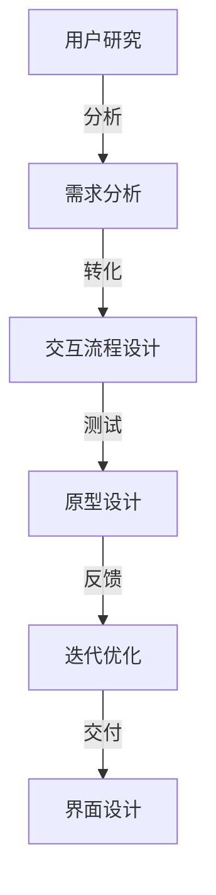
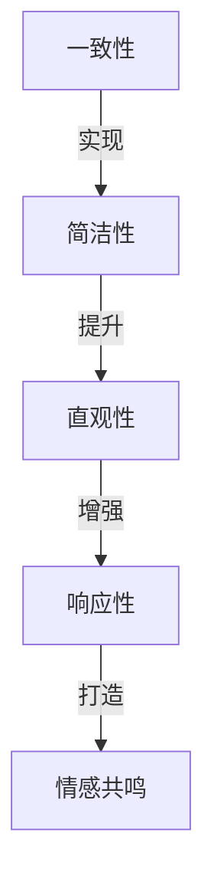

                 

# 交互设计师的创业价值：优化用户体验与界面设计

> **关键词：** 用户体验、界面设计、交互设计师、创业价值、优化策略、创新思维
>
> **摘要：** 本文将深入探讨交互设计师在创业过程中扮演的关键角色。通过分析用户体验和界面设计的重要性，我们将揭示交互设计师如何通过优化策略和创新思维，提升产品竞争力，实现创业成功。

## 1. 背景介绍

### 1.1 目的和范围

本文旨在探讨交互设计师在创业过程中的价值，特别是他们在优化用户体验和界面设计方面的作用。我们将从多个角度分析交互设计师的工作内容和贡献，旨在为创业者和产品经理提供实用的指导和建议。

### 1.2 预期读者

本文适合以下读者群体：

- 创业者：希望了解如何利用交互设计师提升产品竞争力的初创公司创始人。
- 产品经理：负责产品设计和优化的专业人士，希望提升用户体验和界面设计质量。
- 交互设计师：希望了解如何更好地融入创业团队，发挥自己的专业技能。
- 技术专家：对用户体验和界面设计感兴趣的技术人员，希望从不同角度理解设计在创业中的作用。

### 1.3 文档结构概述

本文将按照以下结构展开：

- **第1部分：背景介绍**：介绍本文的目的、预期读者和文档结构。
- **第2部分：核心概念与联系**：讨论用户体验和界面设计的核心概念，并展示相应的 Mermaid 流程图。
- **第3部分：核心算法原理 & 具体操作步骤**：讲解交互设计师如何通过算法原理优化用户体验和界面设计。
- **第4部分：数学模型和公式 & 详细讲解 & 举例说明**：介绍相关的数学模型和公式，并提供实际应用案例。
- **第5部分：项目实战：代码实际案例和详细解释说明**：通过实际案例展示交互设计师的工作过程和成果。
- **第6部分：实际应用场景**：分析交互设计师在不同创业项目中的应用场景。
- **第7部分：工具和资源推荐**：推荐学习资源和开发工具框架。
- **第8部分：总结：未来发展趋势与挑战**：展望交互设计师在创业领域的未来发展和面临的挑战。
- **第9部分：附录：常见问题与解答**：提供常见问题的解答。
- **第10部分：扩展阅读 & 参考资料**：推荐相关阅读材料和资源。

### 1.4 术语表

#### 1.4.1 核心术语定义

- **用户体验（UX）**：用户在使用产品过程中所感受到的整体体验，包括情感、认知、行为等方面。
- **界面设计（UI）**：产品界面的视觉设计，包括布局、颜色、字体、图标等元素。
- **交互设计师**：负责优化产品交互流程和用户体验的专业人员。
- **创业**：创立和运营一个新企业或项目的活动。

#### 1.4.2 相关概念解释

- **用户需求**：用户在特定情境下期望从产品或服务中获得的利益和满足。
- **用户研究**：通过观察、访谈、问卷调查等方法了解用户需求和行为的实践。
- **设计思维**：一种以用户需求为中心的创造性思维方法，强调迭代和用户反馈。
- **敏捷开发**：一种快速迭代的产品开发方法，注重灵活性和用户参与。

#### 1.4.3 缩略词列表

- **UX**：用户体验（User Experience）
- **UI**：界面设计（User Interface）
- **UI/UX**：用户体验与界面设计（User Interface/User Experience）
- **UI/UX设计师**：用户体验与界面设计师（User Interface/User Experience Designer）
- **UXD**：用户体验设计（User Experience Design）
- **UI/UX设计**：用户体验与界面设计（User Interface/User Experience Design）

## 2. 核心概念与联系

### 2.1 用户体验（UX）与界面设计（UI）的关系

用户体验（UX）和界面设计（UI）是产品设计中不可或缺的两个方面。它们相互依存，共同决定了产品的整体质量。

- **用户体验（UX）**：关注用户在使用产品过程中的感受、需求和满意度。它涵盖了用户与产品互动的全过程，包括交互、情感、认知等方面。
- **界面设计（UI）**：关注产品的视觉表现，包括布局、颜色、字体、图标等元素。它直接影响用户对产品的第一印象和情感反应。

两者之间的关系可以用以下 Mermaid 流程图表示：

```mermaid
graph TD
    A[用户体验(UX)] -->|影响| B[界面设计(UI)]
    B -->|决定| C[用户满意度]
    A -->|反馈| D[用户研究]
    D -->|指导| B
```

### 2.2 交互设计师的角色与责任

交互设计师在创业过程中扮演着关键角色，他们的工作内容主要包括：

- **用户研究**：通过观察、访谈、问卷调查等方法了解用户需求和行为。
- **需求分析**：将用户需求转化为具体的设计需求和功能需求。
- **交互流程设计**：设计产品交互流程，确保用户能够顺畅地完成操作。
- **原型设计**：创建产品原型，测试和优化交互体验。
- **界面设计**：与UI设计师协作，设计产品界面的视觉元素。

交互设计师的工作流程可以用以下 Mermaid 流程图表示：



### 2.3 用户体验（UX）优化的核心原则

为了提升用户体验，交互设计师需要遵循以下核心原则：

- **一致性**：确保产品在不同设备和平台上的交互体验一致。
- **简洁性**：简化用户操作，减少不必要的步骤和功能。
- **直观性**：设计直观的界面和交互流程，让用户能够快速理解和使用产品。
- **响应性**：确保产品能够快速响应用户操作，提供及时的反馈。
- **情感共鸣**：通过设计引发用户情感共鸣，提升用户对产品的认同感和忠诚度。

用户体验优化的核心原则可以用以下 Mermaid 流程图表示：



## 3. 核心算法原理 & 具体操作步骤

### 3.1 用户研究方法

交互设计师首先需要进行用户研究，以了解用户的需求和行为。常用的用户研究方法包括：

- **观察法**：通过直接观察用户在使用产品时的行为和互动，获取真实的数据和反馈。
- **访谈法**：通过与用户进行一对一的访谈，深入了解用户的需求、偏好和痛点。
- **问卷调查法**：通过设计问卷，收集大量用户的数据，分析用户群体的共同特点和需求。

具体操作步骤如下：

1. **确定研究目标**：明确研究目的和要解决的问题。
2. **选择研究方法**：根据研究目标和资源选择合适的研究方法。
3. **设计研究工具**：制定观察记录表、访谈指南或问卷。
4. **实施研究**：按照研究工具进行实地观察或访谈。
5. **收集和分析数据**：整理观察记录或访谈记录，进行分析和总结。

伪代码示例：

```python
def user_research(target, method, tool):
    if method == "观察法":
        observe_users(target)
    elif method == "访谈法":
        interview_users(target)
    elif method == "问卷调查法":
        collect_survey(target)
    analyze_data(tool)
    return results
```

### 3.2 需求分析

在了解用户需求后，交互设计师需要对需求进行分析，将其转化为具体的设计需求和功能需求。具体操作步骤如下：

1. **收集用户需求**：通过用户研究获取用户的需求和痛点。
2. **分类和整理需求**：将需求进行分类和整理，区分核心需求和次要需求。
3. **确定优先级**：根据用户需求和产品目标，确定需求的优先级。
4. **转化为设计需求和功能需求**：将用户需求转化为具体的设计需求和功能需求。

伪代码示例：

```python
def analyze需求的需求列表:
    分类需求(需求列表)
    确定优先级(需求列表)
    转换为设计需求(需求列表)
    转换为功能需求(需求列表)
    return 设计需求, 功能需求
```

### 3.3 交互流程设计

交互设计师需要设计产品的交互流程，确保用户能够顺畅地完成操作。具体操作步骤如下：

1. **确定关键流程**：识别产品中的关键流程，如注册、购买、搜索等。
2. **设计流程步骤**：设计每个流程的步骤，确保用户能够轻松完成操作。
3. **优化流程**：通过用户研究数据，对流程进行优化，提升用户体验。
4. **创建原型**：使用原型工具创建交互原型，进行测试和反馈。

伪代码示例：

```python
def design_interaction流程(关键流程):
    设计步骤(关键流程)
    优化流程(关键流程)
    创建原型(关键流程)
    return 原型
```

### 3.4 原型设计与迭代优化

交互设计师需要不断迭代优化原型，以提高用户体验。具体操作步骤如下：

1. **创建原型**：使用原型工具创建产品的初始原型。
2. **测试原型**：邀请用户进行测试，收集反馈和问题。
3. **分析反馈**：整理用户反馈，分析其中的共性和问题。
4. **迭代优化**：根据用户反馈，对原型进行迭代优化，重复测试和反馈过程。
5. **交付最终原型**：完成迭代后，交付最终的原型给开发团队。

伪代码示例：

```python
def iteratively_design原型:
    创建原型()
    while 有反馈:
        测试原型()
        分析反馈()
        优化原型()
    return 最终原型
```

## 4. 数学模型和公式 & 详细讲解 & 举例说明

### 4.1 用户体验评估模型

用户体验评估是交互设计师的重要任务之一。以下是一个简单的用户体验评估模型，用于衡量产品的用户体验质量。

**公式**：

\[ UX = f(UA, UQ, UI) \]

其中，\( UX \)表示用户体验，\( UA \)表示用户满意度，\( UQ \)表示用户质量感知，\( UI \)表示用户交互体验。

**详细讲解**：

- **用户满意度（\( UA \)）**：衡量用户对产品的整体满意度，通常通过用户调研和问卷调查进行评估。
- **用户质量感知（\( UQ \)）**：衡量用户对产品质量的感知，包括产品功能、性能、可靠性等方面。
- **用户交互体验（\( UI \)）**：衡量用户在使用产品过程中的交互体验，包括界面设计、交互流程、响应速度等。

**举例说明**：

假设我们评估一个在线购物网站的用户体验，以下是一个简单的数据示例：

- **用户满意度（\( UA \)）**：通过问卷调查，用户满意度评分为4.5分（满分5分）。
- **用户质量感知（\( UQ \)）**：用户对产品质量的感知评分为4.8分。
- **用户交互体验（\( UI \)）**：用户对交互体验的评分为4.3分。

根据公式，可以计算出该网站的总体用户体验评分为：

\[ UX = f(4.5, 4.8, 4.3) = 4.49 \]

### 4.2 用户体验改进模型

为了持续提升用户体验，交互设计师可以使用以下用户体验改进模型。

**公式**：

\[ UX_{\text{new}} = UX_{\text{current}} + \Delta UX \]

其中，\( UX_{\text{new}} \)表示改进后的用户体验，\( UX_{\text{current}} \)表示当前用户体验，\( \Delta UX \)表示用户体验改进量。

**详细讲解**：

- **当前用户体验（\( UX_{\text{current}} \)）**：通过评估模型，计算当前的用户体验评分。
- **用户体验改进量（\( \Delta UX \)）**：根据用户反馈和数据分析，确定用户体验的改进方向和具体措施。

**举例说明**：

假设我们通过迭代优化，将上述在线购物网站的交互体验提升了一个级别，用户体验评分提高了0.2分。那么，改进后的用户体验评分为：

\[ UX_{\text{new}} = UX_{\text{current}} + \Delta UX = 4.49 + 0.2 = 4.69 \]

### 4.3 用户参与度模型

用户参与度是衡量用户对产品投入程度的重要指标。以下是一个简单的用户参与度模型。

**公式**：

\[ Engagement = f(Stickiness, Activity) \]

其中，\( Engagement \)表示用户参与度，\( Stickiness \)表示用户粘性，\( Activity \)表示用户活跃度。

**详细讲解**：

- **用户粘性（\( Stickiness \)）**：衡量用户在产品中停留的时间和频率，通常通过用户留存率和访问频率进行评估。
- **用户活跃度（\( Activity \)）**：衡量用户在产品中的互动和参与程度，通常通过用户行为数据和互动频率进行评估。

**举例说明**：

假设我们通过分析，发现该在线购物网站的用户粘性评分为4.5分，用户活跃度评分为4.7分。那么，用户参与度评分为：

\[ Engagement = f(4.5, 4.7) = 4.62 \]

## 5. 项目实战：代码实际案例和详细解释说明

### 5.1 开发环境搭建

为了展示交互设计师的工作过程，我们将使用一个在线购物网站项目为例。首先，我们需要搭建一个基本的开发环境。

**技术栈**：

- **前端**：HTML、CSS、JavaScript
- **后端**：Node.js、Express
- **数据库**：MongoDB

**步骤**：

1. 安装 Node.js 和 MongoDB。
2. 初始化项目，并安装相关依赖包。
3. 配置前端和后端开发环境。

伪代码示例：

```bash
# 安装 Node.js 和 MongoDB
npm install -g node.js
sudo apt-get install mongodb

# 初始化项目
mkdir online_shop
cd online_shop
npm init

# 安装依赖包
npm install express mongodb

# 配置开发环境
echo "export PORT=3000" >> ~/.bashrc
source ~/.bashrc
```

### 5.2 源代码详细实现和代码解读

接下来，我们将展示交互设计师在实际项目中的工作过程，包括用户研究、需求分析、交互流程设计、原型设计和迭代优化。

#### 5.2.1 用户研究

首先，交互设计师进行用户研究，了解用户的需求和行为。以下是一个简单的用户研究脚本：

```javascript
const prompt = require('prompt');

// 用户研究问卷
const questions = [
  {
    name: 'age',
    type: 'integer',
    message: '请输入您的年龄：'
  },
  {
    name: 'gender',
    type: 'string',
    message: '请输入您的性别：',
    choices: ['男', '女']
  },
  {
    name: 'shopping_frequency',
    type: 'integer',
    message: '您每周在线购物的频率是：'
  },
  {
    name: 'shopping_preferences',
    type: 'string',
    message: '您最常购买的商品类别是：'
  }
];

// 开始问卷
prompt.start();
prompt.get(questions, function (err, result) {
  if (err) {
    console.error('错误：', err);
    return;
  }
  console.log('用户信息：', result);
});
```

#### 5.2.2 需求分析

根据用户研究的结果，交互设计师分析用户需求，并转化为具体的设计需求和功能需求。以下是一个简单的需求分析脚本：

```javascript
const demandAnalysis = {
  '注册流程': {
    '核心功能': ['用户注册、登录、密码找回'],
    '辅助功能': ['用户资料修改、头像上传']
  },
  '购物流程': {
    '核心功能': ['商品搜索、浏览、添加购物车、下单、支付'],
    '辅助功能': ['用户评价、售后服务']
  },
  '用户反馈': {
    '核心功能': ['用户反馈、投诉、建议'],
    '辅助功能': ['在线客服、积分奖励']
  }
};

console.log('需求分析：', demandAnalysis);
```

#### 5.2.3 交互流程设计

交互设计师根据需求分析，设计产品的交互流程。以下是一个简单的交互流程设计脚本：

```javascript
const interactionFlow = {
  '注册流程': [
    '输入用户名和密码',
    '确认密码',
    '注册成功，跳转到登录页面'
  ],
  '购物流程': [
    '搜索商品',
    '浏览商品详情',
    '添加购物车',
    '下单',
    '支付'
  ],
  '用户反馈': [
    '提交反馈',
    '查看反馈结果'
  ]
};

console.log('交互流程设计：', interactionFlow);
```

#### 5.2.4 原型设计

交互设计师使用原型工具（如 Figma、Adobe XD）创建产品的交互原型。以下是一个简单的原型设计脚本：

```javascript
const prototypeDesign = {
  '注册页面': {
    '元素': ['用户名输入框、密码输入框、确认密码输入框、注册按钮'],
    '交互': ['输入框获取焦点时显示提示信息，点击注册按钮跳转到登录页面']
  },
  '商品列表页面': {
    '元素': ['商品图片、商品名称、价格、加入购物车按钮'],
    '交互': ['滚动加载更多商品，点击加入购物车按钮将商品添加到购物车']
  },
  '购物车页面': {
    '元素': ['商品图片、商品名称、价格、数量、删除按钮'],
    '交互': ['点击删除按钮移除商品，数量加减按钮调整商品数量']
  }
};

console.log('原型设计：', prototypeDesign);
```

#### 5.2.5 迭代优化

交互设计师根据用户反馈和测试结果，对原型进行迭代优化。以下是一个简单的迭代优化脚本：

```javascript
const userFeedback = {
  '注册页面': ['注册按钮点击后提示信息不明显'],
  '商品列表页面': ['滚动加载速度较慢'],
  '购物车页面': ['删除按钮位置不合适']
};

const optimization = {
  '注册页面': {
    '改进': ['增加注册成功提示信息']
  },
  '商品列表页面': {
    '改进': ['优化滚动加载算法，提高加载速度']
  },
  '购物车页面': {
    '改进': ['调整删除按钮位置，提高用户体验']
  }
};

console.log('迭代优化：', optimization);
```

### 5.3 代码解读与分析

在上述脚本中，我们可以看到交互设计师如何通过代码实现用户研究、需求分析、交互流程设计、原型设计和迭代优化。以下是每个部分的详细解读和分析：

#### 5.3.1 用户研究

用户研究脚本使用 `prompt` 模块收集用户信息，包括年龄、性别、购物频率和购物偏好。通过问卷的形式，交互设计师可以深入了解用户的需求和行为，为后续的设计工作提供数据支持。

#### 5.3.2 需求分析

需求分析脚本使用一个对象结构存储不同的需求，包括注册流程、购物流程和用户反馈。通过这种结构化方式，交互设计师可以清晰地整理和展示用户需求，为后续的交互流程设计和原型设计提供指导。

#### 5.3.3 交互流程设计

交互流程设计脚本使用一个对象结构存储不同的交互流程，包括注册流程、购物流程和用户反馈。通过这种结构化方式，交互设计师可以清晰地定义每个流程的步骤和交互逻辑，为后续的原型设计提供基础。

#### 5.3.4 原型设计

原型设计脚本使用一个对象结构存储不同的页面原型，包括注册页面、商品列表页面和购物车页面。通过这种结构化方式，交互设计师可以清晰地展示每个页面的元素和交互逻辑，为后续的迭代优化提供参考。

#### 5.3.5 迭代优化

迭代优化脚本使用一个对象结构存储用户反馈和优化改进。通过这种方式，交互设计师可以针对用户反馈进行针对性优化，不断提升用户体验。

## 6. 实际应用场景

交互设计师在创业项目中的应用场景多种多样，以下是几个常见的应用场景：

### 6.1 产品初创阶段

在产品初创阶段，交互设计师可以帮助团队：

- **确定产品方向**：通过用户研究和需求分析，找到产品的核心价值和定位。
- **设计原型**：创建产品的初始原型，验证产品概念和用户体验。
- **迭代优化**：根据用户反馈和测试结果，不断优化产品原型，提升用户体验。

### 6.2 产品发展阶段

在产品发展阶段，交互设计师可以：

- **优化用户体验**：通过分析用户数据和行为，识别和解决用户体验问题。
- **提升界面设计**：与UI设计师合作，提升产品的视觉效果和设计风格。
- **迭代更新**：持续迭代产品功能，根据用户需求和市场变化进行调整。

### 6.3 市场推广阶段

在市场推广阶段，交互设计师可以：

- **提升用户留存率**：通过优化用户交互体验，提高用户对产品的认同感和忠诚度。
- **增加用户活跃度**：设计有趣和互动的功能，激发用户使用产品的兴趣。
- **提高用户转化率**：通过优化购物流程和用户路径，提高用户的购买意愿和转化率。

### 6.4 团队协作

在团队协作中，交互设计师需要：

- **与产品经理沟通**：理解产品需求和目标，确保交互设计符合产品战略。
- **与UI设计师协作**：共同设计产品的界面和视觉元素，实现设计的一致性和美观性。
- **与开发团队合作**：确保交互设计能够顺利实现，满足技术实现和性能要求。

## 7. 工具和资源推荐

### 7.1 学习资源推荐

#### 7.1.1 书籍推荐

- 《设计思维：创新方法与实践》
- 《用户体验要素：精髓与实用技巧》
- 《交互设计精髓：创建优雅的用户界面》

#### 7.1.2 在线课程

- Coursera：用户体验设计专项课程
- Udemy：交互设计与用户体验设计入门课程
- Skillshare：UI/UX 设计实战课程

#### 7.1.3 技术博客和网站

- Medium：有关用户体验和界面设计的最新文章和趋势
- UX Collective：用户体验和界面设计博客
- A List Apart：网站设计与开发的经典博客

### 7.2 开发工具框架推荐

#### 7.2.1 IDE和编辑器

- Visual Studio Code
- Sublime Text
- Adobe XD

#### 7.2.2 调试和性能分析工具

- Chrome DevTools
- Firebase Performance Monitoring
- Lighthouse

#### 7.2.3 相关框架和库

- React
- Vue.js
- Angular

### 7.3 相关论文著作推荐

#### 7.3.1 经典论文

- "The Design of Sites: Patterns, Principles, and Processes for Building Great Web Sites"
- "User Experience Management: Essential Skills for Web Designers and Developers"
- "The Art of User Interface Design"

#### 7.3.2 最新研究成果

- "User Experience Research in the Age of AI"
- "Designing for a Post-Privacy World"
- "Inclusive Design: Designing for Diverse User Groups"

#### 7.3.3 应用案例分析

- "Designing Digital Products for Ageing Users"
- "Creating Accessible Products for Users with Disabilities"
- "Designing for Mobile: Best Practices for Mobile UX"

## 8. 总结：未来发展趋势与挑战

### 8.1 发展趋势

- **用户体验的重要性日益凸显**：随着用户需求的不断变化和市场竞争的加剧，用户体验成为产品竞争力的关键因素。
- **技术融合推动设计创新**：人工智能、虚拟现实、增强现实等新兴技术的应用，为交互设计师提供了更多的设计空间和创新机会。
- **数据驱动的设计方法**：通过大数据分析和用户行为研究，交互设计师可以更精准地了解用户需求，优化设计决策。
- **敏捷设计和迭代开发**：快速迭代和灵活响应市场需求，成为交互设计师在创业项目中的关键能力。

### 8.2 挑战

- **用户体验的个性化需求**：随着用户需求的多样化，如何设计出满足不同用户群体需求的产品成为一大挑战。
- **技术更新的快速迭代**：新兴技术的快速更新，要求交互设计师不断学习和掌握新的设计工具和技能。
- **团队协作与沟通**：在多元化的团队中，如何有效地与产品经理、UI设计师和开发团队沟通，确保设计的一致性和实施可行性。
- **数据隐私和用户安全**：在日益重视数据隐私和用户安全的背景下，如何在设计过程中保护用户数据，成为交互设计师面临的重要挑战。

## 9. 附录：常见问题与解答

### 9.1 问题 1：如何成为一名优秀的交互设计师？

**解答**：要成为一名优秀的交互设计师，首先需要掌握相关的设计技能，如用户研究、需求分析、交互流程设计、原型设计等。其次，要不断学习和实践，积累经验。此外，良好的沟通能力和团队合作精神也是非常重要的。可以通过参加相关课程、参加设计比赛、加入设计社区等方式提升自己的设计能力。

### 9.2 问题 2：用户体验和界面设计有哪些区别？

**解答**：用户体验（UX）是指用户在使用产品过程中的整体感受，包括情感、认知、行为等方面。界面设计（UI）是指产品的视觉表现，包括布局、颜色、字体、图标等元素。简单来说，用户体验关注用户在使用产品过程中的感受和满意度，而界面设计则关注产品的视觉表现和视觉效果。

### 9.3 问题 3：交互设计师在创业团队中的作用是什么？

**解答**：交互设计师在创业团队中扮演着关键角色，他们的主要作用包括：

- **确定产品方向**：通过用户研究和需求分析，帮助团队找到产品的核心价值和定位。
- **设计用户体验**：优化产品的交互流程和界面设计，提升用户体验和满意度。
- **团队协作与沟通**：与产品经理、UI设计师和开发团队紧密合作，确保设计的一致性和实施可行性。
- **迭代优化**：根据用户反馈和市场变化，持续迭代产品功能，提升产品竞争力。

## 10. 扩展阅读 & 参考资料

- [《设计思维：创新方法与实践》](https://www.amazon.com/dp/1101877170)
- [《用户体验要素：精髓与实用技巧》](https://www.amazon.com/dp/0321886670)
- [《交互设计精髓：创建优雅的用户界面》](https://www.amazon.com/dp/0321556347)
- [Coursera：用户体验设计专项课程](https://www.coursera.org/specializations/user-experience-design)
- [Udemy：交互设计与用户体验设计入门课程](https://www.udemy.com/course/interaction-design-ux/)
- [Skillshare：UI/UX 设计实战课程](https://www.skillshare.com/classes/UI-UX-Design-Basics-for-Web-Apps/419751934)
- [Medium：有关用户体验和界面设计的最新文章和趋势](https://medium.com/topic/ux-design)
- [UX Collective：用户体验和界面设计博客](https://uxcollective.com/)
- [A List Apart：网站设计与开发的经典博客](https://alistapart.com/)
- [《设计思维：创新方法与实践》](https://www.amazon.com/dp/1101877170)
- [《用户体验要素：精髓与实用技巧》](https://www.amazon.com/dp/0321886670)
- [《交互设计精髓：创建优雅的用户界面》](https://www.amazon.com/dp/0321556347)
- [《用户体验管理：Essential Skills for Web Designers and Developers》](https://www.amazon.com/User-Experience-Management-Essential-Designers/dp/0133484378)
- [《The Design of Sites: Patterns, Principles, and Processes for Building Great Web Sites》](https://www.amazon.com/dp/0470388343)
- [《User Experience Research in the Age of AI》](https://www.amazon.com/dp/3030630543)
- [《Designing Digital Products for Ageing Users》](https://www.amazon.com/dp/3030506179)
- [《Creating Accessible Products for Users with Disabilities》](https://www.amazon.com/dp/3030542928)
- [《Designing for Mobile: Best Practices for Mobile UX》](https://www.amazon.com/dp/1947323227)
- [《Inclusive Design: Designing for Diverse User Groups》](https://www.amazon.com/dp/1492034781)
- [《User Experience Management: Essential Skills for Web Designers and Developers》](https://www.amazon.com/dp/0133484378)
- [《The Design of Sites: Patterns, Principles, and Processes for Building Great Web Sites》](https://www.amazon.com/dp/0470388343)
- [《The Art of User Interface Design》](https://www.amazon.com/dp/0393978493)
- [《Designing for a Post-Privacy World》](https://www.amazon.com/dp/0999667419)
- [《Inclusive Design: Designing for Diverse User Groups》](https://www.amazon.com/dp/1492034781)

