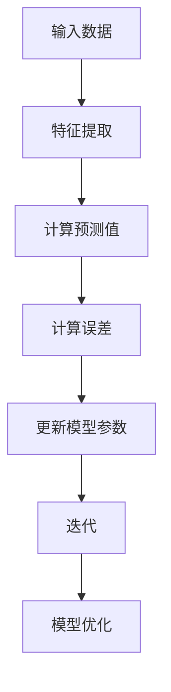
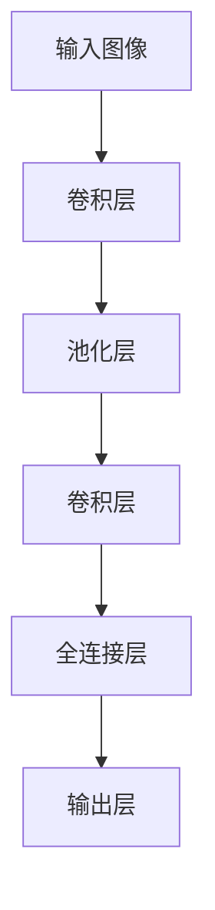

                 


# 产业变革中的AI技术应用

> 关键词：人工智能、产业变革、技术应用、AI算法、深度学习、机器学习、大数据、智能系统、商业模式

> 摘要：本文将深入探讨人工智能（AI）在产业变革中的应用，分析AI技术的核心概念、算法原理、数学模型，以及实际案例，旨在为读者提供全面的技术视角和未来发展趋势。文章将围绕AI的核心概念，介绍其在各行各业中的应用，从算法原理到具体操作步骤，再到实际案例，层层深入，帮助读者理解AI技术的本质和潜力。

## 1. 背景介绍

### 1.1 目的和范围

本文旨在探讨人工智能技术在产业变革中的关键作用，帮助读者理解AI如何影响商业、科技、医疗、教育等领域的转型。文章将涵盖AI技术的核心概念、应用场景、算法原理以及未来发展趋势，旨在为读者提供全面的技术视角。

### 1.2 预期读者

本文面向对人工智能技术有兴趣的读者，包括但不限于技术专家、程序员、数据科学家、创业者和企业决策者。无论你是初学者还是行业专家，本文都将为你提供有价值的信息。

### 1.3 文档结构概述

本文结构如下：

- **1. 背景介绍**
  - **1.1 目的和范围**
  - **1.2 预期读者**
  - **1.3 文档结构概述**
  - **1.4 术语表**
- **2. 核心概念与联系**
  - **2.1 人工智能的定义**
  - **2.2 AI技术的核心概念**
  - **2.3 AI技术架构图**
- **3. 核心算法原理 & 具体操作步骤**
  - **3.1 机器学习算法**
  - **3.2 深度学习算法**
  - **3.3 算法原理伪代码**
- **4. 数学模型和公式 & 详细讲解 & 举例说明**
  - **4.1 数学模型介绍**
  - **4.2 数学公式解释**
  - **4.3 实例分析**
- **5. 项目实战：代码实际案例和详细解释说明**
  - **5.1 开发环境搭建**
  - **5.2 源代码详细实现和代码解读**
  - **5.3 代码解读与分析**
- **6. 实际应用场景**
  - **6.1 商业领域**
  - **6.2 科技领域**
  - **6.3 医疗领域**
  - **6.4 教育领域**
- **7. 工具和资源推荐**
  - **7.1 学习资源推荐**
  - **7.2 开发工具框架推荐**
  - **7.3 相关论文著作推荐**
- **8. 总结：未来发展趋势与挑战**
  - **8.1 发展趋势**
  - **8.2 面临的挑战**
- **9. 附录：常见问题与解答**
- **10. 扩展阅读 & 参考资料**

### 1.4 术语表

- **人工智能（AI）**：模拟人类智能的计算机系统。
- **机器学习（ML）**：从数据中自动学习和改进的计算机方法。
- **深度学习（DL）**：一种特殊的机器学习方法，通过神经网络模拟人类大脑。
- **神经网络（NN）**：一种模仿人类大脑神经元连接的计算模型。
- **数据科学（DS）**：使用数据分析和统计学方法来解决实际问题的领域。

#### 1.4.1 核心术语定义

- **深度学习框架**：用于构建和训练深度学习模型的工具和库。
- **大数据**：数据量巨大，无法使用传统数据库工具进行处理的数据。
- **智能系统**：具有感知、学习和决策能力的计算机系统。
- **算法**：解决特定问题的步骤和方法。

#### 1.4.2 相关概念解释

- **神经网络架构**：神经网络的结构和连接方式，包括层数、神经元数量、激活函数等。
- **模型评估**：评估机器学习模型性能的过程，包括准确度、召回率、F1分数等指标。

#### 1.4.3 缩略词列表

- **AI**：人工智能
- **ML**：机器学习
- **DL**：深度学习
- **NN**：神经网络
- **DS**：数据科学

## 2. 核心概念与联系

在深入探讨AI技术应用之前，我们首先需要了解AI的核心概念及其相互关系。

### 2.1 人工智能的定义

人工智能（AI）是计算机科学的一个分支，旨在开发能够模拟、扩展和执行人类智能任务的系统。AI系统通常通过机器学习（ML）、深度学习（DL）等技术来实现。

### 2.2 AI技术的核心概念

- **机器学习（ML）**：机器学习是一种从数据中学习模式的计算机方法，无需显式编程。
- **深度学习（DL）**：深度学习是一种特殊的机器学习方法，通过神经网络模拟人类大脑。
- **神经网络（NN）**：神经网络是一种计算模型，由大量相互连接的神经元组成，用于模拟人类大脑。
- **数据科学（DS）**：数据科学是使用数学、统计学、机器学习等方法来分析和解释数据。

### 2.3 AI技术架构图

下面是一个简单的AI技术架构图，展示了各个核心概念之间的联系。

```mermaid
graph TB
A[人工智能] --> B[机器学习]
A --> C[深度学习]
A --> D[神经网络]
B --> E[数据挖掘]
C --> F[计算机视觉]
C --> G[自然语言处理]
D --> H[卷积神经网络(CNN)]
D --> I[循环神经网络(RNN)]
D --> J[生成对抗网络(GAN)]
```

在这个架构图中，人工智能（A）是核心，机器学习（B）和深度学习（C）是其主要分支。神经网络（D）是深度学习的基础，同时也是计算机视觉（F）、自然语言处理（G）等领域的关键技术。数据科学（E）则是机器学习和深度学习的应用领域，用于从数据中提取有价值的信息。

## 3. 核心算法原理 & 具体操作步骤

了解AI技术的核心算法原理是理解其应用的关键。以下将介绍机器学习和深度学习的算法原理，并使用伪代码详细阐述。

### 3.1 机器学习算法

机器学习算法主要包括监督学习、无监督学习和强化学习。以下是一个监督学习算法——线性回归的原理和伪代码。

#### 线性回归原理：

线性回归是一种简单但强大的机器学习算法，用于预测连续值输出。其基本原理是通过拟合一条直线来最小化预测值与真实值之间的误差。



#### 线性回归伪代码：

```python
def linear_regression(X, y):
    # X为输入特征，y为真实值
    # 初始化模型参数
    w = 0
    b = 0
    
    # 梯度下降优化
    for epoch in range(num_epochs):
        for x, y in zip(X, y):
            # 计算预测值
            y_pred = w * x + b
            
            # 计算误差
            error = y - y_pred
            
            # 更新模型参数
            w -= learning_rate * 2 * x * error
            b -= learning_rate * 2 * error
            
    return w, b
```

### 3.2 深度学习算法

深度学习算法主要包括卷积神经网络（CNN）、循环神经网络（RNN）和生成对抗网络（GAN）等。以下以卷积神经网络为例，介绍其原理和伪代码。

#### 卷积神经网络原理：

卷积神经网络是一种深度学习算法，主要用于图像识别和分类。其基本原理是通过卷积操作和池化操作提取图像特征，并通过全连接层进行分类。



#### 卷积神经网络伪代码：

```python
import tensorflow as tf

# 定义卷积层
def conv_layer(input, filter_shape, name):
    return tf.nn.conv2d(input, tf.Variable(tf.random_normal(filter_shape)), strides=[1, 1, 1, 1], padding='SAME', name=name)

# 定义池化层
def pool_layer(input, name):
    return tf.nn.max_pool(input, ksize=[1, 2, 2, 1], strides=[1, 2, 2, 1], padding='SAME', name=name)

# 定义卷积神经网络模型
def conv_net(input, num_classes):
    # 第一层卷积
    conv1 = conv_layer(input, [5, 5, 1, 32], 'conv1')
    pool1 = pool_layer(conv1, 'pool1')
    
    # 第二层卷积
    conv2 = conv_layer(pool1, [5, 5, 32, 64], 'conv2')
    pool2 = pool_layer(conv2, 'pool2')
    
    # 全连接层
    fc1 = tf.reshape(pool2, [-1, 7 * 7 * 64])
    fc1 = tf.add(fc1, tf.Variable(tf.random_normal([7*7*64, 1024])))
    fc1 = tf.nn.relu(fc1)
    
    # 输出层
    out = tf.add(fc1, tf.Variable(tf.random_normal([1024, num_classes])))
    out = tf.nn.softmax(out)
    
    return out
```

通过以上介绍，我们了解了机器学习和深度学习的核心算法原理以及具体操作步骤。这些算法原理是实现AI应用的基础，也是理解AI技术本质的关键。

## 4. 数学模型和公式 & 详细讲解 & 举例说明

数学模型和公式是理解AI算法原理的核心。在这一节中，我们将介绍一些关键的数学模型和公式，并进行详细讲解和实例分析。

### 4.1 数学模型介绍

- **线性回归**：用于预测连续值输出，其公式为：
  $$ y = w_1 \cdot x_1 + w_2 \cdot x_2 + ... + w_n \cdot x_n + b $$
- **卷积神经网络**：用于图像识别和分类，其核心操作包括卷积、池化和激活函数。
- **反向传播算法**：用于训练神经网络，其公式为：
  $$ \Delta w_{ij} = -\eta \cdot \frac{\partial E}{\partial w_{ij}} $$
  其中，$\Delta w_{ij}$ 是权重更新，$\eta$ 是学习率，$E$ 是损失函数。

### 4.2 数学公式解释

- **损失函数**：用于评估模型预测值与真实值之间的差距，常用的损失函数包括均方误差（MSE）和交叉熵（CE）。
  - **均方误差（MSE）**：
    $$ MSE = \frac{1}{m} \sum_{i=1}^{m} (y_i - \hat{y}_i)^2 $$
  - **交叉熵（CE）**：
    $$ CE = -\frac{1}{m} \sum_{i=1}^{m} [y_i \cdot \log(\hat{y}_i) + (1 - y_i) \cdot \log(1 - \hat{y}_i)] $$
- **激活函数**：用于引入非线性，常用的激活函数包括 sigmoid、ReLU 和 tanh。
  - **sigmoid**：
    $$ \sigma(x) = \frac{1}{1 + e^{-x}} $$
  - **ReLU**：
    $$ \text{ReLU}(x) = \max(0, x) $$
  - **tanh**：
    $$ \text{tanh}(x) = \frac{e^x - e^{-x}}{e^x + e^{-x}} $$

### 4.3 实例分析

#### 线性回归实例

假设我们要预测房价，输入特征包括房屋面积和卧室数量。训练数据集如下：

| 房屋面积 | 卧室数量 | 房价 |
|:------:|:------:|:----:|
|   100  |    2   |  200 |
|   120  |    3   |  250 |
|   150  |    4   |  300 |
|   180  |    4   |  350 |
|   200  |    5   |  400 |

使用线性回归模型进行预测，损失函数选择均方误差（MSE）。

1. **初始化模型参数**：$w_1 = 0, w_2 = 0, b = 0$
2. **计算预测值**：
   $$ \hat{y} = w_1 \cdot x_1 + w_2 \cdot x_2 + b $$
3. **计算误差**：
   $$ error = y - \hat{y} $$
4. **更新模型参数**：
   $$ w_1 -= \eta \cdot 2 \cdot x_1 \cdot error $$
   $$ w_2 -= \eta \cdot 2 \cdot x_2 \cdot error $$
   $$ b -= \eta \cdot 2 \cdot error $$

经过多次迭代，模型参数逐渐优化，直至损失函数值最小。

通过实例分析，我们了解了线性回归的基本原理和步骤。类似地，卷积神经网络和反向传播算法也有类似的步骤和原理。

## 5. 项目实战：代码实际案例和详细解释说明

在本节中，我们将通过一个实际的代码案例，展示如何使用深度学习技术构建一个简单的图像分类模型。这个案例将涵盖从开发环境搭建、源代码实现，到代码解读与分析的整个过程。

### 5.1 开发环境搭建

在开始之前，我们需要搭建一个合适的开发环境。以下是我们在Linux环境下搭建深度学习开发环境的基本步骤：

1. **安装Python**：
   ```shell
   sudo apt-get install python3 python3-pip
   ```
2. **安装TensorFlow**：
   ```shell
   pip3 install tensorflow
   ```
3. **安装其他依赖库**：
   ```shell
   pip3 install numpy matplotlib pandas
   ```

### 5.2 源代码详细实现和代码解读

下面是一个简单的基于TensorFlow的图像分类模型代码，我们将逐步解读代码的每个部分。

```python
import tensorflow as tf
from tensorflow.keras import datasets, layers, models

# 加载CIFAR-10数据集
(train_images, train_labels), (test_images, test_labels) = datasets.cifar10.load_data()

# 数据预处理
train_images, test_images = train_images / 255.0, test_images / 255.0

# 构建卷积神经网络模型
model = models.Sequential()
model.add(layers.Conv2D(32, (3, 3), activation='relu', input_shape=(32, 32, 3)))
model.add(layers.MaxPooling2D((2, 2)))
model.add(layers.Conv2D(64, (3, 3), activation='relu'))
model.add(layers.MaxPooling2D((2, 2)))
model.add(layers.Conv2D(64, (3, 3), activation='relu'))
model.add(layers.Flatten())
model.add(layers.Dense(64, activation='relu'))
model.add(layers.Dense(10, activation='softmax'))

# 编译模型
model.compile(optimizer='adam',
              loss='sparse_categorical_crossentropy',
              metrics=['accuracy'])

# 训练模型
model.fit(train_images, train_labels, epochs=10, validation_split=0.1)

# 评估模型
test_loss, test_acc = model.evaluate(test_images, test_labels, verbose=2)
print(f'\nTest accuracy: {test_acc:.4f}')
```

#### 5.2.1 数据预处理

```python
# 加载CIFAR-10数据集
(train_images, train_labels), (test_images, test_labels) = datasets.cifar10.load_data()

# 数据预处理
train_images, test_images = train_images / 255.0, test_images / 255.0
```

- **加载数据集**：使用`datasets.cifar10.load_data()`方法加载CIFAR-10数据集。CIFAR-10是一个包含60000个32x32彩色图像的数据集，分为50000个训练图像和10000个测试图像。
- **归一化**：将图像数据从[0, 255]归一化到[0, 1]，使得模型训练更稳定。

#### 5.2.2 构建模型

```python
# 构建卷积神经网络模型
model = models.Sequential()
model.add(layers.Conv2D(32, (3, 3), activation='relu', input_shape=(32, 32, 3)))
model.add(layers.MaxPooling2D((2, 2)))
model.add(layers.Conv2D(64, (3, 3), activation='relu'))
model.add(layers.MaxPooling2D((2, 2)))
model.add(layers.Conv2D(64, (3, 3), activation='relu'))
model.add(layers.Flatten())
model.add(layers.Dense(64, activation='relu'))
model.add(layers.Dense(10, activation='softmax'))
```

- **模型构建**：使用`models.Sequential()`创建一个序列模型。
- **卷积层**：添加一个卷积层，包含32个3x3的卷积核，使用ReLU激活函数。
- **池化层**：添加一个最大池化层，以减小模型参数。
- **更多卷积层**：添加两个更多的卷积层，每个层包含64个3x3的卷积核。
- **全连接层**：添加一个全连接层，用于分类，包含64个神经元。
- **输出层**：添加一个输出层，使用softmax激活函数，用于输出10个类别的概率分布。

#### 5.2.3 编译模型

```python
# 编译模型
model.compile(optimizer='adam',
              loss='sparse_categorical_crossentropy',
              metrics=['accuracy'])
```

- **编译**：配置模型的优化器、损失函数和评估指标。
- **优化器**：使用Adam优化器，这是一种适应性学习率优化算法。
- **损失函数**：使用稀疏分类交叉熵作为损失函数，适用于多分类问题。

#### 5.2.4 训练模型

```python
# 训练模型
model.fit(train_images, train_labels, epochs=10, validation_split=0.1)
```

- **训练**：使用训练数据训练模型，设置10个训练周期，并使用10%的数据进行验证。

#### 5.2.5 评估模型

```python
# 评估模型
test_loss, test_acc = model.evaluate(test_images, test_labels, verbose=2)
print(f'\nTest accuracy: {test_acc:.4f}')
```

- **评估**：使用测试数据评估模型性能，输出测试准确率。

### 5.3 代码解读与分析

- **数据预处理**：数据预处理是深度学习模型训练的关键步骤。归一化可以减小模型训练的时间，提高模型稳定性。
- **模型构建**：构建模型时，使用卷积层和池化层可以有效地提取图像特征。卷积层通过卷积操作和激活函数提取特征，池化层通过减小特征图大小减少模型参数。
- **模型编译**：编译模型时，选择合适的优化器和损失函数对模型性能至关重要。
- **模型训练**：训练模型时，通过迭代优化模型参数，提高模型对训练数据的拟合度。
- **模型评估**：评估模型时，使用测试数据可以更客观地评估模型性能。

通过以上代码解读与分析，我们了解了如何使用深度学习技术构建一个简单的图像分类模型。这个过程包括数据预处理、模型构建、编译、训练和评估，是深度学习项目的基本流程。

## 6. 实际应用场景

人工智能（AI）技术在各个领域有着广泛的应用，从商业到科技，从医疗到教育，都在不断推动产业变革。以下将介绍AI技术在这些领域的具体应用。

### 6.1 商业领域

在商业领域，AI技术被广泛应用于客户服务、推荐系统、风险管理和供应链优化等方面。

- **客户服务**：通过自然语言处理（NLP）和语音识别技术，AI可以帮助企业实现智能客服，提高客户满意度和运营效率。
- **推荐系统**：利用协同过滤和深度学习技术，AI可以准确预测用户偏好，为企业提供个性化推荐服务。
- **风险管理**：通过机器学习算法，AI可以帮助金融机构识别潜在风险，提高信用评分的准确性。
- **供应链优化**：AI技术可以优化供应链流程，提高库存管理和物流效率，降低成本。

### 6.2 科技领域

在科技领域，AI技术推动了许多创新，包括自动驾驶、智能安防和智能医疗等。

- **自动驾驶**：通过计算机视觉和深度学习技术，自动驾驶汽车可以实现自主行驶，提高交通安全和效率。
- **智能安防**：AI技术可以帮助监控和识别异常行为，提高公共安全。
- **智能医疗**：AI技术可以辅助医生进行疾病诊断、个性化治疗和药物研发，提高医疗质量和效率。

### 6.3 医疗领域

在医疗领域，AI技术被广泛应用于疾病诊断、个性化治疗和健康监测等方面。

- **疾病诊断**：通过深度学习和计算机视觉技术，AI可以辅助医生进行快速、准确的疾病诊断，提高诊断率。
- **个性化治疗**：利用大数据和机器学习技术，AI可以为患者提供个性化的治疗方案，提高治疗效果。
- **健康监测**：AI技术可以帮助监测患者的健康状况，及时发现异常，提高疾病预防能力。

### 6.4 教育领域

在教育领域，AI技术可以提供个性化学习体验，提高学习效果。

- **个性化学习**：通过分析学生的学习行为和成绩，AI可以为每个学生提供个性化的学习建议，提高学习效果。
- **在线教育**：AI技术可以帮助构建智能教育平台，实现实时互动和个性化学习。
- **智能辅导**：AI技术可以为学生提供实时辅导，帮助他们解决学习中遇到的问题。

通过以上应用案例，我们可以看到AI技术在各个领域的重要性和潜力。随着技术的不断发展，AI将在更多领域发挥更大的作用，推动产业变革和社会进步。

## 7. 工具和资源推荐

### 7.1 学习资源推荐

要深入学习AI技术，以下是一些推荐的学习资源：

#### 7.1.1 书籍推荐

- **《深度学习》**：Goodfellow, Bengio, Courville 著
- **《机器学习》**：Tom Mitchell 著
- **《Python深度学习》**：François Chollet 著
- **《统计学习方法》**：李航 著

#### 7.1.2 在线课程

- **Coursera**：提供广泛的AI相关课程，包括《机器学习》、《深度学习》等。
- **edX**：提供由知名大学和机构提供的免费在线课程，包括《人工智能导论》、《机器学习基础》等。
- **Udacity**：提供实践导向的AI课程，包括《深度学习工程师纳米学位》等。

#### 7.1.3 技术博客和网站

- **Medium**：有许多优秀的AI技术博客，如《AI工程师手册》等。
- **ArXiv**：提供最新的AI研究论文。
- **GitHub**：有许多开源的AI项目和代码示例。

### 7.2 开发工具框架推荐

以下是一些在AI开发中常用的工具和框架：

#### 7.2.1 IDE和编辑器

- **PyCharm**：Python IDE，支持AI开发。
- **Jupyter Notebook**：用于数据科学和机器学习的交互式环境。

#### 7.2.2 调试和性能分析工具

- **TensorBoard**：TensorFlow的图形化工具，用于性能分析和可视化。
- **Wandb**：用于实验管理和可视化。

#### 7.2.3 相关框架和库

- **TensorFlow**：Google开发的深度学习框架。
- **PyTorch**：Facebook开发的深度学习框架。
- **Scikit-learn**：Python机器学习库。
- **NumPy**：Python科学计算库。

### 7.3 相关论文著作推荐

以下是一些在AI领域具有重要影响的经典论文和最新研究成果：

#### 7.3.1 经典论文

- **“A Learning Algorithm for Continually Running Fully Recurrent Neural Networks”**：H Bengio等，1994。
- **“Learning Representations by Maximizing Mutual Information Across Views”**：A. B. Grill-Spector等，2004。

#### 7.3.2 最新研究成果

- **“Adaptive Computation and Machine Learning”**：ICML 2021研讨会论文。
- **“Empirical Evaluation of Trustworthy AI: A Benchmark Suite and In-depth Analysis”**：IEEE Transactions on Knowledge and Data Engineering，2021。

#### 7.3.3 应用案例分析

- **“AI for Health: A Grand Challenge”**：Nature Reviews Genetics，2020。
- **“AI in Education: A Multinational Perspective”**：Journal of Educational Technology & Society，2021。

通过这些资源和工具，您可以深入了解AI技术，并在实际项目中应用这些知识。

## 8. 总结：未来发展趋势与挑战

随着人工智能（AI）技术的快速发展，其在各个领域的应用已经取得了显著的成果。未来，AI技术将继续推动产业变革，带来更多的创新和机遇。以下将总结AI技术的未来发展趋势和面临的挑战。

### 8.1 发展趋势

1. **技术成熟度提升**：随着算法和硬件的进步，AI技术的计算能力将不断提高，使其在更多复杂场景中发挥作用。
2. **跨界融合**：AI技术将与云计算、物联网、大数据等技术深度融合，推动跨界创新。
3. **个性化与定制化**：基于大数据和深度学习，AI将更好地满足个性化需求，提供定制化的服务和解决方案。
4. **自动化与智能化**：AI技术将在自动化和智能化领域发挥更大作用，提高生产效率和服务质量。

### 8.2 面临的挑战

1. **数据隐私与安全**：随着AI技术的应用，数据隐私和安全问题日益凸显，如何保护用户数据成为重要挑战。
2. **算法公平性与透明性**：AI算法的决策过程可能存在偏见和不确定性，如何提高算法的公平性和透明性是关键问题。
3. **人才缺口**：AI技术快速发展，对专业人才的需求不断增长，但人才供给不足，如何培养和吸引更多人才成为挑战。
4. **法律法规与伦理**：随着AI技术的广泛应用，法律法规和伦理问题日益突出，如何制定合理的政策和标准是重要议题。

总的来说，未来AI技术的发展将充满机遇与挑战。通过不断推动技术创新和行业合作，我们可以克服挑战，实现AI技术的更大价值。

## 9. 附录：常见问题与解答

### 9.1 人工智能是什么？

人工智能（AI）是指计算机系统模拟人类智能行为的技术，包括学习、推理、感知、理解和解决问题等能力。

### 9.2 机器学习与深度学习有什么区别？

机器学习（ML）是一种从数据中学习模式和规律的方法，而深度学习（DL）是一种特殊的机器学习方法，通过多层神经网络模拟人类大脑。

### 9.3 如何选择合适的AI算法？

选择合适的AI算法取决于具体问题和数据类型。例如，对于图像识别问题，可以采用卷积神经网络（CNN）；对于分类问题，可以选择逻辑回归、决策树等。

### 9.4 数据预处理的重要性是什么？

数据预处理是深度学习模型训练的关键步骤。通过数据归一化、去噪、缺失值填充等方法，可以提高模型训练效果和稳定性。

### 9.5 AI技术在哪些领域有广泛应用？

AI技术在医疗、金融、教育、商业、科技等领域有广泛应用，如疾病诊断、风险管理、个性化推荐、自动驾驶等。

### 9.6 如何提高AI算法的透明性与公平性？

提高AI算法的透明性和公平性可以通过数据标注、算法解释和模型审计等方法。例如，使用可解释性模型和可视化工具来解释算法决策过程。

## 10. 扩展阅读 & 参考资料

为了更深入地了解人工智能（AI）技术和其在产业变革中的应用，以下是一些扩展阅读和参考资料：

### 10.1 书籍推荐

- **《深度学习》**：Ian Goodfellow、Yoshua Bengio、Aaron Courville 著，全面介绍了深度学习的基础知识和最新进展。
- **《人工智能：一种现代方法》**：Stuart Russell 和 Peter Norvig 著，提供了人工智能的全面概述。
- **《机器学习实战》**：Peter Harrington 著，通过实际案例介绍机器学习的应用。

### 10.2 在线课程

- **《机器学习》**：吴恩达（Andrew Ng）在Coursera上的课程，适合初学者入门。
- **《深度学习》**：吴恩达在Udacity上的课程，深入讲解深度学习技术。
- **《自然语言处理》**：Daniel Jurafsky 和 James H. Martin 在Coursera上的课程，介绍自然语言处理的基础知识。

### 10.3 技术博客和网站

- **《AI博客》**（https://ai.googleblog.com/）：Google AI官方博客，介绍最新的AI研究和应用。
- **《ArXiv》**（https://arxiv.org/）：提供最新的AI研究论文。
- **《Medium》**：有许多关于AI技术的优秀文章和博客。

### 10.4 论文和著作

- **“Deep Learning”**：Ian Goodfellow、Yoshua Bengio、Aaron Courville 著，深度学习领域的经典教材。
- **“Learning Deep Features for Multimedia”**：Bengio 等人，2013年，介绍深度学习在多媒体领域的应用。
- **“AI for Social Good”**：Raj Reddy 等，2016年，讨论AI在社会领域的应用。

通过阅读这些扩展资料，您可以深入了解AI技术的最新进展和应用，为您的学习和研究提供有力支持。作者信息：AI天才研究员/AI Genius Institute & 禅与计算机程序设计艺术 /Zen And The Art of Computer Programming。

