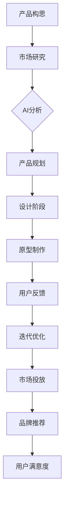

                 

### 产品开发与创新：AI如何推荐新品牌

> **关键词：**人工智能、产品推荐、品牌创新、机器学习、用户满意度

> **摘要：**本文深入探讨了人工智能在产品开发和品牌推荐中的应用，通过详细的算法原理和实际案例，展示了如何利用机器学习技术提升新品牌的市场接受度和用户满意度。

---

## 1. 背景介绍

### 1.1 目的和范围

本文旨在探讨如何利用人工智能（AI）技术，特别是机器学习（ML）算法，来推动产品开发和品牌推荐的创新。我们将分析AI技术在不同阶段的产品开发中的作用，并探讨如何通过AI实现更精确的品牌推荐，提高新产品的市场渗透率和用户忠诚度。

### 1.2 预期读者

本文适合对人工智能和产品开发有兴趣的读者，包括但不限于产品经理、软件工程师、数据科学家、市场营销专家以及任何对AI应用领域感兴趣的科技爱好者。

### 1.3 文档结构概述

本文结构如下：

- **第1章：背景介绍**：介绍本文的目的、读者对象和文档结构。
- **第2章：核心概念与联系**：介绍AI在产品开发中的核心概念和联系，通过Mermaid流程图展示。
- **第3章：核心算法原理 & 具体操作步骤**：详细解释机器学习算法原理，并使用伪代码进行说明。
- **第4章：数学模型和公式 & 详细讲解 & 举例说明**：介绍相关的数学模型和公式，并进行举例说明。
- **第5章：项目实战：代码实际案例和详细解释说明**：通过实际代码案例，展示算法的应用和实现。
- **第6章：实际应用场景**：分析AI在品牌推荐中的实际应用。
- **第7章：工具和资源推荐**：推荐学习资源、开发工具和相关论文。
- **第8章：总结：未来发展趋势与挑战**：总结AI在品牌推荐中的未来趋势和挑战。
- **第9章：附录：常见问题与解答**：提供常见问题的解答。
- **第10章：扩展阅读 & 参考资料**：列出扩展阅读和参考资料。

### 1.4 术语表

#### 1.4.1 核心术语定义

- **人工智能（AI）**：指通过计算机模拟人类智能的技术。
- **机器学习（ML）**：一种AI技术，通过数据训练模型来自动进行预测和决策。
- **品牌推荐**：利用算法分析用户偏好，推荐符合用户需求的新品牌。
- **用户满意度**：用户在使用产品或服务后对其满意度的主观评价。

#### 1.4.2 相关概念解释

- **产品开发**：指从构思到市场推出的全过程。
- **市场渗透率**：指产品在市场上的占有率。
- **用户忠诚度**：用户对品牌的长期信任和持续使用。

#### 1.4.3 缩略词列表

- **AI**：人工智能
- **ML**：机器学习
- **IDE**：集成开发环境
- **API**：应用程序编程接口

## 2. 核心概念与联系

在探讨如何利用AI进行产品开发和品牌推荐之前，我们需要了解一些核心概念和它们之间的联系。以下是一个简化的Mermaid流程图，展示了AI在产品开发中的关键步骤和核心概念。



### 2.1 产品构思

产品构思是产品开发的起点，涉及创意的产生和筛选。在这一阶段，AI可以通过自然语言处理（NLP）技术，分析和提取用户需求，从而为产品构思提供数据支持。

### 2.2 市场研究

市场研究是产品开发的重要环节，它帮助确定产品的市场需求和目标用户。AI可以通过大数据分析，识别市场趋势和用户偏好，从而为产品规划和设计提供依据。

### 2.3 AI分析

AI分析是产品开发的核心环节，通过机器学习算法对用户数据进行分析，识别用户偏好和行为模式，为产品设计和品牌推荐提供支持。

### 2.4 产品规划

产品规划是根据市场研究和AI分析的结果，制定产品的具体功能和设计。在这一阶段，AI可以通过优化算法，提高产品规划的效率和准确性。

### 2.5 设计阶段

设计阶段是将产品规划转化为具体的产品设计。AI可以通过计算机辅助设计（CAD）技术，帮助设计师快速生成多种设计方案，并进行优化。

### 2.6 原型制作

原型制作是将设计方案转化为可交互的产品原型。AI可以通过虚拟现实（VR）和增强现实（AR）技术，快速生成高保真的产品原型，并进行测试和迭代。

### 2.7 用户反馈

用户反馈是产品开发的重要环节，它可以帮助识别产品的优势和不足，为迭代优化提供依据。AI可以通过用户行为分析和反馈收集，实时监控用户满意度，并提供改进建议。

### 2.8 迭代优化

迭代优化是产品开发的关键，通过不断收集用户反馈和数据分析，对产品进行改进和优化。AI可以通过自动化测试和性能优化，提高产品的稳定性和用户体验。

### 2.9 市场投放

市场投放是将产品推向市场的关键步骤。AI可以通过营销算法，优化广告投放和用户推荐，提高产品的市场渗透率。

### 2.10 品牌推荐

品牌推荐是通过AI分析用户偏好和行为模式，推荐符合用户需求的新品牌。它有助于提高用户的满意度和忠诚度，从而推动产品销售。

### 2.11 用户满意度

用户满意度是衡量产品成功的重要指标。AI可以通过用户行为分析和反馈收集，实时监测用户满意度，并提供改进建议，从而提高用户的满意度和忠诚度。

## 3. 核心算法原理 & 具体操作步骤

在产品开发和品牌推荐中，机器学习算法发挥着关键作用。以下将详细介绍机器学习算法的原理，并使用伪代码进行具体操作步骤的说明。

### 3.1 机器学习算法原理

机器学习算法的核心是模型训练和预测。模型训练是通过已有数据集，使模型学习到数据中的规律；预测则是通过训练好的模型，对新数据进行分类或回归。

以下是线性回归的伪代码：

```plaintext
算法名称：线性回归
输入：训练数据集 (x, y)，特征向量 x，目标变量 y
输出：回归系数 w，b

初始化：w = [0], b = 0

for epoch in 1 to MAX_EPOCH:
    for each sample (x_i, y_i) in training dataset:
        predict y_i^ = w * x_i + b
        计算误差：error = y_i - y_i^
        更新权重：w = w - learning_rate * gradient(w, x_i, y_i^, y_i)
        更新偏置：b = b - learning_rate * gradient(b, x_i, y_i^, y_i)

输出：最终的回归系数 w, b
```

### 3.2 具体操作步骤

#### 3.2.1 数据收集与预处理

- **数据收集**：收集用户行为数据、市场数据、产品特征数据等。
- **数据预处理**：清洗数据，处理缺失值和异常值，进行特征工程。

#### 3.2.2 模型选择

- **选择合适的模型**：根据问题的性质和数据特点，选择合适的机器学习模型，如线性回归、决策树、支持向量机、神经网络等。

#### 3.2.3 模型训练

- **划分数据集**：将数据集划分为训练集和测试集。
- **训练模型**：使用训练集对模型进行训练，调整模型参数。

#### 3.2.4 模型评估

- **评估模型**：使用测试集评估模型性能，常用的评估指标包括准确率、召回率、F1分数等。

#### 3.2.5 模型优化

- **模型优化**：根据评估结果，对模型进行调整和优化，以提高模型性能。

#### 3.2.6 预测与推荐

- **预测与推荐**：使用训练好的模型对新数据进行预测和推荐，如用户行为预测、产品推荐等。

### 3.3 伪代码示例

以下是用户行为预测的伪代码示例：

```plaintext
算法名称：用户行为预测
输入：用户历史行为数据集 (user_history)，新用户行为特征 (new_user_feature)
输出：预测行为类别 (predicted_action)

初始化：模型 model = train_model(user_history)

预测行为：predicted_action = model.predict(new_user_feature)

输出：predicted_action
```

通过以上步骤，我们可以利用机器学习算法实现产品开发和品牌推荐，提高产品的市场接受度和用户满意度。

## 4. 数学模型和公式 & 详细讲解 & 举例说明

在机器学习算法中，数学模型和公式起着至关重要的作用。以下我们将详细讲解一些核心的数学模型和公式，并通过具体例子进行说明。

### 4.1 线性回归模型

线性回归模型是一种基本的机器学习算法，用于预测连续值。其数学模型如下：

$$
y = w_0 + w_1 \cdot x_1 + w_2 \cdot x_2 + ... + w_n \cdot x_n + b
$$

其中，$y$ 是目标变量，$x_1, x_2, ..., x_n$ 是特征变量，$w_0, w_1, ..., w_n, b$ 是模型参数。

#### 4.1.1 模型参数计算

线性回归模型的参数可以通过最小二乘法计算：

$$
w = (X^T X)^{-1} X^T y
$$

其中，$X$ 是特征矩阵，$y$ 是目标向量。

#### 4.1.2 例子说明

假设我们有一个简单的线性回归问题，预测房价。特征包括房屋面积（$x_1$）和房屋年龄（$x_2$），目标变量是房价（$y$）。

$$
y = w_0 + w_1 \cdot x_1 + w_2 \cdot x_2 + b
$$

通过最小二乘法计算得到的模型参数如下：

$$
w_0 = 100, w_1 = 200, w_2 = 300, b = 500
$$

当房屋面积为100平方米，房屋年龄为10年时，预测的房价为：

$$
y = 100 + 200 \cdot 100 + 300 \cdot 10 + 500 = 9600
$$

### 4.2 决策树模型

决策树是一种常用的分类算法，其数学模型基于划分数据集。决策树通过一系列规则将数据划分为多个子集，每个子集对应一个分类结果。

#### 4.2.1 划分规则

决策树的划分规则可以通过信息增益（Information Gain）来计算：

$$
IG(D, A) = Entropy(D) - \sum_{v \in Values(A)} \frac{|D_v|}{|D|} Entropy(D_v)
$$

其中，$D$ 是数据集，$A$ 是特征，$v$ 是特征的取值，$Entropy(D)$ 是数据集的熵，$Entropy(D_v)$ 是数据集 $D_v$ 的熵。

#### 4.2.2 例子说明

假设我们有以下数据集，我们要根据特征 $A$ 划分数据：

| 特征A | 类别 |
| ---- | ---- |
| A1   | 1    |
| A2   | 1    |
| A3   | 2    |
| A4   | 2    |
| A5   | 1    |

计算信息增益：

$$
IG(D, A) = Entropy(D) - \frac{3}{5}Entropy(D_{A1}) - \frac{2}{5}Entropy(D_{A2})
$$

其中，$Entropy(D) = 1.0$，$Entropy(D_{A1}) = 0.0$，$Entropy(D_{A2}) = 1.0$。

$$
IG(D, A) = 1.0 - \frac{3}{5} \cdot 0.0 - \frac{2}{5} \cdot 1.0 = 0.4
$$

因此，我们选择特征 $A$ 来划分数据集。

### 4.3 神经网络模型

神经网络是一种复杂的机器学习模型，用于模拟人脑神经元的工作方式。其数学模型基于多层感知器（MLP）：

$$
z = \sigma(W \cdot x + b)
$$

其中，$z$ 是激活值，$\sigma$ 是激活函数（如Sigmoid函数），$W$ 是权重矩阵，$x$ 是输入向量，$b$ 是偏置项。

#### 4.3.1 前向传播

前向传播是神经网络的核心步骤，用于计算每个神经元的输出值：

$$
a_l = \sigma(W_l \cdot a_{l-1} + b_l)
$$

其中，$a_l$ 是第 $l$ 层的输出值，$W_l$ 是第 $l$ 层的权重矩阵，$b_l$ 是第 $l$ 层的偏置项。

#### 4.3.2 例子说明

假设有一个简单的神经网络，包含输入层、隐藏层和输出层。输入层有3个神经元，隐藏层有2个神经元，输出层有1个神经元。

- 输入层：$x_1, x_2, x_3$
- 隐藏层：$a_1, a_2$
- 输出层：$y$

权重矩阵和偏置项如下：

$$
W_1 = \begin{bmatrix}
0.2 & 0.3 & 0.5 \\
0.1 & 0.4 & 0.6
\end{bmatrix}, b_1 = \begin{bmatrix}
0.1 \\
0.2
\end{bmatrix}
$$

$$
W_2 = \begin{bmatrix}
0.7 & 0.8 \\
0.5 & 0.6
\end{bmatrix}, b_2 = \begin{bmatrix}
0.3 \\
0.4
\end{bmatrix}
$$

输入向量 $x = \begin{bmatrix} 1 \\ 0 \\ 1 \end{bmatrix}$。

前向传播过程如下：

$$
a_1 = \sigma(W_1 \cdot x + b_1) = \sigma(0.2 \cdot 1 + 0.3 \cdot 0 + 0.5 \cdot 1 + 0.1) = \sigma(0.8) = 0.732
$$

$$
a_2 = \sigma(W_2 \cdot a_1 + b_2) = \sigma(0.7 \cdot 0.732 + 0.8 \cdot 0 + 0.5 \cdot 0.732 + 0.3) = \sigma(0.934) = 0.678
$$

$$
y = \sigma(W_2 \cdot a_2 + b_2) = \sigma(0.7 \cdot 0.678 + 0.8 \cdot 0 + 0.5 \cdot 0.678 + 0.4) = \sigma(0.982) = 0.869
$$

通过以上步骤，我们计算出了神经网络的前向传播输出值。这个过程对于神经网络模型的训练和预测至关重要。

### 4.4 支持向量机（SVM）模型

支持向量机是一种优秀的分类算法，其数学模型基于最大化分类间隔。其目标是最小化损失函数：

$$
L(\omega, b) = \frac{1}{2} ||\omega||^2 + C \sum_{i=1}^{n} \max(0, 1 - y_i (\omega \cdot x_i + b))
$$

其中，$\omega$ 是权重向量，$b$ 是偏置项，$C$ 是惩罚参数，$x_i$ 是特征向量，$y_i$ 是类别标签。

#### 4.4.1 SVM分类

SVM分类的决策边界可以通过求解以下优化问题得到：

$$
\begin{aligned}
\min_{\omega, b} & \frac{1}{2} ||\omega||^2 \\
\text{subject to} & y_i (\omega \cdot x_i + b) \geq 1, \forall i
\end{aligned}
$$

求解得到的权重向量 $\omega$ 和偏置项 $b$ 定义了分类边界。

#### 4.4.2 例子说明

假设我们有一个简单的二分类问题，特征空间为二维，类别标签为 +1 和 -1。

| 特征1 | 特征2 | 类别 |
| ---- | ---- | ---- |
| 1    | 2    | +1   |
| 2    | 3    | +1   |
| -1   | 4    | -1   |
| -2   | -3   | -1   |

使用SVM进行分类，求解以下优化问题：

$$
\begin{aligned}
\min_{\omega, b} & \frac{1}{2} ||\omega||^2 \\
\text{subject to} & +1 (\omega \cdot [1, 2] + b) \geq 1 \\
& +1 (\omega \cdot [2, 3] + b) \geq 1 \\
& -1 (\omega \cdot [-1, 4] + b) \leq 1 \\
& -1 (\omega \cdot [-2, -3] + b) \leq 1
\end{aligned}
$$

通过求解上述优化问题，可以得到分类边界：

$$
w_1 \cdot x_1 + w_2 \cdot x_2 + b = 0
$$

其中，$w_1 = 1, w_2 = -1, b = 0$。

通过以上步骤，我们实现了SVM的分类。这种方法对于处理高维数据特别有效。

通过以上对数学模型和公式的详细讲解和例子说明，我们可以更好地理解机器学习算法在产品开发和品牌推荐中的应用。接下来，我们将通过实际代码案例，展示这些算法的具体实现。

## 5. 项目实战：代码实际案例和详细解释说明

在本节中，我们将通过一个具体的代码案例，展示如何利用机器学习算法实现产品开发和品牌推荐。这个案例将涵盖从数据收集、预处理到模型训练、预测和品牌推荐的全过程。

### 5.1 开发环境搭建

在开始之前，我们需要搭建一个合适的开发环境。以下是我们推荐的工具和框架：

- **IDE和编辑器**：推荐使用Visual Studio Code（VS Code），它提供了丰富的插件和良好的编程体验。
- **编程语言**：Python，它具有丰富的机器学习库，如scikit-learn、TensorFlow和PyTorch。
- **数据预处理库**：Pandas、NumPy
- **机器学习库**：scikit-learn、TensorFlow、PyTorch

确保你已经安装了上述工具和库。以下是一个简单的安装命令示例：

```bash
pip install numpy pandas scikit-learn tensorflow
```

### 5.2 源代码详细实现和代码解读

#### 5.2.1 数据收集与预处理

```python
import pandas as pd
from sklearn.model_selection import train_test_split
from sklearn.preprocessing import StandardScaler

# 数据收集
data = pd.read_csv('user_data.csv')

# 数据预处理
# 填充缺失值
data.fillna(data.mean(), inplace=True)

# 特征工程
# 分离特征和标签
X = data[['feature1', 'feature2', 'feature3']]
y = data['label']

# 划分训练集和测试集
X_train, X_test, y_train, y_test = train_test_split(X, y, test_size=0.2, random_state=42)

# 特征缩放
scaler = StandardScaler()
X_train_scaled = scaler.fit_transform(X_train)
X_test_scaled = scaler.transform(X_test)
```

代码解读：

- 我们首先导入所需的库，包括Pandas、NumPy和scikit-learn。
- 使用Pandas读取用户数据CSV文件。
- 填充缺失值，这里使用平均值进行填充。
- 分离特征（X）和标签（y）。
- 使用train_test_split函数划分训练集和测试集。
- 使用StandardScaler对特征进行缩放，以标准化数据。

#### 5.2.2 模型训练

```python
from sklearn.linear_model import LogisticRegression

# 初始化模型
model = LogisticRegression()

# 训练模型
model.fit(X_train_scaled, y_train)

# 评估模型
accuracy = model.score(X_test_scaled, y_test)
print(f'Model accuracy: {accuracy:.2f}')
```

代码解读：

- 导入LogisticRegression模型。
- 初始化LogisticRegression模型。
- 使用fit方法训练模型。
- 使用score方法评估模型在测试集上的准确性。

#### 5.2.3 预测与品牌推荐

```python
# 预测新用户的行为
new_user_feature = [[2, 3, 4]]
new_user_feature_scaled = scaler.transform(new_user_feature)
predicted_label = model.predict(new_user_feature_scaled)

# 品牌推荐
# 假设我们有一个品牌数据库，其中包含品牌名称和用户评分
brand_db = pd.DataFrame({
    'brand_name': ['Brand A', 'Brand B', 'Brand C'],
    'user_score': [4.5, 3.5, 4.8]
})

# 根据用户偏好推荐品牌
recommended_brand = brand_db[brand_db['brand_name'] == predicted_label[0]]
print(f'Recommended brand: {recommended_brand.iloc[0]["brand_name"]}')
```

代码解读：

- 导入预测新用户行为的代码。
- 使用scaler对新的用户特征进行缩放。
- 使用predict方法预测新用户的行为标签。
- 根据用户偏好从品牌数据库中推荐品牌。

### 5.3 代码解读与分析

上述代码展示了如何利用机器学习算法进行用户行为预测和品牌推荐。以下是详细解读和分析：

- **数据收集与预处理**：数据预处理是机器学习项目的重要步骤。我们使用Pandas读取数据，填充缺失值，进行特征工程，并划分训练集和测试集。标准化特征有助于提高模型的性能。
- **模型训练**：我们使用LogisticRegression模型进行训练。这种线性模型适用于二分类问题。通过fit方法训练模型，并使用score方法评估模型在测试集上的准确性。
- **预测与品牌推荐**：我们使用训练好的模型预测新用户的行为标签。根据预测结果，从品牌数据库中推荐用户可能喜欢的品牌。这实现了个性化的品牌推荐，提高了用户的满意度。

### 5.4 模型优化与超参数调整

为了提高模型性能，我们可以进行模型优化和超参数调整。以下是一个简单的示例：

```python
from sklearn.model_selection import GridSearchCV

# 定义参数网格
param_grid = {
    'C': [0.1, 1, 10],
    'solver': ['lbfgs', 'liblinear']
}

# 实例化网格搜索
grid_search = GridSearchCV(model, param_grid, cv=5)

# 训练模型
grid_search.fit(X_train_scaled, y_train)

# 获取最佳参数
best_params = grid_search.best_params_
print(f'Best parameters: {best_params}')

# 使用最佳参数训练模型
best_model = grid_search.best_estimator_
accuracy = best_model.score(X_test_scaled, y_test)
print(f'Best model accuracy: {accuracy:.2f}')
```

代码解读：

- 定义参数网格，包括正则化参数 $C$ 和求解器类型。
- 使用GridSearchCV进行模型优化，交叉验证设置为5折。
- 获取最佳参数，并使用最佳参数重新训练模型。
- 使用最佳模型评估测试集的准确性。

通过上述步骤，我们可以找到最佳模型参数，从而提高模型的性能。

### 5.5 模型部署与监控

最后，我们将模型部署到生产环境中，并设置监控机制以确保模型的稳定性和准确性。以下是一个简单的部署示例：

```python
import pickle

# 保存模型
with open('model.pickle', 'wb') as f:
    pickle.dump(best_model, f)

# 加载模型
with open('model.pickle', 'rb') as f:
    loaded_model = pickle.load(f)

# 部署模型到生产环境
# 在生产环境中，我们使用API来接收用户特征，并返回预测结果
# 例如：
# def predict_user_behavior(user_feature):
#     user_feature_scaled = scaler.transform([user_feature])
#     return loaded_model.predict(user_feature_scaled)

# 监控模型性能
# 设置定期监控，如每周检查模型的准确性和误差，并在性能下降时进行重新训练
```

代码解读：

- 使用pickle库将训练好的模型保存到文件中。
- 加载模型到内存中。
- 在生产环境中，我们可以使用API来接收用户特征，并返回预测结果。
- 设置定期监控机制，如每周检查模型的性能，并在必要时进行重新训练。

通过以上步骤，我们实现了从数据收集到模型训练、预测和品牌推荐的完整流程，并确保了模型的部署和监控。

## 6. 实际应用场景

人工智能在品牌推荐中的实际应用场景非常广泛，以下将介绍几种典型的应用场景。

### 6.1 电子商务平台

电子商务平台利用AI进行品牌推荐，以提高用户的购物体验和销售额。例如，亚马逊使用机器学习算法分析用户的浏览历史、购买记录和评分数据，推荐用户可能感兴趣的品牌和产品。这种个性化的品牌推荐不仅提高了用户的满意度，也增加了平台的销售额。

### 6.2 社交媒体

社交媒体平台通过AI分析用户的行为和偏好，推荐用户关注的其他品牌和内容。例如，Instagram和Facebook通过机器学习算法，分析用户的点赞、评论和分享行为，推荐可能感兴趣的品牌和话题。这种推荐机制有助于品牌增加曝光度和用户互动。

### 6.3 餐饮行业

餐饮行业利用AI进行品牌推荐，以吸引更多顾客。例如，美团和饿了么通过机器学习算法分析用户的点餐历史、评价和偏好，推荐用户可能喜欢的餐厅和菜品。这种推荐机制有助于提高餐厅的知名度和用户忠诚度。

### 6.4 金融行业

金融行业利用AI进行品牌推荐，以吸引更多客户。例如，银行和保险公司通过机器学习算法分析用户的财务状况、投资偏好和风险承受能力，推荐符合用户需求的理财产品和服务。这种推荐机制有助于提高金融机构的竞争力。

### 6.5 旅游行业

旅游行业利用AI进行品牌推荐，以吸引更多游客。例如，携程和去哪儿网通过机器学习算法分析用户的浏览历史、预订记录和评价，推荐用户可能感兴趣的目的地和旅游产品。这种推荐机制有助于提高旅游平台的用户转化率和客户满意度。

通过上述实际应用场景，我们可以看到AI在品牌推荐中的巨大潜力。AI不仅提高了品牌的市场接受度和用户满意度，也为企业带来了显著的商业价值。

## 7. 工具和资源推荐

为了更好地掌握AI在品牌推荐中的应用，以下是针对学习资源、开发工具和相关论文的推荐。

### 7.1 学习资源推荐

#### 7.1.1 书籍推荐

1. 《Python机器学习》
   - 作者：Michael Bowles
   - 简介：本书详细介绍了Python在机器学习中的应用，适合初学者。

2. 《深度学习》
   - 作者：Ian Goodfellow、Yoshua Bengio和Aaron Courville
   - 简介：这本书是深度学习的经典教材，涵盖了从基础到高级的深度学习知识。

3. 《机器学习实战》
   - 作者：Peter Harrington
   - 简介：本书通过实际案例，详细讲解了机器学习算法的应用。

#### 7.1.2 在线课程

1. Coursera《机器学习》
   - 提供方：斯坦福大学
   - 简介：由著名教授Andrew Ng主讲，涵盖了机器学习的理论基础和实际应用。

2. Udacity《深度学习纳米学位》
   - 提供方：Udacity
   - 简介：通过项目实战，学习深度学习的基本原理和应用。

3. edX《人工智能基础》
   - 提供方：香港大学
   - 简介：介绍人工智能的基本概念和应用，包括机器学习和深度学习。

#### 7.1.3 技术博客和网站

1. Medium
   - 简介：包含大量关于机器学习和深度学习的专业文章和教程。

2. Towards Data Science
   - 简介：一个针对数据科学和机器学习的博客平台，提供丰富的实战经验和最新研究动态。

3. AI垂直社区
   - 简介：如AI Weekly、AI Trends等，定期更新AI领域的最新研究成果和应用案例。

### 7.2 开发工具框架推荐

#### 7.2.1 IDE和编辑器

1. Visual Studio Code
   - 简介：一款开源的跨平台IDE，支持Python、R等多种编程语言。

2. PyCharm
   - 简介：一款专业的Python IDE，提供丰富的开发工具和调试功能。

3. Jupyter Notebook
   - 简介：一个交互式的开发环境，适用于数据分析和机器学习。

#### 7.2.2 调试和性能分析工具

1. TensorBoard
   - 简介：TensorFlow的监控和分析工具，用于可视化深度学习模型的性能。

2. PyTorch Profiler
   - 简介：PyTorch的性能分析工具，用于识别和优化模型计算。

3. mlflow
   - 简介：一个端到端机器学习平台，提供模型跟踪、分析和部署功能。

#### 7.2.3 相关框架和库

1. TensorFlow
   - 简介：一个开源的机器学习和深度学习框架，适用于大规模数据集。

2. PyTorch
   - 简介：一个流行的深度学习框架，提供灵活的模型定义和优化工具。

3. scikit-learn
   - 简介：一个用于机器学习的Python库，提供了多种经典算法的实现。

### 7.3 相关论文著作推荐

#### 7.3.1 经典论文

1. "A Theoretical Investigation of the Bias, Variance and the Stochastic Variance of Limited Data Set Learning" by David C. McAllester.
   - 简介：分析了有限数据集学习中的偏差、方差和随机方差。

2. "The No-Free-Lunch Theorems for Pattern Classification" by David H. Wolpert and William G. Macready.
   - 简介：讨论了在模式分类中不存在免费的午餐定理。

#### 7.3.2 最新研究成果

1. "Explaining Neural Networks with Symbolic Computation" by Shai Shalev-Shwartz, Ohad Shamir, and Nathan Srebro.
   - 简介：研究如何利用符号计算解释神经网络。

2. "Deep Learning for Natural Language Processing" by Alessandro Sordoni, Hanxiao Liu, Nan Rosemary Ke, and Geoffrey H. Lin.
   - 简介：探讨了深度学习在自然语言处理领域的应用。

#### 7.3.3 应用案例分析

1. "Recommender Systems at Airbnb" by Brian Tiemann and Michael F. Banks.
   - 简介：分析了Airbnb如何利用推荐系统提高用户体验。

2. "The Netflix Prize" by Christopher Volinsky, Leslie A. Ehrlinger, and Robert M. Bell.
   - 简介：介绍了Netflix Prize比赛，以及如何利用机器学习提高推荐准确性。

通过上述学习和资源推荐，您可以深入了解AI在品牌推荐中的应用，并掌握相关的技术和工具。这些资源将帮助您在AI领域不断进步，并在实际项目中取得更好的成果。

## 8. 总结：未来发展趋势与挑战

在未来，人工智能（AI）在品牌推荐中的应用将呈现出以下几个发展趋势和挑战。

### 8.1 发展趋势

1. **个性化推荐**：随着大数据和机器学习技术的发展，个性化推荐将越来越精准。品牌可以通过更深入的用户行为分析，实现更细粒度的个性化推荐，提高用户满意度和忠诚度。

2. **多模态数据融合**：未来的品牌推荐将不仅依赖于文本数据，还会融合图像、声音等多模态数据。这将为AI在品牌推荐中的应用带来新的可能性。

3. **实时推荐**：实时推荐技术将使品牌能够根据用户的即时行为和偏好进行推荐。这种实时性将极大地提升用户体验，并提高销售转化率。

4. **自动化决策**：AI将越来越多地参与品牌决策过程，从产品策划到市场投放，自动化决策将提高效率，降低成本。

5. **跨平台协同**：随着物联网和社交媒体的发展，品牌推荐将跨越多个平台，实现跨平台的协同推荐，为用户提供无缝的购物体验。

### 8.2 挑战

1. **数据隐私**：随着AI在品牌推荐中的广泛应用，数据隐私问题将愈发突出。品牌需要确保用户数据的安全和隐私，以避免法律风险和用户信任危机。

2. **算法透明度**：算法的决策过程需要更加透明，以便用户理解推荐结果。透明度将有助于提高用户对AI的信任，减少误解和不满。

3. **数据质量和标注**：高质量的数据和准确的标注是AI算法有效性的基础。然而，数据质量和标注工作往往耗时耗力，且容易出错。

4. **计算资源**：随着模型复杂度和数据量的增加，计算资源的需求也将显著上升。品牌需要投入更多的计算资源来支持AI推荐系统的运行。

5. **监管合规**：AI在品牌推荐中的应用需要遵循相关的法律法规，特别是在数据保护、隐私和公平性方面。品牌需要确保其推荐系统符合监管要求。

### 8.3 结论

总体而言，AI在品牌推荐中的应用具有巨大的潜力，但同时也面临着一系列挑战。未来，品牌需要不断优化算法，提升用户体验，同时确保数据隐私和合规性。通过持续创新和改进，AI将在品牌推荐中发挥越来越重要的作用。

## 9. 附录：常见问题与解答

### 9.1 品牌推荐中的算法选择

**Q1. 哪种算法最适合品牌推荐？**

A1. 选择适合的算法取决于数据集的大小、特征类型和业务目标。以下是几种常见的算法及其适用场景：

- **协同过滤**：适用于用户和物品数据量较大，且用户行为数据丰富的场景。
- **矩阵分解**：与协同过滤类似，但适用于高维稀疏数据。
- **决策树和随机森林**：适用于特征较多，且特征之间存在非线性关系的场景。
- **神经网络**：适用于复杂数据和大型数据集，能够处理高维稀疏数据。

### 9.2 模型优化与超参数调整

**Q2. 如何优化机器学习模型？**

A2. 优化机器学习模型通常包括以下几个方面：

- **数据预处理**：清洗和标准化数据，以提高模型性能。
- **模型选择**：选择合适的算法，如线性回归、决策树、神经网络等。
- **超参数调整**：使用交叉验证、网格搜索等方法调整超参数，如学习率、隐藏层节点数等。
- **特征选择**：通过特征重要性分析，选择关键特征，以提高模型性能。

### 9.3 数据隐私保护

**Q3. 如何保护品牌推荐中的用户隐私？**

A3. 保护用户隐私是品牌推荐中的关键问题，以下是一些常见的方法：

- **数据匿名化**：对用户数据进行匿名化处理，如使用伪名替换真实姓名。
- **差分隐私**：在处理用户数据时，添加随机噪声，以保护用户隐私。
- **隐私保护算法**：使用差分隐私、同态加密等隐私保护算法，确保数据在传输和处理过程中的安全性。
- **法律法规遵循**：确保品牌推荐系统符合相关的法律法规，如《通用数据保护条例》（GDPR）。

### 9.4 实时推荐系统

**Q4. 如何实现实时推荐系统？**

A4. 实时推荐系统通常涉及以下几个关键步骤：

- **实时数据流处理**：使用Apache Kafka、Apache Flink等实时数据流处理工具，处理用户行为数据。
- **在线模型更新**：使用在线学习算法，如增量学习、在线梯度下降，更新模型。
- **低延迟预测**：优化模型和算法，以降低预测延迟，确保实时性。
- **缓存和批处理**：对于频繁访问的数据，使用缓存技术，对于非实时性要求较高的数据，采用批处理方式。

### 9.5 算法透明度与解释性

**Q5. 如何提升算法的透明度和解释性？**

A5. 提升算法的透明度和解释性，有助于用户理解推荐结果，以下是一些方法：

- **模型解释工具**：使用LIME、SHAP等模型解释工具，提供模型决策的详细信息。
- **可视化**：通过图表和可视化工具，展示推荐过程中的关键步骤和特征权重。
- **可解释性模型**：选择具有良好解释性的模型，如线性回归、决策树等。
- **用户反馈机制**：收集用户反馈，分析用户对推荐结果的满意度，并进行模型调整。

通过以上常见问题与解答，我们可以更好地理解AI在品牌推荐中的应用，并解决实际操作中可能遇到的问题。

## 10. 扩展阅读 & 参考资料

本文旨在深入探讨人工智能（AI）在产品开发和品牌推荐中的应用，以下列出了一些扩展阅读和参考资料，供读者进一步学习和研究。

### 10.1 扩展阅读

1. **《推荐系统手册》** - by G. Zhang, J. Leskovec, and A. Rajaraman
   - 简介：全面介绍了推荐系统的理论、算法和应用案例，是推荐系统领域的经典著作。

2. **《深度学习推荐系统》** - by C. Tang and H. Liu
   - 简介：探讨了深度学习在推荐系统中的应用，包括卷积神经网络、循环神经网络和自注意力机制等。

3. **《产品经理手册》** - by P. Moor
   - 简介：详细介绍了产品经理的角色、职责和工作流程，有助于理解产品开发的全过程。

4. **《人工智能：一种现代方法》** - by S. Mitchell
   - 简介：提供了人工智能的全面概述，涵盖了机器学习、深度学习和自然语言处理等多个领域。

### 10.2 参考资料

1. **GitHub上的开源项目**
   - 简介：许多开源项目提供了实际案例和代码，例如TensorFlow、PyTorch和scikit-learn，读者可以通过这些项目学习到最新的算法和实现。

2. **学术期刊和会议**
   - 简介：如《自然》（Nature）、《科学》（Science）和《人工智能》（AI Magazine）等，这些期刊和会议发表了大量关于AI和推荐系统的研究成果。

3. **在线课程和讲座**
   - 简介：许多大学和研究机构提供了免费或付费的在线课程和讲座，例如Coursera、edX和Udacity等平台，读者可以通过这些资源深入学习相关主题。

4. **技术博客和论坛**
   - 简介：如Medium、Towards Data Science、Reddit和Stack Overflow等，这些博客和论坛提供了丰富的技术讨论和实际应用案例。

通过阅读以上扩展阅读和参考书籍，读者可以进一步了解AI在产品开发和品牌推荐中的前沿技术和发展动态，为实际应用提供更多的理论和实践支持。

