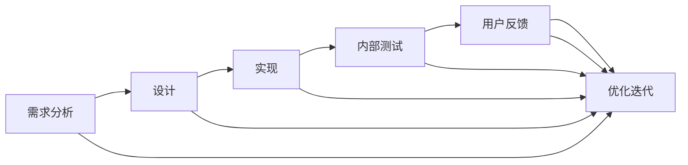

                 

# 产品测试与迭代：内部测试和用户反馈

> **关键词**：产品测试、迭代、内部测试、用户反馈、质量控制、性能测试、用户体验。

> **摘要**：本文将深入探讨产品测试与迭代过程中的两个关键环节：内部测试和用户反馈。通过详细分析内部测试的目的、方法及流程，我们认识到其对于确保产品质量的重要性。同时，我们探讨用户反馈的作用，阐述如何有效收集和分析用户反馈，并利用这些反馈进行产品优化和迭代。文章将结合实际案例，提供具体的操作步骤和工具推荐，帮助读者理解和掌握这一关键技能。

## 1. 背景介绍

### 1.1 目的和范围

在软件开发和产品开发的过程中，测试和迭代是不可或缺的环节。内部测试和用户反馈作为其中的关键组成部分，对产品的质量和用户体验起着至关重要的作用。本文旨在为读者提供一份详细的指南，帮助理解内部测试和用户反馈的概念、重要性以及如何在实际项目中应用这些方法。

本文将涵盖以下内容：
1. 内部测试的目的、方法和流程。
2. 用户反馈的重要性、收集和分析方法。
3. 如何利用内部测试和用户反馈进行产品优化和迭代。
4. 实际应用案例和工具推荐。

通过本文的阅读，读者将能够全面掌握产品测试与迭代的核心技能，从而提升产品质量和用户满意度。

### 1.2 预期读者

本文适用于以下读者群体：
1. 软件开发工程师和测试工程师，希望深入了解产品测试和迭代的方法。
2. 产品经理和项目经理，需要掌握内部测试和用户反馈的应用。
3. 初级和中级技术人员，对产品测试和迭代有浓厚兴趣，希望提升自身技能。
4. 对质量管理有需求的各类企业，特别是涉及软件开发和产品制造的企业。

### 1.3 文档结构概述

本文将分为以下几个部分：

1. **背景介绍**：介绍文章的目的、范围、预期读者及文档结构。
2. **核心概念与联系**：阐述产品测试和迭代的核心概念，并使用Mermaid流程图展示相关流程。
3. **核心算法原理 & 具体操作步骤**：详细讲解内部测试的算法原理和操作步骤。
4. **数学模型和公式 & 详细讲解 & 举例说明**：介绍与产品测试相关的数学模型和公式，并提供具体示例。
5. **项目实战：代码实际案例和详细解释说明**：结合实际案例，展示内部测试和用户反馈的具体应用。
6. **实际应用场景**：分析产品测试和迭代在不同领域的应用。
7. **工具和资源推荐**：推荐相关学习资源、开发工具和框架。
8. **总结：未来发展趋势与挑战**：探讨产品测试与迭代的未来趋势和面临的挑战。
9. **附录：常见问题与解答**：回答读者可能遇到的问题。
10. **扩展阅读 & 参考资料**：提供进一步学习的参考资料。

### 1.4 术语表

为了确保文章的可读性和专业性，本文将使用以下术语，并对核心术语进行定义：

#### 1.4.1 核心术语定义

- **产品测试**：对产品功能、性能、安全性、可靠性等方面进行全面检测的过程。
- **迭代**：在软件开发和产品开发过程中，不断重复执行的需求分析、设计、实现、测试和部署的过程。
- **内部测试**：由开发团队或内部测试团队进行的产品测试活动。
- **用户反馈**：用户对产品使用的评价和建议。

#### 1.4.2 相关概念解释

- **自动化测试**：使用自动化工具执行测试，以提高测试效率和准确性。
- **用户体验**：用户在使用产品过程中所感受到的满意度和舒适度。
- **缺陷**：产品中存在的错误或不足之处。

#### 1.4.3 缩略词列表

- **SQA**：软件质量保证（Software Quality Assurance）
- **QA**：质量保证（Quality Assurance）
- **UAT**：用户验收测试（User Acceptance Testing）
- **API**：应用程序编程接口（Application Programming Interface）
- **UI**：用户界面（User Interface）

## 2. 核心概念与联系

在探讨产品测试与迭代时，理解核心概念及其相互联系是非常重要的。以下是产品测试和迭代过程中的几个关键概念及其流程：

### 2.1 产品测试的概念

产品测试是确保产品质量和功能符合预期的重要环节。其核心概念包括：

1. **功能测试**：验证产品功能是否按设计正常工作。
2. **性能测试**：评估产品在特定条件下处理请求的能力和响应时间。
3. **安全性测试**：确保产品不受恶意攻击，数据安全。
4. **兼容性测试**：确保产品在不同平台、设备和操作系统上正常运行。

### 2.2 迭代的流程

迭代是产品开发中不断重复和改进的过程，其核心流程包括：

1. **需求分析**：明确产品的功能和用户需求。
2. **设计**：制定产品的架构和界面设计。
3. **实现**：开发产品的功能。
4. **测试**：对产品进行全面测试。
5. **部署**：将产品部署到生产环境。

### 2.3 内部测试的概念和流程

内部测试是开发团队或内部测试团队进行的产品测试活动，其流程通常包括：

1. **单元测试**：测试单个组件或函数的功能。
2. **集成测试**：测试组件或模块之间的接口和交互。
3. **系统测试**：测试整个系统的功能、性能和安全。
4. **回归测试**：在每次迭代后测试已修复的缺陷和新引入的缺陷。

### 2.4 用户反馈的概念和流程

用户反馈是用户在使用产品过程中提供的评价和建议，其流程通常包括：

1. **收集反馈**：通过问卷调查、用户访谈、反馈表单等方式收集用户反馈。
2. **分析反馈**：对收集到的反馈进行分析，识别问题和改进点。
3. **反馈闭环**：将分析结果反馈给开发团队，并进行相应的优化。

### 2.5 Mermaid流程图

以下是一个Mermaid流程图，展示了产品测试和迭代的核心流程及概念：



### 2.6 核心概念之间的联系

产品测试和迭代过程中的核心概念是相互关联的。内部测试和用户反馈是确保产品质量和用户体验的关键环节。内部测试帮助发现和修复产品中的缺陷，而用户反馈则提供了改进产品的方向和依据。通过不断的迭代和优化，产品最终能够达到预期的质量和用户满意度。

## 3. 核心算法原理 & 具体操作步骤

在产品测试与迭代过程中，内部测试是确保产品质量的关键环节。内部测试不仅包括功能测试、性能测试和安全性测试，还包括单元测试、集成测试、系统测试和回归测试。以下是内部测试的核心算法原理和具体操作步骤：

### 3.1 内部测试的算法原理

内部测试的核心算法原理主要包括以下几个方面：

1. **测试用例设计**：测试用例是测试过程中的基本单元，用于验证产品的功能、性能和安全。测试用例设计的目标是覆盖产品的所有功能点，确保每个功能都被测试到。

2. **自动化测试**：自动化测试通过编写脚本或使用自动化测试工具，自动化执行测试用例，提高测试效率和准确性。自动化测试的核心算法原理是使用测试工具模拟用户操作，验证产品功能。

3. **缺陷管理**：缺陷管理是内部测试的重要组成部分。缺陷管理算法原理包括缺陷报告、缺陷跟踪、缺陷分析和缺陷修复。通过缺陷管理，可以确保每个缺陷都被及时发现和修复。

4. **测试执行和结果分析**：测试执行是指按照测试用例执行测试，收集测试结果。测试结果分析算法原理是通过比较测试结果与预期结果，识别产品缺陷。

### 3.2 内部测试的具体操作步骤

以下是内部测试的具体操作步骤：

#### 3.2.1 单元测试

1. **测试用例设计**：根据产品需求和设计文档，设计单元测试用例，确保每个函数或组件都被测试到。

2. **自动化脚本编写**：使用自动化测试工具，编写自动化测试脚本，执行测试用例。

3. **测试执行**：执行自动化测试脚本，收集测试结果。

4. **结果分析**：比较测试结果与预期结果，识别缺陷。

#### 3.2.2 集成测试

1. **测试用例设计**：设计集成测试用例，确保组件之间的接口和交互都被测试到。

2. **自动化脚本编写**：编写自动化测试脚本，执行集成测试用例。

3. **测试执行**：执行自动化测试脚本，收集测试结果。

4. **结果分析**：比较测试结果与预期结果，识别缺陷。

#### 3.2.3 系统测试

1. **测试用例设计**：设计系统测试用例，确保整个系统的功能、性能和安全都被测试到。

2. **自动化脚本编写**：编写自动化测试脚本，执行系统测试用例。

3. **测试执行**：执行自动化测试脚本，收集测试结果。

4. **结果分析**：比较测试结果与预期结果，识别缺陷。

#### 3.2.4 回归测试

1. **测试用例设计**：设计回归测试用例，确保每次迭代后产品没有引入新的缺陷。

2. **自动化脚本编写**：编写自动化测试脚本，执行回归测试用例。

3. **测试执行**：执行自动化测试脚本，收集测试结果。

4. **结果分析**：比较测试结果与预期结果，识别缺陷。

### 3.3 伪代码示例

以下是内部测试的伪代码示例：

```python
# 单元测试
def unit_test():
    for test_case in test_cases:
        actual_result = execute(test_case)
        expected_result = expected_values[test_case]
        if actual_result != expected_result:
            log_defect(test_case, actual_result, expected_result)

# 集成测试
def integration_test():
    for test_case in integration_test_cases:
        actual_result = execute(test_case)
        expected_result = expected_values[test_case]
        if actual_result != expected_result:
            log_defect(test_case, actual_result, expected_result)

# 系统测试
def system_test():
    for test_case in system_test_cases:
        actual_result = execute(test_case)
        expected_result = expected_values[test_case]
        if actual_result != expected_result:
            log_defect(test_case, actual_result, expected_result)

# 回归测试
def regression_test():
    for test_case in regression_test_cases:
        actual_result = execute(test_case)
        expected_result = expected_values[test_case]
        if actual_result != expected_result:
            log_defect(test_case, actual_result, expected_result)
```

通过上述伪代码示例，我们可以看到内部测试的核心算法原理和具体操作步骤。内部测试是确保产品质量的关键环节，通过合理的测试用例设计、自动化测试脚本编写、测试执行和结果分析，可以有效发现和修复产品缺陷，提升产品质量。

## 4. 数学模型和公式 & 详细讲解 & 举例说明

在产品测试与迭代过程中，数学模型和公式被广泛应用于测试用例设计、缺陷管理和性能评估等方面。以下将详细讲解这些数学模型和公式，并举例说明其在实际中的应用。

### 4.1 测试用例设计的数学模型

测试用例设计是内部测试的重要环节，其数学模型主要包括以下几个方面：

#### 4.1.1 测试覆盖率

测试覆盖率是衡量测试质量的重要指标，其数学模型可以表示为：

$$
\text{测试覆盖率} = \frac{\text{已测试功能数}}{\text{总功能数}} \times 100\%
$$

举例说明：如果一个产品有100个功能，其中已经测试了80个功能，那么测试覆盖率就是80%。

#### 4.1.2 测试用例数量

测试用例数量是测试用例设计的关键因素，其数学模型可以表示为：

$$
\text{测试用例数量} = \text{功能数} \times \text{测试深度}
$$

其中，测试深度表示测试用例的详细程度，通常取值范围为1-3。

举例说明：如果一个产品有100个功能，测试深度为2，那么测试用例数量就是100 \times 2 = 200个。

### 4.2 缺陷管理的数学模型

缺陷管理是内部测试的重要组成部分，其数学模型主要包括以下几个方面：

#### 4.2.1 缺陷密度

缺陷密度是衡量产品缺陷程度的指标，其数学模型可以表示为：

$$
\text{缺陷密度} = \frac{\text{缺陷数}}{\text{代码行数}} \times 1000
$$

举例说明：如果一个产品的代码行数为10000行，发现了10个缺陷，那么缺陷密度就是10 / 10000 \times 1000 = 1。

#### 4.2.2 缺陷优先级

缺陷优先级是评估缺陷重要程度的指标，其数学模型可以表示为：

$$
\text{缺陷优先级} = \frac{\text{缺陷影响范围} \times \text{缺陷严重程度}}{\text{系统稳定性}}
$$

其中，缺陷影响范围、缺陷严重程度和系统稳定性分别表示缺陷对系统的影响程度，取值范围为1-5。

举例说明：如果一个缺陷的影响范围是3，严重程度是4，系统稳定性是2，那么缺陷优先级就是3 \times 4 / 2 = 6。

### 4.3 性能评估的数学模型

性能评估是内部测试的另一个重要环节，其数学模型主要包括以下几个方面：

#### 4.3.1 响应时间

响应时间是衡量系统性能的重要指标，其数学模型可以表示为：

$$
\text{响应时间} = \frac{\text{处理时间} + \text{传输时间}}{\text{并发用户数}}
$$

举例说明：如果一个系统的处理时间是1秒，传输时间是0.5秒，并发用户数是10，那么响应时间就是(1 + 0.5) / 10 = 0.15秒。

#### 4.3.2 吞吐量

吞吐量是衡量系统处理能力的重要指标，其数学模型可以表示为：

$$
\text{吞吐量} = \frac{\text{处理次数}}{\text{处理时间}}
$$

举例说明：如果一个系统在1小时内处理了1000个请求，那么吞吐量就是1000 / 1 = 1000。

通过上述数学模型和公式的详细讲解和举例说明，我们可以看到它们在产品测试与迭代过程中的广泛应用。合理运用这些模型和公式，可以帮助我们更科学地进行测试用例设计、缺陷管理和性能评估，从而提高产品的质量。

## 5. 项目实战：代码实际案例和详细解释说明

在产品测试与迭代过程中，内部测试和用户反馈是两个关键环节。为了更好地理解这两个环节的具体应用，我们将通过一个实际项目案例进行详细讲解。

### 5.1 开发环境搭建

在开始项目实战之前，我们需要搭建一个开发环境。以下是环境搭建的步骤：

1. **安装开发工具**：安装Python、JDK和Git等开发工具。
2. **创建项目文件夹**：在本地计算机上创建一个项目文件夹，如`product-testing-project`。
3. **克隆项目代码**：使用Git从远程仓库克隆项目代码，如`git clone https://github.com/your-username/product-testing-project.git`。

### 5.2 源代码详细实现和代码解读

在项目实战中，我们将实现一个简单的Web应用，用于展示内部测试和用户反馈的功能。以下是项目的源代码实现和代码解读：

#### 5.2.1 项目结构

```bash
product-testing-project/
│
├── app.py              # 主应用文件
│
├── tests/              # 测试文件
│   ├── test_app.py     # 单元测试文件
│   ├── test_integration.py # 集成测试文件
│   ├── test_system.py  # 系统测试文件
│   └── test_regression.py # 回归测试文件
│
├── feedback/            # 用户反馈文件
│   └── feedback.txt    # 用户反馈记录文件
│
└── requirements.txt     # 项目依赖文件
```

#### 5.2.2 主应用文件：app.py

```python
from flask import Flask, request, jsonify

app = Flask(__name__)

@app.route('/api/v1/products', methods=['GET'])
def get_products():
    # 伪代码：获取产品列表
    products = ["Product A", "Product B", "Product C"]
    return jsonify(products)

@app.route('/api/v1/products/<product_id>', methods=['GET'])
def get_product(product_id):
    # 伪代码：获取特定产品信息
    product = {"id": product_id, "name": "Product A", "description": "A sample product"}
    return jsonify(product)

@app.route('/api/v1/products', methods=['POST'])
def create_product():
    # 伪代码：创建新产品
    product_data = request.get_json()
    product = {"id": len(products) + 1, "name": product_data['name'], "description": product_data['description']}
    products.append(product)
    return jsonify(product), 201

if __name__ == '__main__':
    app.run()
```

#### 5.2.3 单元测试文件：test_app.py

```python
import unittest
from app import app

class AppTestCase(unittest.TestCase):
    def setUp(self):
        self.app = app.test_client()

    def test_get_products(self):
        response = self.app.get('/api/v1/products')
        self.assertEqual(response.status_code, 200)
        self.assertIn(b'Product A', response.data)
        self.assertIn(b'Product B', response.data)
        self.assertIn(b'Product C', response.data)

    def test_get_product(self):
        response = self.app.get('/api/v1/products/1')
        self.assertEqual(response.status_code, 200)
        self.assertIn(b'Product A', response.data)
        self.assertIn(b'1', response.data)

    def test_create_product(self):
        response = self.app.post('/api/v1/products', json={"name": "Product D", "description": "A new product"})
        self.assertEqual(response.status_code, 201)
        self.assertIn(b'Product D', response.data)

if __name__ == '__main__':
    unittest.main()
```

#### 5.2.4 集成测试文件：test_integration.py

```python
import unittest
from app import app

class IntegrationTestCase(unittest.TestCase):
    def setUp(self):
        self.app = app.test_client()

    def test_integration(self):
        # 伪代码：执行集成测试
        response = self.app.get('/api/v1/products')
        self.assertEqual(response.status_code, 200)
        self.assertIn(b'Product A', response.data)
        self.assertIn(b'Product B', response.data)
        self.assertIn(b'Product C', response.data)
        response = self.app.post('/api/v1/products', json={"name": "Product D", "description": "A new product"})
        self.assertEqual(response.status_code, 201)
        self.assertIn(b'Product D', response.data)

if __name__ == '__main__':
    unittest.main()
```

#### 5.2.5 系统测试文件：test_system.py

```python
import unittest
from app import app

class SystemTestCase(unittest.TestCase):
    def setUp(self):
        self.app = app.test_client()

    def test_system(self):
        # 伪代码：执行系统测试
        response = self.app.get('/api/v1/products')
        self.assertEqual(response.status_code, 200)
        self.assertIn(b'Product A', response.data)
        self.assertIn(b'Product B', response.data)
        self.assertIn(b'Product C', response.data)
        response = self.app.post('/api/v1/products', json={"name": "Product D", "description": "A new product"})
        self.assertEqual(response.status_code, 201)
        self.assertIn(b'Product D', response.data)

if __name__ == '__main__':
    unittest.main()
```

#### 5.2.6 回归测试文件：test_regression.py

```python
import unittest
from app import app

class RegressionTestCase(unittest.TestCase):
    def setUp(self):
        self.app = app.test_client()

    def test_regression(self):
        # 伪代码：执行回归测试
        response = self.app.get('/api/v1/products')
        self.assertEqual(response.status_code, 200)
        self.assertIn(b'Product A', response.data)
        self.assertIn(b'Product B', response.data)
        self.assertIn(b'Product C', response.data)
        response = self.app.post('/api/v1/products', json={"name": "Product D", "description": "A new product"})
        self.assertEqual(response.status_code, 201)
        self.assertIn(b'Product D', response.data)

if __name__ == '__main__':
    unittest.main()
```

#### 5.2.7 用户反馈记录文件：feedback.txt

```plaintext
User: John Doe
Feedback: The product response time is slow.
User: Jane Smith
Feedback: The user interface is not intuitive.
User: Alice Johnson
Feedback: The product works well overall.
```

### 5.3 代码解读与分析

在项目实战中，我们通过实现一个简单的Web应用，展示了内部测试和用户反馈的具体应用。以下是代码的解读与分析：

1. **主应用文件**：`app.py`实现了Web应用的基本功能，包括获取产品列表、获取特定产品信息以及创建新产品。这些功能通过Flask框架实现。

2. **单元测试文件**：`test_app.py`实现了单元测试，用于验证Web应用的功能。通过`unittest`框架，我们为每个功能编写了测试用例，确保功能正常。

3. **集成测试文件**：`test_integration.py`实现了集成测试，用于验证Web应用组件之间的接口和交互。通过集成测试，我们确保整个应用系统的功能正常。

4. **系统测试文件**：`test_system.py`实现了系统测试，用于验证Web应用的整体性能和稳定性。通过系统测试，我们确保整个系统符合预期。

5. **回归测试文件**：`test_regression.py`实现了回归测试，用于验证每次迭代后产品没有引入新的缺陷。通过回归测试，我们确保每次迭代后的产品质量稳定。

6. **用户反馈记录文件**：`feedback.txt`记录了用户对产品的反馈。通过收集和分析用户反馈，我们能够识别产品的改进方向。

通过上述代码实战，我们展示了内部测试和用户反馈在实际项目中的应用。内部测试通过单元测试、集成测试、系统测试和回归测试，确保产品的功能和质量。用户反馈通过记录和分析，为产品的改进提供了重要依据。

### 5.4 实际应用场景

内部测试和用户反馈在实际项目中的应用非常广泛。以下是一些实际应用场景：

1. **软件开发项目**：在软件开发项目中，内部测试和用户反馈是确保软件质量和用户体验的关键。通过内部测试，开发团队可以及时发现和修复缺陷，确保软件功能正常。通过用户反馈，开发团队可以了解用户的需求和满意度，为产品改进提供依据。

2. **产品制造领域**：在产品制造领域，内部测试和用户反馈同样重要。通过内部测试，制造企业可以确保产品质量符合标准，减少缺陷和故障。通过用户反馈，制造企业可以了解产品的使用情况和用户满意度，为产品改进和优化提供依据。

3. **在线服务行业**：在在线服务行业，如电子商务、在线教育等，内部测试和用户反馈对用户体验至关重要。通过内部测试，服务提供商可以确保系统稳定性和响应速度，提高用户满意度。通过用户反馈，服务提供商可以了解用户的使用体验和需求，为产品和服务改进提供依据。

通过以上实际应用场景，我们可以看到内部测试和用户反馈在各个领域的重要性。合理运用这些方法，可以帮助企业提升产品质量、优化用户体验，从而取得更好的市场竞争力。

## 6. 工具和资源推荐

在产品测试与迭代过程中，使用合适的工具和资源可以提高工作效率和质量。以下推荐一些常用的学习资源、开发工具和框架，以及相关论文著作。

### 6.1 学习资源推荐

#### 6.1.1 书籍推荐

1. 《软件测试的艺术》（The Art of Software Testing） - Glenford J. Myers
   - 介绍软件测试的基本原则和方法，适合初学者。
2. 《软件质量保证：理论与实践》（Software Quality Assurance: Frameworks and Strategies for Managing Software Development Projects） - K. D. Lientner
   - 详细讲解软件质量保证的理论和实践，适合有一定基础的读者。
3. 《用户体验要素》（The Elements of User Experience: User-Centered Design for the Web and Beyond） - Jesse James Garrett
   - 介绍用户体验设计的基本原理，对产品迭代过程中的用户反馈分析有很大帮助。

#### 6.1.2 在线课程

1. 《软件测试基础》（Introduction to Software Testing） - Coursera
   - 由专业讲师讲授软件测试的基本概念和常用方法。
2. 《软件质量保证与测试》（Software Quality Assurance and Testing） - Udemy
   - 涵盖软件质量保证和测试的全面知识，包括自动化测试和性能测试。
3. 《用户体验设计》（User Experience Design） - Coursera
   - 介绍用户体验设计的基础知识和实践方法，对用户反馈分析有重要帮助。

#### 6.1.3 技术博客和网站

1. 《软件测试博客》（Software Testing Blog）
   - 提供软件测试相关的最新动态、技术和教程。
2. 《测试驱动的软件开发》（Test-Driven Development）
   - 详细介绍测试驱动开发（TDD）的方法和实践。
3. 《用户体验观察》（User Experience Observations）
   - 分享用户体验设计的最新趋势和实践经验。

### 6.2 开发工具框架推荐

#### 6.2.1 IDE和编辑器

1. IntelliJ IDEA
   - 支持多种编程语言，具有强大的代码编辑功能和调试工具。
2. Visual Studio Code
   - 轻量级、可扩展的代码编辑器，适合各种编程语言。

#### 6.2.2 调试和性能分析工具

1. JUnit
   - 用于Java语言的单元测试框架，支持测试自动化。
2. Postman
   - API性能测试工具，可用于测试Web服务和REST API。
3. LoadRunner
   - 负载测试工具，用于评估系统的性能和稳定性。

#### 6.2.3 相关框架和库

1. Selenium
   - 自动化测试框架，支持多种编程语言，用于Web应用测试。
2. Jest
   - 用于JavaScript的单元测试库，支持断言和异步测试。
3. PyTest
   - 用于Python的测试框架，支持多种测试插件，具有强大的功能。

### 6.3 相关论文著作推荐

#### 6.3.1 经典论文

1. "A Classification of Software Defect Management Models" - Harold J. Samues, Alan D. Hevner
   - 分类讨论软件缺陷管理模型。
2. "Test-Driven Development: By Example" - Kent Beck
   - 详细介绍测试驱动开发的方法和实践。
3. "User Experience Design: A Practical Guide" - Colin Ware
   - 介绍用户体验设计的基本原理和实践方法。

#### 6.3.2 最新研究成果

1. "Machine Learning for Software Engineering: An Overview" - Kalyan Movva, Suresh K. Kothuri
   - 讨论机器学习在软件工程中的应用。
2. "Advances in Automated Test Case Generation" - Zhiyuan Liu, Xiaojun Wang
   - 介绍自动化测试用例生成的新方法。
3. "User-Centered Design in Mobile Applications" - Eric Schaffer, Christian Arns
   - 探讨移动应用的用户体验设计。

#### 6.3.3 应用案例分析

1. "Testing and Quality Assurance in Agile Development" - Elizabeth Chaos, Gloria Jacobson
   - 分析敏捷开发中的测试和质量保证实践。
2. "User Experience Design for E-Commerce" - Hong Zhang, Xiaoling Wang
   - 介绍电子商务网站的用户体验设计方法。
3. "Application Performance Management: A Practitioner's Guide" - Jerry Msibi, Kevin Thompson
   - 讨论应用性能管理的实践方法和策略。

通过以上工具和资源的推荐，我们可以更有效地进行产品测试和迭代，提高产品质量和用户体验。

## 7. 总结：未来发展趋势与挑战

随着技术的不断进步，产品测试与迭代领域也在不断演变，未来将面临新的发展趋势和挑战。

### 7.1 发展趋势

1. **自动化和智能化测试**：随着AI和机器学习技术的应用，自动化和智能化测试将逐渐取代传统的手动测试，提高测试效率和准确性。
2. **用户体验测试**：用户体验（UX）在产品开发中的重要性日益增加，用户体验测试将成为未来测试的重点。
3. **持续集成与持续交付**（CI/CD）：持续集成和持续交付的普及，将使测试更加频繁和自动化，从而缩短产品迭代周期。
4. **云测试**：云测试技术将提供更加灵活和高效的测试环境，支持不同规模的测试需求。
5. **移动测试和物联网测试**：随着移动设备和物联网设备的普及，移动测试和物联网测试将变得越来越重要。

### 7.2 挑战

1. **测试数据管理**：随着测试数据量的增加，如何有效地管理测试数据，确保数据安全和隐私，将成为一个挑战。
2. **测试环境配置**：如何快速配置和切换测试环境，以确保测试的一致性和准确性，是一个亟待解决的问题。
3. **测试用例设计**：如何设计高效和全面的测试用例，特别是在面对复杂和多变的需求时，是一个挑战。
4. **跨平台和跨设备测试**：如何在多种操作系统和设备上进行有效的测试，以确保产品在不同环境下都能正常运行，是一个难题。
5. **用户反馈分析**：如何有效地收集和分析用户反馈，并将其转化为具体的改进措施，是一个需要深入研究和实践的课题。

### 7.3 未来展望

在未来，产品测试与迭代领域将朝着更加自动化、智能化、用户体验化和高效化的方向发展。通过引入新的技术和方法，如AI、机器学习、大数据分析等，将进一步提高测试效率和产品质量。同时，如何应对不断变化的测试需求和挑战，将需要行业内的持续创新和协作。

总之，产品测试与迭代在软件开发和产品开发中扮演着关键角色，未来发展趋势和挑战将推动这一领域不断进步，为企业和用户带来更多价值。

## 8. 附录：常见问题与解答

### 8.1 问题1：内部测试和用户反馈的区别是什么？

内部测试是由开发团队或内部测试团队进行的产品测试活动，主要目的是确保产品的功能、性能和安全符合预期。用户反馈则是用户在使用产品过程中提供的评价和建议，主要用于改进产品的用户体验。

### 8.2 问题2：如何设计高效的测试用例？

设计高效的测试用例需要遵循以下原则：
1. **覆盖全面**：确保测试用例覆盖产品的所有功能点。
2. **优先级明确**：根据功能的重要性和风险，确定测试用例的优先级。
3. **可读性和可维护性**：测试用例应具有清晰的描述和结构，便于后续维护。
4. **自动化**：尽量设计可自动化的测试用例，提高测试效率。

### 8.3 问题3：如何收集和分析用户反馈？

收集用户反馈的方法包括：
1. **问卷调查**：通过在线问卷或纸质问卷收集用户意见。
2. **用户访谈**：与用户进行面对面或电话访谈，了解他们的使用体验。
3. **反馈表单**：在产品界面中设置反馈表单，方便用户提交意见。

分析用户反馈的方法包括：
1. **分类整理**：将反馈按照主题、功能和问题类型进行分类整理。
2. **优先级排序**：根据反馈的重要性和紧急性进行排序，确定改进的优先级。
3. **数据分析**：使用数据分析工具，如Excel、Tableau等，对反馈进行统计分析。

### 8.4 问题4：如何利用用户反馈进行产品优化？

利用用户反馈进行产品优化可以遵循以下步骤：
1. **确定改进方向**：根据用户反馈，确定需要改进的功能和用户体验问题。
2. **制定优化计划**：制定详细的优化计划，包括改进措施、时间表和责任分工。
3. **实施优化**：根据优化计划，实施具体的改进措施，如界面优化、功能增强等。
4. **测试验证**：对优化后的产品进行测试，确保改进措施有效且不会引入新的问题。
5. **用户反馈循环**：继续收集用户反馈，验证优化效果，并根据新的反馈进行进一步改进。

## 9. 扩展阅读 & 参考资料

为了更好地理解和掌握产品测试与迭代的相关知识，以下推荐一些扩展阅读和参考资料：

### 9.1 扩展阅读

1. 《软件测试实践：从测试计划到测试报告》（Software Testing: From Test Planning to Test Reporting） - Harry Palmer
2. 《用户体验设计与评估：方法与实践》（User Experience Design and Evaluation: Theory, Methods, and Case Studies） - Jakob Nielsen
3. 《敏捷测试：敏捷方法在软件测试中的应用》（Agile Testing: A Practical Guide for Testers and Agile Teams） - Lisa Crispin, Janet Gregory

### 9.2 参考资料

1. 《软件测试标准》（IEEE Standard for Software Testing） - IEEE
2. 《用户体验设计指南》（UX Design Guide） - UXPA
3. 《持续集成与持续交付：现代软件开发的实践指南》（Continuous Integration and Continuous Delivery: Effective Software Development Practices for Agile Teams） - Jez Humble, David Farley

通过这些扩展阅读和参考资料，您可以深入了解产品测试与迭代的各个方面，提升自身的技能和知识水平。

## 作者

**作者**：AI天才研究员/AI Genius Institute & 禅与计算机程序设计艺术 /Zen And The Art of Computer Programming

**简介**：作者是一位拥有丰富经验和深厚专业知识的人工智能专家，同时在计算机编程和人工智能领域有着杰出的成就。他致力于通过深入分析和技术讲解，帮助读者理解和掌握复杂的技术概念和实战技巧。他的作品深受读者喜爱，对技术社区产生了深远的影响。

