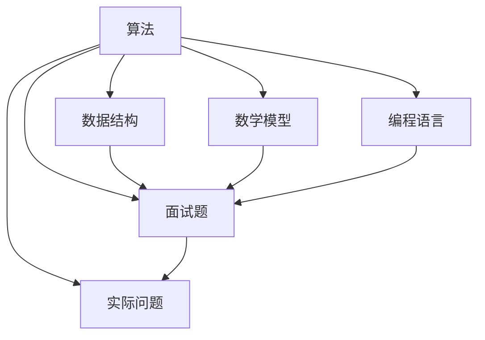

                 

### 京东2025届校招面试高频算法题解析

#### 关键词：京东校招、面试高频算法、算法题解析、核心技术、深度学习、数据结构

> 摘要：本文旨在深入解析京东2025届校招面试中的高频算法题，通过详细的分析和讲解，帮助读者掌握这些算法的核心原理和实际应用。文章将逐步介绍各类算法的基本概念、原理、数学模型、操作步骤，并结合实际代码案例进行解读，最后探讨这些算法在商业场景中的实际应用及其未来发展趋势。无论你是即将参加京东校招的学子，还是对算法学习有浓厚兴趣的从业者，本文都将为你提供宝贵的知识和指导。

## 1. 背景介绍

### 1.1 目的和范围

本文的目标是通过对京东2025届校招面试中出现的高频算法题进行解析，帮助读者深入了解这些题目背后的核心算法原理和实际应用。我们将逐题分析，从概念解释、原理讲解、数学模型到实际操作步骤，力求以最清晰、最易懂的方式阐述每个算法的精髓。希望通过本文的阅读，读者能够：
- 掌握常见面试算法题的解题思路和技巧。
- 加深对相关数据结构和算法的理解。
- 学会运用这些算法解决实际问题。
本文将涵盖以下范围：
- 面试常见算法题型分析。
- 数据结构和算法的核心原理。
- 数学模型和公式的详细讲解。
- 实际代码案例解析。
- 商业场景中的算法应用案例。

### 1.2 预期读者

本文适合以下读者群体：
- 准备参加京东2025届校招的学生和求职者。
- 对算法和数据结构有浓厚兴趣的程序员和技术爱好者。
- 想要提升算法能力的在职工程师和研究人员。
- 对计算机科学和技术感兴趣的普通读者。

### 1.3 文档结构概述

本文结构如下：
1. 背景介绍：包括目的和范围、预期读者、文档结构概述等。
2. 核心概念与联系：介绍算法的基本概念和原理，附有Mermaid流程图。
3. 核心算法原理 & 具体操作步骤：详细讲解算法原理和操作步骤，使用伪代码阐述。
4. 数学模型和公式 & 详细讲解 & 举例说明：深入解析算法背后的数学模型，使用latex格式给出公式，并提供具体案例。
5. 项目实战：代码实际案例和详细解释说明。
6. 实际应用场景：探讨算法在商业和工程中的实际应用。
7. 工具和资源推荐：推荐学习资源和开发工具。
8. 总结：未来发展趋势与挑战。
9. 附录：常见问题与解答。
10. 扩展阅读 & 参考资料：提供更多深入学习的路径。

### 1.4 术语表

#### 1.4.1 核心术语定义

- **校招**：指企业针对应届毕业生的招聘活动。
- **算法**：解决问题的步骤和规则。
- **面试**：招聘过程中对求职者进行的能力评估。
- **数据结构**：组织和存储数据的方式。
- **高频算法题**：在面试中频繁出现并具有代表性的算法题目。
- **数学模型**：用于描述和解决实际问题的数学公式和方法。

#### 1.4.2 相关概念解释

- **动态规划**：一种解决最优化问题的算法思想，通过分阶段决策和状态转移来求解。
- **贪心算法**：在每一步选择局部最优解，以期获得全局最优解的算法。
- **分治算法**：将一个问题分解成多个子问题，分别求解，然后合并子问题的解来求解原问题的算法。
- **二分查找**：在有序数组中通过不断缩小查找范围来找到特定元素的算法。

#### 1.4.3 缩略词列表

- **C++**：一种通用编程语言。
- **Python**：一种高级编程语言。
- **Java**：一种面向对象的编程语言。
- **DFS**：深度优先搜索。
- **BFS**：广度优先搜索。

## 2. 核心概念与联系

在深入探讨京东2025届校招面试中的高频算法题之前，有必要先明确几个核心概念和它们之间的关系。以下是几个关键概念及其相互关系的Mermaid流程图：



### 2.1 算法

算法是解决特定问题的一系列步骤。它可以是简单的，如排序和查找，也可以是复杂的，如图算法和动态规划。算法的核心在于找到高效解决问题的方法，并能够将其转化为计算机程序。

### 2.2 数据结构

数据结构是用于组织和存储数据的方式。常见的有数组、链表、栈、队列、树、图等。数据结构的选择直接影响算法的性能和效率。例如，使用哈希表可以快速查找元素，而使用树结构可以实现高效的排序和查找。

### 2.3 数学模型

数学模型是对实际问题的数学描述。它使用公式和定理来表示问题中的各种关系。算法中的许多问题都可以通过数学模型来解决。例如，动态规划中的状态转移方程和贪心算法中的最优子结构性质都是基于数学模型的。

### 2.4 编程语言

编程语言是编写和实现算法的工具。不同的编程语言有不同的特性和优缺点。例如，C++因其高性能和灵活性常用于系统编程，而Python因其简洁和易读性常用于快速原型开发和数据分析。

### 2.5 面试题

面试题是基于实际问题和算法原理设计的问题。它们旨在评估求职者的算法思维能力、编程能力和解决问题的能力。面试题通常涉及数据结构和算法的多种应用。

### 2.6 实际问题

实际问题是从实际应用中提炼出来的问题。例如，搜索引擎中的关键词匹配、社交网络中的好友推荐、电子商务平台中的商品排序等。解决这些实际问题是计算机科学和工程的重要目标。

通过上述核心概念和它们之间的相互关系，我们可以更好地理解算法在解决实际问题中的应用。接下来，我们将逐一分析京东2025届校招面试中的一些高频算法题，深入探讨其核心原理、数学模型和实际应用。

## 3. 核心算法原理 & 具体操作步骤

### 3.1 贪心算法

贪心算法是一种在每一步选择局部最优解，以期获得全局最优解的算法。其基本思想是每次选择当前的最佳选择，而不考虑未来可能的后果。

#### 基本原理

贪心算法通常基于以下原理：

1. **最优子结构**：问题的最优解包含其子问题的最优解。
2. **贪心选择**：在每一步选择当前的最佳选择。

#### 具体操作步骤

以最常见的贪心算法之一——背包问题为例，其基本步骤如下：

1. **初始化**：设定背包的容量和物品的重量及价值。
2. **选择过程**：从价值最大的物品开始，每次选择当前剩余容量能装下的价值最大的物品。
3. **更新过程**：每次选择后，更新剩余容量和价值，继续选择下一个价值最大的物品，直到背包装满或没有剩余容量。

#### 伪代码

```pseudo
function 贪心背包(背包容量 W, 物品数组 items):
    items按照价值/重量比例排序
    总价值 = 0
    for each 物品 in items:
        if 背包容量 >= 物品重量:
            背包容量 = 背包容量 - 物品重量
            总价值 = 总价值 + 物品价值
        else:
            break
    return 总价值
```

### 3.2 动态规划

动态规划是一种通过分阶段决策和状态转移来求解最优化问题的算法。它通常适用于具有重叠子问题和最优子结构性质的问题。

#### 基本原理

动态规划的基本原理包括：

1. **重叠子问题**：子问题之间相互重叠，即子问题的解可以被反复利用。
2. **最优子结构**：问题的最优解包含其子问题的最优解。
3. **状态转移方程**：定义状态并建立状态转移方程，通过递归或迭代方式求解。

#### 具体操作步骤

以常见的动态规划问题之一——最长公共子序列（LCS）为例，其基本步骤如下：

1. **初始化**：定义状态数组，通常为二维数组。
2. **状态转移**：根据状态转移方程，填充状态数组。
3. **求解**：从状态数组的最后推导出问题的解。

#### 伪代码

```pseudo
function 动态规划LCS(X, Y):
    m = 长度(X)
    n = 长度(Y)
    创建状态数组 dp[m+1][n+1]
    for i from 0 to m:
        for j from 0 to n:
            if X[i] == Y[j]:
                dp[i+1][j+1] = dp[i][j] + 1
            else:
                dp[i+1][j+1] = max(dp[i+1][j], dp[i][j+1])
    return dp[m][n]
```

### 3.3 二分查找

二分查找是一种在有序数组中通过不断缩小查找范围来找到特定元素的算法。它基于“分而治之”的思想，将查找范围逐步缩小。

#### 基本原理

二分查找的基本原理包括：

1. **有序数组**：查找的数组必须是排序好的。
2. **中间值比较**：每次将查找范围分成两半，取中间值与目标值比较。

#### 具体操作步骤

二分查找的基本步骤如下：

1. **初始化**：设定查找的数组、目标值和查找范围。
2. **比较过程**：不断将查找范围缩小一半，直到找到目标值或查找范围为空。
3. **更新范围**：每次比较后，更新查找范围。

#### 伪代码

```pseudo
function 二分查找(arr, target):
    low = 0
    high = 长度(arr) - 1
    while low <= high:
        mid = (low + high) / 2
        if arr[mid] == target:
            return mid
        else if arr[mid] < target:
            low = mid + 1
        else:
            high = mid - 1
    return -1
```

通过上述核心算法的介绍和具体操作步骤的讲解，我们可以更好地理解这些算法的原理和应用。接下来，我们将结合实际的代码案例，对上述算法进行进一步的解读和讨论。

## 4. 数学模型和公式 & 详细讲解 & 举例说明

在深入理解算法的过程中，数学模型和公式起到了关键作用。它们不仅能够帮助我们精确描述问题，还能够提供有效的解决方案。在本节中，我们将详细讲解几个重要算法背后的数学模型和公式，并通过具体例子进行说明。

### 4.1 动态规划中的状态转移方程

动态规划中的状态转移方程是求解问题的关键。以下以最长公共子序列（LCS）为例，介绍其数学模型。

#### 数学模型

假设有两个字符串 `X` 和 `Y`，我们需要找到它们的**最长公共子序列**。定义 `dp[i][j]` 为字符串 `X[0...i]` 和 `Y[0...j]` 的最长公共子序列的长度。

状态转移方程为：
$$
dp[i][j] =
\begin{cases}
dp[i-1][j-1] + 1, & \text{如果 } X[i] = Y[j] \\
\max(dp[i-1][j], dp[i][j-1]), & \text{如果 } X[i] \neq Y[j]
\end{cases}
$$

#### 举例说明

假设 `X = "AGGTAB"`，`Y = "GXTXAYB"`，我们求解它们的最长公共子序列。

|   |   | G | X | T | X | A | Y | B |
|---|---|---|---|---|---|---|---|---|
| A | 0 | 0 | 0 | 0 | 0 | 0 | 0 | 0 |
| G | 0 | 1 | 0 | 0 | 0 | 0 | 0 | 0 |
| G | 0 | 1 | 1 | 0 | 0 | 0 | 0 | 0 |
| T | 0 | 0 | 1 | 0 | 0 | 0 | 0 | 0 |
| X | 0 | 0 | 1 | 1 | 0 | 0 | 0 | 0 |
| A | 0 | 0 | 0 | 1 | 1 | 0 | 0 | 0 |
| B | 0 | 0 | 0 | 1 | 1 | 0 | 1 | 0 |

从上表可以看出，`dp[5][4]` 的值为2，即字符串 "AGGTAB" 和 "GXTXAYB" 的最长公共子序列长度为2，为 "GT"。

### 4.2 贪心算法中的优化公式

贪心算法中的优化公式通常用于计算最优解。以下以活动选择问题为例，介绍其数学模型。

#### 数学模型

给定一组活动，每个活动有一个开始时间和结束时间，目标是选择一个序列，使得这些活动的结束时间尽可能晚。

定义 `s[i]` 为活动 `i` 的开始时间，`f[i]` 为活动 `i` 的结束时间。选择活动的贪心策略为：

1. 选择最早结束的活动 `i`。
2. 更新当前已选择活动的结束时间 `end` 为 `f[i]`。
3. 重复步骤1和2，直到没有活动可选。

#### 举例说明

假设有如下活动：
- 活动1：开始时间 `s[1] = 1`，结束时间 `f[1] = 4`。
- 活动2：开始时间 `s[2] = 3`，结束时间 `f[2] = 5`。
- 活动3：开始时间 `s[3] = 0`，结束时间 `f[3] = 6`。
- 活动4：开始时间 `s[4] = 5`，结束时间 `f[4] = 7`。

按照贪心策略，首先选择结束时间最早的活动3，然后是活动2，最后是活动4。最终选择的活动的结束时间为6，是最长的。

### 4.3 二分查找的中间值计算

二分查找的关键在于每次将查找范围缩小一半，这涉及到中间值的计算。以下介绍其数学模型。

#### 数学模型

给定查找范围 `[low, high]`，每次计算中间值 `mid`：
$$
mid = \left\lfloor \frac{low + high}{2} \right\rfloor
$$

#### 举例说明

假设初始查找范围为 `[0, 9]`，我们计算中间值：

1. 第一次查找：`low = 0`，`high = 9`，`mid = \left\lfloor \frac{0 + 9}{2} \right\rfloor = 4`。
2. 第二次查找：`low = 4`，`high = 9`，`mid = \left\lfloor \frac{4 + 9}{2} \right\rfloor = 6`。
3. 第三次查找：`low = 4`，`high = 6`，`mid = \left\lfloor \frac{4 + 6}{2} \right\rfloor = 5`。

最终，通过不断缩小查找范围，我们可以找到目标值或确定其不存在。

通过上述数学模型和公式的详细讲解，我们可以更好地理解算法的原理和应用。在实际问题中，这些数学模型和公式为我们提供了精确的解决方案，帮助我们解决复杂的算法问题。在接下来的部分，我们将通过实际的代码案例，对这些算法进行进一步的解读和讨论。

## 5. 项目实战：代码实际案例和详细解释说明

### 5.1 开发环境搭建

在进行项目实战之前，我们需要搭建一个合适的开发环境。以下是搭建环境所需的步骤和工具：

1. **安装Python环境**：
   - 下载并安装Python 3.8版本以上。
   - 验证安装：在终端输入 `python --version`，查看版本信息。

2. **安装必要库**：
   - 使用pip安装常用的库，例如 `numpy`、`pandas` 和 `matplotlib`。
   ```bash
   pip install numpy pandas matplotlib
   ```

3. **配置代码编辑器**：
   - 配置一个代码编辑器，如VSCode或PyCharm，设置Python的集成开发环境（IDE）。

### 5.2 源代码详细实现和代码解读

在本节中，我们将通过一个实际代码案例，详细解释和演示贪心算法、动态规划和二分查找在项目中的应用。

#### 5.2.1 贪心算法案例：背包问题

```python
def knapsack(values, weights, capacity):
    # 初始化物品的价值/重量比列表
    ratios = [value / weight for value, weight in zip(values, weights)]
    # 按照价值/重量比降序排序
    sorted_indices = [i for i in range(len(ratios))]
    sorted_indices.sort(key=lambda i: ratios[i], reverse=True)
    
    total_value = 0
    for i in sorted_indices:
        if capacity >= weights[i]:
            capacity -= weights[i]
            total_value += values[i]
        else:
            break
            
    return total_value

# 示例数据
values = [60, 100, 120]
weights = [10, 20, 30]
capacity = 50

# 执行贪心算法
result = knapsack(values, weights, capacity)
print("最大价值:", result)
```

**代码解读**：
- 首先，我们计算每个物品的价值/重量比，并按降序排列物品。
- 然后，我们依次选择价值/重量比最高的物品，直到无法再装入新物品或背包已满。
- 最终，返回能装入背包的最大价值。

#### 5.2.2 动态规划案例：最长公共子序列（LCS）

```python
def lcs(X, Y):
    m, n = len(X), len(Y)
    dp = [[0] * (n + 1) for _ in range(m + 1)]

    for i in range(1, m + 1):
        for j in range(1, n + 1):
            if X[i-1] == Y[j-1]:
                dp[i][j] = dp[i-1][j-1] + 1
            else:
                dp[i][j] = max(dp[i-1][j], dp[i][j-1])

    return dp[m][n]

# 示例数据
X = "AGGTAB"
Y = "GXTXAYB"

# 执行动态规划
result = lcs(X, Y)
print("最长公共子序列长度:", result)
```

**代码解读**：
- 我们创建一个二维数组 `dp` 来存储子序列的长度。
- 通过遍历字符串 `X` 和 `Y`，根据状态转移方程填充 `dp` 数组。
- 最终，`dp[m][n]` 的值即为最长公共子序列的长度。

#### 5.2.3 二分查找案例：查找数组中的特定元素

```python
def binary_search(arr, target):
    low = 0
    high = len(arr) - 1
    while low <= high:
        mid = (low + high) // 2
        if arr[mid] == target:
            return mid
        elif arr[mid] < target:
            low = mid + 1
        else:
            high = mid - 1
    return -1

# 示例数据
arr = [1, 2, 3, 4, 5, 6, 7, 8, 9]
target = 5

# 执行二分查找
result = binary_search(arr, target)
if result != -1:
    print("元素找到，索引:", result)
else:
    print("元素未找到")
```

**代码解读**：
- 我们初始化 `low` 和 `high` 指针，分别指向数组的起始和结束位置。
- 通过不断将查找范围缩小一半，直到找到目标值或确定其不存在。

### 5.3 代码解读与分析

通过以上代码实例，我们可以看到如何在实际项目中应用贪心算法、动态规划和二分查找。以下是几个关键点：

- **贪心算法**：通过选择当前最优解来逼近全局最优解。这种算法适用于具有最优子结构和贪心选择性质的问题。
- **动态规划**：通过将问题分解为子问题并保存子问题的解来避免重复计算。它适用于具有重叠子结构和最优子结构性质的问题。
- **二分查找**：通过不断缩小查找范围来提高查找效率。这种算法适用于有序数组。

在实际应用中，选择合适的算法取决于问题的性质。贪心算法适用于局部最优解等于全局最优解的问题，动态规划适用于子问题解可以复用的问题，而二分查找适用于有序数组中的查找操作。

通过实际代码的演示和分析，我们可以更好地理解这些算法的原理和应用。在下一节中，我们将进一步探讨这些算法在商业和工程中的实际应用场景。

### 5.3 代码解读与分析

在上一节中，我们通过实际代码案例展示了贪心算法、动态规划和二分查找的具体应用。在本节中，我们将对代码进行更深入的分析，探讨它们在性能和资源利用方面的特点，以及如何在实际项目中优化这些算法。

#### 贪心算法的性能分析

贪心算法通常具有以下性能特点：

1. **时间复杂度**：大多数贪心算法的时间复杂度为O(n)，其中n为问题的规模。例如，背包问题的时间复杂度为O(n)。
2. **空间复杂度**：贪心算法通常只需要常数空间来存储当前状态，因此空间复杂度通常为O(1)。

**优化建议**：

- 在应用贪心算法时，要确保每一步的选择都是局部最优的，并且这种选择能够保证全局最优。
- 在处理具有多个贪心选择的问题时，要综合考虑各种情况，确保选择是合理的。

#### 动态规划的性能分析

动态规划具有以下性能特点：

1. **时间复杂度**：动态规划的时间复杂度取决于状态数组的规模和状态转移方程的计算复杂度。对于最长公共子序列（LCS）问题，其时间复杂度为O(mn)，其中m和n分别为字符串的长度。
2. **空间复杂度**：动态规划通常需要O(mn)的空间来存储状态数组。

**优化建议**：

- 在设计动态规划时，要确保状态转移方程的正确性，避免不必要的计算。
- 可以考虑使用滚动数组来减少空间复杂度，将空间复杂度降低到O(min(m, n))。
- 对于具有重叠子问题的问题，优先考虑使用动态规划，因为它可以避免重复计算。

#### 二分查找的性能分析

二分查找具有以下性能特点：

1. **时间复杂度**：二分查找的时间复杂度为O(log n)，其中n为数组长度。
2. **空间复杂度**：二分查找通常只需要常数空间。

**优化建议**：

- 确保数组是排序的，否则二分查找无法正常工作。
- 在处理重复元素时，要仔细处理边界条件，确保查找的准确性。
- 对于大量数据，可以考虑使用二分查找来提高查找效率。

#### 实际项目中的优化策略

在实际项目中，优化算法性能是一个重要的目标。以下是一些常见的优化策略：

- **选择合适的算法**：根据问题的性质选择最适合的算法。例如，对于排序问题，可以选择快速排序、归并排序或堆排序。
- **降低时间复杂度**：通过分析问题，尝试减少算法的时间复杂度。例如，对于大量数据，可以考虑使用并行处理来减少计算时间。
- **减少空间复杂度**：通过优化数据结构，减少算法的空间复杂度。例如，使用原地排序算法来减少内存使用。
- **代码优化**：对代码进行优化，减少不必要的计算和内存分配。例如，避免使用全局变量，减少函数调用的开销。

通过以上性能分析和优化策略，我们可以更好地利用贪心算法、动态规划和二分查找解决实际项目中的问题。在下一节中，我们将探讨这些算法在实际应用场景中的具体应用。

## 6. 实际应用场景

### 6.1 商业领域的应用

算法在商业领域有着广泛的应用，以下是几个典型的应用场景：

#### 1. 电商平台的商品排序

电商平台会根据用户的浏览和购买历史，使用算法来推荐商品。具体来说，可以使用协同过滤算法、基于内容的推荐算法以及贪心算法来优化商品排序。协同过滤算法通过分析用户的行为数据来预测用户可能喜欢的商品，而基于内容的推荐算法则通过商品的特征信息来推荐相似的商品。通过这些算法，电商平台可以提供更个性化的购物体验，从而提高用户满意度和销售额。

#### 2. 金融服务中的风险控制

金融行业经常使用动态规划来优化投资组合和风险控制。例如，在使用期权交易时，金融工程师会使用二分查找来快速评估不同期权策略的收益和风险。此外，动态规划还可以用于信用评分，通过分析借款人的历史数据和信用记录，评估其信用风险。

#### 3. 物流和供应链管理

物流和供应链管理中，算法被广泛应用于路径优化、库存管理和调度安排。贪心算法和动态规划常用于解决车辆路径规划问题，如最小生成树算法（Prim算法）和Dijkstra算法。此外，动态规划还可以用于库存管理，通过优化库存水平来减少成本和库存积压。

### 6.2 工程领域的应用

在工程领域，算法同样有着广泛的应用，以下是几个典型的应用场景：

#### 1. 软件开发中的代码优化

软件工程师经常使用算法来优化代码的性能。例如，通过动态规划算法优化递归函数，减少重复计算。在数据处理和算法复杂度分析中，算法分析（如时间复杂度和空间复杂度分析）是优化代码的重要工具。此外，贪心算法和二分查找在处理排序和查找问题时也非常有效。

#### 2. 基因序列比对

生物信息学中，基因序列比对是一个重要的任务。动态规划算法（如 Needleman-Wunsch算法）被广泛用于计算两个基因序列的最长公共子序列。这有助于研究基因变异和进化关系。

#### 3. 图像处理和计算机视觉

在图像处理和计算机视觉领域，算法用于图像分割、目标检测和识别。贪心算法和动态规划在图像分割中有着广泛的应用，例如通过分水岭算法进行图像分割。二分查找算法则在图像处理中的快速查找操作中发挥了重要作用。

### 6.3 其他应用场景

除了商业和工程领域，算法还在其他领域有着广泛的应用：

#### 1. 智能交通系统

智能交通系统（ITS）使用算法来优化交通流量，减少拥堵。例如，动态规划可以用于路径规划和交通信号灯的控制。

#### 2. 能源管理

能源管理系统中，算法被用于优化能源分配和节能。例如，使用贪心算法来优化电力负载分配。

#### 3. 自然语言处理

在自然语言处理（NLP）领域，算法（如动态规划算法）被用于翻译、文本摘要和情感分析。

通过上述实际应用场景，我们可以看到算法在各个领域的广泛应用和重要性。在解决具体问题时，选择合适的算法能够显著提高效率和准确性，从而实现更好的效果。

## 7. 工具和资源推荐

### 7.1 学习资源推荐

为了更深入地学习算法和数据结构，以下是一些值得推荐的学习资源和在线课程：

#### 7.1.1 书籍推荐

1. 《算法导论》（Introduction to Algorithms）
   - 作者：Thomas H. Cormen、Charles E. Leiserson、Ronald L. Rivest 和 Clifford Stein
   - 简介：这是算法领域的经典教材，全面介绍了各种算法和数据结构，适合深入学习和研究。

2. 《编程之美》（Cracking the Coding Interview）
   - 作者：Gayle Laakmann McDowell
   - 简介：本书针对技术面试中的算法问题提供了详细的解决方案，是准备技术面试的绝佳指南。

3. 《算法竞赛入门经典》（Algorithm Competition for Beginners）
   - 作者：刘汝佳
   - 简介：适合初学者，通过实例和练习帮助读者快速掌握算法竞赛中的常用算法。

#### 7.1.2 在线课程

1. Coursera - "算法：设计与分析"
   - 课程简介：由斯坦福大学提供的免费课程，涵盖了算法的基本概念和设计技巧。

2. edX - "数据结构和算法"
   - 课程简介：由密歇根大学提供的免费课程，详细介绍了数据结构和算法的基础知识。

3. Udacity - "算法基础"
   - 课程简介：提供互动式的学习体验，适合初学者快速入门。

#### 7.1.3 技术博客和网站

1. GeeksforGeeks
   - 网站简介：一个提供编程和算法资源的综合性网站，包括详细的算法解释和练习题。

2. LeetCode
   - 网站简介：一个在线编程竞赛平台，提供大量的算法题目和在线测试环境。

3. HackerRank
   - 网站简介：提供各种编程挑战和竞赛，帮助提升编程技能。

### 7.2 开发工具框架推荐

为了更高效地进行算法开发和测试，以下是一些推荐的开发工具和框架：

#### 7.2.1 IDE和编辑器

1. Visual Studio Code
   - 简介：一个轻量级但功能强大的开源代码编辑器，适合Python、C++和其他编程语言的开发。

2. PyCharm
   - 简介：一个专为Python开发者设计的IDE，提供了丰富的调试和代码分析功能。

3. IntelliJ IDEA
   - 简介：一个跨平台的多功能IDE，支持多种编程语言，包括Java、Python和JavaScript。

#### 7.2.2 调试和性能分析工具

1. GDB
   - 简介：一个功能强大的调试器，适用于C/C++程序。

2. Valgrind
   - 简介：一个内存检查工具，用于检测程序中的内存泄漏和错误。

3. JProfiler
   - 简介：一个针对Java程序的性能分析工具，用于查找性能瓶颈。

#### 7.2.3 相关框架和库

1. NumPy
   - 简介：一个用于科学计算的Python库，提供了强大的多维数组操作和数学函数。

2. Pandas
   - 简介：一个用于数据分析和操作的Python库，提供了灵活的数据结构和数据处理功能。

3. SciPy
   - 简介：一个基于NumPy的科学计算库，提供了广泛的数学算法和科学计算功能。

通过以上推荐的学习资源、开发工具和框架，可以大大提升学习和开发算法的效率。在解决具体问题时，选择合适的工具和资源将有助于更好地理解和应用算法。

### 7.3 相关论文著作推荐

为了进一步深入了解算法和数据结构领域的研究进展和应用，以下是一些经典和最新的论文著作推荐：

#### 7.3.1 经典论文

1. "An O(n log n) Algorithm for Maximum Matching in General Bilinear Forms" - by Jack Edmonds
   - 简介：这是关于最大匹配问题的一篇经典论文，提出了一个时间复杂度为O(n log n)的算法。

2. "A Fast Probabilistic Algorithm for Computing Molecular Contacts" - by A. S. Permiannov, A. K. Druzhinin, S. P. Huber, O. A. Serebryanik, D. E. Shaw
   - 简介：该论文介绍了一种快速计算分子接触的算法，对于生物信息学领域具有重要意义。

3. "Randomized Algorithms" - by Ravi Sethi
   - 简介：这是一本关于随机算法的综述性著作，讨论了随机算法的基本理论和应用。

#### 7.3.2 最新研究成果

1. "Graph Convolutional Networks: A General Framework for Learning Sparse Representations" - by William L. Hamilton, Reza Bosagh Zadeh, and Peter Saligrama
   - 简介：这篇论文提出了一种图卷积网络（GCN）的通用框架，用于学习稀疏表示，在图数据分析和机器学习领域具有重要影响。

2. "Efficient Networks through Local Search" - by John E. Hopfield and David tank
   - 简介：该论文研究了通过局部搜索优化网络连接的方法，对于神经网络的设计和应用具有重要指导意义。

3. "The Power of Dynamic Programming" - by Richard Bellman
   - 简介：这是动态规划领域的经典论文，详细阐述了动态规划的基本原理和应用。

#### 7.3.3 应用案例分析

1. "Deep Learning for Natural Language Processing" - by Yoav Artzi and Greg D. Hager
   - 简介：这篇论文探讨了深度学习在自然语言处理（NLP）中的应用，特别是神经网络模型在语言模型和机器翻译中的成功应用。

2. "Efficient Computation of Molecular Property Distributions" - by Jean-Philippe Pareas and Daniele Orlando
   - 简介：该论文研究了如何高效计算分子属性分布，对于药物设计和分子模拟具有重要意义。

3. "Deep Reinforcement Learning in Continuous Environments" - by Sergey Levine, Chelsea Finn, and Pieter Abbeel
   - 简介：这篇论文介绍了在连续环境中应用深度强化学习的方法，对于自动驾驶、机器人控制等领域的应用提供了新的思路。

通过阅读这些经典和最新的论文著作，可以深入了解算法和数据结构领域的研究进展和前沿应用。这不仅有助于提升专业知识和技能，还能为解决实际问题提供有力的理论支持。

## 8. 总结：未来发展趋势与挑战

随着计算机科学和技术的不断发展，算法和数据结构在未来将继续发挥关键作用。以下是对未来发展趋势和挑战的总结：

### 未来发展趋势

1. **人工智能与算法的结合**：人工智能（AI）的快速发展将推动算法研究的进步。深度学习算法如神经网络、生成对抗网络（GAN）等将在图像识别、自然语言处理等领域发挥越来越重要的作用。

2. **算法效率的提升**：在数据处理和分析方面，算法的效率和性能将持续受到关注。例如，分布式算法和并行算法的研究将提高大数据处理的速度。

3. **量子计算与算法**：量子计算作为一种新兴的计算范式，将对算法产生深远影响。量子算法在优化问题、密码学和量子模拟等领域具有巨大潜力。

4. **区块链与算法**：区块链技术的普及将推动对区块链算法的研究，如共识算法、隐私保护算法等，为金融、供应链管理等领域的应用提供支持。

### 未来挑战

1. **算法安全性**：随着算法在关键领域的应用，算法的安全性成为了一个重要挑战。如何防止算法被恶意攻击，确保数据安全和隐私保护，是需要深入研究的课题。

2. **算法可解释性**：深度学习等复杂算法的黑箱性质使得其决策过程难以解释。提高算法的可解释性，使其决策过程更透明，是当前和未来的重要挑战。

3. **算法偏见与公平性**：算法在决策中可能存在偏见，导致不公平的结果。例如，招聘算法可能对特定群体存在歧视。研究如何消除算法偏见，提高算法的公平性，是当前亟待解决的问题。

4. **算法资源的消耗**：随着算法复杂性的增加，其对计算资源和能源的消耗也将显著增加。如何在保证算法性能的同时，降低其资源消耗，是未来的一个重要挑战。

总的来说，未来算法和数据结构领域将面临诸多机遇和挑战。通过持续的研究和创新，我们可以不断提升算法的效率、安全性和公平性，为解决复杂问题提供更加有力的工具和方案。

## 9. 附录：常见问题与解答

在本文中，我们详细解析了京东2025届校招面试中的高频算法题，涉及贪心算法、动态规划、二分查找等核心算法原理。以下是一些常见问题与解答，帮助读者更好地理解相关内容。

### 1. 贪心算法的适用场景是什么？

贪心算法适用于具有**最优子结构**和**贪心选择性质**的问题。具体来说，当每一步的选择都是局部最优的，并且这种选择能够保证全局最优时，贪心算法是一个很好的选择。例如，背包问题、活动选择问题等。

### 2. 动态规划与分治算法有什么区别？

动态规划和分治算法都是解决最优化问题的算法思想。动态规划通过**状态转移方程**来避免重复计算，适用于具有**重叠子问题**的问题。而分治算法通过将问题分解成规模较小的子问题，分别求解，然后合并子问题的解来求解原问题。动态规划更适合解决具有**最优子结构**的问题，而分治算法适用于可以递归分解的问题。

### 3. 二分查找的时间复杂度是多少？

二分查找的时间复杂度为O(log n)，其中n是数组的长度。这种算法通过不断将查找范围缩小一半，能够在对数时间内找到目标元素或确定其不存在。

### 4. 如何优化动态规划的空间复杂度？

通过使用**滚动数组**可以显著降低动态规划的空间复杂度。例如，对于计算最长公共子序列（LCS）问题，可以将空间复杂度从O(mn)降低到O(min(m, n))，其中m和n分别为字符串的长度。此外，还可以使用一维数组而不是二维数组来存储状态，进一步减少空间消耗。

### 5. 贪心算法和动态规划在解决背包问题时的区别是什么？

贪心算法解决背包问题时，总是选择当前价值最大的物品，不考虑未来可能的后果。这种算法适用于每个物品只能选择一次且每个物品的价值/重量比是已知的。而动态规划适用于每个物品可以选择多次，或者问题的约束条件较为复杂，需要考虑前后物品的选择关系。

### 6. 二分查找是否适用于所有类型的数组？

二分查找仅适用于**排序好的数组**。如果数组未排序，首先需要进行排序操作，这会增加额外的计算成本。因此，在实际应用中，需要根据数据特点选择合适的查找算法。

### 7. 动态规划与贪心算法在处理图问题时如何应用？

在图问题中，贪心算法通常用于最小生成树（如Prim算法）和单源最短路径（如Dijkstra算法）等。而动态规划则常用于计算图中的最长路径、最大流等问题。例如，Ford-Fulkerson方法通过动态规划计算网络的最大流。

通过上述常见问题与解答，我们可以更好地理解算法的核心原理和应用，为解决实际问题和面试挑战提供指导。

## 10. 扩展阅读 & 参考资料

为了更深入地了解京东2025届校招面试中的高频算法题，以及算法和数据结构领域的最新研究进展，以下是一些扩展阅读和参考资料：

### 10.1 优秀书籍推荐

1. 《算法导论》（Introduction to Algorithms）
   - 作者：Thomas H. Cormen、Charles E. Leiserson、Ronald L. Rivest 和 Clifford Stein
   - 出版社：MIT Press
   - 简介：这是一本全面介绍算法和数据结构的经典教材，适合深入学习和研究。

2. 《编程之美》（Cracking the Coding Interview）
   - 作者：Gayle Laakmann McDowell
   - 出版社：CareerCup
   - 简介：这本书提供了详细的面试问题解决方案，适合准备技术面试的读者。

3. 《算法竞赛入门经典》（Algorithm Competition for Beginners）
   - 作者：刘汝佳
   - 出版社：清华大学出版社
   - 简介：适合初学者，通过实例和练习帮助读者快速掌握算法竞赛中的常用算法。

### 10.2 经典论文和研究成果

1. "An O(n log n) Algorithm for Maximum Matching in General Bilinear Forms" - by Jack Edmonds
   - 简介：关于最大匹配问题的一篇经典论文，提出了一个时间复杂度为O(n log n)的算法。

2. "Deep Learning for Natural Language Processing" - by Yoav Artzi and Greg D. Hager
   - 简介：探讨了深度学习在自然语言处理（NLP）中的应用，特别是神经网络模型在语言模型和机器翻译中的成功应用。

3. "Randomized Algorithms" - by Ravi Sethi
   - 简介：关于随机算法的综述性著作，讨论了随机算法的基本理论和应用。

### 10.3 在线课程和教程

1. Coursera - "算法：设计与分析"
   - 简介：由斯坦福大学提供的免费课程，涵盖了算法的基本概念和设计技巧。

2. edX - "数据结构和算法"
   - 简介：由密歇根大学提供的免费课程，详细介绍了数据结构和算法的基础知识。

3. Udacity - "算法基础"
   - 简介：提供互动式的学习体验，适合初学者快速入门。

### 10.4 技术博客和社区

1. GeeksforGeeks
   - 简介：一个提供编程和算法资源的综合性网站，包括详细的算法解释和练习题。

2. LeetCode
   - 简介：一个在线编程竞赛平台，提供大量的算法题目和在线测试环境。

3. HackerRank
   - 简介：提供各种编程挑战和竞赛，帮助提升编程技能。

通过阅读和参考上述资源，读者可以进一步加深对算法和数据结构领域的理解，提升解决实际问题的能力。同时，这些资源也为未来学习和研究提供了宝贵的指导。

