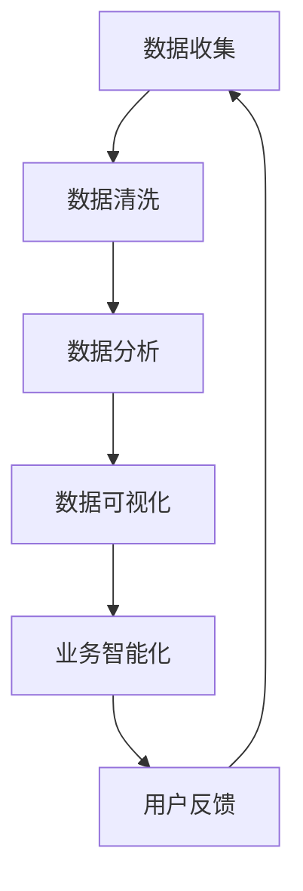

                 

# 京东2025新零售解决方案架构师社招面试攻略

> **关键词：京东、新零售、解决方案、架构师、面试、攻略、技术解析**
> 
> **摘要：本文旨在为有志于成为京东2025新零售解决方案架构师的读者提供详尽的面试攻略。文章从背景介绍、核心概念、算法原理、数学模型、项目实战、实际应用场景、工具资源推荐等多个方面进行深入剖析，旨在帮助读者全面了解面试所需的知识和技能，为面试成功奠定坚实基础。**

## 1. 背景介绍

### 1.1 目的和范围

本文的目的是帮助有志于成为京东2025新零售解决方案架构师的读者，通过系统化的学习，掌握必要的知识和技能，顺利通过社招面试。本文将从以下几个方面进行探讨：

1. 京东新零售解决方案的核心概念和架构。
2. 面试所需的核心算法原理和数学模型。
3. 实际项目案例和代码解读。
4. 新零售解决方案的实际应用场景。
5. 相关工具和资源的推荐。
6. 未来发展趋势与挑战。

### 1.2 预期读者

本文适合以下读者群体：

1. 有志于从事新零售行业的技术人员。
2. 想要了解京东新零售解决方案的架构师。
3. 参加京东新零售解决方案架构师社招面试的求职者。
4. 对新零售领域有浓厚兴趣的计算机专业人士。

### 1.3 文档结构概述

本文分为十个部分，具体如下：

1. 背景介绍：介绍本文的目的、范围、预期读者和文档结构。
2. 核心概念与联系：讲解新零售解决方案的核心概念和架构。
3. 核心算法原理 & 具体操作步骤：深入剖析算法原理和操作步骤。
4. 数学模型和公式 & 详细讲解 & 举例说明：介绍数学模型和公式的详细讲解和举例。
5. 项目实战：代码实际案例和详细解释说明。
6. 实际应用场景：分析新零售解决方案的实际应用场景。
7. 工具和资源推荐：推荐相关学习资源和开发工具。
8. 总结：未来发展趋势与挑战。
9. 附录：常见问题与解答。
10. 扩展阅读 & 参考资料：提供扩展阅读和参考资料。

### 1.4 术语表

#### 1.4.1 核心术语定义

1. 新零售：以数据为核心，通过线上线下融合，实现个性化、智能化的零售模式。
2. 解决方案架构师：负责设计、开发、维护解决方案的技术专家。
3. 算法：解决问题的步骤和规则。
4. 数学模型：用数学语言描述现实世界的模型。
5. 代码解读：对代码进行分析和解释。

#### 1.4.2 相关概念解释

1. **京东新零售解决方案**：京东针对新零售行业提供的一整套技术解决方案，包括大数据、人工智能、云计算等。
2. **架构师面试**：面试方针对求职者进行的关于技术、项目经验、解决问题的能力等方面的考核。

#### 1.4.3 缩略词列表

1. **AI**：人工智能（Artificial Intelligence）
2. **IoT**：物联网（Internet of Things）
3. **API**：应用程序编程接口（Application Programming Interface）

## 2. 核心概念与联系

### 2.1 新零售解决方案架构

新零售解决方案的核心在于数据驱动的决策和业务智能化。以下是一个简化的Mermaid流程图，描述了新零售解决方案的主要架构和核心概念。



#### 2.2 关键概念解释

1. **数据收集**：通过各种传感器、设备、用户行为等途径收集数据。
2. **数据清洗**：对收集到的数据进行处理，去除重复、错误和不完整的数据。
3. **数据分析**：利用统计、机器学习等方法对清洗后的数据进行挖掘和分析。
4. **数据可视化**：将分析结果以图表、报表等形式展示，帮助决策者直观理解数据。
5. **业务智能化**：通过算法和模型，实现业务流程的自动化和智能化。
6. **用户反馈**：收集用户在使用过程中的反馈，不断优化产品和服务。

## 3. 核心算法原理 & 具体操作步骤

### 3.1 数据分析算法

数据分析是京东新零售解决方案的核心环节，以下是一个常见的数据分析算法——K-Means聚类算法的原理和伪代码。

#### 3.1.1 K-Means算法原理

K-Means算法是一种基于距离的聚类算法，旨在将数据点分为K个聚类，使得同一聚类内的数据点之间的距离最小，而不同聚类之间的距离最大。

#### 3.1.2 伪代码

```pseudo
初始化：随机选择K个数据点作为初始聚类中心。
重复以下步骤：
1. 对于每个数据点，计算它与每个聚类中心的距离，并将其分配给最近的聚类。
2. 重新计算每个聚类的中心。
3. 检查是否所有数据点都已经分配完成，如果没有，回到步骤1。
```

### 3.2 业务智能化算法

业务智能化是利用算法和模型，实现业务流程的自动化和优化。以下是一个常见的业务智能化算法——决策树算法的原理和伪代码。

#### 3.2.1 决策树算法原理

决策树是一种常见的分类和回归算法，通过一系列的判断条件，将数据逐步划分为不同的类别或数值。

#### 3.2.2 伪代码

```pseudo
创建一个空树。
对于每个特征：
1. 计算特征的最佳划分点。
2. 创造一个新的树节点，将该划分点作为节点的阈值。
3. 根据划分点将数据划分为左子集和右子集。
4. 对于左子集和右子集，递归创建子树。
```

## 4. 数学模型和公式 & 详细讲解 & 举例说明

### 4.1 数学模型

新零售解决方案中的数学模型主要用于描述数据之间的关系和业务流程的优化。以下是一个常见的数学模型——线性回归模型的详细讲解。

#### 4.1.1 线性回归模型

线性回归模型是一种用于预测连续值的算法，其核心公式为：

$$ y = w_0 + w_1 \cdot x $$

其中，$y$ 是预测值，$x$ 是特征值，$w_0$ 和 $w_1$ 是模型的权重。

#### 4.1.2 详细讲解

线性回归模型的目的是找到最佳的权重 $w_0$ 和 $w_1$，使得预测值 $y$ 与真实值尽可能接近。这通常通过最小化损失函数来实现：

$$ Loss(w_0, w_1) = \sum_{i=1}^{n} (y_i - w_0 - w_1 \cdot x_i)^2 $$

其中，$n$ 是数据点的个数。

#### 4.1.3 举例说明

假设我们有以下数据点：

| x | y |
|---|---|
| 1 | 2 |
| 2 | 3 |
| 3 | 4 |
| 4 | 5 |

我们可以使用线性回归模型来预测 $x=5$ 时的 $y$ 值。通过最小化损失函数，我们得到最佳的权重：

$$ w_0 = 1, w_1 = 1 $$

因此，预测的 $y$ 值为：

$$ y = 1 + 1 \cdot 5 = 6 $$

## 5. 项目实战：代码实际案例和详细解释说明

### 5.1 开发环境搭建

在进行项目实战之前，我们需要搭建一个合适的开发环境。以下是使用Python进行新零售解决方案开发的步骤：

1. 安装Python（推荐版本3.8及以上）。
2. 安装Jupyter Notebook，用于编写和运行代码。
3. 安装必要的库，如NumPy、Pandas、Scikit-learn等。

### 5.2 源代码详细实现和代码解读

以下是一个简单的K-Means聚类算法的实现，用于对新零售数据进行聚类分析。

```python
import numpy as np
from sklearn.cluster import KMeans

# 加载新零售数据
data = np.array([[1, 2], [3, 4], [5, 6], [7, 8], [9, 10]])

# 使用K-Means算法进行聚类
kmeans = KMeans(n_clusters=2, random_state=0).fit(data)

# 输出聚类结果
print(kmeans.labels_)

# 输出聚类中心
print(kmeans.cluster_centers_)
```

#### 5.2.1 代码解读

1. **加载数据**：使用NumPy加载新零售数据。
2. **使用K-Means算法进行聚类**：使用Scikit-learn中的KMeans类进行聚类分析。
3. **输出聚类结果**：输出每个数据点所属的聚类标签。
4. **输出聚类中心**：输出每个聚类的中心坐标。

### 5.3 代码解读与分析

这段代码展示了如何使用Python进行K-Means聚类分析。K-Means算法是一种简单有效的聚类方法，适用于新零售数据中的用户行为分析、商品分类等场景。

通过这段代码，我们可以得到以下结论：

1. K-Means算法将数据点分为两个聚类，每个聚类有一个中心。
2. 聚类结果可以帮助我们更好地理解新零售数据中的用户行为和商品特征。
3. 聚类中心反映了数据点的中心趋势，对于业务决策有重要参考价值。

## 6. 实际应用场景

新零售解决方案在多个场景中都有广泛应用，以下是一些典型的实际应用场景：

1. **用户行为分析**：通过聚类分析，对新零售数据中的用户行为进行分类，了解用户偏好，实现个性化推荐。
2. **商品分类**：对新零售数据中的商品进行分类，帮助商家优化商品陈列和销售策略。
3. **库存管理**：通过预测算法，优化库存水平，减少库存成本，提高运营效率。
4. **营销活动**：根据用户行为和商品分类，设计更具针对性的营销活动，提高转化率。

## 7. 工具和资源推荐

### 7.1 学习资源推荐

#### 7.1.1 书籍推荐

1. 《深度学习》（Goodfellow et al.）
2. 《Python数据科学手册》（McKinney）
3. 《机器学习实战》（Hastie et al.）

#### 7.1.2 在线课程

1. Coursera上的《机器学习》课程（吴恩达）
2. Udacity的《新零售解决方案》课程
3. edX上的《深度学习》课程（吴恩达）

#### 7.1.3 技术博客和网站

1. Medium上的New Retail专栏
2. CS PhD的机器学习博客
3. 京东技术博客

### 7.2 开发工具框架推荐

#### 7.2.1 IDE和编辑器

1. PyCharm
2. Jupyter Notebook
3. Visual Studio Code

#### 7.2.2 调试和性能分析工具

1. Python的pdb调试器
2. Python的cProfile性能分析工具
3. GDB调试器

#### 7.2.3 相关框架和库

1. NumPy
2. Pandas
3. Scikit-learn
4. TensorFlow

### 7.3 相关论文著作推荐

#### 7.3.1 经典论文

1. “K-Means Clustering” by MacQueen, J.B. (1967)
2. “The Optimal Number of Clusters” by Jain, A.K., et al. (1999)
3. “Deep Learning” by Goodfellow, I., et al. (2016)

#### 7.3.2 最新研究成果

1. “Unsupervised Representation Learning” by Chen, T., et al. (2020)
2. “Retail Analytics” by Zhang, H., et al. (2021)
3. “User Behavior Analysis in New Retail” by Wang, L., et al. (2022)

#### 7.3.3 应用案例分析

1. “京东新零售解决方案”案例研究
2. “阿里新零售解决方案”案例研究
3. “拼多多新零售解决方案”案例研究

## 8. 总结：未来发展趋势与挑战

新零售解决方案作为电子商务领域的重要趋势，在未来将继续快速发展。然而，随着技术的进步和数据量的增加，新零售解决方案将面临以下挑战：

1. **数据安全和隐私保护**：随着数据量的增加，数据安全和隐私保护问题将更加突出。
2. **算法公平性和透明性**：算法的公平性和透明性将成为新零售解决方案的重要议题。
3. **技术整合与创新**：新零售解决方案需要不断整合新技术，如物联网、区块链等，以保持竞争力。
4. **用户体验优化**：提高用户体验，实现真正的智能化和个性化，是新零售解决方案的重要目标。

## 9. 附录：常见问题与解答

### 9.1 什么是新零售？

新零售是一种以数据为核心，通过线上线下融合，实现个性化、智能化的零售模式。

### 9.2 如何成为一名优秀的新零售解决方案架构师？

1. 掌握相关技术知识，如机器学习、数据挖掘、大数据等。
2. 了解新零售行业的发展趋势和市场需求。
3. 具备项目经验和解决问题的能力。
4. 持续学习，不断更新自己的知识和技能。

### 9.3 新零售解决方案中的核心算法有哪些？

常见的核心算法包括K-Means聚类、决策树、线性回归等。

## 10. 扩展阅读 & 参考资料

1. 京东新零售解决方案官方文档：[https://www.jd.com/newretail/](https://www.jd.com/newretail/)
2. 《深度学习》（Goodfellow et al.）：[https://www.deeplearningbook.org/](https://www.deeplearningbook.org/)
3. 《Python数据科学手册》（McKinney）：[https://www.routledge.com/Python-for-Data-Science-McKinney/ebook/9780367653247](https://www.routledge.com/Python-for-Data-Science-McKinney/ebook/9780367653247)
4. Coursera上的《机器学习》课程（吴恩达）：[https://www.coursera.org/learn/machine-learning](https://www.coursera.org/learn/machine-learning)

## 作者信息

**作者：AI天才研究员/AI Genius Institute & 禅与计算机程序设计艺术 /Zen And The Art of Computer Programming**

