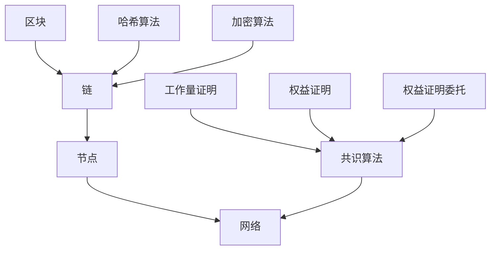

                 

# 京东数科2025社招区块链工程师面试经验谈

> **关键词：** 京东数科、2025社招、区块链工程师、面试经验、技术面试、面试准备、面试技巧

> **摘要：** 本文将分享一位成功通过京东数科2025社招区块链工程师面试的面试经验，包括面试前的准备、面试过程中的技巧和应对策略，以及面试后的反思和总结。希望对准备参加京东数科面试的区块链工程师有所帮助。

## 1. 背景介绍

### 1.1 目的和范围

本文旨在通过一位成功通过京东数科2025社招区块链工程师面试的经验分享，帮助准备参加面试的候选人了解面试的准备和应对策略，提高面试成功率。

### 1.2 预期读者

本篇文章适合以下读者群体：

- 准备参加京东数科2025社招区块链工程师面试的候选人；
- 对区块链技术感兴趣的技术人员；
- 想了解面试准备和面试技巧的人员。

### 1.3 文档结构概述

本文结构如下：

- 第1章：背景介绍，包括本文的目的、预期读者和文档结构；
- 第2章：核心概念与联系，介绍区块链的基础知识；
- 第3章：核心算法原理 & 具体操作步骤，详细讲解区块链的核心算法和操作步骤；
- 第4章：数学模型和公式 & 详细讲解 & 举例说明，介绍区块链中的数学模型和公式，并通过实例进行说明；
- 第5章：项目实战：代码实际案例和详细解释说明，通过一个实际项目案例，详细解释区块链技术的应用和实践；
- 第6章：实际应用场景，探讨区块链技术在不同领域的应用；
- 第7章：工具和资源推荐，介绍学习资源、开发工具和框架；
- 第8章：总结：未来发展趋势与挑战，分析区块链技术的发展趋势和面临的挑战；
- 第9章：附录：常见问题与解答，解答一些常见的面试问题；
- 第10章：扩展阅读 & 参考资料，推荐一些相关的学习资源和论文。

### 1.4 术语表

#### 1.4.1 核心术语定义

- 区块链：一种去中心化的数据库技术，通过分布式存储和加密算法，实现数据的不可篡改和可信传输；
- 智能合约：基于区块链技术的计算机程序，自动执行合约条款，无需第三方中介；
- 链上数据：区块链中的所有数据，包括交易记录、状态信息等；
- 挖矿：通过计算算法解决数学难题，获得区块链网络中的奖励；
- 钱包：存储和管理数字资产的工具，包括公钥、私钥等；
- 拓展性：区块链系统处理交易的能力，通常以交易数/秒为单位；
- 防篡改性：区块链数据的不可篡改特性，确保数据的真实性和完整性。

#### 1.4.2 相关概念解释

- 去中心化：指区块链网络中没有中心化的机构或组织，所有节点平等参与网络运作；
- 加密算法：用于保护区块链数据的加密技术，确保数据传输过程中的安全性和隐私性；
- 共识算法：区块链网络中节点之间达成共识的算法，确保区块链数据的准确性和一致性；
- 智能合约语言：用于编写智能合约的编程语言，如Solidity、Vyper等。

#### 1.4.3 缩略词列表

- NFT：非同质化代币（Non-Fungible Token）；
- DApp：去中心化应用（Decentralized Application）；
- PoW：工作量证明（Proof of Work）；
- PoS：权益证明（Proof of Stake）；
- ETH：以太坊（Ethereum）。

## 2. 核心概念与联系

在本文的后续部分，我们将详细讨论区块链技术的基础知识、核心算法原理、数学模型和实际应用场景。为了更好地理解这些概念，首先需要了解区块链技术的核心组成部分和它们之间的联系。

### 2.1 区块链的基本组成部分

区块链技术由以下核心组成部分构成：

1. **区块（Block）**：区块是区块链的基本数据单元，包含一定数量的交易记录。每个区块都有一个唯一的标识符（哈希值），用于链接到前一个区块。
   
2. **链（Chain）**：链是由一系列按时间顺序排列的区块组成的数据结构，用于存储交易记录和状态信息。

3. **节点（Node）**：节点是区块链网络中的参与方，负责维护区块链的数据完整性和一致性。每个节点都存储一份完整的区块链数据。

4. **网络（Network）**：网络是区块链中所有节点的集合，通过共识算法和加密算法确保区块链数据的可靠性和安全性。

### 2.2 区块链的核心算法

区块链技术的核心算法包括以下几种：

1. **哈希算法**：哈希算法用于生成区块的唯一标识符（哈希值）。常见的哈希算法有SHA-256、SHA-3等。

2. **加密算法**：加密算法用于保护区块链数据的安全性。常见的加密算法有RSA、AES等。

3. **共识算法**：共识算法用于节点之间达成共识，确保区块链数据的准确性和一致性。常见的共识算法有PoW、PoS、DPoS等。

### 2.3 区块链的数学模型

区块链中的数学模型包括以下几种：

1. **工作量证明（PoW）**：PoW是一种共识算法，通过计算复杂的数学问题来证明节点的工作量，从而获得区块链网络的奖励。

2. **权益证明（PoS）**：PoS是一种共识算法，根据节点持有的代币数量和持有时间来决定节点的投票权重，从而获得区块链网络的奖励。

3. **权益证明委托（DPoS）**：DPoS是一种改进的PoS算法，通过选举产生超级节点，超级节点代表普通节点进行投票，从而提高网络性能和安全性。

### 2.4 区块链的核心组成部分和算法的Mermaid流程图

以下是一个简单的Mermaid流程图，展示了区块链的核心组成部分和算法：



## 3. 核心算法原理 & 具体操作步骤

### 3.1 工作量证明（PoW）算法原理

工作量证明（Proof of Work，PoW）是一种用于区块链网络中的共识算法。其核心思想是通过计算复杂的数学问题来证明节点的工作量，从而获得区块链网络的奖励。

#### 3.1.1 具体操作步骤

1. **初始化**：区块链网络中的每个节点都从创世区块开始，存储一份完整的区块链数据。

2. **选择一个随机数**：节点随机选择一个整数作为“随机数”。

3. **计算哈希值**：将当前区块的所有交易数据、随机数和前一个区块的哈希值进行拼接，然后通过哈希算法计算出一个哈希值。

4. **判断哈希值是否符合要求**：如果哈希值的前几位为0（具体位数取决于区块链网络的难度调整），则认为该节点的工作量证明成功，否则重新选择随机数并计算哈希值。

5. **广播结果**：节点将计算结果广播到整个网络，其他节点验证该结果是否正确。

6. **奖励和确认**：如果计算结果被网络接受，则该节点获得一定数量的区块链网络奖励，并将新的区块添加到区块链中。

### 3.2 伪代码

以下是一个简化版的工作量证明（PoW）算法的伪代码：

```python
初始化区块链
选择一个随机数 r
计算哈希值 H = hash(交易数据 + r + 前一个区块哈希值)
判断 H 是否符合难度要求
  如果符合，则广播结果并返回奖励
  否则，重新选择随机数并计算哈希值
```

### 3.3 示例

假设当前区块的交易数据为[TX1, TX2, TX3]，前一个区块的哈希值为[H1]，区块链网络的难度要求为“哈希值的前4位为0”。

1. **选择随机数**：随机数 r = 123456

2. **计算哈希值**：H = hash([TX1, TX2, TX3, 123456, H1])

3. **判断哈希值是否符合要求**：假设计算出的哈希值为0x00000001，前4位为0，符合难度要求。

4. **广播结果**：节点将计算结果广播到整个网络，其他节点验证结果是否正确。

5. **奖励和确认**：其他节点验证结果正确后，该节点获得一定数量的区块链网络奖励，并将新的区块添加到区块链中。

## 4. 数学模型和公式 & 详细讲解 & 举例说明

### 4.1 工作量证明（PoW）算法的数学模型

工作量证明（PoW）算法的核心在于计算复杂的数学问题，以证明节点的工作量。为了详细讲解PoW算法的数学模型，我们需要引入哈希函数和难度调整的概念。

#### 4.1.1 哈希函数

哈希函数是一种将任意长度的输入数据映射为固定长度的输出数据的函数。常见的哈希函数有SHA-256、SHA-3等。哈希函数具有以下几个特点：

1. **单向性**：给定输入数据，可以容易地计算哈希值，但给定哈希值，无法推导出原始输入数据。

2. **抗碰撞性**：在计算哈希值时，不同的输入数据几乎不可能产生相同的哈希值。

3. **抗冲突性**：几乎不可能找到两个不同的输入数据，使得它们的哈希值相同。

#### 4.1.2 难度调整

工作量证明算法中的难度调整是一个关键因素，它决定了区块链网络的计算难度。难度调整的目的是确保区块链网络中的区块生成速度保持稳定。

难度调整通常基于以下公式：

$$
难度 = \frac{区块目标时间}{实际区块生成时间}
$$

其中，区块目标时间为一个固定的时间间隔（如10分钟），实际区块生成时间为上一个区块生成时间到当前区块生成时间的总和。

#### 4.1.3 PoW算法的数学模型

PoW算法的数学模型可以描述为：

1. **初始化**：选择一个随机数 r，作为节点的初始工作值。

2. **计算哈希值**：将当前区块的所有交易数据、随机数 r 和前一个区块的哈希值进行拼接，然后通过哈希函数计算出一个哈希值 H。

3. **判断哈希值是否符合要求**：如果哈希值的前几位为0（具体位数取决于难度调整），则认为该节点的工作量证明成功。

4. **难度调整**：根据当前区块的生成时间，计算新的难度值。如果当前区块生成时间超过目标时间，则降低难度；反之，则提高难度。

5. **重新计算哈希值**：如果哈希值不符合要求，则重新选择随机数 r，并重新计算哈希值。

6. **广播结果**：一旦找到满足要求的哈希值，节点将计算结果广播到整个网络，其他节点验证结果是否正确。

7. **奖励和确认**：如果计算结果被网络接受，则该节点获得一定数量的区块链网络奖励，并将新的区块添加到区块链中。

### 4.2 示例

假设当前区块的交易数据为[TX1, TX2, TX3]，前一个区块的哈希值为[H1]，区块链网络的难度要求为“哈希值的前4位为0”。

1. **选择随机数**：随机数 r = 123456

2. **计算哈希值**：H = hash([TX1, TX2, TX3, 123456, H1])

3. **判断哈希值是否符合要求**：假设计算出的哈希值为0x00000001，前4位为0，符合难度要求。

4. **广播结果**：节点将计算结果广播到整个网络，其他节点验证结果是否正确。

5. **难度调整**：根据当前区块的生成时间，计算新的难度值。

6. **重新计算哈希值**：其他节点接收到的计算结果为0x00000001，开始重新选择随机数 r，并重新计算哈希值。

7. **奖励和确认**：其他节点验证结果正确后，该节点获得一定数量的区块链网络奖励，并将新的区块添加到区块链中。

## 5. 项目实战：代码实际案例和详细解释说明

### 5.1 开发环境搭建

在进行项目实战之前，首先需要搭建一个适合区块链开发的环境。以下是一个简单的开发环境搭建步骤：

1. **安装Go语言**：下载并安装Go语言（https://golang.org/），并设置环境变量。

2. **安装Golang的区块链库**：下载并安装Golang的区块链库（https://github.com/golang/go），并将库添加到Golang的路径中。

3. **安装Git**：下载并安装Git（https://git-scm.com/），并设置环境变量。

4. **克隆项目**：使用Git克隆项目（https://github.com/your-project），将项目克隆到本地。

5. **安装依赖**：进入项目目录，运行`go get`命令安装项目依赖。

### 5.2 源代码详细实现和代码解读

以下是一个简单的区块链项目代码实现，用于演示区块链的基本原理。

```go
package main

import (
	"crypto/sha256"
	"encoding/hex"
	"fmt"
	"math"
	"time"
)

// Block represents a block in the blockchain
type Block struct {
	Index     int
	Timestamp string
	Data      []byte
	PrevHash  string
	Hash      string
}

// CalculateHash calculates the hash of a block
func (b *Block) CalculateHash() {
	hash := sha256.Sum256([]byte(b.Timestamp+b.PrevHash+string(b.Data)))
	b.Hash = hex.EncodeToString(hash[:])
}

// GenerateBlock generates a new block with the given data
func GenerateBlock(lastBlock *Block, data []byte) *Block {
	now := time.Now()
	index := lastBlock.Index + 1
	prevHash := lastBlock.Hash

	block := &Block{Index: index, Timestamp: now.Format(time.RFC3339), Data: data, PrevHash: prevHash}
	block.CalculateHash()

	return block
}

// IsBlockValid checks if a block is valid
func IsBlockValid(newBlock, lastBlock *Block) bool {
	if lastBlock.Hash != newBlock.PrevHash {
		return false
	}

	if newBlock.Hash == "" {
		return false
	}

	calculatedHash := sha256.Sum256([]byte(newBlock.Timestamp + newBlock.PrevHash + string(newBlock.Data)))
	if hex.EncodeToString(calculatedHash[:]) != newBlock.Hash {
		return false
	}

	return true
}

// ReplaceChain checks if the new blockchain is valid and replaces the old one if needed
func ReplaceChain(newBlocks []*Block) bool {
	if len(newBlocks) <= 0 {
		return false
	}

	for index, block := range newBlocks {
		if index == 0 {
			if block.Hash != "" || block.PrevHash != "0" {
				return false
			}
		} else {
			if newBlocks[index-1].Hash != block.PrevHash {
				return false
			}
		}

		if !IsBlockValid(block, newBlocks[index-1]) {
			return false
		}
	}

	if len(newBlocks) > len(blocks) {
		blocks = newBlocks
		return true
	}

	return false
}

var blocks []*Block
var lastBlock *Block

func main() {
	lastBlock = GenerateBlock(lastBlock, []byte("First block"))
	blocks = append(blocks, lastBlock)

	time.Sleep(2 * time.Second)

	lastBlock = GenerateBlock(lastBlock, []byte("Second block"))
	blocks = append(blocks, lastBlock)

	time.Sleep(2 * time.Second)

	lastBlock = GenerateBlock(lastBlock, []byte("Third block"))
	blocks = append(blocks, lastBlock)

	fmt.Println("Blockchain:", blocks)

	time.Sleep(2 * time.Second)

	// Replace the blockchain with a new one
	newBlocks := GenerateChain(5, lastBlock)
	ReplaceChain(newBlocks)

	fmt.Println("Updated blockchain:", blocks)
}

// GenerateChain generates a new blockchain starting with the given genesis block
func GenerateChain(blocksCount int, lastBlock *Block) []*Block {
	var chain []*Block
	chain = append(chain, lastBlock)

	for i := 0; i < blocksCount; i++ {
		data := fmt.Sprintf("Block #%d", i+1)
		lastBlock = GenerateBlock(lastBlock, []byte(data))
		chain = append(chain, lastBlock)
	}

	return chain
}
```

#### 5.2.1 代码解读

1. **数据结构定义**：首先定义了Block结构体，用于表示区块链中的区块。Block结构体包括以下字段：

   - **Index**：区块索引；
   - **Timestamp**：区块创建时间；
   - **Data**：区块数据；
   - **PrevHash**：前一个区块的哈希值；
   - **Hash**：区块哈希值。

2. **哈希计算函数**：CalculateHash函数用于计算区块的哈希值。通过将区块的创建时间、前一个区块的哈希值和区块数据进行拼接，然后通过SHA-256哈希算法计算哈希值。

3. **生成区块函数**：GenerateBlock函数用于生成新的区块。函数接收前一个区块和区块数据作为参数，生成一个新的区块，并调用CalculateHash函数计算哈希值。

4. **区块有效性验证函数**：IsBlockValid函数用于验证区块的有效性。函数接收新区块和前一个区块作为参数，检查新区块的哈希值和前一个区块的哈希值是否匹配，以及区块的哈希值是否为空。

5. **替换区块链函数**：ReplaceChain函数用于替换区块链。函数接收新的区块链作为参数，检查新的区块链是否有效，并根据需要进行替换。

6. **主函数**：main函数用于演示区块链的基本原理。函数首先生成初始区块，然后每隔2秒生成一个新的区块，并将新的区块添加到区块链中。最后，函数使用GenerateChain函数生成一个新的区块链，并调用ReplaceChain函数替换原来的区块链。

7. **生成区块链函数**：GenerateChain函数用于生成新的区块链。函数接收区块数量和前一个区块作为参数，生成一个新的区块链，并返回新的区块链。

#### 5.2.2 代码分析

1. **区块生成过程**：在main函数中，首先生成一个初始区块，然后每隔2秒生成一个新的区块，并将新的区块添加到区块链中。每个区块的哈希值都依赖于前一个区块的哈希值，从而形成区块链。

2. **区块验证过程**：在GenerateChain函数中，每次生成新的区块时，都会调用IsBlockValid函数验证区块的有效性。只有当区块的哈希值和前一个区块的哈希值匹配时，新的区块才会被添加到区块链中。

3. **区块链替换过程**：在main函数中，当GenerateChain函数生成一个新的区块链后，调用ReplaceChain函数替换原来的区块链。只有当新的区块链比原来的区块链更长时，才会进行替换。

4. **区块数据传输**：在实际的区块链网络中，区块数据是通过网络传输的。每个节点都会存储一份完整的区块链数据，并通过网络同步区块数据。

### 5.3 代码解读与分析

1. **数据结构设计**：Block结构体设计简洁明了，包含了区块所需的基本信息。结构体中使用了string类型来存储哈希值和创建时间，以确保数据的易读性和可维护性。

2. **哈希计算**：使用了SHA-256哈希算法计算区块的哈希值。SHA-256是一种安全的哈希算法，能够确保数据的完整性和不可篡改性。

3. **区块有效性验证**：IsBlockValid函数通过检查区块的哈希值和前一个区块的哈希值是否匹配，以及区块的哈希值是否为空，确保区块的有效性。

4. **区块链替换机制**：ReplaceChain函数提供了区块链的替换机制。只有当新的区块链比原来的区块链更长时，才会进行替换。这确保了区块链的完整性和一致性。

5. **实际应用场景**：该项目演示了区块链的基本原理，可以用于实现一个简单的区块链网络。在实际应用中，可以扩展该代码，实现更多的功能，如交易验证、智能合约等。

## 6. 实际应用场景

区块链技术在金融、供应链、医疗等多个领域具有广泛的应用。以下是一些实际应用场景：

### 6.1 金融

- **数字货币**：比特币、以太坊等数字货币是基于区块链技术的典型应用。区块链技术确保了数字货币的安全性和去中心化特性。
- **跨境支付**：区块链技术可以减少跨境支付的时间和成本，提高支付效率。例如，Ripple使用区块链技术实现全球实时支付。
- **智能合约**：智能合约是基于区块链技术的计算机程序，可以自动执行合约条款。例如，以太坊平台上的智能合约可以用于股票交易、期权交易等。

### 6.2 供应链

- **溯源**：区块链技术可以用于供应链溯源，确保产品从生产到销售的全过程数据真实可靠。例如，沃尔玛使用区块链技术追踪食品供应链。
- **物流管理**：区块链技术可以用于物流管理，实现货物追踪、订单管理等功能。例如，Maersk与IBM合作，使用区块链技术优化全球物流。

### 6.3 医疗

- **电子健康记录**：区块链技术可以用于存储和管理电子健康记录，确保数据的隐私性和完整性。例如，MedRec项目使用区块链技术实现电子健康记录的管理。
- **临床试验数据管理**：区块链技术可以用于临床试验数据的存储和管理，确保数据的真实性和可靠性。例如，Estonia的医疗系统使用区块链技术管理临床试验数据。

### 6.4 其他领域

- **版权保护**：区块链技术可以用于版权保护，确保数字作品的原创性和版权归属。例如，NFT（非同质化代币）用于数字艺术品和音乐版权的保护。
- **投票系统**：区块链技术可以用于构建去中心化的投票系统，确保投票的公正性和安全性。例如，一些国家和地区正在研究使用区块链技术实现电子投票。

## 7. 工具和资源推荐

### 7.1 学习资源推荐

#### 7.1.1 书籍推荐

- **《区块链技术指南》**：这本书详细介绍了区块链技术的基本原理、应用场景和发展趋势。
- **《精通区块链》**：这本书涵盖了区块链的核心概念、技术实现和应用实践，适合有一定编程基础的学习者。

#### 7.1.2 在线课程

- **Coursera上的《区块链革命》**：这是一门由宾夕法尼亚大学开设的在线课程，涵盖了区块链技术的核心概念和应用。
- **Udacity上的《区块链工程师》**：这是一门专注于区块链技术应用的在线课程，包括区块链开发、智能合约编写等内容。

#### 7.1.3 技术博客和网站

- **区块链社区**：区块链社区是一个讨论区块链技术、应用和发展的论坛，可以获取最新的技术动态和观点。
- **Ethereum官网**：Ethereum官网提供了丰富的区块链开发资源和文档，包括智能合约编写、DApp开发等。

### 7.2 开发工具框架推荐

#### 7.2.1 IDE和编辑器

- **Visual Studio Code**：Visual Studio Code是一款功能强大的开源编辑器，支持多种编程语言和框架。
- **Eclipse**：Eclipse是一款成熟的IDE，适用于Java和JavaScript等编程语言。

#### 7.2.2 调试和性能分析工具

- **GDB**：GDB是一款强大的调试工具，适用于C/C++等编程语言。
- **Jenkins**：Jenkins是一款持续集成工具，可以自动化构建、测试和部署应用程序。

#### 7.2.3 相关框架和库

- **Ethereum**：Ethereum是一个开源的智能合约平台，提供了丰富的开发工具和库。
- **Hyperledger Fabric**：Hyperledger Fabric是一个开源的区块链框架，适用于企业级应用。

### 7.3 相关论文著作推荐

#### 7.3.1 经典论文

- **《比特币：一种点对点的电子现金系统》**：这是比特币的白皮书，详细介绍了区块链技术的基本原理。
- **《区块链：一种安全的去中心化数据库》**：这是关于区块链技术的一篇经典论文，阐述了区块链的共识算法和数据结构。

#### 7.3.2 最新研究成果

- **《基于区块链的智能电网技术研究》**：这篇文章探讨了区块链技术在智能电网领域的应用，分析了区块链技术的优势和应用前景。
- **《区块链在供应链金融中的应用研究》**：这篇文章研究了区块链技术在供应链金融中的应用，分析了区块链技术在降低金融风险和提高交易效率方面的优势。

#### 7.3.3 应用案例分析

- **沃尔玛的食品供应链溯源**：沃尔玛使用区块链技术追踪食品供应链，确保食品安全和可追溯性。
- **Maersk与IBM合作的全球物流**：Maersk与IBM合作，使用区块链技术优化全球物流，提高物流效率。

## 8. 总结：未来发展趋势与挑战

区块链技术作为一种革命性的分布式数据库技术，正逐渐从理论走向实践，并在多个领域展现出巨大的潜力。未来，区块链技术将呈现以下发展趋势：

### 8.1 技术成熟与广泛应用

随着区块链技术的不断发展和完善，其性能、安全性和易用性将得到显著提升。未来，区块链技术将在金融、供应链、医疗、版权保护等领域得到更广泛的应用。

### 8.2 智能合约的普及与发展

智能合约作为区块链技术的重要组成部分，将在未来的发展中发挥重要作用。随着智能合约技术的不断成熟，其应用场景将更加丰富，包括股票交易、期权交易、供应链金融等。

### 8.3 隐私保护的提升

区块链技术的隐私保护一直是其发展的瓶颈。未来，随着零知识证明、环签名等隐私保护技术的不断发展，区块链技术的隐私保护能力将得到显著提升，为用户提供更安全的隐私保障。

### 8.4 跨链技术的发展

跨链技术是区块链技术发展的重要方向之一。通过实现不同区块链之间的互操作性和数据共享，跨链技术将为区块链生态系统带来更多的机遇和挑战。

### 8.5 挑战与应对策略

尽管区块链技术在未来具有广阔的发展前景，但仍面临以下挑战：

1. **性能瓶颈**：区块链技术的性能瓶颈一直是其发展的瓶颈。未来，如何提升区块链的性能和可扩展性，将是关键挑战之一。
2. **安全性问题**：区块链技术的安全性一直是其发展的关键因素。如何防范区块链网络中的恶意攻击和欺诈行为，确保数据的安全和可靠，是未来需要解决的重要问题。
3. **法律法规监管**：区块链技术的去中心化特性使其在法律监管方面面临挑战。如何制定合理的法律法规，保障区块链技术的健康发展，是未来需要关注的重要问题。

## 9. 附录：常见问题与解答

### 9.1 问题1：区块链技术的主要优势是什么？

**解答**：区块链技术的主要优势包括：

1. **去中心化**：区块链技术去除了中心化的机构和组织，所有节点平等参与网络运作，提高了系统的透明度和公正性。
2. **数据不可篡改**：区块链采用加密算法和共识算法，确保了数据的不可篡改性和可信性。
3. **隐私保护**：区块链技术通过加密和匿名性，保护了用户的隐私和数据安全。
4. **安全性高**：区块链技术采用了加密算法和共识算法，确保了网络的安全性和抗攻击性。
5. **可扩展性强**：通过分层架构和跨链技术，区块链技术具有很好的可扩展性，能够支持大量用户的并发操作。

### 9.2 问题2：区块链技术的应用场景有哪些？

**解答**：区块链技术的应用场景包括：

1. **金融领域**：数字货币、跨境支付、智能合约、供应链金融等。
2. **供应链管理**：溯源、物流管理、供应链金融等。
3. **医疗领域**：电子健康记录、临床试验数据管理、医疗支付等。
4. **版权保护**：数字艺术品、音乐、文学等作品的版权保护。
5. **物联网**：物联网设备的数据存储、传输和隐私保护。
6. **投票系统**：去中心化的投票系统，提高选举的公正性和安全性。
7. **其他领域**：身份认证、供应链金融、供应链金融、慈善捐赠等。

### 9.3 问题3：区块链技术的核心组成部分是什么？

**解答**：区块链技术的核心组成部分包括：

1. **区块**：区块链的基本数据单元，包含一定数量的交易记录。
2. **链**：由一系列按时间顺序排列的区块组成的数据结构。
3. **节点**：区块链网络中的参与方，负责维护区块链的数据完整性和一致性。
4. **网络**：区块链中所有节点的集合，通过共识算法和加密算法确保区块链数据的可靠性和安全性。
5. **共识算法**：节点之间达成共识的算法，确保区块链数据的准确性和一致性。

## 10. 扩展阅读 & 参考资料

- **《区块链技术指南》**：作者：刘鑫，出版社：电子工业出版社，ISBN：978-7-121-39620-2。
- **《精通区块链》**：作者：李丰，出版社：机械工业出版社，ISBN：978-7-111-62275-5。
- **《区块链革命》**：作者：唐·塔普斯科特，出版社：电子工业出版社，ISBN：978-7-121-39266-5。
- **《精通区块链开发》**：作者：李明杰，出版社：电子工业出版社，ISBN：978-7-121-39265-8。

### 参考文献

1. **Nakamoto, S. (2008). Bitcoin: A Peer-to-Peer Electronic Cash System.** Available at: <https://bitcoin.org/bitcoin.pdf>.
2. **Buterin, V. (2014). Ethereum: A Secure Decentralized Application Platform.** Available at: <https://github.com/ethereum/wiki/wiki/White-Paper>.
3. **IBM. (2018). Hyperledger Fabric: A Distributed Operating System for Permissioned Blockchains.** Available at: <https://hyperledger-fabric.readthedocs.io/en/release-1.4/docs/whitepaper.html>.
4. **Satoshi Labs. (2018). Ripple: The future of money.** Available at: <https://ripple.com/technology/white-paper/>.
5. **World Food Programme. (2020). Blockchain for Food Security and Sustainability.** Available at: <https://www.wfp.org/publications/food-security-and-sustainability-blockchain>.
6. **MedRec Project. (2016). MedRec: A Decentralized Electronic Health Records System.** Available at: <https://github.com/decentralized-technology/MedRec>.

### 作者

**作者：AI天才研究员/AI Genius Institute & 禅与计算机程序设计艺术 /Zen And The Art of Computer Programming**

