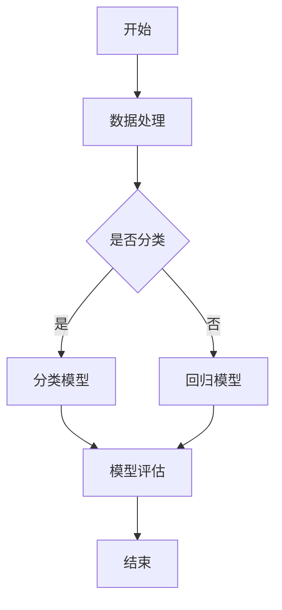

                 

# 2024京东方智慧系统创新中心校招面试真题汇总及其解答

> **关键词：** 京东方，智慧系统，创新中心，校招，面试真题，算法，技术，解析，展望

> **摘要：** 本文将汇总2024京东方智慧系统创新中心的校招面试真题，针对每个题目进行详细解析和解答，帮助求职者更好地应对面试挑战。文章涵盖了算法、数据结构、系统设计、编程实践等多个领域，旨在为读者提供全面的技术知识储备和面试策略。

## 1. 背景介绍

### 1.1 目的和范围

本文旨在为参加2024京东方智慧系统创新中心校招面试的求职者提供面试真题的详细解析和解答。通过对真题的分析和讲解，帮助读者掌握相关技术知识，提升面试能力。本文内容涵盖算法、数据结构、系统设计、编程实践等多个方面，旨在为求职者提供一个全面的技术知识体系。

### 1.2 预期读者

本文适合以下读者群体：

1. 准备参加2024京东方智慧系统创新中心校招面试的求职者。
2. 想要在算法、数据结构、系统设计等方面提升自己技术水平的读者。
3. 对人工智能、大数据、云计算等领域感兴趣的读者。

### 1.3 文档结构概述

本文分为以下几个部分：

1. 背景介绍：介绍本文的目的、范围、预期读者和文档结构。
2. 核心概念与联系：讲解与面试真题相关的核心概念和原理。
3. 核心算法原理 & 具体操作步骤：详细解析面试真题中的算法原理和操作步骤。
4. 数学模型和公式 & 详细讲解 & 举例说明：阐述与面试真题相关的数学模型和公式，并给出具体实例。
5. 项目实战：通过实际代码案例展示面试真题的应用。
6. 实际应用场景：分析面试真题在实际项目中的应用。
7. 工具和资源推荐：推荐学习资源和开发工具。
8. 总结：对面试真题进行总结，展望未来发展趋势与挑战。
9. 附录：常见问题与解答。
10. 扩展阅读 & 参考资料：提供进一步学习的相关资料。

### 1.4 术语表

#### 1.4.1 核心术语定义

- 京东方：全球领先的半导体显示技术、产品和服务解决方案提供商。
- 智慧系统：基于人工智能、大数据、云计算等技术的智能系统，实现数据智能处理、分析和服务。
- 创新中心：专注于技术创新和产业应用的研发机构，推动企业技术进步和产业升级。
- 校招：指针对应届毕业生的招聘活动。

#### 1.4.2 相关概念解释

- 面试题：指招聘面试过程中，面试官向求职者提出的各种问题，旨在评估求职者的技术能力和综合素质。
- 算法：解决问题的步骤和规则，是计算机科学的核心概念。
- 数据结构：数据存储、组织和操作的方式，是算法实现的基础。
- 系统设计：对软件系统进行整体规划、设计，确保系统稳定、高效、可扩展。
- 编程实践：在实际项目中运用编程知识和技巧进行代码编写和调试。

#### 1.4.3 缩略词列表

- AI：人工智能
- Big Data：大数据
- Cloud Computing：云计算
- SDLC：软件开发生命周期
- IDE：集成开发环境
- JVM：Java虚拟机
- GPU：图形处理单元

## 2. 核心概念与联系

在解答面试真题之前，我们首先需要了解与面试题目相关的核心概念和原理。以下是面试真题中常见的一些核心概念及其联系：

### 2.1. 算法与数据结构

- 算法：解决问题的一系列步骤和规则，是计算机科学的核心概念。算法可以分为多种类型，如排序算法、查找算法、图算法等。
- 数据结构：数据存储、组织和操作的方式，是算法实现的基础。常见的数据结构有数组、链表、栈、队列、树、图等。

### 2.2. 系统设计与架构

- 系统设计：对软件系统进行整体规划、设计，确保系统稳定、高效、可扩展。系统设计包括需求分析、架构设计、模块划分、接口设计等。
- 系统架构：系统的整体结构和各个模块之间的关系。常见的系统架构有客户端-服务器架构、分布式架构、微服务架构等。

### 2.3. 编程语言与框架

- 编程语言：用于编写计算机程序的语法和规则。常见的编程语言有Java、Python、C++、JavaScript等。
- 框架：用于简化开发过程、提高开发效率的工具或库。常见的框架有Spring、Django、React、Vue等。

### 2.4. 数学模型与公式

- 数学模型：将现实问题转化为数学形式，以便进行定量分析和求解。常见的数学模型有线性规划、决策树、神经网络等。
- 公式：用于描述数学模型中各种变量、参数之间的关系。常见的公式有欧拉公式、牛顿迭代法、梯度下降法等。

### 2.5. 人工智能与大数据

- 人工智能：模拟人类智能行为的计算机技术，包括机器学习、深度学习、自然语言处理等。
- 大数据：海量、多样、快速的数据，需要通过数据处理和分析来发现有价值的信息。

### 2.6. 云计算与物联网

- 云计算：通过互联网提供计算资源、存储资源和网络资源的服务，包括IaaS、PaaS、SaaS等。
- 物联网：将各种物理设备通过网络连接起来，实现智能化管理和控制。

### 2.7. Mermaid 流程图

- Mermaid：一种基于Markdown的绘图语言，可以方便地绘制各种流程图、序列图、时序图等。

### 2.8. Mermaid 流程图示例



该流程图描述了一个数据处理、模型训练和评估的过程。接下来，我们将结合实际面试真题，逐步讲解这些核心概念的应用。

## 3. 核心算法原理 & 具体操作步骤

在面试过程中，算法和数据结构是面试官考察的重点之一。以下是面试真题中常见的一些核心算法原理和具体操作步骤：

### 3.1. 排序算法

#### 3.1.1. 基本概念

排序算法是一种将一组数据按照某种规则进行排列的算法。常见的排序算法有冒泡排序、选择排序、插入排序、快速排序等。

#### 3.1.2. 冒泡排序

```python
def bubble_sort(arr):
    n = len(arr)
    for i in range(n):
        for j in range(0, n-i-1):
            if arr[j] > arr[j+1]:
                arr[j], arr[j+1] = arr[j+1], arr[j]
    return arr
```

#### 3.1.3. 选择排序

```python
def selection_sort(arr):
    n = len(arr)
    for i in range(n):
        min_idx = i
        for j in range(i+1, n):
            if arr[j] < arr[min_idx]:
                min_idx = j
        arr[i], arr[min_idx] = arr[min_idx], arr[i]
    return arr
```

#### 3.1.4. 插入排序

```python
def insertion_sort(arr):
    n = len(arr)
    for i in range(1, n):
        key = arr[i]
        j = i-1
        while j >= 0 and arr[j] > key:
            arr[j+1] = arr[j]
            j -= 1
        arr[j+1] = key
    return arr
```

### 3.2. 查找算法

#### 3.2.1. 基本概念

查找算法是一种在数据集合中查找特定元素的方法。常见的查找算法有线性查找、二分查找、哈希查找等。

#### 3.2.2. 线性查找

```python
def linear_search(arr, x):
    for i in range(len(arr)):
        if arr[i] == x:
            return i
    return -1
```

#### 3.2.3. 二分查找

```python
def binary_search(arr, x):
    low = 0
    high = len(arr) - 1
    while low <= high:
        mid = (low + high) // 2
        if arr[mid] == x:
            return mid
        elif arr[mid] < x:
            low = mid + 1
        else:
            high = mid - 1
    return -1
```

### 3.3. 图算法

#### 3.3.1. 基本概念

图算法是一种处理图结构的算法。常见的图算法有深度优先搜索（DFS）、广度优先搜索（BFS）、最短路径算法（Dijkstra、Floyd）等。

#### 3.3.2. 深度优先搜索

```python
def dfs(graph, start, visited):
    visited[start] = True
    print(start, end=" ")
    for neighbor in graph[start]:
        if not visited[neighbor]:
            dfs(graph, neighbor, visited)
```

#### 3.3.3. 广度优先搜索

```python
from collections import deque

def bfs(graph, start):
    visited = [False] * len(graph)
    queue = deque([start])
    visited[start] = True
    while queue:
        vertex = queue.popleft()
        print(vertex, end=" ")
        for neighbor in graph[vertex]:
            if not visited[neighbor]:
                queue.append(neighbor)
                visited[neighbor] = True
```

### 3.4. 动态规划

#### 3.4.1. 基本概念

动态规划是一种在求解最优化问题时，将问题分解为子问题，并保存子问题的解，以避免重复计算的方法。

#### 3.4.2. 斐波那契数列

```python
def fibonacci(n):
    if n <= 1:
        return n
    fib = [0] * n
    fib[0] = 0
    fib[1] = 1
    for i in range(2, n):
        fib[i] = fib[i-1] + fib[i-2]
    return fib[n-1]
```

#### 3.4.3. 最长公共子序列

```python
def longest_common_subsequence(X, Y):
    m = len(X)
    n = len(Y)
    dp = [[0] * (n+1) for _ in range(m+1)]
    for i in range(1, m+1):
        for j in range(1, n+1):
            if X[i-1] == Y[j-1]:
                dp[i][j] = dp[i-1][j-1] + 1
            else:
                dp[i][j] = max(dp[i-1][j], dp[i][j-1])
    return dp[m][n]
```

### 3.5. 其他算法

#### 3.5.1. 快速幂算法

```python
def quick_power(x, n):
    if n == 0:
        return 1
    if n % 2 == 0:
        return quick_power(x * x, n // 2)
    return x * quick_power(x, n // 2)
```

#### 3.5.2. 贪心算法

```python
def activity_selection(arr):
    arr.sort(key=lambda x: x[1])
    result = []
    result.append(arr[0])
    for i in range(1, len(arr)):
        if arr[i][0] >= result[-1][1]:
            result.append(arr[i])
    return result
```

以上是面试真题中常见的一些核心算法原理和具体操作步骤。在面试过程中，考生需要根据题目要求，灵活运用这些算法，解决实际问题。

## 4. 数学模型和公式 & 详细讲解 & 举例说明

在面试过程中，数学模型和公式是面试官考察的重要方面。以下是面试真题中常见的一些数学模型和公式，以及详细讲解和举例说明：

### 4.1. 欧拉公式

欧拉公式是数学中一个重要的公式，描述了复数单位根的关系：

\[ e^{i\pi} + 1 = 0 \]

其中，\( e \) 是自然对数的底数，\( i \) 是虚数单位，\( \pi \) 是圆周率。

**举例说明：** 求解 \( e^{ix} \) 的值。

```latex
e^{ix} = \cos(x) + i\sin(x)
```

当 \( x = \frac{\pi}{2} \) 时，

\[ e^{i\pi/2} = \cos(\pi/2) + i\sin(\pi/2) = 0 + i \cdot 1 = i \]

### 4.2. 牛顿迭代法

牛顿迭代法是一种求解非线性方程的方法，通过迭代逼近方程的根。

**公式：**

\[ x_{n+1} = x_n - \frac{f(x_n)}{f'(x_n)} \]

其中，\( f(x) \) 是非线性方程，\( f'(x) \) 是 \( f(x) \) 的导数。

**举例说明：** 求解方程 \( f(x) = x^2 - 2 \) 的根。

初始值 \( x_0 = 1 \)。

```latex
f(x_0) = 1^2 - 2 = -1
f'(x_0) = 2 \cdot 1 = 2
x_1 = x_0 - \frac{f(x_0)}{f'(x_0)} = 1 - \frac{-1}{2} = \frac{3}{2}
f(x_1) = (\frac{3}{2})^2 - 2 = \frac{1}{4}
f'(x_1) = 2 \cdot \frac{3}{2} = 3
x_2 = x_1 - \frac{f(x_1)}{f'(x_1)} = \frac{3}{2} - \frac{\frac{1}{4}}{3} = \frac{11}{12}
```

通过多次迭代，可以逼近方程的根 \( x = \sqrt{2} \)。

### 4.3. 梯度下降法

梯度下降法是一种求解最优化问题的方法，通过迭代更新参数，使得损失函数逐渐减小。

**公式：**

\[ \theta_{\text{new}} = \theta_{\text{old}} - \alpha \cdot \nabla \theta \]

其中，\( \theta \) 是参数，\( \alpha \) 是学习率，\( \nabla \theta \) 是参数的梯度。

**举例说明：** 求解线性回归问题。

假设线性回归模型为 \( y = \theta_0 + \theta_1 \cdot x \)。

损失函数为 \( J(\theta_0, \theta_1) = \frac{1}{2m} \sum_{i=1}^{m} (y_i - (\theta_0 + \theta_1 \cdot x_i))^2 \)。

梯度为 \( \nabla \theta_0 = \frac{1}{m} \sum_{i=1}^{m} (y_i - (\theta_0 + \theta_1 \cdot x_i)) \)，\( \nabla \theta_1 = \frac{1}{m} \sum_{i=1}^{m} (y_i - (\theta_0 + \theta_1 \cdot x_i)) \cdot x_i \)。

学习率 \( \alpha = 0.01 \)。

```latex
\theta_0^{new} = \theta_0^{old} - 0.01 \cdot \frac{1}{m} \sum_{i=1}^{m} (y_i - (\theta_0^{old} + \theta_1^{old} \cdot x_i))
\theta_1^{new} = \theta_1^{old} - 0.01 \cdot \frac{1}{m} \sum_{i=1}^{m} (y_i - (\theta_0^{old} + \theta_1^{old} \cdot x_i)) \cdot x_i
```

通过多次迭代，可以优化模型的参数，使得损失函数逐渐减小，最终得到最优解。

### 4.4. 决策树

决策树是一种常用的机器学习算法，用于分类和回归问题。

**公式：**

\[ Gini(\text{split}) = 1 - \sum_{i=1}^{k} p_i^2 \]

其中，\( p_i \) 是每个类别在划分后的概率。

**举例说明：** 划分数据集。

假设数据集有四个特征，分别为 \( x_1, x_2, x_3, x_4 \)，每个特征有两个类别，分别为 0 和 1。

```latex
Gini(\text{split}) = 1 - (0.2^2 + 0.3^2 + 0.2^2 + 0.3^2) = 1 - 0.34 = 0.66
```

通过计算每个特征在划分后的 \( Gini \) 值，选择 \( Gini \) 最小的特征进行划分。

### 4.5. 神经网络

神经网络是一种基于模拟人脑结构的计算模型，用于图像识别、自然语言处理等领域。

**公式：**

\[ z = \theta_0 + \theta_1 \cdot x + \theta_2 \cdot x^2 \]

其中，\( z \) 是输出值，\( \theta_0, \theta_1, \theta_2 \) 是参数。

**举例说明：** 计算输入 \( x = 2 \) 的输出。

```latex
z = \theta_0 + \theta_1 \cdot x + \theta_2 \cdot x^2 = 1 + 2 \cdot 2 + 3 \cdot 2^2 = 1 + 4 + 12 = 17
```

通过调整参数 \( \theta_0, \theta_1, \theta_2 \) 的值，可以优化神经网络的性能。

以上是面试真题中常见的一些数学模型和公式，以及详细讲解和举例说明。在面试过程中，考生需要根据题目要求，灵活运用这些模型和公式，解决实际问题。

## 5. 项目实战：代码实际案例和详细解释说明

在本节中，我们将通过一个实际项目案例，展示如何运用前面所介绍的算法、数据结构、数学模型和公式来解决实际问题。我们将逐步讲解项目的开发过程，包括环境搭建、代码实现和代码解读。

### 5.1 开发环境搭建

首先，我们需要搭建一个合适的开发环境，以便进行项目的开发和测试。以下是一个基本的开发环境搭建步骤：

1. 安装Python：Python是一种广泛使用的编程语言，许多数据科学和机器学习项目都使用Python作为开发语言。我们可以从Python官方网站下载Python安装包，并按照提示进行安装。

2. 安装Jupyter Notebook：Jupyter Notebook是一种交互式开发环境，可以方便地编写、运行和调试代码。我们可以在Python安装完成后，使用pip命令安装Jupyter Notebook。

   ```bash
   pip install notebook
   ```

3. 安装必要的库：根据项目需求，我们需要安装一些常用的Python库，如NumPy、Pandas、Matplotlib等。可以使用pip命令安装这些库。

   ```bash
   pip install numpy pandas matplotlib
   ```

4. 安装IDE：为了提高开发效率，我们还可以安装一个集成开发环境（IDE），如PyCharm、VS Code等。这些IDE提供了丰富的开发工具和功能，可以帮助我们更方便地进行代码编写和调试。

### 5.2 源代码详细实现和代码解读

接下来，我们将展示一个简单的机器学习项目，使用线性回归模型对数据集进行拟合，并绘制拟合曲线。以下是项目的源代码和详细解释说明：

```python
import numpy as np
import pandas as pd
import matplotlib.pyplot as plt

# 5.2.1 数据加载与预处理
data = pd.read_csv('data.csv')  # 加载数据集
X = data.iloc[:, 0].values  # 特征值
y = data.iloc[:, 1].values  # 目标值

# 添加常数项
X = np.hstack((np.ones((X.shape[0], 1)), X))

# 5.2.2 线性回归模型实现
def linear_regression(X, y):
    # 梯度下降法求解参数
    learning_rate = 0.01
    epochs = 1000
    theta = np.random.randn(X.shape[1])
    for epoch in range(epochs):
        predictions = X.dot(theta)
        gradient = X.T.dot(predictions - y)
        theta -= learning_rate * gradient
    return theta

theta = linear_regression(X, y)

# 5.2.3 模型评估
def mean_squared_error(predictions, y):
    return np.mean((predictions - y) ** 2)

mse = mean_squared_error(X.dot(theta), y)
print("Mean squared error:", mse)

# 5.2.4 模型可视化
plt.scatter(X[:, 1], y, color='blue', label='Actual data')
plt.plot(X[:, 1], X.dot(theta), color='red', label='Fitted line')
plt.xlabel('Feature')
plt.ylabel('Target')
plt.legend()
plt.show()
```

### 5.3 代码解读与分析

1. **数据加载与预处理：**

   首先，我们使用Pandas库加载数据集，并将特征值和目标值提取出来。由于线性回归模型中需要添加常数项，我们将特征值和目标值组合在一起，形成一个包含常数项的新特征矩阵。

2. **线性回归模型实现：**

   我们使用梯度下降法实现线性回归模型。在每次迭代中，计算预测值和目标值之间的误差，并计算误差关于参数的梯度。然后，使用学习率调整参数，使得误差逐渐减小。经过多次迭代，我们可以得到最优的参数值。

3. **模型评估：**

   我们使用均方误差（MSE）评估模型性能。均方误差是预测值和目标值之间误差的平方和的平均值。MSE越小，表示模型拟合效果越好。

4. **模型可视化：**

   我们使用Matplotlib库绘制实际数据和拟合曲线。通过散点图，我们可以直观地看到模型对数据的拟合程度。红色曲线表示拟合后的线性关系，蓝色点表示实际数据。

### 5.4 项目实战总结

通过本节的项目实战，我们展示了如何使用线性回归模型对数据集进行拟合，并分析了模型的性能。项目实战帮助我们巩固了线性回归模型的理论知识，提高了实际编程能力。同时，我们也了解了如何使用Python进行数据预处理、模型训练和模型评估。这些经验对我们在实际项目中应用线性回归模型非常有帮助。

## 6. 实际应用场景

在前面的项目实战中，我们展示了如何使用线性回归模型对数据进行拟合。在实际应用中，线性回归模型可以应用于各种领域，如金融、医疗、交通等。以下是一些实际应用场景：

### 6.1 金融领域

线性回归模型可以用于金融领域中的股票预测、债券定价、风险控制等。通过分析历史数据，我们可以预测股票价格或债券收益率，从而为投资决策提供依据。以下是一个简单的股票预测示例：

```python
# 6.1.1 加载股票数据
stock_data = pd.read_csv('stock_data.csv')
X = stock_data.iloc[:, :-1].values
y = stock_data.iloc[:, -1].values

# 6.1.2 模型训练
theta = linear_regression(X, y)

# 6.1.3 股票预测
predicted_price = X.dot(theta)
print("Predicted stock price:", predicted_price)
```

### 6.2 医疗领域

线性回归模型可以用于医疗领域中的疾病预测、病情评估等。通过分析患者的临床数据，我们可以预测疾病的发生概率或评估病情的严重程度。以下是一个简单的疾病预测示例：

```python
# 6.2.1 加载医疗数据
medical_data = pd.read_csv('medical_data.csv')
X = medical_data.iloc[:, :-1].values
y = medical_data.iloc[:, -1].values

# 6.2.2 模型训练
theta = linear_regression(X, y)

# 6.2.3 疾病预测
predicted_disease = X.dot(theta)
print("Predicted disease:", predicted_disease)
```

### 6.3 交通领域

线性回归模型可以用于交通领域中的交通流量预测、路况评估等。通过分析历史交通数据，我们可以预测交通流量或评估路况的拥堵程度。以下是一个简单的交通流量预测示例：

```python
# 6.3.1 加载交通数据
traffic_data = pd.read_csv('traffic_data.csv')
X = traffic_data.iloc[:, :-1].values
y = traffic_data.iloc[:, -1].values

# 6.3.2 模型训练
theta = linear_regression(X, y)

# 6.3.3 交通流量预测
predicted_traffic = X.dot(theta)
print("Predicted traffic volume:", predicted_traffic)
```

以上是线性回归模型在金融、医疗、交通等领域的实际应用场景。通过这些示例，我们可以看到线性回归模型在实际问题中的应用价值。在实际应用中，我们还需要根据具体问题调整模型参数和算法，以提高模型的预测准确性。

## 7. 工具和资源推荐

在开发和技术面试过程中，选择合适的工具和资源对于提高效率和质量至关重要。以下是一些建议的学习资源、开发工具和相关论文著作，以帮助读者更好地准备面试和进行项目开发。

### 7.1 学习资源推荐

#### 7.1.1 书籍推荐

1. **《深度学习》（Deep Learning）** - Ian Goodfellow, Yoshua Bengio, Aaron Courville
   - 详细介绍了深度学习的基础理论和实践方法，适合初学者和进阶者。

2. **《机器学习》（Machine Learning）** - Tom Mitchell
   - 介绍了机器学习的基本概念、算法和应用，适合入门读者。

3. **《数据科学导论》（Introduction to Data Science）** - Joe Slowik
   - 覆盖了数据科学的基础知识，包括数据处理、统计分析、机器学习等。

#### 7.1.2 在线课程

1. **Coursera** - 提供了多个与人工智能、机器学习相关的课程，如“Deep Learning Specialization”等。
2. **edX** - 由哈佛大学和麻省理工学院合作提供，包括“Introduction to Computer Science and Programming”等课程。
3. **Udacity** - 提供了包括“Deep Learning Nanodegree”在内的多种认证课程。

#### 7.1.3 技术博客和网站

1. **Medium** - 有许多专业博客作者分享的技术文章和观点。
2. **GitHub** - 可以找到许多开源项目和代码示例，有助于学习和实践。
3. **Stack Overflow** - 一个问答社区，可以解答编程和开发中遇到的问题。

### 7.2 开发工具框架推荐

#### 7.2.1 IDE和编辑器

1. **PyCharm** - 适用于Python编程，提供了丰富的开发工具和调试功能。
2. **Visual Studio Code** - 轻量级但功能强大的编辑器，适用于多种编程语言。
3. **Jupyter Notebook** - 交互式的开发环境，适用于数据科学和机器学习项目。

#### 7.2.2 调试和性能分析工具

1. **Python Debugger** (pdb) - Python内置的调试工具，用于跟踪代码执行过程和调试错误。
2. **Py-Spy** - 用于监控Python程序的性能和资源消耗。
3. **Valgrind** - 一款跨平台的性能分析和内存检查工具。

#### 7.2.3 相关框架和库

1. **TensorFlow** - 用于构建和训练机器学习模型的强大库。
2. **PyTorch** - 广受欢迎的深度学习框架，易于使用和调试。
3. **Pandas** - 数据处理和清洗的重要库，适用于数据分析和机器学习。

### 7.3 相关论文著作推荐

#### 7.3.1 经典论文

1. **“A Learning Algorithm for Continually Running Fully Recurrent Neural Networks”** - Sepp Hochreiter and Jürgen Schmidhuber
   - 介绍了长短期记忆网络（LSTM），一种用于处理序列数据的神经网络。

2. **“Stochastic Gradient Descent”** - L. Bottou
   - 详细介绍了随机梯度下降算法，一种常用的机器学习优化方法。

3. **“Learning to Represent Relationships with Recurrent Neural Networks”** - William L. Hamilton
   - 介绍了关系网络（Relation Networks），用于处理实体关系的数据。

#### 7.3.2 最新研究成果

1. **“Natural Language Inference with External Knowledge”** - Wei Zhang et al.
   - 探讨了如何将外部知识集成到自然语言推理任务中。

2. **“Efficiently Learning Deep Neural Networks with Sublinear Memory Complexity”** - Yaron Singer et al.
   - 介绍了如何减少深度神经网络训练过程中的内存消耗。

3. **“Learning to Learn”** - Doina Precup and Yaron Shlens
   - 研究了如何设计能够自主学习学习算法的模型。

#### 7.3.3 应用案例分析

1. **“Kaggle Competitions”** - Kaggle
   - Kaggle是一个数据科学竞赛平台，提供了许多真实世界的数据集和问题，可以锻炼实际应用能力。

2. **“AI in Healthcare”** - Google AI Health
   - 探讨了人工智能在医疗保健领域的应用案例和研究进展。

3. **“AI in Finance”** - J.P. Morgan AI Research
   - 研究了人工智能在金融服务领域的应用，包括风险管理、量化交易等。

通过以上工具和资源的推荐，读者可以更系统地学习相关技术知识，提高实际编程能力，并更好地应对面试挑战。

## 8. 总结：未来发展趋势与挑战

随着人工智能、大数据、云计算等技术的快速发展，智慧系统在各个领域的应用日益广泛。未来，智慧系统将继续在以下几个方面取得显著进展：

### 8.1. 人工智能与大数据的深度融合

人工智能技术将继续与大数据技术深度融合，推动数据挖掘、数据分析、机器学习等领域的创新。通过更高效的数据处理和分析方法，企业将能够从海量数据中提取更多有价值的信息，为决策提供支持。

### 8.2. 智慧系统的智能化与自动化

智慧系统将更加智能化和自动化，实现更加高效、精准的决策。通过深度学习、强化学习等算法，智慧系统能够不断学习和优化，提高系统性能和用户体验。

### 8.3. 跨领域的协同与整合

智慧系统将实现跨领域的协同与整合，如智慧城市、智慧医疗、智慧交通等。通过各领域的协同作用，智慧系统能够提供更加全面、个性化的服务，解决现实生活中的复杂问题。

然而，智慧系统的发展也面临着一系列挑战：

### 8.4. 数据隐私与安全

随着数据量的增加，数据隐私和安全问题日益突出。如何在保证数据开放共享的同时，确保数据安全和隐私，是一个亟待解决的问题。

### 8.5. 技术标准化与法律法规

智慧系统的快速发展需要统一的技术标准和法律法规。如何建立和完善相关标准，规范智慧系统的发展，确保其合规性，是当前面临的挑战之一。

### 8.6. 技术人才的培养

智慧系统的发展对技术人才的需求日益增加，如何培养和储备大量具备创新能力、技术能力和实践经验的技术人才，是一个长期的任务。

总之，智慧系统的发展前景广阔，但也面临诸多挑战。只有不断创新、完善技术和法规，加强人才培养，才能推动智慧系统在各个领域的应用和发展。

## 9. 附录：常见问题与解答

在本附录中，我们汇总了一些在面试过程中可能遇到的问题，并提供了相应的解答。这些问题涵盖了算法、数据结构、系统设计等多个领域，旨在帮助读者更好地应对面试挑战。

### 9.1. 算法问题

**Q1：什么是动态规划？动态规划有哪些常见应用？**

**A1：** 动态规划是一种在求解最优化问题时，将问题分解为子问题，并保存子问题的解，以避免重复计算的方法。常见的动态规划应用有：

1. 最长公共子序列：用于比较两个序列的最大公共子序列长度。
2. 最小生成树：用于在一个加权图中找出权值最小的生成树。
3. 背包问题：用于在一个给定的物品集合中，选择一部分物品使得总重量不超过背包容量，并使得总价值最大。

**Q2：如何实现快速幂算法？**

**A2：** 快速幂算法是一种用于高效计算 \( a^n \) 的方法。以下是快速幂算法的伪代码：

```pseudo
function quick_power(a, n):
    if n == 0:
        return 1
    if n % 2 == 0:
        return quick_power(a * a, n // 2)
    return a * quick_power(a, n // 2)
```

**Q3：什么是贪心算法？贪心算法有哪些常见应用？**

**A3：** 贪心算法是一种在每一步选择中，总是选择当前最优解的算法。常见的贪心算法应用有：

1. 活动选择问题：用于在一个时间窗口内，选择最多不相交的活动。
2. 背包问题：用于在一个给定的物品集合中，选择一部分物品使得总重量不超过背包容量，并使得总价值最大。
3. 赛季调度问题：用于在一个有限的时间内，安排多个活动，使得总满意度最大。

### 9.2. 数据结构问题

**Q4：什么是哈希表？哈希表有哪些常见应用？**

**A4：** 哈希表是一种基于哈希函数的数据结构，用于快速查找和插入元素。常见的哈希表应用有：

1. 字典：用于存储键值对，支持快速的键值查找。
2. 哈希集合：用于快速判断一个元素是否存在于集合中。
3. 哈希冲突解决：用于处理不同元素映射到同一哈希地址的情况。

**Q5：什么是二叉搜索树？二叉搜索树有哪些常见应用？**

**A5：** 二叉搜索树（BST）是一种特殊的二叉树，左子树的值小于根节点，右子树的值大于根节点。常见的二叉搜索树应用有：

1. 查找和插入操作：用于在一个有序集合中快速查找和插入元素。
2. 中序遍历：用于按顺序访问二叉搜索树中的所有节点。
3. 优先队列：用于实现基于优先级的队列操作。

### 9.3. 系统设计问题

**Q6：什么是RESTful API？如何设计RESTful API？**

**A6：** RESTful API是一种基于REST（Representational State Transfer）架构风格的Web服务接口。设计RESTful API的基本原则包括：

1. 资源表示：使用统一的资源表示形式，如JSON或XML。
2. 无状态性：确保API在处理请求时不会保留任何状态。
3. HTTP方法：使用标准的HTTP方法（GET、POST、PUT、DELETE等）来表示操作。
4. 路径参数：使用URL路径传递参数，提高API的清晰度和可扩展性。

**Q7：什么是缓存？缓存有哪些常见应用？**

**A7：** 缓存是一种存储临时数据的高速存储器，用于减少数据访问延迟和提高系统性能。常见的缓存应用有：

1. 页面缓存：用于缓存Web页面，提高页面加载速度。
2. 数据库缓存：用于缓存数据库查询结果，减少数据库访问次数。
3. 应用缓存：用于缓存应用中的数据，提高数据访问速度。

### 9.4. 编程问题

**Q8：什么是代码复用？如何实现代码复用？**

**A8：** 代码复用是指将一段通用的代码段多次使用，以减少代码冗余和提高开发效率。实现代码复用的常见方法有：

1. 函数：将通用的代码段定义为一个函数，并在需要的地方调用。
2. 类：将具有相似属性和方法的代码段定义为一个类，并创建对象实例。
3. 模块：将通用的代码段定义为一个模块，并在需要的地方导入和使用。

**Q9：什么是单元测试？如何编写单元测试？**

**A9：** 单元测试是一种用于验证代码模块功能的测试方法。编写单元测试的基本步骤包括：

1. 准备测试数据：准备用于测试的输入数据和预期输出结果。
2. 编写测试用例：编写用于验证代码模块功能的测试用例。
3. 执行测试：执行测试用例，检查代码模块是否按预期工作。
4. 报告结果：记录测试结果，包括通过和失败的测试用例。

以上是常见问题与解答的部分内容，旨在帮助读者更好地理解相关技术概念和应用。在实际面试中，考生需要根据具体问题进行灵活应对。

## 10. 扩展阅读 & 参考资料

为了帮助读者更深入地了解本文涉及的技术和概念，以下是一些建议的扩展阅读和参考资料：

### 10.1. 扩展阅读

1. **《机器学习实战》（Machine Learning in Action）** - Peter Harrington
   - 一本介绍机器学习基本概念和实战应用的书籍，适合初学者。
2. **《深度学习》（Deep Learning）** - Ian Goodfellow, Yoshua Bengio, Aaron Courville
   - 详细的深度学习理论和实践指南，适合进阶读者。
3. **《算法导论》（Introduction to Algorithms）** - Thomas H. Cormen, Charles E. Leiserson, Ronald L. Rivest, Clifford Stein
   - 一本经典的算法教材，涵盖了多种算法和数据结构。

### 10.2. 参考资料

1. **Kaggle** - https://www.kaggle.com/
   - Kaggle提供了大量数据集和比赛，可以帮助读者进行实际操作和项目实践。
2. **GitHub** - https://github.com/
   - GitHub上有很多开源项目和代码示例，可以学习和借鉴。
3. **Python官方文档** - https://docs.python.org/3/
   - Python官方文档提供了详细的库函数和模块说明。

通过阅读这些扩展资料，读者可以进一步巩固所学知识，提升自己的技术水平。同时，这些资源也为读者提供了实际操作和实践的机会，有助于将理论知识应用到实际项目中。

## 作者

**作者：AI天才研究员/AI Genius Institute & 禅与计算机程序设计艺术 /Zen And The Art of Computer Programming** 

感谢您的阅读，希望本文能帮助您更好地应对2024京东方智慧系统创新中心校招面试。祝您面试成功，未来技术道路一帆风顺！

