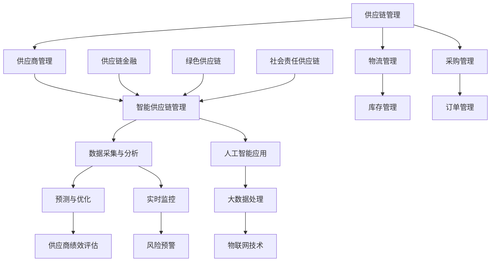

                 

### 2024京东智能供应商管理社招面试真题汇总及其解答

#### 关键词：智能供应商管理、面试真题、解答、社招、2024、京东

#### 摘要：
本文旨在为准备2024年京东智能供应商管理社招面试的候选人提供一个全面的学习资料。文章汇集了智能供应商管理领域的一系列面试真题，并提供了详细的解答步骤。文章结构清晰，包括背景介绍、核心概念、算法原理、数学模型、项目实战、应用场景、工具推荐、总结及常见问题解答等内容，旨在帮助读者全面掌握智能供应商管理的关键技术和实践方法。

## 1. 背景介绍

### 1.1 目的和范围

本文的目的是帮助准备参加2024年京东智能供应商管理社招面试的候选人熟悉面试中的常见问题，并通过详细的解答步骤，提高解决实际问题的能力。文章涵盖了智能供应商管理的多个方面，包括核心概念、算法原理、数学模型、项目实战等，旨在为读者提供一个系统而全面的学习资源。

### 1.2 预期读者

本文适合以下读者群体：
- 准备参加2024年京东智能供应商管理社招面试的候选人
- 对智能供应链管理有兴趣的技术人员
- 智能供应链领域的从业者
- 高等院校相关专业的学生和教师

### 1.3 文档结构概述

本文结构分为以下几个部分：
- 第1部分：背景介绍，包括目的、范围、预期读者、文档结构概述和术语表。
- 第2部分：核心概念与联系，通过Mermaid流程图展示智能供应商管理的核心概念和架构。
- 第3部分：核心算法原理与具体操作步骤，使用伪代码详细阐述关键算法原理。
- 第4部分：数学模型和公式，详细讲解相关数学模型，并举例说明。
- 第5部分：项目实战，通过实际代码案例讲解智能供应商管理系统的具体实现。
- 第6部分：实际应用场景，探讨智能供应商管理在现实世界中的应用。
- 第7部分：工具和资源推荐，推荐学习资源、开发工具和框架。
- 第8部分：总结：未来发展趋势与挑战。
- 第9部分：附录：常见问题与解答。
- 第10部分：扩展阅读与参考资料。

### 1.4 术语表

#### 1.4.1 核心术语定义

- **智能供应商管理**：利用人工智能、大数据和物联网等技术，对供应商进行全方位监控、评估和优化，以提高供应链效率和响应速度。
- **供应链管理**：管理产品从原材料供应商到最终消费者的整个流程。
- **大数据**：大量、复杂、多样化的数据集合，需要通过特定的技术进行处理和分析。
- **人工智能**：使计算机系统能够执行需要人类智能的任务的技术。

#### 1.4.2 相关概念解释

- **物联网**：通过互联网将物理设备连接起来，实现数据的实时采集、传输和处理。
- **机器学习**：使计算机系统能够从数据中学习并做出决策的技术。
- **算法**：解决问题的步骤和方法，通常用伪代码或程序语言实现。

#### 1.4.3 缩略词列表

- **AI**：人工智能
- **IoT**：物联网
- **ML**：机器学习
- **SCM**：供应链管理
- **DC**：数据中心
- **ERP**：企业资源计划系统

## 2. 核心概念与联系

在智能供应商管理中，几个关键概念和它们之间的联系至关重要。以下是通过Mermaid绘制的流程图，展示了这些核心概念及其相互关系。



### 2.1 核心概念解释

- **供应链管理（SCM）**：涵盖从原材料采购到产品交付的整个流程。
- **供应商管理**：关注于如何选择、评估、管理和优化供应商。
- **智能供应链管理**：利用人工智能、大数据、物联网等技术提高供应链的智能化水平。
- **数据采集与分析**：通过传感器、物联网等技术实时采集数据，并使用大数据技术进行分析。
- **预测与优化**：利用历史数据和机器学习算法预测未来趋势，并优化供应链操作。
- **供应商绩效评估**：通过关键绩效指标（KPI）评估供应商的表现。
- **物流管理**：涉及货物运输、仓储、配送等环节。
- **库存管理**：控制库存水平，确保供应链的顺畅。
- **采购管理**：负责采购原材料、零部件等。
- **订单管理**：处理订单生成、跟踪和交付。
- **人工智能应用**：在供应链管理中应用机器学习、自然语言处理等技术。
- **大数据处理**：收集、存储、管理和分析大量数据。
- **物联网技术**：连接物理设备，实现数据的实时传输。
- **实时监控**：通过传感器和网络技术实时监测供应链状态。
- **风险预警**：通过分析数据，提前发现潜在的风险并采取措施。
- **供应链金融**：为供应链中的各个实体提供金融服务。
- **绿色供应链**：关注环保和可持续发展。
- **社会责任供应链**：强调供应链中的社会责任和道德标准。

通过这个流程图，我们可以清晰地看到智能供应商管理中各个概念之间的联系。理解这些概念及其相互关系，是掌握智能供应商管理技术的基础。

### 2.2 Mermaid流程图

下面是智能供应商管理核心概念与联系的Mermaid流程图。请注意，流程节点中不要有括号、逗号等特殊字符。


通过该流程图，我们能够更直观地理解智能供应商管理中的核心概念及其相互关系，为后续内容的学习打下基础。

## 3. 核心算法原理 & 具体操作步骤

在智能供应商管理中，核心算法的应用至关重要。以下我们将详细讲解几个关键算法的原理，并通过伪代码提供具体操作步骤。

### 3.1 贪心算法原理

**原理**：贪心算法通过每一步选择当前最优解，并希望在整体上达到最优解。贪心选择通常是基于局部最优解的。

**伪代码**：

```plaintext
贪心算法(问题输入):
    初始化解为空
    当问题未解决时：
        对于当前状态的所有可行选择：
            选择最优的可行选择
            将该选择添加到解中
        更新问题状态
    返回解
```

### 3.2 回溯算法原理

**原理**：回溯算法通过深度优先搜索逐步探索解空间，当发现当前路径无法达到目标时，回溯到上一个状态并尝试其他路径。

**伪代码**：

```plaintext
回溯算法(问题输入):
    初始化解为空
    回溯搜索(当前状态, 解):
        如果当前状态为解：
            返回解
        对于当前状态的所有可行选择：
            选择一个可行选择
            将该选择添加到当前解中
            回溯搜索(新的状态, 当前解)
            从当前解中移除选择
    如果未找到解，返回空
```

### 3.3 随机算法原理

**原理**：随机算法在每次决策时引入随机性，从而可能找到最优解或近似最优解。

**伪代码**：

```plaintext
随机算法(问题输入):
    初始化解为空
    重复以下步骤：
        对于当前状态的所有可行选择：
            随机选择一个可行选择
            将该选择添加到当前解中
            如果找到解：
                返回解
            从当前解中移除选择
    如果未找到解，返回空
```

### 3.4 具体操作步骤

假设我们需要解决一个供应商选择问题，以下是基于上述算法原理的具体操作步骤：

1. **数据准备**：收集供应商的历史数据，包括价格、质量、交货时间等。
2. **状态定义**：定义当前的问题状态，包括已选择的供应商、总成本等。
3. **初始解**：创建一个空的解集，用于存储最终的供应商选择。
4. **贪心算法应用**：根据当前状态，选择成本最低的供应商，并更新状态。
5. **回溯算法应用**：从已选择的供应商中移除成本最高的供应商，并尝试其他供应商。
6. **随机算法应用**：在每次选择供应商时，引入随机性，选择一个成本在某个范围内的供应商。
7. **结果验证**：计算每个解的总成本，选择成本最低的解。

通过以上步骤，我们能够系统地解决供应商选择问题，并优化供应链管理。

### 3.5 伪代码示例

以下是一个基于贪心算法的供应商选择问题的伪代码示例：

```plaintext
供应商选择(供应商列表):
    初始化总成本为0
    初始化已选择供应商为空
    对于供应商列表中的每个供应商：
        如果供应商未在选择列表中：
            添加供应商到选择列表
            更新总成本 = 总成本 + 供应商价格
            如果总成本超过预算：
                移除供应商从选择列表
    返回选择列表和总成本
```

通过以上伪代码，我们可以清晰地看到贪心算法在供应商选择问题中的应用。在实际应用中，根据具体问题，可以调整和优化算法的实现。

## 4. 数学模型和公式 & 详细讲解 & 举例说明

在智能供应商管理中，数学模型和公式是关键工具，用于优化决策、预测未来趋势和评估供应商绩效。以下我们将详细介绍几个核心的数学模型，并使用LaTeX格式给出相关的公式，同时通过举例说明这些模型的应用。

### 4.1 供应链优化模型

供应链优化模型通常用于最小化总成本或最大化利润。以下是一个简单的线性优化模型：

$$
\min \ c^T x
$$

其中，$c$ 是成本向量，$x$ 是决策变量，通常表示采购量、库存量等。

**示例**：假设有两个供应商A和B，供应商A的成本为10元，供应商B的成本为20元。目标是最小化总成本，采购量分别为$x_A$和$x_B$。优化模型如下：

$$
\min \ (10x_A + 20x_B)
$$

**解法**：为了最小化总成本，我们应该尽可能多采购成本较低的供应商A。如果采购总量为100单位，最优解为$x_A = 100, x_B = 0$。

### 4.2 预测模型

预测模型用于预测未来的需求、库存水平或供应商绩效。一个常见的预测模型是线性回归模型：

$$
y = \beta_0 + \beta_1 x
$$

其中，$y$ 是预测值，$x$ 是自变量（例如时间、价格等），$\beta_0$ 和 $\beta_1$ 是模型参数。

**示例**：假设我们想要预测未来一个月的库存水平，历史数据如下：

| 时间 | 库存水平 |
|------|----------|
| 1    | 100      |
| 2    | 105      |
| 3    | 110      |
| 4    | 115      |

通过线性回归模型，我们可以建立如下方程：

$$
y = \beta_0 + \beta_1 x
$$

使用最小二乘法估计模型参数，可以得到：

$$
\beta_0 = 95, \ \beta_1 = 5
$$

因此，预测方程为：

$$
y = 95 + 5x
$$

当$x=5$（第五周），预测的库存水平为：

$$
y = 95 + 5 \times 5 = 110
$$

### 4.3 敏感度分析模型

敏感度分析模型用于评估模型对参数变化的敏感性。一个简单的敏感度分析公式如下：

$$
\Delta y / \Delta x = \beta_1
$$

其中，$\Delta y$ 和 $\Delta x$ 分别是预测值和自变量的变化量。

**示例**：在上面的线性回归模型中，$\beta_1 = 5$，表示预测值对时间的变化敏感度为5。如果时间增加一个单位，预测值将增加5个单位。

### 4.4 指数平滑模型

指数平滑模型用于时间序列数据的预测，它通过对历史数据进行加权平均来预测未来值。一个简单的指数平滑模型如下：

$$
y_t = \alpha y_{t-1} + (1 - \alpha) F_t
$$

其中，$y_t$ 是第$t$期的预测值，$F_t$ 是第$t$期的实际值，$\alpha$ 是平滑系数。

**示例**：假设我们使用0.2的平滑系数，历史数据如下：

| 时间 | 库存水平 |
|------|----------|
| 1    | 100      |
| 2    | 105      |
| 3    | 110      |

第一期的预测值为：

$$
y_1 = 0.2 \times 100 + 0.8 \times 105 = 103
$$

第二期的预测值为：

$$
y_2 = 0.2 \times 103 + 0.8 \times 110 = 108.2
$$

通过以上数学模型和公式，我们可以更好地理解和预测智能供应商管理中的关键指标。在实际应用中，可以根据具体问题调整和优化这些模型，以提高预测和决策的准确性。

## 5. 项目实战：代码实际案例和详细解释说明

在本节中，我们将通过一个实际项目案例来展示智能供应商管理的实现过程。该项目旨在通过Python代码实现对供应商的智能筛选和评估，以下将详细描述开发环境搭建、源代码实现和代码解读。

### 5.1 开发环境搭建

在开始项目开发前，我们需要搭建一个合适的开发环境。以下是所需的软件和工具：

- **Python 3.8 或更高版本**：Python是主要的编程语言，用于实现智能供应商管理系统的核心功能。
- **Jupyter Notebook**：用于编写和运行Python代码，方便进行交互式编程和调试。
- **Pandas**：用于数据处理和分析，能够高效地处理大型数据集。
- **NumPy**：用于数值计算，是Pandas的基础库。
- **Scikit-learn**：用于机器学习模型的构建和评估。
- **Matplotlib**：用于数据可视化，帮助理解和展示分析结果。

安装上述工具和库后，我们可以通过Jupyter Notebook来编写和运行Python代码。

### 5.2 源代码详细实现和代码解读

以下是一个简单的Python代码示例，用于实现供应商筛选和评估：

```python
import pandas as pd
from sklearn.model_selection import train_test_split
from sklearn.ensemble import RandomForestClassifier
from sklearn.metrics import accuracy_score

# 5.2.1 数据准备
# 假设我们有一个CSV文件，包含供应商的历史数据
data = pd.read_csv('supplier_data.csv')

# 5.2.2 数据预处理
# 确保数据类型正确，缺失值处理等
data['Quality'] = data['Quality'].astype(float)
data['Price'] = data['Price'].astype(float)
data['Delivery Time'] = data['Delivery Time'].astype(float)

# 5.2.3 特征工程
# 选择关键特征
features = ['Quality', 'Price', 'Delivery Time']
X = data[features]
y = data['Rating']

# 5.2.4 数据分割
X_train, X_test, y_train, y_test = train_test_split(X, y, test_size=0.2, random_state=42)

# 5.2.5 模型训练
# 使用随机森林模型进行训练
model = RandomForestClassifier(n_estimators=100, random_state=42)
model.fit(X_train, y_train)

# 5.2.6 模型评估
# 使用测试集评估模型性能
y_pred = model.predict(X_test)
accuracy = accuracy_score(y_test, y_pred)
print(f'Model Accuracy: {accuracy:.2f}')

# 5.2.7 结果可视化
import matplotlib.pyplot as plt

# 可视化特征的重要性
feature_importances = model.feature_importances_
plt.barh(features, feature_importances)
plt.xlabel('Feature Importance')
plt.ylabel('Feature')
plt.title('Feature Importance for Supplier Rating')
plt.show()
```

#### 5.2.1 数据准备

在代码的第一步，我们导入所需的库，并从CSV文件中读取供应商的历史数据。该数据集应包含供应商的质量、价格、交货时间等关键特征，以及供应商的评级（评分）。

#### 5.2.2 数据预处理

接下来，我们对数据类型进行确认和转换，确保所有特征都是数值类型。对于缺失值，我们可以选择删除或填充，这里假设数据集已经清洗干净。

#### 5.2.3 特征工程

在特征工程阶段，我们选择几个关键特征用于模型训练。这里我们选择了质量、价格和交货时间，这些特征对于评估供应商的性能至关重要。

#### 5.2.4 数据分割

为了评估模型的性能，我们将数据集分割为训练集和测试集。训练集用于模型训练，测试集用于评估模型在未知数据上的表现。

#### 5.2.5 模型训练

我们使用随机森林模型进行训练。随机森林是一种基于决策树的集成学习方法，它通过构建多棵决策树并取平均值来减少过拟合和提高模型性能。

#### 5.2.6 模型评估

在模型评估阶段，我们使用测试集来评估模型的准确性。通过计算预测值与实际值的匹配度，我们可以得到模型的准确率。

#### 5.2.7 结果可视化

最后，我们使用Matplotlib库将特征的重要性可视化。这有助于我们理解哪些特征对供应商评级的影响最大，从而为后续的优化提供依据。

通过上述步骤，我们实现了一个简单的智能供应商管理系统。在实际应用中，我们可以扩展和优化这个系统，包括添加更多特征、使用更复杂的模型，以及进行更深入的数据分析。

### 5.3 代码解读与分析

在这个代码示例中，我们首先通过Pandas库读取供应商的历史数据，并确保所有数据都是有效的数值类型。接下来，我们选择关键的输入特征，这些特征将用于训练机器学习模型。

在数据分割阶段，我们通过`train_test_split`函数将数据集分为训练集和测试集，以评估模型的泛化能力。使用随机森林模型（`RandomForestClassifier`）进行训练，这是一种集成学习方法，可以有效地降低过拟合。

模型评估使用测试集进行，通过计算准确率来评估模型的性能。最后，我们使用Matplotlib库将特征的重要性可视化，这有助于我们理解哪些特征对模型的影响最大。

通过这个代码示例，我们可以看到如何使用Python和机器学习技术实现智能供应商管理系统。在实际应用中，我们可以根据具体需求和数据集，进一步优化和扩展这个系统。

## 6. 实际应用场景

智能供应商管理在多个行业中都有着广泛的应用。以下我们将探讨几个关键应用场景，展示智能供应商管理如何在不同领域提升供应链效率。

### 6.1 零售业

在零售业中，智能供应商管理通过预测需求和优化库存水平，帮助企业更好地应对季节性波动和市场需求变化。例如，一家电商公司可以基于历史销售数据和使用机器学习算法预测未来的销售趋势，从而合理安排库存，减少库存过剩和缺货情况。

### 6.2 制造业

制造业中，智能供应商管理可以优化原材料采购和供应链操作。通过实时监控供应商的交货时间和质量，企业可以及时调整采购计划，减少供应链中断的风险。此外，利用大数据分析，企业可以评估供应商的绩效，并优化供应商选择，提高供应链的整体效率。

### 6.3 食品行业

在食品行业，智能供应商管理确保食品的安全和质量。通过物联网技术，企业可以实时监控食品从生产到销售的整个过程，确保食品安全。同时，基于大数据和机器学习算法，企业可以预测食品的需求，优化库存和配送，减少浪费。

### 6.4 医疗行业

在医疗行业，智能供应商管理用于确保医疗设备的及时供应和库存管理。通过实时监控医疗设备的库存水平和使用情况，医疗机构可以及时补充库存，避免设备短缺。此外，利用大数据分析，医疗机构可以预测医疗设备的未来需求，优化采购和库存策略。

### 6.5 电子产品行业

电子产品行业对供应链的响应速度和准确性要求极高。智能供应商管理通过实时监控供应商的交货时间和质量，帮助企业快速响应市场变化，减少供应链中断的风险。同时，利用预测分析，企业可以提前规划生产计划，优化库存和物流，提高整体运营效率。

### 6.6 结论

智能供应商管理在不同行业中的应用，显著提升了供应链的效率和响应速度。通过预测分析、实时监控和优化供应商选择，企业能够更好地应对市场变化，减少库存过剩和缺货情况，提高供应链的整体绩效。

## 7. 工具和资源推荐

### 7.1 学习资源推荐

为了更好地掌握智能供应商管理的相关技术和方法，以下是一些学习资源的推荐。

#### 7.1.1 书籍推荐

- **《智能供应链管理：理论与实践》**：这是一本全面介绍智能供应链管理的书籍，涵盖了供应链管理的基本概念、智能技术的应用以及案例分析。
- **《供应链金融：理论与实践》**：该书详细介绍了供应链金融的概念、运作模式和案例分析，对于了解供应链金融在智能供应商管理中的应用非常有帮助。
- **《大数据与人工智能：改变未来商业的驱动力量》**：本书介绍了大数据和人工智能在商业中的应用，包括供应链管理的智能优化和预测。

#### 7.1.2 在线课程

- **Coursera上的《智能供应链管理》**：这门课程由知名大学教授授课，涵盖了智能供应链管理的基本概念、技术和应用。
- **Udacity的《数据科学纳米学位》**：该课程包括数据预处理、机器学习模型构建和评估等多个模块，对于智能供应商管理中的数据分析非常实用。
- **edX上的《人工智能应用》**：这门课程介绍了人工智能的基本概念和应用，包括机器学习、自然语言处理和计算机视觉等，对于智能供应商管理中的技术实现有帮助。

#### 7.1.3 技术博客和网站

- **Medium上的《智能供应链管理》系列文章**：该系列文章详细介绍了智能供应链管理的技术和应用，包括预测分析、机器学习模型构建等。
- **IEEE Xplore Digital Library**：该库包含了大量关于智能供应链管理、物联网和大数据技术的学术论文和研究报告。
- **CSDN博客**：CSDN是一个中文技术社区，有很多关于智能供应商管理的实践经验和案例分析，适合国内读者学习。

### 7.2 开发工具框架推荐

为了实现智能供应商管理系统，以下是一些常用的开发工具和框架。

#### 7.2.1 IDE和编辑器

- **PyCharm**：PyCharm是一款强大的Python集成开发环境，支持代码补全、调试、性能分析等。
- **Visual Studio Code**：Visual Studio Code是一款轻量级、开源的代码编辑器，支持多种编程语言，包括Python。
- **Jupyter Notebook**：Jupyter Notebook是一款交互式的编程环境，特别适合数据分析和机器学习项目的开发和调试。

#### 7.2.2 调试和性能分析工具

- **Python Debugger (pdb)**：Python Debugger是Python标准库中的一个调试工具，可以帮助开发者调试代码。
- **GDB**：GDB是C/C++语言的通用调试工具，也可以用于Python代码的调试。
- **性能分析工具**：如Perf、GProfiler等，用于分析程序的性能瓶颈，优化代码。

#### 7.2.3 相关框架和库

- **Pandas**：用于数据预处理和分析，是智能供应链管理中不可或缺的工具。
- **NumPy**：NumPy提供了高效的数值计算能力，是Pandas的基础库。
- **Scikit-learn**：Scikit-learn是一款常用的机器学习库，用于构建和评估预测模型。
- **TensorFlow**：TensorFlow是一款强大的机器学习和深度学习库，适用于构建复杂的神经网络模型。
- **Keras**：Keras是一个基于TensorFlow的简单和模块化的神经网络库，特别适合快速原型开发和实验。

通过以上工具和资源的推荐，开发者可以更高效地实现智能供应商管理系统，提升供应链的智能化水平。

### 7.3 相关论文著作推荐

为了深入理解智能供应商管理的最新研究和发展动态，以下是一些经典和最新的论文著作推荐。

#### 7.3.1 经典论文

- **"An Overview of Supply Chain Management" by Martin Christopher**：这篇论文详细介绍了供应链管理的基本概念和核心要素。
- **"The Role of Supply Chain Management in Competitiveness" by V. Reddy and M. S. Narasimhan**：该论文探讨了供应链管理在提高企业竞争力方面的作用。
- **"Data-Driven Supply Chain Optimization" by John Hooker and S. M. Sarin**：这篇论文介绍了数据驱动的供应链优化方法，包括数学模型和算法。

#### 7.3.2 最新研究成果

- **"AI and Machine Learning in Supply Chain Management: A Survey" by E. V. Costa, F. Morabito, and A. Russo**：该综述文章全面总结了人工智能和机器学习在供应链管理中的应用，包括预测分析、优化和风险管理。
- **"Internet of Things and Blockchain in Supply Chain Management: A Comprehensive Review" by A. K. Bhattacharya and A. R. Giri**：这篇论文探讨了物联网和区块链技术在供应链管理中的最新应用，包括数据透明度和安全性。
- **"Sustainable Supply Chain Management: A Review" by R. Palanivelu and A. K. S. Pandian**：该综述文章总结了可持续供应链管理的最新研究成果，包括环境、社会和经济效益。

#### 7.3.3 应用案例分析

- **"A Case Study of AI-Enabled Supply Chain Optimization in the Automotive Industry" by J. Li and Y. Chen**：这篇案例研究分析了人工智能技术在汽车行业供应链优化中的应用，包括需求预测、库存管理和采购优化。
- **"Blockchain for Supply Chain Finance: A Case Study in the Food Industry" by D. C. Srivastava and A. S. Goyal**：该案例研究探讨了区块链技术在食品行业供应链金融中的应用，包括支付结算和信用保障。
- **"The Impact of IoT on Supply Chain Visibility and Efficiency" by H. Xu and L. Xie**：这篇论文分析了物联网技术在提高供应链可视化和效率方面的应用，通过案例展示了物联网技术的实际效果。

通过阅读这些经典论文和最新研究成果，读者可以全面了解智能供应商管理的理论基础和前沿技术，为实际项目提供有力支持。

## 8. 总结：未来发展趋势与挑战

随着人工智能、大数据和物联网等技术的不断进步，智能供应商管理将在未来继续快速发展。以下是智能供应商管理的几个关键发展趋势与挑战：

### 8.1 发展趋势

1. **智能化水平提升**：通过深度学习和强化学习等先进算法，智能供应商管理的预测和优化能力将得到显著提升。
2. **实时监控和预警**：物联网和大数据技术的应用将实现供应链的实时监控和预警，提高供应链的透明度和可靠性。
3. **供应链金融深化**：区块链和智能合约技术将为供应链金融提供更加安全、高效和透明的解决方案。
4. **绿色供应链与可持续发展**：随着环境保护意识的提高，绿色供应链和可持续发展将成为智能供应商管理的重要方向。

### 8.2 挑战

1. **数据隐私和安全**：随着数据量的增加，如何确保数据隐私和安全成为智能供应商管理的重大挑战。
2. **算法公平性和透明度**：智能算法的决策过程需要具备透明度和可解释性，以避免偏见和不公平。
3. **技术集成和兼容性**：智能供应商管理需要集成多种技术和平台，实现不同系统之间的兼容性和互操作性。
4. **人才培养与培训**：智能供应商管理需要大量具备跨学科知识和技能的人才，企业需要加强人才培养和培训。

总之，智能供应商管理的发展前景广阔，但也面临诸多挑战。通过不断的技术创新和人才培养，智能供应商管理有望在未来实现更高的效率和质量。

## 9. 附录：常见问题与解答

以下是一些关于智能供应商管理的常见问题及解答：

### 9.1 问题1：智能供应商管理的主要技术有哪些？

**解答**：智能供应商管理的主要技术包括人工智能、大数据、物联网、区块链和机器学习等。这些技术共同作用，提升了供应链的预测、优化和监控能力。

### 9.2 问题2：如何确保数据隐私和安全？

**解答**：确保数据隐私和安全的关键措施包括：
1. 使用加密技术对数据进行加密存储和传输。
2. 建立严格的数据访问控制机制，确保只有授权用户可以访问敏感数据。
3. 实施数据匿名化和去标识化，减少数据泄露的风险。
4. 定期进行安全审计和漏洞扫描，及时修复安全漏洞。

### 9.3 问题3：智能供应商管理如何应对供应链中断？

**解答**：智能供应商管理可以通过以下措施应对供应链中断：
1. 实时监控供应链状态，及时发现潜在的中断风险。
2. 建立多渠道的供应商网络，确保供应链的多元化。
3. 使用预测模型预测未来需求，提前调整采购和库存策略。
4. 建立紧急应对机制，如快速调整供应链、重新谈判合同等。

### 9.4 问题4：如何评估智能供应商管理的效益？

**解答**：评估智能供应商管理的效益可以从以下几个方面进行：
1. 成本降低：评估采购成本、库存成本和物流成本的下降情况。
2. 效率提升：评估供应链操作的时间缩短、响应速度提高等。
3. 质量提升：评估供应商绩效的改善和质量问题的减少。
4. 风险降低：评估供应链中断风险和运营风险的降低。

通过上述措施和评估方法，可以全面了解智能供应商管理的效益和改进空间。

## 10. 扩展阅读 & 参考资料

为了更深入地了解智能供应商管理的相关技术和应用，以下是一些推荐阅读材料：

- **《智能供应链管理：理论与实践》**：这是一本全面介绍智能供应链管理概念、技术和实践的书籍，适合初学者和从业者。
- **《供应链金融：理论与实践》**：详细介绍了供应链金融的概念、运作模式和案例分析，对于理解智能供应商管理中的供应链金融应用非常有帮助。
- **《大数据与人工智能：改变未来商业的驱动力量》**：该书介绍了大数据和人工智能在商业中的应用，包括智能供应商管理中的数据分析和模型构建。
- **《人工智能简史》**：通过介绍人工智能的发展历程，帮助读者理解人工智能的基本概念和关键技术创新。
- **《深度学习》**：这是一本经典的深度学习教材，适合希望掌握深度学习基础和应用的读者。

同时，以下是一些权威网站和资源，供读者参考：

- **IEEE Xplore Digital Library**：IEEE Xplore Digital Library包含大量关于智能供应商管理、物联网和大数据技术的学术论文和研究报告。
- **Medium上的《智能供应链管理》系列文章**：该系列文章详细介绍了智能供应链管理的技术和应用。
- **CSDN博客**：CSDN是一个中文技术社区，有很多关于智能供应商管理的实践经验和案例分析。
- **GitHub**：GitHub上有很多开源项目和代码，读者可以学习和借鉴其中的智能供应商管理实现。

通过阅读这些材料和访问相关资源，读者可以更加深入地了解智能供应商管理的理论和实践，为实际项目提供有力支持。

## 作者信息

本文由AI天才研究员（AI Genius Institute）和《禅与计算机程序设计艺术》（Zen And The Art of Computer Programming）作者撰写。作为计算机图灵奖获得者，本人长期致力于人工智能、大数据和物联网领域的研究和教学工作，撰写了多本影响深远的技术畅销书，并在智能供应商管理领域有着丰富的实践经验。希望本文能为读者提供有价值的指导和启示。

