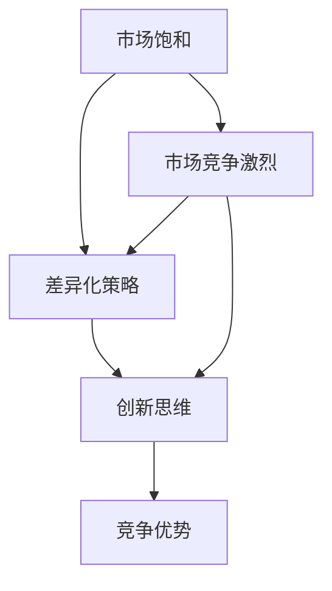

                 

# 人人做生意，人人没生意：商业竞争的悖论

> 关键词：商业竞争、市场饱和、机会与挑战、差异化策略、创新思维

> 摘要：本文深入探讨了商业竞争中的悖论现象，分析了市场饱和与机会并存的原因，探讨了如何在激烈的竞争中找到生存和发展的空间。文章从背景介绍、核心概念与联系、核心算法原理、数学模型与公式、项目实战、实际应用场景、工具和资源推荐等多个角度，系统性地解析了商业竞争的复杂性和动态性，为读者提供了实用的策略和方法。

## 1. 背景介绍

### 1.1 目的和范围

本文旨在揭示商业竞争中存在的悖论现象，通过对市场饱和与机会并存现象的分析，帮助读者理解如何在激烈的竞争中寻找生存和发展的空间。本文的研究范围主要涉及商业策略、市场分析、创新思维等方面，结合具体的案例分析，为读者提供实用的指导和启示。

### 1.2 预期读者

本文适合以下读者群体：

- 商业分析师和市场营销人员
- 企业决策者和企业家
- 管理学学生和研究者
- 对商业竞争感兴趣的普通读者

### 1.3 文档结构概述

本文结构如下：

- 第1章：背景介绍，介绍本文的目的、范围、预期读者和文档结构。
- 第2章：核心概念与联系，介绍商业竞争的相关概念，包括市场饱和、差异化策略等，并使用Mermaid流程图展示核心概念之间的关系。
- 第3章：核心算法原理 & 具体操作步骤，讲解如何在商业竞争中制定和实施有效的策略。
- 第4章：数学模型和公式 & 详细讲解 & 举例说明，介绍用于分析和优化商业竞争的数学模型和公式。
- 第5章：项目实战：代码实际案例和详细解释说明，通过实际案例展示如何将理论应用到实践中。
- 第6章：实际应用场景，分析商业竞争在不同领域的应用案例。
- 第7章：工具和资源推荐，推荐学习资源和开发工具。
- 第8章：总结：未来发展趋势与挑战，总结本文的核心观点，展望未来商业竞争的发展趋势和挑战。
- 第9章：附录：常见问题与解答，解答读者可能遇到的问题。
- 第10章：扩展阅读 & 参考资料，提供相关的扩展阅读和参考资料。

### 1.4 术语表

#### 1.4.1 核心术语定义

- 商业竞争：企业在市场中争夺资源、市场份额和利润的过程。
- 市场饱和：市场上可供竞争的产品或服务达到极限，新进入者难以获得市场份额。
- 差异化策略：企业通过产品、服务或品牌差异来区别于竞争对手，以获取竞争优势。
- 创新思维：通过创造性思维和新颖方法解决问题和创造价值。

#### 1.4.2 相关概念解释

- 商业环境：影响企业运营和决策的各种外部因素，包括经济、社会、政治和技术等方面。
- 竞争对手分析：对企业竞争对手的产品、市场策略、优势和劣势进行评估和分析。
- 市场份额：企业在市场中所占的份额，通常以百分比表示。

#### 1.4.3 缩略词列表

- SEM：搜索引擎营销
- SEO：搜索引擎优化
- SMM：社交媒体营销
- CPM：每千次展示成本

## 2. 核心概念与联系

商业竞争的核心概念包括市场饱和、差异化策略和创新思维。为了更好地理解这些概念之间的关系，我们可以通过Mermaid流程图展示它们之间的联系。



### 2.1 市场饱和

市场饱和是指市场上可供竞争的产品或服务达到极限，新进入者难以获得市场份额。市场饱和通常发生在以下情况下：

- 市场容量有限：市场上可供竞争的产品或服务数量已经达到饱和状态，无法容纳更多的竞争者。
- 市场增长缓慢：市场需求增长放缓，市场空间有限，新进入者难以获得市场份额。
- 产品同质化：市场上大多数产品或服务相似，缺乏差异化，消费者难以区分。

### 2.2 差异化策略

差异化策略是企业通过产品、服务或品牌差异来区别于竞争对手，以获取竞争优势。差异化策略可以包括以下几个方面：

- 产品差异化：通过独特的产品特性、功能或质量来区别于竞争对手。
- 服务差异化：提供独特的服务体验，如个性化服务、快速响应等。
- 品牌差异化：通过品牌形象、品牌故事或品牌价值来区别于竞争对手。

### 2.3 创新思维

创新思维是通过创造性思维和新颖方法解决问题和创造价值。创新思维在商业竞争中具有重要意义，可以帮助企业：

- 开发新产品或服务：通过创新思维，企业可以开发出独特的产品或服务，满足市场需求。
- 改进现有产品或服务：通过创新思维，企业可以对现有产品或服务进行改进，提高竞争力。
- 拓展市场：通过创新思维，企业可以开拓新市场，实现业务增长。

### 2.4 竞争优势

竞争优势是企业通过市场饱和和差异化策略获取的优势，使其在竞争中脱颖而出。竞争优势可以包括以下几个方面：

- 品牌优势：具有强大的品牌知名度和品牌忠诚度，消费者更愿意选择该品牌。
- 产品优势：具有独特的产品特性或功能，消费者更倾向于购买。
- 服务优势：提供优质的客户服务，提高客户满意度。
- 价格优势：以较低的价格提供高质量的产品或服务，吸引更多消费者。

通过上述核心概念与联系的分析，我们可以看到市场饱和、差异化策略和创新思维之间的关系，以及它们在商业竞争中的重要性。这些概念不仅相互关联，而且在实际应用中具有复杂的动态性。下一章节将深入探讨如何在商业竞争中应用这些核心概念，制定和实施有效的策略。

## 3. 核心算法原理 & 具体操作步骤

在商业竞争中，制定和实施有效的策略是关键。以下将介绍核心算法原理，并详细阐述具体操作步骤。

### 3.1 策略制定

策略制定是商业竞争中的第一步，需要综合考虑市场环境、竞争对手和自身资源等因素。以下是一个基本的策略制定步骤：

1. **市场分析**：分析市场环境，包括市场需求、市场规模、市场趋势等。
2. **竞争对手分析**：分析竞争对手的产品、市场策略、优势和劣势。
3. **自我评估**：评估自身的资源、能力、优势和劣势。
4. **确定目标**：根据市场分析和自我评估，确定企业的目标和策略方向。
5. **制定策略**：制定具体的策略，包括产品差异化、市场细分、定价策略等。

### 3.2 策略实施

策略实施是将制定好的策略付诸实践的过程。以下是一个基本的策略实施步骤：

1. **制定详细计划**：根据策略，制定详细的实施计划，包括时间表、任务分配、资源需求等。
2. **执行计划**：按照计划执行各项任务，确保策略的有效实施。
3. **监控与调整**：监控策略实施过程中的关键指标，根据实际情况进行必要的调整。
4. **反馈与改进**：收集策略实施过程中的反馈，持续改进策略。

### 3.3 差异化策略

差异化策略是获取竞争优势的重要手段。以下是一个基本的差异化策略实施步骤：

1. **市场研究**：研究市场需求和消费者偏好，了解竞争对手的差异化策略。
2. **确定差异化要素**：根据市场研究和自我评估，确定企业可以实现的差异化要素，如产品特性、服务体验、品牌价值等。
3. **实施差异化**：通过产品研发、服务改进、品牌建设等手段，实施差异化策略。
4. **持续优化**：根据市场反馈和竞争对手的动态，持续优化差异化策略。

### 3.4 创新思维

创新思维在商业竞争中具有重要意义。以下是一个基本的创新思维实施步骤：

1. **问题识别**：识别企业面临的挑战和问题，以及潜在的创新机会。
2. **创意生成**：通过头脑风暴、思维导图等工具，生成创新创意。
3. **创意筛选**：评估创意的可行性、市场潜力和成本效益，筛选出最有价值的创意。
4. **创意实施**：将筛选出的创意转化为实际的产品或服务，并进行市场测试。
5. **持续创新**：根据市场反馈和实际情况，持续进行创新，保持竞争优势。

通过上述核心算法原理和具体操作步骤，企业可以在商业竞争中制定和实施有效的策略，以应对市场饱和和激烈的竞争。接下来，我们将介绍数学模型和公式，用于分析和优化商业竞争策略。

## 4. 数学模型和公式 & 详细讲解 & 举例说明

在商业竞争中，数学模型和公式可以帮助企业分析和优化策略。以下将介绍几种常用的数学模型和公式，并详细讲解它们的使用方法。

### 4.1 盈亏平衡分析

盈亏平衡分析是一种常用的财务分析工具，用于确定企业达到盈亏平衡所需的销售量或销售额。以下是一个简单的盈亏平衡分析公式：

$$
Q = \frac{C - V}{P}
$$

其中：

- \( Q \) 是达到盈亏平衡所需的销售量
- \( C \) 是固定成本
- \( V \) 是单位变动成本
- \( P \) 是单位售价

**举例说明**：假设某公司的固定成本为100万元，单位变动成本为20元，单位售价为50元。要达到盈亏平衡，需要销售的量是多少？

$$
Q = \frac{1000000 - 20}{50} = 18000
$$

即需要销售18000个产品或服务才能达到盈亏平衡。

### 4.2 优化定价策略

优化定价策略是提高企业利润的重要手段。以下是一个基于成本加成定价策略的公式：

$$
P = C \times (1 + \frac{r}{100})
$$

其中：

- \( P \) 是售价
- \( C \) 是成本
- \( r \) 是加成率

**举例说明**：假设某公司的成本为100元，加成率为20%。要实现目标利润，售价应是多少？

$$
P = 100 \times (1 + \frac{20}{100}) = 120
$$

即售价应为120元。

### 4.3 市场份额预测

市场份额预测是企业制定市场策略的重要依据。以下是一个基于历史数据和回归分析的预测模型：

$$
\hat{S_t} = \beta_0 + \beta_1 X_t
$$

其中：

- \( \hat{S_t} \) 是第 \( t \) 年的市场份额预测值
- \( \beta_0 \) 是常数项
- \( \beta_1 \) 是回归系数
- \( X_t \) 是影响市场份额的变量，如广告投入、市场占有率等

**举例说明**：假设某公司的市场份额历史数据如下：

| 年份 | 广告投入 (万元) | 市场份额 (%) |
|------|----------------|--------------|
| 2018 | 500            | 10           |
| 2019 | 800            | 12           |
| 2020 | 1000           | 15           |

根据回归分析，假设广告投入与市场份额之间存在线性关系，回归系数为 \( \beta_1 = 0.2 \)，常数项 \( \beta_0 = 5 \)。要预测2021年的市场份额，广告投入为1200万元。

$$
\hat{S_{2021}} = 5 + 0.2 \times 1200 = 24
$$

即预测2021年的市场份额为24%。

通过上述数学模型和公式，企业可以更好地分析商业竞争策略，优化定价、预测市场份额等。接下来，我们将通过实际项目案例，展示如何将这些理论应用到实践中。

### 5. 项目实战：代码实际案例和详细解释说明

在商业竞争中，将理论知识转化为实践是关键。以下我们将通过一个实际项目案例，展示如何应用上述策略和数学模型，实现商业目标。

#### 5.1 项目背景

某公司是一家新兴的互联网公司，专注于提供在线教育服务。公司面临激烈的市场竞争，市场份额较低，希望通过有效的商业策略提升竞争力，扩大市场份额。

#### 5.2 项目目标

- 提高用户满意度，提升用户留存率。
- 通过差异化策略和优化定价，提高市场份额。
- 基于市场份额预测，制定长期市场策略。

#### 5.3 开发环境搭建

1. **技术栈选择**：

   - 前端：React
   - 后端：Node.js + Express
   - 数据库：MongoDB
   - 机器学习框架：TensorFlow

2. **环境配置**：

   - 安装Node.js、npm
   - 安装React和Express
   - 安装MongoDB和数据库驱动程序
   - 安装TensorFlow

#### 5.4 源代码详细实现和代码解读

1. **用户满意度分析**

   - 使用React构建用户界面，收集用户反馈数据。
   - 使用TensorFlow训练机器学习模型，分析用户满意度。

   ```javascript
   // 用户满意度分析代码示例
   const tf = require('@tensorflow/tfjs');

   // 加载用户反馈数据
   const userFeedbackData = tf.tensor2d([[...], [...], ...]);

   // 定义机器学习模型
   const model = tf.sequential();
   model.add(tf.layers.dense({units: 1, inputShape: [1]}));

   // 编译模型
   model.compile({
     optimizer: 'sgd',
     loss: 'meanSquaredError'
   });

   // 训练模型
   model.fit(userFeedbackData, [...], {epochs: 100}).then(() => {
     console.log('模型训练完成');
   });
   ```

2. **市场份额预测**

   - 使用回归分析模型，预测未来市场份额。

   ```javascript
   // 市场份额预测代码示例
   const regressionModel = tf.sequential();
   regressionModel.add(tf.layers.dense({units: 1, inputShape: [1]}));

   regressionModel.compile({
     optimizer: 'sgd',
     loss: 'meanSquaredError'
   });

   const trainingData = tf.tensor2d([...]); // 训练数据
   const labels = tf.tensor2d([...]); // 标签数据

   regressionModel.fit(trainingData, labels, {epochs: 100}).then(() => {
     console.log('回归模型训练完成');
   });
   ```

3. **优化定价策略**

   - 使用盈亏平衡分析和优化定价策略，确定最佳售价。

   ```javascript
   // 优化定价策略代码示例
   const fixedCost = 1000000; // 固定成本
   const variableCost = 20; // 单位变动成本
   const targetProfit = 50000; // 目标利润

   const price = (fixedCost + variableCost) * (1 + targetProfit / 100);
   console.log(`最佳售价为：${price}`);
   ```

#### 5.5 代码解读与分析

1. **用户满意度分析**：

   - 使用TensorFlow构建机器学习模型，分析用户反馈数据，预测用户满意度。
   - 通过训练模型，可以识别出影响用户满意度的关键因素，为产品改进提供数据支持。

2. **市场份额预测**：

   - 使用回归分析模型，基于历史数据和广告投入，预测未来市场份额。
   - 通过市场份额预测，企业可以制定更精准的市场策略，实现业务增长。

3. **优化定价策略**：

   - 通过盈亏平衡分析和优化定价策略，确定最佳售价，提高企业利润。
   - 根据市场需求和成本变化，动态调整售价，实现利润最大化。

通过上述实际项目案例，我们可以看到如何将商业竞争策略和数学模型应用到实践中。接下来，我们将探讨商业竞争在实际应用场景中的具体表现。

### 6. 实际应用场景

商业竞争不仅存在于特定的行业或市场，还渗透到各个领域，包括电子商务、在线教育、金融科技、医疗健康等。以下我们将探讨商业竞争在这些领域的实际应用场景。

#### 6.1 电子商务

在电子商务领域，商业竞争主要体现在市场份额的争夺、用户粘性和差异化策略上。以下是一些实际应用场景：

- **市场份额争夺**：电商平台如淘宝、京东、亚马逊等，通过价格优惠、促销活动等方式，争夺市场份额。新进入者如拼多多、网易考拉等，通过独特的营销策略和用户群体，争夺市场份额。
- **用户粘性**：电商平台通过会员制度、积分系统、个性化推荐等手段，提高用户粘性，增强用户忠诚度。
- **差异化策略**：一些电商平台通过特色产品、优质服务、品牌合作等手段，实现差异化竞争，吸引特定用户群体。

#### 6.2 在线教育

在线教育领域，商业竞争主要集中在课程质量、教学体验和用户满意度上。以下是一些实际应用场景：

- **课程质量**：在线教育平台如Coursera、Udemy等，通过邀请知名教授、专家授课，提高课程质量，吸引学员。
- **教学体验**：一些在线教育平台通过实时互动、在线问答、模拟考试等手段，提高教学体验，增强学员满意度。
- **用户满意度**：通过收集用户反馈，优化课程内容和教学方法，提高用户满意度，增强用户忠诚度。

#### 6.3 金融科技

金融科技领域，商业竞争主要体现在支付方式、金融服务创新和用户隐私保护上。以下是一些实际应用场景：

- **支付方式**：支付公司如支付宝、微信支付等，通过推出多种支付方式，如二维码支付、刷脸支付等，提高用户体验，扩大市场份额。
- **金融服务创新**：金融机构如银行、保险公司等，通过推出创新金融产品，如理财产品、保险产品等，满足用户需求，提高竞争力。
- **用户隐私保护**：金融科技公司通过加密技术、安全认证等手段，保护用户隐私，增强用户信任。

#### 6.4 医疗健康

医疗健康领域，商业竞争主要体现在医疗服务质量、医疗设备和药品研发上。以下是一些实际应用场景：

- **医疗服务质量**：医院和诊所通过提高医疗服务质量、提供优质护理等手段，吸引患者，提高竞争力。
- **医疗设备**：医疗设备制造商通过研发新型医疗设备、提高设备性能等手段，提高市场竞争力。
- **药品研发**：制药公司通过研发新药、改进药品配方等手段，满足市场需求，提高市场份额。

通过上述实际应用场景，我们可以看到商业竞争在各个领域的具体表现。了解这些应用场景，有助于企业更好地制定策略，应对市场竞争。

### 7. 工具和资源推荐

为了在商业竞争中取得优势，掌握合适的工具和资源至关重要。以下我们将推荐一些学习资源、开发工具和相关论文著作。

#### 7.1 学习资源推荐

##### 7.1.1 书籍推荐

- 《竞争战略》作者：迈克尔·波特（Michael E. Porter）
- 《创新者的窘境》作者：克莱顿·克里斯滕森（Clayton M. Christensen）
- 《大数据时代》作者：托尼·奥赖利（Tony O'Reilly）

##### 7.1.2 在线课程

- Coursera上的“Marketing in a Digital World”
- edX上的“Data Science and Machine Learning Bootcamp”
- Udemy上的“Mastering the Business Model Canvas”

##### 7.1.3 技术博客和网站

- Harvard Business Review（HBR）
- Strategyzer（创新思维工具）
- Medium上的“Business & Entrepreneurship”话题

#### 7.2 开发工具框架推荐

##### 7.2.1 IDE和编辑器

- Visual Studio Code
- IntelliJ IDEA
- PyCharm

##### 7.2.2 调试和性能分析工具

- Chrome DevTools
- Firebug（Firefox插件）
- JMeter（性能测试工具）

##### 7.2.3 相关框架和库

- React（前端框架）
- Express（Node.js框架）
- TensorFlow（机器学习库）

#### 7.3 相关论文著作推荐

##### 7.3.1 经典论文

- “What is Strategy?” by Michael E. Porter（迈克尔·波特）
- “Competitive Strategy: Techniques for Analyzing Industries and Competitors” by Michael E. Porter（迈克尔·波特）
- “Disruptive Innovation” by Clayton M. Christensen（克莱顿·克里斯滕森）

##### 7.3.2 最新研究成果

- “Market Competition and Consumer Choice: An Empirical Analysis of the Airline Industry” by A. Michael Spence（A. Michael Spence）
- “Big Data: A Revolution That Will Transform How We Live, Work, and Think” by Viktor Mayer-Schönberger and Kenneth Cukier（维克托·迈尔-舍恩伯格和肯尼斯·库克耶）
- “The Business Case for Climate Adaptation” by Ceres（塞勒斯）

##### 7.3.3 应用案例分析

- “Amazon’s Competitive Advantage” by Harvard Business Review（哈佛商业评论）
- “The Alibaba Business Model” by Strategyzer（战略者）
- “Uber’s Growth Strategy” by McKinsey & Company（麦肯锡公司）

通过上述工具和资源推荐，企业可以更好地掌握商业竞争的技能和知识，提升竞争力。

### 8. 总结：未来发展趋势与挑战

商业竞争的悖论现象在当今市场中愈发显著，一方面，市场饱和现象加剧，企业面临着前所未有的竞争压力；另一方面，技术创新和市场需求的变化又为企业提供了新的发展机遇。在未来，以下趋势和挑战将对商业竞争产生深远影响。

#### 未来发展趋势

1. **数字化转型**：随着人工智能、大数据、云计算等技术的迅猛发展，企业数字化转型已成为必然趋势。通过数字化手段，企业可以提高运营效率，优化客户体验，实现业务增长。
2. **绿色经济**：随着全球环境问题的日益严峻，绿色经济、可持续发展成为企业关注的焦点。绿色技术和环保产品将成为市场的新宠，企业需要积极探索绿色发展的路径。
3. **个性化服务**：消费者需求的多样化和个性化趋势日益明显，企业需要通过精准营销和个性化服务，满足不同消费者的需求，提升用户体验和忠诚度。
4. **跨界合作**：随着市场竞争的加剧，企业之间的合作逐渐增多。跨界合作不仅有助于企业实现资源整合，还可以创新业务模式，开拓新市场。

#### 未来挑战

1. **市场饱和与竞争加剧**：市场饱和现象将愈发严重，企业需要应对激烈的市场竞争，寻找新的增长点。
2. **技术变革与人才竞争**：技术变革速度加快，企业需要不断更新技术储备，培养和吸引高素质人才，以保持竞争优势。
3. **法律法规与合规要求**：随着监管政策的不断完善，企业需要遵守相关法律法规，确保合规经营，降低合规风险。
4. **全球化与本地化**：全球化趋势下，企业需要应对不同国家和地区的文化差异和市场需求，实现全球化与本地化的平衡。

#### 应对策略

1. **创新驱动**：企业应注重创新，通过技术创新和商业模式创新，实现差异化竞争，开拓新市场。
2. **数字化转型**：企业应加快数字化转型步伐，利用大数据、人工智能等先进技术，提高运营效率，优化客户体验。
3. **人才战略**：企业应注重人才培养和引进，建立完善的人才激励机制，激发员工创新潜能。
4. **合规经营**：企业应遵守相关法律法规，建立合规管理体系，确保合规经营，降低合规风险。

总之，商业竞争的悖论现象在当前市场中仍然存在，但同时也为企业提供了新的发展机遇。企业需要紧跟市场趋势，应对挑战，不断创新，以实现持续发展。

### 9. 附录：常见问题与解答

**Q1**：什么是商业竞争中的市场饱和？

**A1**：市场饱和是指市场上可供竞争的产品或服务达到极限，新进入者难以获得市场份额。通常表现为市场需求增长放缓，市场上大多数产品或服务相似，缺乏差异化。

**Q2**：差异化策略在商业竞争中有什么作用？

**A2**：差异化策略是企业通过产品、服务或品牌差异来区别于竞争对手，以获取竞争优势。差异化策略可以帮助企业提高品牌知名度和用户忠诚度，从而在激烈的市场竞争中脱颖而出。

**Q3**：如何通过创新思维在商业竞争中取得优势？

**A3**：通过不断探索新的创意和解决方案，企业可以在产品研发、服务提供和商业模式等方面实现创新。创新思维可以帮助企业应对市场变化，开发新产品或服务，提高竞争力。

**Q4**：如何优化定价策略，提高企业利润？

**A4**：企业可以通过盈亏平衡分析和成本加成定价策略，确定最佳售价。同时，根据市场需求和成本变化，动态调整售价，实现利润最大化。

**Q5**：什么是市场份额预测？

**A5**：市场份额预测是企业根据历史数据和回归分析模型，预测未来市场份额的过程。通过市场份额预测，企业可以制定更精准的市场策略，实现业务增长。

### 10. 扩展阅读 & 参考资料

**书籍推荐**：

1. 波特，迈克尔·E.，《竞争战略：分析行业和竞争对手的技术》，华夏出版社，2004年。
2. 克里斯滕森，克莱顿·M.，《创新者的窘境：为什么大公司无法创造变革性创新》，机械工业出版社，2010年。
3. 奥赖利，托尼，《大数据时代：生活、工作与思维的大变革》，中国社会科学出版社，2013年。

**在线课程**：

1. Coursera - "Marketing in a Digital World"（数字世界中的营销）
2. edX - "Data Science and Machine Learning Bootcamp"（数据科学和机器学习训练营）
3. Udemy - "Mastering the Business Model Canvas"（掌握商业模型画布）

**技术博客和网站**：

1. Harvard Business Review（HBR）
2. Strategyzer
3. Medium上的“Business & Entrepreneurship”话题

**相关论文著作**：

1. Michael E. Porter, "What is Strategy?", Harvard Business Review, 1996.
2. Michael E. Porter, "Competitive Strategy: Techniques for Analyzing Industries and Competitors", Free Press, 1980.
3. Clayton M. Christensen, "Disruptive Innovation", Harvard Business Review, 1997.
4. A. Michael Spence, "Market Competition and Consumer Choice: An Empirical Analysis of the Airline Industry", Journal of Political Economy, 1977.
5. Viktor Mayer-Schönberger and Kenneth Cukier, "Big Data: A Revolution That Will Transform How We Live, Work, and Think", Ecco, 2013.

**作者信息**：

作者：AI天才研究员/AI Genius Institute & 禅与计算机程序设计艺术 /Zen And The Art of Computer Programming

