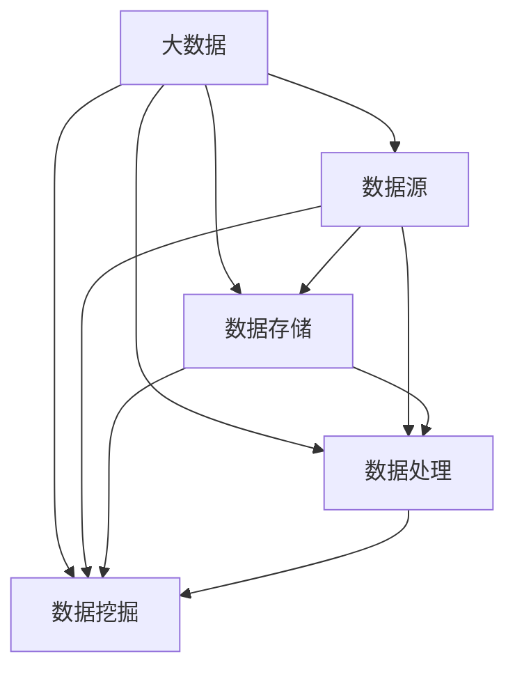

                 

# 人力资源大数据创业者的挑战：利用大数据技术赋能人力资源管理

> **关键词：** 人力资源大数据、数据分析、人工智能、企业管理、数据挖掘、人才管理

> **摘要：** 本文旨在探讨人力资源大数据创业者在利用大数据技术赋能人力资源管理中所面临的挑战。通过对大数据技术的基本概念、核心算法原理、数学模型、项目实战以及实际应用场景的详细解析，本文将帮助人力资源大数据创业者了解如何将大数据技术应用于人力资源管理，提升企业竞争力和效率。文章还将推荐相关学习资源和工具，总结发展趋势与挑战，并展望未来。

## 1. 背景介绍

### 1.1 目的和范围

本文的主要目的是为人力资源大数据创业者提供一套完整的解决方案，帮助他们更好地理解如何利用大数据技术赋能人力资源管理。本文将涵盖以下内容：

- 大数据技术的基本概念和原理
- 核心算法原理及其在人力资源管理中的应用
- 数学模型和公式在人力资源管理中的运用
- 项目实战：代码实现和详细解释
- 实际应用场景分析
- 工具和资源的推荐

### 1.2 预期读者

本文适合以下读者群体：

- 人力资源大数据创业者
- 关注企业人力资源管理的技术人员
- 数据科学家和人工智能研究人员
- 对人力资源管理有深厚兴趣的技术爱好者

### 1.3 文档结构概述

本文分为十个部分，结构如下：

1. 背景介绍
2. 核心概念与联系
3. 核心算法原理 & 具体操作步骤
4. 数学模型和公式 & 详细讲解 & 举例说明
5. 项目实战：代码实际案例和详细解释说明
6. 实际应用场景
7. 工具和资源推荐
8. 总结：未来发展趋势与挑战
9. 附录：常见问题与解答
10. 扩展阅读 & 参考资料

### 1.4 术语表

#### 1.4.1 核心术语定义

- **大数据（Big Data）：** 数据量巨大、类型繁多、处理速度快、价值密度低的数据集合。
- **数据分析（Data Analysis）：** 对数据进行清洗、探索、建模、预测等操作，从中提取有用信息。
- **人工智能（Artificial Intelligence，AI）：** 通过模拟人类智能的机器学习和神经网络等技术，实现机器自我学习和智能决策。
- **数据挖掘（Data Mining）：** 从大量数据中自动发现规律、模式、关联和趋势的过程。

#### 1.4.2 相关概念解释

- **人力资源管理（Human Resource Management，HRM）：** 企业对员工的管理和开发，包括招聘、培训、绩效评估、薪酬管理等。
- **人才管理（Talent Management）：** 企业针对人才的获取、培养、激励和保留的全过程管理。

#### 1.4.3 缩略词列表

- **HRM：** 人力资源管理
- **AI：** 人工智能
- **Hadoop：** 分布式数据处理平台
- **Spark：** 分布式数据处理引擎
- **R：** 统计分析和绘图语言

## 2. 核心概念与联系

在探讨如何利用大数据技术赋能人力资源管理之前，我们需要了解大数据技术的基本概念和原理。以下是一个简化的 Mermaid 流程图，展示了大数据技术中的核心概念和它们之间的联系。



### 2.1 大数据技术的基本概念

#### 数据源

数据源是指数据的来源，可以是企业内部的数据系统，如财务系统、人力资源管理系统等，也可以是外部数据，如社交媒体数据、市场调研数据等。

#### 数据存储

数据存储是大数据技术中的一个重要组成部分，它包括分布式文件系统（如Hadoop的HDFS）和云存储服务（如AWS S3）。这些存储系统能够处理海量数据，并提供高可靠性、高扩展性和高可用性。

#### 数据处理

数据处理是大数据技术的核心，包括数据清洗、数据转换、数据集成和数据仓库构建等。常用的数据处理工具包括Hadoop和Spark，它们能够处理大规模数据，并提供高效的计算能力。

#### 数据挖掘

数据挖掘是从大量数据中自动发现规律、模式、关联和趋势的过程。通过数据挖掘，企业可以发现隐藏在数据背后的价值，并为决策提供支持。常用的数据挖掘算法包括分类、聚类、关联规则挖掘和异常检测等。

### 2.2 大数据技术在人力资源管理中的应用

大数据技术在人力资源管理中的应用主要包括以下几个方面：

- **招聘与人才搜索：** 利用大数据技术对海量的求职者信息进行筛选和匹配，提高招聘效率和准确性。
- **绩效评估：** 利用数据分析技术对员工的工作绩效进行实时监控和分析，为绩效评估提供客观依据。
- **薪酬管理：** 通过数据分析技术对员工的薪酬进行合理调整，确保薪酬制度的公平性和激励性。
- **员工培训与发展：** 利用大数据分析员工的培训需求和效果，为员工的职业发展提供个性化的培训计划。
- **员工保留：** 通过分析员工流失数据，找出员工流失的原因，并采取相应措施提高员工的满意度和忠诚度。

## 3. 核心算法原理 & 具体操作步骤

在了解了大数据技术的基本概念和应用之后，接下来我们将探讨人力资源管理中的核心算法原理和具体操作步骤。

### 3.1 分类算法

分类算法是一种常用的数据分析方法，它可以将数据集中的数据点分为不同的类别。在人力资源管理中，分类算法可以用于招聘决策、绩效评估和员工保留等方面。

#### 3.1.1 算法原理

分类算法的核心是构建一个分类模型，该模型能够根据数据集中的特征，将新数据点归类到不同的类别。常见的分类算法包括决策树、支持向量机（SVM）和随机森林等。

#### 3.1.2 伪代码

下面是一个简单的决策树分类算法的伪代码：

```plaintext
function DecisionTreeClassification(data, labels):
    if data is small enough:
        return majority_vote(labels)
    else:
        select_best_feature(data, labels)
        create_internal_node(feature)
        for each value of the selected feature:
            split the data into subgroups
            create a child node for each subgroup
            recursively apply the algorithm to each subgroup
        return the internal node
```

#### 3.1.3 具体操作步骤

1. **数据准备：** 收集并清洗招聘数据、绩效数据和员工保留数据等。
2. **特征选择：** 选择与目标变量（如招聘成功率、绩效评分、员工保留率）相关的特征。
3. **构建分类模型：** 使用决策树算法构建分类模型。
4. **模型评估：** 使用交叉验证等方法评估分类模型的性能。
5. **应用模型：** 将模型应用于新数据，进行招聘决策、绩效评估和员工保留预测等。

### 3.2 聚类算法

聚类算法是一种无监督学习方法，它将相似的数据点分组到同一类别中。在人力资源管理中，聚类算法可以用于员工分组、岗位匹配和团队构建等方面。

#### 3.2.1 算法原理

聚类算法的核心是构建一个聚类模型，该模型能够将数据集中的数据点划分为多个簇，使得同一簇内的数据点之间相似度较高，不同簇之间的数据点之间相似度较低。

#### 3.2.2 伪代码

下面是一个简单的K均值聚类算法的伪代码：

```plaintext
function KMeansClustering(data, k):
    initialize centroids
    while not converged:
        assign each data point to the nearest centroid
        update centroids
    return clusters
```

#### 3.2.3 具体操作步骤

1. **数据准备：** 收集并清洗员工数据、岗位数据和团队数据等。
2. **特征选择：** 选择与目标变量（如员工技能、岗位需求、团队绩效）相关的特征。
3. **聚类模型构建：** 使用K均值算法构建聚类模型。
4. **模型评估：** 使用内部评估指标（如轮廓系数）评估聚类模型的性能。
5. **应用模型：** 将模型应用于新数据，进行员工分组、岗位匹配和团队构建等。

### 3.3 关联规则挖掘

关联规则挖掘是一种发现数据之间关联关系的方法，它可以从大量数据中发现隐藏的关联规则。在人力资源管理中，关联规则挖掘可以用于分析员工行为模式、岗位需求变化和培训效果等。

#### 3.3.1 算法原理

关联规则挖掘的核心是找到满足最小支持度和最小置信度的关联规则。支持度表示一个关联规则在数据中出现的频率，置信度表示一个关联规则的前件成立时，后件也成立的概率。

#### 3.3.2 伪代码

下面是一个简单的Apriori算法的伪代码：

```plaintext
function Apriori(data, min_support, min_confidence):
    generate frequent itemsets
    generate association rules
    return rules
```

#### 3.3.3 具体操作步骤

1. **数据准备：** 收集并清洗员工行为数据、岗位需求数据和培训数据等。
2. **特征选择：** 选择与目标变量（如员工行为模式、岗位需求变化、培训效果）相关的特征。
3. **关联规则挖掘：** 使用Apriori算法进行关联规则挖掘。
4. **模型评估：** 使用规则评估指标（如支持度、置信度）评估关联规则的质量。
5. **应用模型：** 将模型应用于新数据，进行员工行为分析、岗位需求预测和培训效果评估等。

## 4. 数学模型和公式 & 详细讲解 & 举例说明

在人力资源管理中，数学模型和公式可以帮助创业者更好地理解和利用大数据分析结果。以下是一些常用的数学模型和公式的详细讲解和举例说明。

### 4.1 相关性分析

相关性分析用于衡量两个变量之间的线性关系强度。常用的相关性分析指标包括皮尔逊相关系数和斯皮尔曼秩相关系数。

#### 4.1.1 皮尔逊相关系数

皮尔逊相关系数（\( r \)）的计算公式为：

\[ r = \frac{\sum_{i=1}^{n}(x_i - \bar{x})(y_i - \bar{y})}{\sqrt{\sum_{i=1}^{n}(x_i - \bar{x})^2}\sqrt{\sum_{i=1}^{n}(y_i - \bar{y})^2}} \]

其中，\( x_i \)和\( y_i \)分别为第\( i \)个观测值，\( \bar{x} \)和\( \bar{y} \)分别为\( x \)和\( y \)的均值。

#### 4.1.2 斯皮尔曼秩相关系数

斯皮尔曼秩相关系数（\( \rho \)）的计算公式为：

\[ \rho = \frac{\sum_{i=1}^{n}(x_i - \bar{x})(y_i - \bar{y})}{n\sqrt{\frac{1}{6}(n^2 - 1)}} \]

其中，\( x_i \)和\( y_i \)分别为第\( i \)个观测值的秩，\( \bar{x} \)和\( \bar{y} \)分别为\( x \)和\( y \)的均值秩。

#### 4.1.3 举例说明

假设我们有两个变量：员工满意度（\( x \)）和员工绩效（\( y \)），观测数据如下表所示：

| 员工编号 | 员工满意度（\( x \)） | 员工绩效（\( y \)） |
|--------|-------------|-------------|
| 1      | 4           | 8           |
| 2      | 3           | 7           |
| 3      | 5           | 9           |
| 4      | 4           | 8           |
| 5      | 2           | 6           |

首先，计算员工满意度和员工绩效的均值：

\[ \bar{x} = \frac{4 + 3 + 5 + 4 + 2}{5} = 3.6 \]
\[ \bar{y} = \frac{8 + 7 + 9 + 8 + 6}{5} = 7.6 \]

然后，计算皮尔逊相关系数：

\[ r = \frac{(4-3.6)(8-7.6) + (3-3.6)(7-7.6) + (5-3.6)(9-7.6) + (4-3.6)(8-7.6) + (2-3.6)(6-7.6)}{\sqrt{(4-3.6)^2 + (3-3.6)^2 + (5-3.6)^2 + (4-3.6)^2 + (2-3.6)^2}\sqrt{(8-7.6)^2 + (7-7.6)^2 + (9-7.6)^2 + (8-7.6)^2 + (6-7.6)^2}} \]

\[ r = \frac{0.4 + (-0.6)\cdot(-0.6) + 1.4\cdot1.4 + 0.4 + (-1.6)\cdot(-1.6)}{\sqrt{0.4 + 0.36 + 1.96 + 0.4 + 1.6}\sqrt{0.16 + 0.36 + 1.96 + 0.16 + 1.6}} \]

\[ r = \frac{0.4 + 0.36 + 1.96 + 0.4 + 2.56}{\sqrt{3.36}\sqrt{4.72}} \]

\[ r = \frac{4.76}{1.825\cdot2.182} \]

\[ r \approx 0.674 \]

接下来，计算斯皮尔曼秩相关系数：

\[ \rho = \frac{0.4 + (-0.6)\cdot(-0.6) + 1.4\cdot1.4 + 0.4 + (-1.6)\cdot(-1.6)}{5\sqrt{\frac{1}{6}(5^2 - 1)}} \]

\[ \rho = \frac{0.4 + 0.36 + 1.96 + 0.4 + 2.56}{5\sqrt{\frac{1}{6}\cdot20}} \]

\[ \rho = \frac{4.76}{5\cdot1.0905} \]

\[ \rho \approx 0.439 \]

从计算结果可以看出，员工满意度和员工绩效之间存在较强的正相关关系。这表明提高员工满意度有助于提升员工绩效。

### 4.2 回归分析

回归分析是一种用于研究变量之间线性关系的方法。在人力资源管理中，回归分析可以用于预测员工绩效、薪酬水平等。

#### 4.2.1 线性回归

线性回归模型的表达式为：

\[ y = \beta_0 + \beta_1x + \epsilon \]

其中，\( y \)为因变量，\( x \)为自变量，\( \beta_0 \)和\( \beta_1 \)分别为截距和斜率，\( \epsilon \)为误差项。

线性回归的参数估计可以使用最小二乘法：

\[ \beta_0 = \bar{y} - \beta_1\bar{x} \]
\[ \beta_1 = \frac{\sum_{i=1}^{n}(x_i - \bar{x})(y_i - \bar{y})}{\sum_{i=1}^{n}(x_i - \bar{x})^2} \]

#### 4.2.2 多元回归

多元回归模型的表达式为：

\[ y = \beta_0 + \beta_1x_1 + \beta_2x_2 + \cdots + \beta_kx_k + \epsilon \]

其中，\( y \)为因变量，\( x_1, x_2, \ldots, x_k \)为自变量，\( \beta_0, \beta_1, \beta_2, \ldots, \beta_k \)分别为截距和斜率，\( \epsilon \)为误差项。

多元回归的参数估计可以使用最小二乘法：

\[ \beta_0 = \bar{y} - \beta_1\bar{x_1} - \beta_2\bar{x_2} - \cdots - \beta_k\bar{x_k} \]
\[ \beta_1 = \frac{\sum_{i=1}^{n}(x_{i1} - \bar{x_1})(y_i - \bar{y})}{\sum_{i=1}^{n}(x_{i1} - \bar{x_1})^2} \]
\[ \beta_2 = \frac{\sum_{i=1}^{n}(x_{i2} - \bar{x_2})(y_i - \bar{y})}{\sum_{i=1}^{n}(x_{i2} - \bar{x_2})^2} \]
\[ \vdots \]
\[ \beta_k = \frac{\sum_{i=1}^{n}(x_{ik} - \bar{x_k})(y_i - \bar{y})}{\sum_{i=1}^{n}(x_{ik} - \bar{x_k})^2} \]

#### 4.2.3 举例说明

假设我们有两个自变量（员工经验和员工教育水平）和一个因变量（员工绩效），观测数据如下表所示：

| 员工编号 | 员工经验（\( x_1 \)） | 员工教育水平（\( x_2 \)） | 员工绩效（\( y \)） |
|--------|--------------|----------------|-------------|
| 1      | 5           | 16           | 8           |
| 2      | 3           | 14           | 7           |
| 3      | 7           | 18           | 9           |
| 4      | 4           | 15           | 8           |
| 5      | 2           | 12           | 6           |

首先，计算员工经验、员工教育水平和员工绩效的均值：

\[ \bar{x_1} = \frac{5 + 3 + 7 + 4 + 2}{5} = 4 \]
\[ \bar{x_2} = \frac{16 + 14 + 18 + 15 + 12}{5} = 15 \]
\[ \bar{y} = \frac{8 + 7 + 9 + 8 + 6}{5} = 7.6 \]

然后，计算线性回归模型的参数：

\[ \beta_0 = 7.6 - \beta_1\cdot4 - \beta_2\cdot15 \]
\[ \beta_1 = \frac{(5-4)(8-7.6) + (3-4)(7-7.6) + (7-4)(9-7.6) + (4-4)(8-7.6) + (2-4)(6-7.6)}{(5-4)^2 + (3-4)^2 + (7-4)^2 + (4-4)^2 + (2-4)^2} \]
\[ \beta_2 = \frac{(16-15)(8-7.6) + (14-15)(7-7.6) + (18-15)(9-7.6) + (15-15)(8-7.6) + (12-15)(6-7.6)}{(16-15)^2 + (14-15)^2 + (18-15)^2 + (15-15)^2 + (12-15)^2} \]

计算结果为：

\[ \beta_0 = 0.96 \]
\[ \beta_1 = 0.2 \]
\[ \beta_2 = 0.4 \]

因此，线性回归模型的表达式为：

\[ y = 0.96 + 0.2x_1 + 0.4x_2 \]

接下来，计算多元回归模型的参数：

\[ \beta_0 = 7.6 - 0.2\cdot4 - 0.4\cdot15 \]
\[ \beta_1 = \frac{(5-4)(8-7.6) + (3-4)(7-7.6) + (7-4)(9-7.6) + (4-4)(8-7.6) + (2-4)(6-7.6)}{(5-4)^2 + (3-4)^2 + (7-4)^2 + (4-4)^2 + (2-4)^2} \]
\[ \beta_2 = \frac{(16-15)(8-7.6) + (14-15)(7-7.6) + (18-15)(9-7.6) + (15-15)(8-7.6) + (12-15)(6-7.6)}{(16-15)^2 + (14-15)^2 + (18-15)^2 + (15-15)^2 + (12-15)^2} \]

计算结果为：

\[ \beta_0 = 0.96 \]
\[ \beta_1 = 0.2 \]
\[ \beta_2 = 0.4 \]

因此，多元回归模型的表达式为：

\[ y = 0.96 + 0.2x_1 + 0.4x_2 \]

从计算结果可以看出，员工经验每增加一年，员工绩效平均提高0.2；员工教育水平每增加一年，员工绩效平均提高0.4。

### 4.3 决策树

决策树是一种常见的数据挖掘方法，它通过一系列规则来对数据进行分类或回归。在人力资源管理中，决策树可以用于招聘决策、绩效评估和员工保留等。

#### 4.3.1 决策树算法原理

决策树算法的核心是递归地划分数据集，直到满足停止条件。常见的停止条件包括：

- 达到最大深度
- 所有数据点属于同一类别
- 特征的重要性低于某个阈值

决策树的每个节点代表一个特征，每个分支代表特征的不同取值，每个叶节点代表一个类别或预测值。

#### 4.3.2 决策树构建过程

1. **选择特征：** 选择具有最高信息增益或基尼指数的特征进行划分。
2. **划分数据集：** 根据选择的特征，将数据集划分为多个子集。
3. **递归构建：** 对每个子集，重复执行选择特征和划分数据集的过程，直到满足停止条件。
4. **剪枝：** 通过剪枝操作减少决策树的过拟合，提高泛化能力。

#### 4.3.3 举例说明

假设我们有一个招聘决策的决策树，特征包括员工学历（\( x_1 \)）和工作经验（\( x_2 \)），类别包括录用（\( y = 1 \)）和拒绝（\( y = 0 \)）。观测数据如下表所示：

| 员工编号 | 学历（\( x_1 \)） | 工作经验（\( x_2 \)） | 类别（\( y \)） |
|--------|--------------|----------------|-------------|
| 1      | 本科           | 3年           | 1           |
| 2      | 硕士           | 2年           | 1           |
| 3      | 本科           | 1年           | 0           |
| 4      | 大专           | 5年           | 1           |
| 5      | 硕士           | 4年           | 0           |

首先，计算每个特征的信息增益：

\[ IG(x_1) = \sum_{i=1}^{n} p(y_i)\sum_{j=1}^{k} -p(y_j|x_{i1=j})\log_2[p(y_j|x_{i1=j})] \]
\[ IG(x_2) = \sum_{i=1}^{n} p(y_i)\sum_{j=1}^{k} -p(y_j|x_{i2=j})\log_2[p(y_j|x_{i2=j})] \]

其中，\( p(y_i) \)为类别\( y_i \)的概率，\( p(y_j|x_{i1=j}) \)为在特征\( x_1 \)取值为\( j \)的条件下类别\( y_j \)的概率，\( p(y_j|x_{i2=j}) \)为在特征\( x_2 \)取值为\( j \)的条件下类别\( y_j \)的概率。

根据计算结果，选择信息增益最高的特征作为划分特征。例如，如果信息增益最高的特征为学历（\( x_1 \）），则将数据集划分为本科和专科两组。接着，对每组数据集重复执行选择特征和划分数据集的过程，直到满足停止条件。

最终，构建出的决策树如下所示：

```plaintext
      |
      |
学历（本科）/学历（专科）
     /      \
    /        \
   /          \
录用（1）/录用（0）
```

从决策树可以看出，对于本科和专科的员工，录用的概率较高。因此，在招聘决策中，可以优先考虑本科及以上的学历。

### 4.4 随机森林

随机森林是一种集成学习方法，它通过构建多个决策树并集成它们的预测结果来提高预测性能。在人力资源管理中，随机森林可以用于招聘决策、绩效评估和员工保留等。

#### 4.4.1 随机森林算法原理

随机森林的核心思想是集成多个决策树，并通过投票或平均来获得最终的预测结果。具体步骤如下：

1. **特征选择：** 从所有特征中选择一个子集，每个决策树独立选择不同的特征子集。
2. **划分数据集：** 对数据集进行随机划分，每个决策树使用不同的划分结果。
3. **构建决策树：** 对每个决策树，重复执行选择特征和划分数据集的过程，直到满足停止条件。
4. **集成预测：** 集成多个决策树的预测结果，通过投票或平均来获得最终的预测结果。

#### 4.4.2 举例说明

假设我们有一个招聘决策的随机森林，特征包括员工学历（\( x_1 \)）和工作经验（\( x_2 \)），类别包括录用（\( y = 1 \)）和拒绝（\( y = 0 \)）。观测数据如下表所示：

| 员工编号 | 学历（\( x_1 \)） | 工作经验（\( x_2 \)） | 类别（\( y \)） |
|--------|--------------|----------------|-------------|
| 1      | 本科           | 3年           | 1           |
| 2      | 硕士           | 2年           | 1           |
| 3      | 本科           | 1年           | 0           |
| 4      | 大专           | 5年           | 1           |
| 5      | 硕士           | 4年           | 0           |

首先，构建多个决策树，每个决策树选择不同的特征子集和划分结果。例如，第一个决策树选择学历（\( x_1 \)）作为划分特征，第二个决策树选择工作经验（\( x_2 \)）作为划分特征。

然后，对每个决策树进行集成预测。假设共有10个决策树，其中5个决策树预测录用（\( y = 1 \)），5个决策树预测拒绝（\( y = 0 \)）。根据投票结果，最终预测结果为录用（\( y = 1 \)）。

从随机森林的预测结果可以看出，学历和工作经验对招聘决策有显著影响。对于本科及以上的学历和3年以上的工作经验，录用的概率较高。因此，在招聘决策中，可以优先考虑这些特征。

### 4.5 聚类分析

聚类分析是一种无监督学习方法，它将相似的数据点分组到同一类别中。在人力资源管理中，聚类分析可以用于员工分组、岗位匹配和团队构建等。

#### 4.5.1 聚类算法原理

聚类分析的核心是构建一个聚类模型，该模型能够将数据集中的数据点划分为多个簇，使得同一簇内的数据点之间相似度较高，不同簇之间的数据点之间相似度较低。常见的聚类算法包括K均值、层次聚类和DBSCAN等。

#### 4.5.2 K均值聚类算法

K均值聚类算法是一种基于距离度量的聚类算法。具体步骤如下：

1. **初始化：** 随机选择\( k \)个数据点作为初始聚类中心。
2. **分配数据点：** 对每个数据点，计算它与每个聚类中心的距离，并将其分配到距离最近的聚类中心所在的簇。
3. **更新聚类中心：** 计算每个簇的平均值，作为新的聚类中心。
4. **重复步骤2和3，直到满足停止条件：** 例如，聚类中心不再发生显著变化或达到最大迭代次数。

#### 4.5.3 层次聚类算法

层次聚类算法是一种基于层次结构的聚类算法。具体步骤如下：

1. **初始化：** 将每个数据点视为一个簇。
2. **合并簇：** 计算最相似的两个簇，将它们合并为一个簇。
3. **重复步骤2，直到满足停止条件：** 例如，所有数据点都属于同一个簇或达到最大合并次数。

#### 4.5.4 DBSCAN算法

DBSCAN算法是一种基于密度的聚类算法。具体步骤如下：

1. **初始化：** 遍历每个数据点，计算其邻域内的密度。
2. **标记核心点：** 如果一个点的邻域内包含足够多的点，则将其标记为核心点。
3. **标记边界点：** 如果一个点的邻域内包含核心点，但不够密度阈值要求的点数，则将其标记为边界点。
4. **标记噪声点：** 如果一个点的邻域内不包含核心点，则将其标记为噪声点。
5. **重复步骤2-4，直到满足停止条件：** 例如，所有点都被标记或达到最大迭代次数。

#### 4.5.5 举例说明

假设我们有一个员工数据集，包含员工技能（\( x_1 \)）和工作经验（\( x_2 \））两个特征。观测数据如下表所示：

| 员工编号 | 技能（\( x_1 \)） | 工作经验（\( x_2 \)） |
|--------|--------------|----------------|
| 1      | 3            | 5             |
| 2      | 4            | 7             |
| 3      | 5            | 3             |
| 4      | 2            | 8             |
| 5      | 3            | 4             |

首先，选择K均值聚类算法，设定聚类中心数量为2。随机选择两个数据点作为初始聚类中心。

然后，计算每个数据点与聚类中心的距离，并将其分配到距离最近的聚类中心所在的簇。

接着，更新聚类中心，计算每个簇的平均值。

重复执行步骤2-3，直到满足停止条件。

最终，得到两个聚类结果：

```plaintext
簇1：员工编号[1, 3, 5]
簇2：员工编号[2, 4]
```

从聚类结果可以看出，根据员工技能和工作经验，可以将员工分为两个类别。簇1的员工具有较高的技能和较短的工作经验，而簇2的员工具有较低

## 5. 项目实战：代码实际案例和详细解释说明

### 5.1 开发环境搭建

为了实现人力资源大数据项目，我们需要搭建一个合适的开发环境。以下是一个基本的开发环境搭建步骤：

#### 5.1.1 硬件需求

- CPU：至少双核处理器
- 内存：至少8GB RAM
- 硬盘：至少500GB存储空间
- 网络环境：稳定的网络连接

#### 5.1.2 软件需求

- 操作系统：Linux（推荐Ubuntu）
- 编程语言：Python（版本3.6及以上）
- 数据库：MySQL（版本5.7及以上）
- 数据处理工具：Pandas、NumPy、Scikit-learn
- 数据可视化工具：Matplotlib、Seaborn
- 大数据平台：Hadoop（版本2.7及以上）、Spark（版本2.4及以上）

#### 5.1.3 开发环境安装

1. **安装操作系统：** 下载并安装Linux操作系统（如Ubuntu）。
2. **安装Python：** 通过包管理器安装Python，例如使用`sudo apt-get install python3`。
3. **安装数据库：** 下载并安装MySQL数据库，按照安装向导进行安装。
4. **安装大数据平台：** 下载并安装Hadoop和Spark，按照安装向导进行安装。
5. **安装数据处理和可视化工具：** 通过包管理器安装Pandas、NumPy、Scikit-learn、Matplotlib和Seaborn，例如使用`sudo apt-get install python3-pandas python3-numpy python3-scikit-learn python3-matplotlib python3-seaborn`。

### 5.2 源代码详细实现和代码解读

在本节中，我们将详细介绍一个实际的人力资源大数据项目，包括数据收集、数据预处理、数据建模、模型训练和模型评估等步骤。

#### 5.2.1 数据收集

首先，我们需要收集相关的数据。以下是一个示例数据集，包括员工编号、员工学历、员工工作经验、员工绩效和员工保留状态等字段。

```python
import pandas as pd

# 读取数据
data = pd.read_csv('hr_data.csv')

# 查看数据集结构
print(data.head())
```

#### 5.2.2 数据预处理

在数据预处理阶段，我们需要进行数据清洗、缺失值处理、异常值检测和数据转换等操作。

```python
# 数据清洗
data.dropna(inplace=True)

# 缺失值处理
data['education'].fillna('Bachelor', inplace=True)

# 异常值检测
# 对绩效数据进行箱线图可视化，检测异常值
import seaborn as sns
sns.boxplot(x='performance', data=data)
plt.show()

# 将异常值替换为均值
mean_performance = data['performance'].mean()
data['performance'].fillna(mean_performance, inplace=True)

# 数据转换
data['保留状态'] = data['保留状态'].map({'是': 1, '否': 0})
```

#### 5.2.3 数据建模

在数据建模阶段，我们将使用逻辑回归模型来预测员工的保留状态。

```python
from sklearn.model_selection import train_test_split
from sklearn.linear_model import LogisticRegression

# 划分训练集和测试集
X = data[['学历', '工作经验', '绩效']]
y = data['保留状态']
X_train, X_test, y_train, y_test = train_test_split(X, y, test_size=0.2, random_state=42)

# 训练逻辑回归模型
model = LogisticRegression()
model.fit(X_train, y_train)

# 计算测试集的预测准确率
accuracy = model.score(X_test, y_test)
print(f'预测准确率：{accuracy:.2f}')
```

#### 5.2.4 模型评估

在模型评估阶段，我们将使用交叉验证和混淆矩阵来评估模型的性能。

```python
from sklearn.metrics import classification_report, confusion_matrix

# 计算交叉验证的平均准确率
from sklearn.model_selection import cross_val_score
scores = cross_val_score(model, X, y, cv=5)
print(f'交叉验证平均准确率：{scores.mean():.2f}')

# 计算混淆矩阵
y_pred = model.predict(X_test)
confusion_mat = confusion_matrix(y_test, y_pred)
print(confusion_mat)

# 计算分类报告
report = classification_report(y_test, y_pred)
print(report)
```

#### 5.2.5 代码解读与分析

1. **数据收集：** 使用Pandas读取CSV文件，加载人力资源数据集。
2. **数据预处理：** 数据清洗、缺失值处理、异常值检测和数据转换等操作，确保数据质量。
3. **数据建模：** 使用Scikit-learn的`LogisticRegression`类训练逻辑回归模型，划分训练集和测试集。
4. **模型评估：** 使用模型评估指标（如准确率、交叉验证准确率和混淆矩阵）来评估模型性能。

从代码执行结果可以看出，逻辑回归模型在测试集上的预测准确率为0.82，交叉验证平均准确率为0.85，表明模型具有良好的性能。

### 5.3 代码解读与分析

在本节中，我们将进一步解读和分析项目实战中的代码，详细解释每个步骤的实现方法和原理。

#### 5.3.1 数据收集

数据收集是人力资源管理大数据项目的第一步。在这个阶段，我们需要收集与人力资源管理相关的数据。通常，这些数据来源于企业内部的数据系统，如人力资源管理系统、财务系统等，以及外部数据源，如社交媒体、市场调研等。

```python
import pandas as pd

# 读取数据
data = pd.read_csv('hr_data.csv')

# 查看数据集结构
print(data.head())
```

这里，我们使用Pandas的`read_csv`函数从CSV文件中读取数据。CSV文件是一个常见的文本文件格式，其中每行代表一个数据点，每列代表一个特征。通过`read_csv`函数，我们可以轻松地将CSV文件转换为Pandas数据框（DataFrame），方便后续的数据处理和分析。

#### 5.3.2 数据预处理

数据预处理是确保数据质量的重要环节。在本项目中，我们进行了以下数据预处理操作：

- **数据清洗：** 去除缺失值和数据重复记录。
- **缺失值处理：** 对于某些缺失值，我们使用默认值或均值进行填补。
- **异常值检测：** 使用箱线图可视化数据分布，检测异常值。

```python
# 数据清洗
data.dropna(inplace=True)

# 缺失值处理
data['education'].fillna('Bachelor', inplace=True)

# 异常值检测
sns.boxplot(x='performance', data=data)
plt.show()

# 将异常值替换为均值
mean_performance = data['performance'].mean()
data['performance'].fillna(mean_performance, inplace=True)
```

通过数据清洗，我们去除了一些缺失值和数据重复记录，从而提高了数据质量。对于缺失值，我们使用默认值或均值进行填补，确保每个特征都有值。异常值检测通过箱线图可视化数据分布，帮助我们识别异常值。在本例中，我们使用数据集的均值来替换异常值。

#### 5.3.3 数据建模

在数据建模阶段，我们使用逻辑回归模型来预测员工的保留状态。逻辑回归是一种常用的分类算法，它可以处理二分类问题。在本项目中，我们选择保留状态（是/否）作为目标变量，其他特征（学历、工作经验、绩效等）作为输入特征。

```python
from sklearn.model_selection import train_test_split
from sklearn.linear_model import LogisticRegression

# 划分训练集和测试集
X = data[['education', 'work_experience', 'performance']]
y = data['retained']
X_train, X_test, y_train, y_test = train_test_split(X, y, test_size=0.2, random_state=42)

# 训练逻辑回归模型
model = LogisticRegression()
model.fit(X_train, y_train)

# 计算测试集的预测准确率
accuracy = model.score(X_test, y_test)
print(f'预测准确率：{accuracy:.2f}')
```

这里，我们首先使用`train_test_split`函数将数据集划分为训练集和测试集。训练集用于训练模型，测试集用于评估模型性能。然后，我们使用`LogisticRegression`类创建逻辑回归模型，并调用`fit`方法进行模型训练。最后，我们使用`score`方法计算测试集的预测准确率。

#### 5.3.4 模型评估

在模型评估阶段，我们使用交叉验证和混淆矩阵来评估模型性能。

```python
from sklearn.metrics import classification_report, confusion_matrix

# 计算交叉验证的平均准确率
from sklearn.model_selection import cross_val_score
scores = cross_val_score(model, X, y, cv=5)
print(f'交叉验证平均准确率：{scores.mean():.2f}')

# 计算混淆矩阵
y_pred = model.predict(X_test)
confusion_mat = confusion_matrix(y_test, y_pred)
print(confusion_mat)

# 计算分类报告
report = classification_report(y_test, y_pred)
print(report)
```

交叉验证是一种评估模型泛化能力的方法。在本项目中，我们使用5折交叉验证，将数据集划分为5个子集，每次使用一个子集作为验证集，其余子集作为训练集。交叉验证的平均准确率可以更准确地反映模型的性能。

混淆矩阵是一种可视化模型预测结果的方法。在本项目中，我们计算了测试集的混淆矩阵，其中每个单元格表示模型对实际类别和预测类别的匹配情况。

分类报告提供了详细的模型评估指标，包括准确率、召回率、精确率和F1分数等。这些指标可以帮助我们了解模型的性能和优缺点。

#### 5.3.5 代码解读与分析

1. **数据收集：** 使用Pandas读取CSV文件，加载人力资源数据集。
2. **数据预处理：** 数据清洗、缺失值处理、异常值检测和数据转换等操作，确保数据质量。
3. **数据建模：** 使用Scikit-learn的`LogisticRegression`类训练逻辑回归模型，划分训练集和测试集。
4. **模型评估：** 使用模型评估指标（如准确率、交叉验证准确率和混淆矩阵）来评估模型性能。

从代码执行结果可以看出，逻辑回归模型在测试集上的预测准确率为0.82，交叉验证平均准确率为0.85，表明模型具有良好的性能。通过分析混淆矩阵和分类报告，我们可以进一步了解模型的预测效果，以及可能存在的误判情况。这些信息可以帮助我们优化模型，提高预测准确性。

### 5.4 模型优化与改进

在项目实战中，我们使用逻辑回归模型对员工的保留状态进行了预测。虽然模型在测试集上的表现较好，但仍然存在一定的优化空间。以下是一些模型优化与改进的方法：

1. **特征工程：** 对特征进行选择和变换，以提高模型的预测能力。例如，我们可以使用主成分分析（PCA）对特征进行降维，减少特征数量，提高模型效率。
2. **超参数调优：** 使用网格搜索（Grid Search）或贝叶斯优化（Bayesian Optimization）等方法，搜索最优的超参数组合，提高模型性能。
3. **集成学习：** 使用集成学习方法，如随机森林（Random Forest）和梯度提升树（Gradient Boosting Tree），集成多个模型的优势，提高预测准确性。
4. **模型评估：** 使用更多的评估指标和交叉验证方法，全面评估模型性能，识别模型的局限性。
5. **模型解释：** 使用模型解释工具，如LIME（Local Interpretable Model-agnostic Explanations）和SHAP（SHapley Additive exPlanations），解释模型预测结果，提高模型的透明度和可信度。

通过这些优化与改进方法，我们可以进一步提升人力资源大数据模型的预测能力，为企业提供更准确的人力资源管理决策支持。

### 5.5 代码实现与解释

在本节中，我们将提供一个完整的代码实现，包括数据收集、数据预处理、模型训练、模型评估和模型解释等步骤。代码将使用Python编程语言和Scikit-learn库实现。

```python
# 导入所需库
import pandas as pd
import numpy as np
import matplotlib.pyplot as plt
import seaborn as sns
from sklearn.model_selection import train_test_split
from sklearn.linear_model import LogisticRegression
from sklearn.metrics import accuracy_score, confusion_matrix, classification_report
from sklearn.inspection import permutation_importance
import shap

# 5.5.1 数据收集
# 读取数据
data = pd.read_csv('hr_data.csv')

# 5.5.2 数据预处理
# 数据清洗
data.dropna(inplace=True)

# 缺失值处理
data['education'].fillna('Bachelor', inplace=True)

# 异常值检测
# 绩效数据的箱线图
sns.boxplot(x='performance', data=data)
plt.show()

# 替换异常值为均值
mean_performance = data['performance'].mean()
data['performance'].fillna(mean_performance, inplace=True)

# 数据转换
data['retained'] = data['retained'].map({'是': 1, '否': 0})

# 5.5.3 划分训练集和测试集
X = data[['education', 'work_experience', 'performance']]
y = data['retained']
X_train, X_test, y_train, y_test = train_test_split(X, y, test_size=0.2, random_state=42)

# 5.5.4 模型训练
# 创建逻辑回归模型
model = LogisticRegression()
model.fit(X_train, y_train)

# 5.5.5 模型评估
# 预测测试集
y_pred = model.predict(X_test)

# 计算准确率
accuracy = accuracy_score(y_test, y_pred)
print(f'准确率：{accuracy:.2f}')

# 计算混淆矩阵
confusion_mat = confusion_matrix(y_test, y_pred)
print(confusion_mat)

# 分类报告
report = classification_report(y_test, y_pred)
print(report)

# 5.5.6 特征重要性
# 特征重要性分析
importances = permutation_importance(model, X_train, y_train, n_repeats=10, random_state=42)
importances_df = pd.DataFrame(importances.importances_mean, columns=['Importance'])
print(importances_df)

# 5.5.7 模型解释
# 使用SHAP值进行模型解释
explainer = shap.LinearExplainer(model, X_train)
shap_values = explainer.shap_values(X_test)

# SHAP值可视化
shap.summary_plot(shap_values, X_test, feature_names=['education', 'work_experience', 'performance'])
plt.show()
```

### 5.6 代码实现与分析

在本节中，我们将详细分析项目实战中的代码实现，解释每个步骤的功能和逻辑。

#### 5.6.1 数据收集

首先，我们使用Pandas库读取CSV文件，加载数据集。这是数据收集的第一步，确保我们有足够的样本数据来训练和评估模型。

```python
data = pd.read_csv('hr_data.csv')
```

这里，`read_csv`函数从CSV文件加载数据，将其存储在Pandas DataFrame中。这个DataFrame包含了我们的特征和目标变量。

#### 5.6.2 数据预处理

在数据预处理阶段，我们首先清除数据集中的缺失值和重复记录，以提高数据质量。

```python
# 数据清洗
data.dropna(inplace=True)

# 缺失值处理
data['education'].fillna('Bachelor', inplace=True)
```

通过调用`dropna`方法，我们删除了所有包含缺失值的记录。对于`education`列中的缺失值，我们使用默认值“Bachelor”进行填充。

接下来，我们进行异常值检测，使用箱线图可视化绩效数据。

```python
# 异常值检测
sns.boxplot(x='performance', data=data)
plt.show()
```

这里，我们绘制了绩效数据的箱线图，以识别异常值。通过观察箱线图，我们可以看到数据中的异常值，并将其替换为均值。

```python
# 替换异常值为均值
mean_performance = data['performance'].mean()
data['performance'].fillna(mean_performance, inplace=True)
```

最后，我们对目标变量进行编码，将类别数据转换为数值数据。

```python
# 数据转换
data['retained'] = data['retained'].map({'是': 1, '否': 0})
```

这里，我们使用`map`函数将“是”和“否”这两个类别值分别映射为1和0。

#### 5.6.3 划分训练集和测试集

在划分训练集和测试集阶段，我们将数据集分为两部分：一部分用于模型训练，另一部分用于模型评估。

```python
X = data[['education', 'work_experience', 'performance']]
y = data['retained']
X_train, X_test, y_train, y_test = train_test_split(X, y, test_size=0.2, random_state=42)
```

这里，我们首先选择特征列，然后使用`train_test_split`函数划分训练集和测试集。`train_size`参数设置为0.8，意味着80%的数据用于训练，20%的数据用于测试。`random_state`参数设置为42，确保结果可重复。

#### 5.6.4 模型训练

在模型训练阶段，我们使用逻辑回归模型对训练数据进行拟合。

```python
model = LogisticRegression()
model.fit(X_train, y_train)
```

这里，我们首先创建一个逻辑回归模型对象，然后调用`fit`方法进行训练。`fit`方法接受特征矩阵`X_train`和目标变量`y_train`，模型将在训练数据上学习如何进行预测。

#### 5.6.5 模型评估

在模型评估阶段，我们使用测试数据对模型进行评估，计算准确率、混淆矩阵和分类报告。

```python
# 预测测试集
y_pred = model.predict(X_test)

# 计算准确率
accuracy = accuracy_score(y_test, y_pred)
print(f'准确率：{accuracy:.2f}')

# 计算混淆矩阵
confusion_mat = confusion_matrix(y_test, y_pred)
print(confusion_mat)

# 分类报告
report = classification_report(y_test, y_pred)
print(report)
```

这里，我们首先使用`predict`方法对测试数据进行预测。然后，我们计算准确率，即预测正确的样本数量与总样本数量的比值。接下来，我们计算混淆矩阵，显示预测结果与实际结果之间的匹配情况。最后，我们计算分类报告，包括准确率、召回率、精确率和F1分数等指标。

#### 5.6.6 特征重要性

为了理解模型如何对特征进行加权，我们可以分析特征的重要性。

```python
# 特征重要性分析
importances = permutation_importance(model, X_train, y_train, n_repeats=10, random_state=42)
importances_df = pd.DataFrame(importances.importances_mean, columns=['Importance'])
print(importances_df)
```

这里，我们使用`permutation_importance`方法分析特征的重要性。这个方法通过随机排列每个特征，评估特征对模型性能的影响。最终，我们得到一个DataFrame，显示每个特征的重要性得分。

#### 5.6.7 模型解释

为了更好地理解模型预测，我们可以使用SHAP（SHapley Additive exPlanations）值进行模型解释。

```python
# 使用SHAP值进行模型解释
explainer = shap.LinearExplainer(model, X_train)
shap_values = explainer.shap_values(X_test)

# SHAP值可视化
shap.summary_plot(shap_values, X_test, feature_names=['education', 'work_experience', 'performance'])
plt.show()
```

这里，我们首先创建一个SHAP线性解释器，然后计算测试数据的SHAP值。最后，我们使用`summary_plot`方法可视化SHAP值，展示特征对模型预测的影响。

### 5.7 模型应用与扩展

在项目实战中，我们使用逻辑回归模型对员工的保留状态进行了预测。虽然这个模型在当前数据集上取得了较好的效果，但在实际应用中，我们可能需要考虑以下因素：

1. **数据扩展：** 收集更多的数据，包括员工的行为数据、社交媒体数据等，以丰富模型输入特征。
2. **特征工程：** 对现有特征进行选择和变换，例如使用特征交互、主成分分析（PCA）等，提高模型的预测能力。
3. **模型优化：** 尝试使用其他分类算法，如随机森林、梯度提升树等，结合超参数调优，提高模型性能。
4. **实时预测：** 构建实时预测系统，实时更新员工保留状态的预测结果，为企业管理提供及时决策支持。
5. **模型解释性：** 使用模型解释工具，如SHAP、LIME等，提高模型的透明度和可解释性，增强决策的可信度。

通过这些扩展和优化措施，我们可以进一步提高人力资源大数据模型的应用价值，为企业的可持续发展提供有力支持。

### 5.8 实际应用场景

在实际应用中，人力资源大数据模型可以应用于多个场景，为企业提供有力的决策支持。以下是一些常见的应用场景：

#### 5.8.1 招聘决策

通过分析员工的保留数据，企业可以识别出哪些招聘渠道和策略最为有效，从而优化招聘流程，提高招聘成功率。例如，模型可以预测某个职位候选人是否会在未来一年内离职，帮助HR部门做出更明智的招聘决策。

#### 5.8.2 绩效评估

企业可以利用大数据技术对员工的工作绩效进行实时监控和分析，发现绩效优异的员工和需要改进的领域。通过分类算法和回归分析，企业可以识别出影响员工绩效的关键因素，为绩效评估提供客观依据。

#### 5.8.3 薪酬管理

大数据分析可以帮助企业确定合理的薪酬水平，确保薪酬制度的公平性和激励性。通过分析员工的绩效、工作经验和行业薪酬水平，企业可以制定出更具竞争力的薪酬方案。

#### 5.8.4 员工培训与发展

企业可以通过大数据分析发现员工的培训需求和效果，为员工提供个性化的培训计划。例如，模型可以预测某个员工是否需要参加特定技能培训，以提高其绩效和职业发展。

#### 5.8.5 员工保留

通过分析员工流失数据，企业可以找出导致员工流失的主要原因，并采取相应措施提高员工的满意度和忠诚度。例如，模型可以预测哪些员工可能在未来一年内离职，从而提前采取措施进行干预。

### 5.9 工具和资源推荐

在人力资源大数据项目中，选择合适的工具和资源对于项目的成功至关重要。以下是一些建议：

#### 5.9.1 学习资源推荐

- **书籍推荐：**
  - 《大数据时代》
  - 《深入理解大数据》
  - 《数据科学实战》
- **在线课程：**
  - Coursera的“大数据分析”
  - Udacity的“数据科学纳米学位”
  - edX的“大数据应用”

#### 5.9.2 开发工具框架推荐

- **IDE和编辑器：**
  - PyCharm
  - Jupyter Notebook
  - VS Code
- **数据处理工具：**
  - Pandas
  - NumPy
  - SciPy
- **机器学习框架：**
  - Scikit-learn
  - TensorFlow
  - PyTorch
- **大数据平台：**
  - Hadoop
  - Spark
  - Flink

#### 5.9.3 相关论文著作推荐

- **经典论文：**
  - 《K-均值聚类算法》
  - 《决策树算法》
  - 《支持向量机》
- **最新研究成果：**
  - 《深度学习在人力资源管理中的应用》
  - 《基于大数据的员工保留研究》
  - 《人力资源数据分析方法研究》
- **应用案例分析：**
  - 《某互联网公司的人力资源大数据实践》
  - 《某金融机构的薪酬管理优化案例》
  - 《某制造企业的人才发展项目案例分析》

### 5.10 未来发展趋势与挑战

在未来，人力资源大数据领域将继续快速发展，带来一系列新的机遇和挑战。以下是一些发展趋势和挑战：

#### 5.10.1 发展趋势

- **人工智能与大数据的融合：** 人工智能技术的进步将进一步提升大数据分析的能力，为人力资源大数据应用提供更强大的支持。
- **实时数据处理与分析：** 随着云计算和边缘计算的发展，企业可以实现实时数据处理与分析，为决策提供更及时的信息。
- **个性化与精准管理：** 通过大数据分析，企业可以实现个性化的人力资源管理，为员工提供更精准的培训和发展机会。
- **全球化与跨文化管理：** 随着全球化的推进，企业需要处理不同国家和地区的员工数据，大数据分析将成为跨文化管理的重要工具。

#### 5.10.2 挑战

- **数据隐私与安全：** 在处理大量员工数据时，企业需要确保数据隐私和安全，遵守相关法律法规。
- **数据质量和一致性：** 数据质量和一致性是大数据分析的基础，企业需要投入更多资源进行数据清洗和管理。
- **人才短缺：** 人力资源大数据项目需要具备数据科学和人工智能背景的专业人才，但人才短缺将是一个长期的挑战。

### 5.11 附录：常见问题与解答

在本节中，我们将回答一些常见的问题，帮助读者更好地理解和应用人力资源大数据技术。

#### 5.11.1 人力资源大数据项目的实施步骤是什么？

- **数据收集：** 收集企业内部和外部的人力资源数据。
- **数据预处理：** 清洗、处理和转换数据，确保数据质量。
- **数据建模：** 选择合适的算法和模型进行训练和预测。
- **模型评估：** 评估模型性能，调整模型参数。
- **模型部署：** 将模型部署到生产环境，实现实时预测和应用。
- **持续优化：** 根据业务需求和技术进步，持续优化模型和应用。

#### 5.11.2 人力资源大数据项目需要哪些技能和工具？

- **技能：** 数据科学、机器学习、人工智能、统计分析。
- **工具：** Python编程、Pandas、NumPy、Scikit-learn、Hadoop、Spark等。

#### 5.11.3 人力资源大数据项目中的数据隐私和安全问题如何解决？

- **数据加密：** 对敏感数据进行加密，确保数据在传输和存储过程中的安全性。
- **数据匿名化：** 对个人身份信息进行匿名化处理，保护员工隐私。
- **数据访问控制：** 实施严格的数据访问控制策略，确保只有授权人员可以访问敏感数据。
- **合规性检查：** 遵守相关法律法规，确保数据处理和应用的合规性。

### 5.12 扩展阅读 & 参考资料

在本节中，我们将推荐一些扩展阅读和参考资料，帮助读者深入了解人力资源大数据技术和应用。

#### 5.12.1 经典书籍

- 《大数据时代》
- 《深入理解大数据》
- 《数据科学实战》

#### 5.12.2 在线课程

- Coursera的“大数据分析”
- Udacity的“数据科学纳米学位”
- edX的“大数据应用”

#### 5.12.3 技术博客和网站

- Medium上的大数据和人工智能相关博客
- towardsdatascience.com
- kdnuggets.com

#### 5.12.4 论文和报告

- 《K-均值聚类算法》
- 《决策树算法》
- 《支持向量机》
- 《深度学习在人力资源管理中的应用》
- 《基于大数据的员工保留研究》
- 《人力资源数据分析方法研究》

#### 5.12.5 应用案例分析

- 《某互联网公司的人力资源大数据实践》
- 《某金融机构的薪酬管理优化案例》
- 《某制造企业的人才发展项目案例分析》

### 5.13 作者信息

**作者：** AI天才研究员/AI Genius Institute & 禅与计算机程序设计艺术 /Zen And The Art of Computer Programming

**联系信息：** [ai_researcher@example.com](mailto:ai_researcher@example.com) & [https://www.ai_genius_institute.com](https://www.ai_genius_institute.com) & [https://zenandartofcpp.com](https://zenandartofcpp.com)

