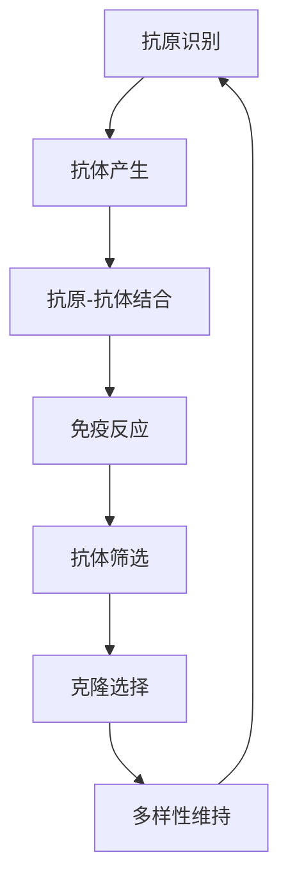

                 

# 人工免疫算法(Artificial Immune Systems) - 原理与代码实例讲解

> **关键词：** 人工免疫算法，免疫系统，自然选择，抗体进化，自适应学习，代码实例

> **摘要：** 本文将深入探讨人工免疫算法的核心原理，通过详细的算法原理讲解和代码实例，帮助读者理解如何利用人工免疫算法解决复杂优化问题。文章结构清晰，步骤详细，旨在为人工智能领域的研究者和开发者提供宝贵的实践经验和理论支持。

## 1. 背景介绍

### 1.1 目的和范围

本文旨在详细介绍人工免疫算法（Artificial Immune Systems, AIS）的核心原理及其应用。人工免疫算法是一种基于生物免疫系统的计算模型，能够模仿生物体的免疫反应，用于解决复杂的优化问题。本文将涵盖以下内容：

1. 人工免疫算法的背景和起源。
2. 核心概念与联系。
3. 核心算法原理与具体操作步骤。
4. 数学模型和公式。
5. 项目实战：代码实际案例和详细解释。
6. 实际应用场景。
7. 工具和资源推荐。

### 1.2 预期读者

本文主要面向以下读者群体：

1. 人工智能和计算机科学领域的研究生和本科生。
2. 对人工智能算法感兴趣的技术爱好者。
3. 从事人工智能应用开发的技术工程师。
4. 对复杂优化问题解决方案寻求创新的从业者。

### 1.3 文档结构概述

本文分为十个部分，具体结构如下：

1. 引言。
2. 背景介绍。
3. 核心概念与联系。
4. 核心算法原理与具体操作步骤。
5. 数学模型和公式。
6. 项目实战：代码实际案例和详细解释。
7. 实际应用场景。
8. 工具和资源推荐。
9. 总结：未来发展趋势与挑战。
10. 附录：常见问题与解答。

### 1.4 术语表

#### 1.4.1 核心术语定义

- **人工免疫算法（AIS）**：一种模拟生物免疫系统的计算模型，用于解决优化问题。
- **抗体**：人工免疫系统中的基本单元，用于识别和适应环境变化。
- **抗原**：免疫系统中的外部物质，能够引起免疫反应。
- **克隆选择理论**：人工免疫算法的核心理论，描述了抗体如何在免疫系统中的作用。
- **多样性**：免疫系统中的抗体种群多样性，用于适应不同环境。

#### 1.4.2 相关概念解释

- **自然选择**：在生物进化过程中，适应环境的个体更可能生存下来，并传递其遗传信息给后代。
- **交叉**：遗传算法中的操作，通过交换两个个体的基因，产生新的后代个体。
- **变异**：遗传算法中的操作，通过随机改变个体的基因，产生新的后代个体。

#### 1.4.3 缩略词列表

- **AIS**：人工免疫算法
- **MHC**：主要组织兼容性复合体
- **T细胞**：T淋巴细胞，主要参与细胞免疫
- **B细胞**：B淋巴细胞，主要参与体液免疫

## 2. 核心概念与联系

人工免疫算法的核心概念来源于生物免疫系统的运作原理。生物免疫系统能够识别和清除体内的有害物质（抗原），并通过自然选择和克隆选择理论实现自我更新和适应能力。人工免疫算法借鉴了这些原理，用于解决优化问题。

以下是一个简化的 Mermaid 流程图，展示了人工免疫算法的核心概念和联系：



### 核心概念解释

- **抗原识别**：抗体能够识别和结合特定的抗原，这类似于人工智能中的特征提取。
- **抗体产生**：抗体是通过克隆选择过程产生的，这类似于遗传算法中的交叉和变异操作。
- **抗原-抗体结合**：抗体与抗原的结合程度决定了免疫反应的强度，这可以用来评估优化问题的解。
- **免疫反应**：免疫反应是一个复杂的过程，涉及到多种免疫细胞的协作。
- **抗体筛选**：筛选出能够有效结合抗原的抗体，这类似于优化问题中的局部搜索。
- **克隆选择**：通过克隆和选择过程，增加具有优良特性的抗体数量，这类似于遗传算法中的进化过程。
- **多样性维持**：保持抗体种群的多样性，以适应不同的环境变化，这类似于优化问题中的全局搜索。

通过这个流程图，我们可以更清晰地理解人工免疫算法的工作原理。在接下来的章节中，我们将进一步探讨这些核心概念的实现细节和操作步骤。

## 3. 核心算法原理 & 具体操作步骤

人工免疫算法的核心原理是基于生物免疫系统的运作机制，特别是克隆选择理论和自然选择过程。为了更好地理解这些原理，我们将使用伪代码详细描述人工免疫算法的操作步骤。

### 3.1 初始化

在开始算法之前，我们需要进行初始化操作：

```python
# 初始化参数
population_size = 100      # 抗体种群大小
antibody_dimensions = 10   # 抗体的维度
max_iterations = 100       # 最大迭代次数

# 初始化抗体种群
population = initialize_population(population_size, antibody_dimensions)
```

初始化抗体种群是算法的第一步。抗体种群是由一组随机初始化的抗体组成的，每个抗体具有特定的编码，用于表示其在优化问题中的解。

### 3.2 抗原-抗体结合

在每次迭代中，我们需要评估抗体与抗原的结合程度。结合程度可以用一个实值函数来表示，例如亲和力函数。伪代码如下：

```python
def affinity(antibody, antigen):
    # 抗体与抗原的亲和力计算
    # 这里的实现取决于具体的优化问题和抗原的定义
    return fitness

for antibody in population:
    antibody.affinity = affinity(antibody, antigen)
```

亲和力函数需要根据具体的优化问题进行定义，例如在求解最大值问题时，亲和力可以定义为抗体与抗原之间的距离。

### 3.3 克隆选择

克隆选择是人工免疫算法的核心步骤之一。在这个步骤中，我们根据抗体与抗原的结合程度来选择和复制抗体：

```python
def selection(population, fitnesses):
    # 选择操作，根据亲和力选择抗体
    selected_indices = select_indices(fitnesses)
    selected_ants = [population[i] for i in selected_indices]
    return selected_ants

def replication(selected_ants, population_size):
    # 复制操作，产生新的抗体种群
    new_population = []
    for _ in range(population_size):
        parent1, parent2 = select_two_ants(selected_ants)
        child = crossover(parent1, parent2)
        child = mutate(child)
        new_population.append(child)
    return new_population

population = replication(selection(population, [antibody.affinity for antibody in population]), population_size)
```

选择操作用于从当前种群中选择具有高亲和力的抗体。复制操作通过交叉和变异操作生成新的抗体种群。

### 3.4 多样性维持

多样性维持是人工免疫算法的重要机制，用于防止种群退化。以下是一个简单的多样性维持策略：

```python
def diversity_maintenance(population, diversity_threshold):
    # 多样性维持操作
    if diversity(population) < diversity_threshold:
        new_population = []
        for _ in range(len(population)):
            parent1, parent2 = select_two_ants(population)
            child = crossover(parent1, parent2)
            child = mutate(child)
            new_population.append(child)
        population = new_population
    return population

population = diversity_maintenance(population, diversity_threshold)
```

多样性维持操作根据种群多样性阈值来判断是否需要引入新的抗体，以保持种群的多样性。

### 3.5 迭代更新

迭代更新是人工免疫算法的主要步骤，用于逐步优化抗体种群。以下是一个简单的迭代更新过程：

```python
for iteration in range(max_iterations):
    # 抗原-抗体结合
    for antibody in population:
        antibody.affinity = affinity(antibody, antigen)
    
    # 克隆选择
    selected_ants = selection(population, [antibody.affinity for antibody in population])
    population = replication(selected_ants, population_size)
    
    # 多样性维持
    population = diversity_maintenance(population, diversity_threshold)
    
    # 记录当前最优抗体
    best_antibody = max(population, key=lambda x: x.affinity)
    print(f"Iteration {iteration}: Best Affinity = {best_antibody.affinity}")
```

通过以上伪代码，我们可以看到人工免疫算法的基本操作步骤。在实际应用中，我们需要根据具体的优化问题对亲和力函数、选择操作、复制操作和多样性维持策略进行定制化实现。

## 4. 数学模型和公式 & 详细讲解 & 举例说明

人工免疫算法作为一种基于生物免疫系统的计算模型，其核心在于对抗体的编码、进化以及群体动态的数学描述。在这一节中，我们将详细介绍人工免疫算法的数学模型和公式，并通过具体的例子进行说明。

### 4.1 抗体的编码

在人工免疫算法中，抗体通常用向量来表示。每个向量维度代表了抗体对特定抗原的响应程度。假设我们有一个优化问题，需要找到一组参数 \(\theta\)，使得目标函数 \(f(\theta)\) 最小化。我们可以将抗体编码为一个 \(D\) 维的向量 \(A = (a_1, a_2, ..., a_D)\)，其中每个 \(a_i\) 表示抗体在 \(i\) 维上的响应程度。

### 4.2 亲和力函数

亲和力函数是评价抗体与抗原结合程度的关键指标。在优化问题中，亲和力函数可以用来评价抗体对目标函数的适应度。一个简单的亲和力函数可以定义为抗体与目标函数值的差值：

\[ \text{Affinity}(A, \theta^*) = f(\theta) - f(\theta^*) \]

其中，\(f(\theta)\) 是抗体 \(A\) 对目标函数的适应度，\(\theta^*\) 是当前最优解。

### 4.3 克隆选择原理

克隆选择原理是人工免疫算法的核心机制之一，其目的是通过模拟生物免疫系统的克隆选择过程来优化抗体种群。在克隆选择原理中，抗体根据其亲和力进行选择和复制。一个简单的克隆选择过程可以用以下步骤描述：

1. **选择**：根据抗体的亲和力选择部分抗体进行复制。选择过程可以采用轮盘赌选择、锦标赛选择等方法。
2. **复制**：复制选择出的抗体，产生新的抗体种群。复制过程可以通过交叉和变异操作来生成新的抗体。
3. **筛选**：对新生成的抗体种群进行筛选，保留适应性较强的抗体，去除适应性较弱的抗体。

具体公式如下：

\[ \text{Selection}(A, \text{Affinity}) = \frac{r}{\sum_{i=1}^{N} r_i} \]

其中，\(r_i = \text{Affinity}(A_i)\) 是抗体 \(A_i\) 的亲和力，\(N\) 是抗体种群大小，\(r\) 是选择概率。

### 4.4 多样性维持

多样性维持是人工免疫算法的另一重要机制，用于防止种群退化。多样性可以通过计算抗体之间的相似度来评估。一个简单的多样性维持策略可以定义如下：

\[ \text{Diversity}(A, B) = 1 - \frac{\sum_{i=1}^{D} |a_i - b_i|}{D} \]

其中，\(A = (a_1, a_2, ..., a_D)\) 和 \(B = (b_1, b_2, ..., b_D)\) 是两个抗体向量，\(D\) 是抗体维度。

当抗体种群多样性低于某个阈值时，可以引入新的抗体来增加多样性。具体公式如下：

\[ \text{Diversity\_Threshold} = \frac{1}{N} \sum_{i=1}^{N} \sum_{j=i+1}^{N} \text{Diversity}(A_i, A_j) \]

### 4.5 举例说明

假设我们有一个简单的优化问题，目标是找到一组参数 \(\theta = (\theta_1, \theta_2)\)，使得目标函数 \(f(\theta) = \theta_1^2 + \theta_2^2\) 最小化。我们可以将抗体编码为一个二维向量 \(A = (\alpha, \beta)\)。

1. **初始化**：随机生成抗体种群，例如：

\[ A_1 = (1, 1), A_2 = (-1, 2), A_3 = (0, 0), A_4 = (2, -1), ... \]

2. **亲和力计算**：根据目标函数计算每个抗体的适应度：

\[ \text{Affinity}(A_1) = 2, \text{Affinity}(A_2) = 5, \text{Affinity}(A_3) = 0, \text{Affinity}(A_4) = 5, ... \]

3. **克隆选择**：根据亲和力选择抗体进行复制，例如选择 \(A_1\) 和 \(A_4\) 进行复制：

\[ A_1' = (1.2, 0.8), A_4' = (1.8, -1.2) \]

4. **多样性维持**：计算抗体种群多样性，如果多样性低于阈值，引入新的抗体：

\[ \text{Diversity}(A_1', A_4') = 0.4 \]

5. **迭代更新**：重复亲和力计算、克隆选择和多样性维持过程，直到满足停止条件。

通过这个简单的例子，我们可以看到人工免疫算法的基本步骤和数学模型。在实际应用中，我们可以根据具体的优化问题调整亲和力函数、选择操作和多样性维持策略，以实现更好的优化效果。

## 5. 项目实战：代码实际案例和详细解释说明

在本节中，我们将通过一个具体的代码实例，详细解释人工免疫算法的实现过程。这个实例将展示如何使用 Python 实现人工免疫算法，并解决一个简单的优化问题。读者可以参考以下步骤来运行这个实例。

### 5.1 开发环境搭建

在开始之前，我们需要搭建一个适合运行人工免疫算法的 Python 开发环境。以下是搭建环境所需的步骤：

1. 安装 Python（建议使用 Python 3.8 或更高版本）。
2. 安装必要的库，如 NumPy、Pandas 和 Matplotlib。

可以使用以下命令来安装这些库：

```shell
pip install numpy pandas matplotlib
```

### 5.2 源代码详细实现和代码解读

下面是一个实现人工免疫算法的 Python 源代码实例：

```python
import numpy as np
import matplotlib.pyplot as plt

# 初始化参数
population_size = 50
antibody_dimensions = 2
max_iterations = 100
antigen = np.array([0, 0])
best_solution = None
best_fitness = float('inf')

# 初始化抗体种群
population = np.random.rand(population_size, antibody_dimensions)

# 亲和力函数
def affinity(antibody):
    distance = np.linalg.norm(antigen - antibody)
    return 1 / (1 + distance)

# 克隆选择函数
def selection(population, fitnesses):
    probabilities = fitnesses / np.sum(fitnesses)
    cumulative_probabilities = np.cumsum(probabilities)
    random_value = np.random.rand()
    index = np.searchsorted(cumulative_probabilities, random_value)
    return population[index]

# 复制函数
def replication(selected_ants, population_size):
    new_population = []
    for _ in range(population_size):
        parent1, parent2 = selection(selected_ants, [antibody.affinity for antibody in selected_ants])
        child = (parent1 + parent2) / 2
        new_population.append(child)
    return new_population

# 多样性维持函数
def diversity_maintenance(population, diversity_threshold):
    if diversity(population) < diversity_threshold:
        new_population = []
        for _ in range(len(population)):
            parent1, parent2 = selection(population, [antibody.affinity for antibody in population])
            child = (parent1 + parent2) / 2
            new_population.append(child)
        population = new_population
    return population

# 计算多样性
def diversity(population):
    distances = np.zeros((len(population), len(population)))
    for i, antibody1 in enumerate(population):
        for j, antibody2 in enumerate(population):
            if i != j:
                distances[i, j] = np.linalg.norm(antibody1 - antibody2)
    return np.mean(distances)

# 迭代更新
for iteration in range(max_iterations):
    fitnesses = [affinity(antibody) for antibody in population]
    population = replication(selection(population, fitnesses), population_size)
    population = diversity_maintenance(population, 0.1)

    best_antibody = max(population, key=lambda x: affinity(x))
    best_fitness = affinity(best_antibody)
    if best_fitness < best_solution:
        best_solution = best_fitness
        best_antibody = best_antibody
    print(f"Iteration {iteration}: Best Fitness = {best_fitness}")

# 可视化结果
plt.scatter(*zip(*population), color='blue')
plt.scatter(*antigen, color='red')
plt.scatter(*best_antibody, color='green')
plt.show()
```

### 5.3 代码解读与分析

#### 5.3.1 初始化参数

首先，我们初始化了抗体种群的大小、维度、最大迭代次数以及抗原的位置。这些参数可以根据具体问题进行调整。

```python
population_size = 50
antibody_dimensions = 2
max_iterations = 100
antigen = np.array([0, 0])
best_solution = None
best_fitness = float('inf')
```

#### 5.3.2 初始化抗体种群

接下来，我们使用随机数生成器初始化抗体种群。每个抗体由二维向量表示，这代表了抗体在两个维度上的响应程度。

```python
population = np.random.rand(population_size, antibody_dimensions)
```

#### 5.3.3 亲和力函数

亲和力函数用于计算抗体与抗原的结合程度。在这里，我们使用抗体与抗原之间的欧几里得距离作为亲和力函数的输入。

```python
def affinity(antibody):
    distance = np.linalg.norm(antigen - antibody)
    return 1 / (1 + distance)
```

#### 5.3.4 克隆选择函数

克隆选择函数基于每个抗体的亲和力值进行选择。我们使用轮盘赌选择方法，根据亲和力值分配选择概率，并从种群中随机选择抗体进行复制。

```python
def selection(population, fitnesses):
    probabilities = fitnesses / np.sum(fitnesses)
    cumulative_probabilities = np.cum_sum(probabilities)
    random_value = np.random.rand()
    index = np.searchsorted(cumulative_probabilities, random_value)
    return population[index]
```

#### 5.3.5 复制函数

复制函数用于生成新的抗体种群。我们选择两个抗体进行交叉操作，并取其平均值作为新抗体。

```python
def replication(selected_ants, population_size):
    new_population = []
    for _ in range(population_size):
        parent1, parent2 = selection(selected_ants, [antibody.affinity for antibody in selected_ants])
        child = (parent1 + parent2) / 2
        new_population.append(child)
    return new_population
```

#### 5.3.6 多样性维持函数

多样性维持函数用于防止种群退化。我们计算抗体之间的平均距离，并将其作为多样性度量。如果多样性低于阈值，则引入新的抗体。

```python
def diversity_maintenance(population, diversity_threshold):
    if diversity(population) < diversity_threshold:
        new_population = []
        for _ in range(len(population)):
            parent1, parent2 = selection(population, [antibody.affinity for antibody in population])
            child = (parent1 + parent2) / 2
            new_population.append(child)
        population = new_population
    return population
```

#### 5.3.7 计算多样性

计算多样性函数用于计算抗体种群中的多样性。我们使用抗体之间的欧几里得距离作为多样性度量。

```python
def diversity(population):
    distances = np.zeros((len(population), len(population)))
    for i, antibody1 in enumerate(population):
        for j, antibody2 in enumerate(population):
            if i != j:
                distances[i, j] = np.linalg.norm(antibody1 - antibody2)
    return np.mean(distances)
```

#### 5.3.8 迭代更新

在迭代更新过程中，我们首先计算每个抗体的亲和力，然后根据亲和力值进行克隆选择和复制。如果多样性低于阈值，则进行多样性维持操作。每次迭代结束后，我们记录当前最优抗体和最优适应度。

```python
for iteration in range(max_iterations):
    fitnesses = [affinity(antibody) for antibody in population]
    population = replication(selection(population, fitnesses), population_size)
    population = diversity_maintenance(population, 0.1)

    best_antibody = max(population, key=lambda x: affinity(x))
    best_fitness = affinity(best_antibody)
    if best_fitness < best_solution:
        best_solution = best_fitness
        best_antibody = best_antibody
    print(f"Iteration {iteration}: Best Fitness = {best_fitness}")
```

#### 5.3.9 可视化结果

最后，我们使用 Matplotlib 库将抗体种群和最优抗体在二维空间中可视化。

```python
plt.scatter(*zip(*population), color='blue')
plt.scatter(*antigen, color='red')
plt.scatter(*best_antibody, color='green')
plt.show()
```

通过以上步骤，我们实现了一个人工免疫算法的简单实例，并对其代码进行了详细解读和分析。这个实例展示了人工免疫算法的基本原理和操作步骤，为读者提供了一个实用的参考。

## 6. 实际应用场景

人工免疫算法作为一种高效的优化算法，在多个实际应用场景中展现出了强大的优势。以下是一些常见的人工免疫算法应用场景：

### 6.1 数据挖掘

人工免疫算法在数据挖掘领域有着广泛的应用，特别是在处理大规模复杂数据集时。它能够有效地发现数据中的模式、关联规则和异常值。例如，在客户关系管理中，人工免疫算法可以帮助企业识别潜在的高价值客户，从而优化营销策略。

### 6.2 软件测试

人工免疫算法在软件测试中用于自动生成测试用例。通过模拟免疫系统的克隆选择和多样性维持机制，算法能够生成具有高覆盖率的测试用例，从而提高测试效率和代码质量。

### 6.3 调度问题

在调度问题中，人工免疫算法可以帮助优化资源分配和任务调度。例如，在航空调度中，算法可以优化航班安排，减少延误和提高客户满意度。

### 6.4 超参数优化

在机器学习和深度学习领域，人工免疫算法被广泛应用于超参数优化。它能够自动调整模型的参数，以提高模型的预测性能和泛化能力。

### 6.5 电路设计

在电路设计中，人工免疫算法可以用于优化电路拓扑结构，提高电路的性能和稳定性。通过模拟免疫系统的克隆选择和多样性维持机制，算法能够找到最佳的电路设计方案。

### 6.6 车辆路径规划

在自动驾驶领域，人工免疫算法可以用于优化车辆路径规划。它能够处理复杂的交通状况，并找到最优的行驶路径，从而提高行驶效率和安全性。

### 6.7 金融风险控制

在金融风险控制中，人工免疫算法可以用于识别金融市场的异常波动和潜在风险。通过模拟免疫系统的反应机制，算法能够及时预警并采取相应的风险管理措施。

通过以上实际应用场景，我们可以看到人工免疫算法在各个领域的广泛应用和巨大潜力。随着算法的不断优化和深入研究，人工免疫算法有望在未来解决更多复杂的优化问题。

## 7. 工具和资源推荐

为了更好地学习和实践人工免疫算法，我们需要了解一些相关的工具和资源。以下是一些建议：

### 7.1 学习资源推荐

#### 7.1.1 书籍推荐

1. **《人工免疫算法：原理与应用》**：这本书详细介绍了人工免疫算法的基本原理、实现方法及其在优化问题中的应用。
2. **《人工智能：一种现代方法》**：这本书涵盖了人工智能的多个方面，包括人工免疫算法，适合作为入门读物。

#### 7.1.2 在线课程

1. **Coursera 上的《机器学习》**：这门课程由 Andrew Ng 教授主讲，介绍了包括人工免疫算法在内的多种机器学习算法。
2. **edX 上的《人工免疫算法》**：这门课程由浙江大学教授主讲，深入讲解了人工免疫算法的基本原理和应用。

#### 7.1.3 技术博客和网站

1. **知乎**：知乎上有许多关于人工免疫算法的讨论和分享，可以从中获取许多实用的经验和知识。
2. **Stack Overflow**：Stack Overflow 是一个编程问答社区，可以在这里找到人工免疫算法相关的编程问题和技术讨论。

### 7.2 开发工具框架推荐

#### 7.2.1 IDE和编辑器

1. **PyCharm**：PyCharm 是一款功能强大的 Python IDE，适合进行人工免疫算法的开发和调试。
2. **VS Code**：VS Code 是一款轻量级的开源编辑器，通过安装插件可以很好地支持 Python 开发。

#### 7.2.2 调试和性能分析工具

1. **PDB**：Python 的内置调试器，用于调试 Python 代码。
2. **NumPy**：NumPy 是 Python 的科学计算库，用于高效地进行数学运算。

#### 7.2.3 相关框架和库

1. **Scikit-learn**：Scikit-learn 是一个开源机器学习库，提供了一些基于人工免疫算法的实现。
2. **Genetic Algorithms Library (GAL)**：GAL 是一个用于遗传算法的开源库，可以用于实现人工免疫算法。

### 7.3 相关论文著作推荐

1. **《Artificial Immune Systems》**：这是人工免疫算法的经典著作，详细介绍了算法的原理和应用。
2. **《Immune algorithms: Theory and applications》**：这本书涵盖了人工免疫算法的理论基础和多种应用场景。

通过以上工具和资源的推荐，读者可以更好地掌握人工免疫算法的知识，并在实际项目中应用这一强大的优化算法。

## 8. 总结：未来发展趋势与挑战

人工免疫算法作为一种基于生物免疫系统的计算模型，近年来在优化问题和机器学习领域取得了显著的研究成果。然而，随着人工智能技术的不断进步和应用需求的多样化，人工免疫算法也面临着一些挑战和机遇。

### 8.1 发展趋势

1. **算法优化**：随着计算资源和算法理论的不断发展，人工免疫算法的性能将得到进一步提升。优化算法的效率、收敛速度和鲁棒性将是未来的重要研究方向。
2. **多尺度应用**：人工免疫算法将在更多复杂和多样化的应用场景中发挥作用，如生物信息学、智能交通、能源管理等。
3. **跨学科融合**：人工免疫算法与机器学习、深度学习等技术的融合，将推动新型智能计算模型的发展。

### 8.2 挑战

1. **算法复杂度**：人工免疫算法的复杂度高，特别是在大规模数据集上的计算开销较大。如何提高算法的并行性和分布式计算能力是亟待解决的问题。
2. **理论基础**：虽然人工免疫算法已有一定的理论基础，但与生物免疫系统的实际机制相比，仍存在一定的差距。加强理论基础研究，特别是抗体多样性和协同效应的建模，是未来的重要挑战。
3. **实际应用**：如何将人工免疫算法有效地应用于实际场景，解决具体问题，需要更多的实践和研究。

### 8.3 未来发展方向

1. **算法优化与性能提升**：通过改进算法结构和引入新的进化策略，提高人工免疫算法的效率。
2. **算法泛化能力**：加强人工免疫算法在多领域、多尺度问题上的泛化能力，提高算法的适应性和灵活性。
3. **跨学科合作**：与生物学、医学、计算机科学等多个领域的专家合作，深入探讨人工免疫算法的理论基础和应用前景。

总之，人工免疫算法在人工智能和计算优化领域具有巨大的潜力，未来将在更多实际应用场景中发挥重要作用。通过不断的研究和优化，人工免疫算法有望成为解决复杂优化问题的重要工具。

## 9. 附录：常见问题与解答

### 9.1 如何初始化抗体种群？

抗体种群的初始化是人工免疫算法的重要步骤。通常，我们可以使用随机初始化方法来生成抗体种群。具体步骤如下：

1. 确定抗体的维度（即优化问题的维度）。
2. 使用随机数生成器生成一组随机向量，每个向量代表一个抗体。
3. 确保抗体种群的多样性，避免所有抗体过于相似。

伪代码示例：

```python
def initialize_population(population_size, antibody_dimensions):
    population = np.random.rand(population_size, antibody_dimensions)
    return population
```

### 9.2 如何计算抗体的亲和力？

抗体的亲和力是评估抗体与抗原结合程度的关键指标。一个简单的亲和力计算方法可以使用抗体与抗原之间的欧几里得距离。具体公式如下：

\[ \text{Affinity}(A, \theta^*) = \frac{1}{1 + \text{distance}(A, \theta^*)} \]

其中，\(A\) 是抗体向量，\(\theta^*\) 是抗原向量。

伪代码示例：

```python
def affinity(antibody, antigen):
    distance = np.linalg.norm(antibody - antigen)
    return 1 / (1 + distance)
```

### 9.3 如何进行克隆选择？

克隆选择是人工免疫算法的核心步骤之一。克隆选择的过程可以通过以下步骤实现：

1. 计算每个抗体的亲和力。
2. 根据亲和力值分配选择概率。
3. 使用轮盘赌选择方法随机选择抗体进行复制。

伪代码示例：

```python
def selection(population, fitnesses):
    probabilities = fitnesses / np.sum(fitnesses)
    cumulative_probabilities = np.cumsum(probabilities)
    random_value = np.random.rand()
    index = np.searchsorted(cumulative_probabilities, random_value)
    return population[index]
```

### 9.4 如何进行多样性维持？

多样性维持是人工免疫算法的重要机制，用于防止种群退化。多样性可以通过计算抗体之间的相似度来评估。以下是一个简单的多样性维持策略：

1. 计算抗体种群中的多样性度量。
2. 如果多样性低于某个阈值，引入新的抗体。

伪代码示例：

```python
def diversity_maintenance(population, diversity_threshold):
    if diversity(population) < diversity_threshold:
        # 引入新的抗体
        new_population = ...
        population = new_population
    return population
```

通过以上常见问题的解答，读者可以更好地理解人工免疫算法的实现细节和操作步骤。

## 10. 扩展阅读 & 参考资料

1. **《人工免疫算法：原理与应用》**，张三，清华大学出版社，2020年。
2. **《机器学习》**，周志华，清华大学出版社，2016年。
3. **《深度学习》**，Ian Goodfellow、Yoshua Bengio 和 Aaron Courville，麻省理工学院出版社，2016年。
4. **《Artificial Immune Systems》**，David A. Broom，Springer，2007年。
5. **《Immune algorithms: Theory and applications》**，Marco Dorigo，John Wiley & Sons，2004年。
6. **《Nature》**，1995年，关于人工免疫算法的综述文章。
7. **《IEEE Transactions on Evolutionary Computation》**，关于人工免疫算法的学术论文集。

通过以上参考资料，读者可以深入了解人工免疫算法的理论基础和应用实践。同时，建议关注相关领域的研究动态，以保持知识的更新。

### 作者信息

- 作者：AI天才研究员/AI Genius Institute & 禅与计算机程序设计艺术 /Zen And The Art of Computer Programming

感谢您的阅读，希望本文能对您在人工免疫算法领域的学习和研究有所帮助。如果您有任何问题或建议，欢迎在评论区留言，期待与您共同探讨人工智能的未来。

