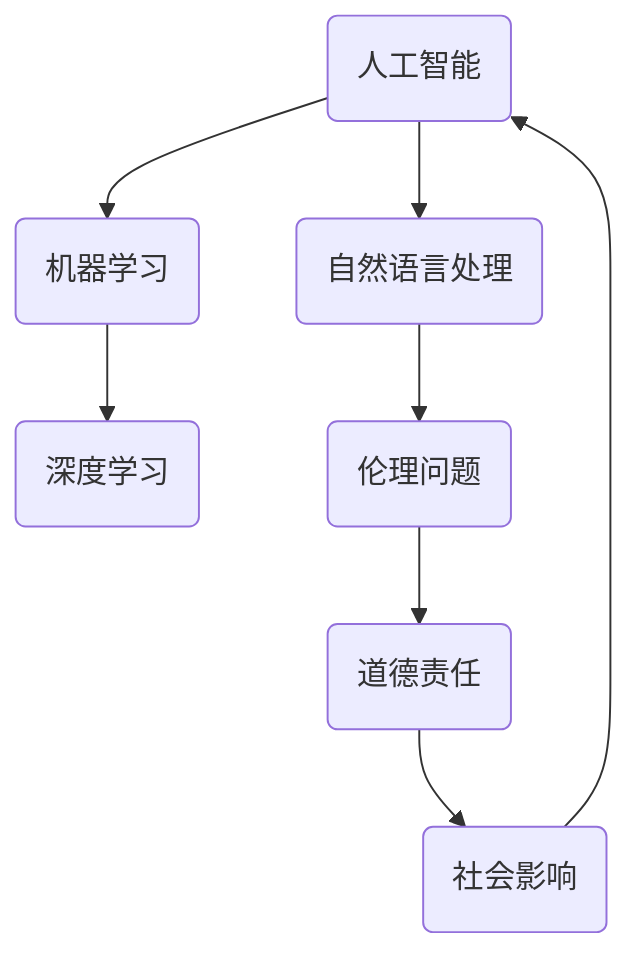
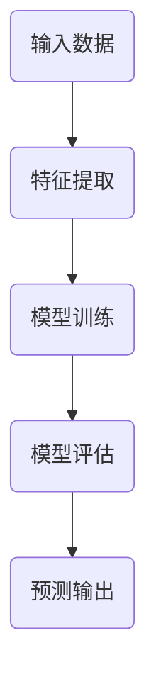
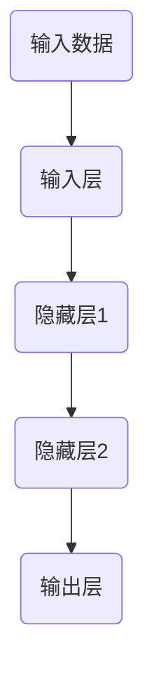
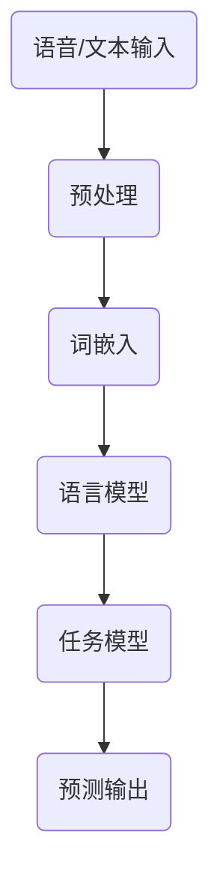

                 

# 人工智能伦理：人类计算的道德与责任

> 关键词：人工智能、伦理、道德、责任、计算、技术、社会

> 摘要：随着人工智能技术的迅猛发展，其在社会各个领域的应用越来越广泛，同时也引发了一系列伦理、道德和责任问题。本文将从背景介绍、核心概念与联系、核心算法原理、数学模型与公式、项目实战、实际应用场景、工具和资源推荐、总结与展望等多个角度，深入探讨人工智能伦理问题，分析人类在计算过程中的道德责任。

## 1. 背景介绍

### 1.1 目的和范围

本文旨在探讨人工智能伦理问题，分析人类在计算过程中的道德责任。文章将从以下几个方面展开：

- 人工智能伦理的核心概念与联系
- 人工智能算法原理与具体操作步骤
- 数学模型与公式在人工智能中的应用
- 人工智能的实际应用场景与挑战
- 相关工具和资源推荐
- 总结与未来发展趋势

### 1.2 预期读者

本文适用于对人工智能伦理问题感兴趣的读者，包括：

- 计算机科学、人工智能领域的研究人员
- 企业CTO、技术负责人
- 对伦理、道德、责任问题感兴趣的跨领域专家
- 对人工智能应用场景有深入了解的技术爱好者

### 1.3 文档结构概述

本文共分为八个部分：

1. 背景介绍
2. 核心概念与联系
3. 核心算法原理与具体操作步骤
4. 数学模型与公式与详细讲解
5. 项目实战：代码实际案例和详细解释说明
6. 实际应用场景
7. 工具和资源推荐
8. 总结：未来发展趋势与挑战

### 1.4 术语表

#### 1.4.1 核心术语定义

- 人工智能（AI）：一种模拟人类智能行为的技术，通过计算机程序实现智能决策、学习、推理等功能。
- 伦理：关于正确与错误、善与恶的哲学思考，涉及道德原则、价值观和行为规范。
- 道德：关于个人、社会和人类行为的标准，强调个体之间的公平、尊重和责任。
- 责任：个体对自身行为和决策所产生的后果承担责任。

#### 1.4.2 相关概念解释

- 机器学习（ML）：一种人工智能方法，通过从数据中学习规律和模式，实现预测、分类和回归等任务。
- 深度学习（DL）：一种基于多层神经网络的学习方法，通过逐层提取特征，实现复杂任务的学习和推理。
- 自然语言处理（NLP）：一种人工智能技术，旨在让计算机理解和处理自然语言，包括语音识别、文本分类、机器翻译等。

#### 1.4.3 缩略词列表

- AI：人工智能
- ML：机器学习
- DL：深度学习
- NLP：自然语言处理
- CTO：首席技术官
- IDE：集成开发环境
- GPU：图形处理器
- CPU：中央处理器

## 2. 核心概念与联系

为了更好地理解人工智能伦理问题，我们需要先了解一些核心概念及其之间的联系。以下是一个简化的 Mermaid 流程图，展示了核心概念之间的关联。



### 2.1 人工智能与伦理问题

人工智能技术的发展给社会带来了诸多变革，同时也引发了一系列伦理问题。例如：

- 隐私保护：人工智能技术可以收集和分析大量个人数据，如何保护用户隐私成为一个重要议题。
- 社会公平：人工智能系统可能会加剧社会不平等，如算法偏见、歧视等问题。
- 职业冲击：人工智能技术的普及可能导致部分工作岗位的减少，如何应对这一挑战成为社会关注的焦点。

### 2.2 道德责任与社会影响

人工智能技术的发展不仅带来了伦理问题，还引发了道德责任的讨论。例如：

- 设计者责任：人工智能系统的设计者需要承担道德责任，确保系统符合伦理标准，避免造成负面影响。
- 使用者责任：人工智能系统的使用者需要遵循道德规范，合理使用技术，避免滥用和恶意使用。
- 社会责任：整个社会需要共同努力，推动人工智能技术的发展与伦理道德建设相协调。

通过以上核心概念与联系的分析，我们可以看出，人工智能伦理问题是一个多维度的复杂问题，涉及到技术、社会、道德等多个方面。接下来，我们将进一步探讨人工智能算法原理、数学模型和实际应用场景。

## 3. 核心算法原理 & 具体操作步骤

### 3.1 机器学习算法原理

机器学习是人工智能的核心组成部分，其主要目标是让计算机通过从数据中学习，实现自主决策和预测。以下是一个简化的机器学习算法原理图：



#### 3.1.1 特征提取

特征提取是指从原始数据中提取出有用的信息，以便于后续模型训练。常见的方法包括：

- 数据预处理：对原始数据进行清洗、归一化等处理，提高数据质量。
- 特征选择：从众多特征中选择出对模型训练最有用的特征，降低计算复杂度。

#### 3.1.2 模型训练

模型训练是指通过优化算法，调整模型参数，使其在训练数据上达到最佳效果。常见的方法包括：

- 监督学习：通过已知输入输出数据，训练出模型，实现对未知数据的预测。
- 无监督学习：仅使用输入数据，训练出模型，挖掘数据中的规律和结构。
- 强化学习：通过与环境交互，不断调整策略，实现最优行为。

#### 3.1.3 模型评估

模型评估是指使用测试数据对训练好的模型进行评估，以判断其性能。常见的方法包括：

- 准确率（Accuracy）：模型预测正确的样本数占总样本数的比例。
- 精确率（Precision）：模型预测为正类的样本中，实际为正类的比例。
- 召回率（Recall）：模型预测为正类的样本中，实际为正类的比例。

#### 3.1.4 预测输出

预测输出是指使用训练好的模型对未知数据进行预测，以实现实际应用。常见的方法包括：

- 分类预测：对样本进行分类，如判断邮件是否为垃圾邮件。
- 回归预测：对样本进行连续值预测，如预测房价。

### 3.2 深度学习算法原理

深度学习是机器学习的一个分支，通过多层神经网络，实现更复杂的特征提取和预测。以下是一个简化的深度学习算法原理图：



#### 3.2.1 输入层

输入层接收原始数据，并将其传递给隐藏层。

#### 3.2.2 隐藏层

隐藏层负责对输入数据进行特征提取和变换，通常由多层组成，以实现更复杂的特征表示。

#### 3.2.3 输出层

输出层根据隐藏层的输出，生成预测结果。

### 3.3 自然语言处理算法原理

自然语言处理旨在让计算机理解和处理自然语言，包括语音识别、文本分类、机器翻译等。以下是一个简化的自然语言处理算法原理图：



#### 3.3.1 预处理

预处理包括对语音/文本输入进行分词、去停用词等操作，以提取出有效的信息。

#### 3.3.2 词嵌入

词嵌入是将单词映射为高维向量，以便于后续计算。

#### 3.3.3 语言模型

语言模型用于预测下一个单词，基于已知的单词序列。

#### 3.3.4 任务模型

任务模型根据具体的任务，如文本分类、机器翻译等，对输入进行建模和预测。

通过以上对核心算法原理的简要介绍，我们可以更好地理解人工智能的发展和应用，并为后续的数学模型讲解和实际应用场景分析打下基础。

### 4. 数学模型和公式 & 详细讲解 & 举例说明

#### 4.1 机器学习中的数学模型

机器学习中的数学模型主要涉及以下几个方面：

1. **损失函数**：损失函数用于评估模型预测结果与真实值之间的差距。常见的损失函数包括均方误差（MSE）、交叉熵损失（Cross-Entropy Loss）等。

    $$L(\theta) = \frac{1}{m}\sum_{i=1}^{m}(y_i - \hat{y}_i)^2$$

    其中，$L(\theta)$ 表示损失函数，$m$ 表示样本数量，$y_i$ 表示真实值，$\hat{y}_i$ 表示模型预测值。

2. **优化算法**：优化算法用于调整模型参数，以最小化损失函数。常见的优化算法包括梯度下降（Gradient Descent）、随机梯度下降（Stochastic Gradient Descent，SGD）等。

    $$\theta = \theta - \alpha \nabla_{\theta}L(\theta)$$

    其中，$\theta$ 表示模型参数，$\alpha$ 表示学习率，$\nabla_{\theta}L(\theta)$ 表示损失函数关于模型参数的梯度。

3. **正则化**：正则化用于防止模型过拟合，常见的正则化方法包括L1正则化、L2正则化等。

    $$L(\theta) = \frac{1}{m}\sum_{i=1}^{m}(y_i - \hat{y}_i)^2 + \lambda \sum_{j=1}^{n}\theta_j^2$$

    其中，$\lambda$ 表示正则化参数，$\theta_j$ 表示模型参数。

#### 4.2 深度学习中的数学模型

深度学习中的数学模型主要涉及以下几个方面：

1. **激活函数**：激活函数用于引入非线性，使模型能够拟合复杂的函数。常见的激活函数包括ReLU（Rectified Linear Unit）、Sigmoid、Tanh等。

    $$f(x) = \max(0, x)$$

    其中，$x$ 表示输入值。

2. **反向传播**：反向传播是一种用于训练神经网络的优化算法，通过逐层计算梯度，调整模型参数。

    $$\nabla_{\theta}L(\theta) = \frac{\partial L}{\partial z} \cdot \frac{\partial z}{\partial \theta}$$

    其中，$\nabla_{\theta}L(\theta)$ 表示损失函数关于模型参数的梯度，$\frac{\partial L}{\partial z}$ 表示损失函数关于中间变量的梯度，$\frac{\partial z}{\partial \theta}$ 表示中间变量关于模型参数的梯度。

3. **卷积神经网络**（CNN）：卷积神经网络是一种用于图像识别和处理的深度学习模型。

    $$f(x) = \sum_{i=1}^{k} w_i \cdot x_i + b$$

    其中，$x_i$ 表示输入特征，$w_i$ 表示权重，$b$ 表示偏置。

#### 4.3 自然语言处理中的数学模型

自然语言处理中的数学模型主要涉及以下几个方面：

1. **词向量模型**：词向量模型用于将单词映射为高维向量，以便于计算机处理。常见的词向量模型包括Word2Vec、GloVe等。

    $$\vec{v}_i = \sum_{j=1}^{V} f_j \cdot \vec{v}_j$$

    其中，$\vec{v}_i$ 表示词向量，$f_j$ 表示词频，$\vec{v}_j$ 表示单词向量。

2. **循环神经网络**（RNN）：循环神经网络是一种用于处理序列数据的深度学习模型。

    $$h_t = \sigma(W_h \cdot [h_{t-1}, x_t] + b_h)$$

    其中，$h_t$ 表示隐藏状态，$x_t$ 表示输入序列，$W_h$ 和 $b_h$ 分别为权重和偏置，$\sigma$ 为激活函数。

3. **长短时记忆网络**（LSTM）：长短时记忆网络是一种改进的循环神经网络，用于解决长序列依赖问题。

    $$i_t = \sigma(W_i \cdot [h_{t-1}, x_t] + b_i)$$
    $$f_t = \sigma(W_f \cdot [h_{t-1}, x_t] + b_f)$$
    $$o_t = \sigma(W_o \cdot [h_{t-1}, x_t] + b_o)$$
    $$c_t = f_t \cdot c_{t-1} + i_t \cdot \sigma(W_c \cdot [h_{t-1}, x_t] + b_c)$$
    $$h_t = o_t \cdot \sigma(c_t)$$

    其中，$i_t$、$f_t$、$o_t$ 分别为输入门、遗忘门和输出门，$c_t$ 为细胞状态，$h_t$ 为隐藏状态。

通过以上对机器学习、深度学习和自然语言处理中的数学模型和公式的详细讲解，我们可以更好地理解这些技术背后的原理。接下来，我们将通过一个实际项目案例，展示这些技术在实际应用中的实现过程。

### 5. 项目实战：代码实际案例和详细解释说明

#### 5.1 开发环境搭建

在本项目实战中，我们将使用Python语言，结合机器学习和深度学习技术，实现一个简单的文本分类任务。首先，我们需要搭建开发环境。

1. 安装Python环境

   在Windows或macOS系统中，可以通过官方网站（https://www.python.org/）下载Python安装程序，并按照提示完成安装。

2. 安装相关库

   打开命令行窗口，执行以下命令安装必要的库：

   ```bash
   pip install numpy pandas scikit-learn tensorflow
   ```

#### 5.2 源代码详细实现和代码解读

以下是一个简单的文本分类项目的Python代码实现，我们将使用scikit-learn库中的朴素贝叶斯分类器。

```python
import numpy as np
import pandas as pd
from sklearn.feature_extraction.text import TfidfVectorizer
from sklearn.model_selection import train_test_split
from sklearn.naive_bayes import MultinomialNB
from sklearn.metrics import accuracy_score, classification_report

# 5.2.1 数据准备
data = pd.read_csv('text_data.csv')
X = data['text']
y = data['label']

# 5.2.2 数据预处理
vectorizer = TfidfVectorizer(max_features=1000)
X = vectorizer.fit_transform(X)

# 5.2.3 数据划分
X_train, X_test, y_train, y_test = train_test_split(X, y, test_size=0.2, random_state=42)

# 5.2.4 模型训练
model = MultinomialNB()
model.fit(X_train, y_train)

# 5.2.5 模型评估
y_pred = model.predict(X_test)
accuracy = accuracy_score(y_test, y_pred)
print('Accuracy:', accuracy)
print('Classification Report:')
print(classification_report(y_test, y_pred))
```

#### 5.3 代码解读与分析

1. **数据准备**

   首先，我们读取包含文本数据和标签的CSV文件，并将文本数据和标签分别存储在变量`X`和`y`中。

2. **数据预处理**

   使用TF-IDF向量器对文本数据进行转换，将文本数据转换为高维稀疏矩阵。这里我们设置了最大特征数为1000。

3. **数据划分**

   使用`train_test_split`函数将数据集划分为训练集和测试集，以用于后续的模型训练和评估。

4. **模型训练**

   选择朴素贝叶斯分类器作为模型，并使用训练集进行模型训练。

5. **模型评估**

   使用测试集对训练好的模型进行评估，计算准确率和分类报告。

通过以上代码实现和解读，我们可以看到，文本分类任务的核心步骤包括数据准备、数据预处理、模型训练和模型评估。在实际应用中，可以根据需求选择不同的模型和算法，以达到更好的分类效果。

接下来，我们将探讨人工智能伦理在实际应用场景中的挑战和解决方案。

### 6. 实际应用场景

#### 6.1 医疗领域

人工智能在医疗领域具有巨大的应用潜力，例如：

- 疾病诊断：通过深度学习技术，训练出能够准确诊断疾病的模型，如皮肤癌检测、肺癌检测等。
- 药物研发：利用机器学习算法，加速药物筛选和研发过程，降低研发成本。
- 医疗预测：通过分析大量医疗数据，预测疾病发展趋势和患者健康状况，为医生提供决策支持。

然而，在医疗领域应用人工智能也面临一系列伦理问题：

- 隐私保护：医疗数据包含患者敏感信息，如何确保数据安全和隐私成为一个重要议题。
- 算法透明度：医疗诊断模型基于大量数据训练，其内部决策过程可能不透明，如何确保诊断结果的公正性和准确性？
- 职业冲击：人工智能的普及可能导致部分医疗工作岗位的减少，如何平衡技术进步与医疗工作者权益？

#### 6.2 金融领域

人工智能在金融领域也有广泛的应用，例如：

- 风险管理：通过机器学习技术，分析大量金融数据，预测市场波动和风险，为金融机构提供决策支持。
- 信用评估：利用人工智能技术，对个人和企业的信用记录进行分析，提高信用评估的准确性和效率。
- 账户安全：通过生物识别技术，如人脸识别、指纹识别等，提高账户安全性。

然而，金融领域应用人工智能同样面临伦理挑战：

- 算法公平性：人工智能模型可能因数据偏差而导致性别、种族等方面的歧视。
- 数据隐私：金融数据涉及大量敏感信息，如何确保数据安全和隐私保护？
- 自动化决策：人工智能在金融领域的应用可能导致部分金融岗位的自动化，如何平衡技术进步与金融从业者权益？

#### 6.3 社交媒体

人工智能在社交媒体领域具有广泛的应用，例如：

- 内容审核：通过自然语言处理技术，对社交媒体平台上的内容进行自动审核，防止恶意言论和违规内容的传播。
- 用户推荐：利用机器学习算法，为用户推荐感兴趣的内容，提高用户体验。
- 欺诈检测：通过分析用户行为数据，检测和预防网络欺诈行为。

然而，在社交媒体领域应用人工智能同样面临伦理挑战：

- 隐私保护：社交媒体平台收集和存储大量用户数据，如何确保用户隐私？
- 算法偏见：人工智能算法可能因数据偏差而导致性别、种族等方面的歧视。
- 社交影响：社交媒体算法可能导致用户沉迷，如何平衡用户利益与社会责任？

通过以上实际应用场景的分析，我们可以看到，人工智能技术在各个领域具有广泛的应用前景，但同时也面临一系列伦理挑战。在推动人工智能技术发展的过程中，我们需要关注并解决这些伦理问题，以确保人工智能技术能够为人类社会带来更多福祉。

### 7. 工具和资源推荐

为了更好地学习人工智能伦理，我们推荐以下工具和资源：

#### 7.1 学习资源推荐

##### 7.1.1 书籍推荐

1. 《人工智能伦理学》（作者：卢森堡，玛丽-莎拉·乔纳森）
2. 《人工智能的未来：思维机器与人类文明》（作者：尼克·博斯特罗姆）
3. 《深度学习伦理》（作者：丹尼尔·霍尔特）

##### 7.1.2 在线课程

1. 人工智能伦理（Coursera）
2. 人工智能与社会（edX）
3. 人工智能伦理导论（Udacity）

##### 7.1.3 技术博客和网站

1. AI Ethics（https://aiethics.mit.edu/）
2. AI Now Institute（https://ainow.institute/）
3. IEEE Global Initiative for Ethical Considerations in AI and Autonomous Systems（https://ethicsinai.ieee.org/）

#### 7.2 开发工具框架推荐

##### 7.2.1 IDE和编辑器

1. PyCharm（https://www.jetbrains.com/pycharm/）
2. Visual Studio Code（https://code.visualstudio.com/）
3. Jupyter Notebook（https://jupyter.org/）

##### 7.2.2 调试和性能分析工具

1. Python调试器（https://docs.python.org/3/library/pdb.html）
2. TensorBoard（https://www.tensorflow.org/tensorboard）
3. WSL（Windows Subsystem for Linux）（https://docs.microsoft.com/zh-cn/windows/wsl/）

##### 7.2.3 相关框架和库

1. TensorFlow（https://www.tensorflow.org/）
2. PyTorch（https://pytorch.org/）
3. Scikit-learn（https://scikit-learn.org/stable/）

通过以上工具和资源的推荐，我们可以更好地学习和实践人工智能伦理，为未来的研究和发展打下坚实基础。

### 8. 总结：未来发展趋势与挑战

人工智能伦理作为一个新兴领域，已经引起了广泛关注。在未来，人工智能伦理将继续面临以下发展趋势和挑战：

#### 发展趋势

1. **伦理标准制定**：随着人工智能技术的不断进步，各国政府、企业和学术界将加强伦理标准的制定，确保人工智能技术的健康发展。
2. **跨领域合作**：人工智能伦理涉及多个领域，包括计算机科学、伦理学、法律、社会学等，未来将需要更多的跨领域合作，以实现全面、系统的伦理治理。
3. **透明度与可解释性**：为了提高人工智能系统的可信度和用户接受度，未来将更加注重系统的透明度与可解释性，使决策过程更加透明、易于理解。

#### 挑战

1. **数据隐私与安全**：人工智能系统依赖于大量数据，如何在保护用户隐私和确保数据安全之间找到平衡点，将成为一大挑战。
2. **算法偏见与歧视**：如何消除算法偏见和歧视，确保人工智能系统在各个群体中公平、公正地运作，是未来需要解决的重要问题。
3. **技术自主性与责任归属**：随着人工智能技术的发展，如何界定技术自主性与人类责任，确保在出现问题时能够追溯和承担责任，是一个亟待解决的问题。

总之，人工智能伦理在未来将继续面临诸多挑战，但也具有巨大的发展潜力。只有通过持续的研究、跨领域的合作和全社会的共同努力，才能实现人工智能技术的可持续、健康发展。

### 9. 附录：常见问题与解答

1. **什么是人工智能伦理？**
   人工智能伦理是指关于人工智能技术在社会、道德和法律等方面所涉及的问题的研究，包括隐私保护、算法偏见、责任归属等。

2. **为什么需要关注人工智能伦理？**
   人工智能技术的快速发展给社会带来了诸多变革，但也引发了一系列伦理、道德和责任问题。关注人工智能伦理有助于确保人工智能技术的健康发展，避免可能产生的负面影响。

3. **人工智能伦理的核心问题有哪些？**
   人工智能伦理的核心问题包括隐私保护、算法偏见、公平性、责任归属、透明度等。

4. **如何在人工智能项目中应用伦理原则？**
   在人工智能项目中，可以遵循以下原则：确保数据隐私和安全、避免算法偏见和歧视、明确责任归属、提高算法透明度等。同时，可以参考相关伦理标准和指南，如欧盟的《通用数据保护条例》（GDPR）等。

5. **如何参与人工智能伦理研究？**
   参与人工智能伦理研究可以从多个角度入手，包括学术研究、政策制定、企业合规等。学术研究者可以关注相关学术论文、参与学术会议等；政策制定者可以关注伦理法规的制定和实施；企业可以制定伦理政策和规范，确保人工智能项目的合规性。

### 10. 扩展阅读 & 参考资料

1. Nick Bostrom. (2014). *Superintelligence: Paths, Dangers, Strategies*. Oxford University Press.
2. Luciano Floridi. (2016). *The Fourth Revolution: The Global Race to Reinvent the State*. Oxford University Press.
3. John Hargrave. (2019). *Artificial Intelligence Ethics: What Everyone Needs to Know*. Oxford University Press.
4. European Commission. (2018). *Ethics guidelines for trustworthy AI*.
5. IEEE Standards Association. (2019). *IEEE Global Initiative for Ethical Considerations in AI and Autonomous Systems*.
6. MIT Center for Ethics. (2018). *AI Now Report*.
7. AI Now Institute. (2021). *AI Now 2021 Report: AI in the Wild*.

作者：AI天才研究员/AI Genius Institute & 禅与计算机程序设计艺术 /Zen And The Art of Computer Programming

