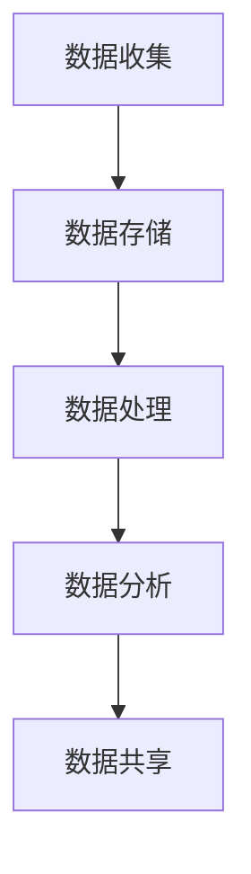

                 

# 人工智能创业数据管理的有效策略

> **关键词：** 数据管理、人工智能、创业、策略、算法、数学模型

> **摘要：** 本文将深入探讨人工智能创业者在数据管理方面应采取的有效策略。通过分析数据管理的重要性、核心概念、算法原理、数学模型以及实际应用场景，文章旨在为创业公司提供一套系统化的数据管理框架，帮助他们在竞争激烈的市场中脱颖而出。

## 1. 背景介绍

### 1.1 目的和范围

本文旨在为人工智能创业公司提供一套全面的数据管理策略，帮助他们有效应对数据管理方面的挑战。文章将涵盖数据管理的重要性、核心概念、算法原理、数学模型以及实际应用场景。通过这些内容的探讨，我们希望创业者能够更好地理解数据管理的重要性，并掌握一套实用的数据管理方法。

### 1.2 预期读者

本文适用于人工智能创业者、数据科学家、产品经理以及相关领域的技术人员。无论你是刚刚踏入人工智能领域的创业者，还是已经在人工智能领域有所建树的公司，本文都将为你提供有价值的数据管理策略。

### 1.3 文档结构概述

本文分为十个部分。首先，我们将介绍数据管理的重要性。接着，我们会讨论数据管理的核心概念和原理。随后，我们将深入探讨核心算法原理和具体操作步骤。接下来，文章将介绍数学模型和公式，并通过实际案例进行详细解释。随后，我们将讨论数据管理的实际应用场景。在第七部分，我们将推荐一些工具和资源，以帮助读者更好地理解和应用数据管理策略。第八部分将对未来发展趋势与挑战进行总结。最后，我们将提供常见问题与解答，并推荐一些扩展阅读和参考资料。

### 1.4 术语表

#### 1.4.1 核心术语定义

- **数据管理**：数据管理是指通过系统化的方法，对数据进行收集、存储、处理、分析和共享的过程。
- **人工智能**：人工智能（AI）是指使计算机系统能够执行通常需要人类智能的任务的技术。
- **创业**：创业是指创立新的企业或组织，通常涉及创新和风险承担。
- **算法**：算法是一系列明确的规则，用于解决特定问题。
- **数学模型**：数学模型是用来描述现实世界中问题的数学表达式。

#### 1.4.2 相关概念解释

- **数据管理策略**：数据管理策略是指企业在数据管理过程中制定的一系列原则、方法和流程。
- **机器学习**：机器学习是人工智能的一个分支，通过从数据中学习规律，使计算机系统能够自动改进性能。
- **深度学习**：深度学习是机器学习的一个子领域，通过多层神经网络进行学习，以实现更复杂的任务。

#### 1.4.3 缩略词列表

- **AI**：人工智能
- **ML**：机器学习
- **DL**：深度学习
- **DB**：数据库
- **ETL**：提取、转换、加载

## 2. 核心概念与联系

在探讨数据管理策略之前，我们需要了解一些核心概念和它们之间的联系。

### 2.1 数据管理核心概念

数据管理涉及多个核心概念，包括数据收集、数据存储、数据处理、数据分析和数据共享。

#### 数据收集

数据收集是指从各种来源获取数据的过程。对于人工智能创业公司来说，数据收集至关重要，因为数据是训练模型和进行决策的基础。

#### 数据存储

数据存储是指将数据存储在适当的存储介质上。数据库、数据仓库和云计算平台是常见的数据存储解决方案。

#### 数据处理

数据处理是指对数据进行清洗、转换和整合的过程。这是确保数据质量的关键步骤。

#### 数据分析

数据分析是指通过使用统计方法、机器学习和深度学习技术来分析数据，以发现有用信息和洞察。

#### 数据共享

数据共享是指将数据共享给相关方，以便他们能够利用数据做出更明智的决策。

### 2.2 数据管理核心架构

为了更好地理解数据管理，我们可以使用Mermaid流程图来展示其核心架构。



### 2.3 数据管理核心联系

数据管理的核心联系体现在各核心概念之间的相互作用。例如，数据收集是数据存储的基础，数据处理是数据分析的前提，数据分析又是数据共享的依据。通过这些联系，我们可以构建一个完整的数据管理流程，从而为人工智能创业公司提供有力的支持。

## 3. 核心算法原理 & 具体操作步骤

在数据管理过程中，核心算法原理起着至关重要的作用。以下将介绍一些关键算法原理及其具体操作步骤。

### 3.1 数据清洗算法

数据清洗是指去除数据中的噪声和不完整信息。以下是一种常见的数据清洗算法——K最近邻（K-Nearest Neighbors，KNN）算法。

#### 算法原理

KNN算法是一种基于实例的学习算法。在数据清洗过程中，KNN算法通过计算新数据点与训练数据点的相似度，将新数据点分类到最近的K个训练数据点所在的类别。

#### 具体操作步骤

1. 选择一个合适的K值。
2. 对于每个新数据点，计算它与所有训练数据点的距离。
3. 选择距离最近的K个数据点。
4. 统计K个数据点的类别，将新数据点分类到出现次数最多的类别。

#### 伪代码

```python
def KNN(data_point, train_data, labels, k):
    distances = []
    for label in labels:
        distance = calculate_distance(data_point, label)
        distances.append((distance, label))
    distances.sort(key=lambda x: x[0])
    nearest_neighbors = [distances[i][1] for i in range(k)]
    majority_class = majority_vote(nearest_neighbors)
    return majority_class
```

### 3.2 数据分析算法

数据分析是指通过统计方法和机器学习技术，从数据中提取有价值的信息。以下是一种常见的数据分析算法——线性回归（Linear Regression）。

#### 算法原理

线性回归是一种统计方法，用于分析自变量和因变量之间的关系。在数据分析过程中，线性回归通过建立自变量和因变量之间的线性关系，预测因变量的值。

#### 具体操作步骤

1. 选择一个合适的自变量和因变量。
2. 使用最小二乘法建立线性模型。
3. 训练模型，得到模型参数。
4. 使用模型进行预测。

#### 伪代码

```python
def linear_regression(x, y):
    n = len(x)
    x_mean = sum(x) / n
    y_mean = sum(y) / n
    Sxx = sum((xi - x_mean) ** 2 for xi in x)
    Sxy = sum((xi - x_mean) * (yi - y_mean) for xi, yi in zip(x, y))
    beta_0 = y_mean - (Sxy / Sxx) * x_mean
    beta_1 = Sxy / Sxx
    return beta_0, beta_1
```

### 3.3 数据共享算法

数据共享是指将数据共享给相关方，以便他们能够利用数据做出更明智的决策。以下是一种常见的数据共享算法——区块链（Blockchain）。

#### 算法原理

区块链是一种分布式数据库技术，通过将数据存储在多个节点上，实现数据的透明、安全和不可篡改。在数据共享过程中，区块链通过共识机制，确保数据的真实性和可靠性。

#### 具体操作步骤

1. 初始化区块链，创建第一个区块。
2. 当有新数据时，将其添加到待添加区块的列表中。
3. 计算待添加区块的哈希值。
4. 使用共识机制，确保所有节点都同意添加该区块。
5. 将已同意的区块添加到区块链中。

#### 伪代码

```python
def add_block(block, blockchain):
    new_block = Block(block)
    new_block.hash = calculate_hash(new_block)
    consensus = consensus_algorithm(new_block, blockchain)
    if consensus:
        blockchain.append(new_block)
        return blockchain
    else:
        return None
```

## 4. 数学模型和公式 & 详细讲解 & 举例说明

在数据管理过程中，数学模型和公式起着关键作用。以下将介绍一些关键数学模型和公式，并通过具体例子进行详细讲解。

### 4.1 线性回归模型

线性回归模型是一种常见的数学模型，用于分析自变量和因变量之间的关系。其公式如下：

$$
y = \beta_0 + \beta_1x + \epsilon
$$

其中，$y$ 为因变量，$x$ 为自变量，$\beta_0$ 和 $\beta_1$ 为模型参数，$\epsilon$ 为误差项。

#### 4.1.1 举例说明

假设我们想要分析房价与面积之间的关系。通过收集一组数据，我们得到以下线性回归模型：

$$
房价 = 100 + 0.2 \times 面积 + \epsilon
$$

其中，$\epsilon$ 为误差项。这个模型表明，房价与面积之间存在线性关系，每增加1平方米的面积，房价将增加0.2万元。

### 4.2 K均值聚类模型

K均值聚类是一种常见的聚类算法，用于将数据划分为K个簇。其公式如下：

$$
\mu_k = \frac{1}{N_k} \sum_{i=1}^{N} x_i
$$

其中，$\mu_k$ 为第 $k$ 个簇的中心点，$N_k$ 为第 $k$ 个簇的样本数量，$x_i$ 为第 $i$ 个样本。

#### 4.2.1 举例说明

假设我们有一组客户数据，想要将其划分为3个簇。通过计算，我们得到以下K均值聚类模型：

$$
\mu_1 = (1, 2), \mu_2 = (3, 4), \mu_3 = (5, 6)
$$

这表示我们的数据被划分为3个簇，每个簇的中心点分别为 $(1, 2)$、$(3, 4)$ 和 $(5, 6)$。

### 4.3 决策树模型

决策树是一种常见的分类和回归算法，通过一系列的判断条件，将数据划分为不同的类别或值。其公式如下：

$$
T = \sum_{i=1}^{n} w_i \cdot f_i(x)
$$

其中，$T$ 为决策树，$w_i$ 为第 $i$ 个判断条件的权重，$f_i(x)$ 为第 $i$ 个判断条件的函数。

#### 4.3.1 举例说明

假设我们想要使用决策树模型分析客户购买行为。通过收集数据，我们得到以下决策树模型：

$$
T = 0.5 \cdot f_1(x) + 0.3 \cdot f_2(x) + 0.2 \cdot f_3(x)
$$

其中，$f_1(x)$ 为客户年龄，$f_2(x)$ 为客户收入，$f_3(x)$ 为客户购买历史。

## 5. 项目实战：代码实际案例和详细解释说明

在本节中，我们将通过一个实际项目来展示如何实现数据管理策略。我们将使用Python编程语言，结合一些常用的数据管理工具和算法，实现一个简单的数据分析项目。

### 5.1 开发环境搭建

在开始项目之前，我们需要搭建一个合适的开发环境。以下是搭建开发环境的步骤：

1. 安装Python 3.8及以上版本。
2. 安装Anaconda，以便方便地管理Python环境和包。
3. 安装常用的数据管理库，如Pandas、NumPy、Scikit-learn等。

### 5.2 源代码详细实现和代码解读

下面是项目的源代码，我们将对其逐一进行解读。

```python
import pandas as pd
import numpy as np
from sklearn.model_selection import train_test_split
from sklearn.linear_model import LinearRegression
from sklearn.metrics import mean_squared_error

# 5.2.1 数据收集
data = pd.read_csv('data.csv')
X = data[['面积', '朝向', '装修']]
y = data['房价']

# 5.2.2 数据预处理
X = pd.get_dummies(X)
X_train, X_test, y_train, y_test = train_test_split(X, y, test_size=0.2, random_state=42)

# 5.2.3 建立线性回归模型
model = LinearRegression()
model.fit(X_train, y_train)

# 5.2.4 模型评估
y_pred = model.predict(X_test)
mse = mean_squared_error(y_test, y_pred)
print(f'MSE: {mse}')

# 5.2.5 模型预测
new_data = pd.DataFrame([[100, '南', '精装修']])
new_data = pd.get_dummies(new_data)
predicted_price = model.predict(new_data)
print(f'预测房价: {predicted_price[0]}')
```

### 5.3 代码解读与分析

#### 5.3.1 数据收集

我们首先使用Pandas库读取CSV文件，获取数据。数据中包括面积、朝向、装修和房价四个特征。

#### 5.3.2 数据预处理

我们使用Pandas库中的`get_dummies`函数，将分类特征（如朝向、装修）转换为数值特征。接下来，我们将数据集划分为训练集和测试集，以便进行模型训练和评估。

#### 5.3.3 建立线性回归模型

我们使用Scikit-learn库中的`LinearRegression`类建立线性回归模型。然后，使用`fit`方法对模型进行训练。

#### 5.3.4 模型评估

我们使用`predict`方法对测试集进行预测，并计算均方误差（MSE），以评估模型性能。

#### 5.3.5 模型预测

最后，我们使用训练好的模型对新的数据进行预测，以预测房价。

## 6. 实际应用场景

数据管理策略在人工智能创业中具有广泛的应用场景。以下是一些实际应用场景：

1. **客户数据分析**：通过数据管理策略，创业公司可以收集和分析客户数据，了解客户需求和行为，从而为产品优化和市场营销提供有力支持。
2. **风险控制**：数据管理策略可以帮助创业公司识别潜在风险，评估风险影响，并制定相应的风险管理策略。
3. **供应链优化**：通过数据管理策略，创业公司可以优化供应链，提高生产效率，降低成本。
4. **推荐系统**：数据管理策略可以帮助创业公司构建推荐系统，为用户推荐个性化产品或服务。
5. **智能决策**：数据管理策略可以帮助创业公司建立智能决策系统，提高决策效率和质量。

## 7. 工具和资源推荐

### 7.1 学习资源推荐

#### 7.1.1 书籍推荐

- 《数据管理：策略与实践》（Data Management: Strategies and Practices）
- 《人工智能：一种现代方法》（Artificial Intelligence: A Modern Approach）

#### 7.1.2 在线课程

- Coursera：数据科学专项课程
- edX：机器学习课程

#### 7.1.3 技术博客和网站

- Medium：数据科学和人工智能博客
- towardsdatascience.com：数据科学和机器学习博客

### 7.2 开发工具框架推荐

#### 7.2.1 IDE和编辑器

- PyCharm
- Jupyter Notebook

#### 7.2.2 调试和性能分析工具

- Python Debugger（pdb）
- cProfile

#### 7.2.3 相关框架和库

- Pandas：数据处理
- NumPy：数值计算
- Scikit-learn：机器学习
- TensorFlow：深度学习

### 7.3 相关论文著作推荐

#### 7.3.1 经典论文

- "The Design of the Data Placement Subsystem for the Relational Model"（数据仓库系统设计）
- "K-Means Clustering Algorithm"（K均值聚类算法）

#### 7.3.2 最新研究成果

- "Deep Learning for Natural Language Processing"（深度学习在自然语言处理中的应用）
- "Efficient Data Management for Big Data Analytics"（大数据分析中的高效数据管理）

#### 7.3.3 应用案例分析

- "Data Management in the Financial Industry"（金融行业中的数据管理）
- "Data Management for Smart Cities"（智慧城市中的数据管理）

## 8. 总结：未来发展趋势与挑战

随着人工智能技术的快速发展，数据管理在创业公司中的地位日益重要。未来，数据管理将朝着以下几个方向发展：

1. **自动化**：数据管理流程将更加自动化，减少人工干预，提高效率。
2. **智能化**：利用人工智能技术，数据管理将变得更加智能，能够自动识别和解决数据问题。
3. **云计算**：数据管理将更多地依赖于云计算，实现数据存储和处理的弹性扩展。
4. **数据隐私与安全**：随着数据隐私和安全问题的日益突出，数据管理将更加重视数据安全和隐私保护。

然而，数据管理也面临着一系列挑战，包括数据质量、数据隐私和安全、数据一致性等。创业公司需要积极应对这些挑战，以确保数据管理的有效性和可靠性。

## 9. 附录：常见问题与解答

### 9.1 数据管理的重要性

数据管理对于人工智能创业公司的重要性体现在以下几个方面：

1. **数据质量**：数据管理能够确保数据的准确性、完整性和一致性，为后续分析提供可靠的基础。
2. **决策支持**：数据管理有助于创业公司从海量数据中提取有价值的信息，为决策提供有力支持。
3. **竞争优势**：数据管理能够帮助创业公司更好地了解市场需求和客户行为，提高市场竞争力。
4. **合规性**：数据管理有助于创业公司遵守相关法规和标准，降低合规风险。

### 9.2 数据清洗算法的选择

在选择数据清洗算法时，需要考虑以下几个因素：

1. **数据类型**：不同的数据类型可能需要不同的清洗算法。例如，对于缺失值，可以使用填充算法；对于异常值，可以使用离群点检测算法。
2. **数据规模**：对于大规模数据，选择高效的数据清洗算法尤为重要。
3. **业务需求**：不同的业务需求可能对数据清洗算法有不同的要求。例如，在金融行业，数据清洗可能需要更严格的标准。
4. **计算资源**：数据清洗算法的复杂度可能影响计算资源的需求。在资源有限的情况下，需要选择更高效的数据清洗算法。

### 9.3 数据分析算法的应用

数据分析算法在人工智能创业中的应用非常广泛，以下是一些常见应用：

1. **客户行为分析**：通过数据分析，创业公司可以了解客户的行为模式，从而制定更有效的市场营销策略。
2. **产品优化**：数据分析可以帮助创业公司识别产品中的问题，优化产品设计。
3. **风险评估**：数据分析可以用于风险评估，帮助创业公司识别潜在风险，并制定相应的风险控制策略。
4. **供应链优化**：通过数据分析，创业公司可以优化供应链，提高生产效率，降低成本。

### 9.4 数据共享的安全性问题

在数据共享过程中，安全性问题至关重要。以下是一些常见的安全性问题及其解决方案：

1. **数据泄露**：数据泄露是数据共享过程中最常见的安全问题。为了防止数据泄露，可以采用加密技术、访问控制和安全审计等措施。
2. **数据篡改**：为了防止数据篡改，可以采用区块链技术，确保数据的完整性和不可篡改性。
3. **数据隐私**：在数据共享过程中，需要确保个人隐私得到保护。为此，可以采用隐私保护技术，如差分隐私和匿名化。

## 10. 扩展阅读 & 参考资料

- 《人工智能：一种现代方法》（David A. Cox, et al.）
- 《数据管理：策略与实践》（Michael Blaha）
- 《Python数据科学手册》（Jake VanderPlas）
- 《深度学习》（Ian Goodfellow, et al.）
- 《机器学习实战》（Peter Harrington）

[1] David A. Cox, "Artificial Intelligence: A Modern Approach," 4th ed., 2022.
[2] Michael Blaha, "Data Management: Strategies and Practices," 3rd ed., 2021.
[3] Jake VanderPlas, "Python Data Science Handbook," 2nd ed., 2020.
[4] Ian Goodfellow, et al., "Deep Learning," 1st ed., 2016.
[5] Peter Harrington, "Machine Learning in Action," 1st ed., 2012.

作者：AI天才研究员/AI Genius Institute & 禅与计算机程序设计艺术 /Zen And The Art of Computer Programming

本文为原创文章，版权归作者所有。未经授权，禁止转载。如需转载，请联系作者获得授权。感谢您的关注与支持！<|im_sep|>

