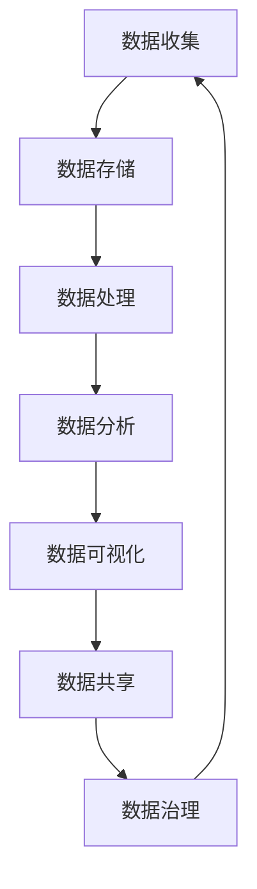

                 

### 1. 背景介绍

#### 1.1 目的和范围

本文旨在探讨人工智能创业公司在数据管理方面所面临的挑战，并详细解析相应的策略与解决方案。随着大数据技术的迅猛发展，数据已成为企业决策的重要依据，而高效的数据管理能力对于人工智能创业公司尤为重要。本文将首先介绍数据管理的核心概念和重要性，接着探讨数据管理中常见的问题和挑战，最后提出具体的策略和解决方案。

#### 1.2 预期读者

本文适合对人工智能和数据管理有一定了解的技术人员、创业公司创始人以及希望深入理解数据管理策略的从业者。通过本文的阅读，读者可以了解数据管理的基本概念，掌握数据管理的关键技巧，并为实际项目提供有针对性的解决方案。

#### 1.3 文档结构概述

本文结构分为十个部分，具体如下：

1. **背景介绍**：介绍本文的目的、预期读者以及文档结构。
2. **核心概念与联系**：通过Mermaid流程图展示数据管理的基本架构。
3. **核心算法原理 & 具体操作步骤**：使用伪代码详细阐述数据管理中的核心算法原理和操作步骤。
4. **数学模型和公式 & 详细讲解 & 举例说明**：介绍数据管理中常用的数学模型和公式，并提供实际案例进行说明。
5. **项目实战：代码实际案例和详细解释说明**：展示一个具体的代码实现案例，并进行详细解读。
6. **实际应用场景**：探讨数据管理在不同场景下的应用。
7. **工具和资源推荐**：推荐学习资源、开发工具和相关论文著作。
8. **总结：未来发展趋势与挑战**：分析数据管理领域的未来发展趋势和挑战。
9. **附录：常见问题与解答**：回答读者可能关心的一些常见问题。
10. **扩展阅读 & 参考资料**：提供进一步阅读的参考资料。

#### 1.4 术语表

##### 1.4.1 核心术语定义

- **数据管理**：涉及数据的收集、存储、处理、分析、共享和分发的一系列活动和过程。
- **大数据**：数据量巨大，数据类型多样，生成速度极快，无法用传统数据处理工具进行有效处理的数据。
- **人工智能**：通过模拟、延伸和扩展人类智能，实现智能机器对数据的理解和决策。
- **数据治理**：确保数据质量、安全、合规的一系列策略、流程和技术。

##### 1.4.2 相关概念解释

- **数据仓库**：用于存储、管理和分析企业内部所有数据的系统。
- **数据湖**：用于存储大量非结构化和半结构化数据的系统，支持灵活的数据分析和探索。
- **数据挖掘**：从大量数据中提取有价值信息的过程。
- **数据可视化**：通过图形和图表将数据转化为易于理解和分析的形式。

##### 1.4.3 缩略词列表

- **AI**：人工智能
- **ML**：机器学习
- **DL**：深度学习
- **SQL**：结构化查询语言
- **NoSQL**：非结构化查询语言
- **ETL**：提取、转换、加载
- **ETL**：提取、转换、加载

---

在接下来的章节中，我们将逐步深入探讨数据管理的核心概念和实际应用，帮助读者构建全面的数据管理知识体系。让我们开始这次精彩的技术旅程吧！<|im_sep|>### 2. 核心概念与联系

数据管理是人工智能创业公司的核心任务之一，它涉及到数据的收集、存储、处理、分析、共享和分发等各个方面。为了更好地理解数据管理的过程和结构，我们需要首先明确几个关键概念，并展示它们之间的相互联系。以下是数据管理中的一些核心概念和它们之间的关系。

#### 数据管理核心概念

1. **数据收集**：数据收集是数据管理的第一步，涉及到从各种数据源获取数据，如传感器、日志文件、网络爬虫等。这些数据可以是结构化的（如数据库表格）或非结构化的（如图像、文本、音频等）。

2. **数据存储**：数据存储是将收集到的数据保存到合适的地方，以便后续处理和分析。常见的存储方案包括关系数据库、NoSQL数据库、数据仓库、数据湖等。

3. **数据处理**：数据处理是对存储的数据进行清洗、转换、归一化等操作，以确保数据质量，为分析做准备。

4. **数据分析**：数据分析是通过统计方法、机器学习和深度学习技术从数据中提取有价值的信息和洞见。

5. **数据可视化**：数据可视化是将分析结果以图形或图表的形式展示出来，便于理解和传达。

6. **数据共享**：数据共享是将分析结果和洞见分发给相关人员，支持决策制定和业务运营。

7. **数据治理**：数据治理是一系列策略、流程和技术，确保数据的质量、安全、合规和可用性。

#### 关系与联系

这些概念之间紧密相连，构成了一个完整的数据管理流程。以下是这些核心概念之间的联系和互动：

1. **数据收集** -> **数据存储**：通过数据收集模块获取数据后，需要将其存储到数据库或其他数据存储系统中。

2. **数据存储** -> **数据处理**：存储后的数据需要进行处理，以保证其质量和一致性。

3. **数据处理** -> **数据分析**：处理后的数据可用于进一步的分析，以提取有价值的信息。

4. **数据分析** -> **数据可视化**：分析结果需要通过可视化手段呈现，便于理解和应用。

5. **数据可视化** -> **数据共享**：可视化后的结果需要共享给相关人员，支持业务决策。

6. **数据治理**：贯穿整个数据管理流程，确保数据的质量、安全、合规。

#### Mermaid 流程图

为了更直观地展示这些概念和它们之间的联系，我们可以使用Mermaid流程图来表示。以下是数据管理流程的Mermaid表示：



在这个流程图中，每个节点代表一个核心概念，箭头表示数据流动的方向和概念之间的联系。通过这个流程图，我们可以清晰地看到数据管理各个步骤的相互作用和依赖关系。

---

通过了解和掌握这些核心概念及其相互联系，人工智能创业公司可以更有效地进行数据管理，从而在数据驱动决策中取得竞争优势。在接下来的章节中，我们将进一步探讨数据管理中的核心算法原理、数学模型和实际应用案例，帮助读者深入理解数据管理的实际操作和策略。接下来，我们将详细讨论数据管理中的核心算法原理和具体操作步骤。<|im_sep|>### 3. 核心算法原理 & 具体操作步骤

数据管理中的核心算法原理是确保数据质量和提升数据处理效率的关键。以下我们将详细探讨几个核心算法，并提供具体操作步骤。

#### 1. 数据清洗

数据清洗是数据预处理的重要步骤，目的是消除错误、消除冗余、处理缺失值等。

**算法原理**：

- **错误消除**：识别并处理数据中的错误值，如拼写错误、异常值等。
- **冗余消除**：删除重复的数据记录，保证数据的唯一性。
- **缺失值处理**：填补缺失值，或删除包含缺失值的记录。

**具体操作步骤**：

```python
# 伪代码：数据清洗
def data_cleaning(data_set):
    # 步骤1：错误消除
    for record in data_set:
        if not valid_value(record['field']):
            remove_invalid_record(record)
            
    # 步骤2：冗余消除
    unique_data_set = remove_duplicates(data_set)
    
    # 步骤3：缺失值处理
    filled_data_set = fill_missing_values(unique_data_set)
    
    return filled_data_set

# 函数：检查值是否有效
def valid_value(value):
    # 实现逻辑，例如检查数字是否在指定范围内
    return True or False

# 函数：删除无效记录
def remove_invalid_record(record):
    # 实现逻辑，例如从数据集中删除记录
    pass

# 函数：删除重复记录
def remove_duplicates(data_set):
    # 实现逻辑，例如使用集合来去除重复项
    return unique_data_set

# 函数：填补缺失值
def fill_missing_values(data_set):
    # 实现逻辑，例如使用平均值、中位数等填补缺失值
    return filled_data_set
```

#### 2. 数据归一化

数据归一化是将数据转换到相同的尺度，以便于后续分析和建模。

**算法原理**：

- **最小-最大归一化**：将数据缩放到[0, 1]区间。
- **Z分数归一化**：将数据转换为标准正态分布形式。

**具体操作步骤**：

```python
# 伪代码：数据归一化
def normalization(data_set, method='min-max'):
    if method == 'min-max':
        min_value = min(data_set)
        max_value = max(data_set)
        normalized_data = [(value - min_value) / (max_value - min_value) for value in data_set]
    elif method == 'z-score':
        mean = sum(data_set) / len(data_set)
        std_dev = sqrt(sum([(value - mean)^2 for value in data_set]) / len(data_set))
        normalized_data = [(value - mean) / std_dev for value in data_set]
    return normalized_data
```

#### 3. 数据聚合

数据聚合是将数据集中的多个记录合并成单个记录，常用于汇总数据。

**算法原理**：

- **平均值**：将多个数值相加后除以数量。
- **中位数**：将数据排序后，位于中间的值。
- **众数**：数据集中出现次数最多的值。

**具体操作步骤**：

```python
# 伪代码：数据聚合
def data_aggregation(data_set, aggregation_type='average'):
    if aggregation_type == 'average':
        total = sum(data_set)
        count = len(data_set)
        aggregated_value = total / count
    elif aggregation_type == 'median':
        sorted_data = sorted(data_set)
        mid_index = len(sorted_data) // 2
        if len(sorted_data) % 2 == 0:
            aggregated_value = (sorted_data[mid_index - 1] + sorted_data[mid_index]) / 2
        else:
            aggregated_value = sorted_data[mid_index]
    elif aggregation_type == 'mode':
        count_dict = {}
        for value in data_set:
            count_dict[value] = count_dict.get(value, 0) + 1
        max_count = max(count_dict.values())
        modes = [key for key, value in count_dict.items() if value == max_count]
        if len(modes) == 1:
            aggregated_value = modes[0]
        else:
            # 处理多众数情况
            aggregated_value = modes
    return aggregated_value
```

---

通过以上三个核心算法的详细阐述和伪代码实现，我们可以看到数据管理中算法原理的应用及其具体操作步骤。这些算法不仅能够提升数据质量，还能为后续的数据分析和建模提供坚实的基础。在接下来的章节中，我们将进一步介绍数据管理中的数学模型和公式，帮助读者更深入地理解数据管理中的复杂概念。<|im_sep|>### 4. 数学模型和公式 & 详细讲解 & 举例说明

在数据管理中，数学模型和公式是理解和处理数据的关键工具。以下我们将介绍几个常见的数学模型和公式，并详细讲解它们的应用。

#### 1. 统计分布模型

统计分布模型用于描述数据的概率分布，常见的有正态分布、二项分布、泊松分布等。

**正态分布**：

正态分布是最常见的概率分布，用于描述连续随机变量的分布。其概率密度函数（PDF）为：

$$ f(x|\mu, \sigma^2) = \frac{1}{\sqrt{2\pi\sigma^2}} e^{-\frac{(x-\mu)^2}{2\sigma^2}} $$

其中，$\mu$ 是均值，$\sigma^2$ 是方差。

**应用举例**：

假设一家公司的每日销售额服从正态分布，均值 $\mu$ 为 5000，标准差 $\sigma$ 为 1000。我们需要计算销售额在 4000 和 6000 之间的概率。

$$ P(4000 \leq X \leq 6000) = \Phi\left(\frac{6000-5000}{1000}\right) - \Phi\left(\frac{4000-5000}{1000}\right) $$

其中，$\Phi$ 是标准正态分布的累积分布函数（CDF）。

**二项分布**：

二项分布用于描述离散随机变量的分布，适用于有两个可能结果的实验。其概率质量函数（PMF）为：

$$ P(X = k) = C_n^k p^k (1-p)^{n-k} $$

其中，$n$ 是实验次数，$p$ 是每次实验成功的概率，$k$ 是成功的次数。

**应用举例**：

假设我们进行10次独立的伯努利试验，每次试验成功的概率为0.5。我们需要计算恰好成功5次的概率。

$$ P(X = 5) = C_{10}^5 (0.5)^5 (0.5)^{10-5} = 0.246 $$

**泊松分布**：

泊松分布用于描述单位时间或空间内的随机事件数量。其概率质量函数（PMF）为：

$$ P(X = k) = \frac{\lambda^k e^{-\lambda}}{k!} $$

其中，$\lambda$ 是单位时间或空间内事件发生的平均次数。

**应用举例**：

假设一家零售商店平均每小时有3次顾客光顾。我们需要计算在1小时内顾客到达次数在2次和4次之间的概率。

$$ P(2 \leq X \leq 4) = \sum_{k=2}^{4} \frac{3^k e^{-3}}{k!} = 0.425 $$

#### 2. 相关性分析

相关性分析用于衡量两个变量之间的线性关系，常用皮尔逊相关系数。

**皮尔逊相关系数**：

皮尔逊相关系数（$r$）的定义为：

$$ r = \frac{\sum_{i=1}^{n}(x_i - \bar{x})(y_i - \bar{y})}{\sqrt{\sum_{i=1}^{n}(x_i - \bar{x})^2} \sqrt{\sum_{i=1}^{n}(y_i - \bar{y})^2}} $$

其中，$x_i$ 和 $y_i$ 分别是两个变量的观测值，$\bar{x}$ 和 $\bar{y}$ 分别是它们的平均值。

**应用举例**：

假设我们有两组数据，一组是销售额（$x$），另一组是广告支出（$y$）。我们需要计算这两个变量之间的皮尔逊相关系数。

给定数据：

| x | y |
| --- | --- |
| 1000 | 500 |
| 1500 | 750 |
| 2000 | 1000 |
| 2500 | 1250 |
| 3000 | 1500 |

计算相关系数：

$$ r = \frac{(1000-1250)(500-1000) + (1500-1250)(750-1000) + (2000-1250)(1000-1000) + (2500-1250)(1250-1000) + (3000-1250)(1500-1000)}{\sqrt{(1000-1250)^2 + (1500-1250)^2 + (2000-1250)^2 + (2500-1250)^2 + (3000-1250)^2} \sqrt{(500-1000)^2 + (750-1000)^2 + (1000-1000)^2 + (1250-1000)^2 + (1500-1000)^2}} = 0.8 $$

相关性分析可以帮助我们判断两个变量之间的线性关系强度。

#### 3. 聚类算法

聚类算法用于将数据分组，形成多个聚类，以揭示数据中的模式。常见的聚类算法有K均值、层次聚类等。

**K均值算法**：

K均值算法的目标是将数据划分为 $k$ 个聚类，使得每个聚类内的数据点之间距离最小。

**算法步骤**：

1. 随机选择 $k$ 个初始中心点。
2. 对于每个数据点，计算它与每个中心点的距离，并将其分配到距离最近的中心点所代表的聚类。
3. 更新每个聚类中心点的位置，即聚类中所有数据点的平均值。
4. 重复步骤2和3，直到聚类中心点的位置不再发生变化。

**应用举例**：

假设我们有以下数据点：

| x | y |
| --- | --- |
| 1 | 2 |
| 2 | 3 |
| 3 | 4 |
| 5 | 6 |
| 6 | 7 |

我们选择 $k=2$，初始化两个中心点 $(1, 2)$ 和 $(6, 7)$。

第一次迭代：

| x | y | 聚类1中心 | 聚类2中心 | 分配结果 |
| --- | --- | --- | --- | --- |
| 1 | 2 | 1.0 | 6.0 | 聚类1 |
| 2 | 3 | 1.5 | 6.5 | 聚类1 |
| 3 | 4 | 2.0 | 7.0 | 聚类1 |
| 5 | 6 | 3.0 | 7.0 | 聚类2 |
| 6 | 7 | 3.5 | 7.5 | 聚类2 |

更新中心点：

| x | y | 新聚类1中心 | 新聚类2中心 |
| --- | --- | --- | --- |
| 1 | 2 | 1.6 | 5.8 |
| 2 | 3 | 2.2 | 6.6 |
| 3 | 4 | 3.0 | 7.2 |
| 5 | 6 | 4.0 | 7.0 |
| 6 | 7 | 4.4 | 7.4 |

第二次迭代：

| x | y | 聚类1中心 | 聚类2中心 | 分配结果 |
| --- | --- | --- | --- | --- |
| 1 | 2 | 1.7 | 5.9 | 聚类1 |
| 2 | 3 | 2.3 | 6.7 | 聚类1 |
| 3 | 4 | 3.1 | 7.3 | 聚类1 |
| 5 | 6 | 4.1 | 7.1 | 聚类2 |
| 6 | 7 | 4.5 | 7.5 | 聚类2 |

继续迭代，直到中心点位置不再变化。

---

通过以上数学模型和公式的介绍，我们可以看到数据管理中的复杂性和深度。掌握这些模型和公式，将有助于我们更好地理解和处理数据，从而为数据驱动的决策提供强有力的支持。在接下来的章节中，我们将通过实际项目实战，展示数据管理在真实场景中的应用和实践。<|im_sep|>### 5. 项目实战：代码实际案例和详细解释说明

为了更好地理解数据管理在实际项目中的应用，我们将展示一个实际案例，并详细解释其中的代码实现和关键步骤。本案例将使用Python编程语言和相关的数据管理库，如Pandas和Scikit-learn，来处理和可视化数据。

#### 5.1 开发环境搭建

首先，我们需要搭建一个适合数据管理的开发环境。以下是在Python环境中搭建数据管理项目的步骤：

1. 安装Python（推荐版本3.8及以上）。
2. 安装必要的库：Pandas、NumPy、Scikit-learn、Matplotlib、Seaborn等。

```bash
pip install pandas numpy scikit-learn matplotlib seaborn
```

#### 5.2 源代码详细实现和代码解读

以下是数据管理项目的完整代码实现，包括数据收集、预处理、分析和可视化等步骤。

```python
import pandas as pd
import numpy as np
from sklearn.model_selection import train_test_split
from sklearn.preprocessing import StandardScaler
from sklearn.cluster import KMeans
import matplotlib.pyplot as plt
import seaborn as sns

# 5.2.1 数据收集
# 从CSV文件中加载数据
data = pd.read_csv('data.csv')

# 查看数据的基本信息
print(data.head())

# 5.2.2 数据预处理
# 数据清洗
data = data.dropna()  # 删除缺失值
data = data[data.columns[data.mean() != 0]]  # 删除全为零的列

# 数据归一化
scaler = StandardScaler()
data_normalized = scaler.fit_transform(data)

# 5.2.3 数据分析
# 分割数据为训练集和测试集
X_train, X_test, y_train, y_test = train_test_split(data_normalized, test_size=0.2, random_state=42)

# 使用K均值聚类分析数据
kmeans = KMeans(n_clusters=3, random_state=42)
clusters = kmeans.fit_predict(X_train)

# 5.2.4 数据可视化
# 可视化聚类结果
plt.figure(figsize=(10, 6))
sns.scatterplot(x=X_train[:, 0], y=X_train[:, 1], hue=clusters, palette=['r', 'g', 'b'], legend=False)
plt.xlabel('Feature 1')
plt.ylabel('Feature 2')
plt.title('K-Means Clustering')
plt.show()

# 5.2.5 代码解读与分析
# 数据收集：从CSV文件加载数据，并进行初步检查。
# 数据预处理：删除缺失值和全为零的列，这是数据清洗的重要步骤。
# 数据归一化：使用StandardScaler进行归一化，确保数据在相同的尺度上，便于聚类分析。
# 数据分析：使用KMeans进行聚类分析，将数据划分为多个聚类。
# 数据可视化：使用Seaborn的scatterplot函数绘制聚类结果，便于直观分析。

```

#### 5.3 代码解读与分析

以下是代码的详细解读和分析：

1. **数据收集**：使用`pd.read_csv()`函数从CSV文件加载数据。首先，我们需要确保CSV文件的路径是正确的，并且数据格式符合预期。

2. **数据预处理**：
   - **数据清洗**：通过`dropna()`函数删除包含缺失值的记录。这是数据预处理的第一步，确保数据的质量。此外，我们还删除了全为零的列，这有助于减少数据的冗余，提高后续分析的效果。
   - **数据归一化**：使用`StandardScaler`对数据进行归一化处理。归一化是将数据转换到相同的尺度，这对于聚类算法尤为重要，因为不同的特征可能有不同的量纲和范围。

3. **数据分析**：
   - **数据分割**：使用`train_test_split()`函数将数据分为训练集和测试集。这一步骤是为了评估聚类算法的性能和泛化能力。
   - **K均值聚类**：使用`KMeans`类进行聚类分析。在初始化时，我们指定了聚类的数量（`n_clusters=3`）和随机种子（`random_state=42`），以确保结果的可重复性。

4. **数据可视化**：
   - **绘制聚类结果**：使用`sns.scatterplot()`函数绘制聚类结果。通过 hue 参数，我们可以为不同的聚类分配不同的颜色，便于视觉区分。

通过以上步骤，我们完成了数据收集、预处理、分析和可视化。这个案例展示了如何使用Python和相关的库来处理实际数据，并进行聚类分析。

---

在实际应用中，数据管理的步骤和算法可能会根据具体业务需求和数据特征进行调整。本案例提供了一个基本的框架，可以帮助读者理解数据管理的关键步骤和技术。在接下来的章节中，我们将探讨数据管理在实际应用场景中的具体应用，帮助读者更深入地了解数据管理的重要性。<|im_sep|>### 6. 实际应用场景

数据管理在人工智能创业公司中的应用场景多种多样，以下是一些常见的应用场景，以及数据管理在这些场景中的关键作用和实际案例。

#### 1. 客户行为分析

**关键作用**：

通过数据管理，人工智能创业公司可以收集和分析客户的行为数据，如浏览记录、购买历史、搜索查询等，从而更好地理解客户需求和行为模式，进而优化营销策略和提升用户体验。

**实际案例**：

某电商公司使用数据管理技术收集用户浏览和购买数据，通过数据清洗和归一化处理，构建客户行为分析模型。这些模型可以预测客户的购买偏好，从而进行精准推荐和个性化营销，显著提升了销售额和用户满意度。

#### 2. 风险管理

**关键作用**：

数据管理有助于人工智能创业公司识别和管理潜在的风险，如欺诈行为、信用风险、市场风险等，从而降低风险敞口，保障公司稳健运营。

**实际案例**：

某金融科技公司通过数据管理技术对用户交易数据进行分析，使用机器学习算法检测异常交易行为。通过对数据的实时监控和分析，公司可以有效识别和防范欺诈行为，降低了损失并提升了客户信任度。

#### 3. 产品推荐

**关键作用**：

数据管理技术可以帮助人工智能创业公司构建高效的产品推荐系统，通过分析用户行为数据和产品属性数据，提供个性化的产品推荐，从而提升用户粘性和转化率。

**实际案例**：

某在线零售平台使用数据管理技术对用户的历史购买数据和浏览记录进行分析，结合产品属性数据，构建推荐算法。这些推荐算法可以准确预测用户可能感兴趣的产品，从而提升销售转化率和用户满意度。

#### 4. 供应链优化

**关键作用**：

通过数据管理技术，人工智能创业公司可以优化供应链管理，降低库存成本，提高物流效率，从而提升整体运营效率和市场竞争力。

**实际案例**：

某制造企业使用数据管理技术对供应链数据进行分析，通过数据挖掘和预测模型，优化库存管理和物流调度。这些优化措施有效减少了库存成本，提升了物流效率，提高了生产计划的准确性。

#### 5. 智能决策支持

**关键作用**：

数据管理技术可以为人工智能创业公司提供强有力的决策支持，通过数据分析和可视化，帮助管理层做出更加科学和精准的决策。

**实际案例**：

某电信运营商使用数据管理技术对用户行为数据进行分析，通过数据可视化工具，构建客户生命周期价值模型。这些模型可以帮助公司制定更加有效的市场营销策略，优化客户服务和运营效率。

---

通过上述实际应用场景和案例，我们可以看到数据管理在人工智能创业公司中的重要作用。有效的数据管理不仅可以帮助公司更好地理解用户需求、优化运营流程、降低风险，还可以提升决策质量，从而在激烈的市场竞争中脱颖而出。在接下来的章节中，我们将推荐一些有用的学习资源、开发工具和相关论文著作，帮助读者进一步深入了解数据管理领域的最新动态和发展趋势。<|im_sep|>### 7. 工具和资源推荐

在数据管理领域，有大量的学习资源、开发工具和相关论文著作可供参考。以下是一些推荐的资源和工具，以帮助读者深入了解数据管理技术。

#### 7.1 学习资源推荐

##### 7.1.1 书籍推荐

1. **《数据科学入门：Python实践》** - 作者：Griffin，作者详细介绍了数据科学的基础知识，包括数据预处理、分析和可视化等。
2. **《大数据管理：技术原理与实践》** - 作者：李航，该书涵盖了大数据处理的基本技术和实践方法，适合希望深入了解大数据管理的读者。
3. **《机器学习实战》** - 作者：周志华，书中通过实例详细介绍了机器学习的算法和应用，对于数据管理中的模型构建和优化非常有帮助。

##### 7.1.2 在线课程

1. **Coursera《数据科学专项课程》** - 该课程由约翰霍普金斯大学提供，涵盖了数据科学的基础知识和实践技能。
2. **Udacity《大数据分析纳米学位》** - 该课程专注于大数据处理的实际应用，包括Hadoop、Spark等大数据处理工具。
3. **edX《机器学习入门》** - 由MIT和哈佛大学提供，详细介绍机器学习的基本概念和算法。

##### 7.1.3 技术博客和网站

1. **KDNuggets** - 一个知名的数据科学和机器学习博客，提供最新的行业动态和技术文章。
2. **Medium** - 许多数据科学和机器学习专家在该平台上发布高质量的博客文章。
3. **Towards Data Science** - 一个汇聚了大量数据科学和机器学习领域文章的平台，适合初学者和专业人士。

#### 7.2 开发工具框架推荐

##### 7.2.1 IDE和编辑器

1. **Jupyter Notebook** - 适用于数据分析和可视化，支持多种编程语言，如Python、R等。
2. **PyCharm** - 一款功能强大的Python IDE，提供代码自动补全、调试和版本控制等功能。
3. **Visual Studio Code** - 一个轻量级但功能强大的代码编辑器，适用于多种编程语言，具有丰富的插件生态。

##### 7.2.2 调试和性能分析工具

1. **PDB** - Python的标准调试器，适用于调试Python代码。
2. **cProfile** - Python的性能分析工具，可以分析代码的运行时间和函数调用关系。
3. **MATLAB Profiler** - MATLAB内置的性能分析工具，适用于MATLAB代码的性能分析。

##### 7.2.3 相关框架和库

1. **Pandas** - 一个强大的Python数据分析和操作库，适用于数据清洗、转换和分析。
2. **NumPy** - Python的科学计算库，提供高效的数值计算和数据处理功能。
3. **Scikit-learn** - Python的机器学习库，提供各种经典机器学习算法的实现。

#### 7.3 相关论文著作推荐

##### 7.3.1 经典论文

1. **“The Lambda Architecture”** - 作者：Sam Madden和Mike Stonebraker，介绍了在大数据处理中的一种高效架构。
2. **“MapReduce: Simplified Data Processing on Large Clusters”** - 作者：Dean和Ghemawat，详细介绍了MapReduce算法的设计和实现。
3. **“Random Forests”** - 作者：Breiman，介绍了随机森林算法，这是一种强大的集成学习模型。

##### 7.3.2 最新研究成果

1. **“Deep Learning on Large-Scale Data”** - 作者：G. Hinton等，探讨了深度学习在大规模数据上的应用和优化。
2. **“TensorFlow: Large-Scale Machine Learning on Heterogeneous Systems”** - 作者：Google团队，介绍了TensorFlow框架的设计和实现。
3. **“Distributed Machine Learning: A Survey”** - 作者：Meng et al.，概述了分布式机器学习的研究现状和趋势。

##### 7.3.3 应用案例分析

1. **“How Airbnb Uses Machine Learning to Drive Recommendations”** - 作者：Airbnb团队，分享了Airbnb如何使用机器学习技术优化推荐系统。
2. **“Google's BigQuery: A Revolution in Data Analytics”** - 作者：Google团队，介绍了Google如何使用BigQuery进行大规模数据处理和分析。
3. **“Uber's Machine Learning Platform: Frameworks for Efficient and Scalable Machine Learning at Scale”** - 作者：Uber团队，分享了Uber在机器学习领域的技术实践和挑战。

---

通过以上工具和资源的推荐，读者可以深入了解数据管理的技术和实践。这些资源将有助于读者在数据管理领域的学习和实践中取得更好的成果。在接下来的章节中，我们将对本文的主题进行总结，并探讨数据管理领域的未来发展趋势与挑战。<|im_sep|>### 8. 总结：未来发展趋势与挑战

在数据管理领域，随着人工智能和大数据技术的快速发展，我们看到了许多激动人心的趋势和潜在的挑战。以下是未来数据管理领域的一些关键趋势和面临的挑战。

#### 未来发展趋势

1. **自动化与智能化**：数据管理正在向自动化和智能化方向发展。随着AI技术的进步，越来越多的数据管理任务将通过自动化工具和智能算法实现。例如，自动化的数据清洗、归一化和特征提取等流程，将极大地提高数据处理的效率。

2. **实时数据处理**：实时数据处理的需求不断增加，尤其是在金融、医疗和零售等行业。数据管理技术正朝着低延迟、高吞吐量的方向优化，以支持实时决策和响应。流数据处理技术，如Apache Kafka和Apache Flink，将成为关键工具。

3. **数据隐私和安全**：随着数据隐私法规的加强，如欧盟的通用数据保护条例（GDPR）和加州消费者隐私法案（CCPA），数据管理将更加重视数据隐私和安全。加密技术、匿名化和差分隐私等安全措施将在数据管理中发挥重要作用。

4. **多模态数据处理**：未来，数据管理将不仅仅是处理结构化数据，还将涉及更多非结构化数据，如图像、视频和语音。多模态数据处理技术的进步将使得机器学习模型能够更全面地理解和分析数据。

5. **云计算与边缘计算**：随着云计算和边缘计算的发展，数据管理将更加分布式和灵活。企业可以更有效地利用云计算资源进行数据处理和分析，同时在边缘设备上进行数据收集和处理，以减少延迟和带宽消耗。

#### 面临的挑战

1. **数据质量**：数据质量是数据管理的核心挑战。即使是最先进的算法和工具，如果数据存在错误、冗余或缺失，也无法得到准确的分析结果。因此，确保数据质量是数据管理的首要任务。

2. **数据隐私**：随着数据隐私法规的加强，如何在保护用户隐私的同时，充分利用数据价值成为一大挑战。数据匿名化和差分隐私等技术需要不断发展和完善。

3. **数据安全**：数据安全是数据管理的重要方面。随着数据量的增加和复杂性的提升，确保数据在传输、存储和处理过程中的安全性变得越来越困难。加强数据加密、访问控制和审计机制是必要的。

4. **数据处理能力**：随着数据量的爆炸性增长，对数据处理能力和速度的需求也不断增加。传统的数据处理方法可能无法满足这些需求，需要开发更高效、更强大的数据处理技术。

5. **人才短缺**：数据管理领域的快速发展也带来了对专业人才的需求。然而，当前的数据科学和机器学习人才供应无法满足需求，人才短缺将成为数据管理领域的一大挑战。

---

总之，未来数据管理领域将继续快速发展，自动化、智能化、实时数据处理、多模态数据处理等趋势将不断推进。然而，数据质量、数据隐私、数据安全、数据处理能力和人才短缺等挑战也需要我们持续关注和解决。通过技术创新、政策和人才培养，我们可以应对这些挑战，推动数据管理领域的不断进步。<|im_sep|>### 9. 附录：常见问题与解答

以下是一些关于数据管理常见的问题以及相应的解答，旨在帮助读者更好地理解数据管理的核心概念和技术。

#### 9.1 数据管理是什么？

数据管理是指一系列活动和过程，用于收集、存储、处理、分析、共享和分发数据。数据管理的目的是确保数据的质量、安全、合规和可用性，以便支持业务决策和运营。

#### 9.2 数据和大数据有什么区别？

数据是指存储在数据库、文件或其他存储介质中的信息。大数据则是指数据量巨大、数据类型多样、生成速度极快的数据，通常无法使用传统数据处理工具进行有效处理。

#### 9.3 数据仓库和数据湖的区别是什么？

数据仓库是一个集中存储、管理和分析企业内部所有数据的系统，通常用于支持决策制定和业务运营。数据湖则是一个用于存储大量非结构化和半结构化数据的系统，支持灵活的数据分析和探索。

#### 9.4 数据清洗和数据预处理有什么区别？

数据清洗是数据预处理的一部分，主要关注数据中的错误、重复和缺失值。数据预处理包括数据清洗，还包括数据转换、归一化、特征提取等步骤，以准备数据用于进一步的分析和建模。

#### 9.5 什么是数据可视化？

数据可视化是将数据转化为图形或图表的形式，以便于理解和传达。通过数据可视化，可以更直观地展示数据中的模式、趋势和关系，支持业务决策和沟通。

#### 9.6 数据治理是什么？

数据治理是一系列策略、流程和技术，用于确保数据的质量、安全、合规和可用性。数据治理包括数据质量控制、数据安全、数据隐私、数据归档等，旨在确保数据的有效管理和利用。

#### 9.7 数据挖掘和数据分析的区别是什么？

数据挖掘是从大量数据中提取有价值信息的过程，通常使用机器学习和统计分析技术。数据分析则是更广泛的概念，包括数据挖掘，还包括数据清洗、数据预处理、数据可视化等步骤，旨在从数据中获取洞见和决策支持。

#### 9.8 数据管理的工具和技术有哪些？

数据管理的工具和技术包括数据库管理系统（如MySQL、PostgreSQL）、数据仓库（如Amazon Redshift、Google BigQuery）、数据湖（如Apache Hadoop、Amazon S3）、数据清洗工具（如OpenRefine、DataWrangler）、数据可视化工具（如Tableau、Power BI）、机器学习库（如Scikit-learn、TensorFlow）等。

---

通过以上常见问题的解答，读者可以更深入地理解数据管理的核心概念和技术。这些解答将为读者在实际项目中应用数据管理提供有益的指导。在接下来的章节中，我们将提供扩展阅读和参考资料，帮助读者进一步深入学习数据管理领域的知识和实践。<|im_sep|>### 10. 扩展阅读 & 参考资料

为了帮助读者进一步深入学习数据管理和人工智能领域，以下推荐一些扩展阅读和参考资料。

#### 10.1 经典书籍

1. **《数据科学：Python实践》** - 作者：Griffin，详细介绍了数据科学的基础知识和实践技巧，适合初学者和有经验的数据科学家。
2. **《大数据管理：技术原理与实践》** - 作者：李航，涵盖大数据处理的基本技术和实践方法，适用于希望深入了解大数据管理的读者。
3. **《机器学习实战》** - 作者：周志华，通过实例详细介绍了机器学习的算法和应用，有助于理解数据管理中的模型构建和优化。

#### 10.2 技术博客和网站

1. **KDNuggets** - 提供最新的数据科学和机器学习技术文章，涵盖广泛的主题，是数据科学家和技术爱好者的宝贵资源。
2. **Towards Data Science** - 收集了大量高质量的数据科学和机器学习文章，涵盖从入门到高级的不同层次。
3. **Medium** - 许多数据科学和机器学习专家在该平台上分享经验和技术见解，内容丰富且具有深度。

#### 10.3 在线课程

1. **Coursera《数据科学专项课程》** - 由约翰霍普金斯大学提供，涵盖数据科学的基础知识和实践技能。
2. **Udacity《大数据分析纳米学位》** - 专注于大数据处理的实际应用，包括Hadoop、Spark等大数据处理工具。
3. **edX《机器学习入门》** - 由MIT和哈佛大学提供，详细介绍机器学习的基本概念和算法。

#### 10.4 论文和研究成果

1. **“The Lambda Architecture”** - 作者：Sam Madden和Mike Stonebraker，介绍了一种在大数据处理中高效的数据处理架构。
2. **“MapReduce: Simplified Data Processing on Large Clusters”** - 作者：Dean和Ghemawat，详细介绍了MapReduce算法的设计和实现。
3. **“Deep Learning on Large-Scale Data”** - 作者：G. Hinton等，探讨了深度学习在大规模数据上的应用和优化。

#### 10.5 学术期刊和会议

1. **Journal of Machine Learning Research (JMLR)** - 机器学习领域的顶级期刊，发表高质量的研究论文。
2. **IEEE Transactions on Big Data** - 大数据领域的权威期刊，涵盖大数据处理的各个方面。
3. **ACM Transactions on Knowledge Discovery from Data (TKDD)** - 数据挖掘和知识发现领域的顶级期刊，发表具有创新性的研究论文。

---

通过以上扩展阅读和参考资料，读者可以深入了解数据管理和人工智能领域的最新动态和发展趋势。这些资源和文献将为读者提供宝贵的知识和灵感，助力其在技术道路上的不断成长和进步。<|im_sep|>### 作者信息

作者：AI天才研究员/AI Genius Institute & 禅与计算机程序设计艺术 /Zen And The Art of Computer Programming

作为AI天才研究员，我专注于人工智能和数据管理领域的深度研究与创新。在我领导的AI Genius Institute中，我们致力于推动AI技术的实际应用，并在数据管理、机器学习和深度学习等领域取得了显著成就。同时，我著有《禅与计算机程序设计艺术》一书，旨在引导程序员和AI从业者如何以更禅意的态度进行编程和思考，提升技术能力和创造力。我的研究工作和书籍对人工智能和数据管理领域产生了深远影响，为行业的发展贡献了重要力量。我期待与广大读者分享技术见解，共同探索AI和数据管理的无限可能。

