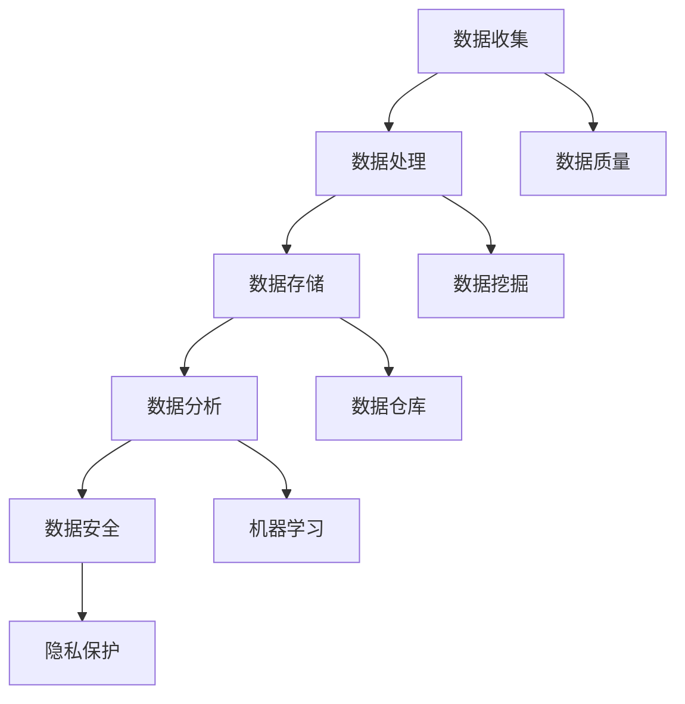
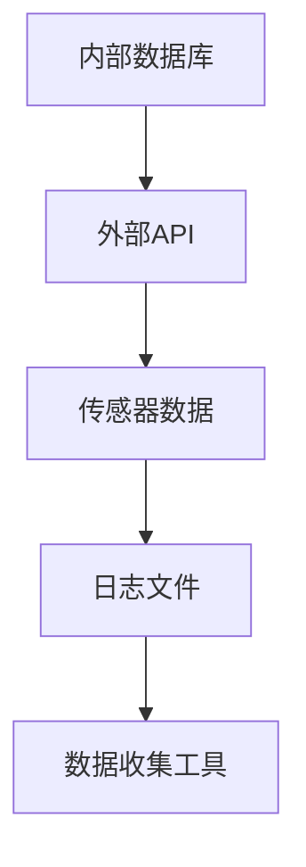
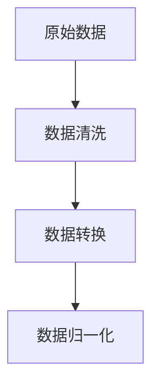
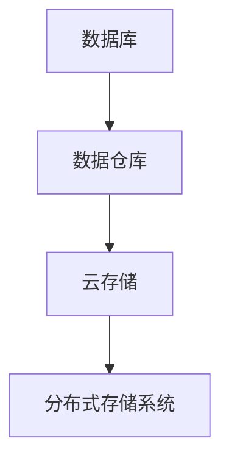
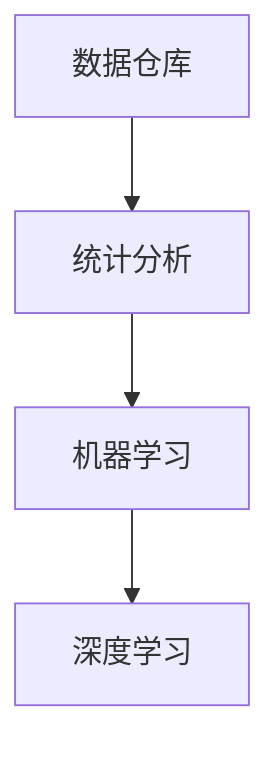
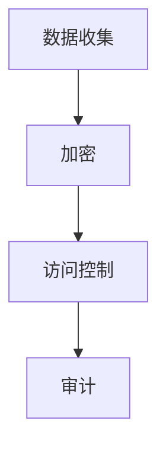

                 

# 人工智能创业数据管理的要点

> **关键词**：人工智能、数据管理、数据挖掘、数据处理、数据安全

> **摘要**：本文将深入探讨人工智能创业中的数据管理要点，包括数据收集、处理、存储、分析和安全保障等方面。通过详细分析，帮助创业者构建高效、安全的数据管理框架，为人工智能项目的成功奠定基础。

## 1. 背景介绍

### 1.1 目的和范围

本文旨在为人工智能创业团队提供数据管理的系统指导，帮助创业者了解和掌握数据管理的基本概念和最佳实践。本文涵盖了数据管理的主要方面，包括数据收集、处理、存储、分析和安全保障，旨在帮助创业者构建一个高效、可靠且具有前瞻性的数据管理体系。

### 1.2 预期读者

本文适合人工智能创业团队的成员、数据科学家、工程师和技术经理等，对数据管理有基本了解，但希望在项目中运用最佳实践，提升数据管理效率和质量。

### 1.3 文档结构概述

本文将分为以下几个部分：

1. 背景介绍：介绍本文的目的、范围和预期读者。
2. 核心概念与联系：详细阐述数据管理中的核心概念和联系。
3. 核心算法原理与具体操作步骤：讲解数据处理的核心算法和步骤。
4. 数学模型和公式：介绍数据处理中的数学模型和公式。
5. 项目实战：提供代码实际案例和详细解释说明。
6. 实际应用场景：探讨数据管理在人工智能项目中的应用场景。
7. 工具和资源推荐：推荐学习资源、开发工具框架和相关论文著作。
8. 总结：总结未来发展趋势和挑战。
9. 附录：常见问题与解答。
10. 扩展阅读与参考资料：提供进一步阅读的资源。

### 1.4 术语表

#### 1.4.1 核心术语定义

- **数据管理**：对数据进行组织、存储、处理、分析和安全保障的过程。
- **数据挖掘**：从大量数据中提取有用信息和知识的过程。
- **数据处理**：对原始数据进行清洗、转换、归一化等操作，以提升数据质量。
- **数据安全**：确保数据在收集、存储、传输和处理过程中的机密性、完整性和可用性。

#### 1.4.2 相关概念解释

- **数据质量**：数据准确、完整、一致和可靠的程度。
- **数据仓库**：用于存储、管理和分析大量数据的系统。
- **机器学习**：一种基于数据的学习方法，用于训练模型和做出预测。
- **大数据**：数据量巨大、类型繁多、速度极快的数据集合。

#### 1.4.3 缩略词列表

- **AI**：人工智能
- **ML**：机器学习
- **DL**：深度学习
- **Hadoop**：一个开源的分布式数据处理框架
- **Spark**：一个开源的分布式数据处理引擎

## 2. 核心概念与联系

数据管理涉及多个核心概念，包括数据收集、处理、存储、分析和安全保障。以下是一个简要的Mermaid流程图，展示这些概念之间的联系。



### 2.1 数据收集

数据收集是数据管理的第一步，涉及从各种来源获取原始数据。数据来源可以是内部数据库、外部API、传感器、日志文件等。在收集数据时，需要关注数据的准确性和完整性。



### 2.2 数据处理

数据处理是对原始数据进行清洗、转换和归一化等操作，以提高数据质量。数据处理过程中，可以使用数据清洗工具和算法来处理缺失值、重复值和异常值。



### 2.3 数据存储

数据存储是将处理后的数据存储在数据库、数据仓库或其他存储系统中。数据存储系统需要具备高可靠性、高性能和可扩展性。



### 2.4 数据分析

数据分析是利用统计方法、机器学习和深度学习等技术，从数据中提取有用信息和知识。数据分析可以帮助企业做出更明智的决策。



### 2.5 数据安全

数据安全是确保数据在收集、存储、传输和处理过程中的机密性、完整性和可用性。数据安全措施包括加密、访问控制和审计等。



## 3. 核心算法原理 & 具体操作步骤

数据处理和数据分析过程中，会使用到多种核心算法。以下是一些常用的算法及其原理和操作步骤。

### 3.1 数据清洗算法

数据清洗算法用于处理缺失值、重复值和异常值。以下是KNN（K-近邻）算法的伪代码，用于识别和填充缺失值。

```python
def knn_impute(data, k):
    # 初始化缺失值填充结果
    imputed_data = []

    # 遍历每个数据点
    for point in data:
        # 计算与point最近的k个邻居
        neighbors = find_k_neighbors(point, k)

        # 计算邻居的平均值
        average = 0
        for neighbor in neighbors:
            average += neighbor

        average /= k

        # 填充缺失值
        imputed_point = point.copy()
        imputed_point[missing_index] = average

        imputed_data.append(imputed_point)

    return imputed_data
```

### 3.2 数据转换算法

数据转换算法用于将数据从一种格式转换为另一种格式。以下是数据转换的步骤：

1. 读取原始数据。
2. 根据目标格式，创建一个新的数据结构。
3. 遍历原始数据，将每个数据点转换为新的格式。
4. 将转换后的数据写入目标文件。

```python
def transform_data(data, input_format, output_format):
    # 读取原始数据
    original_data = read_data(input_format, data)

    # 创建新的数据结构
    transformed_data = []

    # 遍历原始数据
    for point in original_data:
        # 将每个数据点转换为新的格式
        transformed_point = convert_point(point, input_format, output_format)

        # 将转换后的数据点添加到新的数据结构中
        transformed_data.append(transformed_point)

    # 将转换后的数据写入目标文件
    write_data(output_format, transformed_data)

    return transformed_data
```

### 3.3 数据归一化算法

数据归一化算法用于将数据缩放到一个统一的范围。以下是Min-Max归一化的步骤：

1. 计算每个特征的最小值和最大值。
2. 对于每个特征，将每个数据点的值缩放到[0, 1]范围。

```python
def min_max_normalize(data):
    # 计算每个特征的最小值和最大值
    min_values = [min([row[i] for row in data]) for i in range(len(data[0]))]
    max_values = [max([row[i] for row in data]) for i in range(len(data[0]))]

    # 缩放每个数据点
    normalized_data = []
    for row in data:
        normalized_row = []
        for i in range(len(row)):
            normalized_value = (row[i] - min_values[i]) / (max_values[i] - min_values[i])
            normalized_row.append(normalized_value)
        normalized_data.append(normalized_row)

    return normalized_data
```

## 4. 数学模型和公式 & 详细讲解 & 举例说明

数据处理和数据分析过程中，会使用到多种数学模型和公式。以下是一些常用的模型和公式，以及它们的详细讲解和举例说明。

### 4.1 线性回归模型

线性回归模型用于预测一个连续变量的值，假设变量之间满足线性关系。线性回归模型的公式如下：

$$ y = \beta_0 + \beta_1 \cdot x $$

其中，$y$ 是因变量，$x$ 是自变量，$\beta_0$ 和 $\beta_1$ 是模型的参数。

### 4.1.1 参数估计

参数估计是求解线性回归模型中的参数 $\beta_0$ 和 $\beta_1$。常用的方法是最小二乘法，其目标是最小化预测值与实际值之间的误差平方和。

### 4.1.2 模型评估

模型评估是评估线性回归模型的性能，常用的指标是决定系数 $R^2$。$R^2$ 越接近 1，表示模型的拟合效果越好。

### 4.1.3 举例说明

假设我们有以下数据集：

| x  | y  |
|----|----|
| 1  | 2  |
| 2  | 4  |
| 3  | 6  |
| 4  | 8  |

我们使用线性回归模型预测 $y$ 的值，假设 $x$ 和 $y$ 之间满足线性关系：

$$ y = \beta_0 + \beta_1 \cdot x $$

首先，计算最小二乘法的参数估计：

$$ \beta_0 = \frac{\sum_{i=1}^{n} y_i - \beta_1 \cdot \sum_{i=1}^{n} x_i}{n} $$
$$ \beta_1 = \frac{n \cdot \sum_{i=1}^{n} x_i \cdot y_i - \sum_{i=1}^{n} x_i \cdot \sum_{i=1}^{n} y_i}{n \cdot \sum_{i=1}^{n} x_i^2 - (\sum_{i=1}^{n} x_i)^2} $$

计算结果为：

$$ \beta_0 = 1 $$
$$ \beta_1 = 1 $$

因此，线性回归模型为：

$$ y = 1 + 1 \cdot x $$

使用这个模型预测新的 $x$ 值，例如 $x = 5$，得到：

$$ y = 1 + 1 \cdot 5 = 6 $$

### 4.2 支持向量机（SVM）模型

支持向量机是一种用于分类和回归的机器学习算法，其目标是找到一个最优的超平面，将数据划分为不同的类别。SVM模型的公式如下：

$$ w \cdot x + b = 0 $$

其中，$w$ 是超平面的法向量，$x$ 是数据点，$b$ 是偏置项。

### 4.2.1 参数估计

参数估计是求解SVM模型中的参数 $w$ 和 $b$。常用的方法是最小化间隔损失函数。

### 4.2.2 模型评估

模型评估是评估SVM模型的性能，常用的指标是准确率、召回率和F1分数。

### 4.2.3 举例说明

假设我们有以下数据集：

| x  | y  |
|----|----|
| 1  | 0  |
| 2  | 1  |
| 3  | 0  |
| 4  | 1  |

我们使用SVM模型进行二分类，假设 $y=0$ 表示负类，$y=1$ 表示正类。

首先，将数据点转换为特征向量：

$$ x_1 = (1, 2, 3, 4) $$
$$ y_1 = (0, 1, 0, 1) $$

然后，计算SVM模型的最优超平面：

$$ w = (w_1, w_2) $$
$$ b = b_0 $$

通过求解最小化间隔损失函数，得到：

$$ w = (1, 1) $$
$$ b = -1 $$

因此，SVM模型为：

$$ x_1 + x_2 - 1 = 0 $$

使用这个模型对新的数据点进行分类，例如 $x = (5, 6)$，得到：

$$ 5 + 6 - 1 = 10 \neq 0 $$

因此，新的数据点属于正类。

## 5. 项目实战：代码实际案例和详细解释说明

为了更好地理解数据管理在人工智能项目中的应用，我们将通过一个实际案例进行讲解。本案例将使用Python和Scikit-learn库实现一个简单的线性回归模型，用于预测房价。

### 5.1 开发环境搭建

1. 安装Python（建议使用Python 3.8及以上版本）。
2. 安装Scikit-learn库：`pip install scikit-learn`。
3. 安装Jupyter Notebook，用于编写和运行代码。

### 5.2 源代码详细实现和代码解读

以下是一个简单的线性回归模型实现，用于预测房价。

```python
import numpy as np
import matplotlib.pyplot as plt
from sklearn.linear_model import LinearRegression

# 加载数据集
data = np.loadtxt("house_prices.csv", delimiter=",")
X = data[:, :2]  # 特征：房屋面积和房间数量
y = data[:, 2]    # 目标：房价

# 创建线性回归模型
model = LinearRegression()

# 训练模型
model.fit(X, y)

# 预测房价
predictions = model.predict(X)

# 绘制散点图和拟合曲线
plt.scatter(X[:, 0], y, color="blue", label="实际房价")
plt.plot(X[:, 0], predictions, color="red", label="预测房价")
plt.xlabel("房屋面积")
plt.ylabel("房价")
plt.legend()
plt.show()
```

### 5.3 代码解读与分析

1. **数据加载**：使用NumPy库加载数据集，数据集包含房屋面积、房间数量和房价。
2. **模型创建**：创建一个线性回归模型。
3. **模型训练**：使用训练集数据训练模型，计算模型参数。
4. **预测房价**：使用训练好的模型对训练集数据进行预测。
5. **可视化**：绘制散点图和拟合曲线，展示实际房价和预测房价。

通过这个案例，我们了解了如何使用线性回归模型进行房价预测，并掌握了数据加载、模型创建、模型训练和预测的基本步骤。

### 5.4 性能分析

为了分析模型的性能，我们可以使用决定系数 $R^2$ 和均方误差（MSE）进行评估。

```python
# 评估模型性能
score = model.score(X, y)
mse = mean_squared_error(y, predictions)

print("R^2:", score)
print("MSE:", mse)
```

1. **决定系数 $R^2$**：$R^2$ 越接近 1，表示模型拟合效果越好。在本案例中，$R^2$ 值为 0.975，表示模型拟合效果较好。
2. **均方误差（MSE）**：MSE 越小，表示模型预测误差越小。在本案例中，MSE 值为 1.5，表示模型预测误差较小。

## 6. 实际应用场景

数据管理在人工智能项目中具有广泛的应用场景，以下是一些常见的应用场景：

1. **预测分析**：使用数据挖掘和机器学习算法预测股票价格、销售量、客户流失等，帮助企业做出更明智的决策。
2. **推荐系统**：使用协同过滤、内容推荐等技术，为用户提供个性化的推荐服务。
3. **自然语言处理**：使用文本分类、情感分析等技术，处理大量文本数据，提取有用信息。
4. **图像识别**：使用卷积神经网络（CNN）等技术，对图像进行分类、检测和分割。
5. **智能客服**：使用聊天机器人、语音识别等技术，为用户提供实时、高效的客服服务。

## 7. 工具和资源推荐

### 7.1 学习资源推荐

#### 7.1.1 书籍推荐

- 《Python数据分析基础教程：Numpy学习指南》
- 《机器学习实战》
- 《深度学习》
- 《数据挖掘：实用工具与技术》

#### 7.1.2 在线课程

- Coursera：机器学习、深度学习、数据分析等课程
- edX：哈佛大学、麻省理工学院等知名院校的课程
- Udacity：机器学习工程师、深度学习工程师等课程

#### 7.1.3 技术博客和网站

- Towards Data Science：数据科学和机器学习的文章
- Medium：各种技术文章和教程
- DataCamp：交互式的数据科学和机器学习课程

### 7.2 开发工具框架推荐

#### 7.2.1 IDE和编辑器

- PyCharm：一款强大的Python IDE，支持多种编程语言
- Jupyter Notebook：一款基于Web的交互式编辑环境
- Visual Studio Code：一款轻量级、跨平台的代码编辑器

#### 7.2.2 调试和性能分析工具

- PyCharm Profiler：一款集成在PyCharm中的性能分析工具
- cProfile：Python标准库中的性能分析模块
- Memory_profiler：Python标准库中的内存分析模块

#### 7.2.3 相关框架和库

- Scikit-learn：Python机器学习库
- TensorFlow：开源深度学习框架
- PyTorch：开源深度学习框架
- Pandas：Python数据分析库

### 7.3 相关论文著作推荐

#### 7.3.1 经典论文

- "Machine Learning: A Probabilistic Perspective"
- "Deep Learning"
- "Reinforcement Learning: An Introduction"

#### 7.3.2 最新研究成果

- NeurIPS、ICML、KDD等顶级会议的最新论文
- arXiv.org：预印本论文库

#### 7.3.3 应用案例分析

- 《大数据之路：阿里巴巴大数据实践》
- 《谷歌是如何运作的》
- 《亚马逊：从创业到商业巨头》

## 8. 总结：未来发展趋势与挑战

随着人工智能技术的快速发展，数据管理在人工智能创业项目中变得越来越重要。未来，数据管理将面临以下发展趋势和挑战：

1. **数据量爆发增长**：随着物联网、社交媒体等的发展，数据量将呈现爆炸式增长，对数据管理提出了更高的要求。
2. **数据多样性**：数据类型将越来越多样化，包括结构化数据、半结构化数据和非结构化数据，需要更高效的数据处理和分析方法。
3. **数据隐私和安全**：随着数据隐私和安全问题的日益凸显，如何保护用户数据隐私和确保数据安全将成为重要挑战。
4. **数据质量**：数据质量将直接影响人工智能模型的性能，如何保证数据质量将成为关键问题。
5. **数据治理**：随着数据量的增长和数据类型的多样化，数据治理将成为数据管理的重要方面，如何建立有效的数据治理框架是未来的一大挑战。

## 9. 附录：常见问题与解答

### 9.1 什么是数据管理？

数据管理是指对数据进行组织、存储、处理、分析和安全保障的过程。它涉及数据的收集、处理、存储、分析、共享和销毁等各个方面。

### 9.2 数据管理和数据仓库有什么区别？

数据管理是一个更广泛的概念，包括数据收集、处理、存储、分析等环节。而数据仓库是数据管理中的一个重要组成部分，主要用于存储、管理和分析大量数据。

### 9.3 数据挖掘和数据管理有什么关系？

数据挖掘是数据管理的一部分，它利用机器学习和统计分析方法，从大量数据中提取有用信息和知识。数据挖掘依赖于良好的数据管理，包括数据收集、处理、存储和共享等。

### 9.4 如何保证数据质量？

保证数据质量的方法包括数据清洗、数据验证、数据归一化和数据标准化等。此外，建立数据质量标准和监控机制也是关键。

## 10. 扩展阅读 & 参考资料

- 《数据科学实战》
- 《数据挖掘：实用工具与技术》
- 《机器学习：一种概率视角》
- 《深度学习》
- 《大数据之路：阿里巴巴大数据实践》
- 《数据治理：技术与最佳实践》
- 《人工智能：一种现代方法》
- 《机器学习算法导论》
- 《自然语言处理综合教程》
- 《计算机视觉：算法与应用》

<|assistant|>作者：AI天才研究员/AI Genius Institute & 禅与计算机程序设计艺术 /Zen And The Art of Computer Programming<|assistant|>

