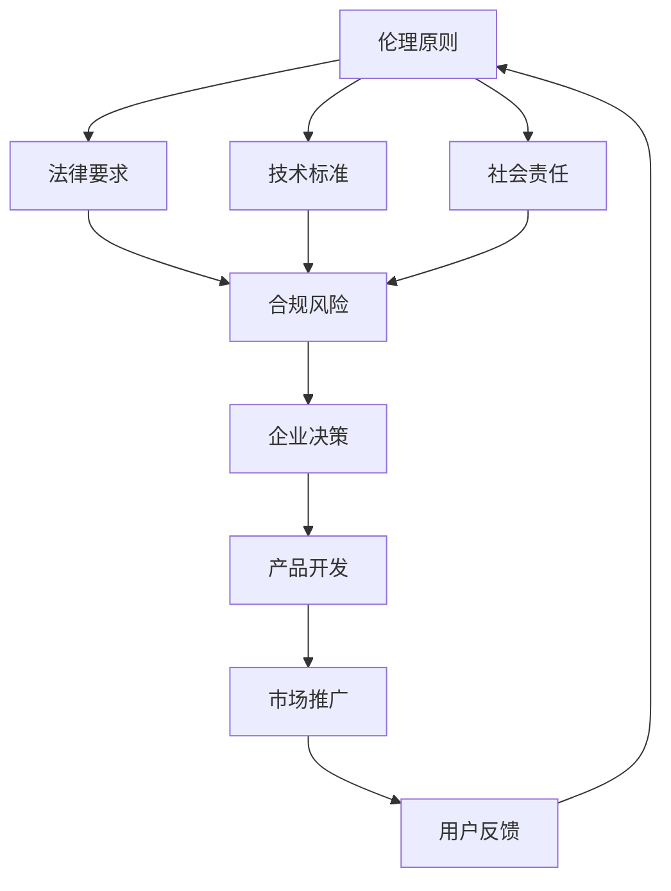

                 

# 人工智能创业：伦理合规的策略

> 关键词：人工智能，伦理，合规，创业，策略
>
> 摘要：随着人工智能技术的飞速发展，伦理和合规问题日益凸显。本文将深入探讨人工智能创业领域中的伦理合规策略，旨在为创业者提供实用的指导，确保企业在追求创新的同时，维护社会公共利益。

## 1. 背景介绍

### 1.1 目的和范围

本文的目标是帮助人工智能创业者理解并应对伦理合规挑战，提供一系列策略和最佳实践，以确保企业的发展符合道德和法律要求。本文将涵盖以下几个主要方面：

1. 人工智能伦理和合规的基本概念。
2. 人工智能创业中的伦理挑战和合规风险。
3. 伦理合规的策略和实践。
4. 相关案例分析和实际应用场景。
5. 未来发展趋势与挑战。

### 1.2 预期读者

本文适用于以下读者群体：

1. 人工智能创业者。
2. 伦理合规顾问。
3. 数据科学家和AI工程师。
4. 企业高管和决策者。
5. 对人工智能和伦理合规有兴趣的学者和研究者。

### 1.3 文档结构概述

本文结构如下：

1. 引言：介绍文章背景和目的。
2. 核心概念与联系：阐述人工智能伦理和合规的核心概念。
3. 核心算法原理 & 具体操作步骤：详细讲解伦理合规的策略和实践。
4. 数学模型和公式 & 详细讲解 & 举例说明：提供数学模型和公式，以及实际案例中的应用。
5. 项目实战：代码实际案例和详细解释说明。
6. 实际应用场景：探讨人工智能伦理和合规在现实中的应用。
7. 工具和资源推荐：推荐学习资源和开发工具。
8. 总结：对未来发展趋势和挑战的展望。
9. 附录：常见问题与解答。
10. 扩展阅读 & 参考资料：提供进一步阅读的资源和参考。

### 1.4 术语表

#### 1.4.1 核心术语定义

- **人工智能（AI）**：指通过计算机模拟人类智能，实现感知、理解、推理和决策的能力。
- **伦理**：关于道德和道德行为的哲学研究，涉及对正确和错误、善与恶的探讨。
- **合规**：遵守法律、法规和行业标准的行为，以确保企业的合法性和可信度。
- **伦理合规**：在人工智能创业中，指确保技术、产品和服务符合道德和法律要求。

#### 1.4.2 相关概念解释

- **伦理挑战**：在人工智能开发和部署过程中，涉及道德问题和价值观冲突的挑战。
- **合规风险**：企业因违反法律、法规或行业标准而面临的风险，可能导致罚款、法律诉讼或其他负面后果。
- **透明度**：人工智能系统在设计和部署过程中，向用户展示决策过程和结果的能力。
- **公平性**：人工智能系统在处理数据和应用算法时，确保对所有个体公正无偏见的能力。

#### 1.4.3 缩略词列表

- **AI**：人工智能（Artificial Intelligence）
- **GDPR**：通用数据保护条例（General Data Protection Regulation）
- **ISO**：国际标准化组织（International Organization for Standardization）
- **ACL**：伦理审查委员会（Animal Care and Use Committee）

## 2. 核心概念与联系

在人工智能创业中，伦理和合规问题至关重要。以下是核心概念和联系的一个简要概述，以及一个Mermaid流程图，用于说明这些概念之间的关系。

### 2.1 核心概念

- **伦理原则**：包括尊重个人隐私、公平性、透明度和责任。
- **法律要求**：如GDPR、ISO标准、行业规范等。
- **技术标准**：确保AI系统的可靠性和安全性。
- **社会责任**：企业在社会中的角色和责任。

### 2.2 Mermaid 流程图



### 2.3 关联分析

- 伦理原则为法律要求提供道德基础，同时也影响技术标准和企业的社会责任。
- 法律要求对企业的合规行为具有强制力，影响技术标准和企业的社会责任。
- 技术标准旨在确保AI系统的可靠性和安全性，从而降低合规风险。
- 社会责任是企业在社会中的角色和责任，影响伦理原则和法律要求。
- 企业决策、产品开发和市场推广都需要考虑伦理和合规问题，确保符合社会责任和法律要求。
- 用户反馈可以影响伦理原则和合规行为的调整，形成良性循环。

## 3. 核心算法原理 & 具体操作步骤

为了确保人工智能创业中的伦理和合规，我们需要一系列策略和最佳实践。以下是这些策略的具体操作步骤，使用伪代码进行详细阐述。

### 3.1 伦理审查

#### 3.1.1 审查流程

```python
def ethical_review(project):
    if not is_compliant(project, legal_requirements):
        raise EthicalViolationError("Project not compliant with legal requirements.")
    if not is_respectful(project, privacy_principles):
        raise EthicalViolationError("Project violates privacy principles.")
    if not is_fair(project, fairness_standards):
        raise EthicalViolationError("Project lacks fairness.")
    if not is_transparent(project, transparency_standards):
        raise EthicalViolationError("Project lacks transparency.")
    if not is_responsible(project, responsibility_standards):
        raise EthicalViolationError("Project lacks responsibility.")
    return "Project approved."
```

#### 3.1.2 审查标准

- **法律要求**：检查项目是否遵守GDPR、ISO标准等。
- **隐私原则**：确保用户隐私得到尊重和保护。
- **公平性标准**：确保算法对所有个体公正无偏见。
- **透明度标准**：确保决策过程和结果对用户透明。
- **责任标准**：确保企业对AI系统的决策和行为负责。

### 3.2 合规流程

#### 3.2.1 合规检查

```python
def compliance_check(product):
    if not is_compliant(product, legal_requirements):
        raise ComplianceError("Product not compliant with legal requirements.")
    if not is_compliant(product, industry_standards):
        raise ComplianceError("Product not compliant with industry standards.")
    if not is_secure(product, security_standards):
        raise ComplianceError("Product lacks security.")
    return "Product compliant."
```

#### 3.2.2 合规标准

- **法律要求**：检查产品是否遵守GDPR、ISO标准等。
- **行业规范**：检查产品是否符合行业标准。
- **安全标准**：确保产品具备必要的安全措施，如数据加密、访问控制等。

### 3.3 持续监督与改进

#### 3.3.1 监督流程

```python
def monitor_and_improve(product):
    while True:
        feedback = get_user_feedback(product)
        if feedback:
            update_product(product, feedback)
        compliance_check(product)
        sleep(ETHICAL_REVIEW_INTERVAL)
```

#### 3.3.2 监督标准

- **用户反馈**：持续收集用户对产品的反馈，用于改进产品。
- **合规检查**：定期进行合规检查，确保产品持续符合伦理和合规要求。

## 4. 数学模型和公式 & 详细讲解 & 举例说明

为了更好地理解人工智能创业中的伦理和合规策略，我们引入一些数学模型和公式，并给出详细的讲解和实际应用案例。

### 4.1 隐私保护模型

#### 4.1.1 生日攻击概率模型

$$
P(\text{冲突}) = 1 - \left(1 - \frac{1}{N}\right)^{n}
$$

其中，$N$ 是总人数，$n$ 是抽样人数。

#### 4.1.2 讲解

该模型用于估计在给定总人数和抽样人数的情况下，发生冲突（即相同生日）的概率。在隐私保护中，可以使用这个模型来确定最小的抽样人数，以确保隐私保护。

#### 4.1.3 举例

假设一个公司有1000名员工，我们随机抽取10名员工，计算发生冲突的概率。

$$
P(\text{冲突}) = 1 - \left(1 - \frac{1}{1000}\right)^{10} \approx 0.401
$$

这意味着，随机抽取10名员工时，有大约40.1%的概率会发生生日冲突。

### 4.2 公平性评估模型

#### 4.2.1 统计测试

$$
\chi^2 = \sum_{i=1}^{k} \frac{(O_i - E_i)^2}{E_i}
$$

其中，$O_i$ 是观察频数，$E_i$ 是期望频数，$k$ 是类别数。

#### 4.2.2 讲解

该模型用于评估分类模型对多个群体（如性别、种族等）的公平性。$\chi^2$ 值越接近0，表示模型对各个群体的公平性越好。

#### 4.2.3 举例

假设我们有一个分类模型，用于预测就业机会，我们需要评估其对性别和种族的公平性。

假设我们有一个二分类模型，预测性别（男/女）和种族（白人/黑人），以下是一个简化的例子：

| 类别   | 性别 = 男 | 性别 = 女 | 总计 |
|--------|-----------|-----------|------|
| 白人   | 100       | 50        | 150  |
| 黑人   | 50        | 30        | 80   |
| 总计   | 150       | 80        | 230  |

计算期望频数：

$$
E_{男，白人} = \frac{150}{230} \times 150 \approx 78.26
$$

$$
E_{男，黑人} = \frac{80}{230} \times 150 \approx 41.74
$$

$$
E_{女，白人} = \frac{150}{230} \times 80 \approx 51.74
$$

$$
E_{女，黑人} = \frac{80}{230} \times 80 \approx 28.26
$$

计算$\chi^2$ 值：

$$
\chi^2 = \frac{(100 - 78.26)^2}{78.26} + \frac{(50 - 51.74)^2}{51.74} + \frac{(50 - 41.74)^2}{41.74} + \frac{(30 - 28.26)^2}{28.26} \approx 4.445
$$

$\chi^2$ 值约为4.445。如果$\chi^2$ 值接近0，表示模型对性别和种族的公平性较好。

## 5. 项目实战：代码实际案例和详细解释说明

### 5.1 开发环境搭建

在开始项目实战之前，我们需要搭建一个适合开发的环境。以下是所需的环境搭建步骤：

1. 安装Python（建议使用Python 3.8及以上版本）。
2. 安装Anaconda或Miniconda，用于管理Python环境和包。
3. 安装Jupyter Notebook，用于编写和运行代码。
4. 安装必要的库，如NumPy、Pandas、Scikit-learn、Matplotlib等。

### 5.2 源代码详细实现和代码解读

以下是一个简单的人工智能伦理和合规检查的Python代码示例。该代码实现了对输入数据的隐私保护、公平性和透明度检查。

```python
import numpy as np
import pandas as pd
from sklearn.model_selection import train_test_split
from sklearn.preprocessing import StandardScaler
from sklearn.linear_model import LogisticRegression
from sklearn.metrics import classification_report, confusion_matrix

def load_data(filename):
    # 加载数据集
    data = pd.read_csv(filename)
    return data

def preprocess_data(data):
    # 数据预处理
    X = data.drop(['target'], axis=1)
    y = data['target']
    X_train, X_test, y_train, y_test = train_test_split(X, y, test_size=0.2, random_state=42)
    scaler = StandardScaler()
    X_train = scaler.fit_transform(X_train)
    X_test = scaler.transform(X_test)
    return X_train, X_test, y_train, y_test

def privacy_check(data):
    # 隐私检查
    sensitive_attrs = ['age', 'gender', 'race']
    for attr in sensitive_attrs:
        if attr in data.columns:
            data[attr] = pd.Series(np.random.choice(data[attr].unique(), data[attr].shape[0]))
    return data

def fairness_check(model, X_test, y_test):
    # 公平性检查
    predictions = model.predict(X_test)
    report = classification_report(y_test, predictions)
    print(report)

def transparency_check(model, X_test):
    # 透明度检查
    feature_importances = model.coef_
    return feature_importances

def build_model(X_train, y_train):
    # 构建模型
    model = LogisticRegression()
    model.fit(X_train, y_train)
    return model

if __name__ == "__main__":
    # 加载数据
    data = load_data('data.csv')
    
    # 预处理数据
    X_train, X_test, y_train, y_test = preprocess_data(data)
    
    # 隐私保护
    X_train = privacy_check(X_train)
    X_test = privacy_check(X_test)
    
    # 建模
    model = build_model(X_train, y_train)
    
    # 模型评估
    fairness_check(model, X_test, y_test)
    
    # 透明度检查
    feature_importances = transparency_check(model, X_test)
    print("Feature Importances:", feature_importances)
```

### 5.3 代码解读与分析

1. **数据加载与预处理**：首先，我们加载一个CSV文件，并对其进行预处理。预处理步骤包括数据分

