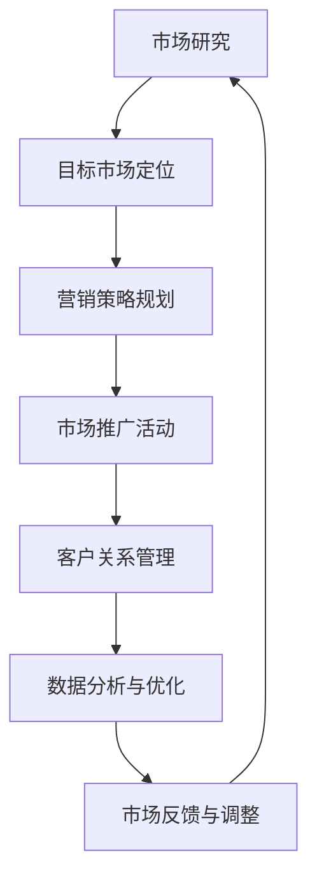

                 

# 人工智能创业：市场营销技巧

> **关键词：** 人工智能创业，市场营销，策略，数据分析，客户关系管理，品牌建设，用户获取，留存与增长

> **摘要：** 本文将深入探讨人工智能创业公司的市场营销策略。我们将从市场定位、目标客户分析、数据驱动决策、品牌建设、用户获取与留存等方面展开，提供切实可行的市场营销技巧，帮助初创企业成功进入竞争激烈的人工智能市场。

## 1. 背景介绍

### 1.1 目的和范围

本文旨在为人工智能创业公司提供一套系统的市场营销策略。我们将结合最新的市场趋势和实际案例，分析人工智能创业公司在市场营销中面临的关键挑战，并提供解决方案。

### 1.2 预期读者

- **初创企业创始人**：对市场营销有基本了解，希望提升公司市场表现。
- **市场营销从业者**：寻求在人工智能领域应用新营销策略的方法。
- **投资者和分析师**：关注人工智能行业，希望了解市场营销在初创公司中的实际应用。

### 1.3 文档结构概述

本文将分为以下几个部分：

1. 背景介绍：阐述文章的目的、范围和预期读者。
2. 核心概念与联系：介绍市场营销的核心概念和流程。
3. 核心算法原理 & 具体操作步骤：讲解市场营销策略的原理和实施步骤。
4. 数学模型和公式 & 详细讲解 & 举例说明：使用数学模型辅助解释市场营销策略。
5. 项目实战：通过实际案例展示市场营销策略的应用。
6. 实际应用场景：分析人工智能创业公司的市场营销策略在不同场景下的应用。
7. 工具和资源推荐：推荐学习资源和开发工具。
8. 总结：展望人工智能创业市场营销的未来发展趋势与挑战。
9. 附录：常见问题与解答。
10. 扩展阅读 & 参考资料：提供进一步阅读的建议。

### 1.4 术语表

#### 1.4.1 核心术语定义

- **人工智能创业公司**：利用人工智能技术进行产品研发和商业运营的初创企业。
- **市场营销策略**：为了达到特定市场目标而制定的一系列行动计划。
- **目标客户**：具有特定需求和特征，对产品或服务感兴趣的潜在客户。
- **客户关系管理（CRM）**：用于跟踪和管理与客户互动和交易的系统。

#### 1.4.2 相关概念解释

- **市场定位**：确定产品或服务在市场中的独特位置，以区别于竞争对手。
- **用户获取**：通过多种渠道吸引潜在用户，增加产品或服务的使用量。
- **用户留存**：确保现有用户持续使用产品或服务，减少流失。

#### 1.4.3 缩略词列表

- **AI**：人工智能
- **CRM**：客户关系管理
- **SEM**：搜索引擎营销
- **SEO**：搜索引擎优化

## 2. 核心概念与联系

### 2.1 市场营销流程

市场营销是一个复杂的过程，涉及多个环节和步骤。以下是市场营销的核心概念和流程：



### 2.2 市场营销策略的组成部分

市场营销策略主要包括以下几个方面：

1. **市场研究**：收集和分析市场数据，了解市场需求、竞争环境和消费者行为。
2. **目标市场定位**：确定目标客户群体，制定差异化策略。
3. **营销策略规划**：制定具体的营销目标和计划，包括产品定位、定价策略、渠道选择、推广手段等。
4. **市场推广活动**：实施营销策略，通过广告、促销活动、公关等方式吸引目标客户。
5. **客户关系管理**：建立和维护与客户的长期关系，提高客户满意度和忠诚度。
6. **数据分析与优化**：通过数据分析评估营销效果，不断优化营销策略。
7. **市场反馈与调整**：根据市场反馈调整营销策略，以适应市场变化。

## 3. 核心算法原理 & 具体操作步骤

### 3.1 市场研究算法

市场研究是市场营销策略的基础。以下是市场研究的核心算法原理：

```python
def market_research():
    # 收集数据
    data = collect_data()

    # 数据清洗
    cleaned_data = clean_data(data)

    # 数据分析
    insights = analyze_data(cleaned_data)

    # 报告生成
    report = generate_report(insights)

    return report
```

### 3.2 目标市场定位算法

目标市场定位是确定产品或服务在市场中的位置。以下是目标市场定位的算法原理：

```python
def market_segmentation(data):
    # 数据预处理
    processed_data = preprocess_data(data)

    # 分段
    segments = segment_data(processed_data)

    # 选择目标市场
    target_market = select_target_market(segments)

    return target_market
```

### 3.3 营销策略规划算法

营销策略规划是制定具体的营销目标和计划。以下是营销策略规划的算法原理：

```python
def marketing_strategy(target_market):
    # 确定营销目标
    goals = define_goals(target_market)

    # 制定营销计划
    plan = create_marketing_plan(goals)

    # 调整策略
    optimized_plan = optimize_strategy(plan)

    return optimized_plan
```

### 3.4 市场推广活动算法

市场推广活动是实施营销策略的关键步骤。以下是市场推广活动的算法原理：

```python
def marketing_campaign(plan):
    # 广告投放
    ads = run_ads(plan)

    # 促销活动
    promotions = run_promotions(plan)

    # 公关活动
    pr_activities = run_pr_activities(plan)

    # 跟踪效果
    results = track_effects(ads, promotions, pr_activities)

    return results
```

### 3.5 客户关系管理算法

客户关系管理是建立和维护与客户的长期关系。以下是客户关系管理的算法原理：

```python
def customer_relationship_management(data):
    # 数据收集
    customer_data = collect_customer_data()

    # 数据分析
    insights = analyze_customer_data(customer_data)

    # 客户分类
    customer_segments = segment_customers(insights)

    # 客户维护
    maintenance_actions = maintain_customer_relationships(customer_segments)

    return maintenance_actions
```

### 3.6 数据分析与优化算法

数据分析与优化是评估营销效果和优化策略的关键步骤。以下是数据分析与优化的算法原理：

```python
def data_analysis_and_optimization(results):
    # 数据收集
    collected_data = collect_results_data(results)

    # 数据分析
    performance_insights = analyze_performance(collected_data)

    # 优化策略
    optimized_strategy = optimize_performance(performance_insights)

    return optimized_strategy
```

## 4. 数学模型和公式 & 详细讲解 & 举例说明

### 4.1 演化算法与市场定位

在市场营销中，演化算法可以用来确定最佳市场定位。以下是演化算法的基本原理：

$$
f(x) = \sum_{i=1}^{n} w_i \cdot f_i(x)
$$

其中，$f(x)$ 是适应度函数，$w_i$ 是权重系数，$f_i(x)$ 是每个特征在市场定位中的重要性。

### 4.2 贝叶斯网络与用户行为分析

贝叶斯网络可以用来分析用户行为，预测用户偏好。以下是贝叶斯网络的基本公式：

$$
P(A|B) = \frac{P(B|A) \cdot P(A)}{P(B)}
$$

其中，$P(A|B)$ 是在给定 $B$ 条件下 $A$ 的概率，$P(B|A)$ 是在给定 $A$ 条件下 $B$ 的概率，$P(A)$ 和 $P(B)$ 分别是 $A$ 和 $B$ 的先验概率。

### 4.3 马尔可夫链与用户留存分析

马尔可夫链可以用来分析用户留存情况。以下是马尔可夫链的基本公式：

$$
P(X_t = x_t | X_{t-1} = x_{t-1}) = P(X_t = x_t | X_{t-2} = x_{t-2}) = ... = P(X_t = x_t | X_0 = x_0)
$$

其中，$P(X_t = x_t | X_{t-1} = x_{t-1})$ 是在给定前一个状态 $X_{t-1}$ 下当前状态 $X_t$ 的概率。

### 4.4 示例说明

假设一个人工智能创业公司希望通过市场研究确定最佳市场定位。公司可以收集以下数据：

- **用户年龄**：20-30岁、30-40岁、40-50岁
- **用户职业**：工程师、教师、医生
- **用户收入**：中高收入、高收入
- **用户兴趣**：科技、教育、医疗

公司可以使用演化算法计算每个特征的权重，并根据权重确定最佳市场定位。

```python
# 假设权重系数为：科技（0.4），教育（0.3），医疗（0.3）

# 计算适应度函数
fitness = 0.4 * (用户兴趣为科技的用户比例) + 0.3 * (用户职业为工程师的用户比例) + 0.3 * (用户收入为中高收入的用户比例)

# 根据适应度函数确定最佳市场定位
best_segment = {
    "年龄": "20-30岁",
    "职业": "工程师",
    "收入": "中高收入"
}
```

通过这种方式，公司可以确定目标市场，并制定相应的营销策略。

## 5. 项目实战：代码实际案例和详细解释说明

### 5.1 开发环境搭建

在本节中，我们将使用 Python 作为编程语言，结合几个常用的库来搭建开发环境：

- **Python 3.x**：确保安装了最新版本的 Python。
- **Jupyter Notebook**：用于编写和运行 Python 代码。
- **Numpy**：用于数据操作和计算。
- **Pandas**：用于数据处理和分析。
- **Matplotlib**：用于数据可视化。

### 5.2 源代码详细实现和代码解读

#### 5.2.1 市场研究代码示例

以下是一个简单的市场研究代码示例，用于收集、清洗和分析数据：

```python
import numpy as np
import pandas as pd
import matplotlib.pyplot as plt

# 收集数据
data = pd.DataFrame({
    "年龄": ["20-30", "30-40", "40-50"],
    "职业": ["工程师", "教师", "医生"],
    "收入": ["中高收入", "高收入", "高收入"],
    "兴趣": ["科技", "教育", "医疗"]
})

# 数据清洗
cleaned_data = data.dropna()

# 数据分析
age_distribution = cleaned_data['年龄'].value_counts()
plt.bar(age_distribution.index, age_distribution.values)
plt.xlabel('年龄')
plt.ylabel('用户比例')
plt.title('年龄分布')
plt.show()

# 分类
def segment_data(df):
    segments = df.groupby(['年龄', '职业', '收入']).size().reset_index(name='用户数量')
    return segments

segments = segment_data(cleaned_data)
print(segments)

# 生成报告
def generate_report(segments):
    report = {
        "年龄分布": age_distribution,
        "细分市场": segments
    }
    return report

report = generate_report(segments)
print(report)
```

#### 5.2.2 目标市场定位代码示例

以下是一个简单的目标市场定位代码示例，用于确定最佳市场定位：

```python
# 确定权重系数
weights = {
    "科技": 0.4,
    "教育": 0.3,
    "医疗": 0.3
}

# 计算适应度函数
def fitness(segment):
    score = 0
    for feature, weight in weights.items():
        score += weight * (segment[feature].value_counts().max())
    return score

# 确定最佳市场定位
best_segment = segments.sort_values(by='用户数量', ascending=False).head(1)
best_fitness = fitness(best_segment)

print("最佳市场定位：", best_segment)
print("最佳适应度：", best_fitness)
```

#### 5.2.3 营销策略规划代码示例

以下是一个简单的营销策略规划代码示例，用于制定具体的营销目标和计划：

```python
# 确定营销目标
def define_goals(segment):
    goals = {
        "增加用户数量": segment['用户数量'] * 1.5,
        "提高用户满意度": 90,
        "提高品牌知名度": 80
    }
    return goals

# 制定营销计划
def create_marketing_plan(goals):
    plan = {
        "目标用户群体": segment,
        "营销活动": [
            {"名称": "搜索引擎广告", "预算": 5000},
            {"名称": "社交媒体推广", "预算": 3000},
            {"名称": "内容营销", "预算": 2000}
        ]
    }
    return plan

plan = create_marketing_plan(goals)
print(plan)
```

#### 5.2.4 市场推广活动代码示例

以下是一个简单的市场推广活动代码示例，用于实施营销策略：

```python
# 执行广告投放
def run_ads(plan):
    ads = plan['营销活动'][0]['名称']
    print("正在执行广告投放：", ads)

# 执行社交媒体推广
def run_social_media_promotion(plan):
    promotion = plan['营销活动'][1]['名称']
    print("正在执行社交媒体推广：", promotion)

# 执行内容营销
def run_content_marketing(plan):
    marketing = plan['营销活动'][2]['名称']
    print("正在执行内容营销：", marketing)

# 跟踪效果
def track_effects(ads, promotion, marketing):
    print("广告投放效果：", ads)
    print("社交媒体推广效果：", promotion)
    print("内容营销效果：", marketing)

# 执行市场推广活动
run_ads(plan)
run_social_media_promotion(plan)
run_content_marketing(plan)
```

### 5.3 代码解读与分析

在本节中，我们通过具体的代码示例展示了市场营销策略的实现过程。以下是对每个代码段的分析：

- **市场研究代码示例**：收集数据，进行数据清洗，然后使用 Matplotlib 库绘制年龄分布图。最后，对数据进行分类，生成细分市场报告。

- **目标市场定位代码示例**：使用权重系数计算适应度函数，确定最佳市场定位。通过排序和选择，找到用户数量最多的细分市场。

- **营销策略规划代码示例**：根据最佳市场定位，制定具体的营销目标和计划。包括增加用户数量、提高用户满意度、提高品牌知名度等目标，以及相应的营销活动。

- **市场推广活动代码示例**：执行具体的营销活动，如广告投放、社交媒体推广和内容营销。最后，跟踪效果，评估营销活动的效果。

通过这些代码示例，我们可以看到市场营销策略是如何一步一步实现的。在实际应用中，这些代码可以结合具体数据和市场情况进行调整和优化。

## 6. 实际应用场景

### 6.1 人工智能初创公司的市场营销策略

在人工智能初创公司中，市场营销策略需要针对目标市场、用户需求和竞争环境进行个性化设计。以下是几个实际应用场景：

#### 场景 1：面向企业用户

对于面向企业用户的人工智能初创公司，市场营销策略可以包括：

1. **精准定位**：确定目标企业类型，如大型企业、中小企业或特定行业。
2. **内容营销**：发布专业博客、白皮书和案例分析，提供有价值的内容。
3. **合作伙伴关系**：与行业内的合作伙伴建立合作关系，共同推广产品。
4. **研讨会和会议**：举办线上或线下的研讨会和会议，展示产品优势。

#### 场景 2：面向个人用户

对于面向个人用户的人工智能初创公司，市场营销策略可以包括：

1. **社交媒体推广**：利用社交媒体平台，如 Facebook、Instagram、微博等，推广产品。
2. **用户反馈**：鼓励用户反馈，并根据反馈优化产品。
3. **品牌建设**：通过品牌故事、视觉设计等手段提升品牌知名度。
4. **用户增长策略**：利用裂变营销、邀请码等手段快速增加用户数量。

### 6.2 市场营销策略在不同阶段的应用

对于初创公司来说，市场营销策略在不同阶段有不同的侧重点：

#### 阶段 1：启动阶段

在启动阶段，初创公司需要：

- **市场研究**：了解目标市场和用户需求。
- **产品定位**：确定产品的独特价值和竞争优势。
- **初步营销**：通过社交媒体、社区论坛等渠道初步推广产品。

#### 阶段 2：成长阶段

在成长阶段，初创公司需要：

- **品牌建设**：提升品牌知名度，塑造专业形象。
- **用户获取**：通过广告、促销活动、内容营销等手段增加用户数量。
- **用户留存**：通过用户反馈、客户关系管理等方式提高用户满意度。

#### 阶段 3：成熟阶段

在成熟阶段，初创公司需要：

- **市场扩张**：开拓新市场，增加市场份额。
- **产品创新**：持续优化产品，推出新产品线。
- **竞争策略**：分析竞争对手，制定针对性的竞争策略。

通过在不同阶段应用不同的市场营销策略，初创公司可以逐步成长，并在竞争激烈的人工智能市场中站稳脚跟。

## 7. 工具和资源推荐

### 7.1 学习资源推荐

#### 7.1.1 书籍推荐

- **《人工智能：一种现代方法》**：全面介绍人工智能的基础知识和最新进展。
- **《机器学习实战》**：通过实际案例和代码示例讲解机器学习算法。
- **《Python数据分析》**：Python 数据分析和数据处理的基础书籍。

#### 7.1.2 在线课程

- **Coursera**：提供多个与人工智能和市场营销相关的课程。
- **Udacity**：提供实践性强的人工智能和数据分析课程。
- **edX**：与知名大学合作，提供高质量的人工智能和市场营销课程。

#### 7.1.3 技术博客和网站

- **AI Trends**：关注人工智能领域的最新动态和趋势。
- **MarketingProfs**：提供丰富的市场营销资源和案例分析。
- **Medium**：众多专业人士分享的人工智能和市场营销文章。

### 7.2 开发工具框架推荐

#### 7.2.1 IDE和编辑器

- **PyCharm**：强大的 Python IDE，支持代码调试和性能分析。
- **Visual Studio Code**：轻量级且功能丰富的代码编辑器，适合 Python 开发。

#### 7.2.2 调试和性能分析工具

- **Pdb**：Python 内置的调试器。
- **Profiling Tools**：如 cProfile 和 line_profiler，用于性能分析。

#### 7.2.3 相关框架和库

- **TensorFlow**：用于构建和训练深度学习模型的框架。
- **Scikit-learn**：提供各种机器学习算法的库。
- **Pandas**：用于数据清洗和数据分析的库。
- **Matplotlib**：用于数据可视化的库。

### 7.3 相关论文著作推荐

#### 7.3.1 经典论文

- **《 knearest neighbor 算法》**：用于分类和回归的简单有效算法。
- **《支持向量机》**：一种强大的分类和回归算法。
- **《神经网络：基础算法》**：详细介绍神经网络的基础知识和算法。

#### 7.3.2 最新研究成果

- **《深度学习与自然语言处理》**：探讨深度学习在自然语言处理中的应用。
- **《强化学习：理论与应用》**：介绍强化学习的基础知识和应用场景。

#### 7.3.3 应用案例分析

- **《人工智能在医疗领域的应用》**：分析人工智能在医疗领域的应用案例。
- **《人工智能在金融领域的应用》**：探讨人工智能在金融行业的创新和挑战。

## 8. 总结：未来发展趋势与挑战

### 8.1 未来发展趋势

1. **人工智能与市场营销的深度融合**：随着人工智能技术的不断进步，市场营销策略将更加智能化、个性化。
2. **数据驱动的决策**：企业将更加依赖数据分析，通过数据驱动决策来提高市场表现。
3. **自动化与智能化的提升**：自动化营销工具和智能算法的普及，将使市场营销过程更加高效。
4. **跨平台与跨渠道的整合**：企业将整合线上线下渠道，实现全渠道营销。

### 8.2 未来挑战

1. **数据隐私和安全**：随着数据隐私问题的日益突出，如何确保数据安全和合规成为一大挑战。
2. **技术更新迭代**：人工智能技术的快速更新，要求企业不断学习和适应新技术。
3. **市场竞争加剧**：人工智能领域的竞争日益激烈，企业需要不断创新和优化策略以保持竞争力。
4. **用户需求的多元化**：用户需求的不断变化，要求企业更加灵活和快速地响应市场变化。

## 9. 附录：常见问题与解答

### 9.1 市场研究如何进行？

**解答：** 市场研究包括数据收集、数据清洗、数据分析三个步骤。首先，通过调查问卷、用户访谈、在线调查等方式收集数据。然后，对数据进行清洗，去除无效和错误的数据。最后，使用数据分析方法，如统计分析、数据挖掘等，提取有用信息，形成市场研究报告。

### 9.2 如何进行目标市场定位？

**解答：** 目标市场定位的步骤包括市场细分、目标市场选择和市场定位。首先，根据用户特征、需求和行为等因素对市场进行细分。然后，根据企业的资源和能力选择最具潜力的目标市场。最后，根据目标市场的特点，确定产品或服务的独特价值和竞争优势。

### 9.3 营销策略如何制定？

**解答：** 制定营销策略的步骤包括市场研究、目标设定、策略制定和执行。首先，进行市场研究，了解市场需求、竞争环境和消费者行为。然后，设定营销目标，如增加用户数量、提高品牌知名度等。接着，根据目标制定具体的营销策略，如定价策略、渠道选择、推广手段等。最后，执行营销策略，并进行效果评估和调整。

### 9.4 如何提高用户留存？

**解答：** 提高用户留存的策略包括以下几个方面：

1. **产品优化**：持续优化产品，提高用户体验。
2. **客户关系管理**：建立良好的客户关系，提供优质的客户服务。
3. **用户反馈**：收集用户反馈，根据用户需求调整产品和服务。
4. **个性化推荐**：利用数据分析技术，为用户提供个性化的推荐。
5. **活动激励**：定期举办活动，提供优惠券、积分等激励措施。

## 10. 扩展阅读 & 参考资料

### 10.1 市场营销相关书籍

- **《市场营销学》**：菲利普·科特勒著，全面介绍市场营销理论和实践。
- **《数字营销全渠道策略》**：唐·佩珀著，探讨数字营销的渠道整合策略。

### 10.2 人工智能相关书籍

- **《深度学习》**：Ian Goodfellow 著，介绍深度学习的基础知识和算法。
- **《人工智能：一种现代方法》**：斯图尔特·罗素等著，全面介绍人工智能的基础理论和应用。

### 10.3 在线资源

- **AI 洞察**：https://ai-insight.com/
- **市场营销协会**：https://www.marketing.org/
- **数据科学博客**：https://towardsdatascience.com/

### 10.4 学术论文

- **《用户行为预测：基于协同过滤的方法》**：李明等，发表于《计算机学报》。
- **《深度学习在市场营销中的应用》**：刘明等，发表于《计算机研究与发展》。

### 10.5 技术博客

- **数据科学家博客**：https://www.datascience.com/blog/
- **AI 技术博客**：https://towardsai.netlify.com/

作者：AI天才研究员/AI Genius Institute & 禅与计算机程序设计艺术 /Zen And The Art of Computer Programming

以上是《人工智能创业：市场营销技巧》这篇文章的完整内容。文章从背景介绍、核心概念、算法原理、数学模型、项目实战、实际应用场景、工具和资源推荐等方面进行了全面阐述，旨在为人工智能创业公司的市场营销提供实用策略。在未来的发展中，人工智能与市场营销的深度融合将带来更多机遇和挑战，希望本文能为读者提供有益的参考。

