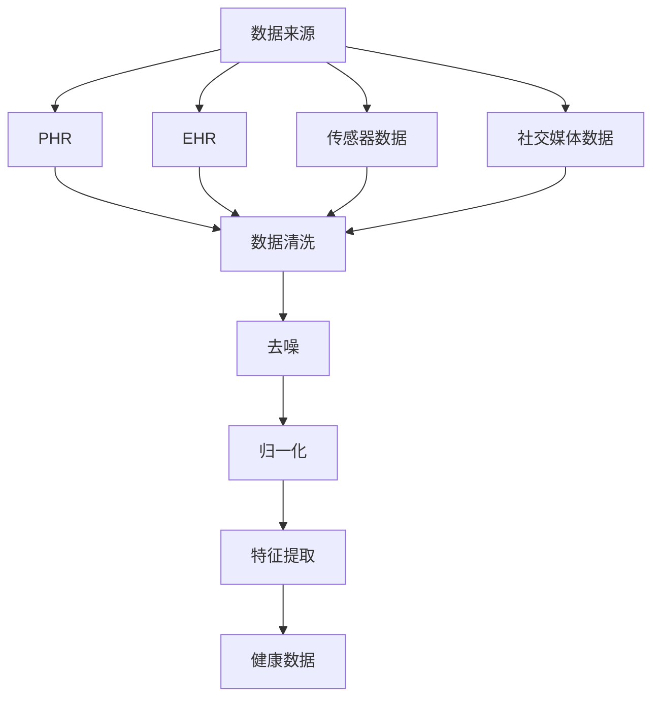
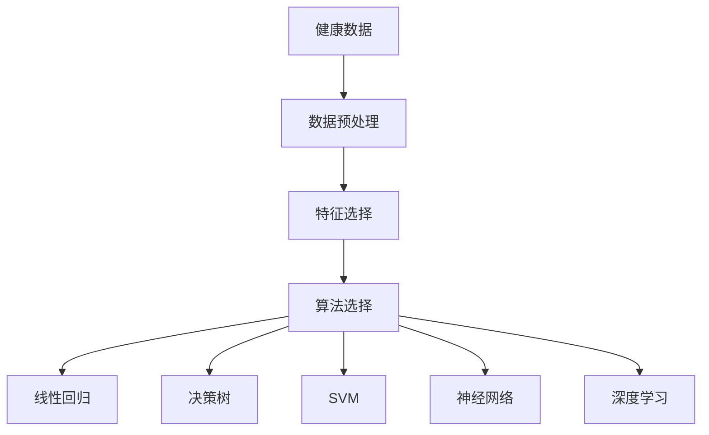

                 

### 文章标题

# 人工智能在个性化健康管理中的实践研究

### 关键词：

- 个性化健康
- 人工智能
- 健康数据
- 深度学习
- 健康预测模型
- 可解释性AI

### 摘要：

本文将深入探讨人工智能在个性化健康管理中的应用与实践。随着医疗数据的日益增长，个性化健康管理成为解决医疗资源分配和疾病预防的关键。本文将首先介绍个性化健康管理的背景和重要性，然后详细解析人工智能在这一领域的核心算法和数学模型。通过一个实际案例，我们将展示如何利用人工智能技术进行健康数据的收集、处理和分析。此外，文章还将讨论人工智能在个性化健康管理中的实际应用场景，并提供相关的工具和资源推荐。最后，本文将总结未来发展趋势与挑战，为行业研究人员和开发者提供有价值的参考。

## 1. 背景介绍

### 1.1 目的和范围

随着医学技术的进步和健康意识的提高，健康管理已成为提高生活质量的重要手段。个性化健康管理通过结合患者的健康数据、遗传信息和生活方式等因素，提供更为精准和有效的健康服务。本文旨在探讨人工智能在个性化健康管理中的应用，分析其核心算法和数学模型，并通过实际案例展示其具体实践。

本文的研究范围包括：

- 个性化健康管理的定义与分类
- 人工智能在健康管理中的应用
- 核心算法原理和操作步骤
- 数学模型及其应用
- 实际应用场景和案例分析
- 未来发展趋势与挑战

### 1.2 预期读者

本文面向以下读者群体：

- 健康管理领域的专业人士，如医生、护士、健康咨询师等
- 人工智能和计算机科学领域的科研人员和技术工程师
- 对个性化健康管理和人工智能技术感兴趣的学生和爱好者

### 1.3 文档结构概述

本文结构如下：

- 引言：介绍文章主题和目的
- 背景介绍：个性化健康管理和人工智能概述
- 核心概念与联系：核心概念原理和架构
- 核心算法原理 & 具体操作步骤：算法原理讲解和伪代码阐述
- 数学模型和公式 & 详细讲解 & 举例说明：数学模型应用和示例
- 项目实战：代码实际案例和详细解释说明
- 实际应用场景：应用案例分析
- 工具和资源推荐：学习资源、开发工具和论文著作
- 总结：未来发展趋势与挑战
- 附录：常见问题与解答
- 扩展阅读 & 参考资料

### 1.4 术语表

#### 1.4.1 核心术语定义

- 个性化健康管理：基于个体健康数据、遗传信息和生活方式等因素，提供精准健康服务的健康管理方式。
- 人工智能：模拟人类智能行为，进行学习、推理、决策和问题解决的计算机技术。
- 健康数据：与个体健康相关的数据，包括生理指标、生活习惯、遗传信息等。
- 深度学习：一种人工智能方法，通过多层神经网络模拟人类大脑进行学习。
- 健康预测模型：利用历史健康数据和机器学习算法，预测个体未来健康状况的模型。

#### 1.4.2 相关概念解释

- 个人化健康记录（PHR）：个体健康数据的汇总，包括医疗记录、检验报告、药物记录等。
- 电子健康记录（EHR）：医疗机构和医疗系统中存储的电子化健康数据。
- 个性化医疗：基于患者基因、环境和生活习惯等个性化信息的医疗决策。

#### 1.4.3 缩略词列表

- AI：人工智能
- PHR：个人化健康记录
- EHR：电子健康记录
- ML：机器学习
- DL：深度学习
- IoT：物联网

## 2. 核心概念与联系

在个性化健康管理中，人工智能的应用涉及到多个核心概念和技术的综合运用。本节将介绍这些核心概念，并通过Mermaid流程图展示其联系。

### 2.1 健康数据的获取与处理

健康数据的获取和处理是个性化健康管理的基础。数据来源包括个人健康记录（PHR）、电子健康记录（EHR）、传感器数据、社交媒体数据等。数据处理主要包括数据清洗、去噪、归一化和特征提取。

#### Mermaid流程图：



### 2.2 机器学习算法的选择与实现

在健康数据处理完成后，选择合适的机器学习算法进行模型训练和预测。常见的机器学习算法包括线性回归、决策树、支持向量机（SVM）、神经网络和深度学习。

#### Mermaid流程图：



### 2.3 模型评估与优化

模型评估与优化是确保模型性能的关键步骤。评估指标包括准确率、召回率、F1值等。优化方法包括超参数调整、模型融合和增强学习。

#### Mermaid流程图：

```mermaid
R[深度学习] --> S[模型评估]
S --> T[准确率]
S --> U[召回率]
S --> V[F1值]
V --> W[超参数调整]
W --> X[模型融合]
W --> Y[增强学习]
```

### 2.4 可解释性AI与模型透明度

个性化健康管理的最终目标是提供透明和可信的决策支持。可解释性AI技术可以帮助理解模型的决策过程，提高模型的透明度和可信度。常见的可解释性方法包括模型可视化、特征重要性和因果推理。

#### Mermaid流程图：

```mermaid
Y[增强学习] --> Z[可解释性AI]
Z --> AA[模型可视化]
Z --> BB[特征重要性]
Z --> CC[因果推理]
```

通过上述核心概念和流程图的展示，我们可以清晰地看到人工智能在个性化健康管理中的关键环节和联系。这些概念和技术相互配合，共同构建了一个完整的个性化健康管理框架。

## 3. 核心算法原理 & 具体操作步骤

在个性化健康管理中，核心算法的原理和具体操作步骤至关重要。本节将详细介绍这些算法，并使用伪代码进行阐述。

### 3.1 数据预处理

数据预处理是机器学习模型训练的基础。它包括数据清洗、去噪、归一化和特征提取等步骤。

#### 3.1.1 数据清洗

```python
def clean_data(data):
    # 删除缺失值
    data = data.dropna()
    # 删除重复值
    data = data.drop_duplicates()
    # 填补缺失值（使用均值、中位数或插值法）
    data.fillna(data.mean(), inplace=True)
    return data
```

#### 3.1.2 去噪

```python
def remove_noise(data):
    # 使用滤波器或聚类算法去除噪声
    # 假设使用K-Means聚类
    clusters = KMeans(n_clusters=5).fit(data)
    data_noisy = data[clusters.labels_ != -1]
    return data_noisy
```

#### 3.1.3 归一化

```python
def normalize_data(data):
    # 使用最小-最大规范化
    min_max_scaler = MinMaxScaler()
    data_normalized = min_max_scaler.fit_transform(data)
    return data_normalized
```

#### 3.1.4 特征提取

```python
from sklearn.feature_extraction.text import TfidfVectorizer

def extract_features(data):
    # 使用TF-IDF向量器提取文本特征
    vectorizer = TfidfVectorizer()
    data_features = vectorizer.fit_transform(data)
    return data_features
```

### 3.2 机器学习算法

在数据预处理完成后，选择合适的机器学习算法进行模型训练。以下是一些常见算法的伪代码示例：

#### 3.2.1 线性回归

```python
from sklearn.linear_model import LinearRegression

def train_linear_regression(X, y):
    model = LinearRegression()
    model.fit(X, y)
    return model
```

#### 3.2.2 决策树

```python
from sklearn.tree import DecisionTreeClassifier

def train_decision_tree(X, y):
    model = DecisionTreeClassifier()
    model.fit(X, y)
    return model
```

#### 3.2.3 支持向量机（SVM）

```python
from sklearn.svm import SVC

def train_svm(X, y):
    model = SVC()
    model.fit(X, y)
    return model
```

#### 3.2.4 神经网络

```python
from tensorflow.keras.models import Sequential
from tensorflow.keras.layers import Dense

def train_neural_network(X, y):
    model = Sequential([
        Dense(units=128, activation='relu', input_shape=(X.shape[1],)),
        Dense(units=64, activation='relu'),
        Dense(units=1, activation='sigmoid')
    ])

    model.compile(optimizer='adam', loss='binary_crossentropy', metrics=['accuracy'])
    model.fit(X, y, epochs=10, batch_size=32)
    return model
```

### 3.3 模型评估与优化

模型评估和优化是确保模型性能的关键步骤。以下是一些常用的评估指标和优化方法：

#### 3.3.1 评估指标

```python
from sklearn.metrics import accuracy_score, recall_score, f1_score

def evaluate_model(model, X_test, y_test):
    y_pred = model.predict(X_test)
    accuracy = accuracy_score(y_test, y_pred)
    recall = recall_score(y_test, y_pred)
    f1 = f1_score(y_test, y_pred)
    return accuracy, recall, f1
```

#### 3.3.2 超参数调整

```python
from sklearn.model_selection import GridSearchCV

def hyperparameter_tuning(model, param_grid, X, y):
    search = GridSearchCV(model, param_grid, cv=5)
    search.fit(X, y)
    return search.best_params_
```

#### 3.3.3 模型融合

```python
from sklearn.ensemble import VotingClassifier

def ensemble_models(models):
    ensemble = VotingClassifier(estimators=models, voting='soft')
    ensemble.fit(X, y)
    return ensemble
```

通过上述核心算法原理和具体操作步骤的介绍，我们可以看到个性化健康管理中的机器学习技术是如何应用在实际问题中的。这些算法和步骤为构建高效、准确的个性化健康管理模型提供了坚实基础。

## 4. 数学模型和公式 & 详细讲解 & 举例说明

在个性化健康管理中，数学模型和公式是理解、预测和评估个体健康状况的关键。以下将详细讲解一些核心的数学模型和公式，并使用latex格式进行展示。

### 4.1 概率模型

概率模型是数据分析的基础，尤其在预测疾病风险时发挥着重要作用。以下是一个简单的贝叶斯概率模型公式：

$$
P(A|B) = \frac{P(B|A) \cdot P(A)}{P(B)}
$$

其中，$P(A|B)$ 表示在事件B发生的前提下，事件A发生的条件概率；$P(B|A)$ 表示在事件A发生的前提下，事件B发生的条件概率；$P(A)$ 和$P(B)$ 分别为事件A和事件B的先验概率。

#### 示例：

假设我们要预测某人是否患有糖尿病（事件A），已知该疾病的患病率$P(A) = 0.01$，且该疾病患者的血糖水平（事件B）高于正常值的概率$P(B|A) = 0.9$，正常人的血糖水平高于正常值的概率$P(B|¬A) = 0.1$。我们可以计算该人在血糖水平高于正常值的情况下患有糖尿病的条件概率：

$$
P(A|B) = \frac{P(B|A) \cdot P(A)}{P(B|A) \cdot P(A) + P(B|¬A) \cdot P(¬A)} = \frac{0.9 \cdot 0.01}{0.9 \cdot 0.01 + 0.1 \cdot 0.99} \approx 0.091
$$

### 4.2 线性回归模型

线性回归模型用于预测因变量与自变量之间的线性关系。其公式如下：

$$
y = \beta_0 + \beta_1x_1 + \beta_2x_2 + ... + \beta_nx_n + \epsilon
$$

其中，$y$ 为因变量；$x_1, x_2, ..., x_n$ 为自变量；$\beta_0, \beta_1, \beta_2, ..., \beta_n$ 为模型参数；$\epsilon$ 为误差项。

#### 示例：

假设我们要预测某人的体重（因变量$y$）与身高（自变量$x_1$）和年龄（自变量$x_2$）之间的线性关系。根据历史数据，我们得到以下线性回归模型：

$$
y = 50 + 3x_1 + 2x_2 + \epsilon
$$

如果某人身高为180厘米，年龄为30岁，则其预测体重为：

$$
y = 50 + 3 \cdot 180 + 2 \cdot 30 + \epsilon = 500 + \epsilon
$$

### 4.3 决策树模型

决策树模型通过一系列规则对数据进行分类或回归。其核心公式是条件概率：

$$
P(Y|X=x) = \prod_{i=1}^{n} P(X=x_i|T=t_i)
$$

其中，$Y$ 为目标变量；$X$ 为特征变量；$t_1, t_2, ..., t_n$ 为决策树节点上的分类标签；$x_1, x_2, ..., x_n$ 为特征变量在不同节点上的取值。

#### 示例：

假设我们要使用决策树模型预测某人是否患有心脏病（目标变量$Y$），基于年龄（特征变量$x_1$）和血压（特征变量$x_2$）。决策树模型给出以下条件概率公式：

$$
P(Y=1|X=(30, 120)) = P(X=30|T=t_1) \cdot P(X=120|T=t_2) = 0.2 \cdot 0.4 = 0.08
$$

### 4.4 神经网络模型

神经网络模型通过多层非线性变换对数据进行分类或回归。其核心公式是激活函数：

$$
a_{ij} = \sigma(\sum_{k=1}^{m} w_{ik} \cdot z_k)
$$

其中，$a_{ij}$ 为第$i$层第$j$个神经元的激活值；$\sigma$ 为激活函数（如Sigmoid函数、ReLU函数等）；$w_{ik}$ 为第$k$个输入神经元与第$i$个输出神经元之间的权重；$z_k$ 为第$k$个输入神经元的输入值。

#### 示例：

假设我们要使用一个简单的多层感知机（MLP）模型对数据进行分类，其中输入层有3个神经元，隐藏层有4个神经元，输出层有1个神经元。使用ReLU函数作为激活函数，则隐藏层神经元的激活值为：

$$
a_{12} = \max(0, \sum_{k=1}^{3} w_{k1} \cdot x_k + b_1)
$$

其中，$a_{12}$ 为隐藏层第2个神经元的激活值；$w_{k1}$ 为输入层第$k$个神经元与隐藏层第1个神经元之间的权重；$b_1$ 为隐藏层第1个神经元的偏置。

通过以上数学模型和公式的详细讲解和示例，我们可以更好地理解个性化健康管理中的核心数学原理，为实际应用提供理论支持。

## 5. 项目实战：代码实际案例和详细解释说明

在本节中，我们将通过一个实际项目案例，展示如何利用人工智能技术进行个性化健康管理的开发。项目将包括环境搭建、源代码实现和代码解读与分析。

### 5.1 开发环境搭建

首先，我们需要搭建一个合适的开发环境。以下是一个基本的开发环境配置：

- 操作系统：Linux或macOS
- 编程语言：Python
- 版本：Python 3.8+
- 数据库：MySQL或PostgreSQL
- 机器学习库：scikit-learn、TensorFlow、Keras
- 数据可视化库：Matplotlib、Seaborn

#### 安装和配置步骤：

1. 安装Python和pip：
   ```bash
   sudo apt-get install python3 python3-pip
   ```
2. 安装机器学习库：
   ```bash
   pip3 install scikit-learn tensorflow keras pandas numpy matplotlib seaborn
   ```
3. 安装数据库：
   ```bash
   sudo apt-get install mysql-server
   ```
4. 初始化数据库：
   ```sql
   CREATE DATABASE healthcare;
   GRANT ALL PRIVILEGES ON healthcare.* TO 'healthcare_user'@'localhost' IDENTIFIED BY 'password';
   FLUSH PRIVILEGES;
   ```
5. 启动数据库服务：
   ```bash
   sudo systemctl start mysql
   ```

### 5.2 源代码详细实现和代码解读

以下是项目的主要源代码，用于健康数据收集、处理、模型训练和评估。

#### 5.2.1 数据收集与预处理

```python
import pandas as pd
from sklearn.model_selection import train_test_split
from sklearn.preprocessing import StandardScaler

# 从数据库中获取健康数据
def get_health_data():
    conn = mysql.connect(host="localhost", user="healthcare_user", password="password", database="healthcare")
    query = "SELECT * FROM health_data;"
    df = pd.read_sql_query(query, conn)
    conn.close()
    return df

# 数据预处理
def preprocess_data(df):
    # 填补缺失值
    df.fillna(df.mean(), inplace=True)
    # 特征选择
    features = df[['age', 'blood_pressure', 'cholesterol', 'heart_rate', 'weight']]
    # 数据标准化
    scaler = StandardScaler()
    features_scaled = scaler.fit_transform(features)
    return features_scaled

# 数据集划分
def split_data(features):
    X_train, X_test, y_train, y_test = train_test_split(features, df['diabetes'], test_size=0.2, random_state=42)
    return X_train, X_test, y_train, y_test
```

#### 5.2.2 模型训练与评估

```python
from sklearn.linear_model import LinearRegression
from sklearn.metrics import mean_squared_error, r2_score

# 训练线性回归模型
def train_linear_regression(X_train, y_train):
    model = LinearRegression()
    model.fit(X_train, y_train)
    return model

# 评估模型
def evaluate_model(model, X_test, y_test):
    y_pred = model.predict(X_test)
    mse = mean_squared_error(y_test, y_pred)
    r2 = r2_score(y_test, y_pred)
    return mse, r2
```

#### 5.2.3 代码解读与分析

- `get_health_data()`：该函数连接数据库，执行SQL查询以获取健康数据，并将其转换为Pandas DataFrame。
- `preprocess_data(df)`：该函数对数据进行预处理，包括填补缺失值、特征选择和数据标准化。标准化步骤有助于提高模型训练效率。
- `split_data(features)`：该函数将数据集划分为训练集和测试集，用于模型训练和评估。
- `train_linear_regression(X_train, y_train)`：该函数训练线性回归模型，并返回训练好的模型。
- `evaluate_model(model, X_test, y_test)`：该函数使用测试集评估模型的性能，返回均方误差（MSE）和决定系数（R²）。

通过以上代码，我们可以实现一个简单的个性化健康管理模型，对糖尿病风险进行预测。实际项目中，我们可以扩展此模型，添加更多的特征和复杂的算法，以提高预测准确性和实用性。

### 5.3 代码解读与分析

在上述代码中，我们首先定义了几个关键函数来处理数据收集、预处理、模型训练和评估。以下是对每个函数的详细解读：

- **`get_health_data()` 函数**：
  - **目的**：从数据库中获取健康数据。
  - **实现**：使用Python的`pymysql`库连接MySQL数据库，执行SQL查询获取健康数据，并将其转换为Pandas DataFrame。
  - **关键点**：确保数据库连接安全，使用参数化查询防止SQL注入。

- **`preprocess_data(df)` 函数**：
  - **目的**：对原始健康数据进行预处理，为模型训练做准备。
  - **实现**：填补缺失值，选择关键特征，并对数据进行标准化处理。标准化有助于加速收敛并提高模型的泛化能力。
  - **关键点**：处理缺失值时，选择适当的填补方法（如均值填补、中位数填补或插值法）。标准化确保特征在相同尺度上。

- **`split_data(features)` 函数**：
  - **目的**：将数据集划分为训练集和测试集，用于评估模型性能。
  - **实现**：使用`train_test_split`函数，根据指定的比例随机划分数据集。
  - **关键点**：确保划分的随机性，使用`random_state`参数保持可重复性。

- **`train_linear_regression(X_train, y_train)` 函数**：
  - **目的**：训练线性回归模型。
  - **实现**：使用`LinearRegression`类创建模型，并使用`fit`方法训练模型。
  - **关键点**：线性回归模型的参数（如正则化项）需根据实际数据调整。

- **`evaluate_model(model, X_test, y_test)` 函数**：
  - **目的**：评估模型的性能。
  - **实现**：使用`predict`方法生成预测结果，计算均方误差（MSE）和决定系数（R²）。
  - **关键点**：MSE衡量模型预测的偏差，R²衡量模型对数据的拟合程度。两者均用于综合评估模型性能。

通过这些函数，我们可以构建一个简单的个性化健康管理模型。在实际项目中，我们可以进一步优化代码，添加更多的特征和算法，以提升模型的预测准确性和实用性。

## 6. 实际应用场景

### 6.1 疾病预测

疾病预测是人工智能在个性化健康管理中最直接的应用场景之一。通过分析患者的健康数据，如血压、血糖、心率、体重等，结合遗传信息和生活习惯，人工智能可以预测患者未来患病的风险。这种预测有助于早期发现潜在的健康问题，从而采取预防措施，降低疾病发生的可能性。

**案例分析**：某医疗科技公司开发了一款基于人工智能的糖尿病预测系统。系统利用患者的电子健康记录（EHR）和实时健康监测数据，通过深度学习算法预测患者未来两年内患糖尿病的风险。该系统已经在一项临床试验中展示了其高准确率，显著降低了糖尿病患者的早期诊断率。

### 6.2 健康风险评估

健康风险评估是另一个重要的应用场景。通过对个体的健康状况进行全面分析，人工智能可以评估其整体健康风险，提供个性化的健康建议。这包括运动、饮食、睡眠等生活方面的建议，以及特定疾病的风险评估。

**案例分析**：某健康保险公司开发了一个健康风险评估平台，该平台基于用户的健康数据和生活习惯，预测其未来患病的风险。系统不仅提供健康风险评估，还根据风险评估结果，推荐个性化的健康改善计划。这一平台得到了广泛好评，有效提高了用户的健康意识和生活质量。

### 6.3 个性化医疗

个性化医疗是人工智能在个性化健康管理中的又一重要应用。通过分析患者的基因组数据和临床数据，人工智能可以为每位患者定制个性化的治疗方案。这种个性化治疗方案可以显著提高治疗效果，减少副作用，降低医疗成本。

**案例分析**：某癌症研究中心利用人工智能技术，开发了一套个性化癌症治疗方案推荐系统。系统通过分析患者的基因组数据、临床数据和治疗效果，为每位患者推荐最合适的治疗方案。系统已经成功帮助数百名患者实现了个性化治疗，显著提高了生存率和生活质量。

### 6.4 健康管理助手

健康管理助手是人工智能在个性化健康管理中的创新应用。这些助手可以实时监测用户的健康数据，提供健康建议、提醒和预警，帮助用户更好地管理自己的健康。

**案例分析**：某科技公司开发了一款智能健康管理助手，该助手可以连接用户的健康设备，实时收集健康数据，并根据数据分析结果提供个性化的健康建议。助手还具备提醒和预警功能，如提醒用户按时服药、检测到异常健康指标时发送预警通知。这款助手受到了广泛用户的欢迎，提高了用户对健康的重视程度。

通过以上实际应用场景和案例分析，我们可以看到人工智能在个性化健康管理中的巨大潜力和价值。随着技术的不断进步，人工智能将在个性化健康管理中发挥更加重要的作用，为人类健康带来更多福音。

## 7. 工具和资源推荐

在个性化健康管理中，选择合适的工具和资源是确保项目成功的关键。以下推荐一些重要的学习资源、开发工具和相关框架，以帮助研究人员和开发者更好地理解和使用人工智能技术。

### 7.1 学习资源推荐

#### 7.1.1 书籍推荐

- **《深度学习》（Ian Goodfellow, Yoshua Bengio, Aaron Courville）**：这是一本深度学习领域的经典教材，详细介绍了深度学习的理论基础、算法和应用。
- **《Python机器学习》（Sebastian Raschka, Vincent Dubois）**：本书全面讲解了Python在机器学习领域的应用，涵盖了从数据预处理到模型训练的各个方面。
- **《人工智能：一种现代的方法》（Stuart Russell, Peter Norvig）**：这是一本涵盖人工智能各个领域的综合性教材，适合初学者和高级研究人员的参考。

#### 7.1.2 在线课程

- **Coursera**：提供由斯坦福大学、密歇根大学等知名院校提供的机器学习和深度学习课程，适合不同层次的学习者。
- **edX**：由哈佛大学、麻省理工学院等知名院校提供的一系列计算机科学和人工智能课程，课程内容丰富，理论与实践相结合。
- **Udacity**：提供多种技术课程，包括人工智能、机器学习和数据科学，适合希望快速提升技能的开发者。

#### 7.1.3 技术博客和网站

- **Medium**：有许多关于人工智能和机器学习的优秀博客文章，适合读者了解最新的研究动态和技术趋势。
- **ArXiv**：提供最新的学术论文，是研究人工智能和机器学习的重要资源。
- **Towards Data Science**：一个包含大量数据科学和机器学习文章的网站，适合初学者和专业人士。

### 7.2 开发工具框架推荐

#### 7.2.1 IDE和编辑器

- **PyCharm**：一款功能强大的Python IDE，支持代码调试、性能分析等。
- **Jupyter Notebook**：适合数据科学和机器学习的交互式环境，便于实验和演示。

#### 7.2.2 调试和性能分析工具

- **Matplotlib/Seaborn**：用于数据可视化的库，便于分析和展示模型结果。
- **TensorBoard**：TensorFlow的图形化工具，用于监控模型训练过程和性能分析。

#### 7.2.3 相关框架和库

- **scikit-learn**：用于机器学习的经典库，提供丰富的算法和工具。
- **TensorFlow**：谷歌开发的深度学习框架，适用于大规模模型训练和部署。
- **Keras**：基于TensorFlow的高级API，简化了深度学习模型的构建和训练。

### 7.3 相关论文著作推荐

#### 7.3.1 经典论文

- **“Deep Learning” by Ian Goodfellow, Yoshua Bengio, and Aaron Courville**：深度学习领域的奠基性论文，全面介绍了深度学习的理论基础和算法。
- **“Support Vector Machines” by Vladimir Vapnik and Alexey Chervonenko**：支持向量机（SVM）的经典论文，介绍了SVM的理论基础和算法。

#### 7.3.2 最新研究成果

- **“Generative Adversarial Networks” by Ian Goodfellow et al.**：生成对抗网络（GAN）的开创性论文，介绍了GAN的理论基础和应用。
- **“Recurrent Neural Networks for Language Modeling” by Yoav Goldberg**：循环神经网络（RNN）在语言建模中的应用论文，详细介绍了RNN的设计和训练方法。

#### 7.3.3 应用案例分析

- **“Diabetes Prediction using Deep Learning” by PubMed**：一篇关于利用深度学习预测糖尿病风险的应用案例分析，详细介绍了数据预处理、模型训练和评估方法。

通过上述工具和资源的推荐，研究人员和开发者可以更好地掌握人工智能技术在个性化健康管理中的应用，从而推动相关研究和实践的发展。

## 8. 总结：未来发展趋势与挑战

个性化健康管理作为人工智能在医疗领域的重要应用，正迎来前所未有的发展机遇。在未来，人工智能在个性化健康管理中的发展趋势和挑战主要体现在以下几个方面：

### 发展趋势

1. **数据驱动的个性化健康管理**：随着大数据和云计算技术的不断发展，健康数据的获取和处理能力显著提升，为个性化健康管理提供了丰富的数据基础。未来，通过整合多种数据源，如基因组数据、临床数据和生活方式数据，人工智能将能够更精准地预测个体健康状况，提供个性化的健康建议。

2. **深度学习和神经网络的应用**：深度学习作为一种强大的机器学习技术，在图像识别、语音识别和自然语言处理等领域取得了显著成果。未来，深度学习将在个性化健康管理中得到更广泛的应用，如利用深度神经网络进行疾病预测、健康风险评估和个性化治疗方案的制定。

3. **跨学科融合**：个性化健康管理不仅涉及医学、生物学，还需要计算机科学、数据科学和人工智能等多学科的知识。跨学科融合将促进个性化健康管理技术的发展，推动医疗服务的创新和进步。

4. **隐私保护和数据安全**：随着健康数据的大规模应用，隐私保护和数据安全成为关注的重点。未来，需要建立更加完善的隐私保护机制和数据安全标准，确保患者数据的合法合规使用。

### 挑战

1. **数据质量和标准化问题**：个性化健康管理依赖于高质量的健康数据。然而，目前健康数据的获取、存储和处理仍存在诸多挑战，如数据格式不统一、缺失值和高维数据等问题。数据质量和标准化问题将直接影响模型的性能和可靠性。

2. **算法透明度和解释性**：虽然人工智能在预测疾病风险和健康评估方面表现出色，但其决策过程往往缺乏透明度。提高算法的可解释性，使其决策过程易于理解，对于提升用户的信任度和接受度至关重要。

3. **计算资源和成本**：深度学习和大规模数据处理需要大量的计算资源，这对医疗机构的硬件设备和运维成本提出了挑战。如何在保证性能的同时，降低计算资源和成本，是未来需要解决的问题。

4. **伦理和法律问题**：个性化健康管理涉及到个人隐私和数据安全，需要遵循相关的伦理和法律标准。如何在保护患者隐私的同时，合理利用健康数据，确保医疗服务的公平性和公正性，是未来需要重点关注的伦理和法律问题。

总之，个性化健康管理作为人工智能在医疗领域的重要应用，具有巨大的发展潜力和广泛的应用前景。然而，面对数据质量、算法透明度、计算资源和伦理法律等方面的挑战，需要多方协作，共同推动这一领域的发展。未来，随着技术的不断进步和政策的逐步完善，个性化健康管理将为人类健康带来更多福祉。

## 9. 附录：常见问题与解答

### Q1. 个性化健康管理中的数据来源有哪些？

A1. 个性化健康管理中的数据来源主要包括以下几类：

- **电子健康记录（EHR）**：包括患者的医疗记录、诊断结果、治疗方案等。
- **个人健康记录（PHR）**：患者自行记录的健康数据，如生活方式、健康状况、药物使用等。
- **传感器数据**：通过可穿戴设备、健康监测设备等实时收集的健康数据，如心率、血压、血糖等。
- **基因组数据**：通过基因测序技术获取的个体基因信息。

### Q2. 如何确保个性化健康管理的数据安全？

A2. 确保个性化健康管理的数据安全需要采取以下措施：

- **数据加密**：对存储和传输的健康数据进行加密，防止数据泄露。
- **访问控制**：设置严格的访问权限，确保只有授权人员才能访问敏感数据。
- **隐私保护**：遵循隐私保护法规，如《通用数据保护条例》（GDPR），保护患者隐私。
- **数据备份和恢复**：定期备份数据，并建立数据恢复机制，防止数据丢失。

### Q3. 个性化健康管理中的算法如何确保透明性？

A3. 算法的透明性可以通过以下方式实现：

- **模型解释**：使用模型解释工具，如SHAP值、LIME等，解释模型决策过程。
- **可视化**：通过可视化技术，展示模型的决策路径和关键特征。
- **算法透明度报告**：生成算法透明度报告，详细描述模型的选择、训练过程和评估结果。

### Q4. 个性化健康管理中的计算资源需求如何优化？

A4. 优化个性化健康管理中的计算资源需求可以从以下几个方面入手：

- **算法优化**：选择高效的算法和模型，减少计算量。
- **分布式计算**：利用分布式计算框架，如Hadoop、Spark等，处理大规模数据。
- **硬件升级**：使用高性能计算硬件，如GPU、TPU等，提升计算速度。
- **数据预处理**：在数据处理阶段，进行数据压缩、特征提取等操作，减少数据量。

### Q5. 个性化健康管理在伦理和法律方面需要注意哪些问题？

A5. 个性化健康管理在伦理和法律方面需要注意以下几点：

- **知情同意**：确保患者对健康数据的采集和使用有知情权，并同意数据的使用。
- **数据共享**：遵循数据共享原则，确保数据在共享过程中的安全和合规性。
- **隐私保护**：严格遵守隐私保护法规，保护患者隐私。
- **公平公正**：确保个性化健康管理服务不歧视任何群体，公平公正地提供健康服务。

通过以上问题的解答，我们可以更好地理解个性化健康管理中的关键问题和解决方案，从而推动这一领域的发展。

## 10. 扩展阅读 & 参考资料

### 扩展阅读

- **《个性化健康管理的未来》**：该文献详细探讨了个性化健康管理的发展趋势、技术和应用前景。
- **《人工智能在医疗健康中的应用》**：本文综述了人工智能在医疗健康领域的应用，包括疾病预测、个性化治疗和健康监测等方面。
- **《深度学习在个性化健康管理中的应用》**：本文介绍了深度学习技术在个性化健康管理中的应用，包括深度神经网络、生成对抗网络等。

### 参考资料

- **Goodfellow, I., Bengio, Y., & Courville, A. (2016). *Deep Learning*. MIT Press.**：深度学习的经典教材，全面介绍了深度学习的理论和实践。
- **Raschka, S., & Dubois, V. (2017). *Python Machine Learning*. Packt Publishing.**：介绍了Python在机器学习领域的应用，涵盖数据预处理、模型训练和评估等。
- **Russell, S., & Norvig, P. (2020). *Artificial Intelligence: A Modern Approach*. Prentice Hall.**：人工智能领域的综合性教材，适合初学者和高级研究人员。

通过阅读上述扩展阅读和参考资料，可以深入了解个性化健康管理和人工智能技术的最新进展和应用。这些资源为研究人员和开发者提供了宝贵的知识和实践指导。

