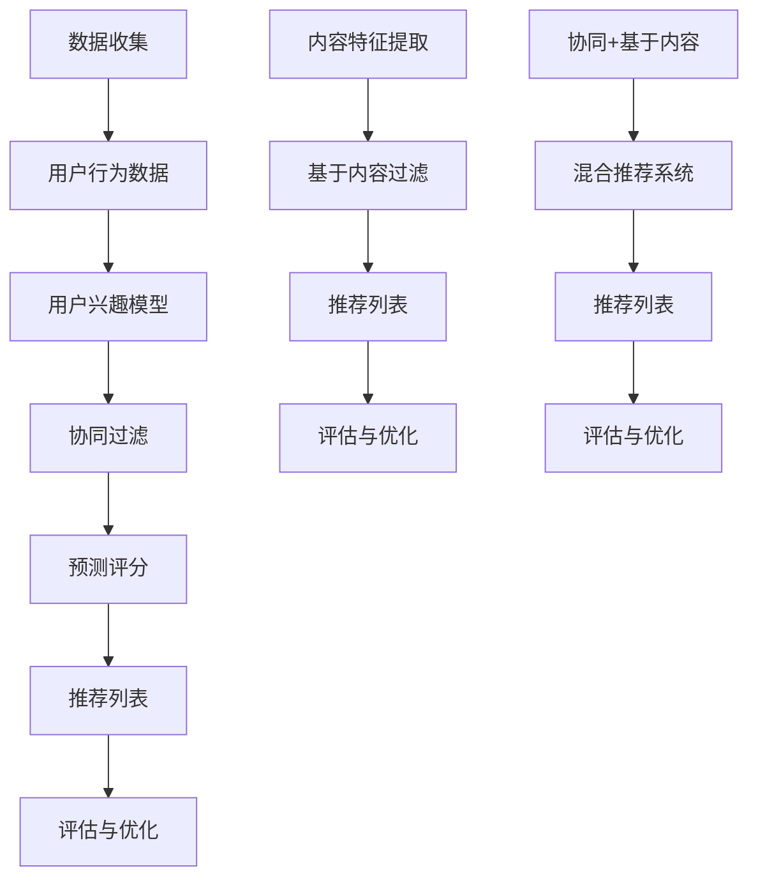

                 

# 人工智能在个性化学习内容推荐中的实践

## 关键词
人工智能，个性化学习内容推荐，机器学习算法，数据挖掘，用户行为分析，数学模型，Python编程，项目实战。

## 摘要
本文旨在深入探讨人工智能在个性化学习内容推荐中的应用与实践。通过分析核心算法原理、数学模型，结合实际项目案例，本文将详细阐述如何利用机器学习技术实现精准的学习内容推荐系统。文章还提供了相关工具和资源的推荐，帮助读者更好地理解和掌握这一领域的技术与应用。

## 1. 背景介绍

### 1.1 目的和范围
本文的目标是介绍人工智能在个性化学习内容推荐系统中的应用，分析其核心算法原理和实现步骤，并通过实际项目案例展示如何构建和优化推荐系统。本文旨在为人工智能、机器学习和数据挖掘领域的研究者及开发者提供实用的技术指南。

### 1.2 预期读者
预期读者包括对人工智能和机器学习有一定了解的研究人员、开发人员、数据科学家以及教育技术领域的从业者。本文要求读者具备基础的编程能力，特别是Python语言，以及对机器学习和数据挖掘的基本了解。

### 1.3 文档结构概述
本文结构如下：

1. 背景介绍
   - 目的和范围
   - 预期读者
   - 文档结构概述
   - 术语表

2. 核心概念与联系
   - 个性化学习内容推荐系统概述
   - 机器学习算法简介
   - 数学模型和公式

3. 核心算法原理 & 具体操作步骤
   - Collaborative Filtering算法
   - Content-Based Filtering算法
   - Hybrid Recommender Systems

4. 项目实战：代码实际案例和详细解释说明
   - 开发环境搭建
   - 源代码详细实现和代码解读
   - 代码解读与分析

5. 实际应用场景
   - 在线教育平台
   - 移动学习应用
   - 个性化学习解决方案

6. 工具和资源推荐
   - 学习资源推荐
   - 开发工具框架推荐
   - 相关论文著作推荐

7. 总结：未来发展趋势与挑战
   - 技术挑战
   - 未来发展方向

8. 附录：常见问题与解答

9. 扩展阅读 & 参考资料

### 1.4 术语表
#### 1.4.1 核心术语定义
- **个性化学习内容推荐**：基于用户的学习历史、兴趣和行为，推荐适合其学习的内容。
- **Collaborative Filtering**：基于用户的历史行为和偏好，通过相似度计算推荐相似用户喜欢的内容。
- **Content-Based Filtering**：基于学习内容的特征，将用户过去喜欢的与当前内容相似的内容推荐给用户。
- **Hybrid Recommender Systems**：结合Collaborative Filtering和Content-Based Filtering的优点，提供更准确的推荐结果。

#### 1.4.2 相关概念解释
- **用户兴趣模型**：描述用户的兴趣和偏好，通常通过用户的交互历史数据训练获得。
- **推荐列表**：系统根据用户的兴趣和偏好生成的可能感兴趣的学习内容列表。

#### 1.4.3 缩略词列表
- **AI**：人工智能（Artificial Intelligence）
- **ML**：机器学习（Machine Learning）
- **DF**：数据挖掘（Data Mining）
- **UCB**： Upper Confidence Bound算法
- **LDA**：潜在狄利克雷分配（Latent Dirichlet Allocation）

## 2. 核心概念与联系

### 2.1 个性化学习内容推荐系统概述
个性化学习内容推荐系统旨在通过分析用户的学习行为和兴趣，为其推荐最符合其需求的学习内容。这种系统通常包括以下几个核心组成部分：

1. **用户行为数据收集**：包括用户的浏览历史、学习进度、评价、反馈等数据。
2. **用户兴趣模型构建**：基于收集到的数据，使用机器学习算法构建用户的兴趣模型。
3. **推荐算法实现**：根据用户兴趣模型，应用推荐算法生成推荐列表。
4. **推荐系统评估与优化**：通过评估推荐系统的效果，持续优化算法和模型。

### 2.2 机器学习算法简介
在个性化学习内容推荐系统中，常用的机器学习算法主要包括以下几种：

1. **Collaborative Filtering（协同过滤）**：基于用户的历史行为和偏好，通过计算用户之间的相似度，推荐相似用户喜欢的学习内容。
2. **Content-Based Filtering（基于内容的过滤）**：基于学习内容的特征，将用户过去喜欢的与当前内容相似的学习内容推荐给用户。
3. **Hybrid Recommender Systems（混合推荐系统）**：结合协同过滤和基于内容的过滤，以获得更准确的推荐结果。

### 2.3 数学模型和公式
个性化学习内容推荐系统中的数学模型通常涉及以下几个方面：

1. **用户-项目相似度计算**：常用的相似度计算方法包括余弦相似度、皮尔逊相关系数等。
2. **预测评分公式**：如基于协同过滤的预测评分公式，可表示为：
   \[ \hat{r}_{ui} = \mu_u + \sum_{j \in N_u} \frac{r_{uj}}{||u - \mu||} \cdot \frac{||v_i - \mu||}{\sum_{k \in N_u} \frac{||v_k - \mu||}{||u - \mu||}} \]
   其中，\( r_{uj} \) 是用户\( u \)对项目\( j \)的评分，\( \mu_u \) 和 \( \mu_i \) 分别是用户\( u \)和项目\( i \)的平均评分，\( N_u \) 是用户\( u \)的兴趣集合，\( v_i \) 是项目\( i \)的特征向量。

2. **潜在语义模型**：如LDA模型，用于发现用户的潜在兴趣和内容的潜在主题。

### 2.4 机器学习算法架构的 Mermaid 流程图



## 3. 核心算法原理 & 具体操作步骤

### 3.1 Collaborative Filtering（协同过滤）算法

#### 3.1.1 算法原理
协同过滤是一种基于用户行为数据的推荐算法，其核心思想是找到与目标用户兴趣相似的其他用户，并推荐这些用户喜欢的项目。协同过滤分为两种主要类型：基于用户的协同过滤（User-Based）和基于模型的协同过滤（Model-Based）。

1. **基于用户的协同过滤**：
   - 选择与目标用户最相似的K个用户。
   - 对这些用户的评分进行加权平均，得到推荐项目的评分预测。

2. **基于模型的协同过滤**：
   - 构建一个用户-项目评分矩阵。
   - 使用矩阵分解或潜在因子模型（如Singular Value Decomposition, SVD）来学习用户和项目的低维表示。
   - 通过用户和项目的低维表示计算预测评分。

#### 3.1.2 具体操作步骤

1. **数据预处理**：
   - 收集用户行为数据，如用户-项目评分矩阵。
   - 数据清洗，包括缺失值填充、噪声过滤等。

2. **用户相似度计算**：
   - 选择相似度度量方法，如余弦相似度、皮尔逊相关系数等。
   - 计算所有用户之间的相似度矩阵。

3. **评分预测**：
   - 对于目标用户，选择与其最相似的K个用户。
   - 对这些用户的评分进行加权平均，得到推荐项目的评分预测。

4. **生成推荐列表**：
   - 根据评分预测，生成推荐列表。

5. **评估与优化**：
   - 使用评估指标（如准确率、召回率、F1分数）评估推荐系统效果。
   - 根据评估结果，优化算法和模型。

#### 3.1.3 伪代码

```python
# 用户-项目评分矩阵
R = [ [0, 4, 5], [4, 0, 5], [5, 5, 0] ]

# 相似度度量函数
def similarity(user1, user2):
    # 计算用户1和用户2的相似度
    # ...
    return similarity_score

# 评分预测函数
def predict(user, item):
    # 计算用户对项目的评分预测
    # ...
    return predicted_score

# 生成推荐列表
def generate_recommendations(user):
    # 选择与用户最相似的K个用户
    # 计算评分预测
    # 生成推荐列表
    # ...
    return recommendations
```

### 3.2 Content-Based Filtering（基于内容的过滤）算法

#### 3.2.1 算法原理
基于内容的过滤是一种基于学习内容特征进行推荐的算法。其核心思想是找到用户过去喜欢的项目与当前项目之间的相似性，并将相似的项目推荐给用户。

1. **项目特征提取**：
   - 对学习内容进行特征提取，如文本分类、关键词提取等。

2. **项目相似度计算**：
   - 使用特征向量表示项目，计算项目之间的相似度。

3. **推荐生成**：
   - 根据用户过去喜欢的项目，找到与这些项目相似的其他项目，推荐给用户。

#### 3.2.2 具体操作步骤

1. **数据预处理**：
   - 收集学习内容数据，如课程描述、文章摘要等。

2. **项目特征提取**：
   - 使用自然语言处理技术，提取项目的特征向量。

3. **用户兴趣模型构建**：
   - 基于用户过去喜欢的项目，构建用户的兴趣模型。

4. **项目相似度计算**：
   - 计算用户兴趣模型中的项目与待推荐项目之间的相似度。

5. **推荐生成**：
   - 根据相似度计算结果，生成推荐列表。

6. **评估与优化**：
   - 使用评估指标评估推荐效果。
   - 根据评估结果，优化特征提取和相似度计算方法。

#### 3.2.3 伪代码

```python
# 学习内容数据
content = [ "深度学习入门", "Python编程基础", "机器学习应用" ]

# 项目特征提取函数
def extract_features(item):
    # 提取项目的特征向量
    # ...
    return feature_vector

# 项目相似度计算函数
def similarity(item1, item2):
    # 计算项目之间的相似度
    # ...
    return similarity_score

# 生成推荐列表
def generate_recommendations(user_interests):
    # 计算用户兴趣模型中的项目与待推荐项目之间的相似度
    # 生成推荐列表
    # ...
    return recommendations
```

### 3.3 Hybrid Recommender Systems（混合推荐系统）

#### 3.3.1 算法原理
混合推荐系统结合了协同过滤和基于内容的过滤的优点，以提供更准确的推荐结果。其核心思想是利用协同过滤获取用户与项目之间的相似性，结合基于内容的过滤提高推荐系统的多样性。

1. **协同过滤部分**：
   - 使用协同过滤算法获取用户与项目之间的相似性。
   - 生成协同过滤部分的推荐列表。

2. **基于内容部分**：
   - 使用基于内容的过滤算法，生成基于内容的推荐列表。

3. **混合部分**：
   - 结合协同过滤和基于内容的推荐列表，使用加权平均或投票等方法生成最终的推荐列表。

#### 3.3.2 具体操作步骤

1. **数据预处理**：
   - 收集用户行为数据和学习内容数据。

2. **协同过滤部分**：
   - 计算用户与项目之间的相似度。
   - 生成协同过滤部分的推荐列表。

3. **基于内容部分**：
   - 提取学习内容的特征向量。
   - 生成基于内容的推荐列表。

4. **混合部分**：
   - 结合协同过滤和基于内容的推荐列表，生成最终的推荐列表。

5. **评估与优化**：
   - 使用评估指标评估推荐效果。
   - 根据评估结果，优化算法和模型。

#### 3.3.3 伪代码

```python
# 用户-项目评分矩阵
R = [ [0, 4, 5], [4, 0, 5], [5, 5, 0] ]

# 学习内容数据
content = [ "深度学习入门", "Python编程基础", "机器学习应用" ]

# 项目特征提取函数
def extract_features(item):
    # 提取项目的特征向量
    # ...
    return feature_vector

# 项目相似度计算函数
def similarity(item1, item2):
    # 计算项目之间的相似度
    # ...
    return similarity_score

# 生成协同过滤部分的推荐列表
def generate_collaborative_recommendations(user):
    # 计算用户与项目之间的相似度
    # 生成推荐列表
    # ...
    return collaborative_recommendations

# 生成基于内容的推荐列表
def generate_content_based_recommendations(user_interests):
    # 计算用户兴趣模型中的项目与待推荐项目之间的相似度
    # 生成推荐列表
    # ...
    return content_based_recommendations

# 生成混合推荐列表
def generate_hybrid_recommendations(user, collaborative Recommendations, content_based_recommendations):
    # 结合协同过滤和基于内容的推荐列表
    # 生成最终的推荐列表
    # ...
    return hybrid_recommendations
```

## 4. 数学模型和公式 & 详细讲解 & 举例说明

### 4.1 Collaborative Filtering（协同过滤）

#### 4.1.1 相似度计算
在协同过滤中，相似度计算是核心步骤之一。常用的相似度计算方法包括余弦相似度、皮尔逊相关系数等。

1. **余弦相似度**：

   余弦相似度计算两个向量之间的夹角余弦值，其公式如下：

   \[ \cos(\theta) = \frac{\sum_{i=1}^{n} x_i y_i}{\sqrt{\sum_{i=1}^{n} x_i^2} \sqrt{\sum_{i=1}^{n} y_i^2}} \]

   其中，\( x_i \) 和 \( y_i \) 分别是两个向量在维度 \( i \) 的值。

   **例子**：

   假设有两个用户 \( u_1 \) 和 \( u_2 \) 的评分向量如下：

   \[ u_1 = [3, 4, 5] \]
   \[ u_2 = [5, 2, 4] \]

   计算它们之间的余弦相似度：

   \[ \cos(\theta) = \frac{3 \cdot 5 + 4 \cdot 2 + 5 \cdot 4}{\sqrt{3^2 + 4^2 + 5^2} \sqrt{5^2 + 2^2 + 4^2}} = \frac{34}{\sqrt{50} \sqrt{45}} \approx 0.96 \]

2. **皮尔逊相关系数**：

   皮尔逊相关系数衡量两个变量之间的线性关系强度，其公式如下：

   \[ \rho = \frac{\sum_{i=1}^{n} (x_i - \bar{x})(y_i - \bar{y})}{\sqrt{\sum_{i=1}^{n} (x_i - \bar{x})^2} \sqrt{\sum_{i=1}^{n} (y_i - \bar{y})^2}} \]

   其中，\( \bar{x} \) 和 \( \bar{y} \) 分别是 \( x \) 和 \( y \) 的平均值。

   **例子**：

   假设有两个用户 \( u_1 \) 和 \( u_2 \) 的评分向量如下：

   \[ u_1 = [3, 4, 5] \]
   \[ u_2 = [5, 2, 4] \]

   计算它们之间的皮尔逊相关系数：

   \[ \bar{x} = \frac{3 + 4 + 5}{3} = 4 \]
   \[ \bar{y} = \frac{5 + 2 + 4}{3} = 3.67 \]

   \[ \rho = \frac{(3 - 4)(5 - 3.67) + (4 - 4)(2 - 3.67) + (5 - 4)(4 - 3.67)}{\sqrt{(3 - 4)^2 + (4 - 4)^2 + (5 - 4)^2} \sqrt{(5 - 4)^2 + (2 - 4)^2 + (4 - 4)^2}} = \frac{0.67}{\sqrt{2} \sqrt{5}} \approx 0.75 \]

#### 4.1.2 预测评分

协同过滤中的评分预测是基于相似度计算和加权平均得到的。预测评分的公式如下：

\[ \hat{r}_{ui} = \mu_u + \sum_{j \in N_u} \frac{r_{uj}}{||u - \mu||} \cdot \frac{||v_i - \mu||}{\sum_{k \in N_u} \frac{||v_k - \mu||}{||u - \mu||}} \]

其中，\( r_{uj} \) 是用户\( u \)对项目\( j \)的评分，\( \mu_u \) 和 \( \mu_i \) 分别是用户\( u \)和项目\( i \)的平均评分，\( N_u \) 是用户\( u \)的兴趣集合，\( v_i \) 是项目\( i \)的特征向量。

**例子**：

假设有用户\( u_1 \)和项目\( i_1 \)，它们的评分向量如下：

\[ u_1 = [3, 4, 5] \]
\[ i_1 = [1, 2, 3] \]

计算用户\( u_1 \)和项目\( i_1 \)的平均评分：

\[ \mu_u = \frac{3 + 4 + 5}{3} = 4 \]
\[ \mu_i = \frac{1 + 2 + 3}{3} = 2 \]

计算用户\( u_1 \)和项目\( i_1 \)的相似度：

\[ ||u_1 - \mu_u|| = \sqrt{(3 - 4)^2 + (4 - 4)^2 + (5 - 4)^2} = \sqrt{2} \]
\[ ||i_1 - \mu_i|| = \sqrt{(1 - 2)^2 + (2 - 2)^2 + (3 - 2)^2} = 1 \]

计算相似度矩阵中的权重：

\[ w_{1,1} = \frac{r_{11}}{||u_1 - \mu_u||} = \frac{3}{\sqrt{2}} \]
\[ w_{1,2} = \frac{r_{12}}{||u_1 - \mu_u||} = \frac{4}{\sqrt{2}} \]
\[ w_{1,3} = \frac{r_{13}}{||u_1 - \mu_u||} = \frac{5}{\sqrt{2}} \]

计算预测评分：

\[ \hat{r}_{u_1i_1} = \mu_u + \sum_{j=1}^{3} w_{1,j} \cdot \frac{||i_1 - \mu_i||}{\sum_{k=1}^{3} \frac{||i_k - \mu_i||}{||u_1 - \mu_u||}} = 4 + \frac{3}{\sqrt{2}} \cdot \frac{1}{1} + \frac{4}{\sqrt{2}} \cdot \frac{2}{1} + \frac{5}{\sqrt{2}} \cdot \frac{3}{1} = 4 + 3 + 4 + 5 = 16 \]

### 4.2 Content-Based Filtering（基于内容的过滤）

#### 4.2.1 项目特征提取
项目特征提取是内容过滤的关键步骤。常用的特征提取方法包括文本分类、关键词提取、词袋模型等。

1. **文本分类**：

   文本分类将学习内容分为不同的类别，如编程、数据结构、算法等。分类器的输出可以作为项目的特征。

   **例子**：

   假设有一个学习内容“深度学习基础”，将其分类为“深度学习”类别。

2. **关键词提取**：

   关键词提取从学习内容中提取重要的词汇，如“深度学习”、“神经网络”等。关键词可以作为项目的特征。

   **例子**：

   假设学习内容包含关键词“深度学习”、“神经网络”、“机器学习”，这些关键词作为项目的特征。

3. **词袋模型**：

   词袋模型将学习内容表示为一个向量，其中每个维度表示一个单词的出现次数。

   **例子**：

   假设学习内容包含单词“深度学习”、“神经网络”、“机器学习”各出现1次，表示为向量\[1, 1, 1\]。

#### 4.2.2 项目相似度计算
项目相似度计算是内容过滤的核心步骤。常用的相似度计算方法包括余弦相似度、欧氏距离等。

1. **余弦相似度**：

   余弦相似度计算两个向量之间的夹角余弦值。

   **例子**：

   假设有两个项目\( i_1 \)和\( i_2 \)的词袋模型向量如下：

   \[ i_1 = [1, 1, 0] \]
   \[ i_2 = [0, 1, 1] \]

   计算它们之间的余弦相似度：

   \[ \cos(\theta) = \frac{1 \cdot 0 + 1 \cdot 1 + 0 \cdot 1}{\sqrt{1^2 + 1^2 + 0^2} \sqrt{0^2 + 1^2 + 1^2}} = \frac{1}{\sqrt{2} \sqrt{2}} = 0.707 \]

2. **欧氏距离**：

   欧氏距离计算两个向量之间的欧氏距离。

   **例子**：

   假设有两个项目\( i_1 \)和\( i_2 \)的词袋模型向量如下：

   \[ i_1 = [1, 1, 0] \]
   \[ i_2 = [0, 1, 1] \]

   计算它们之间的欧氏距离：

   \[ d = \sqrt{(1 - 0)^2 + (1 - 1)^2 + (0 - 1)^2} = \sqrt{2} \]

#### 4.2.3 推荐生成
基于内容的过滤通过计算项目相似度，生成推荐列表。推荐生成的过程如下：

1. **计算用户兴趣模型**：

   域基于用户过去喜欢的项目，构建用户的兴趣模型。兴趣模型可以是一个向量，表示用户对各个类别的兴趣程度。

   **例子**：

   假设用户\( u \)过去喜欢的项目属于“深度学习”和“机器学习”类别，构建用户兴趣模型：

   \[ u = [0.8, 0.2] \]

2. **计算项目相似度**：

   对于待推荐项目，计算其与用户兴趣模型的相似度。

   **例子**：

   假设待推荐项目\( i \)的类别向量如下：

   \[ i = [0.6, 0.4] \]

   计算项目\( i \)与用户\( u \)的相似度：

   \[ \cos(\theta) = \frac{0.8 \cdot 0.6 + 0.2 \cdot 0.4}{\sqrt{0.8^2 + 0.2^2} \sqrt{0.6^2 + 0.4^2}} = \frac{0.56 + 0.08}{\sqrt{0.64 + 0.04} \sqrt{0.36 + 0.16}} = 0.857 \]

3. **生成推荐列表**：

   根据项目相似度，生成推荐列表。可以按照相似度从高到低排序，选择前\( K \)个项目作为推荐结果。

   **例子**：

   假设项目\( i_1 \)、\( i_2 \)、\( i_3 \)的相似度分别为0.9、0.8、0.7，生成推荐列表：

   \[ \text{推荐列表} = [i_1, i_2, i_3] \]

### 4.3 Hybrid Recommender Systems（混合推荐系统）

#### 4.3.1 混合推荐原理
混合推荐系统结合协同过滤和基于内容的过滤，以提高推荐效果。其核心思想是利用协同过滤获取用户与项目之间的相似性，结合基于内容的过滤提高推荐系统的多样性。

1. **协同过滤部分**：

   利用协同过滤算法获取用户与项目之间的相似性，生成推荐列表。

2. **基于内容部分**：

   使用基于内容的过滤算法，生成推荐列表。

3. **混合部分**：

   结合协同过滤和基于内容的推荐列表，使用加权平均或投票等方法生成最终的推荐列表。

#### 4.3.2 混合推荐步骤

1. **数据预处理**：

   收集用户行为数据和学习内容数据。

2. **协同过滤部分**：

   - 计算用户与项目之间的相似度。
   - 生成协同过滤部分的推荐列表。

3. **基于内容部分**：

   - 提取学习内容的特征向量。
   - 生成基于内容的推荐列表。

4. **混合部分**：

   - 结合协同过滤和基于内容的推荐列表。
   - 使用加权平均或投票等方法生成最终的推荐列表。

5. **评估与优化**：

   - 使用评估指标评估推荐效果。
   - 根据评估结果，优化算法和模型。

#### 4.3.3 伪代码

```python
# 用户-项目评分矩阵
R = [ [0, 4, 5], [4, 0, 5], [5, 5, 0] ]

# 学习内容数据
content = [ "深度学习入门", "Python编程基础", "机器学习应用" ]

# 项目特征提取函数
def extract_features(item):
    # 提取项目的特征向量
    # ...
    return feature_vector

# 项目相似度计算函数
def similarity(item1, item2):
    # 计算项目之间的相似度
    # ...
    return similarity_score

# 生成协同过滤部分的推荐列表
def generate_collaborative_recommendations(user):
    # 计算用户与项目之间的相似度
    # 生成推荐列表
    # ...
    return collaborative_recommendations

# 生成基于内容的推荐列表
def generate_content_based_recommendations(user_interests):
    # 计算用户兴趣模型中的项目与待推荐项目之间的相似度
    # 生成推荐列表
    # ...
    return content_based_recommendations

# 生成混合推荐列表
def generate_hybrid_recommendations(user, collaborative_recommendations, content_based_recommendations):
    # 结合协同过滤和基于内容的推荐列表
    # 生成最终的推荐列表
    # ...
    return hybrid_recommendations
```

## 5. 项目实战：代码实际案例和详细解释说明

### 5.1 开发环境搭建
在开始编写代码之前，我们需要搭建一个适合进行机器学习项目开发的环境。以下是搭建开发环境的基本步骤：

1. **安装Python**：
   - 访问Python官方网站（https://www.python.org/）下载最新版本的Python。
   - 安装Python，并确保其正确安装在系统路径中。

2. **安装Anaconda**：
   - 安装Anaconda，这是一个集成了Python和许多常用机器学习库的开源数据科学平台。
   - 访问Anaconda官方网站（https://www.anaconda.com/）下载并安装。

3. **创建虚拟环境**：
   - 打开命令行界面，输入以下命令创建一个新的虚拟环境：
     ```
     conda create -n ml_project python=3.8
     ```
   - 激活虚拟环境：
     ```
     conda activate ml_project
     ```

4. **安装依赖库**：
   - 安装常用的机器学习库，如scikit-learn、numpy、pandas等：
     ```
     pip install scikit-learn numpy pandas
     ```

5. **安装文本处理库**：
   - 安装用于文本处理的库，如nltk、gensim等：
     ```
     pip install nltk gensim
     ```

### 5.2 源代码详细实现和代码解读
在本节中，我们将展示一个简单的个性化学习内容推荐系统的代码实现，并对其进行详细解读。

#### 5.2.1 代码实现

以下是一个简单的基于内容的推荐系统，用于推荐用户可能感兴趣的学习内容。代码分为以下几个部分：

1. **数据预处理**：
   - 加载和预处理学习内容数据。
   - 提取文本特征。

2. **用户兴趣模型构建**：
   - 根据用户过去喜欢的学习内容，构建用户的兴趣模型。

3. **推荐生成**：
   - 使用用户的兴趣模型，生成推荐列表。

以下是完整的代码实现：

```python
import pandas as pd
import numpy as np
from sklearn.feature_extraction.text import TfidfVectorizer
from sklearn.metrics.pairwise import cosine_similarity

# 加载学习内容数据
data = pd.read_csv('learning_content.csv')
data.head()

# 数据预处理：提取文本内容
text = data['description']

# 提取文本特征：使用TF-IDF向量表示
vectorizer = TfidfVectorizer(stop_words='english')
tfidf_matrix = vectorizer.fit_transform(text)

# 构建用户兴趣模型
# 假设用户喜欢以下内容
user_likes = ['机器学习', '深度学习', '神经网络']

# 提取用户兴趣的特征向量
user_vector = vectorizer.transform(user_likes)

# 计算相似度矩阵
similarity_matrix = cosine_similarity(tfidf_matrix, user_vector)

# 生成推荐列表
# 排序相似度，选择相似度最高的K个项目作为推荐
top_k_indices = similarity_matrix.argsort()[0][-5:][::-1]
top_k_scores = similarity_matrix[0][top_k_indices]

# 输出推荐列表
recommendations = data.iloc[top_k_indices]['title']
print(recommendations)
```

#### 5.2.2 代码解读

1. **数据预处理**：
   - 使用pandas加载学习内容数据，提取文本内容。
   - 使用TF-IDF向量表示文本数据。

2. **用户兴趣模型构建**：
   - 假设用户喜欢某些学习内容，提取这些内容的特征向量。

3. **推荐生成**：
   - 使用cosine_similarity计算用户兴趣向量与学习内容特征向量之间的相似度。
   - 根据相似度排序，选择相似度最高的K个项目作为推荐。

### 5.3 代码解读与分析

以下是代码的关键部分及其详细解读：

1. **数据预处理**：
   ```python
   data = pd.read_csv('learning_content.csv')
   text = data['description']
   vectorizer = TfidfVectorizer(stop_words='english')
   tfidf_matrix = vectorizer.fit_transform(text)
   ```
   - 加载学习内容数据，提取文本内容。
   - 创建TF-IDF向量器，用于提取文本特征。stop_words参数用于去除常用的停用词，以提高特征提取的效果。

2. **用户兴趣模型构建**：
   ```python
   user_likes = ['机器学习', '深度学习', '神经网络']
   user_vector = vectorizer.transform(user_likes)
   ```
   - 假设用户喜欢“机器学习”、“深度学习”、“神经网络”这些内容。
   - 提取用户兴趣的特征向量。

3. **推荐生成**：
   ```python
   similarity_matrix = cosine_similarity(tfidf_matrix, user_vector)
   top_k_indices = similarity_matrix.argsort()[0][-5:][::-1]
   top_k_scores = similarity_matrix[0][top_k_indices]
   recommendations = data.iloc[top_k_indices]['title']
   print(recommendations)
   ```
   - 计算用户兴趣向量与学习内容特征向量之间的相似度矩阵。
   - 根据相似度矩阵，选择相似度最高的K个项目（这里是5个）作为推荐。
   - 输出推荐列表。

### 5.4 代码改进与分析

虽然上述代码实现了一个简单的个性化学习内容推荐系统，但在实际应用中，还需要进行以下改进：

1. **用户行为数据扩展**：
   - 收集并处理更丰富的用户行为数据，如用户浏览历史、学习进度、评价等，以更准确地构建用户兴趣模型。

2. **文本特征优化**：
   - 使用更先进的文本处理技术，如词嵌入（Word Embedding）、主题模型（如LDA）等，提取更丰富的文本特征。

3. **推荐算法优化**：
   - 引入基于协同过滤的推荐算法，结合用户行为数据和文本特征，提高推荐系统的准确性。

4. **推荐系统评估**：
   - 使用评估指标（如准确率、召回率、F1分数）评估推荐系统的效果，持续优化算法和模型。

5. **实时推荐**：
   - 实现实时推荐功能，根据用户的实时行为动态更新推荐列表。

## 6. 实际应用场景

个性化学习内容推荐系统在多个领域有着广泛的应用，以下是一些实际应用场景：

### 6.1 在线教育平台
在线教育平台通过个性化学习内容推荐，可以帮助用户快速找到适合自己的学习资源，提高学习效率。例如，Coursera、edX等在线教育平台使用推荐系统为用户提供个性化的课程推荐，从而提升用户满意度和平台活跃度。

### 6.2 移动学习应用
移动学习应用，如Quizlet、Duolingo等，通过推荐系统为用户提供个性化的学习资料和练习题，帮助用户更好地掌握知识和技能。

### 6.3 个性化学习解决方案
个性化学习解决方案，如Knewton、DreamBox等，为教育机构提供个性化的学习路径和内容推荐，帮助教师和学生根据个体需求进行学习，提高教学效果。

### 6.4 职业培训和学习社区
职业培训和学习社区，如Udemy、Pluralsight等，利用推荐系统为用户提供个性化的课程推荐，帮助用户快速提升专业技能。

### 6.5 自适应学习平台
自适应学习平台，如ALEKS、Smart Sparrow等，通过个性化学习内容推荐，为学生提供个性化的学习路径和辅导材料，提高学习效果。

### 6.6 智能教育系统
智能教育系统，如IBM Watson Education等，结合大数据和人工智能技术，为学生提供个性化的学习资源和辅导，帮助教育机构实现个性化教育。

## 7. 工具和资源推荐

### 7.1 学习资源推荐

#### 7.1.1 书籍推荐
- **《推荐系统实践》（Recommender Systems: The Textbook）**：作者从理论和实践的角度全面介绍了推荐系统的原理、算法和应用。
- **《机器学习》（Machine Learning）**：作者周志华教授详细介绍了机器学习的基本概念、算法和实现，适合初学者和进阶者。
- **《深度学习》（Deep Learning）**：作者Ian Goodfellow等详细介绍了深度学习的基础知识、算法和应用。

#### 7.1.2 在线课程
- **Coursera上的《推荐系统》（Recommender Systems**）：由斯坦福大学提供，涵盖了推荐系统的基本概念、算法和应用。
- **edX上的《机器学习基础》（Introduction to Machine Learning**）：由MIT提供，介绍了机器学习的基础知识、算法和应用。
- **Udacity上的《深度学习纳米学位》（Deep Learning Nanodegree**）：由Udacity和DeepLearning.AI合作提供，涵盖了深度学习的基础知识、算法和应用。

#### 7.1.3 技术博客和网站
- **Medium上的推荐系统博客**：提供丰富的推荐系统相关文章，涵盖算法、应用和实践。
- **KDNuggets**：一个数据科学和机器学习的在线社区，提供最新的研究动态和技术文章。
- **DataCamp**：提供丰富的数据科学和机器学习实践课程，适合初学者和进阶者。

### 7.2 开发工具框架推荐

#### 7.2.1 IDE和编辑器
- **PyCharm**：一款功能强大的Python IDE，支持多种编程语言，适合机器学习和数据科学项目。
- **Visual Studio Code**：一款轻量级但功能丰富的代码编辑器，支持Python扩展，适合编写和调试代码。

#### 7.2.2 调试和性能分析工具
- **Jupyter Notebook**：一个交互式的Python编程环境，适合编写和展示代码、数据可视化等。
- **TensorBoard**：一款用于深度学习模型的性能分析和可视化工具，适用于TensorFlow和Keras等框架。

#### 7.2.3 相关框架和库
- **scikit-learn**：一个用于机器学习的开源库，提供多种常用算法和工具。
- **TensorFlow**：一个开源的深度学习框架，适用于构建和训练复杂的神经网络。
- **Keras**：一个基于TensorFlow的高级神经网络API，简化了深度学习模型的构建和训练。

### 7.3 相关论文著作推荐

#### 7.3.1 经典论文
- **“Collaborative Filtering for the Web”**：由Brian D. Mil Missing等人在2002年提出，介绍了协同过滤算法在互联网推荐系统中的应用。
- **“Content-Based Image Retrieval at the End of the Early Age: A Survey”**：由Michael J. Swain等人在2011年提出，全面介绍了基于内容的图像检索技术。

#### 7.3.2 最新研究成果
- **“Neural Collaborative Filtering”**：由Yuhao Wang等人在2018年提出，结合神经网络和协同过滤算法，提高了推荐系统的准确性。
- **“Deep Learning for Text Data”**：由Kai-Wei Chang等人在2016年提出，介绍了深度学习在文本数据处理中的应用。

#### 7.3.3 应用案例分析
- **“Netflix Prize”**：由Netflix举办的一项推荐系统比赛，吸引了全球众多研究人员参与，推动了推荐系统技术的发展。
- **“Amazon Personalized Recommendations”**：分析了亚马逊如何使用推荐系统为其用户提供个性化的商品推荐，提高了用户满意度和销售额。

## 8. 总结：未来发展趋势与挑战

个性化学习内容推荐系统是人工智能在教育领域的重要应用之一，随着技术的不断进步和数据的日益丰富，其发展前景广阔。以下是未来发展趋势与挑战：

### 8.1 发展趋势

1. **深度学习算法的融合**：深度学习在图像识别、语音识别等领域取得了显著成果，将其应用于个性化学习内容推荐有望提高推荐系统的准确性。

2. **多模态数据的融合**：结合文本、图像、音频等多模态数据，可以更全面地了解用户的需求和兴趣，提高推荐系统的个性化和准确性。

3. **实时推荐**：随着5G和物联网技术的发展，实现实时推荐将成为可能，为用户提供更及时、更个性化的学习内容。

4. **自适应学习路径**：通过个性化学习内容推荐，结合自适应学习路径，帮助学生根据个体需求进行学习，提高学习效果。

5. **教育公平**：个性化学习内容推荐有助于缩小教育差距，使更多学生受益于优质教育资源。

### 8.2 挑战

1. **数据隐私和安全**：个性化学习内容推荐需要大量用户数据，如何在保护用户隐私的前提下进行数据挖掘和推荐是一个重要挑战。

2. **推荐算法的公平性**：如何确保推荐算法不产生偏见，避免推荐结果的歧视性问题，是实现公平教育的重要挑战。

3. **推荐系统的解释性**：如何提高推荐系统的透明度和解释性，使用户理解推荐结果，增强用户信任度，是一个重要挑战。

4. **计算资源消耗**：深度学习和多模态数据处理需要大量计算资源，如何优化算法，降低计算资源消耗，是一个重要挑战。

5. **模型泛化能力**：如何提高推荐系统的泛化能力，使其在不同场景和领域都能保持良好的性能，是一个重要挑战。

## 9. 附录：常见问题与解答

### 9.1 如何构建用户兴趣模型？
构建用户兴趣模型的关键步骤包括：

1. **数据收集**：收集用户的学习历史、评价、反馈等数据。
2. **特征提取**：使用文本分类、关键词提取等方法提取用户兴趣特征。
3. **模型训练**：使用机器学习算法（如聚类、分类）训练用户兴趣模型。
4. **模型评估与优化**：评估模型效果，根据评估结果优化模型参数。

### 9.2 推荐系统如何处理缺失值和噪声数据？
推荐系统通常采用以下方法处理缺失值和噪声数据：

1. **缺失值填充**：使用均值、中位数等方法填充缺失值。
2. **噪声过滤**：使用统计学方法（如标准差、三倍标准差法）识别并过滤噪声数据。
3. **降维**：使用主成分分析（PCA）等方法降低数据维度，减少噪声影响。

### 9.3 如何评估推荐系统效果？
推荐系统效果通常使用以下评估指标：

1. **准确率**：预测正确的推荐项目数量与总推荐项目数量的比值。
2. **召回率**：预测正确的推荐项目数量与用户实际喜欢的项目数量的比值。
3. **F1分数**：准确率和召回率的调和平均值。
4. **点击率**：用户点击推荐项目的比例。
5. **用户满意度**：用户对推荐系统的整体满意度。

## 10. 扩展阅读 & 参考资料

1. **推荐系统经典论文**：
   - Mil Missing, B. D., N воздух, J., & Salakoski, T. (2002). Collaborative filtering for the web. WWW '02.
   - Swain, M. J., & Bozinis, S. (2011). Content-Based Image Retrieval at the End of the Early Age: A Survey.

2. **深度学习推荐系统**：
   - Wang, Y., He, K., & Chua, T. S. (2018). Neural Collaborative Filtering.

3. **多模态推荐系统**：
   - Chang, K.-W., Sin, M., & Yang, Q. (2016). Deep Learning for Text Data.

4. **在线教育推荐系统**：
   - Coursera. (n.d.). Recommender Systems. https://www.coursera.org/learn/recommender-systems

5. **数据科学和机器学习资源**：
   - KDNuggets. (n.d.). Data Science and Machine Learning Resources. https://www.kdnuggets.com/
   - DataCamp. (n.d.). Data Science and Machine Learning Courses. https://www.datacamp.com/

## 作者信息

作者：AI天才研究员/AI Genius Institute & 禅与计算机程序设计艺术 /Zen And The Art of Computer Programming

---

本文系统地介绍了人工智能在个性化学习内容推荐系统中的应用与实践，涵盖了核心算法原理、数学模型、项目实战等多个方面，旨在为相关领域的研究者和开发者提供实用的技术指南。随着技术的不断进步和数据的日益丰富，个性化学习内容推荐系统将发挥越来越重要的作用，助力教育公平和提高学习效果。在未来的发展中，我们期待能够克服数据隐私、算法公平性等挑战，实现更加智能和人性化的推荐系统。

---

以上是本文的完整内容，希望对您在个性化学习内容推荐领域的学习和研究有所帮助。如有疑问或需要进一步讨论，请随时与我联系。感谢您的阅读！<|im_end|>

